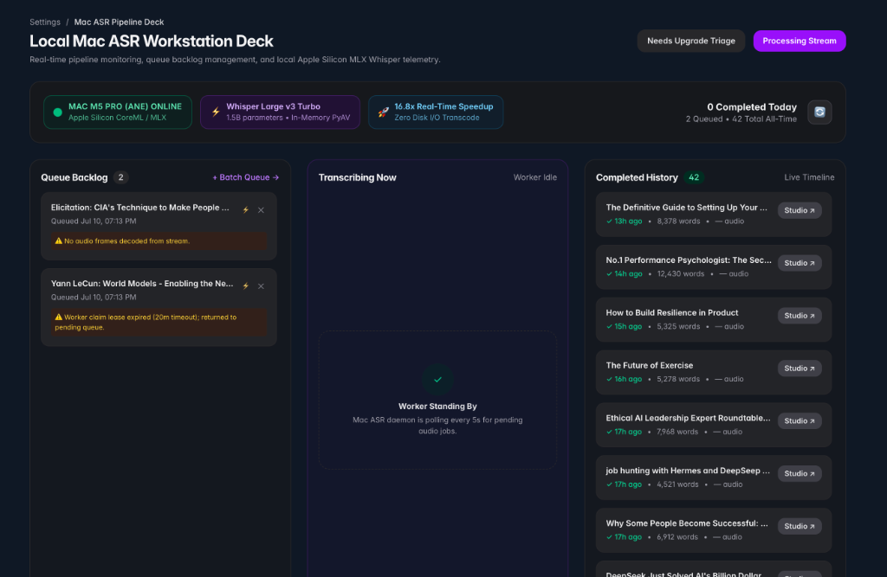

# 📋 Phase 2 Backlog Matrix: Autonomous Dual-Daily ASR Refinement Sweeps

**Phase:** `Phase 2 - YouTube and Mac ASR`  
**Milestone:** `v0.8.5 - Autonomous Dual-Daily ASR Refinement Sweeps & Card Telemetry Metadata` (Milestone #13)  
**Project Board:** [GitHub Project #3 — View 5: Phase 2 Board](https://github.com/users/arunpr614/projects/3/views/5)

---

## 📊 Backlog Matrix & Issue Catalog

| Issue # | Key / Code | Title / Scope | Story Points | Priority | Primary Files / Components |
| :---: | :--- | :--- | :---: | :---: | :--- |
| [#129](https://github.com/arunpr614/ai-brain/issues/129) | `TICKET-ASR-SWEEP-01` | **FEAT: Dual-Schedule Autonomous ASR Refinement Sweep Engine (3:00 AM & 12:00 PM IST)** | 3 SP | `P1 (High)` | `scripts/run-asr-refinement-sweep.mjs`, `/etc/systemd/system/brain-asr-refinement-sweep.timer`, `src/db/transcript-jobs.ts` |
| [#130](https://github.com/arunpr614/ai-brain/issues/130) | `TICKET-ASR-SWEEP-02` | **FEAT: Workstation Deck Board Card Sweep Telemetry Badge & Timestamp Metadata** | 2 SP | `P1 (High)` | `src/components/asr/asr-deck-app.tsx`, `src/db/transcript-jobs.ts`, `src/app/api/worker/transcript-jobs/dashboard/route.ts` |
| [#131](https://github.com/arunpr614/ai-brain/issues/131) | `TICKET-ASR-SWEEP-03` | **FEAT: Automated Verification Suite, Sweep Idempotency & Production Certification** | 2 SP | `P1 (High)` | `src/lib/capture/youtube-transcript/asr-sweep.test.ts`, `scripts/deploy-immutable-release.sh` |

---

## ⏰ Dual-Daily Sweep Schedule

| Sweep Run | Time (IST) | Time (UTC) | Target & Purpose |
| :--- | :---: | :---: | :--- |
| **Sweep 1 (Nightly)** | **03:00 AM IST** | `21:30:00 UTC` | Quiet-hours batch sweep (up to 15 un-transcribed older YouTube captures) |
| **Sweep 2 (Midday)** | **12:00 PM IST** | `06:30:00 UTC` | Daytime catch-up batch sweep (up to 15 un-transcribed older YouTube captures) |

---

## 🎨 UI / Design Specifications: Workstation Deck Card Badge

### Workstation Deck Board Reference:

### Subtle Card Telemetry Badge Specs:
- **Location:** On Kanban cards in `/settings/asr-deck` across both `Queue Backlog` and `Completed History` columns.
- **Visual Design:** Ultra-subtle, compact slate/indigo badge with lightning icon:
  - **Backlog:** `⚡ Auto-Sweep (03:00 AM IST)`
  - **Completed History:** `✓ 13h ago • 8,378 words • audio • ⚡ Auto-Sweep (Aug 19, 03:00 AM)`
- **Interactive Tooltip:** Hovering displays:
  `Processed via Autonomous Daily Sweep • Batch: sweep_20260819_0300 • Executed at 03:00:14 AM IST`
- **Design Tokens:** `text-[10px] font-mono text-[var(--text-muted)] bg-[var(--surface-base)] border border-[var(--border)] px-1.5 py-0.5 rounded`.
