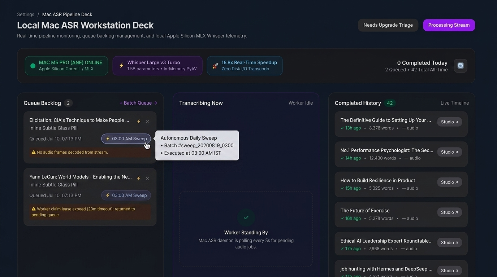

# 📋 Phase 2 Backlog Matrix: Autonomous Dual-Daily ASR Refinement Sweeps

**Phase:** `Phase 2 - YouTube and Mac ASR`  
**Milestone:** `v0.8.5 - Autonomous Dual-Daily ASR Refinement Sweeps & Card Telemetry Metadata` (Milestone #13)  
**Project Board:** [GitHub Project #3 — View 5: Phase 2 Board](https://github.com/users/arunpr614/projects/3/views/5)

---

## 📊 Backlog Matrix & Issue Catalog

| Issue # | Key / Code | Title / Scope | Story Points | Priority | Primary Files / Components |
| :---: | :--- | :--- | :---: | :---: | :--- |
| [#129](https://github.com/arunpr614/ai-brain/issues/129) | `TICKET-ASR-SWEEP-01` | **FEAT: Dual-Schedule Autonomous ASR Refinement Sweep Engine (3:00 AM & 12:00 PM IST)** | 3 SP | `P1 (High)` | `scripts/run-asr-refinement-sweep.mjs`, `/etc/systemd/system/brain-asr-refinement-sweep.timer`, `src/db/transcript-jobs.ts` |
| [#130](https://github.com/arunpr614/ai-brain/issues/130) | `TICKET-ASR-SWEEP-02` | **FEAT: Workstation Deck Board Card Sweep Telemetry Badge & Timestamp Metadata (Option 1 Design)** | 2 SP | `P1 (High)` | `src/components/asr-deck/asr-deck-client.tsx`, `src/db/transcript-jobs.ts`, `src/app/api/worker/transcript-jobs/dashboard/route.ts` |
| [#131](https://github.com/arunpr614/ai-brain/issues/131) | `TICKET-ASR-SWEEP-03` | **FEAT: Automated Verification Suite, Sweep Idempotency & Production Certification** | 2 SP | `P1 (High)` | `src/lib/capture/youtube-transcript/asr-sweep.test.ts`, `scripts/deploy-immutable-release.sh` |
| [#132](https://github.com/arunpr614/ai-brain/issues/132) | `TICKET-ASR-SWEEP-04` | **FEAT: Real-Time Dashboard Live Refresh & Sweep Batch Progress Indicators** | 2 SP | `P2 (Medium)` | `src/components/asr-deck/asr-deck-client.tsx`, `src/app/api/worker/transcript-jobs/dashboard/route.ts` |

---

## ⏰ Dual-Daily Sweep Schedule

| Sweep Run | Time (IST) | Time (UTC) | Target & Purpose |
| :--- | :---: | :---: | :--- |
| **Sweep 1 (Nightly)** | **03:00 AM IST** | `21:30:00 UTC` | Quiet-hours batch sweep (up to 15 un-transcribed older YouTube captures) |
| **Sweep 2 (Midday)** | **12:00 PM IST** | `06:30:00 UTC` | Daytime catch-up batch sweep (up to 15 un-transcribed older YouTube captures) |

---

## 🎨 Approved UI Design Specification: Option 1 (Inline Glass Pill + Hover Popover)

### Approved Visual Prototype (Option 1):


### Multi-Column Visibility Requirements:
1. **Queue Backlog (Column 1):** Under card title, rendered inline alongside `Queued [timestamp]` as `[ ⚡ 03:00 AM Sweep ]`.
2. **Transcribing Now (Column 2):** In active inference telemetry row as `⚡ Active Sweep Batch (#sweep_20260819_0300)`.
3. **Completed History (Column 3):** Rendered inline alongside `✓ 13h ago • 8,378 words • audio • [ ⚡ 03:00 AM Sweep • Aug 19 ]`.

### Interactive Tooltip / Popover Contract:
```
┌────────────────────────────────────────────────────────┐
│  ⚡ Autonomous Daily Sweep                             │
│  • Batch ID: #sweep_20260819_0300                      │
│  • Scheduled Run: 03:00 AM IST (21:30 UTC)             │
│  • Enqueued At: Aug 19, 2026, 03:00:12 AM IST          │
│  • Priority Class: P3 Background Sweep (Priority 15)   │
└────────────────────────────────────────────────────────┘
```

### Tailwind Tokens:
- **Pill Container:** `inline-flex items-center gap-1 text-[10px] font-mono font-medium text-purple-700 bg-purple-50 border border-purple-200 dark:text-purple-300 dark:bg-purple-950/40 dark:border-purple-800/60 px-2 py-0.5 rounded-full`
- **Icon:** `h-3 w-3 text-amber-500 dark:text-amber-400`
- **Tooltip Container:** `rounded-xl p-3 bg-zinc-900/95 border border-zinc-700/60 text-xs shadow-xl backdrop-blur-md text-zinc-200`
