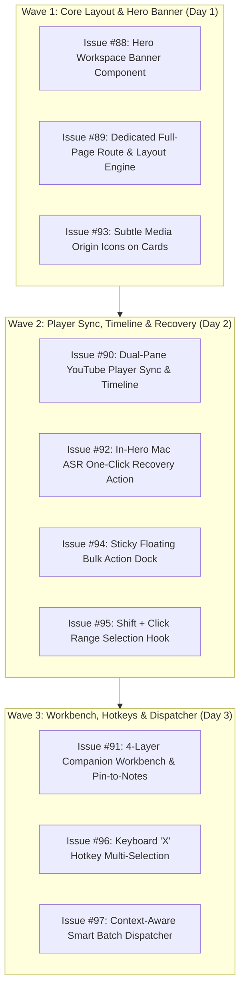

# 🚀 Autonomous Master Handover Document: Phase 3 (Reading Studio & Triage Suite)

**Project Folder:** `/Users/arun.prakash/Documents/ArunVault2026-2/Initiatives/Arun_AI_Projects/ai-brain/AGY_Phase3_Aug2026`  
**Timestamp:** `2026-08-18T16:00:00+05:30`  
**Milestone:** `v0.9.x - Kanban Card Processing & Reading Studio`  
**Target Phase:** Phase 3 (Reading Studio & Triage) / Phase 3.5 Finalization  
**Epic Key:** `EPIC-STUDIO-01`  
**GitHub Project Board:** [AI Brain / AI Memory — Project #3 (Phase 3 Board View)](https://github.com/users/arunpr614/projects/3/views/6)  
**Primary Repository:** `https://github.com/arunpr614/ai-brain`  
**Active Worktree Path:** `/Users/arun.prakash/Documents/ArunVault2026-2/Initiatives/Arun_AI_Projects/AGY_Phase_2_YouTube_Mac_ASR/worktrees/wt-worker-api`  
**Active Working Branch:** `feat/phase3-reading-studio-triage` (Current Commit: `c89f8e3`)

---

## 🧭 INSTRUCTIONS FOR THE NEXT AI AGENT

> [!IMPORTANT]
> **PRIMARY PROJECT FOLDER:** Use `/Users/arun.prakash/Documents/ArunVault2026-2/Initiatives/Arun_AI_Projects/ai-brain/AGY_Phase3_Aug2026` as your root directory for all Phase 3 specs, asset mockups, and handover context.
>
> You are fully authorized to **autonomously execute all 13 Phase 3 tickets, run verification suites, merge the feature branch into main, and deploy to production without waiting for user approval**.

---

## 📂 Phase 3 Project Folder Structure (`AGY_Phase3_Aug2026/`)

```
/Users/arun.prakash/Documents/ArunVault2026-2/Initiatives/Arun_AI_Projects/ai-brain/AGY_Phase3_Aug2026/
├── README.md                                                 # Project folder index & quick-start guide
├── HANDOVER_PHASE_3_READING_STUDIO_AND_TRIAGE.md             # This comprehensive master handover document
├── specs/                                                    # Product Council PRDs, UX Specs & Jira Backlogs
│   ├── PRD_READING_STUDIO_FULL_PAGE_AND_HERO.md              # Reading Studio & Hero Banner PRD
│   ├── PRD_BATCH_TRIAGE_AND_KEYBOARD_SELECTION_SUITE.md      # Batch Triage & Range Selection PRD
│   ├── UX_SPEC_READING_STUDIO_HERO_AND_PAGE.md               # Reading Studio Layout & Design Tokens Spec
│   ├── UX_SPEC_BATCH_TRIAGE_AND_RANGE_SELECTION.md           # Bulk Action Dock, Selection & Hotkeys UX Spec
│   ├── JIRA_BACKLOG_READING_STUDIO_EXECUTION_TICKETS.md      # Tickets #88, #89, #90, #91, #92, #93 Backlog
│   └── JIRA_BACKLOG_BATCH_TRIAGE_TICKETS.md                  # Tickets #94, #95, #96, #97 Backlog
└── assets/                                                   # Visual design mockups & prototype screenshots
    ├── studio_hero_banner_1787034665859.jpg                  # Option 2 Hero Workspace Banner design
    ├── studio_header_action_1787034614056.jpg                # Reading Studio top chrome breadcrumb bar
    ├── studio_action_bar_1787035315706.jpg                   # Workspace action bar
    ├── studio_sidebar_widget_1787035627004.jpg               # Quick slide-over drawer
    ├── repair_center_matrix_deck_1787042289773.jpg           # Option 1A Health Matrix & Triage Deck
    ├── repair_center_split_workbench_1787042311047.jpg       # Option 1B Split-Workbench Lab
    ├── repair_card_subtle_youtube_icon_1787045734719.jpg     # Variation A subtle trailing YouTube icon
    ├── repair_card_subtle_icon_lead_1787045761460.jpg        # Variation B leading platform badge
    ├── processing_kanban_hud_1787042463643.jpg               # Option 2A Cognitive Kanban with HUD
    └── processing_stream_palette_1787043339089.jpg           # Option 2B High-Velocity Stream & Live Peek
```

---

## 🎨 Verified Live Interactive Prototypes

To start and verify the interactive throwaway prototypes, run `npm run dev` in the active worktree:
- **Unified Phase 3 Prototype Hub:** `http://localhost:3000/prototype/phase3-suite`
- **Option 1A Capture Quality Repair Center:** `http://localhost:3000/prototype/repair-center`
- **Option 2B Processing Stream & Live Peek:** `http://localhost:3000/prototype/processing-stream`
- **Option 2 Dedicated Full-Page Reading Studio:** `http://localhost:3000/prototype/reading-studio-hero/studio`

---

## 🎟️ Complete Phase 3 Jira / GitHub Execution Backlog (All in Project #3 `Todo`)

All 13 issues are linked to **Milestone `v0.9.x`** and assigned to **`Phase 3 - Reading Studio and Triage`** in **[GitHub Project #3 Board View](https://github.com/users/arunpr614/projects/3/views/6)**:

| Issue # | Area | Title | Story Points | Priority | Primary Target Files |
|:---:|:---:|:---|:---:|:---:|:---|
| **[#88](https://github.com/arunpr614/ai-brain/issues/88)** | Core UI | `FEAT(studio): Integrated Hero Workspace Banner Component for Item Detail Page` | 5 SP | P1 (Blocker) | `src/components/reading-studio/hero-workspace-banner.tsx`<br>`src/app/items/[id]/page.tsx` |
| **[#89](https://github.com/arunpr614/ai-brain/issues/89)** | Routing | `FEAT(studio): Dedicated Full-Page Reading Studio Route & Layout Engine` | 5 SP | P1 (Blocker) | `src/app/library/[id]/read/page.tsx`<br>`src/app/items/[id]/read/page.tsx`<br>`src/components/reading-studio/split-pane-container.tsx` |
| **[#90](https://github.com/arunpr614/ai-brain/issues/90)** | Player | `FEAT(studio): Dual-Pane YouTube Player Sync & Interactive Transcript Timeline` | 8 SP | P1 | `src/components/reading-studio/youtube-player-sync.tsx`<br>`src/components/reading-studio/transcript-timeline.tsx`<br>`src/lib/reading-studio/player-sync-context.tsx` |
| **[#91](https://github.com/arunpr614/ai-brain/issues/91)** | Notes | `FEAT(studio): Multi-Layer Companion Workbench & Live Pin-to-Notes Event Bus` | 8 SP | P2 | `src/components/reading-studio/multi-layer-companion-tabs.tsx`<br>`src/components/manual-note-editor.tsx`<br>`src/lib/reading-studio/note-event-bus.ts` |
| **[#92](https://github.com/arunpr614/ai-brain/issues/92)** | ASR | `FEAT(repair): In-Hero Mac ASR One-Click Queueing & Degraded State Recovery Action` | 5 SP | P1 | `src/app/needs-upgrade/actions.ts`<br>`src/components/reading-studio/hero-workspace-banner.tsx`<br>`src/components/reading-studio/asr-recovery-callout.tsx` |
| **[#93](https://github.com/arunpr614/ai-brain/issues/93)** | UI Polish | `FEAT(repair): Subtle Media Origin Icons & Sticky Floating Batch Selection Dock on Quality Triage Cards` | 3 SP | P2 | `src/app/needs-upgrade/page.tsx`<br>`src/components/reading-studio/hero-workspace-banner.tsx` |
| **[#94](https://github.com/arunpr614/ai-brain/issues/94)** | Dock | `FEAT(triage): Sticky Floating Bulk Action Dock with Dynamic Selection Counter` | 5 SP | P0 (Blocker) | `src/components/repair/floating-bulk-dock.tsx`<br>`src/app/needs-upgrade/page.tsx`<br>`src/components/processing/processing-app.tsx` |
| **[#95](https://github.com/arunpr614/ai-brain/issues/95)** | Selection | `FEAT(triage): Shift + Click Contiguous Range Selection for Triage Cards` | 3 SP | P0 (Blocker) | `src/lib/triage/use-range-selection.ts`<br>`src/app/needs-upgrade/page.tsx` |
| **[#96](https://github.com/arunpr614/ai-brain/issues/96)** | Hotkeys | `FEAT(triage): Keyboard 'X' Hotkey Multi-Selection for Stream and Kanban Cards` | 3 SP | P1 | `src/lib/triage/use-keyboard-triage.ts`<br>`src/components/processing/processing-app.tsx` |
| **[#97](https://github.com/arunpr614/ai-brain/issues/97)** | Pipeline | `FEAT(triage): Context-Aware Smart Batch Action Dispatcher & Auto-Remediation Workflow` | 5 SP | P1 | `src/lib/triage/batch-dispatcher.ts`<br>`src/app/needs-upgrade/actions.ts` |
| **[#61](https://github.com/arunpr614/ai-brain/issues/61)** | Feature | `FCP-001: Capture Quality Repair Center & Needs-Upgrade Triage` | 8 SP | P1 | `src/app/needs-upgrade/page.tsx` |
| **[#62](https://github.com/arunpr614/ai-brain/issues/62)** | Feature | `FCP-002: Source Workspace Reading Studio Lite & Markdown Notes` | 8 SP | P1 | `src/app/library/[id]/read/page.tsx` |
| **[#63](https://github.com/arunpr614/ai-brain/issues/63)** | Feature | `FEATURE: Processing Inbox & Direct Kanban Triage` | 8 SP | P1 | `src/components/processing/processing-app.tsx` |

---

## 🏗️ 3-Wave Execution Sequence for Autonomous Implementation



---

## 🚀 Quality Gates & Production Deployment Protocol

```bash
cd /Users/arun.prakash/Documents/ArunVault2026-2/Initiatives/Arun_AI_Projects/AGY_Phase_2_YouTube_Mac_ASR/worktrees/wt-worker-api

# 1. Typecheck (Must be 0 errors)
npm run typecheck

# 2. Linting (Must be 0 errors)
npm run lint

# 3. Unit & Integration Tests (100% pass)
npm test

# 4. Production Next.js Build
npm run build

# 5. Merge into main branch
git checkout main
git pull origin main
git merge --no-ff feat/phase3-reading-studio-triage -m "feat(phase3): merge Phase 3 Reading Studio, Hero Banner, and Batch Triage Suite (v0.9.0)"
git push origin main

# 6. Tag release & close milestone
git tag -a v0.9.0 -m "Release v0.9.0: Full-Page Reading Studio, Integrated Hero Banner & High-Throughput Batch Triage Engine"
git push origin v0.9.0
gh api -X PATCH /repos/arunpr614/ai-brain/milestones/3 -f state="closed"
```

---

## 🎨 Key Design Tokens Reference

- **Base Background:** `var(--surface-base)` (`#FBFCFE` light, `#101825` dark)
- **Surfaces & Cards:** `var(--surface)` (`#FFFFFF` light, `#162235` dark) and `var(--surface-raised)` (`#FFFFFF` light, `#1B2A40` dark)
- **Borders:** `var(--border)` (`#D7DFEA` light, `#2B3B52` dark) and `var(--border-strong)` (`#A9B8CD` light, `#41546F` dark)
- **Primary Action Button:** `bg-[var(--action-primary-bg)] text-[var(--action-primary-fg)]`
- **Fidelity Accents:**
  - Gold (Teal): `var(--teal)` (`#18A999` light / `#4DD7C8` dark)
  - Degraded (Ruby): `var(--ruby)` (`#E63B6F` light / `#FF6D98` dark)
  - Article (Cyan): `var(--cyan)` (`#0891B2` light / `#67E8F9` dark)
- **Focus Rings:** `focus-visible:ring-2 focus-visible:ring-[var(--accent-9)] focus-visible:ring-offset-2`
- **Zero Modal Readers:** All reading workflows must render inside `/library/[id]/read` or `/prototype/reading-studio-hero/studio`.

---
*Authored by Antigravity Agent for immediate autonomous execution.*
