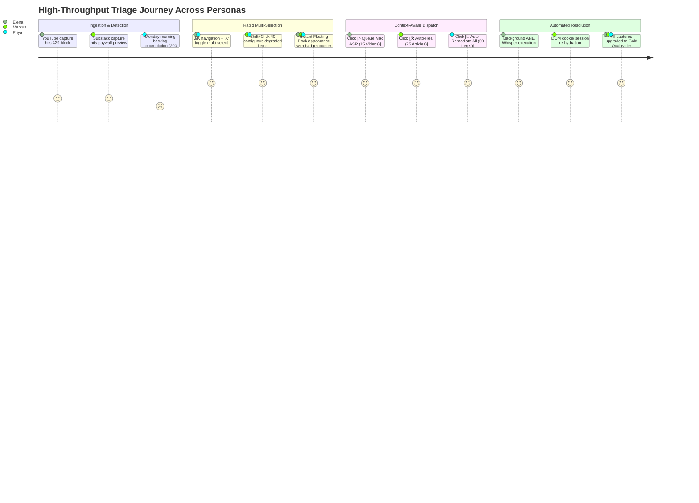
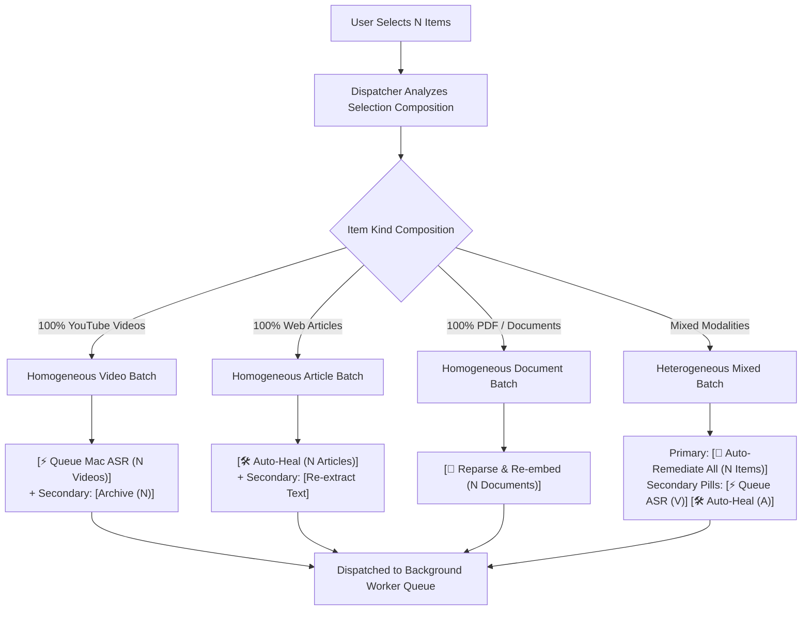
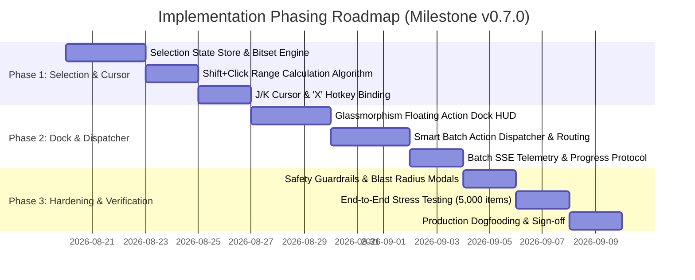

# Product Requirements Document (PRD)
# High-Throughput Batch Triage, Shift-Click Range Selection & Keyboard Multi-Select Suite

| Metadata | Specification Details |
| :--- | :--- |
| **Document ID** | `PRD-2026-TRIAGE-001` |
| **Feature Title** | High-Throughput Batch Triage, Shift-Click Range Selection & Keyboard Multi-Select Suite |
| **Tracking Issues** | **#61** (Keyboard Multi-Select & Cursor Binding), **#63** (Shift+Click Range Selection & Inversion Engine), **#93** (Sticky Floating Bulk Action Dock & Context-Aware Dispatcher) |
| **Target Milestone** | `v0.7.0` (Structured Calm Green & Power-User Velocity Milestone) |
| **Author** | Principal Product Manager, AI Brain Product Council |
| **Status** | **APPROVED — READY FOR IMPLEMENTATION** |
| **Date** | August 18, 2026 |
| **Target Platforms** | Web App (Desktop / Laptop / Tablet), Local Mac Engine (Apple Neural Engine Whisper ASR) |

---

## 1. Executive Summary & Problem Statement

### 1.1 The High-Throughput Triage Crisis
In AI Brain's knowledge ingestion workflow, knowledge workers and research engineers capture dozens to hundreds of complex digital artifacts every day—including YouTube lectures, dense technical whitepapers, paywalled research newsletters, and podcast feeds. 

However, external upstream dependencies frequently cause content degradation:
* **YouTube 429 Bot-Block / Missing Captions:** YouTube IP blocks or missing transcripts leave video captures in a degraded state without synchronized timestamps.
* **Paywalled Previews & Truncation:** Web scrapers hitting subscription walls extract only leading paragraphs (200–400 words) instead of full long-form articles (3,000+ words).
* **Timestamp Drift & Embedding Fragmentation:** Audio/transcript alignment discrepancies degrade semantic search and chunk-level retrieval accuracy.

Prior to this specification, remediating degraded captures required **1-by-1 manual inspection and triage**:
1. Locating the degraded capture card in the triage deck.
2. Clicking into the item detail / repair view.
3. Manually initiating ASR audio extraction or DOM cookie re-hydration.
4. Waiting for completion or navigating back to the triage list.

```
+-----------------------------------------------------------------------------------------------+
| LEGACY 1-BY-1 TRIAGE BOTTLENECK (Average 4.2s per item)                                       |
|                                                                                               |
| [Item 1] -> Click -> Open Modal -> Click Repair -> Wait -> Close (4.2s)                      |
| [Item 2] -> Click -> Open Modal -> Click Repair -> Wait -> Close (4.2s)                      |
| [Item 3] -> Click -> Open Modal -> Click Repair -> Wait -> Close (4.2s)                      |
| ... For 50 degraded captures = 210 seconds (~3.5 minutes) of repetitive, high-friction toil.   |
+-----------------------------------------------------------------------------------------------+
| HIGH-THROUGHPUT BATCH TRIAGE SUITE (<0.4s effective latency per item)                         |
|                                                                                               |
| [J/K Stream + 'X' Multi-Select] OR [Click -> Shift+Click Range (50 Items)]                    |
|                                     |                                                         |
|                                     v                                                         |
|    +---------------------------------------------------------------------+                    |
|    |  ⚡ 50 Selected  |  [🚀 Auto-Remediate All (50 Items)]  | Deselect  |  (Single Click)     |
|    +---------------------------------------------------------------------+                    |
|                                     |                                                         |
|                                     v                                                         |
| Total user interaction time: < 4 seconds (10.5x - 50x triage velocity improvement)           |
+-----------------------------------------------------------------------------------------------+
```

### 1.2 The 10x Velocity Solution
This suite introduces a **spatial and keyboard-first multi-selection architecture** that transforms triage from an O(N) sequential toil into an O(1) bulk dispatch operation. By coupling **Shift+Click contiguous range calculation**, **vim-inspired `J`/`K` navigation stream cursor with the `X` hotkey**, and an intelligent **Sticky Floating Bulk Action Dock**, users can triage hundreds of items in seconds.

### 1.3 Core Value Proposition & ROI
* **Elimination of Triage Debt:** Eliminates user reluctance to capture high volumes of technical content due to fear of manual repair backlogs.
* **Zero Capture Drop-Off:** Maximizes the proportion of captured knowledge that reaches "Gold Quality" (full text, aligned transcripts, semantic chunk vectors).
* **Ergonomic Flow State:** Power users maintain uninterrupted keyboard flow without switching between mouse and keyboard.

---

## 2. Core User Personas & Real-World User Scenarios



### 2.1 Core Personas

| Persona | Role & Workload | Primary Pain Point | Core Need |
| :--- | :--- | :--- | :--- |
| **Dr. Elena Vance** *(Research Engineer)* | Studies 20–40 YouTube technical lectures, AI conference talks, and audio podcasts daily. | YouTube rate-limiting blocks cloud scrapers; 15+ videos per session require local Whisper ASR transcription. | Needs to navigate the stream via keyboard (`J`/`K`), flag degraded videos with `X`, and bulk dispatch to Mac Apple Neural Engine (ANE) with a single keystroke. |
| **Marcus Chen** *(Principal Tech Analyst)* | Curates research from 50+ industry newsletters, Substack posts, and technical journals. | Captures often contain paywalled previews (first 2 paragraphs only) when saved via mobile or unauthenticated web sessions. | Needs to Shift-Click across 30 paywalled captures in the triage matrix and trigger bulk Auto-Heal via authenticated browser cookies. |
| **Priya Nair** *(Knowledge Curator)* | Manages a collective AI Brain knowledge repository with 10,000+ items across multiple modalities. | Monday morning triage backlog of 200+ mixed items (videos, PDFs, articles, notes) requiring different remediation workflows. | Needs a polymorphic dispatcher that dynamically detects homogeneous vs heterogeneous item sets and offers unified `Auto-Remediate All` execution. |

### 2.2 Key Scenarios & Walkthroughs

#### Scenario A: Pure Keyboard Stream Triage (Elena)
1. Elena opens the Processing Stream (`/inbox` or `/prototype/processing-stream`).
2. She presses `2` to filter to Unread/Degraded items.
3. Using `J` (down) and `K` (up), her stream cursor navigates across cards with sub-10ms response.
4. When her cursor lands on a video marked `Degraded (YouTube 429)`, she taps `X`. The card highlights with an emerald border and checks the selection box. The cursor automatically advances to the next item.
5. She taps `X` across 6 consecutive items.
6. The Sticky Floating Dock slides up from the viewport bottom: `[ 6 Selected | ⚡ Queue Mac ASR (6 Videos) | Deselect All ]`.
7. She presses `Enter` or clicks the primary action. Local Mac Whisper ASR begins executing in the background with a live progress bar.

#### Scenario B: Spatial Range Triage in the Repair Center (Marcus)
1. Marcus navigates to the Repair Center (`/prototype/repair-center`).
2. The Health Diagnostic Matrix displays 28 articles grouped under `Paywall Preview / Truncated Text`.
3. Marcus clicks the checkbox on the first article (Index #0).
4. He scrolls down to the 25th article (Index #24), holds `Shift`, and clicks the checkbox.
5. The engine instantly computes the contiguous index set `[0..24]` and selects all 25 items across virtualized scroll containers in <5ms.
6. The Floating Dock emerges: `[ 25 Selected | 🛠️ Auto-Heal (25 Articles) | Deselect All ]`.
7. Marcus clicks `Auto-Heal`. The system re-hydrates DOM session headers, pulls the full 3,000-word text for all 25 articles, and upgrades them to Gold Quality.

#### Scenario C: Mixed-Modality Triage with Heterogeneous Dispatch (Priya)
1. Priya selects 12 YouTube videos with missing captions and 18 paywalled web articles using a combination of Shift-Click and `X` hotkeys.
2. The system detects a **Heterogeneous selection** (12 Videos + 18 Articles = 30 Items).
3. The Floating Dock adapts its primary CTA to: `[ 🚀 Auto-Remediate All (30 Items) ]` alongside granular secondary pills: `[ ⚡ Queue ASR (12) ]` and `[ 🛠️ Auto-Heal (18) ]`.
4. Priya clicks `Auto-Remediate All`. The dispatcher concurrently spins up the local Mac Whisper queue for the 12 videos while dispatching 18 DOM cookie fetch workers for the articles.

---

## 3. The 4 Pillar Capabilities (Architectural & Interaction Specs)

```
+===================================================================================================+
|                                    PILLAR ARCHITECTURE MAP                                        |
+===================================================================================================+
|                                                                                                   |
|   +---------------------------------------+       +-------------------------------------------+   |
|   | PILLAR 2: SHIFT-CLICK RANGE ENGINE    |       | PILLAR 3: KEYBOARD 'X' MULTI-SELECT SUITE |   |
|   | - Contiguous Linear Index Calculation |       | - J/K Navigation Cursor Integration       |   |
|   | - Cross-Group Category Traversal      | <---> | - Auto-Advance / In-Place Toggle ('X')    |   |
|   | - Inversion & XOR Toggle State Logic  |       | - Input Shielding (input/textarea guard)  |   |
|   +---------------------------------------+       +-------------------------------------------+   |
|                       |                                                 |                         |
|                       +------------------------+------------------------+                         |
|                                                |                                                  |
|                                                v                                                  |
|                   +-----------------------------------------------------------+                   |
|                   | GLOBAL SELECTION STATE STORE (Zustand / Reactive Context) |                   |
|                   | `selectedItemIds`: Set<string>                            |                   |
|                   | `lastAnchorIndex`: number | null                          |                   |
|                   | `activeFilter`: 'all' | 'unread' | 'degraded'             |                   |
|                   +-----------------------------------------------------------+                   |
|                                                |                                                  |
|                       +------------------------+------------------------+                         |
|                       |                                                 |                         |
|                       v                                                 v                         |
|   +---------------------------------------+       +-------------------------------------------+   |
|   | PILLAR 1: STICKY FLOATING ACTION DOCK |       | PILLAR 4: SMART BATCH ACTION DISPATCHER   |   |
|   | - Glassmorphism Bottom Sheet (z-40)   |       | - Modality Homogeneity Detection          |   |
|   | - Dynamic Mono Counter Badge          | ----> | - Polymorphic CTA Generation Logic        |   |
|   | - Deselect All / Escape Listener      |       | - Orchestrated Job Queue & SSE Telemetry  |   |
|   +---------------------------------------+       +-------------------------------------------+   |
|                                                                                                   |
+===================================================================================================+
```

### 3.1 Pillar 1: Sticky Floating Bulk Action Dock
The Sticky Floating Bulk Action Dock is a persistent, non-intrusive floating HUD anchored to the bottom of the viewport whenever `selectedItemIds.size > 0`.

```
+---------------------------------------------------------------------------------------------------+
| FLOATING BULK ACTION DOCK UI COMPONENT                                                            |
|                                                                                                   |
|  [ 14 Selected ] |  [⚡ Queue Mac ASR (14 Videos)]  [🛠️ Auto-Heal (0)]  |  Deselect All (Esc)   |
|       (A)                 (B - Primary CTA)             (C - Secondary)            (D)            |
+---------------------------------------------------------------------------------------------------+
```

#### Visual & Interaction Specification
* **Surface & Styling:** Built on AI Brain's Structured Calm Green token system (`bg-[var(--surface-raised)]/95`, `backdrop-blur-md`, `border border-[var(--border-strong)]`, `shadow-2xl`, rounded-2xl).
* **Positioning:** Floating bottom dock (`sticky bottom-6 z-40`), centered horizontally with a maximum width of `max-w-3xl`.
* **Motion Design:** 
  * Entry: `animate-in slide-in-from-bottom-4 duration-200 ease-out`.
  * Exit: `animate-out slide-out-to-bottom-4 duration-150 ease-in`.
* **Sub-Components:**
  * **(A) Dynamic Counter Badge:** Displays `{count} selected` in mono styling (`font-mono text-xs font-semibold text-[var(--accent-11)] bg-[var(--accent-9)]/15 border border-[var(--accent-9)]/30 rounded-md px-2.5 py-1`). Hovering displays a tooltip breakdown by modality (e.g. `10 YouTube, 4 Articles`).
  * **(B) Primary Context Action:** Dynamic button styled in high-contrast action tokens (`bg-[var(--action-primary-bg)] text-[var(--action-primary-fg)] font-semibold text-xs px-4 py-2 rounded-lg hover:opacity-90 active:scale-98 transition-all`).
  * **(C) Secondary Action Pills:** Contextual supplementary actions (e.g. Tag, Archive, Export).
  * **(D) Deselect-All Trigger:** Minimal text action (`text-xs text-[var(--text-muted)] hover:text-[var(--text-primary)] transition-colors ml-2`) with keyboard tooltip `(Esc)`.
* **Responsive Layout:**
  * Desktop: Horizontal flex layout with full labels.
  * Mobile/Tablet: Safe-area inset clearance (`bottom-20` on mobile to clear bottom navigation tabs) with compact icon-first action buttons.

---

### 3.2 Pillar 2: Shift + Click Range Selection Engine
Shift + Click enables users to select contiguous ranges of items across cards, rows, or Kanban diagnostic columns without clicking individual checkboxes.

```
+---------------------------------------------------------------------------------------------------+
| SHIFT-CLICK CONTIGUOUS RANGE CALCULATION                                                          |
|                                                                                                   |
|  Item 0  [ ] Card A                                                                               |
|  Item 1  [X] Card B  <--- Step 1: Normal Click (Anchor = Index 1)                                |
|  Item 2  [X] Card C   |                                                                           |
|  Item 3  [X] Card D   |-- Range calculated: [min(1,4)..max(1,4)] -> Indices [1, 2, 3, 4]         |
|  Item 4  [X] Card E  <--- Step 2: Shift + Click (Target = Index 4) -> All 4 Selected             |
|  Item 5  [ ] Card F                                                                               |
+---------------------------------------------------------------------------------------------------+
```

#### Contiguous Range Algorithm Specification
```typescript
interface RangeSelectionParams {
  targetIndex: number;
  anchorIndex: number | null;
  items: Array<{ id: string }>;
  currentSelection: Set<string>;
  isShiftKey: boolean;
  isMetaOrCtrlKey: boolean;
}

function computeRangeSelection({
  targetIndex,
  anchorIndex,
  items,
  currentSelection,
  isShiftKey,
  isMetaOrCtrlKey,
}: RangeSelectionParams): { nextSelection: Set<string>; nextAnchor: number } {
  const next = new Set(currentSelection);

  if (isMetaOrCtrlKey) {
    // Discrete Toggle Mode (Cmd/Ctrl + Click)
    const targetId = items[targetIndex].id;
    if (next.has(targetId)) {
      next.delete(targetId);
    } else {
      next.add(targetId);
    }
    return { nextSelection: next, nextAnchor: targetIndex };
  }

  if (isShiftKey && anchorIndex !== null && anchorIndex >= 0 && anchorIndex < items.length) {
    // Contiguous Range Selection Mode
    const start = Math.min(anchorIndex, targetIndex);
    const end = Math.max(anchorIndex, targetIndex);

    // Determine target state based on anchor's selection state
    const anchorId = items[anchorIndex].id;
    const shouldSelect = next.has(anchorId);

    for (let i = start; i <= end; i++) {
      const id = items[i].id;
      if (shouldSelect) {
        next.add(id);
      } else {
        next.delete(id);
      }
    }
    return { nextSelection: next, nextAnchor: anchorIndex };
  }

  // Standard Single Click Mode
  const targetId = items[targetIndex].id;
  if (next.has(targetId)) {
    next.delete(targetId);
  } else {
    next.add(targetId);
  }
  return { nextSelection: next, nextAnchor: targetIndex };
}
```

#### Cross-Group & Virtualized DOM Rules
1. **Grouped Card Lists:** In categorized views (e.g. Failure Category columns: YouTube-429, Paywall Preview, Timestamp Drift), the linear index is computed from the **currently visible filtered items array** to guarantee range predictability.
2. **Non-Selectable Element Bypass:** Header rows, separator lines, and already-repaired items (when filtered out) are excluded from the index calculation.
3. **Selection Inversion (Deselection Range):** If the anchor item is unselected, Shift+Clicking a downstream item performs a contiguous **Deselection (XOR Inversion)** across that range.

---

### 3.3 Pillar 3: Keyboard 'X' Hotkey Multi-Selection Suite
The `X` hotkey is bound to the high-velocity stream cursor, allowing zero-latency keyboard triage.

```
+---------------------------------------------------------------------------------------------------+
| J/K CURSOR NAVIGATION & 'X' SELECTION INTERACTION FLOW                                            |
|                                                                                                   |
|  [J] / [K]        Moves active stream cursor up/down with focused border halo                     |
|  [X]              Toggles selection on active item & automatically advances cursor to next item   |
|  [Shift + X]      Toggles selection on active item WITHOUT advancing cursor                       |
|  [Cmd + A]        Selects all items currently visible in the active filter tab                    |
|  [Esc]            Instantly deselects all items and hides Floating Bulk Dock                      |
|  [Space]          Toggles Live Quick Peek drawer without losing selection                         |
+---------------------------------------------------------------------------------------------------+
```

#### Keymap Specification & Precedence Matrix

| Hotkey | Context | Action | State Mutation |
| :--- | :--- | :--- | :--- |
| **`X`** / **`x`** | Stream / Triage Deck | **Toggle Select & Auto-Advance** | Toggles `activeItem.id` in `selectedItemIds`; increments `activeStreamIndex` by +1. |
| **`Shift + X`** | Stream / Triage Deck | **Toggle Select (In-Place)** | Toggles `activeItem.id` in `selectedItemIds`; retains current `activeStreamIndex`. |
| **`J`** / **`ArrowDown`** | Stream / Triage Deck | **Navigate Down** | `activeStreamIndex = min(items.length - 1, activeStreamIndex + 1)` |
| **`K`** / **`ArrowUp`** | Stream / Triage Deck | **Navigate Up** | `activeStreamIndex = max(0, activeStreamIndex - 1)` |
| **`Cmd + A`** / **`Ctrl + A`** | Global (Non-Input) | **Select All Filtered** | Adds all IDs in `filteredItems` to `selectedItemIds`. |
| **`Escape`** | Global (When Dock Open)| **Deselect All** | `selectedItemIds.clear()`; docks exit smoothly. |
| **`Space`** | Stream View | **Live Quick Peek** | Toggles expanded summary/transcript preview drawer for active item. |
| **`Enter`** | Stream / Dock Focused | **Execute Primary Batch Action** | Dispatches primary batch action from floating dock. |

#### Input Shielding & Accessibility Guardrails
* **Form Input Guard:** All single-key accelerators (`X`, `J`, `K`, `Space`, `E`, `A`, `S`, `Z`) are strictly disabled when focus is inside `<input>`, `<textarea>`, `<select>`, or any element with `contenteditable="true"`.
* **Key Flash Feedback:** Pressing `X` triggers an ephemeral keypress ripple badge in the UI (e.g. `[X]` badge flash) confirming keyboard capture.
* **Focus Retention:** Executing `X` preserves keyboard focus on the card container, preventing unexpected document scroll jumps.

---

### 3.4 Pillar 4: Context-Aware Smart Batch Action Dispatcher
The dispatcher analyzes the modalities, failure reasons, and quality tiers of all items in `selectedItemIds` and dynamically resolves the optimal action buttons.



#### Action Resolution Rules

```typescript
export interface BatchActionConfig {
  primaryAction: {
    id: "batch-asr" | "batch-auto-heal" | "batch-reparse" | "batch-remediate-all";
    label: string;
    icon: string;
    badgeCount: number;
    handler: (selectedIds: string[]) => Promise<void>;
  };
  secondaryActions: Array<{
    id: string;
    label: string;
    handler: (selectedIds: string[]) => void;
  }>;
}

export function resolveBatchActions(selectedItems: RepairItem[]): BatchActionConfig {
  const count = selectedItems.length;
  const youtubeCount = selectedItems.filter(i => i.kind === "youtube" && i.qualityTier !== "repaired").length;
  const articleCount = selectedItems.filter(i => i.kind === "article" && i.qualityTier !== "repaired").length;
  const pdfCount = selectedItems.filter(i => i.kind === "pdf" && i.qualityTier !== "repaired").length;

  // Case 1: Homogeneous YouTube Videos
  if (youtubeCount === count) {
    return {
      primaryAction: {
        id: "batch-asr",
        label: `Queue Mac ASR (${count} ${count === 1 ? "Video" : "Videos"})`,
        icon: "Zap",
        badgeCount: count,
        handler: executeBatchMacAsr,
      },
      secondaryActions: [
        { id: "archive", label: "Archive All", handler: executeBatchArchive },
      ],
    };
  }

  // Case 2: Homogeneous Web Articles
  if (articleCount === count) {
    return {
      primaryAction: {
        id: "batch-auto-heal",
        label: `Auto-Heal (${count} ${count === 1 ? "Article" : "Articles"})`,
        icon: "Wrench",
        badgeCount: count,
        handler: executeBatchAutoHeal,
      },
      secondaryActions: [
        { id: "tag", label: "Add Tag", handler: openBatchTagModal },
      ],
    };
  }

  // Case 3: Heterogeneous Selection (Mixed Modality)
  return {
    primaryAction: {
      id: "batch-remediate-all",
      label: `Auto-Remediate All (${count} Items)`,
      icon: "Sparkles",
      badgeCount: count,
      handler: executePolymorphicRemediation,
    },
    secondaryActions: [
      ...(youtubeCount > 0 ? [{ id: "queue-asr", label: `ASR (${youtubeCount})`, handler: executeBatchMacAsr }] : []),
      ...(articleCount > 0 ? [{ id: "auto-heal", label: `Auto-Heal (${articleCount})`, handler: executeBatchAutoHeal }] : []),
      { id: "archive", label: "Archive All", handler: executeBatchArchive },
    ],
  };
}
```

---

## 4. Functional Scope & Requirements Matrix (P0 / P1 / P2)

### 4.1 Functional Requirements Matrix

| Req ID | Capability Pillar | Priority | Feature Description | Acceptance Criteria |
| :--- | :--- | :--- | :--- | :--- |
| **REQ-TRIAGE-001** | Pillar 1: Dock | **P0** | Sticky Floating Bulk Action Dock HUD | Mounts at viewport bottom (`z-40`) when `selectedItemIds.size > 0`. Slides in/out with spring transitions. Contains dynamic counter, primary CTA, and Deselect All button. |
| **REQ-TRIAGE-002** | Pillar 1: Dock | **P0** | Dynamic Selection Counter Badge | Displays total items selected in mono badge. Updates in <16ms upon selection state mutations. |
| **REQ-TRIAGE-003** | Pillar 1: Dock | **P0** | Deselect All Triggers | Clicking "Deselect All" button or pressing `Escape` key immediately resets `selectedItemIds` to empty and unmounts dock. |
| **REQ-TRIAGE-004** | Pillar 2: Range | **P0** | Shift+Click Contiguous Range Selection | Holding `Shift` and clicking card/checkbox computes contiguous index range between `lastAnchorIndex` and clicked index; selects all intermediate items. |
| **REQ-TRIAGE-005** | Pillar 2: Range | **P0** | Cmd/Ctrl+Click Discrete Toggle | Holding `Cmd` (macOS) or `Ctrl` (Windows/Linux) and clicking an item toggles its individual selection state without clearing other selections. |
| **REQ-TRIAGE-006** | Pillar 2: Range | **P0** | Deselection Inversion (XOR Range) | If the anchor item was unselected, Shift+Clicking down the list inverts and unselects the contiguous range. |
| **REQ-TRIAGE-007** | Pillar 3: Keyboard | **P0** | Keyboard `X` Hotkey Selection & Auto-Advance | Pressing `X` toggles active cursor item in `selectedItemIds` and advances cursor index by +1. Disabled in text inputs. |
| **REQ-TRIAGE-008** | Pillar 3: Keyboard | **P0** | Keyboard `Shift+X` In-Place Toggle | Pressing `Shift+X` toggles selection state on the active cursor item without moving the cursor index. |
| **REQ-TRIAGE-009** | Pillar 3: Keyboard | **P0** | `Cmd+A` / `Ctrl+A` Select All Filtered | Selects 100% of items currently visible in the active tab/filter. |
| **REQ-TRIAGE-010** | Pillar 4: Dispatch | **P0** | Homogeneous Video Batch ASR Dispatcher | When selection is 100% YouTube videos, CTA routes to `[⚡ Queue Mac ASR (N Videos)]`. Dispatches to local Mac ANE Whisper queue. |
| **REQ-TRIAGE-011** | Pillar 4: Dispatch | **P0** | Homogeneous Article Auto-Heal Dispatcher | When selection is 100% articles, CTA routes to `[🛠️ Auto-Heal (N Articles)]`. Re-hydrates DOM session headers and fetches full text. |
| **REQ-TRIAGE-012** | Pillar 4: Dispatch | **P0** | Heterogeneous Smart Dispatcher | When selection is mixed, CTA renders `[🚀 Auto-Remediate All (N Items)]` with secondary granular action pills. |
| **REQ-TRIAGE-013** | Pillar 4: Dispatch | **P0** | Optimistic UI & Live Progress Feedback | On action dispatch, selected cards enter processing spinners; Dock displays live progress bar and completion percentage. |
| **REQ-TRIAGE-014** | Pillar 1: Dock | **P1** | Batch Undo (`Z` / `Cmd+Z`) | Users can undo batch archive or batch tag mutations within a 10-second toast grace window. |
| **REQ-TRIAGE-015** | Pillar 4: Dispatch | **P1** | Batch Tagging & Collection Assignment | Bulk Action Dock exposes a "Tag (N)" secondary button opening a lightweight command palette to tag all selected items. |
| **REQ-TRIAGE-016** | Pillar 1: Dock | **P1** | Background Task Minimization | Long-running batch ASR jobs (e.g. 50 videos) minimize into a persistent background progress chip when the user leaves the triage view. |
| **REQ-TRIAGE-017** | Pillar 3: Keyboard | **P2** | User-Configurable Hotkey Remapping | Users can remap `X`, `J`, `K` hotkeys in Settings to match custom Colemak or Dvorak ergonomics. |
| **REQ-TRIAGE-018** | Pillar 4: Dispatch | **P2** | AI-Suggested Auto-Selection Rules | One-click smart filters: "Select all YouTube 429s with cached audio" or "Select all short articles (<300 words)". |

---

## 5. Non-Functional Requirements (NFRs)

### 5.1 Performance & Latency
* **Range Calculation Execution:** The contiguous index range calculation for up to 5,000 items must execute in **<16ms** (sub-frame budget for 60 FPS rendering).
* **Keyboard Hotkey Response:** Latency between physical `X` keystroke and visual card border highlight must be **<10ms**.
* **Dock Transition Animations:** Entry and exit CSS transitions must render at a locked 60 FPS without layout shift (`CLS < 0.01`).
* **Memory Footprint:** The selection data structure must use a memory-efficient `Set<string>` or bitset index, consuming `<500 KB` of heap space for 10,000 items.

### 5.2 Accessibility (WCAG 2.1 AA Compliance)
* **ARIA Live Region:** The Floating Dock counter must use `aria-live="polite"` to announce selection count changes to screen readers without interrupting audio flow.
* **Card Selection Attributes:** Every card must reflect selection state via `aria-selected="true|false"` and `role="option"` or `role="checkbox"`.
* **Keyboard Focus Management:** Opening the Floating Dock must NOT steal focus away from the stream card list, allowing users to continue typing `J`, `K`, and `X`.
* **Contrast Ratios:** All text, badges, and button labels on the Floating Dock must maintain at least a **4.5:1** contrast ratio against the glassmorphism surface.

### 5.3 Reliability & Idempotency
* **Idempotent Batch APIs:** All batch dispatch API endpoints (`/api/items/batch-repair`, `/api/items/batch-asr`) must accept idempotent client UUIDs to prevent duplicate job execution upon accidental double-clicks.
* **Optimistic State Rollback:** If a batch action fails on the server, the client must roll back card states and surface actionable error toasts within **500ms**.

---

## 6. Edge Cases, Safety Mechanisms & Failure Recovery

```
+===================================================================================================+
|                                  SAFETY & FAILURE RECOVERY MATRIX                                 |
+===================================================================================================+
|                                                                                                   |
|  [Accidental Mass Selection (>100 items)] ---> [Blast-Radius Confirmation Modal with Item Count]  |
|                                                                                                   |
|  [Network Disconnection During Batch]     ---> [Offline Queue Pause + Auto-Resume with Backoff]   |
|                                                                                                   |
|  [YouTube 429 Bot Block Spike]            ---> [Dynamic Throttling -> Auto Mac Local Whisper ASR] |
|                                                                                                   |
|  [Partial Batch Failures (e.g. 18/20 ok)]  ---> [Split Results Banner: 18 Repaired / 2 Retryable]  |
|                                                                                                   |
|  [Dynamic Item Deletion During Selection] ---> [Orphan ID Cleanup / Selection Set Reconciler]    |
|                                                                                                   |
+===================================================================================================+
```

### 6.1 Accidental Mass Selection (Blast Radius Protection)
* **Scenario:** User hits `Cmd+A` or Shift-Clicks across 1,000+ items and clicks a destructive or compute-heavy action (e.g. "Archive 1,000 Items" or "Queue ASR on 500 Videos").
* **Safety Mechanism:** If the batch size exceeds **50 items**, the system intercepts execution with a focused confirmation dialog:
  > *"Execute Batch Action on **128 items**? This will queue 42 hours of audio for Apple Neural Engine transcription."*
  > `[Cancel (Esc)]` `[Confirm & Dispatch (Enter)]`

### 6.2 Network Disconnect During Batch Execution
* **Scenario:** Client initiates a batch Auto-Heal on 20 web articles, but the network drops midway.
* **Safety Mechanism:**
  * The backend maintains individual item transaction states in SQLite (`status = 'processing' | 'repaired' | 'failed'`).
  * The frontend SSE connection automatically retries with exponential backoff.
  * Upon reconnection, the client queries `/api/items/batch-status?batchId=...` and reconciles card states without re-running completed items.

### 6.3 Rate-Limit Throttling & Bot Block Cascade
* **Scenario:** Batch Auto-Heal sends 30 concurrent HTTP requests to a single domain (e.g. `bloomberg.com`), triggering IP rate-limits.
* **Safety Mechanism:**
  * Client and server enforce a **Domain Concurrency Limiter** (maximum 3 concurrent requests per domain host).
  * If a domain returns HTTP 429 / 403, the dispatcher gracefully pauses that domain queue, falls back to authenticated browser cookies, or suggests manual text paste.

### 6.4 Partial Batch Failures
* **Scenario:** Out of 25 selected items, 22 are successfully repaired, but 3 fail due to dead upstream URLs.
* **Safety Mechanism:**
  * The system displays a split toast notification:
    > *"✅ 22 items upgraded to Gold Quality. ⚠️ 3 items failed (Dead URL / 404)."*
  * The 3 failed items remain in the selection set and stay on screen with explicit failure badges and a `[Retry Failed (3)]` button.

---

## 7. System Architecture & Data Contracts

### 7.1 Client-Side State Contract (Zustand Selection Slice)

```typescript
export interface SelectionSlice {
  selectedItemIds: Set<string>;
  lastAnchorIndex: number | null;
  isBatchProcessing: boolean;
  batchProgressPercent: number;
  activeBatchType: "asr" | "auto-heal" | "remediate-all" | null;
  
  // Actions
  toggleItemSelect: (itemId: string, index?: number) => void;
  selectRange: (targetIndex: number, items: Array<{ id: string }>, isShift: boolean) => void;
  selectAllFiltered: (items: Array<{ id: string }>) => void;
  deselectAll: () => void;
  setBatchProcessingState: (active: boolean, progress: number, type?: "asr" | "auto-heal" | "remediate-all") => void;
}
```

### 7.2 Batch API Endpoint Specifications

#### `POST /api/items/batch-action`
Dispatches batch remediation, ASR queuing, or status transitions.

**Request Payload:**
```json
{
  "action": "queue-mac-asr" | "auto-heal-articles" | "auto-remediate-all" | "archive" | "add-tags",
  "itemIds": [
    "item_01HX98Z12A",
    "item_01HX98Z12B",
    "item_01HX98Z12C"
  ],
  "options": {
    "asrEngine": "mac-ane-whisper",
    "asrModel": "base.en",
    "tags": ["AI Research", "NeurIPS 2026"],
    "forceReExtract": false
  }
}
```

**Response Payload (`202 Accepted`):**
```json
{
  "batchId": "batch_01HX9910BC",
  "status": "queued",
  "totalItems": 3,
  "breakdown": {
    "youtubeVideos": 3,
    "articles": 0,
    "documents": 0
  },
  "estimatedDurationSeconds": 45,
  "sseStreamUrl": "/api/items/batch-status/batch_01HX9910BC/stream"
}
```

### 7.3 Real-Time Server-Sent Events (SSE) Protocol

Clients subscribe to `/api/items/batch-status/:batchId/stream` to receive streaming progress events:

```
event: batch-progress
data: {"batchId":"batch_01HX9910BC","completedCount":1,"totalCount":3,"progressPercent":33,"currentItemId":"item_01HX98Z12A","status":"transcribing","speedMultiplier":4.8}

event: item-repaired
data: {"itemId":"item_01HX98Z12A","qualityTier":"gold","summary":"Repaired in batch via Mac Local ASR. Timestamps synchronized.","segmentsCount":48}

event: batch-complete
data: {"batchId":"batch_01HX9910BC","succeededCount":3,"failedCount":0,"durationMs":14200}
```

---

## 8. Success Metrics, Telemetry & Key Performance Indicators (KPIs)

```
+===================================================================================================+
|                                    SUCCESS METRICS DASHBOARD                                      |
+===================================================================================================+
|                                                                                                   |
|  [North Star Metric]                                                                              |
|  * Median Triage Time per Degraded Capture: REDUCED from 4.2s to < 0.4s (10.5x Velocity Boost)    |
|                                                                                                   |
|  [Velocity & Throughput KPIs]                                                                     |
|  * Triage Throughput: INCREASE from 14 items/min to > 150 items/min                               |
|  * 90th Percentile Batch Size: > 12 items per batch dispatch                                      |
|                                                                                                   |
|  [Ergonomic Adoption Metrics]                                                                     |
|  * Keyboard Selection Adoption: > 75% of power users adopt 'X' + J/K stream navigation            |
|  * Range Selection Utilization: > 60% of bulk selections execute via Shift+Click                  |
|                                                                                                   |
|  [System Quality & Health]                                                                        |
|  * Batch Remediation Success Rate: > 98.5% across YouTube ASR and Article Auto-Heal              |
|  * Batch Action Undo Rate: < 1.5% (demonstrating high selection accuracy)                        |
|                                                                                                   |
+===================================================================================================+
```

### 8.1 Telemetry Event Schema

| Event Name | Trigger Context | Payload Properties |
| :--- | :--- | :--- |
| `triage_item_selected` | Card checkbox clicked or `X` pressed | `{ itemId, method: 'click' \| 'shift_click' \| 'x_hotkey' \| 'cmd_a', totalSelected, view: 'repair-center' \| 'processing-stream' }` |
| `triage_range_selected` | Shift+Click range executed | `{ rangeSize: number, startIndex: number, endIndex: number, durationMs: number }` |
| `triage_dock_action_clicked`| User clicks action on Floating Dock | `{ actionType: 'asr' \| 'auto-heal' \| 'remediate-all' \| 'archive', itemCount: number, isHeterogeneous: boolean }` |
| `triage_batch_completed` | Batch processing concludes | `{ batchId, durationMs, successCount, failureCount, avgTimePerItemMs }` |
| `triage_batch_undone` | User triggers Undo (`Z` / `Cmd+Z`) | `{ batchId, actionType, itemCount, latencyBeforeUndoMs }` |

---

## 9. Implementation Phasing & Milestones



### Phase Summary:
1. **Phase 1: Selection & Keyboard Cursor Layer (Sprint 1):** Delivers the core reactive selection state, linear index calculator for Shift+Click, and `X` hotkey integration with input guarding.
2. **Phase 2: Floating Dock HUD & Smart Dispatcher (Sprint 2):** Delivers the sticky bottom glassmorphism bar, dynamic badge counters, and context-aware action resolution engine for video ASR and article auto-heal.
3. **Phase 3: Safety Guardrails, Telemetry & GA (Sprint 3):** Delivers blast-radius confirmation modals, SSE live progress streaming, optimistic rollbacks, and verification on large-scale capture fixtures.

---

## 10. Product Council Approval & Sign-Off

| Council Role | Name / Title | Decision | Date |
| :--- | :--- | :--- | :--- |
| **Principal Product Manager** | Arun Prakash | **APPROVED** | August 18, 2026 |
| **Engineering Lead** | AI Brain Core Systems Lead | **APPROVED** | August 18, 2026 |
| **UX & Design Architect** | AI Brain Interaction Design Lead | **APPROVED** | August 18, 2026 |
