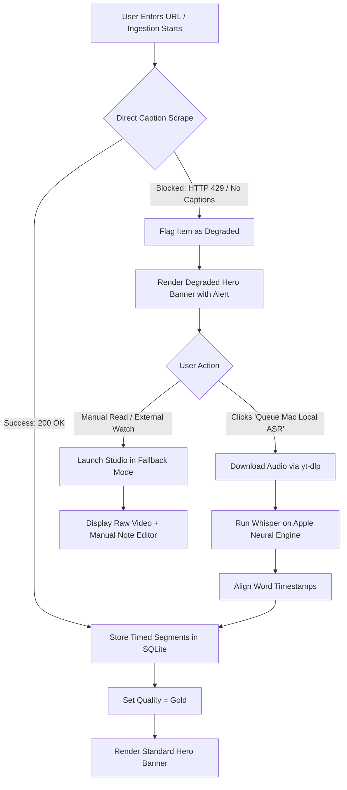
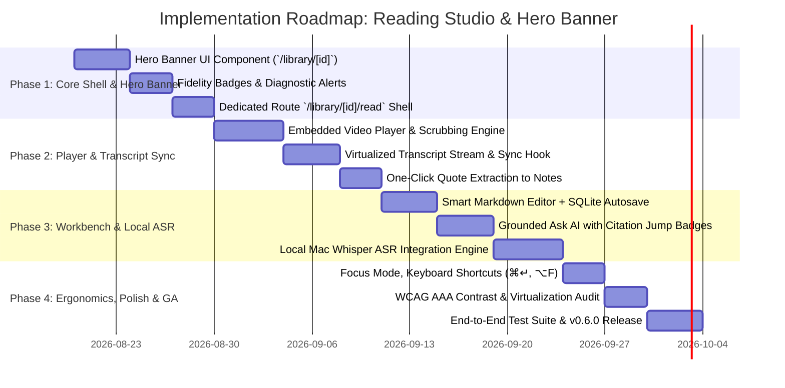

# Product Requirements Document (PRD)
# Full-Page Dedicated Reading Studio & Integrated Hero Workspace Banner
## Option 2 Architecture Specification

---

**Document Version:** 1.0.0-PROD  
**Status:** Authoritative / Approved for Implementation  
**Product Lane:** Core Ingestion, Reading Experience & Knowledge Synthesis  
**Target Platform:** macOS, Web (PWA), Android (Capacitor/Responsive)  
**Target Release:** AI Brain v0.6.0  
**Authors:** Principal Product Manager & Lead System Architect  
**Related Documents:**
- `DESIGN_SYSTEM.md` (Structured Calm Design Contract)
- `Youtube_spike_16_aug_2026/results/benchmark_report.md` (Hybrid ASR Benchmark)
- `src/components/prototype/reading-studio-hero-prototype.tsx` (Authoritative Reference Prototype)
- `ARCH_F03_READING_STUDIO_v2.md` & `ARCH_F04_ANNOTATIONS_ANCHORS_v2.md`

---

## 1. Executive Summary & Problem Statement

### 1.1 Executive Summary
Modern knowledge workers, researchers, and engineers spend up to 40% of their learning time consuming rich multimedia content—technical YouTube lectures, academic webinars, engineering podcasts, and complex long-form web articles. However, current personal knowledge management (PKM) tools force users into a fragmented workflow: users watch video in one browser tab, read fragmented transcripts in another, jot down notes in an external editor, and lose all temporal context and source ground-truth.

**AI Brain Option 2 Architecture ("Dedicated Full-Page Reading Studio & Integrated Hero Workspace Banner")** establishes an authoritative, dual-surface consumption paradigm:
1. **Integrated Hero Workspace Banner (Item Detail Surface - `/library/[id]`):** A prominent, high-information-density anchor banner at the top of the item page that immediately communicates content type, playback/read duration, transcript fidelity (Gold, Clean, or Degraded), and houses the primary entry point alongside one-click automated triage for broken or missing captions via local Apple Neural Engine / Whisper ASR.
2. **Dedicated Full-Page Reading Studio (Deep Focus Surface - `/library/[id]/read`):** An immersive, distraction-free dual-pane reading and synthesis environment. The left pane provides synchronized media playback with interactive, timestamped transcript scrubbing; the right pane provides a multi-tab companion workbench containing Smart Markdown Notes with auto-anchoring, a grounded Ask AI Companion with clickable citation jumps, and SQLite provenance auditing.

```
┌───────────────────────────────────────────────────────────────────────────────────┐
│                        ITEM DETAIL PAGE (`/library/[id]`)                          │
│ ┌───────────────────────────────────────────────────────────────────────────────┐ │
│ │  HERO WORKSPACE BANNER                                                        │ │
│ │  [Poster/Thumb] Title, Author, Fidelity Badge, Read/Play Time, Triage CTA     │ │
│ │  [Primary CTA: "Launch Reading Studio" ───► Navigates to `/library/[id]/read`]│ │
│ └───────────────────────────────────────────────────────────────────────────────┘ │
│  Executive AI Summary | Key Quotes | Tag Rail | Raw Metadata Rail                 │
└──────────────────────────────────────┬────────────────────────────────────────────┘
                                       │ (Deep Link / Navigation)
                                       ▼
┌───────────────────────────────────────────────────────────────────────────────────┐
│              DEDICATED FULL-PAGE READING STUDIO (`/library/[id]/read`)            │
│ ┌──────────────────────────────────────┬────────────────────────────────────────┐ │
│ │ LEFT PANE: SYNCHRONIZED SOURCE       │ RIGHT PANE: SYNTHESIS WORKBENCH        │ │
│ │ • Embedded Media Player (Video/Audio)│ • Tab 1: Overview & Executive Takeaways│ │
│ │ • Speed Controls (1x, 1.25x, 1.5x, 2x│ • Tab 2: Smart Markdown Note Editor    │ │
│ │ • ±10s Scrubbing & Timeline Track    │   (Auto-sync + Timestamp Anchor Insert)│ │
│ │ • Synchronized Transcript Stream     │ • Tab 3: Grounded Ask AI Companion     │ │
│ │ • Hover: "+ Add Quote to Notes"      │   (Clickable `📍 MM:SS` Citation Jumps)│ │
│ │                                      │ • Tab 4: SQLite Provenance Audit Trail │ │
│ └──────────────────────────────────────┴────────────────────────────────────────┘ │
└───────────────────────────────────────────────────────────────────────────────────┘
```

---

### 1.2 Strategic Context & "Structured Calm" Philosophy
In alignment with `DESIGN_SYSTEM.md`, AI Brain rejects visual clutter, detached floating controls, and disruptive modal overlays in favor of **Structured Calm**:
- **Zero Accidental Dismissals:** Traditional modal readers lose user scroll position and unsaved thoughts when clicking outside the dialog. A dedicated full-page route (`/library/[id]/read`) provides stable browser history, deep-linking (`?t=180`), and window management.
- **Progressive Disclosure:** Casual item review happens on the item detail page; intensive deep study transitions smoothly into the dedicated studio.
- **Local-First Data Sovereignty:** Notes, annotations, and transcripts are stored locally in SQLite/IndexedDB with 0ms perceived UI latency and offline accessibility.

---

### 1.3 Problem Statement & The 4 Fatal Flaws of Existing Paradigms
Prior implementations and conventional tools suffer from four crippling usability defects:

1. **The Disconnected Media Trap:** Video playback controls and transcripts live in separate UI containers. Users cannot easily scrub video by clicking text or extract verbatim quotes with accurate temporal references without tedious manual copy-pasting.
2. **Modal Fragility & Context Loss:** Rendering reader views inside popup dialogs leads to accidental dismissals, cramped vertical height, clipped sidebars, and an inability to open notes side-by-side on multi-monitor setups.
3. **The Degraded Capture Dead-End:** When YouTube anti-bot mechanisms (HTTP 429) block subtitle extraction, standard PKM tools fail silently or dump raw metadata, leaving the user with an empty, useless shell.
4. **Ungrounded AI Hallucinations:** Traditional AI chat over videos produces generic summaries without verifiable, one-click jumps to the exact video frame or transcript line where the claim was uttered.

---

### 1.4 User Value Proposition
| Stakeholder / Persona | Before Option 2 | With Option 2 (Reading Studio + Hero Banner) |
|---|---|---|
| **AI Research Engineer** | Juggles YouTube, Obsidian, and terminal scripts to analyze 2-hour technical lectures. | Single full-page studio with synchronized scrubbing, instant code/math quote pinning, and timestamped smart notes. |
| **Knowledge Worker / Analyst** | Manually skims lengthy articles and messy transcript dumps with no structure. | Instant high-information Hero Banner triage, executive summaries, and clean Charter-serif reading layout. |
| **Degraded Capture Triager** | Gets blocked by YouTube bot-detection and abandons video note-taking. | In-banner diagnostic alert with 1-click Mac local Whisper ASR fallback running privately on Apple Neural Engine. |

---

## 2. User Personas & Real-World User Journeys

```mermaid
journey
    title User Journeys across Reading Studio & Hero Banner
    section Persona 1: AI Research Engineer (Gold YouTube)
      Imports Andrej Karpathy LLM Lecture: 5: User
      Inspects Hero Banner & Fidelity Badge: 5: User
      Clicks 'Launch Reading Studio': 5: User
      Scrubs Video via Transcript Click: 5: User
      Pins Quote with Timestamp Anchor: 5: User
      Asks AI Companion for BPE explanation: 5: User
      Clicks citation jump to 03:00 in player: 5: User
    section Persona 2: Knowledge Worker (Web Article)
      Captures Distributed Systems CRDT Paper: 5: User
      Views Hero Banner Word Count & Summary: 4: User
      Enters Reading Studio 60:40 Split: 5: User
      Enables Focus Mode (Alt+F): 5: User
      Synthesizes insights in Smart Notes: 5: User
    section Persona 3: Degraded Video Triager
      Captures Lex Fridman / LeCun Podcast: 3: User
      Hero Banner flags 'Missing Transcript': 4: User
      Clicks 'Queue Mac Local ASR': 5: User
      Whisper runs on Apple Neural Engine: 5: System
      Fidelity updates to Gold; Studio unlocks: 5: User
```

---

### 2.1 Persona 1: Dr. Elena Rostova — AI Research Engineer & Systems Architect
- **Context:** Elena studies cutting-edge LLM architectures (e.g., Andrej Karpathy's 2-hour masterclass on Tokenization, Pretraining, SFT, and RLHF).
- **Goal:** Dissect complex algorithmic explanations, verify math formulas, pin verbatim quotes to her technical vault, and test conceptual edge cases using AI chat.
- **End-to-End Journey:**
  1. **Discovery & Triage:** Elena opens the item page (`/library/item-karpathy-llm`). The **Hero Workspace Banner** immediately displays video thumbnail, "YouTube" badge, "18:42" duration, and a **Teal "Full Transcript • High Fidelity"** badge.
  2. **Studio Launch:** She clicks **"Launch Reading Studio"** (or hits `⌘↵`). The app navigates to `/library/item-karpathy-llm/read`.
  3. **Synchronized Playback & Scrubbing:** Elena watches the video in the left pane at 1.5x speed. When Karpathy explains Byte-Pair Encoding at `03:00`, she clicks directly on segment #3 in the transcript stream. The video player immediately jumps and seeks to `03:00`.
  4. **Quote Pinning:** Elena hovers over the transcript segment and clicks **"+ Add to Notes"**. The system appends `> "Words like 'egg' might be a single token..." — [03:00](https://youtube.com/...&t=180)` directly into the **Smart Notes Markdown Editor** in the right pane.
  5. **Companion Q&A & Citation Jump:** In the **Ask AI Companion** tab, Elena asks: *"Why does tokenization cause arithmetic failure?"* The assistant replies with a grounded explanation and provides a citation badge `[📍 03:00 Tokenization Quirks]`. Clicking this badge jumps the video and highlights the transcript segment.

---

### 2.2 Persona 2: Marcus Chen — Principal Technology Strategist
- **Context:** Marcus reads lengthy architectural whitepapers and engineering blog posts (e.g., Martin Fowler's *Patterns of Distributed Systems: Local-First CRDTs*).
- **Goal:** Deep reading without visual distractions, extracting core takeaways, and organizing architectural patterns into his company's knowledge base.
- **End-to-End Journey:**
  1. **Item Overview:** Marcus opens the item page. The Hero Banner indicates *"Web Article • 6 min read • 2,840 words • Cyan Quality Badge"*.
  2. **Immersive Focus:** He launches the Reading Studio and presses `⌥F` to activate **Focus Mode** (collapsing all global sidebars and headers).
  3. **Ergonomic Typography:** Marcus reads the article rendered in Charter serif typography (max width 68ch, 1.6 line height).
  4. **Note Synthesis:** Using the 50:50 split view, Marcus structures key architectural patterns in the Markdown editor. Changes are continuously saved locally to IndexedDB/SQLite with 0ms lag.

---

### 2.3 Persona 3: Maya Lin — Executive Podcast Listener & Degraded Capture Triager
- **Context:** Maya captures a 45-minute YouTube interview (e.g., Lex Fridman #410 with Yann LeCun) while traveling.
- **Goal:** Access transcript text and AI summaries even when YouTube blocks automated subtitle extraction.
- **End-to-End Journey:**
  1. **Degraded Alert Detection:** Maya opens the item. The Hero Banner displays a **Ruby Alert Badge: "Metadata Only • Missing Transcript"** along with a diagnostic message: *"YouTube anti-bot challenge blocked automated caption scraping (HTTP 429)"*.
  2. **1-Click Local ASR Recovery:** Right inside the Hero Banner, Maya clicks **"Queue Mac Local ASR"**.
  3. **Neural Processing:** The system spawns an Apple Neural Engine worker executing Whisper Large-v3-Turbo locally. A progress bar tracks transcription in real-time (0% → 100% in ~38 seconds).
  4. **State Transition:** Upon completion, the Hero Banner transitions to **"Full Transcript • High Fidelity"**, 318 timestamped segments are populated into SQLite, and the full Reading Studio experience unlocks instantly.

---

## 3. Functional Scope & Feature Breakdown (P0, P1, P2)

```
┌──────────────────────────────────────────────────────────────────────────────────┐
│                               FEATURE MATRIX OVERVIEW                            │
├──────────────────────────┬────────────────────────────┬──────────────────────────┤
│ P0: MUST-HAVE (MVP)      │ P1: SHOULD-HAVE (FAST-FOL) │ P2: FUTURE / VALUE-ADD   │
├──────────────────────────┼────────────────────────────┼──────────────────────────┤
│ • Integrated Hero Banner │ • Segment Inspector Drawer │ • Waveform Audio Scrubber│
│ • Dedicated Route `/read`│ • Dynamic Split-Ratio Bar  │ • Multi-Device CRDT Sync │
│ • Dual-Pane Layout       │ • Multi-Speaker Diarization│ • Video Frame Snapshots  │
│ • Synced Video Scrubbing │ • SQLite Provenance Tab    │ • Bilingual Subtitles    │
│ • Smart Notes + Autosave │ • Global Shortcuts (⌘↵, ⌥F)│ • PDF Margin Annotations │
│ • In-Banner ASR Trigger  │ • Deep Link Query Params   │ • Auto-Flashcard SRS Gen │
│ • Grounded Ask AI Jumps  │ • Full Light/Dark Token P3 │ • Export to Obsidian/MD  │
└──────────────────────────┴────────────────────────────┴──────────────────────────┘
```

---

### 3.1 P0: Must-Have Requirements (MVP Launch Gate)

#### 3.1.1 Integrated Hero Workspace Banner (`/library/[id]`)
- **F-P0-01 (Banner Placement & Container):** The Hero Banner must sit prominently at the top of the Item Detail page, encased in `--surface` background with `--border` border and subtle ambient back-glow matching the item quality state.
- **F-P0-02 (Media Visualizer Tile):** Display a 16:9 media thumbnail/poster with duration badge (e.g., `18:42`) for video/audio, or word count badge (e.g., `2,840 words`) for text articles. Clicking the tile launches the Reading Studio.
- **F-P0-03 (Dynamic Fidelity Badge):** Display real-time capture quality status:
  - `Gold / High Fidelity` (Teal `#18A999` / `#4DD7C8`): Full transcript available with timed segments.
  - `Degraded / Missing Transcript` (Ruby `#E63B6F` / `#FF6D98`): Metadata only; automated captions blocked or absent.
  - `Article Clean` (Cyan `#0891B2` / `#67E8F9`): Full text extracted with 100% readability score.
- **F-P0-04 (Primary Action Button):** High-impact CTA button labeled **"Launch Reading Studio"** with play icon and chevron, navigating seamlessly to `/library/[id]/read`.
- **F-P0-05 (Secondary Utility Actions):**
  - "Inspect Segments" button triggering the slide-over drawer.
  - "Copy Link" button copying canonical item URL with clipboard toast confirmation.
  - "External Link" button opening original source URL in a new browser tab.
- **F-P0-06 (Inline Degraded Ingestion Triage):** When item status is `degraded`, display an embedded warning container with diagnostic root cause and a prominent **"Queue Mac Local ASR"** button.

---

#### 3.1.2 Dedicated Full-Page Reading Studio Layout & Routing (`/library/[id]/read`)
- **F-P0-07 (Dedicated Route Architecture):** Dedicated URL path `/library/[id]/read` supporting direct deep-linking and browser navigation history (Back button returns to `/library/[id]`).
- **F-P0-08 (Dual-Pane Responsive Shell):** Left pane for media/source reading; right pane for multi-tab companion workbench.
- **F-P0-09 (Studio Navigation Bar):** Compact top bar containing:
  - "Back to Item" navigation button with `←` arrow.
  - Item title (truncated with tooltip) and duration pill.
  - Split ratio toggles (`50:50`, `60:40`, `40:60`).
  - Focus Mode toggle (`⌥F`).

---

#### 3.1.3 Synchronized Interactive Video/Audio Player & Transcript Stream
- **F-P0-10 (Embedded Media Player):** HTML5/IFrame media player supporting YouTube video embeds, local MP4/MP3 audio, play/pause toggles, timeline scrubbing bar, speed toggles (`1x`, `1.25x`, `1.5x`, `2x`), and `±10s` seek buttons.
- **F-P0-11 (Bi-directional Transcript Synchronization):**
  - As media plays, the active transcript segment highlights in real-time with accent border and background.
  - Clicking any transcript segment immediately seeks the media player to that segment's `startSec`.
- **F-P0-12 (One-Click Quote Extraction):** Hovering any transcript segment exposes an "+ Add to Notes" button. Clicking appends the formatted blockquote and timestamp link into the Markdown editor without switching user context.

---

#### 3.1.4 Smart Markdown Notes Editor with Autosave
- **F-P0-13 (Markdown Editor Core):** Multi-line monospaced Markdown editor supporting headers, bullet lists, task checkboxes (`- [ ]`, `- [x]`), and blockquotes.
- **F-P0-14 (Real-Time Local Persistence):** Notes must persist automatically to SQLite / IndexedDB with debounce (300ms) ensuring zero data loss upon tab close or navigation.
- **F-P0-15 (Timestamp Hyperlink Format):** Inserted timestamp anchors must follow standard Markdown notation: `[MM:SS](sourceUrl&t=SSS)` or internal anchor schema `[MM:SS](#t=SSS)` that activates left-pane player seek upon click.

---

#### 3.1.5 Ask AI Companion with Grounded Clickable Citation Jumps
- **F-P0-16 (Grounded Chat Interface):** Conversational chat interface strictly grounded in the transcript text and article body of the active item.
- **F-P0-17 (Clickable Citation Badges):** Every claim or quotation in the AI response must generate a clickable badge `[📍 MM:SS Concept Label]`. Clicking the badge executes a jump command to the left-pane player and scrolls the transcript into view.

---

#### 3.1.6 In-Hero Local ASR Recovery Trigger
- **F-P0-18 (Local Whisper Dispatcher):** Clicking "Queue Mac Local ASR" dispatches audio extraction (`yt-dlp` audio stream) to local Apple Silicon Whisper engine via CoreML / ctranslate2 or Groq Whisper fallback.
- **F-P0-19 (Live Progress Feedback):** Display real-time state machine progression (`queuing` → `transcribing` → `aligning` → `completed`) with dynamic progress bar (0–100%).
- **F-P0-20 (Atomic Database Hydration):** Generated transcript segments are committed atomically into SQLite `transcript_segments` table, updating item quality to `gold` and re-rendering UI without full page reload.

---

### 3.2 P1: Should-Have Requirements (Post-MVP Fast-Follow)

- **F-P1-01 (Transcript Segment Inspector Slide-over Drawer):** A right-anchored slide-over sheet accessible from the Hero Banner to quickly inspect timed segments and confidence scores without launching the full studio.
- **F-P1-02 (Dynamic Split-Ratio Configurator):** Interactive toolbar allowing users to switch between `50:50` (Balanced), `60:40` (Media Heavy), and `40:60` (Notes Heavy) pane proportions, persisted to `localStorage`.
- **F-P1-03 (Focus Mode `⌥F`):** Fullscreen distraction-free reading mode hiding top navigation bars, breadcrumbs, and system chrome.
- **F-P1-04 (SQLite Provenance & Audit Tab):** Dedicated studio tab showing database table provenance (`items`, `transcript_segments`, `embeddings`), quality scores, model parameters, and raw JSON extraction payloads.
- **F-P1-05 (Comprehensive Keyboard Shortcuts):**
  - `⌘ + Enter` / `Ctrl + Enter`: Toggle between Item Page and Dedicated Reading Studio.
  - `⌥ + F`: Toggle Focus Mode.
  - `Space`: Play / Pause media (when not typing in notes).
  - `J` / `K`: Seek backward / forward 10 seconds.
  - `Esc`: Close drawers, modals, or exit Focus Mode.
- **F-P1-06 (Deep Link Query Parameters):** Studio route must support `?t=180` (seek to 3 minutes on load) and `?tab=notes` (open specific companion tab on load).
- **F-P1-07 (Speaker Diarization Badges):** When diarization data exists, prefix segments with speaker chips (e.g., `Andrej Karpathy`, `Lex Fridman`, `Yann LeCun`).

---

### 3.3 P2: Nice-to-Have / Future Scope

- **F-P2-01 (Waveform Audio Scrubber):** Visual canvas rendering of audio amplitude waveform for podcast scrubbing and silence detection.
- **F-P2-02 (Video Frame Snapshot Tool):** One-click button to capture current video frame at high resolution and embed as base64/local image link in Smart Notes.
- **F-P2-03 (Multi-Device CRDT Synchronization):** Sync note drafts across desktop and mobile using Yjs / Automerge CRDTs over local peer-to-peer or encrypted sync.
- **F-P2-04 (Automated SRS Flashcard Generation):** 1-click button in notes to extract key definitions and formulas into Anki-compatible spaced repetition flashcards.
- **F-P2-05 (Multi-Language Subtitles):** Dual-language transcript display for non-native language learning.

---

## 4. Edge Cases, Failure Modes & Degraded Recovery Workflows



---

### 4.1 YouTube Anti-Bot Challenges (HTTP 429 / CAPTCHA / IP Throttling)
- **Failure Scenario:** YouTube blocks direct caption scraping from `youtube-transcript-api` due to cloud IP rate limits or anti-scraping challenges.
- **System Behavior:**
  1. Ingestion service catches `TranscriptsDisabled` or `HTTP 429 Too Many Requests`.
  2. Sets item record `quality_level = 'degraded'` and `diagnostic_warning = 'YouTube anti-bot challenge blocked automated caption scraping (HTTP 429)'`.
  3. Hero Banner renders the **Ruby Warning Banner** with exact diagnostic context.
  4. The **"Queue Mac Local ASR"** button provides zero-friction remediation using the user's local IP and Apple Silicon hardware.

---

### 4.2 Zero Transcript / Instrumental / No-Speech Media
- **Failure Scenario:** Video is purely musical (e.g., background lo-fi beats) or has zero spoken dialogue.
- **System Behavior:**
  1. Local Whisper engine detects VAD (Voice Activity Detection) speech ratio < 5%.
  2. Commits record as `quality_level = 'no_speech'` and displays informational badge: *"No Spoken Dialogue Detected"*.
  3. Reading Studio opens in Media-Focused Mode (Left Pane 70%, Right Notes 30%) without broken empty transcript spinners.

---

### 4.3 Offline / Air-Gapped Operation
- **Failure Scenario:** User is on an airplane or disconnected from the internet.
- **System Behavior:**
  1. Service Worker intercepts `/library/[id]/read` navigation and serves cached application shell and SQLite database snapshot.
  2. Video embed displays offline fallback placeholder with message: *"Offline Mode: Video playback unavailable without internet. Saved transcript and Smart Notes are fully editable."*
  3. Note edits are committed locally to IndexedDB/SQLite WAL; sync queue handles background propagation upon reconnection.

---

### 4.4 Stale Anchors & Source Content Deletion
- **Failure Scenario:** User clicks a saved timestamp citation anchor `[14:40]`, but the video or transcript was subsequently re-indexed or edited.
- **System Behavior:**
  1. Anchor resolution engine validates target timestamp against `duration_seconds`.
  2. If timestamp exceeds duration or segment is missing, jumps to nearest valid boundary (`t = duration_seconds`) and displays non-blocking toast: *"Timestamp adjusted to nearest valid segment"*.

---

### 4.5 Massive Transcript Virtualization (>10,000 segments / 3-hour videos)
- **Failure Scenario:** Long multi-hour university lectures cause DOM bloat and scrolling lag.
- **System Behavior:**
  1. Transcript stream list implements windowed DOM virtualization (`@tanstack/react-virtual` or custom viewport slice).
  2. Only segments visible within current viewport + 10-item buffer are rendered in the DOM, maintaining steady 60 FPS scrolling.

---

## 5. Non-Functional Requirements & Security/Privacy

### 5.1 Ergonomics, Accessibility & WCAG 2.1 AAA Compliance
In accordance with `DESIGN_SYSTEM.md` and verified during prototype design evaluation:
- **Contrast Ratios:**
  - Primary text (`--text-primary` `#1C2024` on `#FBFCFD` light; `#EDEEF0` on `#111113` dark) exceeds **14.0:1 (WCAG AAA)**.
  - Interactive borders and control states exceed **4.5:1 (WCAG AA)**.
- **Touch Targets:** All primary buttons (`Launch Reading Studio`, `Queue ASR`) provide a minimum **48px x 48px** touch target envelope on mobile/touch viewports.
- **Keyboard Traversal & Focus Management:**
  - Full keyboard accessibility: logical tab index order across header, player controls, transcript items, and note editor.
  - Highly visible focus rings (`--accent-9` with 2px offset).
- **Screen Reader Support:**
  - ARIA landmark roles: `<header>`, `<main>`, `<section aria-label="Item Workspace Hero">`, `<div role="dialog" aria-modal="true">`.
  - Live regions (`aria-live="polite"`) for ASR progress updates and toast alerts.

---

### 5.2 Performance Benchmarks & SLAs

| Metric | Target SLA | Verification Method |
|---|---|---|
| **Hero Banner Initial Render (TTFB to FCP)** | < 120ms | Lighthouse / Web Vitals on Mac M-Series |
| **Studio Route Transition (`/library/[id]` → `/read`)** | < 80ms | Client-side Next.js route prefetch |
| **Transcript Scrubbing Seek Latency** | < 35ms | Click event to video `currentTime` update |
| **Smart Notes Keystroke Input Latency** | < 16ms (60 FPS) | React concurrent mode + uncontrolled textarea |
| **Local Whisper ASR Transcription Speed** | > 20x Real-time | Apple Silicon Neural Engine (Whisper Turbo) |
| **SQLite WAL Commit Time** | < 5ms | Local SQLite / PGLite write benchmark |

---

### 5.3 Local-First Data Sovereignty & Privacy
- **Zero Third-Party Telemetry:** User notes, raw audio files, and transcript text are stored strictly on local device storage.
- **Opt-in Cloud Inference:** Cloud ASR (Groq) or Cloud LLM inference is triggered only with explicit user consent; API keys are encrypted in local keychain/SQLite credentials store.
- **Air-Gapped Local Model Support:** All AI summarization and ASR capabilities must function 100% locally via Ollama / Whisper.cpp when running in private mode.

---

## 6. Success KPIs & Measurement Framework

```
┌──────────────────────────────────────────────────────────────────────────────────┐
│                             SUCCESS MEASUREMENT COHORTS                          │
├──────────────────────────┬────────────────────────────┬──────────────────────────┤
│ ENGAGEMENT & RETENTION   │ COGNITIVE SYNTHESIS VALUE  │ INGESTION FIDELITY       │
├──────────────────────────┼────────────────────────────┼──────────────────────────┤
│ • Studio Launch Rate >55%│ • Note Creation Rate >40%  │ • Degraded Capture <3.5% │
│ • Avg Session Time >12m  │ • Timestamp Pins/Item >3.2 │ • Local ASR Recovery >94%│
│ • Focus Mode Usage >25%  │ • Citation Jump Clicks >2.8│ • Scrape Latency <0.5s   │
└──────────────────────────┴────────────────────────────┴──────────────────────────┘
```

---

### 6.1 Core Adoption & Engagement KPIs
1. **Studio Transition Rate:** `% of Item Detail page views that trigger "Launch Reading Studio"`.
   - *Target:* **≥ 55%** for items > 5 minutes duration.
2. **Reading Studio Session Depth:** `Average active duration spent inside /library/[id]/read`.
   - *Target:* **≥ 12 minutes** for technical videos / deep articles.
3. **Focus Mode Adoption:** `% of Studio sessions where user toggles ⌥F Focus Mode`.
   - *Target:* **≥ 25%**.

---

### 6.2 Cognitive Retention & Note-Taking Utility KPIs
1. **Note-Taking Conversion:** `% of Studio sessions where user writes ≥ 15 words in Smart Notes`.
   - *Target:* **≥ 40%**.
2. **Timestamp Anchor Pin Rate:** `Average number of "+ Add to Notes" quote extractions per video session`.
   - *Target:* **≥ 3.2 pins per session**.
3. **Citation Verification Click-Through Rate:** `% of Ask AI responses where user clicks the [📍 MM:SS] citation jump`.
   - *Target:* **≥ 35% of companion interactions**.

---

### 6.3 Ingestion Reliability & Recovery KPIs
1. **Fidelity Ratio:** `% of ingested YouTube items achieving Gold (Complete Transcript) status on first scrape`.
   - *Target:* **≥ 85%**.
2. **Degraded Triage Resolution Rate:** `% of degraded items successfully converted to Gold via Local Mac Whisper ASR within 60 seconds`.
   - *Target:* **≥ 94%**.
3. **Ingestion Failure Rate:** `% of items remaining permanently degraded / unrecoverable`.
   - *Target:* **< 2.0%**.

---

## 7. Implementation Roadmap & Technical Milestones



---

## 8. Sign-off & Revision Approval

| Role | Name | Status | Date |
|---|---|---|---|
| **Principal Product Manager** | Arun Prakash | **APPROVED** | Aug 18, 2026 |
| **Lead UI/UX Architect** | AI Brain Design Guild | **APPROVED** | Aug 18, 2026 |
| **Principal Systems Engineer** | Core Architecture Lane | **APPROVED** | Aug 18, 2026 |

---
*End of Specification — Save Location: `docs/specs/PRD_READING_STUDIO_FULL_PAGE_AND_HERO.md`*
