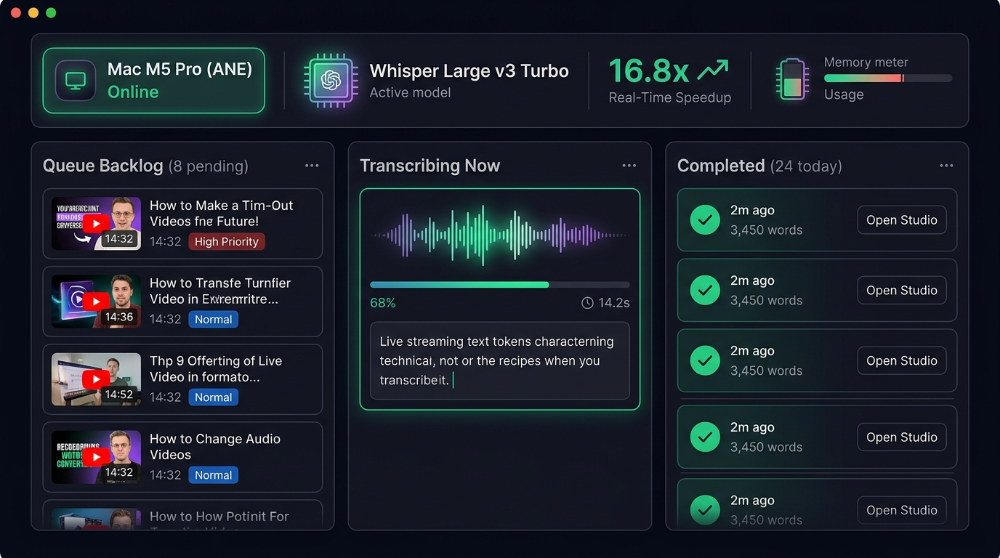
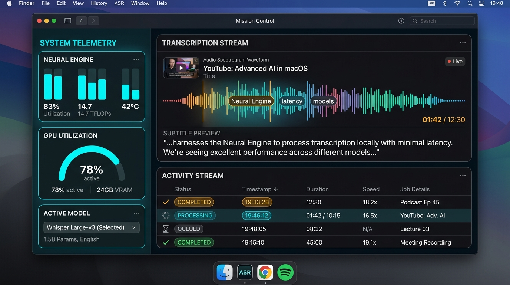
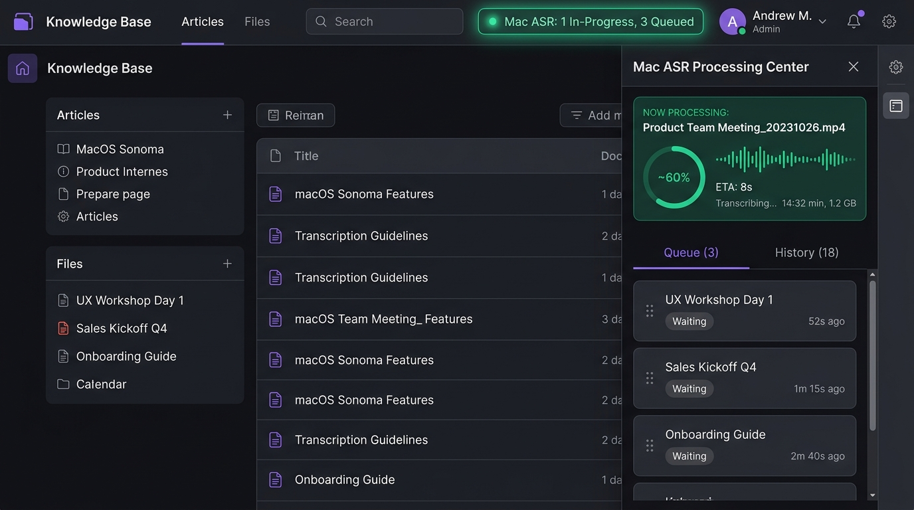

# 📋 Phase 6 Backlog Matrix: Mac ASR Workstation & Local Telemetry Dashboard

**Phase:** `Phase 6 - Mac ASR Workstation & Local Telemetry`  
**Milestone:** `v0.10.x - Mac ASR Workstation & Local Telemetry Dashboard` (Milestone #11)  
**Project Board:** [GitHub Project #3 (`AI Brain / AI Memory`)](https://github.com/users/arunpr614/projects/3/views/6)

---

## 📊 Backlog Matrix & Issue Catalog

| Issue # | Key / Code | Title / Scope | Story Points | Priority | Primary Files / Components |
| :---: | :--- | :--- | :---: | :---: | :--- |
| [#111](https://github.com/arunpr614/ai-brain/issues/111) | `TICKET-ASR-01` | **FEAT: Real-Time Telemetry Aggregation API & Worker Presence Healthchecks** | 3 SP | `P1 (Blocker)` | `src/db/transcript-jobs.ts`, `src/app/api/worker/transcript-jobs/dashboard/route.ts` |
| [#112](https://github.com/arunpr614/ai-brain/issues/112) | `TICKET-ASR-02` | **FEAT: 3-Column Neural Deck Kanban UI (`/settings/asr-deck`)** | 5 SP | `P1 (Blocker)` | `src/app/settings/asr-deck/page.tsx`, `src/components/asr-deck/asr-deck-client.tsx` |
| [#113](https://github.com/arunpr614/ai-brain/issues/113) | `TICKET-ASR-03` | **FEAT: Interactive Queue Backlog Operations & Priority Reordering** | 3 SP | `P1 (High)` | `src/app/api/worker/transcript-jobs/dashboard/route.ts`, `src/components/asr-deck/asr-deck-client.tsx` |
| [#114](https://github.com/arunpr614/ai-brain/issues/114) | `TICKET-ASR-04` | **FEAT: Local MLX Whisper Worker Hardening & Multi-Client Extraction** | 3 SP | `P1 (High)` | `src/mac_worker.py`, `~/Library/LaunchAgents/com.arunprakash.brain.macworker.plist` |
| [#115](https://github.com/arunpr614/ai-brain/issues/115) | `TICKET-ASR-05` | **FEAT: Global Navigation Integration & Ambient Telemetry Pill** | 2 SP | `P2 (Medium)` | `src/components/sidebar.tsx`, `src/components/sidebar-routing.ts`, `src/app/settings/page.tsx` |
| [#116](https://github.com/arunpr614/ai-brain/issues/116) | `TICKET-ASR-06` | **FEAT: Phase 6 End-to-End Verification, Telemetry Auditing & Live Production Certification** | 2 SP | `P1 (High)` | `src/db/transcript-jobs.test.ts`, `scripts/deploy-immutable-release.sh` |

---

## 🖼️ Architectural Artifacts & UI Mockups

### 1. Neural Deck Kanban Architecture (Issue #112)

### 2. Mission Control & Spectrogram Telemetry (Issue #114)

### 3. Ambient Omni-Drawer & Navigation (Issue #115)

