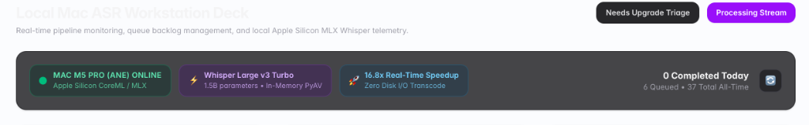

# 📋 Jira Specification: TICKET-ASR-07

**Project:** `AI Brain / AI Memory`  
**Phase:** `Phase 6 - Mac ASR Workstation & Local Telemetry`  
**Milestone:** `v0.10.x - Mac ASR Workstation & Local Telemetry Dashboard` (Milestone #11)  
**Issue Type:** `Feature`  
**Priority:** `P1 (High)`  
**Story Points:** `3 SP`  
**Components:** `src/components/asr-deck/asr-deck-client.tsx`, `src/db/transcript-jobs.ts`, `src/app/api/worker/transcript-jobs/dashboard/route.ts`

---

## 🎯 Summary
**FEAT(phase6-asr): Real-Time Heartbeat 'Last Seen' Telemetry & Board Date Range Presets (Today, This Week, This Month)**

---

## 🔍 Context & User Requirements
As captured in production testing on the `/settings/asr-deck` workstation:
1. **Mac M5 Pro Heartbeat Visibility:** The online status card currently displays a green beacon and `MAC M5 PRO (ANE) ONLINE`, but lacks visibility into the exact freshness of the worker heartbeat (e.g., whether the daemon pinged 2 seconds ago or is hanging). A compact, clear "Last seen" timestamp is required.
2. **Kanban Board Date Range Filtering:** The workstation board needs interactive date filtering with presets (`Today`, `This Week`, `This Month`, `All Time`) so users can isolate today's active transcription stream from older historical jobs.

---

## 📸 Design Reference & Annotation



```
+-----------------------------------------------------------------------------------------------------------------------+
|  [🟢 MAC M5 PRO (ANE) ONLINE • Seen 2s ago]  [⚡ Whisper Large v3 Turbo]  [🚀 35.8x RTF]   [ Date: Today ⌵ ] [🔄] |
|   Apple Silicon CoreML/MLX • 20:34:12         1.5B params • PyAV          Zero Disk I/O    11 Done Today • 37 Total   |
+-----------------------------------------------------------------------------------------------------------------------+
|                                                                                                                       |
|  [Filter Presets:  (● Today: 11)  (This Week: 35)  (This Month: 37)  (All Time: 37) ]                                |
|                                                                                                                       |
|  +---------------------------+  +---------------------------+  +---------------------------------------------------+  |
|  |  COLUMN 1: QUEUE BACKLOG  |  |  COLUMN 2: TRANSCRIBING   |  |  COLUMN 3: COMPLETED STREAM [Today Filter Active] |  |
|  +---------------------------+  +---------------------------+  +---------------------------------------------------+  |
+-----------------------------------------------------------------------------------------------------------------------+
```

---

## 🎯 Detailed Acceptance Criteria

### 1. Heartbeat "Last Seen" Telemetry
- **Timestamp Display:** In the worker status card on `/settings/asr-deck`, render a compact, high-contrast `Last seen: X ago` indicator (e.g. `Seen 3s ago` or `20:34:12 • 3s ago`).
- **Relative Auto-Tick:** The relative timer automatically updates in real-time (ticking `1s ago`, `2s ago`, `3s ago`...) between background polling intervals.
- **Offline State:** When `is_online` is false (heartbeat older than 45s), badge transitions to amber/rose with `Offline • Last seen 14m ago`.
- **Hover Tooltip:** Full ISO timestamp (e.g. `2026-08-18T15:04:12.839Z`) visible on hover.

### 2. Kanban Board Date Range Filter Bar
- **Preset Controls:** Add a date range pill bar / segmented selector with presets:
  - `Today` (midnight to current local time)
  - `This Week` (past 7 days / current calendar week)
  - `This Month` (past 30 days / current calendar month)
  - `All Time` (no date filtering)
- **Automatic Card Filtering:** Changing the active preset instantly filters the **Completed History Stream** column and updates column counters without page reload.
- **Count Badges:** Each preset pill displays the dynamic item count for that interval (e.g. `Today (11)`, `This Week (35)`, `This Month (37)`).
- **URL Query Sync:** Active date preset is reflected in URL search params (e.g. `/settings/asr-deck?range=today`) for bookmarkability.

---

## 🧪 Verification Plan
1. **Worker Telemetry Test:** Verify that `last_heartbeat_at` is returned in `GET /api/worker/transcript-jobs/dashboard` and accurately computed relative to client local time.
2. **Date Filtering Unit Test:** Test date boundary calculations (`startOfDay`, `startOfWeek`, `startOfMonth`) in `src/components/asr-deck/asr-deck-client.test.ts`.
3. **UI Interaction Test:** Verify clicking between `Today`, `This Week`, `This Month`, and `All Time` updates the cards seamlessly.
