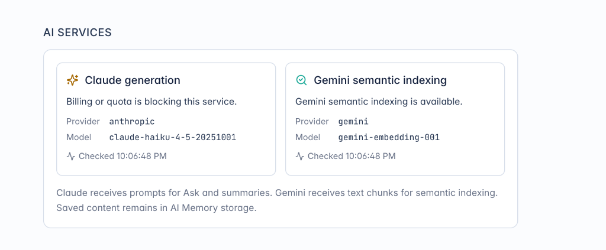

# 📋 Phase 8 Backlog Matrix: Unified Cognitive AI Pipeline & Semantic Synthesis

**Phase:** `Phase 8 - Unified Cognitive AI Pipeline & Semantic Synthesis`  
**Milestone:** `v0.12.x - Unified Multi-Modal AI Pipeline & Cognitive Synthesis` (Milestone #12)  
**Project Board:** [GitHub Project #3 (`AI Brain / AI Memory`)](https://github.com/users/arunpr614/projects/3/views/12)

---

## 📊 Backlog Matrix & Issue Catalog

| Issue # | Key / Code | Title / Scope | Story Points | Priority | Primary Files / Components |
| :---: | :--- | :--- | :---: | :---: | :--- |
| [#120](https://github.com/arunpr614/ai-brain/issues/120) | `TICKET-AI-01` | **FEAT: Autonomous Post-ASR & Ingestion Multi-Modal Enrichment Auto-Trigger Engine** | 3 SP | `P1 (Blocker)` | `src/db/transcript-jobs.ts`, `src/lib/queue/enrichment-worker.ts`, `src/lib/enrich/pipeline.ts` |
| [#121](https://github.com/arunpr614/ai-brain/issues/121) | `TICKET-AI-02` | **FEAT: Unified Multi-Modal Extraction Prompt Engine & Multi-Provider Fallback (Claude + Gemini + Local Ollama)** | 5 SP | `P1 (Blocker)` | `src/lib/enrich/prompts.ts`, `src/lib/enrich/pipeline.ts`, `src/lib/llm/factory.ts` |
| [#122](https://github.com/arunpr614/ai-brain/issues/122) | `TICKET-AI-03` | **FEAT: Time-Synchronized Quote Navigation & Interactive Media Player Jumps** | 3 SP | `P1 (High)` | `src/components/reading-studio/multi-layer-companion-tabs.tsx`, `src/app/items/[id]/page.tsx` |
| [#123](https://github.com/arunpr614/ai-brain/issues/123) | `TICKET-AI-04` | **FEAT: One-Click 'Pin to Notes' Dispatcher & Formatted Markdown Quote Citations** | 2 SP | `P1 (High)` | `src/components/reading-studio/multi-layer-companion-tabs.tsx`, `src/lib/reading-studio/note-event-bus.ts` |
| [#124](https://github.com/arunpr614/ai-brain/issues/124) | `TICKET-AI-05` | **FEAT: 'Ask AI to Elaborate' Contextual Query Dispatcher from Digest & Brief** | 3 SP | `P1 (High)` | `src/components/reading-studio/multi-layer-companion-tabs.tsx`, `src/app/items/[id]/ask/page.tsx` |
| [#125](https://github.com/arunpr614/ai-brain/issues/125) | `TICKET-AI-06` | **FEAT: Dual-View Visual Harmonization between Reading Studio 'Brief' and Item Detail 'AI Digest'** | 2 SP | `P2 (Medium)` | `src/components/cognitive/cognitive-digest-card.tsx`, `src/components/reading-studio/multi-layer-companion-tabs.tsx` |
| [#126](https://github.com/arunpr614/ai-brain/issues/126) | `TICKET-AI-07` | **FEAT: Phase 8 End-to-End Test Suite, Multi-Provider Quota Fallback & Production Certification** | 2 SP | `P1 (High)` | `src/lib/enrich/pipeline.test.ts`, `scripts/deploy-immutable-release.sh` |

---

## 🖼️ Architectural Artifacts & UI Mockups

### 1. Unified Multi-Modal AI Pipeline Diagram
```
                               ┌─────────────────────────────────────────────────────────────┐
                               │     Unified Multi-Modal LLM Inference Turn                  │
                               │   (Claude Haiku / Gemini Flash / Local Ollama)              │
                               └──────────────────────────────┬──────────────────────────────┘
                                                              │ (Single Structured JSON Response)
                                                              ▼
                               ┌─────────────────────────────────────────────────────────────┐
                               │                    Atomic DB Transaction                    │
                               │  • items.summary: 3-paragraph executive distillation        │
                               │  • items.quotes: 5 high-signal verbatim quotes              │
                               │  • items.category: semantic category classification         │
                               │  • item_topics: 3-8 concept ontology tags                   │
                               │  • item_chunks & vectors: Gemini 768-dim embeddings         │
                               └──────────────────────────────┬──────────────────────────────┘
                                                              │
                                     ┌────────────────────────┴────────────────────────┐
                                     ▼                                                 ▼
                      ┌─────────────────────────────┐                   ┌─────────────────────────────┐
                      │   Reading Studio Lens       │                   │    Item Detail Lens         │
                      │        [✨ Brief]            │                   │       [📄 AI Digest]        │
                      │                             │                   │                             │
                      │ • Executive Takeaways       │                   │ • Category Badge            │
                      │ • Concept Topic Badges      │                   │ • Full Executive Summary    │
                      │ • ⏱️ Click-to-Seek Quotes   │                   │ • 📌 1-Click Pin to Notes   │
                      │ • 💬 "Ask AI" Deep-Dives    │                   │ • 💬 "Ask AI to Elaborate"  │
                      └─────────────────────────────┘                   └─────────────────────────────┘
```

### 2. Multi-Provider Fallback Architecture


- **Generation Tier 1:** `Claude (anthropic/claude-haiku-4-5-20251001)` — default for Ask and Executive Summaries.
- **Generation Tier 2:** `Gemini Flash (gemini-1.5-flash)` — active when Claude quota is constrained.
- **Generation Tier 3:** `Local Ollama (qwen2.5:7b-instruct-q4_K_M)` — zero-cost on-device fallback.
- **Semantic Vector Tier:** `Gemini Embeddings (gemini-embedding-001)` — 768-dim dense semantic vector indexing.
