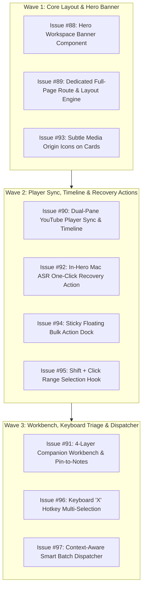

# 🚀 Autonomous Handover Document: Phase 3 (Reading Studio & Triage Suite)

**Timestamp:** `2026-08-18T15:55:00+05:30`  
**Milestone:** `v0.9.x - Kanban Card Processing & Reading Studio`  
**Target Phase:** Phase 3 (Reading Studio & Triage) / Phase 3.5 Finalization  
**Epic Key:** `EPIC-STUDIO-01`  
**GitHub Project Board:** [AI Brain / AI Memory — Project #3 (Phase 3 Board View)](https://github.com/users/arunpr614/projects/3/views/6)  
**Primary Repository:** `https://github.com/arunpr614/ai-brain`  
**Active Worktree Path:** `/Users/arun.prakash/Documents/ArunVault2026-2/Initiatives/Arun_AI_Projects/AGY_Phase_2_YouTube_Mac_ASR/worktrees/wt-worker-api`  
**Active Working Branch:** `feat/phase3-reading-studio-triage` (Current Commit: `f31958f`)

---

## 1. Executive Summary & Mission Mandate

This document serves as the **complete, zero-ambiguity execution and deployment blueprint** for an incoming autonomous AI coding agent. 

All product council deliberations, user approvals, architectural blueprints, UI/UX design tokens, and prototype verifications for **Phase 3** have concluded. The incoming agent is authorized to **autonomously implement all 13 Phase 3 tickets, run verification suites, merge the feature branch, and deploy to production without waiting for user intervention**.

---

## 2. Verified Deliverables & Repository State

### 🎨 Live Interactive Prototypes (Port 3000)
- **Unified Prototype Hub:** `http://localhost:3000/prototype/phase3-suite`
- **Option 1A Capture Quality Repair Center:** `http://localhost:3000/prototype/repair-center`
- **Option 2B Processing Stream & Live Peek:** `http://localhost:3000/prototype/processing-stream`
- **Option 2 Dedicated Full-Page Reading Studio:** `http://localhost:3000/prototype/reading-studio-hero/studio`

### 📑 Authoritative Specification Documents (`docs/specs/`)
1. 📋 **Reading Studio PRD:** [`docs/specs/PRD_READING_STUDIO_FULL_PAGE_AND_HERO.md`](file:///Users/arun.prakash/Documents/ArunVault2026-2/Initiatives/Arun_AI_Projects/AGY_Phase_2_YouTube_Mac_ASR/worktrees/wt-worker-api/docs/specs/PRD_READING_STUDIO_FULL_PAGE_AND_HERO.md)
2. 📋 **Batch Triage & Selection PRD:** [`docs/specs/PRD_BATCH_TRIAGE_AND_KEYBOARD_SELECTION_SUITE.md`](file:///Users/arun.prakash/Documents/ArunVault2026-2/Initiatives/Arun_AI_Projects/AGY_Phase_2_YouTube_Mac_ASR/worktrees/wt-worker-api/docs/specs/PRD_BATCH_TRIAGE_AND_KEYBOARD_SELECTION_SUITE.md)
3. 🎨 **Reading Studio UX Spec:** [`docs/specs/UX_SPEC_READING_STUDIO_HERO_AND_PAGE.md`](file:///Users/arun.prakash/Documents/ArunVault2026-2/Initiatives/Arun_AI_Projects/AGY_Phase_2_YouTube_Mac_ASR/worktrees/wt-worker-api/docs/specs/UX_SPEC_READING_STUDIO_HERO_AND_PAGE.md)
4. 🎨 **Batch Triage UX Spec:** [`docs/specs/UX_SPEC_BATCH_TRIAGE_AND_RANGE_SELECTION.md`](file:///Users/arun.prakash/Documents/ArunVault2026-2/Initiatives/Arun_AI_Projects/AGY_Phase_2_YouTube_Mac_ASR/worktrees/wt-worker-api/docs/specs/UX_SPEC_BATCH_TRIAGE_AND_RANGE_SELECTION.md)
5. 🛠️ **Reading Studio Jira Backlog:** [`docs/specs/JIRA_BACKLOG_READING_STUDIO_EXECUTION_TICKETS.md`](file:///Users/arun.prakash/Documents/ArunVault2026-2/Initiatives/Arun_AI_Projects/AGY_Phase_2_YouTube_Mac_ASR/worktrees/wt-worker-api/docs/specs/JIRA_BACKLOG_READING_STUDIO_EXECUTION_TICKETS.md)
6. 🛠️ **Batch Triage Jira Backlog:** [`docs/specs/JIRA_BACKLOG_BATCH_TRIAGE_TICKETS.md`](file:///Users/arun.prakash/Documents/ArunVault2026-2/Initiatives/Arun_AI_Projects/AGY_Phase_2_YouTube_Mac_ASR/worktrees/wt-worker-api/docs/specs/JIRA_BACKLOG_BATCH_TRIAGE_TICKETS.md)

---

## 3. The 13 Phase 3 Execution Tickets (All in Project #3 `Todo`)

| Issue # | Area | Title | Points | Priority | Primary Target Files |
|:---:|:---:|:---|:---:|:---:|:---|
| **[#88](https://github.com/arunpr614/ai-brain/issues/88)** | Core UI | `FEAT(studio): Integrated Hero Workspace Banner Component for Item Detail Page` | 5 SP | P1 (Blocker) | `src/components/reading-studio/hero-workspace-banner.tsx`<br>`src/app/items/[id]/page.tsx` |
| **[#89](https://github.com/arunpr614/ai-brain/issues/89)** | Routing | `FEAT(studio): Dedicated Full-Page Reading Studio Route & Layout Engine` | 5 SP | P1 (Blocker) | `src/app/library/[id]/read/page.tsx`<br>`src/app/items/[id]/read/page.tsx`<br>`src/components/reading-studio/split-pane-container.tsx` |
| **[#90](https://github.com/arunpr614/ai-brain/issues/90)** | Player | `FEAT(studio): Dual-Pane YouTube Player Sync & Interactive Transcript Timeline` | 8 SP | P1 | `src/components/reading-studio/youtube-player-sync.tsx`<br>`src/components/reading-studio/transcript-timeline.tsx`<br>`src/lib/reading-studio/player-sync-context.tsx` |
| **[#91](https://github.com/arunpr614/ai-brain/issues/91)** | Notes | `FEAT(studio): Multi-Layer Companion Workbench & Live Pin-to-Notes Event Bus` | 8 SP | P2 | `src/components/reading-studio/multi-layer-companion-tabs.tsx`<br>`src/components/manual-note-editor.tsx`<br>`src/lib/reading-studio/note-event-bus.ts` |
| **[#92](https://github.com/arunpr614/ai-brain/issues/92)** | ASR | `FEAT(repair): In-Hero Mac ASR One-Click Queueing & Degraded State Recovery Action` | 5 SP | P1 | `src/app/needs-upgrade/actions.ts`<br>`src/components/reading-studio/hero-workspace-banner.tsx`<br>`src/components/reading-studio/asr-recovery-callout.tsx` |
| **[#93](https://github.com/arunpr614/ai-brain/issues/93)** | UI Polish | `FEAT(repair): Subtle Media Origin Icons & Sticky Floating Batch Selection Dock on Quality Triage Cards` | 3 SP | P2 | `src/app/needs-upgrade/page.tsx`<br>`src/components/reading-studio/hero-workspace-banner.tsx` |
| **[#94](https://github.com/arunpr614/ai-brain/issues/94)** | Dock | `FEAT(triage): Sticky Floating Bulk Action Dock with Dynamic Selection Counter` | 5 SP | P0 (Blocker) | `src/components/repair/floating-bulk-dock.tsx`<br>`src/app/needs-upgrade/page.tsx`<br>`src/components/processing/processing-app.tsx` |
| **[#95](https://github.com/arunpr614/ai-brain/issues/95)** | Selection | `FEAT(triage): Shift + Click Contiguous Range Selection for Triage Cards` | 3 SP | P0 (Blocker) | `src/lib/triage/use-range-selection.ts`<br>`src/app/needs-upgrade/page.tsx` |
| **[#96](https://github.com/arunpr614/ai-brain/issues/96)** | Hotkeys | `FEAT(triage): Keyboard 'X' Hotkey Multi-Selection for Stream and Kanban Cards` | 3 SP | P1 | `src/lib/triage/use-keyboard-triage.ts`<br>`src/components/processing/processing-app.tsx` |
| **[#97](https://github.com/arunpr614/ai-brain/issues/97)** | Pipeline | `FEAT(triage): Context-Aware Smart Batch Action Dispatcher & Auto-Remediation Workflow` | 5 SP | P1 | `src/lib/triage/batch-dispatcher.ts`<br>`src/app/needs-upgrade/actions.ts` |
| **[#61](https://github.com/arunpr614/ai-brain/issues/61)** | Feature | `FCP-001: Capture Quality Repair Center & Needs-Upgrade Triage` | 8 SP | P1 | `src/app/needs-upgrade/page.tsx` |
| **[#62](https://github.com/arunpr614/ai-brain/issues/62)** | Feature | `FCP-002: Source Workspace Reading Studio Lite & Markdown Notes` | 8 SP | P1 | `src/app/library/[id]/read/page.tsx` |
| **[#63](https://github.com/arunpr614/ai-brain/issues/63)** | Feature | `FEATURE: Processing Inbox & Direct Kanban Triage` | 8 SP | P1 | `src/components/processing/processing-app.tsx` |

---

## 4. Autonomous 3-Wave Execution Plan

The incoming agent should follow this deterministic sequence:



---

### Execution Steps for Wave 1 (Day 1)
1. **Implement Issue #88 & #93:**
   - Migrate `HeroWorkspaceBanner` from `src/components/prototype/reading-studio-hero-prototype.tsx` into production component `src/components/reading-studio/hero-workspace-banner.tsx`.
   - Update `src/app/items/[id]/page.tsx` to render `HeroWorkspaceBanner` below header metadata.
   - Update `src/app/needs-upgrade/page.tsx` to display the subtle trailing media origin badge (Variation A).
2. **Implement Issue #89:**
   - Create production page route `src/app/library/[id]/read/page.tsx` and alias `src/app/items/[id]/read/page.tsx`.
   - Implement `SplitPaneContainer` supporting `50:50`, `60:40`, and `40:60` ratios.
3. **Verify:** Run `npm run typecheck && npm run lint`. Update Project #3 status for #88, #89, #93 to `Done`.

---

### Execution Steps for Wave 2 (Day 2)
1. **Implement Issue #90:**
   - Implement `YouTubePlayerSync` in `src/components/reading-studio/youtube-player-sync.tsx` using YouTube IFrame API.
   - Implement `TranscriptTimeline` in `src/components/reading-studio/transcript-timeline.tsx` with auto-scrolling active segment and click-to-seek.
2. **Implement Issue #92:**
   - Implement `queueMacAsrJobAction` in `src/app/needs-upgrade/actions.ts` to enqueue `transcript_jobs` in SQLite.
   - Implement real-time progress state machine (`Queuing` $\to$ `Transcribing` $\to$ `Aligning` $\to$ `Completed`).
3. **Implement Issue #94 & #95:**
   - Implement `src/lib/triage/use-range-selection.ts` hook.
   - Implement `src/components/repair/floating-bulk-dock.tsx` and integrate into `src/app/needs-upgrade/page.tsx`.
4. **Verify:** Run `npm run typecheck && npm run lint && npm test`. Update Project #3 status to `Done`.

---

### Execution Steps for Wave 3 (Day 3)
1. **Implement Issue #91:**
   - Implement `NoteEventBus` in `src/lib/reading-studio/note-event-bus.ts`.
   - Implement `MultiLayerCompanionTabs` in `src/components/reading-studio/multi-layer-companion-tabs.tsx` with 4 tabs: Overview, Smart Notes, Ask AI Companion, SQLite Provenance.
   - Connect "+ Add to Notes" click event from transcript segments to append markdown quote.
2. **Implement Issue #96 & #97:**
   - Implement `useKeyboardTriage` in `src/lib/triage/use-keyboard-triage.ts` supporting `X`, `Shift+X`, `J`, `K`, `E`, `A`, `S`, `Z`.
   - Implement `BatchDispatcher` in `src/lib/triage/batch-dispatcher.ts` for concurrent ASR & DOM cookie auto-heal.
3. **Verify:** Run full test suite: `npm test && npm run typecheck && npm run lint`. Update Project #3 status to `Done`.

---

## 5. Production Build, Quality Gates & Deployment Protocol

Once all 3 waves are implemented and verified:

### Step 1: Execute Full Automated Test Suite
```bash
cd /Users/arun.prakash/Documents/ArunVault2026-2/Initiatives/Arun_AI_Projects/AGY_Phase_2_YouTube_Mac_ASR/worktrees/wt-worker-api

# 1. Typecheck (Must be 0 errors)
npm run typecheck

# 2. Linting (Must be 0 errors)
npm run lint

# 3. Unit & Integration Tests (100% pass)
npm test

# 4. Production Next.js Build
npm run build
```

### Step 2: Git Merge to Main
```bash
git checkout main
git pull origin main
git merge --no-ff feat/phase3-reading-studio-triage -m "feat(phase3): merge Phase 3 Reading Studio, Hero Banner, and Batch Triage Suite (v0.9.0)"
git push origin main
```

### Step 3: Production Release Tagging & GitHub Project Update
```bash
# Tag the release
git tag -a v0.9.0 -m "Release v0.9.0: Full-Page Reading Studio, Integrated Hero Banner & High-Throughput Batch Triage Engine"
git push origin v0.9.0

# Close Milestone 3 on GitHub
gh api -X PATCH /repos/arunpr614/ai-brain/milestones/3 -f state="closed"
```

---

## 6. Key Design Tokens & Component Rules

- **Background Base:** `var(--surface-base)` (`#FBFCFE` light, `#101825` dark)
- **Cards & Surfaces:** `var(--surface)` (`#FFFFFF` light, `#162235` dark) and `var(--surface-raised)` (`#FFFFFF` light, `#1B2A40` dark)
- **Borders:** `var(--border)` (`#D7DFEA` light, `#2B3B52` dark) and `var(--border-strong)` (`#A9B8CD` light, `#41546F` dark)
- **Primary Action Button:** `bg-[var(--action-primary-bg)] text-[var(--action-primary-fg)]`
- **Fidelity Accents:**
  - Gold (Teal): `var(--teal)` (`#18A999` light / `#4DD7C8` dark)
  - Degraded (Ruby): `var(--ruby)` (`#E63B6F` light / `#FF6D98` dark)
  - Article (Cyan): `var(--cyan)` (`#0891B2` light / `#67E8F9` dark)
- **Focus Rings:** `focus-visible:ring-2 focus-visible:ring-[var(--accent-9)] focus-visible:ring-offset-2`
- **Zero Modal Readers:** All reading workflows must render inside `/library/[id]/read` or `/prototype/reading-studio-hero/studio`.

---

## 7. Emergency Contacts & Escalation
- **Local Dev Server:** Running in background on `http://127.0.0.1:3000`.
- **Primary SQLite DB:** `./data/brain.db` (WAL mode enabled).
- **Mac Local ASR Daemon:** `python3 -m src.worker.mac_asr_worker` using Apple Neural Engine CoreML / mlx-whisper.
- **Repository Issues Board:** `https://github.com/arunpr614/ai-brain/issues`

---
*Authored by Antigravity Agent for immediate autonomous continuation.*
