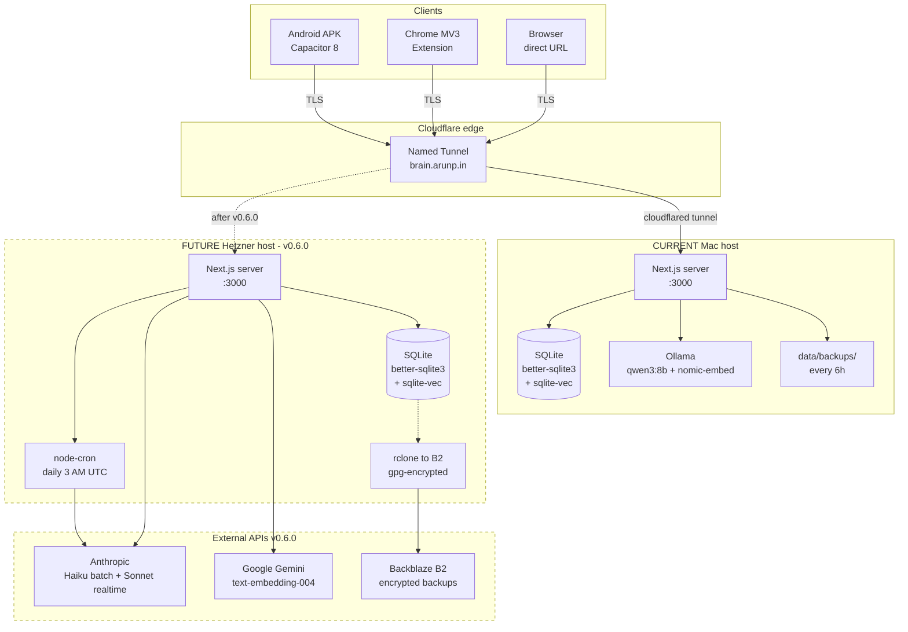

# M1 — Architecture

**Version:** 1.0
**Date:** 2026-05-12
**Previous version:** `Handover_docs_11_05_2026/01_Architecture.md`
**Baseline:** full — stands alone
**Scope:** pre-v0.6.0 (current prod) + post-v0.6.0 (target) architectures
**Applies to:** both lanes
**Status:** COMPLETE (documentation)

> **For the next agent:** AI Brain is in an architectural transition. Everything you see running today is the **pre-v0.6.0** stack. The v0.6.0 migration flips the backend from Mac-hosted to cloud-hosted, swaps Ollama for Anthropic + Gemini APIs, and moves enrichment to a daily batch. Both stacks are documented here. When reading code in `src/`, assume **pre-v0.6.0** is source of truth. When reading `docs/research/*`, assume **post-v0.6.0** is the target. The dividing line is the v0.6.0 cutover.

---

## 1. One-paragraph summary

AI Brain is a **local-first personal knowledge app** combining Recall.it (article/link save, search) and Knowly (Q&A against your library) into one tool. Built with Next.js 15, better-sqlite3, sqlite-vec, and Ollama for local LLM/embeddings. Two clients: a Capacitor Android APK and a Chrome MV3 extension, both authenticated via a shared-secret bearer token and reachable over a Cloudflare Named Tunnel (`brain.arunp.in`). Single user. No multi-tenancy. Currently runs on the user's Mac; v0.6.0 moves the backend to a Hetzner Helsinki VM.

## 2. Tech stack (pre-v0.6.0 — current prod)

| Layer | Choice | Version | Notes |
|---|---|---|---|
| Runtime | Node.js | 20.x | `.nvmrc` not enforced; user runs system node |
| Framework | Next.js | 15.x (app router) | standalone build for APK + local dev |
| UI | React 19 + Tailwind | — | Radix + shadcn; Inter/Charter/JetBrains Mono self-hosted |
| DB | SQLite (better-sqlite3) | 11.x | WAL mode, ~180 KB live |
| Vector | sqlite-vec extension | latest | 768-dim `chunks_vec` virtual table |
| LLM (Ask) | Ollama (qwen3:8b) | local | SSE streaming via `/api/ask/stream` |
| LLM (enrich) | Ollama (qwen3:8b) | local | one-shot; queue in `enrichment_jobs` |
| Embeddings | Ollama (`nomic-embed-text`) | local | 768-dim, 137M params |
| Auth | Bearer token | custom | 32-byte hex, rotatable via `/settings/lan-info` |
| Android | Capacitor 8 | — | APK sideloaded; WebView over tunnel |
| Chrome | MV3 extension | — | host permissions bypass CORS; Vite + @crxjs |
| Tunnel | Cloudflare Named Tunnel | cloudflared 2024.x | `brain.arunp.in` → `http://127.0.0.1:3000` |
| Backup | Node-internal every 6h → `data/backups/` | — | `src/db/client.ts` scheduler |
| Host | Mac (M1 Pro / 32GB / 455GB free) | — | `npm run start` + launchd cloudflared daemon |

## 3. Tech stack (post-v0.6.0 — target)

| Layer | Change | New choice | Source spike |
|---|---|---|---|
| Host | Mac → cloud VM | Hetzner CX23 Helsinki (€4.99 + €0.55 IPv4 = ~$5.59/mo) | `docs/research/budget-hosts.md` |
| LLM (Ask) | Ollama → Anthropic | Claude Sonnet 4.6 via realtime streaming | `docs/research/ai-provider-matrix.md` |
| LLM (enrich) | Ollama → Anthropic | Claude Haiku 4.5 via Batch API (daily 3 AM UTC) | `docs/research/enrichment-flow.md` |
| Embeddings | Ollama → Gemini | Google `text-embedding-004` free tier | `docs/research/embedding-strategy.md` |
| Backup | Local-only → Backblaze B2 | cron + rclone, gpg-encrypted client-side | `docs/plans/spikes/v0.6.0-cloud-migration/S-7-MIGRATION-RUNBOOK.md` |
| Enrichment trigger | Auto on capture → daily batch + manual button | node-cron + Batch API | S-3 |

**Unchanged:** Next.js, SQLite schema, bearer auth, Cloudflare tunnel (same `brain.arunp.in`), APK + extension (no client changes).

## 4. System topology diagram



## 5. Repo structure (current)

```
ai-brain/
├── src/
│   ├── app/                    # Next.js app router; API routes under /api/*
│   │   ├── api/capture/url/    # article + YouTube capture entry point
│   │   ├── api/ask/stream/     # SSE Ask endpoint
│   │   ├── api/items/          # CRUD + enrich
│   │   └── settings/           # bearer token UI, device pairing QR
│   ├── components/             # React + shadcn UI
│   ├── db/
│   │   ├── client.ts           # better-sqlite3 singleton + backup scheduler
│   │   ├── items.ts            # insert/read items
│   │   └── migrations/         # 007_youtube_duration.sql latest
│   ├── lib/
│   │   ├── capture/            # article (Readability) + YouTube (InnerTube)
│   │   ├── embed/              # Ollama client (will gain gemini.ts in v0.6.0)
│   │   ├── enrich/             # Ollama pipeline (will gain batch.ts in v0.6.0)
│   │   ├── ask/                # SSE streaming + retrieval
│   │   ├── auth/bearer.ts      # shared-secret auth
│   │   └── ... (15 more modules)
│   └── proxy.ts                # dev tunnel helper
├── extension/                  # Chrome MV3 extension (Lane L owns polish)
├── android/                    # Capacitor APK project (Lane L owns bugs)
├── scripts/                    # smoke tests, APK build, backfill
├── data/                       # SQLite + backups + errors log (gitignored)
├── docs/
│   ├── research/               # 9 v0.6.0 spike outputs (2026-05-12)
│   └── plans/                  # phase plans, DUAL-AGENT-HANDOFF, LANE-L-BOOTSTRAP
└── Handover_docs/              # <- you are here
    └── Handover_docs_12_05_2026/
```

## 6. Data flow — capture path (pre-v0.6.0)

1. User shares URL from APK / clicks extension button → HTTPS to `brain.arunp.in`
2. Cloudflare tunnel → Mac port 3000 → Next.js `POST /api/capture/url`
3. Bearer auth check (`src/lib/auth/bearer.ts`)
4. URL classification: YouTube pattern → `extractYoutubeVideo()` (InnerTube); else → `extractArticleFromUrl()` (Readability)
5. Content inserted into `items` table (migration 007 adds `duration_seconds`)
6. Chunk pipeline → Ollama embeddings → `chunks_vec` (sqlite-vec)
7. Enrichment queued in `enrichment_jobs` → Ollama qwen3:8b → completes async
8. Client polls `/api/items/:id` until enrichment done

## 7. Data flow — capture path (post-v0.6.0)

Steps 1–4: unchanged. Steps 5–8 change:

5. Content inserted into `items` (new: `enrichment_state='pending'`, `batch_id=NULL`)
6. Chunk pipeline → **Gemini** `text-embedding-004` → `chunks_vec` (same 768 dim, no schema change)
7. No immediate enrichment. Row sits at `pending` until:
   - Daily 3 AM UTC cron picks up all pending rows → single Batch API call to Claude Haiku 4.5 → 24h turnaround
   - User clicks "Enrich now" in UI → realtime Haiku call (not batch)
8. Polling endpoint now also checks `batch_id` for in-flight batches

## 8. Data flow — Ask (unchanged across versions)

1. Client POSTs query to `/api/ask/stream`
2. Bearer auth
3. Retrieve: top-k vector search (`chunks_vec`) + optional BM25 (`fts5` on `items`)
4. Compose prompt with retrieved chunks
5. Stream LLM response via SSE (pre-v0.6.0 = Ollama; post-v0.6.0 = Claude Sonnet 4.6)
6. Client renders token-by-token

## 9. SoT (source-of-truth) table

When docs disagree with code, code wins. These are the current sources of truth:

| Topic | Authoritative source | Evidence |
|---|---|---|
| Current schema | `src/db/migrations/*.sql` + `src/db/client.ts` ItemRow type | **(SoT: code)** |
| Current capture logic | `src/lib/capture/youtube.ts` + `src/lib/capture/article.ts` | **(SoT: code)** |
| Current enrichment | `src/lib/enrich/pipeline.ts` + `src/app/api/items/[id]/enrich/route.ts` | **(SoT: code)** |
| Current embedding | `src/lib/embed/ollama.ts` | **(SoT: code)** |
| Target enrichment flow | `docs/research/enrichment-flow.md` | **(SoT: doc — not yet coded)** |
| Target embedding provider | `docs/research/embedding-strategy.md` | **(SoT: doc — not yet coded)** |
| Target host spec | `docs/research/budget-hosts.md` | **(SoT: doc — server provisioned, not configured)** |
| Auth posture | `src/lib/auth/bearer.ts` | **(SoT: code)** |
| Feature inventory | `FEATURE_INVENTORY.md` | **(SoT: doc — Recall+Knowly catalog, 47 features)** |
| Version sequencing | `ROADMAP_TRACKER.md` | **(SoT: doc)** |

## 10. Key architectural invariants

1. **Single-user.** No user table, no multi-tenancy, no row-level security. Bearer = god-mode.
2. **Local-first (pre-v0.6.0) → cloud-hosted (post-v0.6.0).** The "first" means "primary storage"; v0.6.0 keeps SQLite (not Postgres) and keeps WAL on local SSD (not networked storage).
3. **SQLite WAL cannot live on networked storage.** This invariant ruled out Fly.io in S-6.
4. **All clients speak to the same `brain.arunp.in`.** One tunnel endpoint serves APK + extension + browser; v0.6.0 just re-points the origin.
5. **Embeddings are 768-dim.** Locked by `chunks_vec float[768]`. Switching embedding providers requires matching dim or re-embedding all chunks.
6. **Enrichment is not required for search.** Vector + BM25 retrieval works on raw chunks; enrichment adds title/summary/quotes for reading UX. If enrichment fails or lags 24h, nothing breaks.
7. **Bearer token rotation is user-triggered**, via `/settings/lan-info` page. No periodic auto-rotation.
