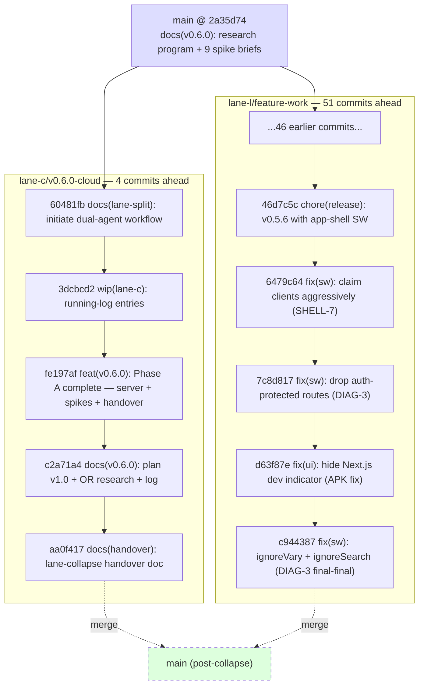

# AI Brain: Architecture (handover — 2026-05-14 lane-collapse)

| Field | Value |
|-------|--------|
| **Version** | **1.0** |
| **Date** | May 14, 2026 |
| **Previous version** | [Handover_docs_12_05_2026/01_Architecture.md](../Handover_docs_12_05_2026/01_Architecture.md) (v1.0) |
| **Baseline** | [Handover_docs_12_05_2026/](../Handover_docs_12_05_2026/) (**v1**) |

> **For the next agent:** This file documents the **branch-level architecture** at the end of the dual-lane phase — what each lane covers, where they diverge, and how they merge. For the **product-level architecture** (Next.js + SQLite + Cloudflare tunnel + Hetzner cutover), read [Handover_docs_12_05_2026/01_Architecture.md](../Handover_docs_12_05_2026/01_Architecture.md) — it remains valid for both pre- and post-collapse state.

## 1. Problem statement

The project ran two parallel git lanes from 2026-05-12 to 2026-05-14 to let cloud-migration research (Lane C) proceed in parallel with feature work (Lane L) without blocking. Both lanes diverged from `main @ 2a35d74` and produced shippable artifacts. The user has now ended the dual-lane phase: **merge both lanes back into `main`, drop the lane branches, return to single-lane work.**

## 2. System topology — branch view at handover

The two lanes share `main @ 2a35d74` as their **only** merge base. Neither lane has merged the other's work back. After the collapse, both lanes are deleted; `main` carries 55 new commits (4 from C + 51 from L).

## 3. Lane divergence — request paths analogue

Where M1 in [Handover_docs_12_05_2026/01_Architecture.md §6](../Handover_docs_12_05_2026/01_Architecture.md) maps API request paths, this section maps **work paths** — what each lane was responsible for and where outputs landed.

| Path | Step | Behavior |
|------|------|----------|
| `lane-c/v0.6.0-cloud` | 1 | Cloud-migration research (9 spikes S-1..S-9) authored under `docs/research/` |
| | 2 | Hetzner CX23 server provisioned + hardened (Phase A); SSH config in `/etc/ssh/sshd_config.d/99-brain-hardening.conf` |
| | 3 | v0.6.0 implementation plan v1.0 authored: `docs/plans/v0.6.0-cloud-migration.md` |
| | 4 | OpenRouter evaluation: `docs/research/openrouter-provider-evaluation.md` |
| | 5 | Two handover packages: `Handover_docs_12_05_2026/` (baseline) + `Handover_docs_14_05_2026_LANE/` (this) |
| `lane-l/feature-work` | 1 | Released v0.5.4 + v0.5.5 (offline mode) + v0.5.6 (app-shell SW) |
| | 2 | Authored `src/lib/outbox/`, `src/lib/queue/sync-worker.ts`, `src/app/inbox/`, `public/sw.js`, `src/lib/sw/` |
| | 3 | Authored `docs/plans/v0.5.6-app-shell-sw*.md`, `v0.6.x-augmented-browsing.md` (v1+v2), `v0.6.x-graph-view.md` (v1), `v0.6.x-offline-mode-apk.md` (v1+v2+v3), `v0.7.x-offline-workmanager-roadmap.md` |
| | 4 | DIAG-1..4 service-worker stability fixes |
| | 5 | One handover package: `Handover_docs_13_05_2026/` (Lane L's own snapshot) |

## 4. Source-of-truth table

| Topic | Authoritative location | May be stale |
|-------|------------------------|--------------|
| **Branch state at handover** | `git log --oneline lane-c/v0.6.0-cloud lane-l/feature-work main` **(SoT: code)** | Any text claim in this doc |
| **Lane C deliverables** | Commits `60481fb..aa0f417` on `lane-c/v0.6.0-cloud` | Per-file claims in §3 |
| **Lane L deliverables** | Commits `main..lane-l/feature-work` (51 commits) | Per-file claims in §3 |
| **Files conflicting between lanes** | `comm -12 <(git diff --name-only main..lane-c/v0.6.0-cloud sort) <(git diff --name-only main..lane-l/feature-work sort)` **(SoT: code)** | The 3 files listed below |
| **Stash contents** | `git stash list` + `git stash show -u stash@{N}` **(SoT: code)** | M3 §1.4 inventory |
| **Pre-collapse Hetzner state** | SSH into `204.168.155.44`; check `systemctl status` (no services running yet) **(SoT: code)** | Phase A description |
| **Pre-collapse Mac state** | `launchctl list grep brain` returns Mac brain services **(SoT: code)** | Pre-cutover assertion |

## 5. Files touched by both lanes (merge conflict surface)

These are the **only** files modified by both lanes. All 3 are markdown documentation; **no source code conflicts**.

| File | Lane C change | Lane L change | Resolution rule |
|------|---------------|---------------|-----------------|
| `RUNNING_LOG.md` | +3 entries (`2026-05-12 10:55`, `2026-05-14 18:11`, `2026-05-14 21:05`), all `[Lane C]` tagged | +N entries (`2026-05-12 13:55` through `2026-05-13 21:17`), some untagged | Keep ALL entries; sort chronologically by timestamp; append-only invariant |
| `docs/plans/DUAL-AGENT-HANDOFF-PLAN.md` | Created on lane-c | Modified on lane-l | Prefer Lane C version (canonical author); add SUPERSEDED note at top |
| `docs/plans/LANE-L-BOOTSTRAP.md` | Created on lane-c | Modified on lane-l | Prefer Lane C version; add SUPERSEDED note at top |

Detailed resolution scripts in [`07_Deployment_and_Operations.md §3`](./07_Deployment_and_Operations.md).

## 6. Decisions / alternatives rejected

| Decision | Chosen | Rejected | Rationale |
|----------|--------|----------|-----------|
| Merge strategy | Sequential merges (Lane C first, then Lane L) | Octopus merge | Linear `git log --first-parent` clarity; per-step validation gates |
| Lane order in merge | Lane C first | Lane L first | Lane C is smaller (4 commits, all docs) — surfaces any base-merge issues fast before Lane L's 51-commit code surface lands |
| Branch deletion timing | After CI green on `main` | Immediately after merge | 7-day grace period via tag `lane-collapse-YYYY-MM-DD` lets us revert if a regression surfaces |
| Stash retention | Apply only `stash@{3}` (edges + gradle), drop `stash@{1}` and `stash@{2}` | Apply all 4 | `stash@{1}` contents already in commit `c2a71a4`; `stash@{2}` is duplicate of `stash@{0}`; `stash@{3}` is the only stash with unique tracked content (`009_edges.sql`) |
| v0.6.0 plan execution timing | After lane collapse + Stage 4 review | Before lane collapse | Plan refactors `src/lib/llm/ollama.ts` which is shared infrastructure — touching it during dual-lane risks rework when Lane L work merges |

## 7. Post-collapse architecture pointer

After the merge, AI Brain returns to its [pre-cutover product architecture](../Handover_docs_12_05_2026/01_Architecture.md) — Mac-hosted Next.js + Ollama + SQLite, served via Cloudflare Named Tunnel at `brain.arunp.in`. The Hetzner box at `204.168.155.44` remains hardened and idle until Phase D of the v0.6.0 plan deploys to it.

The provider-agnostic LLM wrapper introduced in `docs/plans/v0.6.0-cloud-migration.md` §3.1 (committed in `c2a71a4`) has NOT been implemented yet. Phase B-1 begins after plan v1.1 is locked.

## 8. Related reading

- [`HANDOVER.md`](./HANDOVER.md) — executive summary
- [`02_Systems_and_Integrations.md`](./02_Systems_and_Integrations.md) — runtime + per-lane code surface detail
- [`Handover_docs_12_05_2026/01_Architecture.md`](../Handover_docs_12_05_2026/01_Architecture.md) — full product architecture (pre + post v0.6.0)
- [`docs/plans/v0.6.0-cloud-migration.md`](../../docs/plans/v0.6.0-cloud-migration.md) — what comes after the collapse
