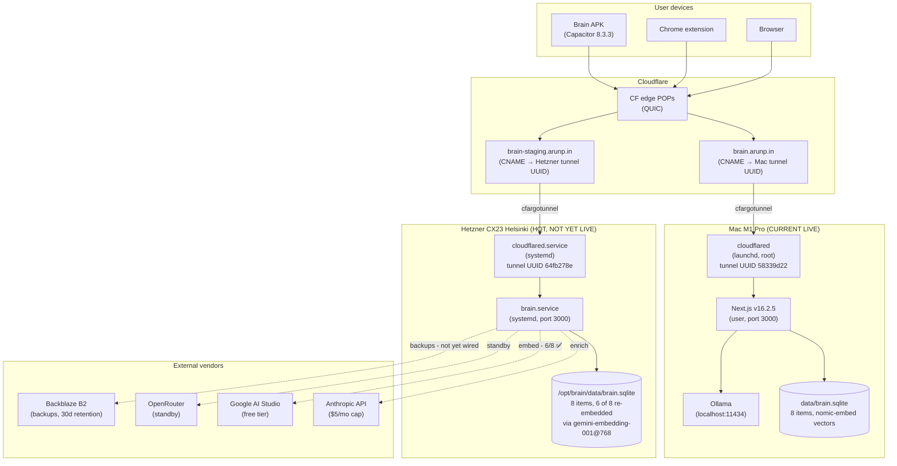

> **For the next agent:** This file describes AI Brain's topology at the partial-cutover state. The Hetzner box is hot but not behind the live URL. Mac is still serving production. Read §3 first if you only have 5 minutes.

# 1. Project at a glance

**AI Brain** — single-user, local-first knowledge app. Recall.it + Knowly clone. v0.5.6-tagged on disk; v0.6.0 cloud migration in progress (Phases A, B, C complete; D in flight; E + F pending).

**Stack:**
- Next.js 16.2.5 + React (UI)
- better-sqlite3 11.10.0 + sqlite-vec 0.1.9 (storage)
- Provider-agnostic LLM wrapper (Anthropic / OpenRouter / Ollama)
- Provider-agnostic embed wrapper (Gemini / Ollama)
- Capacitor 8.3.3 APK
- Cloudflare Named Tunnel (`brain.arunp.in`)

**User profile:** non-technical (per memory `user_non_technical_full_ai_assist.md`); agent writes all code, explains in plain language.

**GitHub:** `arunpr614` (personal). NEVER use ToastTab work account (per memory `feedback_never_use_work_github.md`).

**Hardware:**
- Mac M1 Pro / 32 GB / 455 GB free (per memory `reference_mac_hardware.md`)
- Hetzner CX23 Helsinki, `204.168.155.44`, hardened in Phase A

# 2. Topology — current (partial cutover state)

# 3. Where the cutover stands

| Phase | Status | Notes |
|---|---|---|
| **A** Hetzner hardening | ✅ shipped pre-Phase B | `fe197af` |
| **B** Provider-agnostic LLM + embed wrappers | ✅ shipped at `phase-b/v0.6.0` | All 13 tasks |
| **C** Batch enrichment + cron | ✅ shipped at `e8ac3ce` | All 10 tasks |
| **D-1..D-4** Vendor accounts + keys | ✅ in `.env` | Anthropic, Gemini, OpenRouter, B2 |
| **D-5** gpg keypair | ✅ on Mac | fp `950DF65D...4E82D84B` |
| **D-6** `/etc/brain/.env` | ✅ on Hetzner | mode 0600 |
| **D-7** Standalone build | ✅ shipped at `5e39d32` | `output: "standalone"` |
| **D-8** rsync to Hetzner | ✅ /opt/brain populated | better-sqlite3 + sqlite-vec linux-x64 |
| **D-9** systemd unit | ✅ shipped at `5e39d32` | `scripts/deploy/brain.service` |
| **D-10** cloudflared preview | ✅ live at `brain-staging.arunp.in` | tunnel UUID `64fb278e...` |
| **S-13** Embeddings re-decision | ✅ shipped (`e68314c`, `388ad7e`, `656c4a4`) | gemini-embedding-001 @ 768 |
| **D-11** Hetzner wire smoke | ✅ Anthropic + Gemini wires verified | $0.0001 spent |
| **D-12** Mac DB → Hetzner | ⚠️ **PARTIAL** | DB swap done; 6/8 items embedded |
| **D-13** DNS swap | ❌ NOT RUN | `brain.arunp.in` still → Mac |
| **D-14** Stop Mac brain | ❌ NOT RUN | Mac processes still active |
| **D-15..D-18** Validation | ❌ NOT STARTED | post-cutover |

# 4. Source-of-truth table

When documentation disagrees with code, code wins. Annotate `**(SoT: code)**`.

| Topic | Doc | Code SoT | Discrepancy |
|---|---|---|---|
| Embed model | [docs/research/embedding-strategy.md](../../docs/research/embedding-strategy.md) says `text-embedding-004` | `src/lib/embed/gemini.ts` line 18: `const DEFAULT_MODEL = "gemini-embedding-001"` **(SoT: code)** | Doc has supersede banner; code is correct |
| Embed dim | All docs say 768 | `src/lib/embed/types.ts: EMBED_OUTPUT_DIM = 768` **(SoT: code)** | None |
| Cron schedule | Plan §3.5: `'30 19 * * *' UTC = 01:00 IST submit; '*/5 * * * *' poll` | `src/lib/queue/enrichment-batch-cron.ts` **(SoT: code)** | None |
| `BATCH_SIZE` | This handover M9: documented as 16 | `src/lib/embed/pipeline.ts:23: const BATCH_SIZE = 16` **(SoT: code)** | None |
| Inter-call delay | This handover M9: 1.1s | `src/lib/embed/gemini.ts` (working tree, uncommitted) `setTimeout(r, 1100)` **(SoT: working-tree code)** | Diff vs `main`: pending commit decision |
| Bearer routes | This handover M2: capture + items + health | `src/lib/auth/bearer.ts:67: BEARER_ROUTES = [...]` **(SoT: code)** | None |
| Hetzner SSH user | Plan: `brain` | `~/.ssh/known_hosts` + working SSH `brain@204.168.155.44` **(SoT: code)** | None |

# 5. Topology change since prior handover

**vs. baseline `Handover_docs_19_05_2026_PHASE_D_PROGRESS` (this morning's handover):**

| Element | Then (morning) | Now |
|---|---|---|
| Hetzner DB | empty (1 item from D-11 smoke) | 8 items from Mac (6/8 embedded with gemini-768) |
| `brain-staging.arunp.in` | live, served Hetzner | live, served Hetzner |
| `brain.arunp.in` | live, served Mac | live, served Mac |
| `cutover.sh` | written, untested | run once; **WAL-leak bug** discovered, recovered |
| Working tree | clean | dirty (`gemini.ts` serial-loop + 1.1s delay) |

# 6. Subsystems pointer index

| Subsystem | Code root | Tests | Notes |
|---|---|---|---|
| LLM provider wrapper | [src/lib/llm/](../../src/lib/llm/) | `*.test.ts` co-located | Anthropic / OpenRouter / Ollama, factory at `factory.ts` |
| Embed provider wrapper | [src/lib/embed/](../../src/lib/embed/) | `*.test.ts` co-located | Gemini / Ollama, factory at `factory.ts: getEmbedProvider()` |
| Embedding pipeline | [src/lib/embed/pipeline.ts](../../src/lib/embed/pipeline.ts) | `pipeline.test.ts` | `chunkBody → embed → write chunks_vec` per-item transaction |
| Batch enrichment | [src/lib/queue/enrichment-batch.ts](../../src/lib/queue/enrichment-batch.ts) | `enrichment-batch.test.ts` | C-3, daily 01:00 IST submit |
| Cron lifecycle | [src/lib/queue/enrichment-batch-cron.ts](../../src/lib/queue/enrichment-batch-cron.ts) | `enrichment-batch-cron.test.ts` | C-4, node-cron in instrumentation.ts |
| Auth (bearer + cookie) | [src/lib/auth/bearer.ts](../../src/lib/auth/bearer.ts) + [src/lib/auth.ts](../../src/lib/auth.ts) | `bearer.test.ts` | BEARER_ROUTES allow-list determines API surface |
| DB client + migrations | [src/db/client.ts](../../src/db/client.ts), [src/db/migrations/](../../src/db/migrations/) | per-migration test | 8 migrations applied, sqlite-vec loaded at boot |
| Cutover scripts | [scripts/deploy/](../../scripts/deploy/) | none (deployment-time only) | `brain.service`, `cutover.sh` (has WAL-leak bug) |

# 7. What this architecture is NOT

- **Not multi-user.** Single bearer token, single user.
- **Not horizontally scaled.** Single VM, single Next.js process, single SQLite.
- **Not always-correct-after-cutover.** The 3 deployment-time bugs from this session show that even with all unit tests green, deployment-equivalence smoke is missing. Phase E candidate.
