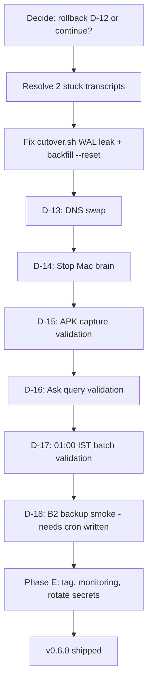

> **For the next agent:** This file is the consolidated roadmap. Use it to navigate "what's done, what's blocked, what's next." Phase D is partially shipped; resuming requires the decisions in M7 + the bug fixes in M8.

# 1. Roadmap snapshot

```
v0.5.6 (tagged on disk) ─┐
                         │
v0.6.0 cloud migration   │
├── Phase A   ✅ shipped  (Hetzner CX23 hardened)
├── Phase B   ✅ shipped  (LLM + embed factory)            tag phase-b/v0.6.0
├── Phase C   ✅ shipped  (batch + cron + endpoint + UI)
├── Phase D   ⚠️ PARTIAL                                  tag phase-d-blocked-on-embeddings/v0.6.0
│   ├── D-1..D-11 ✅
│   ├── S-13 (embed re-decision) ✅
│   ├── D-12 ⚠️ DB on Hetzner; 6/8 items embedded
│   ├── D-13 ❌ NOT RUN (DNS swap)
│   ├── D-14 ❌ NOT RUN (stop Mac brain)
│   └── D-15..D-18 ❌ NOT STARTED (validation)
├── Phase E   ❌ pending  (cleanup + tag v0.6.0)
└── Phase F   ❌ pending  (OpenRouter A/B, optional)

v0.6.x — GenPage + clusters (separate milestone)
v0.7.0 — Ollama removal + post-cloud cleanup
v1.0.0 — TBD
```

# 2. Phase D detailed status

| ID | Task | Status | Anchor |
|---|---|---|---|
| **D-1** Anthropic key + caps | ✅ user-side | $5 hard / $3 soft alert |
| **D-2** Gemini key | ✅ user-side | aistudio.google.com |
| **D-3** OpenRouter key | ✅ user-side | standby |
| **D-4** B2 bucket + scoped key | ✅ user-side | bucket `ai-brain-backups-arunpr614`, lifecycle 30d |
| **D-5** gpg keypair on Mac | ✅ | RSA 4096, fp `950DF65D...4E82D84B` |
| **D-6** /etc/brain/.env on Hetzner | ✅ | 13 vars, mode 0600 |
| **D-7** Standalone build | ✅ commit `5e39d32` | `output: "standalone"` in `next.config.ts` |
| **D-8** rsync to Hetzner | ✅ | 62 MB on /opt/brain |
| **D-9** systemd unit | ✅ commit `5e39d32` | `scripts/deploy/brain.service` |
| **D-10** cloudflared preview tunnel | ✅ | `brain-staging.arunp.in` live |
| **S-13** embed re-decision | ✅ commits `e68314c`, `388ad7e`, `656c4a4` | gemini-embedding-001 @ 768 |
| **D-11** Hetzner wire smoke | ✅ | Anthropic + Gemini wires verified |
| **D-12** Mac DB → Hetzner | ⚠️ **PARTIAL** | DB on Hetzner; 6 of 8 items embedded |
| **D-13** DNS swap | ❌ NOT RUN | brain.arunp.in still → Mac |
| **D-14** Stop Mac brain | ❌ NOT RUN | Mac processes still up |
| **D-15** Capture from APK | ❌ NOT STARTED | post-cutover |
| **D-16** Ask query in browser | ❌ NOT STARTED | post-cutover |
| **D-17** Wait for 01:00 IST batch | ❌ NOT STARTED | overnight |
| **D-18** B2 backup smoke | ❌ NOT STARTED | needs system cron written first |

# 3. Critical path to ship v0.6.0



# 4. Source-of-truth links

| Doc | Path | Authority |
|---|---|---|
| Plan (v1.1 + S-13) | [docs/plans/v0.6.0-cloud-migration.md](../../docs/plans/v0.6.0-cloud-migration.md) | scope of v0.6.0 |
| S-13 spike | [docs/plans/spikes/v0.6.0-cloud-migration/S-13-embeddings-redecision.md](../../docs/plans/spikes/v0.6.0-cloud-migration/S-13-embeddings-redecision.md) | embed-model decision |
| LLM provider env contract | [docs/llm-providers.md](../../docs/llm-providers.md) | env-var ground truth |
| RUNNING_LOG entry #43 | [RUNNING_LOG.md](../../RUNNING_LOG.md) (line ~4549+) | session-by-session narrative |
| Cutover script | [scripts/deploy/cutover.sh](../../scripts/deploy/cutover.sh) | **(SoT: code)** — has WAL-leak bug |
| systemd unit | [scripts/deploy/brain.service](../../scripts/deploy/brain.service) | **(SoT: code)** |
| Backfill script | [scripts/backfill-embeddings.mjs](../../scripts/backfill-embeddings.mjs) | **(SoT: code)** — has --reset wipe bug |

# 5. Remaining work breakdown (ordered by blast radius)

## 5.1 Pre-D-13 (must complete before flipping live URL)

1. **Decide rollback policy.** Options in M7. **(User said: "let the next agent decide rollback")**.
2. **Decide gemini.ts commit policy.** Working tree has serial-loop + 1.1s delay; commit or discard.
3. **Resolve 2 stuck transcripts.** Item ids `c3fa6db5684309eff5080ab5` (Hindi, 111k chars) + `1035317b0244e4d994e4fefd` (English, 50k chars). Options: longer delays / smaller chunks / paid Gemini tier / accept partial coverage.
4. **Fix `cutover.sh` WAL leak** — see M8 §1.
5. **Fix `backfill-embeddings.mjs --reset` wipe predicate** — see M8 §2.

## 5.2 D-13 + D-14 (cutover finish)

6. Verify CNAME still → Mac (`d13_tunnel_swap` precondition).
7. Run `./scripts/deploy/cutover.sh cutover` after fixes — note: this re-runs D-12 too. May need a `--skip-d12` flag or manual command sequencing.
8. Probe `brain.arunp.in/api/health` returns 200 from Hetzner.
9. `pkill -f "next-server.*v16"` on Mac to free port 3000.

## 5.3 D-15..D-18 (24-hour validation)

10. **D-15** capture from APK on phone — should appear in library at `pending`.
11. **D-16** Ask query in browser — Sonnet streams; first cookie-side spend lands.
12. **D-17** wait overnight; verify item transitions `pending` → `batched` → `done` after 01:00 IST batch run.
13. **D-18** backup smoke. **Prerequisite:** write the system-cron script (`sqlite3 .backup → gzip → gpg → rclone`). Spec in plan §3.5; no script yet.

## 5.4 Phase E (cleanup, tag, ship)

14. Delete `OLLAMA_HOST` defaults from prod config (keep dev mode).
15. Update Architecture handover doc to mark Hetzner as CURRENT.
16. Add monitoring: Anthropic spend, B2 size, UptimeRobot uptime.
17. Rotate ALL chat-exposed secrets (M3 §6).
18. `git tag -a v0.6.0`.

## 5.5 Phase E hygiene (deferrable)

19. Clean `/opt/brain/node_modules` bloat (555 transitive packages from `--no-save` installs).
20. Remove `tsx` dependency on Hetzner (pre-compile scripts to JS or use a different runner).
21. Properly tracked `tsconfig.json` deploy or remove path-alias dependency.
22. Fix `outputFileTracingRoot` to shrink standalone bundle 510 MB → ~62 MB.
23. Retire/rewrite `npm run smoke:0.5.1` (broken since `node-cron` was added in B-11).
24. Run `npm audit` + fix vulnerabilities (1 moderate + 1 high reported during install).
25. Pre-existing: re-verify v0.5.6 APK on Pixel 7 Pro.
26. Pre-existing: empirical `'batched'` pill verification with a real batch.
27. Pre-existing: Mac `better-sqlite3` Node v22→v26 build mismatch fix.
28. Pre-existing: lift `OllamaProvider` class-method coverage from 58% → 80%.

## 5.6 Phase F (optional, post-v0.6.0)

29. OpenRouter A/B validation with `LLM_ASK_PROVIDER=openrouter` for one Ask query.

# 6. Estimated effort

| Block | Estimated wall-clock |
|---|---|
| Pre-D-13 fixes (#1–#5) | 30–60 min depending on Gemini decision |
| D-13 + D-14 (#6–#9) | 5–10 min |
| D-15 + D-16 (#10–#11) | 5 min user-side |
| D-17 (#12) | overnight wait + 5 min check |
| D-18 (#13) | 30–60 min (system cron + smoke) |
| Phase E core (#14–#18) | 1–2 hours |
| Phase E hygiene (#19–#28) | 4–6 hours total, deferrable |

**Total to v0.6.0 ship:** half-day of focused work + overnight wait.

# 7. Tags + revert anchors

| Tag | Commit | Purpose |
|---|---|---|
| `phase-b/v0.6.0` | `c6d67b1` | Phase B closure (revert anchor for the entire cycle) |
| `phase-d-blocked-on-embeddings/v0.6.0` | `5e39d32` | Pre-S-13 fix; revert here if S-13 needs to be undone |
| `v0.6.0` (planned) | TBD | After D-18 + Phase E |
