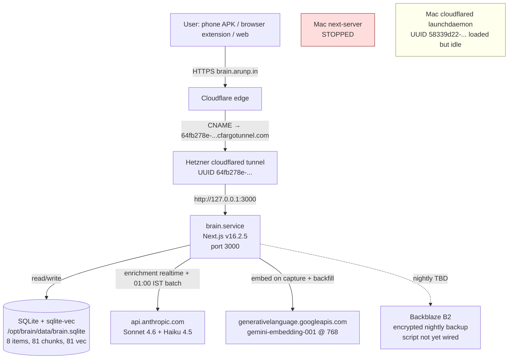

# AI Brain: Architecture (handover — 2026-05-19 cutover-done delta)

| Field | Value |
|-------|--------|
| **Version** | **2.0** (delta) |
| **Date** | May 19, 2026 |
| **Previous version** | [Handover_docs_19_05_2026_13:47/01_Architecture.md](../Handover_docs_19_05_2026_13:47/01_Architecture.md) (v1.0) |
| **Baseline** | [Handover_docs_19_05_2026_13:47](../Handover_docs_19_05_2026_13:47) (**v1**) |

> **For the next agent:** This file documents the **post-cutover topology**. The baseline v1.0 captured a half-state (Mac + Hetzner both serving different hostnames). This v2.0 captures the post-D-13/D-14 reality: Hetzner is the sole serving instance for `brain.arunp.in`.

> **Delta scope:** This file extends [baseline Architecture](../Handover_docs_19_05_2026_13:47/01_Architecture.md). Changes: CNAME flip, Mac brain stopped, Hetzner cloudflared ingress map updated to include `brain.arunp.in`.

## 1. Problem statement

Unchanged from baseline. AI Brain is a local-first knowledge system; v0.6.0 migrates serving from a Mac dev box to a Hetzner cloud server so the user's phone APK and browser extension can capture into Brain regardless of whether the Mac is online.

## 2. System topology (post-cutover)

**Key flows:**
- `brain.arunp.in` CNAME (zone `af88f945669d3e95174e20386a9d2feb`, record `ac9ca4ca42f6c03a3e9970d4a89988d6`) now points at `64fb278e-15eb-4fe2-a1e1-2ca48ee490e7.cfargotunnel.com` (Hetzner tunnel).
- `brain-staging.arunp.in` still works — same tunnel, second ingress entry.
- Mac side: Mac next-server killed (pid 32761 was on :3099); Mac cloudflared launchdaemon is still loaded but idle (CNAME no longer routes to it).

## 3. Request paths / data flows

| Path | Step | Behavior |
|------|------|----------|
| `User → brain.arunp.in/api/health` | 1 | DNS resolves CNAME → `64fb278e-...cfargotunnel.com` |
| | 2 | Cloudflare edge routes to Hetzner tunnel via the named tunnel UUID |
| | 3 | Hetzner cloudflared (per `/etc/cloudflared/config.yml`) matches `brain.arunp.in` ingress rule, forwards to `127.0.0.1:3000` |
| | 4 | brain.service (Next.js standalone) returns 200 in ~720ms total |
| `Capture → embed pipeline` | 1 | POST `/api/items` writes item row, marks `enrichment_state='pending'` |
| | 2 | Embedding worker calls `chunkBody()` → Gemini embedContent serial loop (1.1s delay) |
| | 3 | Single transaction writes `chunks` + `chunks_vec` rows; on failure, BOTH roll back |
| `01:00 IST batch enrichment` | 1 | node-cron `30 19 * * *` (UTC) fires `submitBatch` to Anthropic |
| | 2 | 5-min poll cron picks up completed batches, writes summary/category back |

## 4. Source-of-truth table

| Topic | Authoritative location | May be stale |
|-------|------------------------|--------------|
| Hetzner cloudflared ingress map | [`/etc/cloudflared/config.yml`](N/A — on Hetzner) **(SoT: live config)** | Backup at `/etc/cloudflared/config.yml.pre-d13` |
| Tunnel UUIDs | [`scripts/deploy/cutover.sh`](../../scripts/deploy/cutover.sh) lines 26–28 **(SoT: code)** | Baseline v1 §1.3 |
| CNAME current value | Cloudflare API zone `af88f945669d3e95174e20386a9d2feb` record `ac9ca4ca42f6c03a3e9970d4a89988d6` **(SoT: live DNS)** | Any prior handover |
| Embedding pipeline transaction semantics | [`src/lib/embed/pipeline.ts`](../../src/lib/embed/pipeline.ts) lines 113–128 **(SoT: code)** | None — undocumented behavior pre-this-session |
| Batch + poll cron schedule | [`src/lib/queue/enrichment-batch-cron.ts`](../../src/lib/queue/enrichment-batch-cron.ts) **(SoT: code)** | Baseline v1 |
| Vector coverage | Hetzner DB `chunks_vec` count via `node -e` (vec0 needs sqlite-vec loaded) **(SoT: live DB)** | This file once writes happen |

## 5. Decisions / alternatives rejected (this session)

| Decision | Chosen | Rejected | Rationale |
|----------|--------|----------|-----------|
| How to handle 2 stuck transcripts | C3 (paid Gemini tier) | C1 (5–10s delay), C2 (smaller chunks), C4 (accept partial) | $0.002/mo cost is negligible; removes free-tier rate-limit bottleneck permanently |
| `gemini.ts` working-tree changes | B1 (commit) | B2 (discard), B3 (branch) | Strict improvement; documented limitation |
| Roll back D-12 partial state? | A2 (keep 6/8 + re-embed 2) | A1 (full rollback), A3 (drained Hetzner) | No drift — user not capturing; A1 wastes work |
| Wait 48h before D-13 per pacing memory? | Override (flip today) | Wait until 2026-05-21 | User explicitly authorized override conditional on "nothing else breaks" |
| When initial `brain.arunp.in` 404 surfaced | Add `brain.arunp.in` to existing tunnel ingress (Option α) | Replace `brain-staging.arunp.in` (Option β) | Keeps staging surface available; one extra YAML line |

## 6. Related reading

- [Handover_docs_19_05_2026_13:47/01_Architecture.md](../Handover_docs_19_05_2026_13:47/01_Architecture.md) — full pre-cutover topology
- [02_Systems_and_Integrations.md](./02_Systems_and_Integrations.md) — runtime details delta
- [RUNNING_LOG.md entry #44](../../RUNNING_LOG.md) (search `2026-05-19 15:25`) — full session narrative
