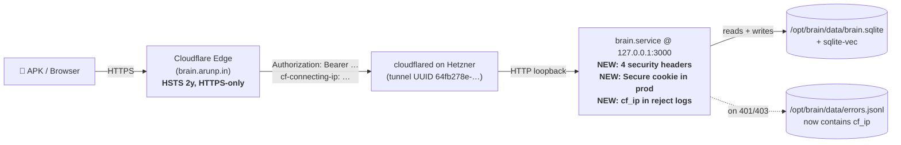

# M1 — Architecture (v0.6.1 T-1..T-4 done delta)

| Field | Value |
|-------|--------|
| **Version** | v1.0 |
| **Date** | 2026-05-19 |
| **Previous version** | n/a |
| **Baseline** | [Handover_docs_19_05_2026_15_21_CUTOVER_DONE/01_Architecture.md](../Handover_docs_19_05_2026_15_21_CUTOVER_DONE/01_Architecture.md) |

> **For the next agent:** Topology unchanged from the cutover-done tranche. This file documents only the new request-pipeline elements: 4 security headers in front of every response, a `Secure` flag on the session cookie, and a `cf_ip` field on bearer-rejection log entries. Everything else (Hetzner brain.service, Cloudflare named tunnel, sqlite-vec, Anthropic + Gemini providers) carries over.

## 1. What changed since the cutover



**(SoT: code)** The four headers are set in [`next.config.ts`](../../next.config.ts) `headers()` block. The `Secure` flag is set in [`src/lib/auth.ts:113-119`](../../src/lib/auth.ts). The `cf_ip` capture is in [`src/proxy.ts:65-100`](../../src/proxy.ts).

## 2. Source-of-truth table for new layer

| Element | Doc claim | Code location | Status |
|---------|-----------|---------------|--------|
| `X-Frame-Options: DENY` | plan §T-3 | `next.config.ts` `headers()` | **(SoT: code)** ✅ |
| `X-Content-Type-Options: nosniff` | plan §T-3 | `next.config.ts` `headers()` | **(SoT: code)** ✅ |
| `Referrer-Policy: strict-origin-when-cross-origin` | plan §T-3 | `next.config.ts` `headers()` | **(SoT: code)** ✅ |
| `Strict-Transport-Security: max-age=63072000; includeSubDomains` | plan §T-3 | `next.config.ts` `headers()` | **(SoT: code)** ✅ |
| Session cookie `Secure` in production | plan §T-2 | `src/lib/auth.ts:118` | **(SoT: code)** ✅ |
| `cf_ip` field on bearer-reject log entries | plan §T-4 | `src/proxy.ts:69`, `:83`, `:94` | **(SoT: code)** ✅ |

## 3. What is explicitly NOT in this layer (and why)

| Header / control | Why omitted |
|------------------|-------------|
| `Content-Security-Policy` | Inline `themeScript` in `src/app/layout.tsx:36` uses `dangerouslySetInnerHTML`. A strict CSP needs nonce wiring or a hoist of that script to a static file. Plan §1 defers to v0.6.3. |
| Explicit `Access-Control-Allow-Origin` | SameSite=Lax + Cloudflare same-origin enforcement + single-user threat model = adding a CORS header changes nothing today. v2.1 audit re-rank dropped this as security-theatre. |
| `robots.txt` | Doesn't stop scanners; auth-gated routes can't be indexed anyway. Hygiene, not security. Will land opportunistically. |

## 4. Verification recipes (for the receiving agent)

### 4.1 All four headers live

```bash
curl -sI https://brain.arunp.in/ | grep -iE "x-frame-options|x-content-type-options|referrer-policy|strict-transport-security"
# Expect:
# x-frame-options: DENY
# x-content-type-options: nosniff
# referrer-policy: strict-origin-when-cross-origin
# strict-transport-security: max-age=63072000; includeSubDomains
```

### 4.2 cf_ip log entry

```bash
# Trigger a 401
curl -s -o /dev/null -w "%{http_code}\n" -H "Authorization: Bearer wrong" https://brain.arunp.in/api/health
# Read the entry on Hetzner
ssh -i ~/.ssh/ai_brain_hetzner brain@204.168.155.44 \
  'tail -1 /opt/brain/data/errors.jsonl'
# Expect a JSON line containing "cf_ip":"<your IP>"
```

### 4.3 Secure cookie (browser, gold-standard)

1. In an interactive browser, log into `https://brain.arunp.in/unlock`.
2. DevTools → Application → Cookies → `brain.arunp.in`.
3. Confirm the session cookie row shows `Secure ✓`.
4. **(SoT: not verified interactively this session — static evidence only.)**

## 5. Topological diff vs cutover-done

| Layer | Cutover-done (15:21) | This delta (19:34) |
|-------|----------------------|---------------------|
| DNS / CNAME | Hetzner UUID `64fb278e-…` | unchanged |
| Tunnel ingress | `brain.arunp.in` + `brain-staging.arunp.in` | unchanged |
| brain.service systemd | active on 127.0.0.1:3000 | unchanged (restarted twice this session) |
| `Set-Cookie` flags | `HttpOnly; SameSite=Lax` | `HttpOnly; SameSite=Lax; **Secure**` (in prod) |
| Response headers | (Next.js defaults only) | **+4 security headers** on every route |
| `errors.jsonl` schema | type/path/method/ts | **+ cf_ip** on bearer-reject entries |

## 6. Cross-references

- [M2 — services delta](./02_Systems_and_Integrations.md) — no service churn, only config
- [M8 — deployment](./07_Deployment_and_Operations.md) — corrected 3-tree rsync
- [M9 — debugging](./08_Debugging_and_Incident_Response.md) — header verification recipes
- [`docs/plans/v0.6.1-cloud-cleanup.md`](../../docs/plans/v0.6.1-cloud-cleanup.md) — full task spec for T-2/T-3/T-4
- [`.planning/legacy-feature-audit-v2.md`](../../.planning/legacy-feature-audit-v2.md) — origin of these findings (revision v2.1)
