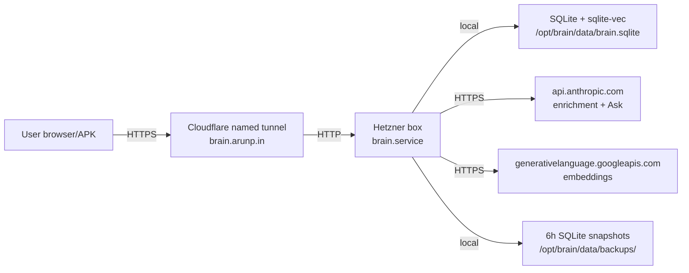

# M1 — Architecture (delta pointer)

| Field | Value |
|-------|-------|
| **Version** | v6 |
| **Date** | 2026-05-20 |
| **Previous version** | v5 baseline |
| **Mode** | Delta — no architecture changes this session |

> **For the next agent:** Architecture is unchanged from baseline. Read this file's §2 only if you need a quick refresher; otherwise skip to `02_Systems_and_Integrations.md` for the substantive deltas.

---

## 1. What this extends

**Required prior reading:** `../Handover_docs_19_05_2026_15_21_CUTOVER_DONE/01_Architecture.md` for the full Mac→Hetzner cutover architecture.

**Net architecture changes 2026-05-20:** zero. No new endpoints, no schema migrations, no new dependencies, no service topology changes.

---

## 2. Topology summary (refresher)

**Source of truth:**
- Service unit **(SoT: code)**: `/etc/systemd/system/brain.service` on Hetzner — verified 2026-05-20 via `systemctl cat brain`.
- Cookie security **(SoT: code)**: `../../src/lib/auth.ts:113-121` — `secure: process.env.NODE_ENV === "production"`.
- Retrieval pipeline **(SoT: code)**: `../../src/lib/retrieve/index.ts:56-` — function `retrieve(query: string, opts: RetrieveOptions)`.

---

## 3. What changed (non-architecture, but relevant to architects)

| Concern | Before today | After today | Source |
|---|---|---|---|
| Cookie Secure flag | Code correct, not empirically verified | Empirically verified PASS after fresh re-issue | RUNNING_LOG #51 |
| Anthropic adapter retry | Only retries on malformed-JSON | Still only that — adding retry-on-5xx is v0.6.2 work | `src/lib/llm/anthropic.ts:174,210,293` |
| `retrieve()` signature | Confirmed `(query: string, opts)` | Same | `src/lib/retrieve/index.ts:56` |

---

## 4. Open architecture-ish questions (for v0.6.2 planning)

These touch architecture only minimally but are worth flagging:

1. **Backup escrow location** — GPG keypair for B2 encryption needs escrow. Architecturally, the choice is "single-host secret" vs "user-controlled secret-store" (1Password / paper / hardware). User's call.
2. **Retry semantics** — does the Anthropic adapter retry policy belong in the adapter, or in a higher-level wrapper? Currently the adapter is the natural home (retry-on-malformed-JSON already lives there).

Neither is a true architecture change; both are policy decisions inside an existing layer.
