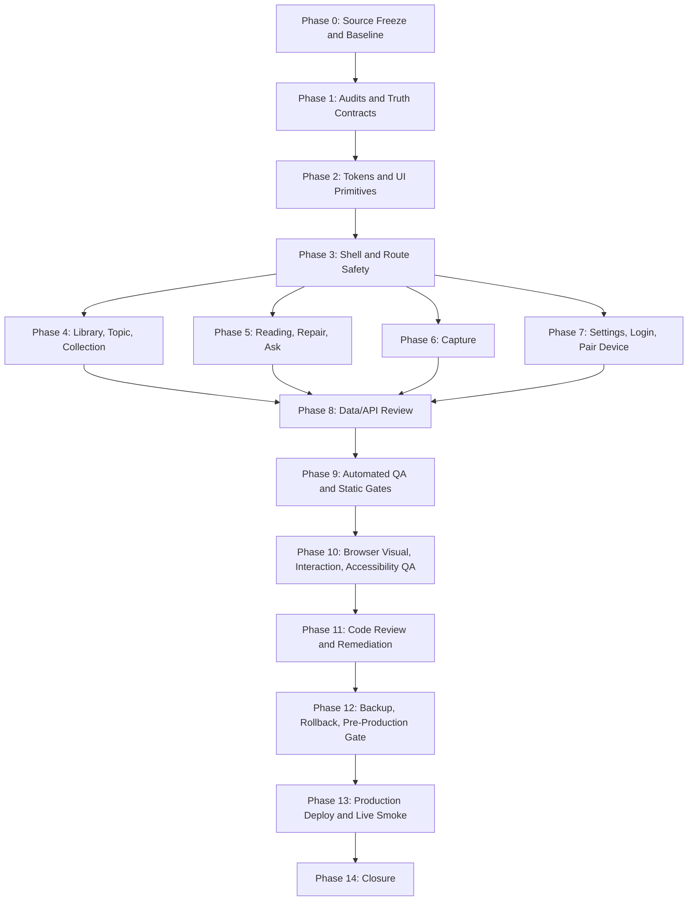

# AI Memory Web Experience Revamp Implementation Plan

**Created:** 2026-06-15 20:35:06 IST
**Plan status:** Ready for execution planning; implementation must still pass Phase 0 and Phase 1 gates before code changes.
**Source PRD:** `/private/tmp/ai-brain-ux-v2-main-ready/UX_v2/execution/WEB_EXPERIENCE_REVAMP_PRD_REVISED_2026-06-15_20-27-04_IST.md`
**Magic Patterns design:** `https://www.magicpatterns.com/c/fhbeo46qahq5fkjfseckxx`
**Project root:** `/private/tmp/ai-brain-ux-v2-main-ready`
**Current observed branch at plan creation:** `codex/ai-brain-ux-v2-magic-patterns`
**Current observed commit at plan creation:** `92fe187`

---

## 1. Objective

Execute the revised Web Experience Revamp PRD end to end: rebuild the AI Memory web/desktop experience to match the approved Magic Patterns desktop design, while preserving production truth and blocking fake prototype functionality.

The implementation must produce a deployable, QA-validated web revamp across:

- Desktop shell/sidebar and responsive-safe layout
- Library
- Needs Upgrade
- Item Detail and focus mode
- Ask and scoped Ask
- Capture
- Settings
- Login/setup/unlock/session states
- Pair Device
- Topic
- Collection
- Shared UI primitives and tokens

The work is not complete until the implementation, evidence, release gates, production deploy, live smoke, and closure artifacts all pass.

---

## 2. Non-Negotiable Rules

1. The revised PRD is the product source of truth.
2. Magic Patterns is the visual and interaction reference, not production truth.
3. Current product behavior wins over prototype behavior where Magic Patterns shows fake or unsupported functionality.
4. Conditional controls fail closed. If no audit row exists, the control remains hidden or clearly disabled.
5. Existing real capabilities must not be removed without an audit row and explicit rationale.
6. No active UI may claim fake QR pairing, offline sync/cache, telemetry, E2EE, connected devices, automatic backups, storage charts, provider metrics, destructive delete, or synced-device state.
7. Manual library export is a separate real capability from fake backup features. Preserve it if validation passes.
8. Pair Device completion requires real code-entry pairing validation, not screenshots alone.
9. P0 functional flows cannot finish as `Browser visual only`.
10. No deploy with failing tests/build, unresolved P0/P1, missing backup/rollback, missing deploy access, incomplete critical UX validation, or unredacted sensitive evidence.

---

## 3. Execution Model

Use one lead integrator with focused sub-workstreams. Parallel agents may inspect and prepare findings, but the lead integrator owns final edits, consistency, QA, and release gates.

| Role | Owner type | Responsibilities |
| --- | --- | --- |
| Lead integrator | Primary agent | Source freeze, architecture choices, final code integration, release gate, deploy/no-deploy decision. |
| Design implementation owner | Parallel-capable | Map MP2 screens to production UI, implement primitives, shell, and screen layouts. |
| Capability audit owner | Parallel-capable | Inspect routes/APIs/actions/tests and fill capability, settings, export, provider, mutation, and pairing matrices. |
| QA/evidence owner | Parallel-capable | Browser screenshots, interaction smoke, accessibility, copy scans, release packet. |
| Release owner | Lead integrator | Backup, rollback, deploy, live smoke, final notes, tracker/log updates. |

Arun decision rule: do not ask for approval during normal execution. Ask only if the audit finds work outside the revised PRD or a release-blocking ambiguity that cannot be safely resolved from the PRD and current product truth.

---

## 4. Required Execution Artifacts

Create these artifacts with fresh timestamps during execution:

| Artifact | Purpose | Required before |
| --- | --- | --- |
| `WEB_EXPERIENCE_REVAMP_BASELINE_<timestamp>.md` | Branch, commit, dirty state, tool versions, route inventory, deploy environment, current blockers. | Coding |
| `source-prds/web-<timestamp>/SOURCE_MANIFEST.md` | Snapshot and checksum of required source docs. | Coding |
| `WEB_EXPERIENCE_REVAMP_DESIGN_TRUTH_MATRIX_<timestamp>.md` | MP2 file list, production adaptation notes, exact screen/state expectations. | Coding |
| `WEB_EXPERIENCE_REVAMP_ROUTE_MAP_<timestamp>.md` | MP2 screen to production route mapping. | Coding |
| `WEB_EXPERIENCE_REVAMP_CAPABILITY_AUDIT_<timestamp>.md` | Conditional feature decisions and evidence. | Coding |
| `WEB_EXPERIENCE_REVAMP_SETTINGS_INVENTORY_<timestamp>.md` | Settings control classification: Active, Disabled Roadmap, Hidden, Deferred. | Settings implementation |
| `WEB_EXPERIENCE_REVAMP_PAIRING_CONTRACT_<timestamp>.md` | Pairing route/API/state contract and validation results. | Pair Device completion |
| `WEB_EXPERIENCE_REVAMP_EXPORT_VALIDATION_<timestamp>.md` | Manual export auth/download/zip/no-secret validation. | Showing active export |
| `WEB_EXPERIENCE_REVAMP_PROVIDER_HEALTH_VALIDATION_<timestamp>.md` | Provider success/degraded/unauth/no-secret evidence. | Showing active provider health |
| `WEB_EXPERIENCE_REVAMP_MUTATION_VALIDATION_<timestamp>.md` | Tag/collection mutation positive, negative, persistence, rollback evidence. | Enabling mutations |
| `WEB_EXPERIENCE_REVAMP_VISUAL_EVIDENCE_MATRIX_<timestamp>.md` | Screenshot and visual rubric results for every screen/state. | Release |
| `WEB_EXPERIENCE_REVAMP_QA_REPORT_<timestamp>.md` | Test/build/accessibility/copy scan/smoke results. | Release |
| `WEB_EXPERIENCE_REVAMP_RELEASE_PACKET_<timestamp>.md` | Backup, rollback, deploy command, pre-prod smoke, live smoke, residual risks. | Deploy |

Update these living files after every milestone:

- `/private/tmp/ai-brain-ux-v2-main-ready/UX_v2/execution/UX_V2_EXECUTION_TRACKER.md`
- `/private/tmp/ai-brain-ux-v2-main-ready/RUNNING_LOG.md`

---

## 5. Phase Plan

### Phase 0 - Source Freeze, Versioning, And Baseline

**Goal:** Make sure implementation starts from the right sources and a known repo state.

**Tasks**

- Confirm working directory and branch.
- Record commit hash, dirty state, untracked docs, Node/npm versions, package scripts, deploy scripts, and app routes.
- Re-check Magic Patterns MP2 status, active artifact ID, and file list.
- Snapshot required source docs into `UX_v2/execution/source-prds/web-<timestamp>/`.
- Create `SOURCE_MANIFEST.md` with original path, copied path, file size, checksum, timestamp, and read status.
- Create `WEB_EXPERIENCE_REVAMP_BASELINE_<timestamp>.md`.
- Create current-route inventory from `src/app`.
- Capture baseline screenshots if a local app can run.
- Update tracker and running log.

**Required source snapshot**

- Revised web PRD
- Original web PRD
- Web PRD adversarial review
- UX final plan directory, if present
- Existing implementation matrix
- Existing production release report
- Open decisions packet, if present
- Button contrast implementation plan
- Android companion PRD, context only
- Magic Patterns MP2 URL, active artifact ID, and file list

**Exit criteria**

- Source manifest exists and includes all required sources or documented unavailable items.
- Baseline file records branch, commit, dirty state, tool versions, scripts, routes, and blockers.
- MP2 status is current. If artifact changed, update PRD-derived matrices before coding.
- Tracker and running log updated.

**Blockers**

- Missing revised PRD or adversarial review in source snapshot.
- MP2 unavailable and no cached file list/source.
- Unknown branch/dirty state.

---

### Phase 1 - Audit Matrices And Truth Contracts

**Goal:** Decide what can be active, what must be disabled, and what must be hidden before touching UI.

**Tasks**

- Create `WEB_EXPERIENCE_REVAMP_ROUTE_MAP_<timestamp>.md`.
- Create `WEB_EXPERIENCE_REVAMP_DESIGN_TRUTH_MATRIX_<timestamp>.md`.
- Create `WEB_EXPERIENCE_REVAMP_CAPABILITY_AUDIT_<timestamp>.md`.
- Create `WEB_EXPERIENCE_REVAMP_SETTINGS_INVENTORY_<timestamp>.md`.
- Create `WEB_EXPERIENCE_REVAMP_PAIRING_CONTRACT_<timestamp>.md`.
- Create validation plan sections for export, provider health, and mutations.
- Identify every conditional control in MP2 and current app.
- Classify each conditional control:
  - `Active`
  - `Active after validation`
  - `Disabled Roadmap`
  - `Hidden`
  - `Deferred`
  - `Needs Arun decision`
- Mark any outside-PRD feature as `Needs Arun decision`; do not implement it.
- Update tracker and running log.

**Capabilities to audit**

| Capability | Expected initial posture |
| --- | --- |
| Bulk add tags/collections | Conditional; fail closed until real bulk support and validation pass. |
| Topic create tag | Conditional; fail closed until product model and validation pass. |
| Topic add to collection | Conditional; fail closed until target model and validation pass. |
| Collection add items | Conditional; may ship only if existing item-to-collection action can support UI safely. |
| Collection rename | Conditional; may ship if validation passes. |
| Manual library export | Preserve if `/api/library/export.zip` validation passes. |
| Provider health | Show only if `/api/settings/provider-status` validation passes. |
| Appearance/theme | Active if current theme toggle is wired and accessible. |
| Backups/automatic backups/storage charts | Hidden or disabled roadmap unless real backup/restore is proven. |
| Offline sync/cache/clear cache | Hidden or disabled roadmap. |
| Connected devices | Hidden or disabled roadmap. |
| Telemetry/crash-report controls | Hidden or disabled roadmap. |
| E2EE/delete-all-data | Hidden or disabled roadmap. |

**Exit criteria**

- Route map covers every MP2 screen and every production route in the PRD.
- Capability audit covers every conditional control.
- Settings inventory covers every category/control.
- Pairing contract lists route, APIs, states, redaction, and Android validation.
- Export/provider/mutation validation plans exist.
- No conditional UI work begins before these are complete.

---

### Phase 2 - Foundation, Tokens, And UI Primitives

**Goal:** Build the shared visual foundation so every screen uses the same safe, readable components.

**Tasks**

- Implement or refine action tokens from the button contrast plan:
  - `--action-primary-bg`
  - `--action-primary-bg-hover`
  - `--action-primary-fg`
  - related disabled/focus tokens if needed
- Implement selected-control tokens:
  - `--control-selected-bg`
  - `--control-selected-border`
  - `--control-selected-fg`
- Migrate primary actions away from raw `--accent-9` + `--on-accent`.
- Migrate selected filters/pills away from raw `border-[var(--accent-9)]`.
- Audit shared components:
  - Button
  - Badge
  - Input
  - Drawer/Dialog
  - Tabs
  - Card
  - Checkbox
  - Select
  - Separator
  - Tooltip/icon buttons
- Ensure components have stable sizes, visible focus, keyboard support, and no text clipping at target viewports.
- Add tests or component-level assertions where local patterns support them.
- Run token scans:

```bash
rg -n "bg-\\[var\\(--accent-9\\)\\]" src/app src/components
rg -n "text-\\[var\\(--on-accent\\)\\]" src/app src/components
rg -n "border-\\[var\\(--accent-9\\)\\]" src/app src/components
```

**Exit criteria**

- Primary action and selected-control contrast bug is fixed.
- Shared components align to MP2 density, radius, focus, and control treatment.
- Token scans produce only documented safe exceptions, ideally none.
- Library, Ask, Capture, Item Detail, Settings, Unlock, and Pair Device have light/dark contrast screenshots if theme support exists.

---

### Phase 3 - Shell, Navigation, And Route Safety

**Goal:** Make the desktop app frame match MP2 and ensure every screen is reached through production routes.

**Tasks**

- Implement/refine desktop sidebar and shell:
  - AI Memory identity
  - version/private memory copy only if truthful
  - collapsed state
  - active route state
  - Capture entry
  - Needs Upgrade badge
  - Pair Device link to `/settings/device-pairing`
  - lower utility/trust rows without fake privacy controls
  - overflow-safe main content area
- Ensure active nav behavior for:
  - `/library`
  - `/items/[id]`
  - `/items/[id]?mode=focus`
  - `/ask`
  - `/capture`
  - `/needs-upgrade`
  - `/settings`
  - `/settings/device-pairing`
  - `/topics/[slug]`
  - `/collections/[id]`
- Do not create prototype routes such as `/pair` or `/login` unless separately approved.
- Validate shell is hidden or adapted correctly for focus mode.

**Exit criteria**

- Route map and shell implementation agree.
- Sidebar expanded/collapsed screenshots pass.
- Keyboard navigation and focus pass for sidebar controls.
- No broken nav links or duplicate prototype routes.

---

### Phase 4 - Library And Organization Surfaces

**Goal:** Deliver the MP2 Library, Topic, and Collection experiences with production-safe organization controls.

**Library tasks**

- Implement MP2-aligned Library header, search, source filters, quality filters, tag context banner, item rows, quality badges, and empty state.
- Implement select mode and selected toolbar.
- Implement Ask selected with real selected IDs and supported scope.
- Show bulk tag/collection actions only if capability and mutation validation pass.
- Hide or disable bulk delete.
- Ensure item rows link to `/items/[id]`.

**Topic tasks**

- Implement `/topics/[slug]` layout:
  - header
  - derived-topic explanation/evidence
  - item list
  - limited-source warning
  - related topics
  - Ask this topic
  - not-found and empty states
- Remove prototype-only text such as `prototype sample`.
- Show create-tag/add-to-collection only if audit and validation pass.

**Collection tasks**

- Implement `/collections/[id]` layout:
  - header
  - description
  - item count
  - item list
  - Ask collection
  - search/sort if supported
  - empty state
- Show add-items/rename only if audit and validation pass.
- No fake mutation success.

**Exit criteria**

- Library, Topic, and Collection screenshots pass Visual Acceptance Rubric.
- Ask selected/topic/collection interactions pass with real data.
- Mutation controls are either validated active or hidden/disabled with truthful copy.
- Reload persistence passes for any active organization mutation.

---

### Phase 5 - Reading, Repair, And Ask

**Goal:** Make reading and question-answering feel cohesive and grounded in real source quality.

**Item Detail tasks**

- Implement MP2-aligned detail hierarchy:
  - title/source metadata
  - trust/quality strip
  - repair affordance
  - tags/topics/collections
  - related items
  - Ask item
  - focus mode
- Handle full-text, weak, and metadata-only items.
- Keep embedded YouTube player deferred.
- Avoid fake source text.
- Use real item export/repair/enrichment states where available.

**Needs Upgrade tasks**

- Implement grouped weak-source queue.
- Show weak-source reasons and item metadata.
- Route repair actions to real repair/enrichment flow.
- Hide mark-good-enough.
- Hide delete unless destructive flow is separately approved.
- Implement empty state.

**Ask tasks**

- Implement MP2-aligned Ask surface:
  - scope banner
  - readable-source count
  - weak-source warning
  - enough/not-enough-readable-text states
  - citations mapping to real items
  - composer
  - history/sidebar only if supported by real data
- Hide unsupported attachments, high-quality-only toggle, and new persisted scope-history controls.
- Replace any stale `AI Brain` copy with `AI Memory`.

**Exit criteria**

- Item Detail, Needs Upgrade, and Ask screenshots pass.
- Ask API interactions pass for library, item, selected, topic, and collection scopes where supported.
- Citations link to real items.
- Weak-source states route to repair/Needs Upgrade.

---

### Phase 6 - Capture And Result States

**Goal:** Match MP2 Capture while using real capture APIs and result contracts.

**Tasks**

- Implement MP2-aligned capture layout for:
  - URL
  - PDF
  - note
- Validate input before submit.
- Show loading/progress states without fake completion.
- Show real result panel states:
  - full capture
  - metadata only
  - preview/limited capture
  - updated existing item
  - duplicate
  - needs upgrade
  - failure
- Ensure PDF size/type copy matches actual implementation.
- Remove demo cycling or sample-only result behavior.
- Link successful captures to real item detail.

**Exit criteria**

- URL/PDF/note flows pass interaction validation.
- Invalid input, duplicate/update, limited capture, and failure states have screenshots or documented fixture blockers.
- Result states come from real API responses.

---

### Phase 7 - Settings, Login, And Pair Device

**Goal:** Ship trust-sensitive screens without overclaims.

**Settings tasks**

- Implement MP2-aligned Settings layout.
- Apply Settings Capability Inventory decisions.
- Keep active only:
  - appearance/theme if wired
  - tags/collections if mutation validation passes
  - Pair Device route
  - provider health if validation passes
  - manual export if validation passes
  - truthful about/version/storage copy
- Keep disabled/hidden:
  - offline sync/cache/clear cache
  - automatic backups/storage charts
  - connected devices
  - telemetry/crash controls
  - E2EE
  - delete-all-data
  - fake provider metrics
- Ensure disabled roadmap controls are keyboard-safe and visually clear.

**Manual export tasks**

- Validate authenticated download.
- Validate unauthenticated rejection.
- Inspect zip filename and contents.
- Confirm no token/secret leakage.
- Keep copy focused on manual export, not backup/restore.

**Provider health tasks**

- Validate authenticated success.
- Validate unauthenticated rejection.
- Validate degraded/missing-config behavior or document blocker.
- Confirm no secret leakage.
- Avoid fake uptime/latency/model metrics.

**Login/setup/unlock tasks**

- Implement AI Memory-branded `/unlock`, `/setup`, `/setup-apk`, expired-session, loading, invalid PIN, and server-unavailable states.
- Avoid offline cache, device-only storage, or E2EE claims.
- Ensure auth redirects preserve `next` path where current product supports it.

**Pair Device tasks**

- Implement `/settings/device-pairing` MP2-aligned UI with code-entry only.
- Validate generate, expire, regenerate, exchange success, exchange failure, unauthenticated redirect, and server error states.
- Hide QR.
- Remove fake Pixel/synced/last-sync claims.
- Redact pairing codes, tokens, cookies, and bearer values from logs/screenshots.
- Validate Android code-entry exchange or document blocker as release-blocking if Pair Device completion is claimed.

**Exit criteria**

- Settings inventory is implemented exactly.
- Manual export, provider health, and pairing validation pass if those controls are visible as active.
- Login/unlock copy scan passes.
- Pair Device has real API evidence and Android code-entry validation or documented non-release blocker.

---

### Phase 8 - Storage, API, And Data Change Review

**Goal:** Prevent accidental data risk.

**Tasks**

- Confirm whether implementation changed storage, schema, APIs, auth, pairing, export, or mutation behavior.
- If no storage/API/data changes, document `No storage/API/data changes made` in QA report.
- If changes are required:
  - create migration plan
  - create backup plan
  - create restore plan
  - add test data validation
  - document failure notes
  - add rollback instructions
  - run migration on test data before release
- Do not ship destructive delete or delete-all-data.

**Exit criteria**

- Data-change status is documented.
- Any required migration/rollback evidence exists.
- Unknown data risk is not present at release.

---

### Phase 9 - Automated QA And Static Gates

**Goal:** Prove the code is healthy before browser QA.

**Required commands**

```bash
git diff --check
npm run typecheck
npm run lint
npm test
npm run build
npm run check:env
npm run check:build-artifacts
npm run smoke
```

**Required scans**

```bash
rg -n "bg-\\[var\\(--accent-9\\)\\]" src/app src/components
rg -n "text-\\[var\\(--on-accent\\)\\]" src/app src/components
rg -n "border-\\[var\\(--accent-9\\)\\]" src/app src/components
rg -n "AI Brain|Offline Mode|read-only access to cached|cached items|stays on your devices|Your Android app is synced|Pixel 8 Pro|Last synced|scan QR|E2EE|end-to-end|delete all data|automatic backups|clear cache|offline sync|telemetry|crash reporting|connected devices|provider metrics|storage chart" src/app src/components
```

**Exit criteria**

- Required commands pass or have documented non-release-blocking rationale.
- P0/P1 failures are fixed.
- Raw token and forbidden-copy scans pass or have documented safe exceptions.

---

### Phase 10 - Browser Visual, Interaction, And Accessibility QA

**Goal:** Validate every changed surface as a real user experience.

**Viewport matrix**

| Viewport | Required coverage |
| --- | --- |
| 1024 x 768 | Small desktop/tablet-width safety. |
| 1280 x 800 | Common laptop viewport. |
| 1440 x 900 | Primary design comparison. |
| 1920 x 1080 | Wide desktop max-width behavior. |

**Required screen/state coverage**

| Surface | States to validate |
| --- | --- |
| Shell/sidebar | Expanded, collapsed, active Library, active Item Detail, active Settings. |
| Library | Default, filtered, tag context, selected state, empty state, light/dark if supported. |
| Needs Upgrade | Queue, reason group, empty state, repair link. |
| Item Detail | Full item, weak item, metadata-only item, focus mode, related items. |
| Ask | Library scope, selected scope, item scope, topic/collection scope, not-enough-text, answer with citations. |
| Capture | URL, PDF, note, invalid input, duplicate/update, limited capture, failure. |
| Settings | Each category/control, disabled roadmap states, export, provider, copy scan. |
| Login/setup/session | Unlock, setup, expired, invalid PIN, loading, server unavailable if testable. |
| Pair Device | Code, expired, accepted, rejected, server error, unauth redirect. |
| Topic | Populated, limited-source warning, not-found, empty if possible, scoped Ask. |
| Collection | Populated, empty, search/sort if supported, scoped Ask. |
| UI primitives | Button, badge, input, drawer, tabs, checkbox, select, separator, icon buttons. |

**Accessibility checks**

- Keyboard tab order.
- Visible focus.
- Drawer/dialog escape/back behavior.
- Input and icon labels.
- 4.5:1 normal text contrast.
- 3:1 control boundary contrast.
- No hover-only critical actions.
- 200% zoom for Library, Ask, Capture, Item Detail, Settings, Unlock, Pair Device.
- Reduced-motion compatibility for drawers, loading states, transitions, and toasts.

**Exit criteria**

- Visual Evidence Matrix has pass/fail for every PRD row.
- Functional P0 flows have `Web interaction path validated`.
- Any `Browser visual only` evidence is limited to nonfunctional visual states or disabled roadmap states.

---

### Phase 11 - Code Review And Remediation

**Goal:** Catch regressions before release.

**Tasks**

- Review local diff with code-review stance:
  - bugs
  - behavioral regressions
  - missing tests
  - accessibility issues
  - fake capability claims
  - route mismatches
  - data risk
  - secret leakage
  - deploy risk
- Fix all P0/P1 findings.
- Fix P2/P3 when low risk and in scope; otherwise defer with rationale in QA report.
- Re-run affected tests and screenshots after fixes.
- Update tracker and running log.

**Exit criteria**

- No unresolved P0/P1.
- P2/P3 are fixed or explicitly deferred.
- QA report reflects final state.

---

### Phase 12 - Backup, Rollback, And Pre-Production Release Gate

**Goal:** Be ready to deploy safely.

**Tasks**

- Create fresh production SQLite backup before deploy.
- Verify backup integrity and item count.
- Document rollback source:
  - previous commit
  - backup file path
  - restore command/path
  - service restart command/path
- Confirm deploy access.
- Run local production-build smoke.
- Run staging/deploy-preview smoke if available.
- If no staging/deploy-preview exists, document it and attach local production-build smoke evidence.
- Notify Arun that deploy is starting; informational only.
- Update tracker and running log.

**Required release packet sections**

- Branch/commit to deploy
- Diff summary
- Test/build results
- Backup path and integrity result
- Rollback instructions
- Staging/deploy-preview result or documented unavailable status
- No-go gate checklist
- Known nonblocking issues
- Final deploy decision

**Exit criteria**

- Every release gate in the PRD passes.
- Release packet exists.
- Arun has been notified before deploy.

---

### Phase 13 - Production Deploy And Live Smoke

**Goal:** Ship only after gates pass, then verify live behavior.

**Tasks**

- Deploy using approved repo deploy path, expected to be `scripts/deploy.sh` unless the baseline identifies a different command.
- Watch deploy output for tests/build/checks/service restart.
- Run live smoke for public and protected routes.
- Validate critical assets are fresh.
- Validate manual export if visible.
- Validate provider health if visible.
- Validate Pair Device route and pairing API behavior.
- Validate no stale/fake copy on live routes.
- Validate Android/WebView deployed web assets if Pair Device or Android WebView claim is included.
- Record live smoke screenshots/evidence.
- Notify Arun after deploy; informational.
- Update tracker and running log.

**Minimum live smoke routes**

- `/unlock`
- `/setup`
- `/setup-apk`
- `/library`
- `/ask`
- `/capture`
- `/needs-upgrade`
- `/settings`
- `/settings/device-pairing`
- `/topics/[slug]` with real fixture
- `/collections/[id]` with real fixture
- `/items/[id]` with real fixture
- `/items/[id]?mode=focus` with real fixture

**Exit criteria**

- Production deploy completes.
- Live smoke passes.
- If live smoke fails, stop, document evidence, rollback if needed, and report remediation.

---

### Phase 14 - Closure

**Goal:** Leave a complete handoff and final state.

**Tasks**

- Create final release notes.
- Update:
  - tracker
  - running log
  - visual evidence matrix
  - QA report
  - release packet
- Final summary must state:
  - shipped
  - validated
  - adapted
  - deferred
  - blocked
  - live URL
  - evidence paths
  - residual risk
  - next steps

**Exit criteria**

- Done criteria in PRD are all satisfied or blockers are documented.
- No silent assumptions remain.
- Arun has a concise final summary and artifact links.

---

## 6. Per-Screen Implementation Checklist

| Screen/surface | Production route | Main implementation files | MP2 source | Key acceptance checks |
| --- | --- | --- | --- | --- |
| Shell/sidebar | All protected routes | `src/components/sidebar.tsx`, app layout files | `DesktopLayout.tsx` | Expanded/collapsed, active route states, Capture, Needs Upgrade badge, Pair Device link, no fake privacy controls. |
| Library | `/library`, `/` | `src/app/library/page.tsx`, supporting components | `DesktopLibrary.tsx` | Search, filters, quality pills, tag context, selection, Ask selected, empty state, no fake bulk success. |
| Needs Upgrade | `/needs-upgrade` | `src/app/needs-upgrade/page.tsx` | `DesktopNeedsUpgrade.tsx` | Weak queue, reason groups, repair links, empty state, mark-good-enough hidden. |
| Item Detail | `/items/[id]`, focus mode | `src/app/items/[id]/page.tsx` | `DesktopItemDetail.tsx` | Trust strip, metadata, repair, topics/collections/tags, related, Ask item, focus mode. |
| Item Ask | `/items/[id]/ask` | `src/app/items/[id]/ask/page.tsx`, Ask components | `DesktopAsk.tsx` | Item scope, citations, weak-source handling, no unsupported attachments. |
| Ask | `/ask` | `src/app/ask/page.tsx`, `src/app/api/ask/route.ts` | `DesktopAsk.tsx` | Library/selected/topic/collection scopes, citations, enough/not-enough states. |
| Capture | `/capture` | `src/app/capture/page.tsx`, `src/app/api/capture/*` | `DesktopCapture.tsx` | URL/PDF/note, validation, result states, duplicate/update, failure, no demo cycling. |
| Settings | `/settings` | `src/app/settings/page.tsx` | `DesktopSettings.tsx` | Inventory-aligned categories, export/provider if validated, disabled roadmap controls, copy scan. |
| Tags settings | `/settings/tags` | `src/app/settings/tags/page.tsx`, `src/app/taxonomy-actions.ts` | `DesktopSettings.tsx` | Active only if mutation validation passes. |
| Collections settings | `/settings/collections` | `src/app/settings/collections/page.tsx`, `src/app/taxonomy-actions.ts` | `DesktopSettings.tsx` | Active only if mutation validation passes. |
| Unlock/setup | `/unlock`, `/setup`, `/setup-apk` | `src/app/unlock/page.tsx`, `src/app/setup/page.tsx`, `src/app/setup-apk/page.tsx` | `DesktopLogin.tsx` | AI Memory copy, no offline/device-only/E2EE claims, errors/loading/session states. |
| Pair Device | `/settings/device-pairing` | `src/app/settings/device-pairing/page.tsx`, pairing APIs | `DesktopPairDevice.tsx` | Code-entry pairing, expiry/regenerate/exchange, no QR/fake synced device, Android validation. |
| Topic | `/topics/[slug]` | `src/app/topics/[slug]/page.tsx` | `DesktopTopic.tsx` | Header, evidence, item list, scope health, related, Ask topic, no prototype copy. |
| Collection | `/collections/[id]` | `src/app/collections/[id]/page.tsx` | `DesktopCollection.tsx` | Header, item count/list, empty state, Ask collection, mutation drawers only if validated. |

---

## 7. Deferred Or Blocked Feature Register

These are out of scope unless a later approved artifact changes the decision:

| Feature | Required state in this revamp |
| --- | --- |
| QR pairing | Hidden. |
| Offline sync/cache/clear cache/offline Ask/offline capture | Hidden or disabled roadmap with truthful server-required copy. |
| Automatic backups/storage charts/backup scheduling | Hidden or disabled roadmap unless real backup/restore validation unexpectedly passes and Arun approves scope. |
| Connected-device registry/synced-device claims | Hidden or disabled roadmap. |
| Telemetry/crash-report controls | Hidden or disabled roadmap. |
| E2EE | Hidden or disabled roadmap; no active claim. |
| Delete-all-data | Hidden. |
| Bulk delete/item delete | Hidden unless separate destructive flow approval, audit/recovery, and rollback exist. |
| Mark-good-enough | Hidden unless separate state model and reversal behavior is approved. |
| Embedded YouTube player | Deferred; metadata/thumbnail only if real. |
| Ask attachments/high-quality-only/persisted scope-history schema changes | Deferred. |

---

## 8. Data, Backup, And Rollback Plan

**Expected data posture:** UI-focused revamp with no required schema/storage changes. Any exception must trigger this section as a hard gate.

**Before deploy**

- Create production SQLite backup.
- Verify backup integrity.
- Record item count.
- Record backup path in release packet.
- Record current deployed commit.
- Confirm rollback command/path.

**Rollback triggers**

- Production app fails health check.
- Protected routes fail auth/session behavior.
- Library, Ask, Capture, Settings, or Pair Device fails live smoke.
- Data migration or storage behavior is unknown.
- Manual export leaks data or fails unsafe.
- Pairing exposes token/cookie/secret.
- Critical visual or contrast regression is found after deploy.

**Rollback actions**

- Stop or revert deployed service using the established deploy/rollback process.
- Restore previous source commit.
- Restore SQLite backup if data was changed or corrupted.
- Restart service.
- Re-run health and core route smoke.
- Document failure, evidence, rollback result, and remediation plan.

---

## 9. Release Go/No-Go Checklist

Release is allowed only when every item is `Pass` or explicitly `N/A with rationale`.

| Gate | Status field |
| --- | --- |
| Revised PRD included in source snapshot | TBD |
| Adversarial review included in source snapshot | TBD |
| MP2 status freshly checked | TBD |
| Route map complete | TBD |
| Capability audit complete | TBD |
| Settings inventory complete | TBD |
| Pairing contract complete if Pair Device claimed | TBD |
| Manual export validation complete if export visible | TBD |
| Provider validation complete if provider health visible | TBD |
| Mutation validation complete if mutations visible | TBD |
| Visual evidence matrix complete | TBD |
| P0 functional flows validated as interaction paths | TBD |
| Forbidden copy scan passes | TBD |
| Contrast/token scan passes | TBD |
| Accessibility gate passes | TBD |
| `git diff --check` passes | TBD |
| `npm run typecheck` passes | TBD |
| `npm run lint` passes | TBD |
| `npm test` passes | TBD |
| `npm run build` passes | TBD |
| `npm run smoke` passes or nonblocking rationale exists | TBD |
| Code review P0/P1 fixed | TBD |
| Production backup created and verified | TBD |
| Rollback source documented | TBD |
| Deploy access confirmed | TBD |
| Local production-build smoke passes | TBD |
| Staging/deploy-preview smoke passes or unavailable is documented | TBD |
| Arun notified before deploy | TBD |
| Production deploy completes | TBD |
| Live smoke passes | TBD |
| Arun notified after deploy | TBD |
| Tracker and running log updated | TBD |

---

## 10. Suggested Execution Order



Parallelization is safe inside Phases 1, 4, 5, 6, 7, and 10. It is not safe to skip Phase 0 or Phase 1, because they determine what is allowed to ship.

---

## 11. Final Done Definition

The implementation is done only when:

- Every approved PRD screen is implemented or production-truth adapted.
- Every MP2 screen maps to a production route/state.
- Every conditional control has an audit decision and evidence.
- Deferred prototype behavior is absent, disabled, or truthfully labeled.
- Manual export, provider health, pairing, and mutations are validated or hidden/disabled with rationale.
- Visual evidence exists for required desktop viewports.
- Visual Acceptance Rubric passes for all P0 screens/states.
- Contrast/token gate passes.
- Accessibility gate passes, including 200% zoom and reduced-motion checks.
- Authenticated and public route validation passes.
- Capture, Ask, pairing, repair, export, provider, topic, collection, and safe organization interactions are validated with real data/API behavior where active.
- Tests/build/code review pass with no unresolved P0/P1.
- Backup, rollback, pre-production smoke, production deploy, and live smoke are documented.
- Tracker, running log, QA report, release packet, and final release notes are current.
