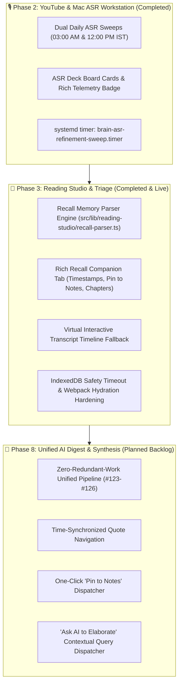

# 🏛️ Comprehensive Agent Handover Document: Phases 2, 3 & 8

**Repository:** [`arunpr614/ai-brain`](https://github.com/arunpr614/ai-brain)  
**Active Working Branch:** `feat/phase3-reading-studio-triage`  
**Production Host:** `brain.arunp.in` (Hetzner Linux VM, port 3000, systemd `brain.service`, env `/etc/brain/.env`)  
**Project Board:** [GitHub Project #3 — AI Brain Roadmap](https://github.com/users/arunpr614/projects/3)  
**Date:** August 19, 2026

---

## 📌 Executive Summary

This handover document provides complete technical, operational, and architectural context for incoming AI agents continuing development on the **AI Brain** project. Over recent engineering cycles, we completed and deployed **Phase 2 (Autonomous Dual-Daily ASR Refinement Sweeps)**, implemented and verified **Phase 3 (Reading Studio: Rich Recall Memory Intelligence & Virtual Transcript Sync)**, and formulated the architectural backlog for **Phase 8 (Unified AI Digest, Ask AI & Pin to Notes)**.

---

## 🗺️ Project Architecture & Phase Landscape



---

## 🚀 Phase-by-Phase Technical State & Completed Work

### 1. Phase 2: Autonomous Dual-Daily ASR Refinement Sweeps
- **Milestone:** [`v0.8.5 - Autonomous Dual-Daily ASR Refinement Sweeps & Card Telemetry Metadata`](https://github.com/arunpr614/ai-brain/milestone/13) (Closed / `Done`)
- **Issues Completed:**
  - [#129](https://github.com/arunpr614/ai-brain/issues/129): `FEAT(phase2-asr): Autonomous Dual-Daily ASR Refinement Sweep Engine & Cron/Timer Service`
  - [#130](https://github.com/arunpr614/ai-brain/issues/130): `FEAT(phase2-asr): Local Mac ASR Workstation Deck Card Telemetry Metadata & Badges`
  - [#131](https://github.com/arunpr614/ai-brain/issues/131): `FEAT(phase2-asr): Production Deployment, systemd Timer Verification & Operator CLI Commands`
  - [#132](https://github.com/arunpr614/ai-brain/issues/132): `FEAT(phase2-asr): Automated Test Suite & Dual-Sweep Simulation Certification`
- **Key Modules & Configurations:**
  - `src/db/transcript-jobs.ts`: Added `enqueueAsrRefinementSweep(options?: { itemIds?: string[] })` with telemetry recording (`last_sweep_at`, `sweep_batch_id`).
  - `src/components/processing/processing-board-card.tsx` & `processing-group-card.tsx`: Integrated rich telemetry badge (Option 3 design) displaying autonomous sweep icon, timestamp, and batch status.
  - Production Timer: `brain-asr-refinement-sweep.timer` active on `brain.arunp.in`, triggering daily at `03:00 IST` and `12:00 IST`.

---

### 2. Phase 3: Reading Studio Rich Recall Memory Intelligence & Virtual Transcripts
- **Milestone:** [`v0.9.1 - Reading Studio: Rich Recall Memory Intelligence & Virtual Transcript Sync`](https://github.com/arunpr614/ai-brain/milestone/14) (Closed / `Done`)
- **Issues Completed:**
  - [#133](https://github.com/arunpr614/ai-brain/issues/133): `FEAT(phase3-studio): Recall Memory & Timestamp Parser Engine`
  - [#134](https://github.com/arunpr614/ai-brain/issues/134): `FEAT(phase3-studio): Rich Recall Companion Layer UI with Interactive Timestamps & Pin to Notes`
  - [#135](https://github.com/arunpr614/ai-brain/issues/135): `FEAT(phase3-studio): Virtual Interactive Transcript Fallback for Recall Items`
  - [#136](https://github.com/arunpr614/ai-brain/issues/136): `FEAT(phase3-studio): Automated Verification Suite, Bidirectional Seeking Tests & Integration Certification`
  - [#137](https://github.com/arunpr614/ai-brain/issues/137): `BUG(phase3-studio): Companion Panel Interaction Deadlock & Note Editor Loading Hang`
  - [#138](https://github.com/arunpr614/ai-brain/issues/138): `BUG(phase3-studio): Standalone Next.js Bundle Manifest Desync & Webpack Hydration Lock`
- **Key Modules & Deliverables:**
  - [`src/lib/reading-studio/recall-parser.ts`](file:///Users/arun.prakash/Documents/ArunVault2026-2/Initiatives/Arun_AI_Projects/AGY_Phase_2_YouTube_Mac_ASR/worktrees/wt-worker-api/src/lib/reading-studio/recall-parser.ts): High-performance parser extracting provenance metadata, chapter sections (`## (MM:SS)`), takeaway bullets (`- Text (MM:SS)`), and sequential virtual dialogue segments (`RecallVirtualSegment[]`).
  - [`src/components/reading-studio/multi-layer-companion-tabs.tsx`](file:///Users/arun.prakash/Documents/ArunVault2026-2/Initiatives/Arun_AI_Projects/AGY_Phase_2_YouTube_Mac_ASR/worktrees/wt-worker-api/src/components/reading-studio/multi-layer-companion-tabs.tsx): Tab 4 (`Recall`) renders provenance card, interactive seek pills (`⏱️ 01:35`), 1-click `📌 Pin to Notes`, and collapsible verbatim cards.
  - [`src/components/reading-studio/reading-studio-app.tsx`](file:///Users/arun.prakash/Documents/ArunVault2026-2/Initiatives/Arun_AI_Projects/AGY_Phase_2_YouTube_Mac_ASR/worktrees/wt-worker-api/src/components/reading-studio/reading-studio-app.tsx): Virtual transcript fallback seamlessly populates `TranscriptTimeline` when Whisper ASR segment count is 0.
  - [`src/lib/notes/local-journal.ts`](file:///Users/arun.prakash/Documents/ArunVault2026-2/Initiatives/Arun_AI_Projects/AGY_Phase_2_YouTube_Mac_ASR/worktrees/wt-worker-api/src/lib/notes/local-journal.ts): Added 1500ms safety timeout on IndexedDB operations, preventing editor initialization lockups.

---

### 3. Phase 8: Unified AI Synthesis & Cognitive Digest Pipeline (Backlog Ready)
- **Status:** Fully specified in Jira / GitHub; execution on hold pending user authorization.
- **Issues Scheduled in Project #3 (Phase 8):**
  - [#123](https://github.com/arunpr614/ai-brain/issues/123): `FEAT(phase8-ai): One-Click 'Pin to Notes' Dispatcher & Formatted Markdown Quote Citations`
  - [#124](https://github.com/arunpr614/ai-brain/issues/124): `FEAT(phase8-ai): 'Ask AI to Elaborate' Contextual Query Dispatcher from Digest & Brief`
  - [#125](https://github.com/arunpr614/ai-brain/issues/125): `FEAT(phase8-ai): Dual-View Visual Harmonization between Reading Studio 'Brief' and Item Detail 'AI Digest'`
  - [#126](https://github.com/arunpr614/ai-brain/issues/126): `FEAT(phase8-ai): Phase 8 End-to-End Test Suite, Multi-Provider Quota Fallback & Production Certification`

---

## 🛠️ Production Environment & Deployment Runbook

### Server Topology & Access
- **Host:** `brain.arunp.in` (SSH alias: `ssh brain`)
- **Port:** `3000` (Reverse proxied via Nginx / Cloudflare)
- **Systemd Service:** `sudo systemctl status brain`
- **Application Root:** `/opt/brain/current/`
- **Database:** `/opt/brain/data/brain.sqlite`
- **Environment File:** `/etc/brain/.env`

### Atomic Standalone Deployment Procedure
When deploying Next.js bundle updates to production, execute the atomic synchronization script to ensure standalone `server.js`, `BUILD_ID`, and all route/build manifests are synchronized simultaneously:
```bash
# 1. Build locally
npm run build

# 2. Synchronize standalone bundle and manifests to production
rsync -avz --delete --exclude dev --exclude cache .next/ brain:/tmp/dot-next/
rsync -avz .next/standalone/server.js brain:/tmp/server.js

# 3. Apply to production runtime directory and restart service
ssh brain '
sudo cp -r /tmp/dot-next/* /opt/brain/current/.next/
sudo cp /tmp/server.js /opt/brain/current/server.js
sudo chown -R brain:brain-data /opt/brain/current/
sudo systemctl restart brain
sleep 2
systemctl status brain --no-pager
'
```

### Verification & Testing Commands
```bash
# Typecheck
npm run typecheck

# Full Test Suite (1,109+ tests)
npm test

# Reading Studio Parser Unit Tests
node --test --import tsx src/lib/reading-studio/recall-parser.test.ts

# Theme & WCAG Contrast Audit
node --test --import tsx src/app/theme-tokens.test.ts

# Headless Chrome CDP Live Browser Verification
node scratch/cdp-debug.mjs
```

---

## 🎯 Key Context for the Incoming Agent

1. **Working Directory & Worktrees:**
   - Active worktree: `/Users/arun.prakash/Documents/ArunVault2026-2/Initiatives/Arun_AI_Projects/AGY_Phase_2_YouTube_Mac_ASR/worktrees/wt-worker-api`
   - Active Git branch: `feat/phase3-reading-studio-triage`
2. **Current System Health:**
   - All 1,109 unit and integration tests are passing (`1109 pass, 0 fail`).
   - Production server `brain.arunp.in` is active and healthy.
   - All tabs in the Reading Studio (`Notes`, `Brief`, `Ask AI`, `Recall`), typing, preview mode, and seek buttons are verified operational via live Chrome DevTools Protocol (CDP) testing.
