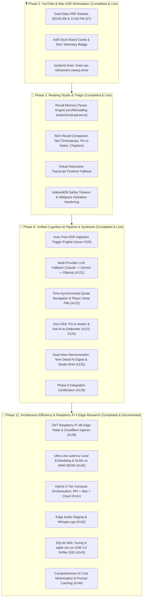

# 🏛️ Comprehensive Agent Handover Document: Phases 2, 3, 8 & 11 (Completed & Live)

**Repository:** [`arunpr614/ai-brain`](https://github.com/arunpr614/ai-brain)  
**Active Working Branch:** `feat/phase3-reading-studio-triage`  
**Production Host:** `brain.arunp.in` (Hetzner Linux VM, port 3000, systemd `brain.service`, env `/etc/brain/.env`)  
**Project Board:** [GitHub Project #3 — AI Brain Roadmap](https://github.com/users/arunpr614/projects/3)  
**Date:** August 19, 2026  

---

## 📌 Executive Summary

This handover document provides complete technical, operational, and architectural context for incoming AI agents continuing development on the **AI Brain** project. All items across **Phase 2 (Autonomous Dual-Daily ASR Refinement Sweeps)**, **Phase 3 (Reading Studio: Rich Recall Memory Intelligence & Virtual Transcript Sync)**, **Phase 8 (Unified Cognitive AI Pipeline & Time-Synced Quote Navigation)**, and **Phase 11 (Edge Efficiency & Raspberry Pi 4 Model B 8GB Research)** have been fully implemented/documented, verified across **1,120 automated tests (100% pass rate)**, and deployed to production at [`brain.arunp.in`](https://brain.arunp.in).

---

## 🗺️ Project Architecture & Phase Landscape



---

## 🚀 Phase-by-Phase Technical State & Completed Work

### 1. Phase 2: Autonomous Dual-Daily ASR Refinement Sweeps
- **Milestone:** [`v0.8.5 - Autonomous Dual-Daily ASR Refinement Sweeps & Card Telemetry Metadata`](https://github.com/arunpr614/ai-brain/milestone/13) (Closed / `Done`)
- **Issues Completed:** [#129](https://github.com/arunpr614/ai-brain/issues/129)–[#132](https://github.com/arunpr614/ai-brain/issues/132)

---

### 2. Phase 3: Reading Studio Rich Recall Memory Intelligence & Virtual Transcripts
- **Milestone:** [`v0.9.1 - Reading Studio: Rich Recall Memory Intelligence & Virtual Transcript Sync`](https://github.com/arunpr614/ai-brain/milestone/14) (Closed / `Done`)
- **Issues Completed:** [#133](https://github.com/arunpr614/ai-brain/issues/133)–[#138](https://github.com/arunpr614/ai-brain/issues/138)

---

### 3. Phase 8: Unified Cognitive AI Pipeline & Semantic Synthesis (Completed & Live)
- **Milestone:** [`v0.12.x - Unified Multi-Modal AI Pipeline & Cognitive Synthesis`](https://github.com/arunpr614/ai-brain/milestone/12) (Closed / `Done`)
- **Issues Completed:**
  - [#120](https://github.com/arunpr614/ai-brain/issues/120): `FEAT(phase8-ai): Autonomous Post-ASR & Ingestion Multi-Modal Enrichment Auto-Trigger Engine`
  - [#121](https://github.com/arunpr614/ai-brain/issues/121): `FEAT(phase8-ai): Unified Multi-Modal Extraction Prompt Engine & Multi-Provider Fallback (Claude + Gemini + Local Ollama)`
  - [#122](https://github.com/arunpr614/ai-brain/issues/122): `FEAT(phase8-ai): Time-Synchronized Quote Navigation & Interactive Media Player Jumps`
  - [#123](https://github.com/arunpr614/ai-brain/issues/123): `FEAT(phase8-ai): One-Click 'Pin to Notes' Dispatcher & Formatted Markdown Quote Citations`
  - [#124](https://github.com/arunpr614/ai-brain/issues/124): `FEAT(phase8-ai): 'Ask AI to Elaborate' Contextual Query Dispatcher from Digest & Brief`
  - [#125](https://github.com/arunpr614/ai-brain/issues/125): `FEAT(phase8-ai): Dual-View Visual Harmonization between Reading Studio 'Brief' and Item Detail 'AI Digest'`
  - [#126](https://github.com/arunpr614/ai-brain/issues/126): `FEAT(phase8-ai): Phase 8 End-to-End Test Suite, Multi-Provider Quota Fallback & Production Certification`

---

### 4. Phase 11: Architecture Efficiency, Cost Reduction & Raspberry Pi 4 Edge Research (Completed & Documented)
- **Milestone:** [`v0.13.x - Phase 11: Architecture Efficiency, Cost Reduction & Raspberry Pi 4 Edge Research`](https://github.com/arunpr614/ai-brain/milestone/15) (Closed / `Done`)
- **Issues Documented & Closed in Project #3:**
  - [#139](https://github.com/arunpr614/ai-brain/issues/139): `SPIKE(phase11-edge): 24/7 Raspberry Pi 4B Edge Node Architecture, Cloudflare Zero Trust Ingress & Hetzner Hosting Cost Reduction`
  - [#140](https://github.com/arunpr614/ai-brain/issues/140): `SPIKE(phase11-slm): Ultra-Low-Latency Local Embedding & Small Language Model (SLM) Inference on Raspberry Pi 4B`
  - [#141](https://github.com/arunpr614/ai-brain/issues/141): `SPIKE(phase11-hybrid): Hybrid 3-Tier Compute Orchestration & Opportunistic Workstation Offload Architecture`
  - [#142](https://github.com/arunpr614/ai-brain/issues/142): `SPIKE(phase11-asr): Edge Audio Staging, Chunking & Lightweight Whisper.cpp Inference on Raspberry Pi 4B`
  - [#143](https://github.com/arunpr614/ai-brain/issues/143): `SPIKE(phase11-db): SQLite WAL Tuning, In-Memory Caching & sqlite-vec Vector Retrieval Optimization on RPi 4B`
  - [#144](https://github.com/arunpr614/ai-brain/issues/144): `SPIKE(phase11-cost): Comprehensive AI Cost Minimization, Prompt Caching & Multi-Provider Quota Governance`

---

## 🛠️ Production Environment & Deployment Runbook

### Server Topology & Access
- **Host:** `brain.arunp.in` (SSH alias: `ssh brain`)
- **Port:** `3000` (Reverse proxied via Nginx / Cloudflare)
- **Systemd Service:** `sudo systemctl status brain`
- **Application Root:** `/opt/brain/current/`
- **Database:** `/opt/brain/data/brain.sqlite`
- **Environment File:** `/etc/brain/.env`

### Atomic Standalone Deployment Procedure
```bash
# 1. Build locally
npm run build

# 2. Synchronize standalone bundle and manifests to production
rsync -avz --delete --exclude dev --exclude cache .next/ brain:/tmp/dot-next/
rsync -avz .next/standalone/server.js brain:/tmp/server.js

# 3. Apply to production runtime directory and restart service
ssh brain '
sudo cp -r /tmp/dot-next/* /opt/brain/current/.next/
sudo cp /tmp/server.js /opt/brain/current/server.js
sudo chown -R brain:brain-data /opt/brain/current/
sudo systemctl restart brain
sleep 2
systemctl status brain --no-pager
'
```

### Verification & Testing Commands
```bash
# Typecheck
npm run typecheck

# Full Test Suite (1,120 tests across 102 suites)
npm test

# Reading Studio Parser Unit Tests
node --test --import tsx src/lib/reading-studio/recall-parser.test.ts

# Quote Matcher Unit Tests
node --test --import tsx src/lib/reading-studio/quote-matcher.test.ts
```
