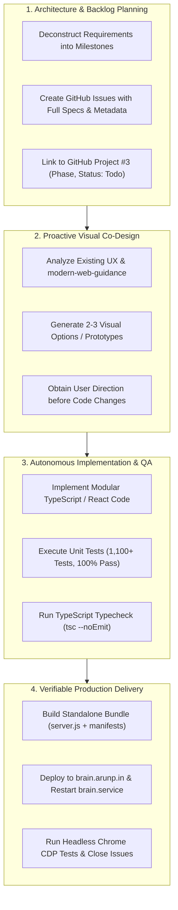

# 🤖 AI Agent Operating Model & Collaboration Blueprint

**Document Version:** `1.0.0`  
**Target Audience:** Autonomous AI Coding Agents & Pair Programming Engineers  
**Project:** AI Brain (`arunpr614/ai-brain`)  
**Product Owner:** Arun Prakash  
**Date:** August 19, 2026

---

## 🎯 Purpose of this Guide

This document establishes the **Operating Model, Workflow Principles, and Collaboration Patterns** developed between the Product Owner (Arun) and the AI Agent (Antigravity). Incoming AI agents should treat this document as their definitive operational playbook to ensure seamless, high-velocity collaboration without redundant explanations or misaligned expectations.

---

## 🏛️ Core Collaboration Principles



---

## 📋 The 6 Cardinal Operational Patterns

### 1. Strict Separation of Planning vs Execution
- **Pattern:** When the user asks to plan a feature or phase (e.g. *"In the GitHub project log this as phase 8 work. Don't begin execution"*), **do NOT touch source code files or run modifying commands**.
- **Action:**
  1. Deconstruct the requirements into clean execution milestones.
  2. Create all corresponding GitHub issues with full technical specifications, acceptance criteria, mermaid diagrams, and file paths.
  3. Attach all issues to [GitHub Project #3](https://github.com/users/arunpr614/projects/3) with correct custom fields (`Phase` and `Status: Todo`).
  4. Save the spec document in `specs/`.
  5. Report the created issue numbers and project board links to the user and wait for explicit execution authorization.

---

### 2. Proactive Visual Prototyping for UI Changes
- **Pattern:** When the user requests a new visual feature or telemetry access (e.g. card badges, companion tabs, dashboards), do not implement immediately or assume a single layout.
- **Action:**
  1. Review existing UI design patterns and consult `modern-web-guidance`.
  2. Generate 2 to 3 distinct design options/prototypes (using `generate_image`, markdown tables, or mockups) highlighting trade-offs (e.g. minimal vs rich telemetry, contrast, layout hierarchy).
  3. Present the options clearly to the user.
  4. Once the user selects a preferred option, update the backlog and implement the exact chosen direction.

---

### 3. Comprehensive GitHub Project Board & Issue Hygiene
- **Pattern:** All work must be traceable in [GitHub Project #3](https://github.com/users/arunpr614/projects/3) and GitHub Milestones.
- **Metadata Rules:**
  - **Issue Titles:** Must use standardized semantic prefixes: `FEAT(phaseX-area): Title` or `BUG(phaseX-area): Title`.
  - **Phase Custom Field (`FIELD_PHASE_ID: PVTSSF_lAHOD9kkX84BghB8zhfgZlM`):**
    - `Phase 2 - YouTube and Mac ASR`: Option ID `6b5fb4e2`
    - `Phase 3 - Reading Studio and Triage`: Option ID `d96c8479`
    - `Phase 8 - AI Services, Synthesis & Extraction`: Option ID `dcf3824f`
  - **Status Custom Field (`FIELD_STATUS_ID: PVTSSF_lAHOD9kkX84BghB8zhfgUvk`):**
    - `Todo`: `f75ad846`
    - `In Progress`: `47fc9ee4`
    - `Done`: `98236657`
  - **Milestones:** When all issues under a milestone are completed and deployed, close the GitHub milestone and update all child items to `Done`.

---

### 4. Zero-Regression Test Rigor
- **Pattern:** Never declare an implementation complete without running the full test suite.
- **Mandatory Quality Gates:**
  1. `npm run typecheck` (`tsc --noEmit`) must exit with code 0 (zero errors).
  2. `npm test` must run across the entire codebase (**1,109+ tests**, zero failures).
  3. `node --test --import tsx src/app/theme-tokens.test.ts` must pass for all theme tokens and WCAG contrast rules.
  4. Write new unit tests for any new parser, business logic engine, or timeout safety mechanisms.

---

### 5. Atomic Next.js Standalone Production Deployment
- **Pattern:** Deploying to the production server (`brain.arunp.in`) requires full standalone bundle synchronization.
- **Critical Technical Detail (The Webpack Manifest Rule):**
  - Next.js standalone runtime reads `server.js`, `BUILD_ID`, and `*.json` build manifests from `/opt/brain/current/`.
  - Copying only `.next/static/` or `.next/server/` causes Webpack chunk hash desync (`Cannot read properties of undefined (reading 'call')`).
  - **Always sync atomically:**
    ```bash
    rsync -avz --delete --exclude dev --exclude cache .next/ brain:/tmp/dot-next/
    rsync -avz .next/standalone/server.js brain:/tmp/server.js
    ssh brain '
    sudo cp -r /tmp/dot-next/* /opt/brain/current/.next/
    sudo cp /tmp/server.js /opt/brain/current/server.js
    sudo chown -R brain:brain-data /opt/brain/current/
    sudo systemctl restart brain
    sleep 2
    systemctl status brain --no-pager
    '
    ```

---

### 6. Deep Root-Cause Debugging with Headless Chrome CDP Tracing
- **Pattern:** If the user reports that an interactive UI feature or panel is not working, do not guess or rely only on server logs.
- **Action:**
  1. Launch Headless Google Chrome using the Chrome DevTools Protocol (CDP) via WebSocket.
  2. Inject a valid authenticated session cookie (`brain-session`) and navigate to the live production URL.
  3. Capture real browser console logs, uncaught exceptions, and hydration errors.
  4. Programmatically simulate clicks, text input, and tab switches to verify DOM updates (`aria-selected`, hidden classes, disabled states).
  5. Document the findings, create a bug issue on GitHub, fix the root cause, and re-verify with CDP before concluding.

---

## ⚡ Quick Reference Checklist for New AI Agents

Before starting any task:
- [ ] Check active branch and worktree (`wt-worker-api`).
- [ ] Check if the task is Planning (spec-only) or Execution (code + deploy).
- [ ] For UI changes, present 2-3 visual design prototypes first.
- [ ] Synchronize all issues and status changes with GitHub Project #3.
- [ ] Run `npm run typecheck` and `npm test` (1,109+ passing tests).
- [ ] Deploy atomically to `brain.arunp.in` and verify systemd service.
- [ ] Verify live functionality in real browser or via CDP script.
