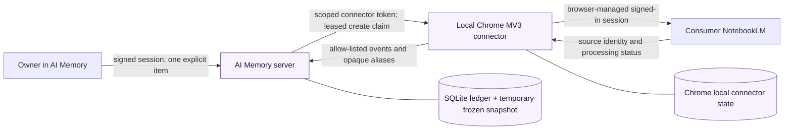

# DataWiki: NotebookLM one-click export

Purpose: Define the authoritative data, API, state, privacy, retention, and operational contract for the narrow AI Memory → consumer NotebookLM one-click export.

Audience: Engineers, data stewards, security reviewers, release operators, support responders, and AI agents changing this feature.

Verified against: Protected-main release `167a15d57b8f70574a017ea4cda507870f3600d4`, deployed to production on 2026-07-22 with `026_notebooklm_export.sql`, connector protocol v1, mapper v1, and the attested Chrome extension 0.7.0 artifact.

Runtime evidence through: 2026-07-22 for the protected-main deployment, migration/hash/integrity checks, health, NotebookLM retention and operations timers, and authenticated AI Memory Settings/item UI. The verified production flag tuple is UI-only `1:0:0`: queueing and provider writes are off. The extension artifact is installed in a stable local directory but is not loaded or paired. No target bind, consumer NotebookLM source, signed-in synthetic canary, or owner-only real-content enablement is claimed.

Status: **Experimental; deployed UI-only; queue and provider writes off; signed-in provider validation and owner-only enablement pending.**

Release evidence: [NotebookLM one-click export production release evidence](../feature-council/notebooklm-sync/release/production-release-evidence-2026-07-22.md).

Owner: AI Brain maintainer.

## 1. Scope and truth boundary

This feature exports one explicitly selected saved item as one static copied-text source to one prebound, owner-only private consumer NotebookLM notebook. It is deliberately named **Export to NotebookLM**, not synchronization.

The public product entrance and authenticated application host are different:

- `https://notebooklm.google/` is the public entrance used to open NotebookLM and sign in.
- `https://notebooklm.google.com/` is the authenticated web application and connector host. Optional Chrome access is limited to this host.

The implementation uses an experimental local Chrome connector over undocumented consumer NotebookLM web RPCs. Google can change the protocol without notice; the connector must fail closed on drift, and this document must not imply Google support or endorsement.

The following remain deferred: library-wide export, automatic or daily synchronization, discovery/backfill, batch export, edit/delete propagation, source rotation, cross-notebook routing, multi-notebook selection, and NotebookLM-to-AI-Memory import.

### Terms and account review — 2026-07-22

This review is scoped to an owner-operated consumer account and the narrow one-click copied-text workflow. It is not legal advice or a permanent approval; re-review is required if Google changes the applicable terms, account type, sharing model, machine-readable instructions, or provider behavior.

- Google's [privacy and terms help](https://support.google.com/notebooklm/answer/17004255?hl=en) says ordinary consumer use is governed by the Google Terms of Service. It says notebook content is not used to directly train foundational models unless the user submits feedback; feedback can include sources/uploads and may be reviewed. Qualifying work and school accounts have different terms and handling. The owner must therefore confirm the intended account type and must not submit feedback containing sensitive export content.
- Google's [source help](https://support.google.com/notebooklm/answer/16215270?hl=en) documents copied-and-pasted text as a supported source type, a free-user limit of 50 sources, and per-source limits far above this feature's stricter 200,000-byte/50,000-word ceiling. The implementation deliberately retains its conservative 50-source policy and five-source reserve instead of inferring a paid tier.
- Google's [public-notebook help](https://support.google.com/notebooklm/answer/16322204?hl=en) confirms that notebooks can be made public and later restricted. The connector therefore requires a positive owner-only private check; absence of a public link is not treated as sufficient proof.
- The [Google Terms of Service](https://policies.google.com/terms?hl=en-US) prohibit bypassing protective measures and automated access that violates machine-readable instructions. The public entrance's [robots.txt](https://notebooklm.google/robots.txt) currently allows `/`, but that is not an API contract or permission to bypass application controls.

**Explicit inference, not an official Google statement:** the reviewed official pages document user-driven source creation, limits, privacy, sharing, and terms, but do not document a supported public source-management API or expressly authorize calls to internal web RPCs. Consequently, this connector remains experimental, owner-only, one-item/one-click, low-rate, and default-off. It must not perform bulk or scheduled writes, bypass or automate through an authentication/protective challenge, or continue provider writes after protocol drift, changed machine-readable instructions, or another safety signal.

## 2. System and trust boundaries



### Server boundary

The server owns authorization, deterministic minimization, idempotency, target-scoped capacity reservations, the durable request/state ledger, leases, runtime write controls, and retention. It sends a frozen title/body only on a `create` claim. Reconcile claims carry the opaque marker but no content; poll claims carry the marker and an opaque source alias but no content.

AI Memory is intentionally single-owner. NotebookLM export rows therefore use the fixed local owner namespace `primary`, and the schema permits one active target globally for this deployment. Browser APIs are authorized by the one owner's signed AI Memory session. “Owner-only private notebook” is a separate provider-side fact: the extension reads NotebookLM ownership/sharing locally, derives a notebook-salted subject proof, and sends only that proof plus `private` posture to the server. The server does not receive or independently resolve the raw Google identity.

### Chrome boundary

Chrome owns the raw Google notebook URL/ID, optional local `authuser` route, sanitized and bounded locally observed notebook label, raw provider source IDs, connector bearer token, and the active Google browser session. Chrome requests only optional host access to `https://notebooklm.google.com/*`; the manifest does not request `cookies`, `debugger`, `scripting`, or `<all_urls>`.

V1 does not enumerate notebooks. The owner pastes one exact `https://notebooklm.google.com/notebook/<uuid>` URL into extension Options; the strict parser accepts only that host/path plus an optional numeric `authuser` from 0 through 10. The extension then reads and verifies only that target.

The connector bootstraps ephemeral NotebookLM CSRF/session values from the signed-in page, uses them in memory, and never writes them to Chrome storage or the server. The provider-bound title/body are held in memory for the create attempt and are not persisted by the connector.

The deployed adapter declares the copied wire reference `notebooklm-py` `v0.8.0rc1` at commit `45fd4258e608fbb9685496f26cfcea48810c44ee`. That reference is neither a runtime dependency nor an official Google contract; unknown RPC IDs, response shapes, ownership/sharing facts, redirects, or status values are treated as protocol drift.

### Provider boundary

NotebookLM receives minimized copied text whose first heading preserves the full normalized human title. Its separate provider display title appends the opaque recovery marker and may shorten only the human-title portion to fit the 180-character provider envelope. The full title remains in the copied text and content hash. The marker supports read-only lost-response reconciliation. NotebookLM does not receive AI Memory database IDs, content hashes, connector IDs, notebook fingerprints, session cookies from the server, summaries, quotes, chats, or attached private notes.

## 3. Classification scheme

| Class | Meaning | Handling rule |
|---|---|---|
| C0 | Public or non-sensitive configuration/policy | Safe to document when it contains no live environment value. |
| C1 | Private operational metadata | Keep authenticated; log only allow-listed, content-free values. |
| C2 | Private content or linkable pseudonymous identifier | Do not publish or place in general logs. It may exist in private backups only when an asset-specific rule permits it; NotebookLM frozen export snapshots are always scrubbed and vacuumed from application, deployment, and off-site backup copies. |
| C3 | Secret or active session material | Never log or publish; store only at the narrowest approved local boundary, or do not persist at all. |

Hashes and aliases are pseudonymous, not anonymous. A value that can correlate a request, target, account, item, or provider source remains C2 even when it is not reversible by ordinary means.

## 4. SQLite entities and field classifications

Migration `026_notebooklm_export.sql` adds seven tables. It does not store Google cookies, CSRF values, OAuth tokens, raw notebook IDs, raw provider source IDs, Google account emails, the provider notebook title, or the bounded local notebook label.

### `notebooklm_connector_pairing_codes`

Short-lived, one-use enrollment challenge.

| Fields | Class | Contract |
|---|---|---|
| `id` | C1 | Opaque local row identity. |
| `code_hash` | C2 | HMAC-SHA-256 of the normalized code; the raw code is returned once and is not stored. |
| `label` | C1 | Sanitized optional connector label. |
| `created_at`, `expires_at`, `used_at`, `attempts`, `last_attempt_at` | C1 | Lifecycle and abuse-control metadata. |

The raw eight-character code is C3 while valid. It expires after five minutes, is single-use, and is invalidated when a newer code is issued.

### `notebooklm_connectors`

Scoped server-side identity for one paired extension origin.

| Fields | Class | Contract |
|---|---|---|
| `id` | C1 | Opaque connector identity. |
| `token_hash` | C2 | SHA-256 of the 256-bit connector token. The raw token exists only in Chrome local storage. |
| `token_hint`, `label` | C1 | Safe identification aids; neither authenticates a request. |
| `extension_origin` | C1 | Exact paired `chrome-extension://` origin. |
| `protocol_version` | C0 | Connector contract version; v1 for this release. |
| `state`, `created_at`, `updated_at`, `last_seen_at`, `revoked_at` | C1 | Connection lifecycle and online approximation. |

`state` is `registered`, `bound`, or `revoked`. Revocation is irreversible for that token.

### `notebooklm_targets`

Immutable-versioned server proof of the one active private target. The raw target remains local to Chrome.

| Fields | Class | Contract |
|---|---|---|
| `id`, `connector_id` | C1 | Opaque target and connector references. |
| `binding_version` | C1 | Monotonic version within a connector; participates in dedupe and claim fencing. |
| `safe_label` | C1 | Server-visible generic label. The released connector sends `Private NotebookLM target`, not the provider notebook title or bounded local label. |
| `local_binding_fingerprint` | C2 | SHA-256 proof derived locally from the notebook ID and account route. |
| `subject_fingerprint` | C2 | SHA-256 owner proof salted with the undisclosed notebook UUID. |
| `sharing_policy`, `sharing_posture` | C1 | Policy is fixed to `private_only`; only positively verified `private` can bind/create. |
| `source_limit`, `reserve_count`, `source_count` | C1 | Frozen capacity policy and last observed occupancy. V1 requires 50/5 exactly. |
| `health_status`, `health_reason`, `verified_at` | C1 | Last safe target verification. |
| `active`, `created_at`, `deactivated_at` | C1 | At most one target is active globally. |

An exact same-target bind replay is an idempotent health refresh. A changed target creates a new binding/dedupe namespace and is blocked while unresolved work exists. Rebinding through a different connector revokes the old connector only after the old target is safe to retire.

### `notebooklm_runtime_control`

Singleton database-backed provider-write safety state.

| Fields | Class | Contract |
|---|---|---|
| `id` | C0 | Always `1`. |
| `provider_write_blocked` | C1 | Independent runtime stop for new enqueue/create. |
| `protocol_failure_streak` | C1 | Consecutive normalized connector/transport failures, capped at three. |
| `block_reason`, `last_protocol_failure_at`, `updated_at` | C1 | Content-free operator evidence. |
| `retention_last_success_at`, `retention_last_failure_at` | C1 | Last successful and failed snapshot-cleanup sweeps. |
| `retention_failure_streak`, `retention_last_error_code` | C1 | Fail-closed cleanup health and normalized `cleanup_failed`/`physical_purge_pending`/`wal_checkpoint_incomplete` reason. |
| `retention_last_expired_count`, `retention_last_purged_count` | C1 | Content-free counts from the latest successful sweep. |
| `retention_physical_purge_pending`, `retention_physical_purge_generation` | C1 | Durable WAL-truncation latch and fencing generation; a later sweep must finish the exact pending physical purge before health can recover. |
| `retention_overdue_snapshot_count`, `unresolved_over_24h_count` | C1 | Latest overdue-snapshot and long-unresolved-work counts for operator attention. |

Provider source-list, create-response, and status protocol/schema drift trips the block immediately. Other normalized connector/transport failures—including retryable network/server outcomes and uncertain create outcomes—trip the block after three consecutive failures. The block does not auto-clear. Ordinary protocol drift can be cleared only when the operator explicitly attests that the connector was updated and the target was revalidated and the server verifies a bound, healthy, private target checked within the previous five minutes. `multiple_marker_matches`, `provider_source_identity_reused`, and `restore_reconciliation_required` cannot be cleared by that generic reset because they require exact duplicate-safety evidence; V1 has no approved clear path for them. The server does not independently prove which extension build was installed.

Provider-write admission also fails closed when no retention success has been recorded, the last success is more than three one-minute sweep intervals old, a retention failure remains unresolved, a physical purge remains pending, or any frozen snapshot is overdue. The independent one-minute read-only operational audit additionally reports attention for unresolved post-dispatch work older than 24 hours.

### `notebooklm_export_requests`

Durable request, idempotency, snapshot, lease, and provider-outcome ledger.

| Fields | Class | Contract |
|---|---|---|
| `id` | C1 | Opaque request identity exposed only to authenticated surfaces. |
| `owner_id`, `item_id`, `idempotency_key` | C2 | Owner/item correlation and browser-safe replay key. |
| `connector_id`, `target_id`, `binding_version`, `mapper_version` | C1/C2 | Delivery namespace and exact contract versions. Treat the combined tuple as linkable. |
| `content_hash` | C2 | SHA-256 of the canonical mapped title/text; retained for dedupe after snapshot purge. |
| `opaque_marker` | C2 | HMAC-derived, provider-visible title suffix used for reconciliation. Unique across requests. |
| `payload_title`, `payload_text` | C2 | Temporary frozen minimized snapshot. Both are null after purge. |
| `payload_bytes`, `payload_words`, `limited_capture` | C1 | Content-free size/quality metadata. |
| `state`, `phase`, `safe_reason` | C1 | Truthful state machine and normalized failure reason. |
| `lease_epoch`, `lease_token_hash`, `lease_until`, `claimed_at` | C1/C2 | Two-minute fencing lease; the raw lease token is returned only to the connector. |
| `attempt_count`, `create_dispatched_at` | C1 | Non-idempotent create fence. Dispatch is permitted only once. |
| `source_alias` | C2 | SHA-256 alias of the raw provider source ID; unique per target. |
| `provider_status` | C1 | Normalized `processing`, `ready`, or `failed` fact. |
| lifecycle and purge timestamps | C1 | Creation, update, processing, completion, expiry, cancellation, and snapshot retention evidence. |

Database uniqueness protects `(owner_id, idempotency_key)`, the item/target/binding/mapper/content dedupe tuple, the recovery marker, and `(target_id, source_alias)` when a source alias exists.

### `notebooklm_export_events`

Content-free transition journal.

| Fields | Class | Contract |
|---|---|---|
| `id`, `request_id`, `connector_id`, `lease_epoch` | C1/C2 | Correlates an event to a private request/connector/lease. |
| `event_type`, `from_state`, `to_state`, `safe_reason`, `created_at` | C1 | Allow-listed transition fact; no raw provider body or exception. |

### `notebooklm_operational_events`

Feature-level operational journal independent of a specific request.

| Fields | Class | Contract |
|---|---|---|
| `id`, `event_type`, `connector_id`, `target_id`, `safe_reason`, `created_at` | C1/C2 | Content-free setup, target health, revocation, and write-safety events. |

## 5. Chrome local entities

Chrome storage is private local application storage, not an encrypted secret manager. The extension limits it to trusted extension contexts where Chrome supports that access-level control.

| Storage key | Fields/class | Retention and purpose |
|---|---|---|
| `notebooklm_connector_credential_v1` | Raw scoped connector token C3; connector ID/protocol/time C1 | Persists until connector data is cleared. Distinct from the page-capture bearer token. |
| `notebooklm_binding_v1` | Raw notebook ID/URL, sanitized bounded local label, local `authuser`, account/target fingerprints C2 | Persists until rebind or local clear; never sent raw to the server. |
| `notebooklm_delivery_journal_v1` | Request ID, target fingerprint, marker, possible raw source ID/alias/status C2 | Written immediately before the one provider fetch. Unresolved possibly-delivered entries are never age/count pruned; positive/terminal reconciliation clears them. |
| `notebooklm_source_references_v1` | Alias → raw source ID, target proof, marker, update time C2 | Retains the 500 most recently updated references for exact polling. |
| `notebooklm_worker_status_v1` | Normalized state/detail/time and optional request ID C1/C2 | Replaced with the latest worker status; used by extension Options. |

The emergency local-clear action removes these keys and optional NotebookLM host permission. It does not revoke server state and must not be used while unresolved work exists.

## 6. Canonical mapper and outbound fields

Mapper v1 is a pure, default-deny transformation. It normalizes Unicode to NFC, normalizes newlines, removes null/trailing whitespace, and freezes the result at click time.

Included:

1. normalized human title;
2. normalized saved body;
3. author when present;
4. valid publication date when present; and
5. a source URL only after an explicit, trustworthy public-access signal exists and the HTTP(S) URL has no credentials, query, fragment, private/local/special-use host, or unsafe IP range.

The current item schema has no such public-access signal. Mapper v1 therefore omits every source URL, including an otherwise queryless public-host URL. The URL policy is a future-safe allow-list contract, not a claim that this release emits URLs.

The copied text preserves the full normalized title as its first heading. The provider display title is a separate bounded field: it appends the recovery marker and may shorten only its human-title portion to remain within 180 characters. This display-only shortening does not change the copied-text title, saved body, or canonical content hash.

Excluded:

- summaries, quotes, chats, private attached notes, capture internals, thumbnails, temporary paths, and adjacent artifacts;
- raw AI Memory IDs, content hashes, target/connector/source identifiers, and database timestamps;
- Google cookies, CSRF/session material, OAuth data, account email, and raw provider errors;
- signed, query-bearing, credential-bearing, malformed, local, private-network, special-use, `.onion`, or `.i2p` URLs.

Recall content is eligible only after an exact six-line Recall provenance envelope and delimiter are removed. A malformed Recall envelope fails closed to empty content. Schema-only podcast/EPUB/DOCX items require an explicitly full-text capture quality. Weak captures require owner confirmation. Empty content is blocked.

The complete canonical payload must be no more than 200,000 UTF-8 bytes and 50,000 normalized words. Both limits apply. V1 does not truncate or chunk the copied-text title or body; only the separate provider display title may be shortened as described above.

## 7. State and phase machine

State and phase must be interpreted together. In particular, `reconciliation_required/reconcile` means checking can continue, while `reconciliation_required/terminal` means the owner explicitly stopped checking and acknowledged that a source may exist.

```mermaid
stateDiagram-v2
  [*] --> queued: explicit export accepted
  queued --> leased_pre: connector claim
  leased_pre --> sending: private/capacity preflight + server dispatch authorization
  leased_pre --> pre_attention: auth / target / capacity / safe retry / update needed
  leased_pre --> retryable_failure: third pre-create lease expires
  pre_attention --> queued: deliberate retry or successful revalidation

  sending --> processing: create accepted; source identity known
  sending --> succeeded: create accepted already ready
  sending --> reconciling: response uncertain / lease expires / create-phase auth or drift

  reconciling --> reconciliation_required: zero visible marker matches
  reconciliation_required --> reconciling: later read-only claim
  reconciling --> processing: exactly one match, still processing
  reconciling --> succeeded: exactly one match, ready
  reconciling --> duplicate_conflict: multiple matches or reused source identity

  processing --> processing: exact source still processing
  processing --> succeeded: exact source ready
  processing --> provider_failed: exact source failed

  queued --> cancelled: owner cancels before dispatch
  queued --> expired: seven-day pre-send deadline
  state "reconciliation_required / terminal" as reconciliation_required_terminal
  reconciling --> reconciliation_required_terminal: owner stops checking and acknowledges source may exist

  succeeded --> [*]
  duplicate_conflict --> [*]
  provider_failed --> [*]
  cancelled --> [*]
  expired --> [*]
  reconciliation_required_terminal --> [*]
```



The concrete persistent states are `queued`, `leased`, `sending`, `processing`, `succeeded`, `authentication_attention`, `reconciling`, `reconciliation_required`, `duplicate_conflict`, `target_attention`, `capacity_blocked`, `retryable_failure`, `provider_failed`, `connector_update_required`, `cancelled`, and `expired`. Phases are `pre_create`, `create`, `reconcile`, `poll`, and `terminal`.

Lease duration is two minutes. Reconcile work has priority over poll, which has priority over create. Only one create can be leased/sending for the target at a time. A pre-create request is limited to three lease epochs; a third expiry becomes explicit `retryable_failure` with reason `lease_exhausted`, and a deliberate same-content retry requeues the same durable request with lease epoch reset.

## 8. API contract

All responses are private/no-store. Browser session writes require an exact same-origin request. Connector CORS preflight/response logic reflects only a syntactically valid `chrome-extension://` origin and never enables credentialed CORS. Pairing exchange has no stored origin yet and is additionally gated by the one-time code. After pairing, every scoped-token route requires the request origin to equal the exact extension origin stored on that connector.

| Method and route | Authentication | Purpose and material returned |
|---|---|---|
| `GET /api/items/{id}/notebooklm-export` | Signed AI Memory session | Eligibility, destination health/capacity, safe current request DTO, feature flags, and idempotency-key correlation. |
| `POST /api/items/{id}/notebooklm-export` | Signed session + exact same origin | Validate confirmations, freeze mapper output, enqueue/dedupe, and return `202` with safe request DTO. Queue flag must be enabled. |
| `PATCH /api/items/{id}/notebooklm-export` | Signed session + exact same origin | Accept only `{ "event": "export_viewed" }` and persist one content-free UI-view event. UI flag must be enabled. |
| `DELETE /api/items/{id}/notebooklm-export` | Signed session + exact same origin | Cancel before dispatch, or stop checking after dispatch with explicit `source may exist` acknowledgement. |
| `GET /api/settings/notebooklm-export` | Signed session | Safe connector/target/runtime status, including retention health, sweep timestamps/failure reason, overdue snapshots, and unresolved-over-24-hour count. UI flag must be enabled. |
| `POST /api/settings/notebooklm-export` | Signed session + exact same origin | Create a five-minute one-time pairing code. |
| `DELETE /api/settings/notebooklm-export` | Signed session + exact same origin | `safe_disconnect` revokes/deactivates only when no unresolved work exists. `emergency_revoke` requires explicit acknowledgement, immediately revokes live scoped tokens, terminalizes unresolved work, and purges that unresolved work's frozen snapshots without claiming remote deletion. |
| `PATCH /api/settings/notebooklm-export` | Signed session + exact same origin | Explicitly clear only an ordinary protocol-drift safety block after the operator attests that the connector was updated and the target revalidated, and the server verifies a recent healthy private target. Identity-conflict and restore-reconciliation reasons fail closed. |
| `POST /api/notebooklm/connectors/exchange` | One-time code + exact Chrome extension origin + protocol v1 | Exchange once for a scoped connector ID/token. Limited to 10 attempts per minute per observed IP. |
| `POST /api/notebooklm/connector/bind` | Scoped connector bearer + exact paired origin + protocol header | Bind/refresh a private target using only generic label, fingerprints, posture, and 50/5 capacity facts. |
| `POST /api/notebooklm/connector/claim` | Scoped connector bearer + exact paired origin + protocol header | Return a two-minute `create`, `reconcile`, or `poll` claim. A `204` means no work. Connector traffic is limited to 120 requests/minute per connector. |
| `POST /api/notebooklm/connector/requests/{id}/events` | Scoped connector bearer + exact paired origin + protocol header + valid lease token/epoch | Apply one strict event transition. `dispatchAuthorized: true` is returned only after `dispatch_started` is durably committed while writes are enabled. |

Connector protocol header: `x-notebooklm-connector-protocol: 1`.

The connector event vocabulary is: `preflight_ok`, `authentication_required`, `target_attention`, `capacity_blocked`, `dispatch_started`, `create_accepted`, `create_uncertain`, `reconcile_result`, `source_status`, `retryable_failure`, and `connector_update_required`. Request bodies are strict, bounded JSON; unknown fields and impossible event combinations fail closed.

The per-IP exchange and per-connector request limits are in-process damage controls. Their counters reset when the server process restarts and they are not a durable anti-brute-force ledger. Each individual pairing code also stops exchanging after five recorded attempts.

## 9. Invariants

### Idempotency and duplicate prevention

- The same owner/idempotency key replays the same accepted request only when item, target, and content still match; a conflicting reuse is rejected.
- The same item/target/binding/mapper/content tuple has one durable row.
- A successful unchanged tuple returns the existing success with zero provider writes.
- Changed content after success requires explicit confirmation and creates a new source; the old source is not updated or deleted.
- A prior possibly delivered non-success blocks a replacement create in the same binding namespace.
- `dispatch_started` requires a successful private/capacity preflight recorded in the same lease epoch, write enablement, `attempt_count = 0`, and no previous dispatch timestamp.
- The extension writes a content-free `possibly_delivered` journal record immediately before its single non-idempotent provider request. Any later create claim with an existing journal is converted to uncertainty, never re-sent.
- Success is recorded only when the exact accepted/adopted source reports `ready`.
- A provider source alias cannot be reused by another request for the same target.

The product guarantee is **at most one automated create unless non-delivery is conclusive**, not exactly once.

### Target and capacity

V1 freezes the source limit at 50 and reserves five slots:

```text
safe_slots = 50 - 5 - observed_source_count - reserved_source_slots
```

`reserved_source_slots` includes conclusively unsent pre-create rows that can still create and every dispatched or possibly delivered row that does not yet have a source alias, including an ambiguous terminal row. This prevents an uncertain write from silently releasing capacity before its source existence is known.

- Unknown occupancy blocks export.
- `safe_slots <= 10` is displayed as a visible low-capacity warning but still permits deliberate export.
- `safe_slots <= 0` rejects enqueue/create and preserves the five-source reserve.
- Every create performs a fresh local private/account/target/occupancy preflight.
- Visible processing, failed, and pending-deletion provider sources count as occupied because they remain in the observed source list.
- The system never auto-deletes, evicts, replaces, or moves a NotebookLM source.
- A paid plan is not inferred; a higher capacity requires a versioned policy change backed by provider evidence and tests.

## 10. Retention and deletion semantics

| Data | Current retention |
|---|---|
| Frozen pre-create `payload_title`/`payload_text` | Up to seven days while conclusively unsent. Expiry purges both and records `expired_before_send`. |
| Frozen snapshot after possible dispatch | Purge deadline is shortened to no later than 24 hours after dispatch/possible delivery. |
| Pre-send cancellation | Snapshot purged immediately. |
| Owner `Stop checking and purge` | Snapshot purged immediately; state becomes terminal unresolved and explicitly does not claim remote deletion. |
| AI Memory item deletion | Every matching snapshot is purged immediately. Active pre-dispatch work becomes terminal `cancelled`; active post-dispatch work becomes terminal `reconciliation_required` with `item_deleted_source_may_exist`. No remote source is deleted. |
| Content hash, marker, target/binding/mapper tuple, safe state, source alias, timestamps | Retained for dedupe/safety while linked. A terminal request becomes eligible for pruning after 30 days only when its AI Memory item is absent and its target is inactive. Old inactive targets and revoked connectors are then pruned only when unreferenced. |
| Request and operational events | Deleted before the 30-day maximum using the five-minute safety margin. |
| Pairing-code rows | Used/expired rows are removed after they are more than approximately 24 hours past expiry. |
| Chrome unresolved possibly-delivered journal | Retained without age/count pruning until explicit positive/terminal reconciliation or local emergency clear. |
| Chrome source references | Most recent 500 by update time. |
| NotebookLM source | Never automatically deleted by V1, including cancellation, stop-checking, disconnect, rollback, or rebind. |

The application retention worker runs at server startup and every minute thereafter. Enqueue and claim paths also invoke cleanup opportunistically. A separate mutating fallback, `brain-notebooklm-retention.timer`, runs every minute outside the application process and takes over only when the application sweep is stale, failed, physically pending, or has an overdue snapshot. Its service resolves the exact immutable runtime from root-owned `BRAIN_RELEASE_ID`; it never executes through `/opt/brain/current`. The distinct `brain-notebooklm-operations.timer` is a read-only audit: it reports unsafe state but never purges or writes. Seven-day, 24-hour, and 30-day deadlines are scheduled with a five-minute safety margin. Snapshot purge removes only the frozen title/text while preserving the ledger needed to prevent duplicates.

Live SQLite runs with `secure_delete=ON`. After a sensitive snapshot update commits, cleanup requires a successful `wal_checkpoint(TRUNCATE)` so prior title/body frames are not silently left in the WAL. A cleanup or checkpoint failure records normalized retention health, fails new enqueue/provider-write admission closed, and is retried by later sweeps.

Application/off-site, Recall, and root-run deployment/restore paths first prove their separate `/run/brain-backup-staging`, `/run/brain-recall-backup-staging`, or `/run/brain-root-backup-staging` root is canonical, owner-only `0700`, backed by `tmpfs`, and has at least four database copies plus 64 MiB free. Insufficient memory fails closed. Every SQLite copy, scrub, and pre-publication check runs in an independently timed process group with `SQLITE_TMPDIR` and `TMPDIR` pinned to that stage; scrub also requires memory temp storage, forces the isolated copy from a possibly inherited WAL header to `journal_mode=DELETE`, and rejects any surviving WAL/SHM/journal sidecar. A stage has a non-extendable three-minute deadline and records authenticated owner, command, and process-group identities. The copy is scrubbed, securely vacuumed, integrity-checked, copied to a hidden sanitized candidate, and its atomic link/rename runs through a deadline-and-sanitized publication fence, so a suspended or timed-out producer cannot publish later. Unsent pre-create rows become terminal `expired` with `backup_snapshot_omitted`; an interrupted create/reconcile row becomes claimable `reconciling/reconcile`, and an interrupted poll becomes claimable `processing/poll`. Payload and leases are cleared while the opaque marker and source alias remain for duplicate-safe recovery. Normal cleanup first proves no raw-stage file descriptor is open. Three identity-matched janitors run concurrently every minute; after expiry they kill the command group and outer owner, kill any remaining same-identity stage-FD holders, prove closure, and only then unlink. A missing/invalid-fence orphan is removed within a conservative 123 seconds; a valid active stage is fenced and removed within 244 seconds, both inside the five-minute early-purge margin. Reboot clears all `/run` copies, and a later lock-scoped run removes sanitized hidden publication residue older than ten minutes. This does not remove the original AI Memory item from a normal private backup; it removes the additional frozen NotebookLM export snapshot.

## 11. Feature flags and write safety

All three environment flags default off and are dependent in this order:

1. `BRAIN_NOTEBOOKLM_EXPORT_UI_ENABLED` — exposes the item/settings surfaces and setup/exchange/bind flow.
2. `BRAIN_NOTEBOOKLM_EXPORT_QUEUE_ENABLED` — permits new durable enqueue only when UI is enabled and the runtime safety block is clear.
3. `BRAIN_NOTEBOOKLM_EXPORT_PROVIDER_WRITE_ENABLED` — permits create claims and dispatch only when both earlier gates are enabled.

Turning provider writes off prevents new provider creates but keeps connector claims for known-source polling and read-only marker reconciliation. The database runtime gate independently disables enqueue/create immediately after provider source-list, create-response, or status protocol/schema drift, after three consecutive other normalized connector/transport failures (including retryable or create-uncertain outcomes), or when snapshot retention is unhealthy/stale, while preserving safe recovery reads.

The immutable deployment workflow preserves the existing Processing feature-flag tuple by default. Its NotebookLM flag policy defaults to `dark` and requires the production tuple to remain `0:0:0`; an explicit `preserve` policy accepts only the dependency-ordered tuples and proves the tuple did not change during deployment. The release was first deployed dark and then staged to the currently verified UI-only tuple `1:0:0`. Queueing and provider writes remain off. Feature rollback must not be represented as remote-source cleanup.

`BRAIN_NOTEBOOKLM_REMEDIATION_POLICY` defaults to `strict`, so an existing `provider_write_blocked=1` safety stop prevents deployment mutations. The sole remediation exception is the explicit value `preserve_existing_provider_block`: the deploy must prove the block is `1` before and after, leave it set, record the policy in evidence, and allow the operations checker to ignore only that existing provider block. Retention failure or staleness, a pending physical purge, overdue snapshots, and post-dispatch work unresolved beyond 24 hours remain hard failures in both modes.

## 12. Observability

### Persisted operational events

The release records these feature-level events:

- `notebooklm.setup_started`
- `notebooklm.permission_granted`
- `notebooklm.target_bound`
- `notebooklm.target_rebound`
- `notebooklm.target_health_checked`
- `notebooklm.connector_revoked`
- `notebooklm.connector_emergency_revoked`
- `notebooklm.connector_disabled`
- `notebooklm.protocol_failure`
- `notebooklm.write_kill_switch_tripped`
- `notebooklm.write_kill_switch_cleared`
- `notebooklm.restore_write_block_latched`
- `notebooklm.retention_sweep_succeeded`
- `notebooklm.retention_sweep_failed`
- `notebooklm.export_viewed`

The request event ledger records `notebooklm.export_clicked`, `notebooklm.limited_confirmed`, and `notebooklm.request_deduped`, plus queue/requeue, connector claim, every accepted connector event type, cancel, stop-checking, item deletion, emergency revocation, snapshot purge, expiry, lease expiry/exhaustion, and normalized from/to states. These analytics are content-free operational facts rather than a third-party tracking feed.

### Safe operator signals

- settings status: configured/private posture, generic label, safe slots, connector online approximation, last target check, queue/write gates, runtime block reason, protocol-failure streak, retention health and sweep timestamps, cleanup failure reason/streak, durable physical-purge-pending state, overdue snapshots, and unresolved-over-24-hour count;
- item status: eligibility, confirmation requirements, dedupe/current-version facts, safe request state/phase/reason, and timestamps;
- retention results: expired requests, purged snapshots, deleted event and orphan-ledger counts, and content-free success/failure heartbeat events;
- `brain-notebooklm-retention.timer`: the independent mutating fallback that executes the attested immutable cleanup bundle every minute and only sweeps when takeover is needed;
- `check:notebooklm-operations:ready`: a separate read-only gate that fails on a provider block, retention failure/staleness, pending physical purge, overdue snapshot, or post-dispatch work unresolved beyond 24 hours; `brain-notebooklm-operations.timer` runs it approximately once a minute and never mutates the database;
- SQLite migration/hash, integrity, foreign-key, backup/restore, and release health evidence.

The implementation does not persist raw provider responses/errors, source content in event tables, notebook/account identifiers, or Google session material. There is no third-party analytics service or dedicated centralized NotebookLM dashboard in this release. UI view/click, limited-confirmation, and dedupe facts are persisted only in the content-free operational/request journals.

## 13. Failure recovery

| Failure | Safe response |
|---|---|
| Connector offline | Request remains durably queued; the one-minute MV3 alarm or manual run checks again. |
| Pre-create network/server failure known not to have sent | `retryable_failure/pre_create`; deliberate retry reuses the durable row and marker. |
| Three pre-create leases expire | Explicit `retryable_failure` with `lease_exhausted`; deliberate retry resets the lease epoch and requeues safely. |
| Authentication before create | Pause in `authentication_attention/pre_create`; no provider write occurred. |
| Authentication after dispatch | Move/keep request in reconcile or poll; do not create again. |
| Wrong account/target, shared/public/unknown posture, unreadable capacity | Mark target/request attention and block creates until a fresh healthy private bind/check. |
| Timeout/network/429/5xx/protocol failure after dispatch | `reconciling/reconcile`; inspect exact bound target for marker only. Zero matches are not proof of non-delivery. A protocol/schema failure also immediately latches the provider-write block. |
| One marker match | Adopt its exact source identity and poll; increment stored occupancy once. |
| Multiple marker matches or reused source identity | Terminal duplicate conflict; no automatic create or delete. |
| Known source processing failure | Terminal provider failure; no automatic replacement. |
| Known source disappears | Target attention; do not infer deletion or recreate. |
| Provider source-list, create-response, or status protocol/schema drift | Immediately latch the runtime write block, require connector update, and preserve read-only reconciliation/polling. |
| Other normalized connector/transport failure, including retryable or create-uncertain outcomes | Record the failure, preserve reconciliation truth, and trip the runtime write block at three consecutive failures. |
| Retention sweep missing, stale, failed, or overdue | Block new enqueue/provider writes, keep read-only recovery available, surface normalized settings/audit health, and retry cleanup; never weaken the deadline silently. |
| Owner stops checking | Purge snapshot, stop claims, preserve terminal unresolved truth, and state that a source may exist. |
| AI Memory item deleted | Purge every frozen snapshot in the same deletion transaction; cancel conclusively unsent work, terminalize possibly delivered work as `source may exist`, then truncate sensitive WAL frames after commit. |
| Safe disconnect with unresolved work | Reject until work is cancelled before dispatch, truthfully resolved, or explicitly stopped. |
| Emergency revoke for suspected compromise | Revoke live scoped tokens immediately, deactivate the target, purge snapshots for unresolved work, terminalize post-dispatch work as unresolved, and state that remote sources may still exist. |

## 14. Migration, release, and rollback

Migration 026 is additive: seven tables, their indexes, constraints, and the singleton runtime-control row. The migration runner applies each SQL file transactionally, stores the exact SHA-256 in `_migrations`, and rejects any changed hash on a later startup.

Release expectations:

1. apply/reapply-on-copy tests, migration hash checks, `quick_check`, `foreign_key_check`, backup, and restore proof must pass;
2. server and extension protocol versions must agree at v1;
3. the immutable server artifact must contain the exact migration inventory and attested release files;
4. Product CI must package the extension separately as one deterministic Manifest V3 zip, release manifest, and checksum, with GitHub attestations bound to `arunpr614/ai-brain`, `.github/workflows/product-ci.yml`, `refs/heads/main`, and the full builder SHA;
5. `scripts/install-verified-extension-release.mjs` must verify the three attested artifacts, exact archive/file hashes and paths, Manifest V3, and the optional `https://notebooklm.google.com/*` permission before installing into one stable absolute unpacked-extension directory; later updates reuse that path and reload the same Chrome extension origin;
6. activation must begin from a verified database backup whose frozen NotebookLM snapshots were scrubbed/vacuumed, install and enable both the read-only one-minute NotebookLM operational audit and the mutating one-minute retention fallback, execution-prove the latter against the exact immutable release, and pass authenticated health, retention-readiness, and data-path checks.

There is no destructive down migration. Application rollback leaves schema 026 and its ledger in place. The release compatibility guard permits a pre-026 known-good runtime only through the explicit audited-additive rollback path, only when the applied migration hashes exactly match the attested values, and only while the NotebookLM schema has no setup or work state. A freshly migrated empty schema is allowed, as is the narrowly equivalent first-dark-boot state containing only zero-count `notebooklm.retention_sweep_succeeded` heartbeats and their last-success timestamp. Any pairing, connector, target, other event, request, payload, unresolved work, protocol/retention failure or nonzero counter, or pending physical purge requires a feature-aware prior runtime. The activation scripts stop the mutating fallback timer and any running oneshot, repeat this proof with application writers stopped, and only restore timer state after the prior immutable release identity is restored. A pre-026 target never starts the retention unit. The durable scrubbed off-site backup path remains installed across rollback, but it is not used to weaken this guard because a pre-feature runtime's own backup scheduler cannot enforce NotebookLM snapshot retention. An unknown 027+, missing hash, or modified migration also blocks rollback.

A database restore is a different duplicate-safety boundary from an application rollback. The operator must stop both NotebookLM timers and any running retention oneshot before invoking restore; the hardened restore proves those units remain inactive before and after acquiring its locks. It rejects a pre-026 snapshot because that database cannot carry the required durable safety latch. Before publishing a schema-026 snapshot, it sets `provider_write_blocked=1` with the distinct reason `restore_reconciliation_required` and records a content-free latch event. Ordinary restarts, protocol success/failure handling, the generic settings reset, and deployment cannot clear or overwrite this reason. Provider writes remain off until the owner checks the exact bound owner-only private target for every source or opaque marker that may have been created after the backup timestamp and records redacted evidence including the backup timestamp/hash, target-binding fingerprint, inspection time, and each source/marker disposition. No approved unblock command exists in this release: a separately reviewed feature-aware command must atomically verify that evidence and the current latch before clearing it. Direct SQL is not an approved recovery interface. After restarting `brain`, the operator must `enable --now` both the mutating retention timer and read-only operations timer, prove both are enabled/active, and run the retention oneshot once with `Result=success`; none of those steps clears the restore latch.

Rollback order:

1. stop new enqueue/create using the queue/provider gates or runtime safety block;
2. allow safe read-only polling/reconciliation for possibly delivered work where the current connector remains compatible;
3. preserve the current database and take a new verified backup;
4. activate only an attested compatible prior runtime; do not drop NotebookLM tables;
5. handle extension rollback separately and preserve protocol compatibility;
6. never delete or move remote NotebookLM sources automatically;
7. restore a database backup only as a separately approved last resort because later writes would be lost.

## 15. Private synthetic canary procedure

This is the remaining live-provider release gate, not evidence that the deployed UI-only release has passed it. Use synthetic, non-personal content only. Do not place account details, notebook URLs/IDs/titles, source IDs, markers, cookies, screenshots, or raw provider responses in commits, tickets, chat, or public evidence.

### Preconditions

- A current terms/account-security review accepts the experimental local connector for the chosen account.
- A dedicated owner-only private synthetic notebook exists and starts with enough headroom under the fixed 50-source limit and five-source reserve.
- A signed-in desktop Chrome profile is available. Open/sign in through `https://notebooklm.google/`; the connector will operate only on `https://notebooklm.google.com/`.
- Protected-main server release, migration checks, extension tests/build, release artifact checks, database backup/restore proof, adversarial review, and rollback plan are green.
- No unresolved real-content request exists.

### Staged proof

1. **Complete:** deploy the protected-main release with all NotebookLM flags off, then verify migration 026, health, integrity, retention worker startup, and no connector/provider work. The UI was subsequently enabled with the production tuple held at `1:0:0`.
2. **Partially complete:** the Product CI zip, manifest, checksum, and GitHub attestations passed and the artifact was installed through `scripts/install-verified-extension-release.mjs` at the stable unpacked-extension path. Loading/reloading it in Chrome and granting only the optional `https://notebooklm.google.com/*` permission remain pending.
3. **Partially complete:** UI/setup is enabled. Pairing with a fresh five-minute code, binding the dedicated notebook locally, and verifying that the server sees only a generic label, private posture, fingerprints, 50/5 policy, occupancy, and safe slots remain pending.
4. Enable queue while provider writes remain off. Create one synthetic AI Memory item with a unique, non-sensitive title/body and no private URL. Enqueue it and observe at least one connector polling interval. It must remain queued and must not appear in NotebookLM.
5. Confirm the target/account/private posture and fresh occupancy again, then enable provider writes for the controlled canary window.
6. Run/wait for the connector. Verify one preflight, one dispatch authorization, one provider source, stored occupancy increment once, `processing` if applicable, and `succeeded` only after that exact source is ready.
7. Compare the ready source to the frozen synthetic payload. It must contain only the expected normalized title/body/allowed metadata plus the opaque title marker. It must not contain internal IDs, summaries, quotes, attached notes, unsafe URLs, or session material.
8. Click export again without changing the item. Verify the existing success is returned and the notebook source count does not increase.
9. Change only the synthetic body. Verify explicit updated-version confirmation is required and, after confirmation, exactly one additional source is created while the first remains.
10. With an approved test-only interruption after the provider request but before the server receives the acceptance acknowledgement, prove the request enters read-only reconciliation, finds exactly one marker match, adopts it, and never sends a second create. Do not improvise this test with real content.
11. Exercise the independent write stop with a synthetic queued request: provider writes off must prevent creation, while any already-known poll or uncertain reconciliation remains read-only. Cancel the conclusively unsent request afterward.
12. Verify low-capacity warning and reserve blocking using isolated/test fixtures or a dedicated safe capacity fixture; do not fill a real user notebook merely to reach the threshold.
13. Confirm request/operational events contain only normalized metadata, no snapshot is overdue, the one-minute operational audit is healthy, and the controlled retention tests cover seven-day expiry, 24-hour post-dispatch purge, immediate cancel/stop/item-deletion and unresolved-work emergency-revoke purge, 30-day event cleanup, conditional orphan-ledger pruning, WAL truncation, and backup-copy scrubbing.
14. Record only redacted counts, states, timestamps, artifact hashes, and pass/fail outcomes. Turn provider writes off immediately on any wrong-target write, duplicate create, premature success, privacy leak, preflight bypass, or protocol drift.

Real-content enablement remains blocked until every release gate and this live synthetic proof pass.

## 16. Verification matrix and current gaps

A [production release-evidence record](../feature-council/notebooklm-sync/release/production-release-evidence-2026-07-22.md) records the protected-main artifact and UI-only deployment. It remains incomplete for signed-in provider behavior, owner-only enablement, and GitHub Wiki publication verification. The presence of tests, release controls, or a deployed UI does not itself prove the consumer NotebookLM workflow.

| Area | Release/code evidence | Live/production evidence |
|---|---|---|
| Mapper/privacy/limits | Automated release tests passed. | No provider-bound payload has been exercised in a signed-in canary. |
| Ledger/state/idempotency/leases/retention | Automated release tests passed. | Production retention and operations checks are healthy; no export request exists because queueing is off. |
| Session/connector APIs and CORS | Route/unit tests passed. | Authenticated Settings and item UI were verified with queue paused and provider writes off; no extension pairing or connector API lifecycle is claimed. |
| Chrome target/provider/worker contract | Type/unit/build, artifact, attestation, and stable-install checks passed. | The extension is not loaded or paired; no signed-in Google canary is claimed. |
| Migration/release compatibility | Migration, artifact, rollback-compatibility, and release-smoke coverage passed. | Release `167a15d57b8f70574a017ea4cda507870f3600d4` and migration 026 are deployed with the UI-only tuple `1:0:0`. |
| UX/accessibility | Component, prototype, and automated checks passed. | Authenticated production Settings/item UI showed the paused/unavailable state; signed-in connector and provider-state UX remain pending. |
| Observability | Durable journals, retention health, runtime safety gate, read-only checker, and timers are implemented and tested. | Production timers and the zero-count retention heartbeat are healthy. The UI-only verification produced two content-free `notebooklm.export_viewed` analytics events; pairing, connector, target, request, request-transition, and provider lifecycle history remain absent. Those UI events make a pre-026 binary rollback ineligible under the additive compatibility guard. |
| Non-content ledger deletion | Snapshot/event retention, conditional orphan pruning, physical-purge, and backup-scrub paths passed release checks. | The dark/UI-only production state has no export snapshot to purge; live synthetic retention evidence remains pending. |

## 17. Source-of-truth files

- Product contract: `docs/feature-council/notebooklm-sync/product/ONE_CLICK_EXPORT_DELIVERY_CONTRACT_2026-07-21.md`
- Migration: `src/db/migrations/026_notebooklm_export.sql`
- Server domain/state: `src/db/notebooklm-export.ts`, `src/db/notebooklm-export-control.ts`
- Mapper/contracts/security: `src/lib/notebooklm/`
- Session and connector routes: `src/app/api/items/[id]/notebooklm-export/`, `src/app/api/settings/notebooklm-export/`, `src/app/api/notebooklm/`
- Web UI: `src/components/notebooklm-export.tsx`, `src/components/notebooklm-connector-setup.tsx`
- Extension: `extension/src/notebooklm/`, `extension/src/options.ts`, `extension/src/background.ts`, `extension/manifest.json`
- Retention and backup controls: `scripts/notebooklm-retention.ts`, `scripts/dist/notebooklm-retention-prod.mjs`, `scripts/check-notebooklm-operations.mjs`, `scripts/scrub-notebooklm-backup.mjs`, `scripts/verified-volatile-backup-staging.sh`, `scripts/cleanup-volatile-backup-staging.mjs`, `scripts/deploy/brain-backup-staging-cleanup.service`, `scripts/deploy/brain-backup-staging-cleanup.timer`, `scripts/deploy/brain-notebooklm-retention.service`, `scripts/deploy/brain-notebooklm-retention.timer`, `scripts/deploy/brain-notebooklm-operations.service`, `scripts/deploy/brain-notebooklm-operations.timer`, `src/lib/backup.ts`
- Release compatibility and stable extension install: `scripts/build-release-artifact.mjs`, `scripts/check-release-migration-compatibility.mjs`, `scripts/install-verified-extension-release.mjs`, `scripts/activate-release.sh`, `scripts/switch-release.sh`, `scripts/deploy-immutable-release.sh`
- Living user/operator page: `docs/wiki/NotebookLM-One-Click-Export.md`
