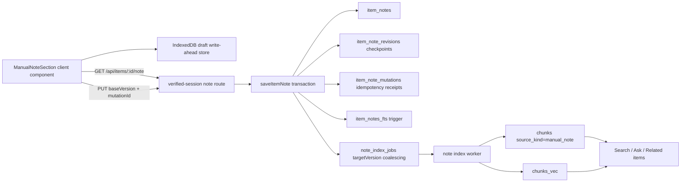
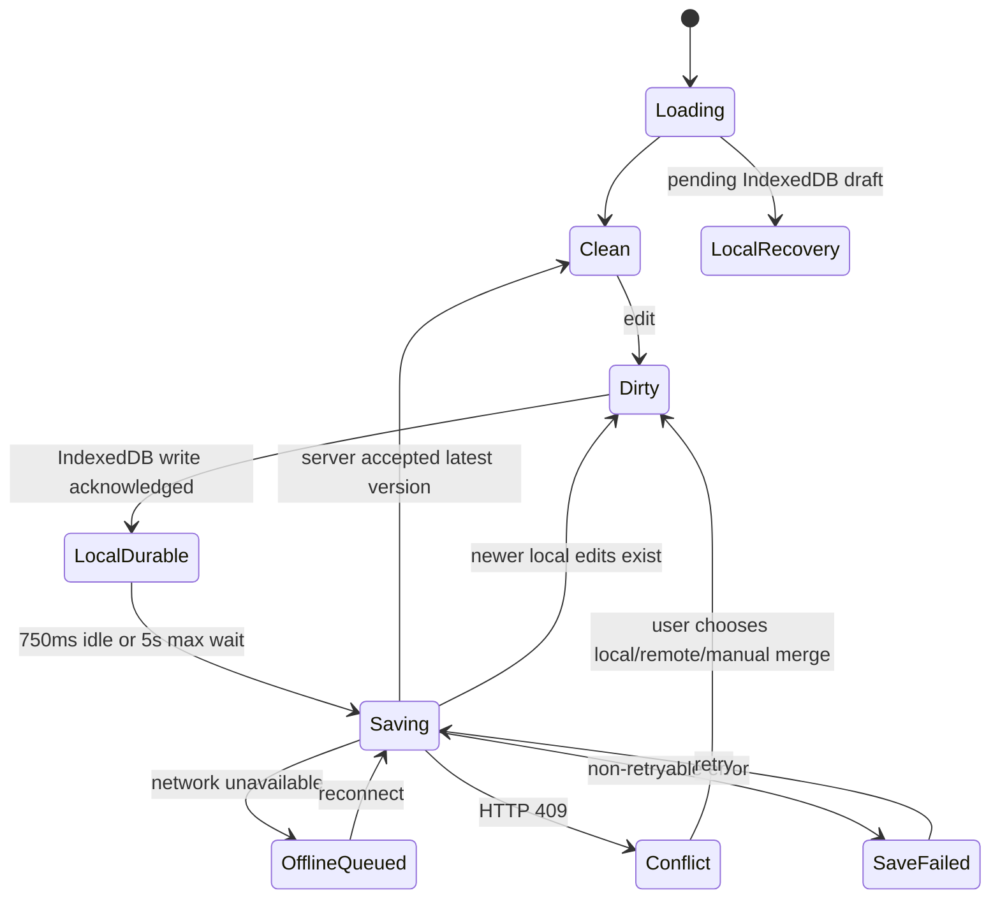

# F08 Manual Content Notes — Technical Architecture V1

**Role:** Technical Architect
**Date:** 2026-07-10
**Status:** Recommended architecture for council review; no production code changed
**Primary requirement source:** `/Users/arun.prakash/.codex/attachments/7510f7ac-1309-4dbe-9163-e5c404f48039/goal-objective.md`
**Baseline PRD:** `/Users/arun.prakash/Library/CloudStorage/GoogleDrive-arun.prakash@toasttab.com/Other computers/My MacBook Pro M1 2025/arun-cursor/Initiatives/Arun_AI_Projects/ai-brain/recall_exploration/feature_deep_dive_program/features/F08_add_content_note_editor/F08_add_content_note_editor_PRD_V2_2026-06-17_02-54-05_IST.md`

## 1. Executive recommendation

Build **one private, user-authored Markdown note document attached one-to-one to every library item**. Store it in a new `item_notes` table, never in `items.body` or `items.summary`. Treat it as a second knowledge source for the same item node:

```text
items row (the library card / graph node)
  ├─ original content: items.title + items.body + items.summary
  └─ manual note: item_notes.content_md + derived content_text
       ├─ item_notes_fts (immediate lexical search)
       └─ chunks(source_kind='manual_note') + chunks_vec (async semantic use)
```

Use canonical Markdown rather than persisted HTML or editor-specific JSON. Use optimistic concurrency (`version`), durable idempotency receipts (`mutation_id`), local IndexedDB write-ahead drafts, serialized/coalesced autosave, bounded revision checkpoints, and an asynchronous note-index queue. A note contributes meaning to its parent item; it must **not** become a second library card or graph node.

The existing standalone capture note is a different concept. `createNote()` currently inserts a new `items` row with `source_type='note'` (`src/db/items.ts:77-79`). Keep that behavior for programmatic capture. Reuse the new editor UI later for `/capture?tab=note`, but do not model an attached note as a hidden `items` row: hidden rows would pollute counts, enrichment, search results, related-item centroids, graph nodes, exports, and deletion behavior.

### Go/no-go summary

- **Go** on the separate one-to-one document model, Markdown source of truth, immediate FTS, asynchronous source-aware embeddings, and optimistic/idempotent saves.
- **No-go** on mutating `items.body`, storing rendered HTML, using a hidden child item, last-write-wins conflict resolution, sending note text through the enrichment/summarization pipeline, or rendering private note text into service-worker-cacheable item HTML.
- **Release blocker:** the new note API must verify the HMAC session, not merely test that a `brain-session` cookie exists. The repository has `verifySessionToken()` (`src/lib/auth.ts:94-110`), but current protected route handlers generally check cookie presence only (for example `src/app/api/search/route.ts:20-23`). Private manual notes must not copy that weaker pattern.

## 2. Verified repository baseline

Items marked **Verified** are facts observed in this worktree. Items marked **Recommendation** are proposed changes.

### 2.1 Application and storage

- **Verified:** The app is Next.js 16 / React 19 / TypeScript with `better-sqlite3`, SQLite FTS5, `sqlite-vec`, and a Capacitor Android shell (`package.json`). It is described as single-user, local-first, but the current production deployment is a Next.js standalone service on Hetzner reached through `brain.arunp.in` (`README.md`; `scripts/deploy.sh`; `scripts/deploy/brain.service`).
- **Verified:** `getDb()` opens one process-local SQLite connection, enables WAL, foreign keys, and `synchronous=NORMAL`, loads `sqlite-vec`, and applies ordered `src/db/migrations/*.sql` at process start (`src/db/client.ts:20-72`, `src/db/client.ts:75-117`).
- **Verified (worktree):** The latest migration present in this branch is `017_transcript_recovery.sql`. The older graph plan's proposed `009_edges.sql` is stale because migration 009 is already `009_telegram_source_type.sql`.
- **Verified (live production probe supplied by the council coordinator, 2026-07-10):** `/opt/brain` has 22 applied migrations through `020_recall_sync`, so feature migrations must be numbered **`021_...` and above**, after the production source line is reconciled. Creating 018/019 from this worktree would collide with already-deployed migration history.
- **Verified:** `items` contains the original title/body and AI fields (`summary`, `quotes`, `category`) and cascades to `chunks`, tags, collections, cards, and item-scoped chat (`src/db/migrations/001_initial_schema.sql:15-131`).
- **Verified:** A new item automatically enters `enrichment_jobs` (`src/db/migrations/003_enrichment_queue.sql:30-39`); when enrichment becomes `done`, it enters `embedding_jobs` (`src/db/migrations/006_embedding_jobs.sql:24-39`). Manual-note autosave must not trigger this original-content enrichment chain.

### 2.2 Current note and editor behavior

- **Verified:** The current “Note” capture UI is a required title input plus required plain `<textarea>` and an explicit server action (`src/app/capture/tabs.tsx:150-207`). It has no rich formatting, autosave, versioning, offline draft, or conflict handling.
- **Verified:** `createNoteAction()` trims and validates title/body, then calls `createNote()` and redirects to the new item (`src/app/actions.ts:11-32`). Opening the capture tab alone does not create a database row; submit does.
- **Verified:** `POST /api/capture/note` is a bearer-authenticated capture endpoint for Android/extension text shares. It validates non-empty title/body, deduplicates a title/body hash for two seconds, and inserts a standalone `items` row (`src/app/api/capture/note/route.ts:21-82`). It is not an edit endpoint.
- **Verified:** The item detail page renders `items.body` verbatim with `whitespace-pre-wrap`, and renders AI summary separately in the right column (`src/app/items/[id]/page.tsx:122-184`, `src/app/items/[id]/page.tsx:313-360`). This is the correct place to add a visibly separate “My notes” section.

### 2.3 Current search, embeddings, Ask, and graph-adjacent behavior

- **Verified:** FTS5 indexes only `items.title` and `items.body`; triggers maintain the index (`src/db/migrations/002_fts5.sql:7-31`). `searchItems()` returns item rows ranked by BM25 (`src/db/items.ts:192-205`).
- **Verified:** Unified search supports FTS, semantic, and RRF hybrid modes, but its return type is only `ItemRow[]`; it cannot tell the UI whether a hit came from original content or a manual note (`src/lib/search/index.ts:24-110`).
- **Verified:** `chunks` is unique on `(item_id, idx)` and has no source/provenance column (`src/db/migrations/001_initial_schema.sql:37-48`). This prevents clean coexistence of original-content chunk 0 and manual-note chunk 0.
- **Verified:** `embedItem()` builds a source string from item title, summary, and body, then returns early if *any* chunks already exist (`src/lib/embed/pipeline.ts:51-79`). It cannot update a changing secondary note source.
- **Verified:** Semantic retrieval joins `chunks_vec → chunks_rowid → chunks → items` and returns chunk/item/body/similarity without source metadata (`src/lib/retrieve/index.ts:24-35`, `src/lib/retrieve/index.ts:98-150`). Ask includes retrieved chunk bodies in its prompt (`src/lib/ask/generator.ts:22-34`).
- **Verified:** `findRelatedItems()` computes one centroid from all chunks for an item and ranks other items (`src/lib/related/index.ts:39-100`). Once manual-note chunks share the source-aware chunk table, related items can naturally incorporate the user's interpretation.
- **Verified:** No `edges` table, graph route, or graph repository exists in current code. The only shipped connection surface is the `RelatedItems` panel. `docs/plans/v0.6.x-graph-view.md` is a future plan and proposes an edge refresh hook after embedding, but its migration numbering and some scope statements are stale.

### 2.4 Current authentication, offline, privacy, backup, and deployment boundaries

- **Verified:** `src/proxy.ts` allows any request carrying a `brain-session` cookie to pass without verifying the HMAC (`src/proxy.ts:75-79`), while `verifySessionToken()` exists in `src/lib/auth.ts`. The proxy comment says verification happens downstream, but current routes commonly check only presence.
- **Verified:** The service worker treats every `/api/**` request as network-only and stale-while-revalidate caches visited `/items/:id` HTML (`public/sw.js:18-24`, `public/sw.js:52-85`, `public/sw.js:232-260`). There is no current `src/lib/outbox` or library-store implementation in this worktree.
- **Verified:** Local SQLite snapshots are cleartext under `data/backups` (`src/lib/backup.ts:1-12`, `src/lib/backup.ts:44-51`). Off-site B2 snapshots are GPG-encrypted before upload, while the cleartext local snapshot remains on Hetzner (`scripts/backup-offsite.sh:1-17`, `scripts/backup-offsite.sh:57-77`).
- **Verified:** Traffic is served through Cloudflare; the repository explicitly documents that Cloudflare can observe plaintext after TLS termination (`README.md`, “Privacy note”). A configured Gemini embed provider or cloud Ask provider can also receive the text it processes (`src/lib/providers/status.ts:122-159`, `src/lib/providers/status.ts:217-225`).
- **Verified:** Deployment runs typecheck, lint, all Node tests, a disposable production build, artifact checks, rsync, service restart, and authenticated health/provider checks (`scripts/deploy.sh:152-206`). The build uses a disposable `BRAIN_DB_PATH` (`scripts/build-next-safe.mjs:7-22`).

### 2.5 Live production divergence and derived-index state

- **Verified (live production probe supplied by the council coordinator, 2026-07-10):** the active `/opt/brain` database has 122 items, 0 relational `chunks` rows, 44 `chunks_vec` rows, and migrations applied through `020_recall_sync`. The service has been active since 2026-06-26.
- **Inference:** with zero relational chunks, the 44 vec0 rows cannot participate in the repository's join-based retrieval path and are likely orphaned derived-index rows. The bridge count/rowids must be inspected before deletion, but note indexing must not start against this state.
- **Critical consequence:** `insertChunkWithRowid()` allocates `MAX(chunks_rowid.rowid)+1` (`src/db/chunks.ts:35-56`). If the bridge is empty while vec0 still owns low rowids, the first new note embedding can reuse an occupied vec0 rowid and fail. A report-only rowid/bridge audit and an approved repair are P0 prerequisites.
- **Verified:** `origin/main` stops at migration 017, while production includes Recall-sync work through 020. The likely deployed source line is represented by `origin/codex/recall-daily-sync-architecture-20260628` at `4d97c45`, but that mapping is an inference until the running artifact/commit is positively identified.
- **Verified deployment risk:** the current `scripts/deploy.sh` uses `rsync --delete` for the standalone artifact (`scripts/deploy.sh:171-180`). Deploying this feature branch from the older main baseline can remove production Recall scheduler files and regress working behavior. No F08 deployment is permitted until the 018–020 source/migrations/scheduler changes are integrated and the deployed commit is identified.

## 3. Recommended component architecture

### 3.1 Read/write path



1. `ItemDetailPage` renders only the note-section shell. It must not put manual-note content in the server-rendered HTML/RSC payload because visited item pages are service-worker cached.
2. `ManualNoteSection` reads the acknowledged/local draft from IndexedDB immediately, then fetches the server copy with `Cache-Control: no-store`.
3. Every edit is written locally first. Autosave is serialized and versioned; manual Save flushes immediately.
4. The server transaction updates the canonical Markdown row, optionally checkpoints a revision, records the idempotency receipt, and moves the note-index target to the new version.
5. FTS reflects the accepted note immediately. Embeddings, Ask provenance, related-item centroids, and future graph edges converge asynchronously.

### 3.2 Server module boundaries

- `src/db/item-notes.ts`: typed CRUD, optimistic update, revision pruning, idempotency receipt lookup, hard delete.
- `src/lib/notes/markdown.ts`: normalization, Markdown-to-plain-text extraction, content hashing, meaningful-content decision, URL policy.
- `src/lib/notes/save-item-note.ts`: transaction boundary and domain errors; route handlers must stay thin.
- `src/lib/notes/note-index.ts`: source-aware chunk replacement for a requested note version.
- `src/lib/queue/note-index-worker.ts`: claim/retry/stale-claim loop modeled after `src/lib/queue/enrichment-worker.ts`, but it calls only the embedding provider, never the enrichment LLM.
- `src/lib/notes/auth.ts` or a shared auth guard: verified cookie plus same-origin mutation check. This should subsequently replace cookie-presence checks across other private routes, but broad auth remediation can be a separate hardening task.

### 3.3 Editor reuse boundary

Create a reusable `MarkdownNoteEditor` with a persistence adapter:

- **Attached mode (this feature):** parent `item_id` already exists; content persists to `item_notes`.
- **Standalone-create mode (follow-on F08 parity):** remains client-only/IndexedDB until meaningful content or explicit Save; then creates one `items` row through the existing standalone note capture domain. It must not create blank Home cards.

The editor component owns formatting, selection, undo/redo, Markdown conversion, save status, and accessibility. The adapter owns load/save/delete/version behavior. This avoids forcing attached notes through `createNoteAction()` and avoids duplicating editor code when the current `/capture?tab=note` textarea is upgraded.

## 4. Recommended data model

### 4.1 Migration `021_item_notes.sql`

Recommended shape (exact SQL should be finalized with migration tests):

```sql
CREATE TABLE item_notes (
  item_id              TEXT PRIMARY KEY REFERENCES items(id) ON DELETE CASCADE,
  content_md           TEXT NOT NULL DEFAULT '',
  content_text         TEXT NOT NULL DEFAULT '',
  content_hash         TEXT NOT NULL,
  version              INTEGER NOT NULL DEFAULT 1 CHECK (version >= 1),
  include_in_ai        INTEGER NOT NULL DEFAULT 1 CHECK (include_in_ai IN (0, 1)),
  indexed_version      INTEGER NOT NULL DEFAULT 0 CHECK (indexed_version >= 0),
  last_saved_kind      TEXT NOT NULL DEFAULT 'auto'
                         CHECK (last_saved_kind IN ('auto', 'manual', 'restore')),
  created_at           INTEGER NOT NULL DEFAULT (unixepoch() * 1000),
  updated_at           INTEGER NOT NULL DEFAULT (unixepoch() * 1000),
  CHECK (length(content_md) <= 200000)
);

CREATE INDEX idx_item_notes_updated_at ON item_notes(updated_at DESC);

CREATE TABLE item_note_revisions (
  id                   TEXT PRIMARY KEY,
  item_id              TEXT NOT NULL REFERENCES item_notes(item_id) ON DELETE CASCADE,
  source_version       INTEGER NOT NULL,
  content_md           TEXT NOT NULL,
  content_text         TEXT NOT NULL,
  content_hash         TEXT NOT NULL,
  save_kind            TEXT NOT NULL CHECK (save_kind IN ('auto', 'manual', 'restore', 'pre_clear')),
  created_at           INTEGER NOT NULL DEFAULT (unixepoch() * 1000),
  UNIQUE (item_id, source_version)
);

CREATE INDEX idx_item_note_revisions_item_time
  ON item_note_revisions(item_id, created_at DESC);

CREATE TABLE item_note_mutations (
  mutation_id          TEXT PRIMARY KEY,
  item_id              TEXT NOT NULL REFERENCES items(id) ON DELETE CASCADE,
  client_id            TEXT NOT NULL,
  operation            TEXT NOT NULL CHECK (operation IN ('save', 'restore', 'delete')),
  request_hash         TEXT NOT NULL,
  accepted_version     INTEGER NOT NULL,
  created_at           INTEGER NOT NULL DEFAULT (unixepoch() * 1000)
);

CREATE INDEX idx_item_note_mutations_item_time
  ON item_note_mutations(item_id, created_at DESC);

CREATE TABLE note_index_jobs (
  item_id              TEXT PRIMARY KEY REFERENCES item_notes(item_id) ON DELETE CASCADE,
  target_version       INTEGER NOT NULL,
  state                TEXT NOT NULL DEFAULT 'pending'
                         CHECK (state IN ('pending', 'running', 'done', 'error')),
  attempts             INTEGER NOT NULL DEFAULT 0,
  last_error_code      TEXT,
  last_error_message   TEXT,
  created_at           INTEGER NOT NULL DEFAULT (unixepoch() * 1000),
  claimed_at           INTEGER,
  completed_at         INTEGER
);

CREATE INDEX idx_note_index_jobs_state_created
  ON note_index_jobs(state, created_at);

CREATE VIRTUAL TABLE item_notes_fts USING fts5(
  item_id UNINDEXED,
  body,
  tokenize = "porter unicode61 remove_diacritics 2"
);
```

Add insert/update/delete triggers on `item_notes` to keep `item_notes_fts` synchronized, mirroring `src/db/migrations/002_fts5.sql:19-31`. Index `content_text`, not raw Markdown, so markup punctuation does not distort search.

#### Data-model decisions

- **One row per item:** the requested mental model is “my notes on this item,” not a notebook of independently addressable subnotes. Multiple blocks live inside Markdown; a multi-document note model can be added later without changing the item relationship.
- **No `owner_id` now:** the current app is single-user and SQLite has no row-level security. Adding a decorative owner column would not create isolation. If multi-user hosting is introduced, add an owners table, owner foreign keys on `items` and all descendants, and owner predicates/authorization before enabling a second account.
- **`include_in_ai`:** defaults to on because the requirement explicitly asks for search and AI mapping. Turning it off keeps FTS but deletes/omits manual-note chunks and prevents note text from reaching the embed/Ask providers. This is the privacy escape hatch.
- **No editor JSON or HTML:** Markdown is the only canonical representation. `content_text` is a derived search/chunking projection. Two editable sources of truth would drift.
- **No soft delete:** explicit note deletion hard-deletes the note, revisions, save/restore receipts, jobs, FTS row, note chunks, and note vectors. Retain one content-free delete receipt against the parent `items` row for at most seven days so a delayed delete retry is idempotent; it contains only IDs/hash/version metadata. Full SQLite snapshots can retain older content until backup retention expires; the product copy must say so honestly.

### 4.2 Revision and idempotency retention

Do not create a revision on every 750 ms autosave; that would burn through 25 revisions in seconds. Checkpoint the previous acknowledged state when any of these is true:

- manual Save;
- restore;
- non-empty → empty transition;
- at least five minutes since the last checkpoint and the hash changed.

After an accepted write, prune to the intersection required by PRD V2: keep at most the newest 25 checkpoints and delete any older than 30 days. Purge all revisions on explicit note delete. Retain save/restore idempotency receipts for seven days or the newest 100 per note, whichever is smaller; on delete, replace them with one redacted delete receipt retained for at most seven days. This is long enough for delayed offline retries without unbounded growth or retained note text.

### 4.3 Migration `022_chunks_source_kind.sql`

Rebuild `chunks` so original content and manual notes can use the same vector index and citation system:

```sql
CREATE TABLE chunks_v2 (
  id             TEXT PRIMARY KEY,
  item_id        TEXT NOT NULL REFERENCES items(id) ON DELETE CASCADE,
  source_kind    TEXT NOT NULL DEFAULT 'item'
                   CHECK (source_kind IN ('item', 'manual_note')),
  source_version INTEGER NOT NULL DEFAULT 0,
  idx            INTEGER NOT NULL,
  body           TEXT NOT NULL,
  token_count    INTEGER NOT NULL,
  UNIQUE (item_id, source_kind, idx)
);
```

Copy existing chunks with `source_kind='item'`, `source_version=0`, and preserve every chunk ID and its `chunks_rowid.rowid`. Rebuild `chunks_rowid` against the new table. Do **not** blindly preserve all `chunks_vec` rows: first classify each production vec row as mapped or orphaned, preserve mapped rowids exactly, and handle orphan rows through the separately reviewed repair step. The migration test must compare pre/post chunk IDs, rowids, mapped vector counts, retrieval results, and `PRAGMA foreign_key_check`.

This table-rebuild approach is preferable to assigning note indices an arbitrary offset. It is also backward-compatible with an application rollback: old code omits the new columns and receives the defaults, and old reads ignore them.

### 4.4 Vector deletion correctness

`chunks_vec` is a virtual table with no foreign key. `deleteItem()` currently deletes the item and relies on relational cascades (`src/db/items.ts:107-111`), but no code explicitly removes the associated vec0 rows. Joins hide orphan vectors, but the vector table can grow and KNN scans can waste work.

Add a shared `deleteChunksAndVectors(itemId, sourceKind?)` transaction helper:

1. read rowids through `chunks_rowid`;
2. delete those rowids from `chunks_vec`;
3. delete the matching chunks (which cascades bridge rows);
4. assert no source rows remain.

Use it for note replacement, note delete, `include_in_ai=false`, and item delete. Treat the existing whole-item vector-orphan behavior as a feature-adjacent correctness fix required for reliable cleanup evidence.

## 5. Note format and sanitization

### 5.1 Canonical format

Use UTF-8 GitHub-flavored Markdown with LF line endings. V1 supported constructs:

- paragraphs and line breaks;
- bold, italic, strikethrough;
- headings H1–H4 (toolbar may present H2–H4 to avoid competing with the item title);
- ordered/unordered/task lists;
- blockquotes;
- inline code and fenced code blocks;
- links;
- horizontal rule;
- undo/redo and keyboard shortcuts.

Tables, images/uploads, math, embedded iframes, raw HTML, custom React components, and arbitrary CSS are out of V1 unless product explicitly approves them. This keeps paste handling, mobile editing, export, and sanitization tractable.

### 5.2 Write-time normalization

`normalizeMarkdown()` must:

1. normalize CRLF/CR to LF and NFC Unicode;
2. remove NUL and disallowed C0 control characters while retaining tab/newline;
3. cap the UTF-8 byte length at 200 KB (check bytes in the API, not only SQLite character count);
4. cap individual URL length at 2,048 bytes and nesting/list depth at a safe editor limit;
5. derive `content_text` through a Markdown AST, excluding link destinations and formatting tokens;
6. compute SHA-256 over the normalized Markdown;
7. define “meaningful” as non-whitespace `content_text` or an explicit manual Save. Formatting markers alone do not trigger autosave creation.

### 5.3 Render-time safety

- Render Markdown to React elements, never persist or inject `innerHTML`.
- Do not enable raw HTML parsing (`rehype-raw`). `react-markdown` is safe by default when raw HTML is not enabled; its official project documentation explicitly warns about raw HTML and recommends sanitization when it is used: <https://github.com/remarkjs/react-markdown>.
- Apply a fixed `rehype-sanitize` schema as defense in depth and a URL transform that allows only `http:`, `https:`, and optionally `mailto:`. Reject `javascript:`, `data:`, `file:`, `intent:`, and custom protocols.
- External links use `target="_blank"` only with `rel="noopener noreferrer"`.
- Strip pasted HTML to supported semantic nodes before converting to Markdown. Never trust clipboard HTML or paste it directly into the DOM.
- Code blocks render as text. No execution, iframe preview, Mermaid execution, or HTML preview in V1.

### 5.4 Editor dependency recommendation

Use Lexical with its official React and Markdown packages for the editor, because it supplies React bindings, accessible content-editable primitives, history, lists/links/code, and Markdown import/export without making editor JSON the product format. The official project lists Markdown and HTML serialization as supported capabilities: <https://github.com/facebook/lexical>.

Recommended additions, version-pinned after a compatibility spike:

- `lexical`, `@lexical/react`, `@lexical/markdown`, `@lexical/list`, `@lexical/link`, `@lexical/code`;
- `react-markdown`, `remark-gfm`, `rehype-sanitize` for compact read mode.

Do not add Yjs/Automerge/CRDT infrastructure: this is a single-user application and optimistic versioning is sufficient. Do not add Dexie: raw IndexedDB plus the already-installed `fake-indexeddb` dev dependency is enough. Lazy-load the editor when the note section enters edit mode so the library/item initial bundle does not absorb the editor cost.

Before choosing exact versions, run a small proof against React 19.2, Next 16.2, SSR-disabled lazy loading, Android Capacitor WebView, Markdown round trips, IME input, and mobile selection. Failure of the compatibility/accessibility spike is a dependency-selection blocker, not permission to ship an unstable editor.

## 6. Autosave, concurrency, idempotency, and offline behavior

### 6.1 Client autosave state machine



Rules:

- Write normalized Markdown to IndexedDB within 250 ms of an editor change before starting a network save.
- Debounce server autosave for 750 ms after the last input, with a five-second maximum wait during continuous typing.
- Permit only one in-flight save per item per tab. Coalesce later content into the next mutation; never fire overlapping writes from the same editor.
- Manual Save cancels the timer, flushes local storage, and sends immediately.
- `visibilitychange`, `pagehide`, route navigation, and editor blur attempt a `fetch(..., {keepalive:true})`, but the IndexedDB write is the real data-loss guarantee. Do not claim a network flush succeeded merely because it was attempted.
- Announce `Not saved yet`, `Saved locally`, `Saving`, `Saved`, `Offline — saved on this device`, `Conflict`, and `Save failed` through a polite `aria-live` region.

### 6.2 Optimistic concurrency

Every server row has an integer `version`. A save carries `baseVersion` (`null` means no server note existed). The transaction does an atomic compare-and-swap:

```sql
UPDATE item_notes
   SET content_md = ?, content_text = ?, content_hash = ?,
       version = version + 1, updated_at = ?, last_saved_kind = ?
 WHERE item_id = ? AND version = ?;
```

If zero rows change and the current hash differs, return `409 NOTE_VERSION_CONFLICT` with the current server note/version. Never silently last-write-wins. The client offers:

- keep server;
- keep my local draft (new mutation against current version after explicit confirmation);
- copy both into a simple comparison/merge view.

Use `BroadcastChannel('brain-item-note:<item_id>')` to notify sibling tabs of acknowledged versions. It improves UX but is not the correctness mechanism; the SQLite compare-and-swap is authoritative.

### 6.3 Idempotency

Each request has a random UUID `mutationId`, stable across retries, plus a stable `clientId` stored outside note content. In one transaction:

1. look up `mutationId`;
2. if it exists with the same request hash, return the recorded accepted version with `replayed:true` and do not update again;
3. if it exists with a different request hash, return `422 IDEMPOTENCY_KEY_REUSED`;
4. otherwise compare/update and insert the receipt. Delete uses a receipt tied to the parent item rather than the note row, so retry remains idempotent after the note has been hard-deleted.

This prevents retry, double-click, service-worker/browser retry, and refresh races from creating duplicate revisions or advancing the version twice. A content hash alone is insufficient because the user can legitimately return to an earlier content state.

### 6.4 Blank and deletion behavior

- Opening/expanding a blank attached note creates only a client draft shell; it creates no `item_notes` row and no Home/library card.
- Formatting-only autosave is a no-op. Explicit manual Save may create an empty note row to honor PRD V2, but it remains attached and never appears as a library card, FTS hit, chunk, or graph node.
- If an existing note is cleared, autosave the empty state as a new version and create a `pre_clear` checkpoint. Search and semantic chunks are removed. This preserves recovery from an accidental select-all/delete.
- “Delete my note” is separate from clearing. It requires confirmation and hard-purges note state plus derived artifacts. The original item and AI summary remain.

### 6.5 Offline scope and IndexedDB

Create a raw IndexedDB database such as `brain-manual-notes-v1` with a `drafts` store keyed by `item_id`:

```ts
type LocalNoteDraft = {
  itemId: string;
  contentMarkdown: string;
  baseVersion: number | null;
  mutationId: string;
  contentHash: string;
  dirty: boolean;
  updatedAt: number;
};
```

On reconnect, replay only the latest coalesced draft with its original base version and mutation ID. A 409 stops replay and asks for resolution. Delete a clean local draft after server acknowledgement; retain dirty/offline drafts until acknowledged or explicitly discarded.

**Honest limitation:** the current service worker can reopen only previously cached item pages, and `/api/**` is network-only. This feature can guarantee crash/offline recovery for an editor that was already loaded, but it does not make the whole library navigable offline. The deferred library-replica work in `docs/plans/v0.6.x-library-offline-from-db.md` is a separate capability.

IndexedDB is not application-level encryption. It relies on browser-profile/device storage protection. If “private” means encrypted against a compromised OS account/server disk, encrypted-at-rest key management is a separate blocker; this architecture does not pretend otherwise.

## 7. API contracts

All responses containing note content use `Cache-Control: no-store`. Do not add these routes to `BEARER_ROUTES` for V1; the APK WebView uses the same session-cookie UI. Programmatic editing can be designed later with a scoped token.

### 7.1 `GET /api/items/:id/note`

Response `200`:

```json
{
  "note": {
    "itemId": "item-id",
    "contentMarkdown": "## My takeaways\n...",
    "version": 7,
    "contentHash": "sha256-hex",
    "includeInAi": true,
    "indexedVersion": 6,
    "updatedAt": 1783660000000
  }
}
```

No row is `{ "note": null }`; unknown item is `404 ITEM_NOT_FOUND`; invalid/expired session is `401`. Support `ETag: "item-note:<itemId>:v<version>"` and `If-None-Match` for online polling, while retaining `no-store`.

### 7.2 `PUT /api/items/:id/note`

Request:

```json
{
  "contentMarkdown": "## My takeaways\n...",
  "baseVersion": 6,
  "mutationId": "uuid-v4",
  "clientId": "stable-random-client-id",
  "saveKind": "auto",
  "includeInAi": true
}
```

Response `200` for update / `201` for first persisted note:

```json
{
  "note": {
    "itemId": "item-id",
    "version": 7,
    "contentHash": "sha256-hex",
    "includeInAi": true,
    "indexedVersion": 6,
    "updatedAt": 1783660000000
  },
  "replayed": false,
  "indexing": "queued"
}
```

Errors:

- `400 INVALID_JSON`;
- `401 UNAUTHENTICATED`;
- `403 ORIGIN_NOT_ALLOWED`;
- `404 ITEM_NOT_FOUND`;
- `409 NOTE_VERSION_CONFLICT` with current server note/version;
- `413 NOTE_TOO_LARGE`;
- `422 INVALID_MARKDOWN` or `IDEMPOTENCY_KEY_REUSED`;
- `429` only if a new session mutation limiter is deliberately added; autosave needs a budget substantially above the current bearer 30/min default.

### 7.3 Delete and revisions

- `DELETE /api/items/:id/note` with `If-Match: "item-note:<id>:v<version>"` and `Idempotency-Key`. Return `204`; return `409` on stale version. The client must delete its IndexedDB row only after the server confirms, or keep a tombstone mutation offline until it can confirm.
- `GET /api/items/:id/note/revisions` returns revision metadata and an optionally requested single snapshot, not all full bodies by default.
- `POST /api/items/:id/note/revisions/:revisionId/restore` requires `baseVersion` and `mutationId`, creates a new current version, and never rewinds the version counter.

### 7.4 Authentication and CSRF contract

Add `requireVerifiedSession(req)` that calls `verifySessionToken(req.cookies.get(SESSION_COOKIE)?.value)`. For `PUT`, `DELETE`, and restore, require an `Origin` equal to the request origin/known app origins and reject missing browser mutation origins. Do not reuse `validateOrigin()` unchanged for session mutations because it intentionally allows missing origins and any Chrome extension origin for bearer/CLI capture (`src/lib/auth/bearer.ts:230-268`).

Use prepared SQL exclusively, Zod request validation, maximum body checks before parsing when possible, and no raw note content in error messages.

## 8. Search, embedding, Ask, related-items, and graph integration

### 8.1 Lexical/full-text search

Add `searchItemNotes(query, limit)` in `src/db/item-notes.ts`. Extend search with a detailed internal result:

```ts
type SearchHit = {
  item: ItemRow;
  matchedSources: Array<'title' | 'original_content' | 'manual_note' | 'semantic'>;
  snippet?: string;
  score: number;
};
```

Run three ranked lists—existing item FTS, note FTS, and semantic—and fuse them with the existing RRF approach in `searchUnified()` (`src/lib/search/index.ts:59-87`). Do not compare raw BM25 values from separate FTS virtual tables directly. A note-only hit returns its parent item once and the UI labels it “Matched in My notes,” with a sanitized short snippet.

For compatibility, add `searchUnifiedDetailed()` and keep `searchUnified()` as a projection to `ItemRow[]` until all consumers move. `/api/search` can add a `results` field while retaining the current `items` field (`src/app/api/search/route.ts:50-52`).

FTS is synchronous and must be searchable immediately after the server save succeeds, even if the embed provider is offline.

### 8.2 Source-aware semantic indexing

Implement `replaceSourceEmbeddings(itemId, 'manual_note', version, text)`:

1. re-read `item_notes` and abort if its current version/include flag no longer matches the claimed job;
2. chunk `items.title + "\n\nYour notes:\n" + content_text` through the existing `chunkBody()` (`src/lib/chunk/index.ts`);
3. obtain vectors outside the SQLite write transaction;
4. re-read version again;
5. in one transaction delete previous manual-note vectors/chunks, insert new source-versioned chunks/vectors, and set `indexed_version=version`;
6. if a newer `target_version` arrived, leave/re-arm the job as pending rather than marking it done.

The save path upserts one coalescing job per item. It must not embed on every keystroke. The worker should wait for a short quiet period (for example five seconds after `updated_at`) and process only the newest target version.

If `include_in_ai=0` or `content_text` is empty, the job removes manual-note vectors/chunks and marks the current version indexed without calling an external provider.

### 8.3 Retrieval and Ask

Extend `RetrievedChunk` and the client stream type with `source_kind` and `source_version`. The query in `src/lib/retrieve/index.ts` should select these columns. Update `buildPrompt()` so the LLM sees provenance:

```text
[id=chunk] from the original content “Item title”
...
[id=chunk] from your manual note on “Item title”
...
```

This keeps user-authored interpretation distinct from source facts and AI summary. The citation chip should label/tooltip a manual-note citation as “Your note” and navigate to the note section, not show it as an original cited passage (`src/components/citation-chip.tsx:11-44`; `src/app/items/[id]/page.tsx:83-119`).

Do not append manual notes to `items.body` or run `enrichItem()` on every save. That would overwrite or blur the AI summary boundary, generate repeated cloud LLM work, and create a feedback loop where AI output and user notes contaminate one another. Manual notes enter LLM context only through retrieval or an explicit note-scoped action.

### 8.4 Related items and weighting

Once both sources are in `chunks`, the existing centroid query in `findRelatedItems()` automatically sees them. However, a long manual note could dominate the centroid. Recommended V1 weighting:

- compute an original-content centroid and manual-note centroid separately;
- combine `0.7 * original + 0.3 * manual_note`, then normalize;
- if only one source exists, use it at weight 1.0.

Make weights constants and capture offline evaluation before tuning. Manual notes should influence connections, not erase the source topic. Add `matched_source_kind` to `RelatedItem` for diagnostics/UI if needed.

### 8.5 Future graph integration

Current code has no persisted graph edges. Do not invent a graph-only note node. When the graph plan is implemented:

- one item remains one node;
- semantic edges are computed from the combined, weighted source representation;
- both the original embedding success path and manual-note index success path call one `refreshEdgesForItem(itemId)` boundary;
- edge provenance records that its score includes `manual_note` if useful for explainability;
- note clear/delete or `include_in_ai=false` refreshes/removes affected edges.

`docs/plans/v0.6.x-graph-view.md:199-235` already proposes an `updateEdgesForItem` hook after embedding. Reuse that concept, but renumber migrations and avoid a hard import until the edges module actually exists.

### 8.6 Export and backup

Add a separate `## My notes` section to single-item and library Markdown exports (`src/app/api/items/[id]/export.md/route.ts`; `src/app/api/library/export.zip/route.ts`). Preserve the distinction from `## Summary` and `## Body`. Export remains an explicit user action and must verify the real session HMAC.

The existing SQLite backup automatically captures the new tables. Update restore verification to count/check `item_notes`, `item_note_revisions`, manual-note chunks, and note-index jobs. Deletion cannot retroactively erase an older snapshot; disclose that snapshots age out under the existing 28-snapshot local retention and the separate off-site retention policy.

## 9. Security, privacy, and RLS posture

### 9.1 Authorization / RLS

- **Verified:** This is single-user SQLite; database row-level security does not exist.
- **Recommendation:** authorize the request, then verify the requested parent item exists. The one-to-one foreign key and item ID path prevent cross-parent writes. Every note read/write/delete/revision route uses HMAC-verified session authentication.
- **Future multi-user requirement:** do not expose a second account until `owner_id` is present and enforced on `items`, notes, revisions, chunks, jobs, chat, exports, and search queries. Application predicates alone are not equivalent to database RLS.

### 9.2 Privacy boundaries

- Manual notes are private by default: no public/share endpoint, no bearer edit route, no inclusion in telemetry, and no server-rendered/cacheable HTML.
- Full-text indexing stays inside SQLite.
- Semantic indexing sends text to the configured embedding provider. The default can be Ollama/local, but Gemini is supported. Ask can send matched text to the configured Ask provider. UI/settings must state the active provider before claiming notes “stay local.”
- `include_in_ai=false` guarantees no manual-note chunks/vectors and no inclusion in Ask/semantic related/graph paths; full-text search remains available.
- Cloudflare terminates public TLS and may observe request/response content. This is an existing infrastructure property, not changed by this feature.
- SQLite and local backups are not application-encrypted. B2 copies are GPG-encrypted. High-sensitivity encrypted-note requirements need a separate key-management design.

### 9.3 Logging and analytics

Never log title/body, Markdown, plain text, snippets, revision bodies, clipboard payload, conflict bodies, or provider prompts. Safe dimensions are event name, item ID or one-way diagnostic fingerprint, version numbers, bytes, latency, status/error code, retry count, online/offline, and source kind. The existing JSONL sink rotates at 5 MB (`src/lib/errors/sink.ts:1-39`).

Avoid putting note text in URLs, query strings, cache keys, analytics attributes, exception messages, DOM data attributes, or screenshot fixtures. Controlled validation uses synthetic text and the PRD V2 artifact/privacy manifest.

### 9.4 Additional web risks

- The current global CSP is intentionally deferred (`next.config.ts:35-37`). The no-raw-HTML rendering rule is therefore load-bearing. A strict nonce-based CSP remains recommended defense in depth.
- Limit Markdown size/depth and sanitize links to prevent parser/resource abuse and navigation attacks.
- Conflict responses contain private content and therefore require `no-store` and verified session auth.
- Prevent clickjacking using the already configured `X-Frame-Options: DENY` (`next.config.ts:38-49`).

## 10. Affected files and modules

### 10.1 New files

| Path | Responsibility |
|---|---|
| `src/db/migrations/021_item_notes.sql` | Notes, revisions, idempotency receipts, FTS, index jobs; number assumes deployed 018–020 are first integrated |
| `src/db/migrations/021_item_notes.test.ts` | Fresh/legacy/deployed-snapshot migration, triggers, cascade, FK tests |
| `src/db/migrations/022_chunks_source_kind.sql` | Source-aware chunks rebuild preserving valid rowids/mapped vectors |
| `src/db/migrations/022_chunks_source_kind.test.ts` | Pre/post data, mapped/orphan vec, retrieval, rollback-compat tests |
| `src/db/item-notes.ts` / `.test.ts` / `.test.setup.ts` | Repository and transaction behavior |
| `src/lib/notes/markdown.ts` / `.test.ts` | Normalize, plain text, limits, hash, meaningful content |
| `src/lib/notes/save-item-note.ts` / `.test.ts` | Compare-and-swap, checkpoint, idempotency, pruning |
| `src/lib/notes/client-draft-store.ts` / `.test.ts` | Raw IndexedDB write-ahead drafts using `fake-indexeddb` |
| `src/lib/notes/autosave-controller.ts` / `.test.ts` | Pure serialized/coalesced state machine |
| `src/lib/notes/note-index.ts` / `.test.ts` | Version-guarded source chunk/vector replacement |
| `src/lib/queue/note-index-worker.ts` / `.test.ts` | Claim, quiet period, retry, stale target, recovery |
| `src/app/api/items/[id]/note/route.ts` / tests | GET, PUT, DELETE contracts and real session verification |
| `src/app/api/items/[id]/note/revisions/route.ts` / tests | Revision metadata/snapshot access |
| `src/app/api/items/[id]/note/revisions/[revisionId]/restore/route.ts` / tests | Versioned restore |
| `src/components/manual-note-section.tsx` | Load/recovery/save/conflict/error state |
| `src/components/markdown-note-editor.tsx` | Lazy rich editor + toolbar + accessible status |
| `src/components/markdown-note-view.tsx` | Safe read-only Markdown rendering |
| `scripts/smoke-manual-notes.mjs` | Authenticated create/update/search/conflict/delete cleanup smoke |

### 10.2 Modified files

| Path / symbol | Change |
|---|---|
| `src/db/client.ts` | Add note row types only if not colocated; migrations already auto-discover |
| `src/db/chunks.ts` | Source-aware insert/list/delete-vector helpers |
| `src/db/items.ts#deleteItem` | Explicit vector cleanup before item cascade |
| `src/app/items/[id]/page.tsx#ItemDetailPage` | Add client-only My notes section and note-citation anchor; no note body SSR |
| `src/lib/search/index.ts#searchUnified` | Detailed hits and RRF input for note FTS/source-aware semantic |
| `src/app/search/page.tsx` | “Matched in My notes” label/snippet |
| `src/app/api/search/route.ts` | Add detailed results while preserving `items` compatibility |
| `src/lib/retrieve/index.ts#RetrievedChunk` | Select `source_kind` and `source_version` |
| `src/lib/ask/generator.ts#buildPrompt` | Explicit original/manual provenance |
| `src/lib/related/index.ts#findRelatedItems` | Per-source centroids and bounded manual-note weight |
| `src/lib/client/use-ask-stream.ts` | Carry source provenance to citations |
| `src/components/citation-chip.tsx` / `chat-message.tsx` | Label and navigate manual-note citations |
| `src/instrumentation.ts#register` | Start note-index worker after DB warm-up |
| `src/app/api/items/[id]/export.md/route.ts` | Add separate My notes section and real session verification |
| `src/app/api/library/export.zip/route.ts` | Add separate My notes section and real session verification |
| `src/app/capture/tabs.tsx#NotePanel` | Follow-on: reuse rich editor in standalone-create mode |
| `src/app/actions.ts#createNoteAction` | Follow-on: adapter/API path; retain compatibility until cutover |
| `package.json` / `package-lock.json` | Editor and safe renderer dependencies; optional browser test tooling |
| `scripts/check-build-artifacts.mjs` | Assert the integrated migration set through 022 is present in the standalone artifact |
| `scripts/deploy.sh` | Run manual-note smoke and remote schema/integrity checks in the release lane |
| `docs/runbooks/restore-from-b2.md` | Add note/revision/source-chunk restoration verification |

`public/sw.js` already makes `/api/**` network-only, which is correct. Change it only if a future explicit purge/message protocol is added; do not cache note API responses.

## 11. Migration, backfill, and integrity plan

### 11.1 Pre-migration checks

1. Take a WAL-safe SQLite snapshot.
2. Record counts and exact rowid sets for `items`, `chunks`, `chunks_rowid`, and `chunks_vec` plus a sample of retrievable chunk IDs. The known live baseline is 122 items, 0 chunks, and 44 vector rows.
3. Run `PRAGMA integrity_check`, `PRAGMA foreign_key_check`, classify mapped versus orphan vec rows, and verify whether `chunks_rowid` is empty. Do not mutate production during this audit.
4. Integrate and test the deployed Recall migrations/source through 020, then apply 021/022 to a copy of the latest production snapshot, not only a fresh test DB.

### 11.2 Forward migration

- Migration 021 is additive and starts with no attached-note rows.
- Migration 022 copies valid existing chunks and bridge rowids without re-embedding. The known production state requires an orphan-vector decision before the first new rowid allocation. There is no content backfill/provider dependency during the schema migration itself.
- Existing standalone `source_type='note'` items remain standalone items. Do not automatically convert them into attached notes; the intent is ambiguous and conversion could create a note-on-note artifact.
- Fresh attached notes become indexed through normal jobs. If a prototype or imported attached-note source exists before release, provide an explicit one-shot enqueue script rather than hiding it in startup.

### 11.3 Post-migration assertions

- pre/post item, chunk, rowid, and **mapped** vector counts match; any orphan count changes must match the approved repair manifest rather than a naïve equality check;
- every old chunk has `source_kind='item'`;
- chunk ID → rowid mapping is unchanged;
- sample semantic queries return the same top results within deterministic tie behavior;
- `PRAGMA integrity_check = 'ok'` and `foreign_key_check` returns zero rows;
- FTS triggers insert/update/delete correctly;
- deleting a synthetic item removes its note, revisions, job, FTS row, chunks, bridge rows, and vectors;
- startup/build artifact contains the integrated deployed migrations 001–020 plus feature migrations 021–022 and all Recall scheduler/runtime files.

### 11.4 Backfill and reindex

No item-note backfill is required for a new table. Do not re-embed the whole library solely because `source_kind` was added. Production currently has no relational chunks to preserve but does have 44 vector rows; a separate repair script must enumerate `chunks_vec.rowid EXCEPT chunks_rowid.rowid`, prove those rows are unreachable, and run first in report-only mode. After backup and review, delete only proven orphan rowids, then reset/seed the bridge allocation safely. Whether the 122 original items should be re-embedded is a separate derived-index recovery decision, not an implicit F08 backfill.

## 12. Observability and operational behavior

Emit structured, content-free events through the existing JSONL/journal path:

- `note.save.accepted`, `note.save.replayed`, `note.save.conflict`, `note.save.failed`;
- `note.local_draft.recovered`, `note.local_draft.replay_started`, `note.local_draft.replay_conflict` (client sink if safe);
- `note.index.queued`, `note.index.started`, `note.index.stale_target`, `note.index.done`, `note.index.failed`;
- `note.delete.done`, with per-artifact row counts but no content;
- `note.revision.pruned` with count/age only.

Dimensions: `item_id`, `version`, `target_version`, `bytes`, `duration_ms`, `mutation_replayed`, `attempts`, `error_code`, `provider`, and artifact counts. Never include Markdown or plain text.

Surface the note index state in the editor: “Saved” is independent from “AI search updating.” Provider outage must not make the note look unsaved. Add note-index pending/error counts and oldest job age to a private settings/diagnostic surface, not the public liveness endpoint.

Operational thresholds for the current personal scale:

- save API p95 under 250 ms locally / under 750 ms through the tunnel, excluding network outage;
- local draft write p95 under 50 ms;
- FTS visibility immediately after accepted save;
- note semantic index convergence under 30 seconds when provider is healthy;
- zero silent data-loss, duplicate-version, and orphan-vector events;
- note index backlog oldest age warning at five minutes.

## 13. Scalability and performance

- SQLite WAL and one Next.js process are appropriate for the current single-user workload. Autosave writes are short transactions; embedding happens outside the write transaction.
- A 200 KB note cap bounds parser, storage, prompt, and embedding cost. With fewer than roughly 500 items (the graph plan's documented current target), separate FTS and a few extra vector chunks per item are modest.
- Coalescing one `note_index_jobs` row per item prevents 100 autosaves from producing 100 embedding jobs.
- Revision and mutation retention prevents unbounded growth.
- Lazy editor loading limits the item-page initial bundle. Measure the gzip delta and Android first-interaction latency before release.
- `findRelatedItems()` currently loads every vector for the source item (`src/lib/related/index.ts:46-63`). Source-weighted centroids add small work at this scale. If note size/library size grows materially, persist per-source centroids instead of repeatedly reading every chunk vector.
- The current vec0 bridge allocates `MAX(rowid)+1` and assumes serialized inserts (`src/db/chunks.ts:35-56`). Keep a single indexing worker or replace allocation with a durable sequence before adding worker concurrency.

## 14. Test strategy

### 14.1 Unit and repository tests

- Markdown normalization, Unicode/CRLF, plain-text projection, content hash, empty/formatting-only detection, byte/depth/URL limits, dangerous schemes, paste conversion, and Markdown round-trip fixtures.
- First save, update, no-op hash, stale base version, simultaneous writers, idempotent retry, reused mutation ID with different body, manual checkpoint, timed checkpoint, clear checkpoint, revision pruning, and full purge.
- FTS note insert/update/delete and special-character query behavior, extending the phrase-safety precedent in `src/db/items.test.ts:20-67`.
- Source-aware chunk insert/list/delete, rowid preservation, vector cleanup, stale-target abort, include-in-AI opt-out, empty-note cleanup, and provider retry.
- IndexedDB crash recovery, dirty/clean deletion, offline replay, conflict stop, and quota/error handling with the existing `fake-indexeddb` dependency.
- Autosave controller with fake timers: rapid typing, maximum wait, one in-flight write, coalescing, manual flush, pagehide attempt, retry backoff, and late response ordering.

### 14.2 API tests

Use the existing `NextRequest` + temp DB setup pattern, but issue real valid session tokens rather than the current `stub-session` convention seen in `src/app/api/items/[id]/enrich/route.test.ts:27-47`.

Cover:

- no cookie, forged cookie, expired/tampered cookie;
- allowed/disallowed/missing mutation Origin;
- unknown item;
- create/update/idempotent retry/no-op/conflict;
- invalid JSON, oversized UTF-8 body, invalid mutation UUID, dangerous/unsupported content;
- GET/PUT/conflict response `Cache-Control: no-store`;
- delete cascade and stale delete;
- revision list/restore;
- no raw note text in logged errors.

### 14.3 Search/AI/graph-adjacent integration tests

- A term found only in `item_notes` returns the parent item in FTS mode and labels the note match.
- Hybrid RRF de-duplicates one item matched in original body, manual note, and semantic chunks.
- Manual-note chunks carry provenance through `retrieve()` and Ask prompt/citation types.
- `include_in_ai=false` preserves FTS but prevents semantic retrieval/Ask/related influence.
- Updating a note replaces only manual-note chunks/vectors and keeps original-content chunks unchanged.
- Related-item ranking demonstrates bounded manual-note influence and does not create a second node.
- Future edge integration contract test calls refresh on note index success/clear without making edge failure fail the save.

### 14.4 Editor/UI/accessibility tests

A browser-level test tool is not currently configured. Add Playwright or an equivalent only after dependency approval; pure controller tests are not enough for contenteditable behavior. Test desktop and a Capacitor-like mobile viewport:

- toolbar and keyboard shortcuts for all supported constructs;
- IME/composition, emoji, paste from Docs/Word/web, multiline code, undo/redo;
- accessible names, focus order, keyboard-only toolbar/editor, `aria-live` save states;
- loading, blank, saving, saved, offline, retry, conflict, revision restore, delete, and provider-offline states;
- route navigation/refresh/tab-close recovery;
- two tabs and two devices changing the same note;
- no manual-note text in server HTML, RSC payload cache, URLs, or page cache.

### 14.5 PRD V2 race and artifact matrix

Run the PRD V2 rapid typing, refresh-during-save, back navigation, double open, retry-after-failure, title/body/tag-only analogues, and same-session Home after-state. For attached notes, the expected Home effect is always the same parent card and never a second/blank card.

The cleanup manifest must explicitly count/status:

- `item_notes` row;
- revisions;
- idempotency receipts, distinguishing purged save receipts from the short-lived redacted delete receipt;
- note-index job;
- note FTS row;
- `manual_note` chunks;
- bridge rows and vec rows;
- current/future graph edges affected;
- IndexedDB draft;
- exports/backups as retained-by-policy rather than falsely “deleted.”

## 15. Rollout and rollback

### Phase 0 — dependency/auth/migration gates

1. Lexical/Markdown Android + accessibility spike.
2. Common `requireVerifiedSession()` with forged-cookie regression test.
3. Reconcile the deployed source/migrations through 020, repair or reserve orphan vec rowids, then apply 021/022 to a production snapshot copy; pass integrity and semantic-parity checks.

### Phase 1 — persistence and plain editor behind a flag

Ship repository/API/IndexedDB/autosave with a plain Markdown textarea behind `MANUAL_CONTENT_NOTES_ENABLED=0`. Validate save, conflict, revision, offline recovery, cleanup, and no cached note content before enabling rich formatting.

### Phase 2 — rich editor and FTS

Enable Lexical UI and note FTS for a controlled seed account/session. Keep semantic `include_in_ai` disabled at the release flag initially. Run PRD V2/F29 and accessibility matrices.

### Phase 3 — semantic/Ask/related integration

Enable note indexing for synthetic notes, verify provider disclosure, provenance, stale-target behavior, vector cleanup, and related-item weighting. Then enable for the real account after backup and cleanup proof.

### Phase 4 — standalone editor reuse and graph hook

Replace the current standalone textarea with the shared editor adapter only after attached notes are stable. Wire future graph edge refresh when the actual edges module lands.

### Deployment sequence

1. Identify the deployed commit/artifact, integrate the Recall daily-sync source line and migrations 018–020, and prove `rsync --delete` will retain every production scheduler/runtime file.
2. Backup production DB and record the 122/0/44 item/chunk/vector baseline plus bridge rowids.
3. Deploy with feature flag off; startup applies migrations 021–022 only after the integrated baseline is proven.
4. Run schema/integrity/mapped-vector checks and `smoke-manual-notes.mjs` against synthetic data, including cleanup.
5. Enable for one controlled surface/session; monitor saves/conflicts/index backlog for at least one backup cycle.
6. Enable rich editor, then semantic note use as separate toggles.

### Rollback

- First rollback is flags off: hide editor, stop note-index claims, retain canonical rows.
- Application rollback to the **integrated pre-feature production source line** is safe if migration 022 preserves table/column defaults: older code still reads `chunks` and ignores note tables/source columns. Do not roll back to current `origin/main` while production-only Recall work is active. Older code may retrieve manual-note chunks without provenance, so disable the note index worker and delete manual-note chunks before a prolonged old-version rollback.
- Do not attempt down-migrations on the live DB. Restore the pre-deploy snapshot only for migration corruption/data-integrity failure, accepting loss of writes after the snapshot.
- If rich editor fails, retain the API/data and fall back to the plain Markdown textarea; do not discard notes.
- If semantic integration fails, delete only `source_kind='manual_note'` vectors/chunks, set jobs pending/error, and keep FTS/canonical notes available.

## 16. Implementation milestones and acceptance gates

| Milestone | Deliverable | Exit gate |
|---|---|---|
| M0 Architecture/security gate | Council approval, provider/privacy decision, dependency spike | No open P0; real session verification design accepted |
| M1 Schema/repository | 021/022, repositories, migration tests | Integrated production-snapshot copy passes integrity/mapped-vector parity |
| M2 Save/offline core | API, optimistic/idempotent service, IndexedDB, autosave | Race suite has zero loss/duplicate writes; forged cookie rejected |
| M3 Editor/read UI | Lazy Lexical editor, safe Markdown view, item section | Web/Android formatting + a11y matrix passes; no note text cached in item HTML |
| M4 Search | note FTS, detailed hits, UI labels | Note-only term searchable immediately; old API clients remain compatible |
| M5 AI integration | source-aware chunks, queue, Ask/citations, related weighting | Stale updates cannot overwrite latest; opt-out removes AI artifacts |
| M6 Cleanup/export/ops | purge, export, observability, runbook, deploy smoke | Artifact manifest complete; backup retention described honestly |
| M7 Controlled rollout | Flagged production deployment and seed validation | PRD V2/F29 no-go gates all pass before real-note use |

## 17. Blockers and required decisions

1. **P0 — session verification:** confirm feature work may introduce a shared real-session guard and use it for all new note routes. Shipping private notes with cookie-presence auth is unacceptable.
2. **P0 — privacy meaning:** decide whether “private” means authenticated/non-shared only (this proposal) or application-encrypted at rest/end-to-end. The latter requires a separate key-management architecture and changes search/AI feasibility.
3. **P0 — provider disclosure/default:** decide whether `include_in_ai` defaults on as requested, and whether a cloud embedding/Ask provider is acceptable for manual-note text. The UI must reflect the actual configured provider.
4. **P1 — editor dependency spike:** prove Lexical Markdown round-trip, React 19/Next 16 compatibility, Capacitor WebView behavior, IME, and accessibility before locking versions.
5. **P0 — release-line reconciliation:** production is ahead of `origin/main` through migration 020 and includes Recall scheduler behavior. Identify/integrate the deployed source before any `rsync --delete` deployment.
6. **P0 — derived-index repair:** production's 0 chunks / 44 vec rows can collide with bridge rowid allocation. Classify and repair/reserve orphan vec rows before note indexing.
7. **P1 — migration proof:** 022 modifies a load-bearing table and rowid bridge. A production-snapshot copy and retrieval-parity report are mandatory.
8. **P1 — offline promise:** agree that V1 guarantees local recovery for an already-loaded/cached editor, not full offline library navigation.
9. **P2 — revision UX:** decide whether revision restore ships with V1 or checkpoints exist initially only as a support/recovery path. Retaining inaccessible revisions should be time-boxed.
10. **P2 — manual-note influence weight:** validate 70/30 original/manual weighting on a synthetic relevance set before declaring graph/related quality.

## 18. Explicit risks

| Risk | Likelihood / impact | Mitigation |
|---|---|---|
| Forged session cookie reads/writes private notes | Medium / critical under current presence-check pattern | HMAC verification in every new route; regression tests; no copy of current stub auth |
| Autosave response arrives out of order and overwrites newer text | Medium / critical | One in-flight save, version CAS, mutation receipts, stale-response ignore |
| Offline retry overwrites a newer device/tab edit | Medium / high | Preserve base version; stop at 409; explicit merge/no LWW |
| Rich editor loses Markdown semantics on round trip/paste | Medium / high | Canonical Markdown fixtures, compatibility spike, plain-text fallback |
| XSS or unsafe link via pasted/raw Markdown | Medium / high | No raw HTML, AST normalization, sanitize schema, protocol allowlist, CSP follow-on |
| Manual note is accidentally sent to cloud provider | Medium / high | Provider disclosure, `include_in_ai`, no enrichment calls, provenance tests |
| Service worker retains deleted private note content | Medium / high if note is SSR-rendered | Client-only note fetch, `no-store`, APIs network-only, no note content in cached HTML |
| Revisions/backups defeat deletion expectations | High / medium | Bounded revisions, hard purge, honest backup-retention copy and manifest |
| Vector rows leak on updates/deletes | High / medium given current virtual-table design | Explicit vec deletion helper, orphan audit/repair, artifact-count tests |
| Existing 44 production vec rows collide with new bridge allocation | High / critical until audited | Block index worker; enumerate rowids; backup; remove proven orphans or advance allocator safely |
| Chunk table rebuild breaks rowid/vector mapping | Low / critical | Snapshot-copy migration, preserve IDs/rowids, parity queries, restore rollback |
| Deploy from stale main deletes Recall scheduler/runtime files | High / critical | Reconcile deployed source through 020; identify running commit; dry-run rsync manifest; rollback only to integrated source |
| Embedding on every autosave causes cost/load spike | High / high without coalescing | One target job per item, quiet period, latest-version guard |
| Long notes dominate related/graph semantics | Medium / medium | Per-source centroids, bounded weight, evaluation set, tuneable constants |
| Search API change breaks clients | Medium / medium | Add detailed API alongside existing `items`; staged consumer migration |
| Editor bundle degrades Android performance | Medium / medium | Lazy load, bundle budget, physical-device smoke, textarea fallback |
| “Blank note” pollutes Home | Low for attached design / high product trust | No hidden item; client-only shell; parent card remains the only library row |
| Two concepts named “note” confuse implementation | High / medium | Explicit terminology: standalone note item vs attached manual note; separate persistence adapters |

## 19. Final architecture decision record

**Decision:** Adopt separate `item_notes` with canonical Markdown, optimistic/idempotent autosave, local write-ahead drafts, source-aware chunks, immediate note FTS, asynchronous semantic indexing, and parent-item graph semantics.

**Rejected alternatives:**

- Store manual notes in `items.body`: destroys the boundary between source material and user interpretation and re-triggers source pipelines.
- Store manual notes in `items.summary`: overwrites AI output and misrepresents authorship.
- Create a hidden child `items` row: causes duplicate cards/nodes, filtering bugs, enrichment work, deletion complexity, and misleading counts.
- Persist editor JSON/HTML as source of truth: locks the data to one editor and expands XSS/export risk.
- Last-write-wins autosave: silently loses cross-tab/device changes.
- Synchronous embedding on save: couples note durability to provider availability and makes continuous typing expensive.
- One vector table just for notes: duplicates retrieval/citation/graph logic and complicates ranking; a source-aware shared chunk model is cleaner.

This design makes saving reliable even when AI services are unavailable, preserves the user's notes as a visibly distinct private source, and lets search/Ask/related/future graph capabilities use them without inventing duplicate library entities.
