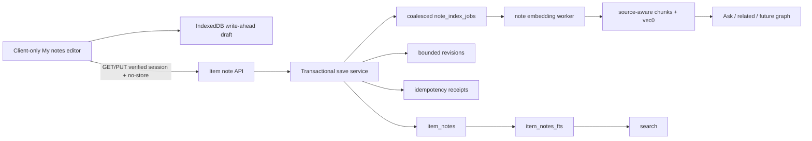

# Technical Implementation Plan v1 — Manual Content Notes

**Date:** 2026-07-10
**Status:** v1 for QA and adversarial review
**Architecture decision:** Separate attached note document, canonical Markdown, versioned/idempotent persistence, client write-ahead recovery, immediate FTS, asynchronous source-aware semantic indexing.

## 1. Recommended architecture

- The item page server-renders only a note shell. A client component fetches content through an HMAC-verified, `no-store` API so the service worker cannot retain private note text in cached page HTML.
- The editor writes to IndexedDB before network autosave. One save per item/tab is in flight; later input coalesces.
- The server normalizes Markdown, enforces limits, compares `baseVersion`, deduplicates `mutationId`, updates the canonical row, checkpoints/prunes revisions, maintains FTS, and advances one target indexing job in a short transaction.
- The worker embeds only the latest quiet version outside the write transaction, then atomically replaces only `manual_note` chunks/vectors if the version/include flag is still current.
- Original and manual-note chunks share retrieval infrastructure but preserve `source_kind`; the parent item remains the graph/related entity.

## 2. Data model and migrations

After integrating the deployed migration history through `020_recall_sync`:

- `021_item_notes.sql`
  - `item_notes(item_id PK/FK, content_md, content_text, content_hash, version, include_in_ai, indexed_version, last_saved_kind, created_at, updated_at)`.
  - `item_note_revisions` checkpoint snapshots.
  - `item_note_mutations` idempotency receipts.
  - `note_index_jobs` coalescing queue.
  - `item_notes_fts` plus insert/update/delete triggers over `content_text`.
- `022_chunks_source_kind.sql`
  - Rebuild `chunks` with `source_kind` and `source_version`.
  - Change uniqueness to `(item_id, source_kind, idx)`.
  - Preserve old chunk IDs and every valid chunk-to-rowid-to-vector mapping.

Before 022 or the first new vector allocation, enumerate `chunks_vec.rowid EXCEPT chunks_rowid.rowid`, classify the live 44 rows, back up the DB, and apply only an approved manifest. Never treat vec0 as cascade-managed: a shared helper must read bridge rowids, delete corresponding vectors, then delete chunks and assert source absence.

Canonical Markdown is normalized to LF/NFC, stripped of NUL/disallowed controls, byte-limited, parsed to plain text without link destinations/formatting tokens, and hashed with SHA-256. V1 forbids raw HTML, images/uploads, tables, math, embeds, arbitrary CSS/components, and executable previews.

## 3. API/storage contracts

### `GET /api/items/:id/note`

- HMAC-verified session; `Cache-Control: private, no-store`.
- `200 {note}` with Markdown, version/hash, inclusion/index state/timestamps; `{note:null}` for a valid item without a row; 404 unknown item; 401 invalid session.
- Optional ETag for online reconciliation without making the response cacheable.

### `PUT /api/items/:id/note`

- Verified session and exact allowed Origin.
- Zod body: Markdown, nullable base version, UUID mutation/client IDs, `auto|manual|restore`, include flag.
- 201 first row / 200 update or idempotent replay; 409 returns the current server note; 413 oversized; 422 invalid/reused key; never echo content in errors/logs.
- Atomic compare-and-swap and receipt insertion. Equal hash is a no-op/replay-safe acknowledgement rather than an unnecessary new version.

### Delete/revisions

- Version-matched/idempotent delete; confirmed UI; canonical and all derived artifacts purged, plus a short content-free delete receipt.
- Revision list returns metadata and one requested body, not every body by default. Restore creates a new current version.

### IndexedDB/autosave

- Store latest draft per item: Markdown, base version, stable mutation, hash, dirty state, timestamp.
- Local write target ≤250 ms. Server debounce 750 ms; continuous-input max wait 5 s.
- Only one network save in flight. Manual Save cancels debounce and flushes.
- Pagehide/visibility/navigation may use keepalive, but local acknowledgement is the truthful durability guarantee.
- Replay keeps the original base version; 409 halts for explicit merge. BroadcastChannel improves sibling-tab UX but database CAS is authoritative.

## 4. Search, AI, related items, and graph contract

- Add `searchUnifiedDetailed()` that fuses existing item FTS, note FTS, and semantic ranks with RRF and de-duplicates parent items; retain current `searchUnified()` projection for compatibility.
- API/UI adds matched sources and safe note snippet while retaining existing `items` response until consumers migrate.
- Extend chunks/retrieval/citation types with `source_kind` and `source_version`.
- Ask prompt calls note text “your manual note,” not source evidence. Citation chips label it and target the note section.
- A per-note AI toggle off queues semantic artifact removal without deleting FTS/canonical note and prevents provider calls.
- Related item scoring computes bounded source signals (initial evaluation candidate 70% original / 30% manual note); exact weight is configuration/evaluation, not a hard-coded truth.
- On successful current-version indexing/clear, emit a future graph refresh hook. The shipped product has Related, not a persisted edge graph; graph failure cannot fail note save/index completion.

## 5. Editor and rendering dependencies

V1 dependency candidate: Lexical React/Markdown/list/link/code packages for contenteditable behavior plus `react-markdown`, `remark-gfm`, and `rehype-sanitize` for read/preview. The compatibility spike must prove React 19.2, Next 16.2, SSR-disabled lazy loading, Markdown fixtures, IME/composition, screen readers, clipboard conversion, Android WebView, undo/history, and bundle budget.

Adversarial alternative: a controlled Markdown textarea with selection-aware toolbar and safe preview. Prefer it if Lexical introduces hidden editor state, lossy round trips, unstable mobile selection, excessive bundle cost, or disproportionate implementation risk. Markdown remains the only source of truth in either case.

Render with React elements, no `rehype-raw`/`dangerouslySetInnerHTML`, a fixed sanitization schema, and URL allowlist (`http`, `https`, optional `mailto`). External new-window links get `noopener noreferrer`.

## 6. Security and privacy

- Add a shared `requireVerifiedSession()` that calls existing HMAC verification; do not copy route-level cookie-presence checks.
- For cookie-authenticated PUT/DELETE/restore, require an allowed Origin; do not reuse permissive bearer/extension capture origin policy.
- Prepared SQL, bounded JSON/body/Markdown/URL/nesting sizes, predictable error codes, and rate limits high enough for autosave.
- Note content never enters URLs, server component payloads, structured logs, metrics, errors, share surfaces, or default exports.
- IndexedDB and the local/server SQLite snapshots are not application-encrypted. Off-site backups are GPG encrypted. When enabled, configured embedding/Ask providers receive selected note text. Product copy and docs disclose this accurately.
- `include_in_ai=false` is enforced at worker claim and pre-commit re-read, not only in the UI.
- No content mutation or embedding occurs during migration/startup; production smoke uses synthetic content only.

## 7. Likely files/modules affected

### New

- `src/db/migrations/021_item_notes.sql`
- `src/db/migrations/022_chunks_source_kind.sql`
- `src/db/item-notes.ts`
- `src/lib/notes/{markdown,save-item-note,note-index,local-drafts,autosave-controller}.ts`
- `src/lib/queue/note-index-worker.ts`
- `src/app/api/items/[id]/note/route.ts`
- `src/app/api/items/[id]/note/revisions/...`
- `src/components/manual-note/{manual-note-section,markdown-note-editor,note-toolbar,note-status,conflict-dialog}.tsx`
- Unit/API/component/integration tests and deployment/audit/smoke scripts.

### Modified

- Production item detail responsive layout and mobile tab model.
- `src/db/chunks.ts`, item deletion, embedding pipeline, worker coordinator.
- Unified search/API/UI types and result presentation.
- Retrieval, Ask generator/stream/citations, Related scoring.
- Markdown styles/tokens, CSP/security headers as needed, service-worker cache assertions.
- Export/share/backup documentation, provider/settings diagnostics.
- `scripts/deploy.sh`, health/smoke checks, environment examples, wiki and running log.

Exact paths will follow the integrated production source rather than stale `origin/main` layout.

## 8. Test plan

### Unit/repository

- Normalization, Unicode/CRLF, plain-text projection, byte/depth/URL limits, safe schemes, meaningful blank, Markdown round-trip.
- First/update/no-op/clear/delete/restore; CAS conflicts; same/different idempotency key; checkpoint/pruning.
- Note FTS special characters and triggers.
- Source-specific chunk replacement/deletion, rowid preservation, include-off cleanup, stale target, provider retry.
- IndexedDB recovery/quota, fake-timer debounce/max-wait, one-in-flight/coalescing, manual flush, stale response.

### API/security

- Valid/forged/expired/missing session; allowed/denied/missing mutation Origin.
- Invalid/oversized bodies; create/update/replay/conflict/delete/restore; no-store headers; no raw content in logs.

### Integration

- Note-only FTS result/provenance, RRF de-duplication, retrieval/Ask citation type, inclusion opt-out, related weighting/no duplicate node.
- Saving works with AI provider down; newer note wins over stale index job.
- Item/note delete produces exact canonical/FTS/job/revision/chunk/bridge/vector/local cleanup manifest.

### UX/browser/accessibility

- Desktop and mobile/Capacitor toolbar/shortcuts/paste/IME/undo/keyboard/focus/live status.
- Blank/loading/saving/saved/offline/failure/retry/conflict/restore/delete/index states.
- Refresh/back/route/tab-close recovery and two-tab/two-device conflicts.
- No note content in server HTML/RSC/page cache; existing mobile tabs/features retained.

### Migration/production copy

- Fresh DB and latest production snapshot copy through migrations 021/022.
- Pre/post item/chunk/bridge/mapped-vector counts, rowid map, retrieval parity, FTS triggers, `integrity_check`, `foreign_key_check`.
- Orphan-vector report and approved repair manifest.
- Artifact contains migrations 001–022 and every Recall scheduler/runtime file; rsync dry-run removals reviewed.

## 9. Rollout and rollback

1. Reconcile the live source line, migration history, and artifact inventory; merge it into the feature branch without discarding main history.
2. Build schema/repository/API/plain editor behind `MANUAL_CONTENT_NOTES_ENABLED=0`; keep AI indexing separately disabled.
3. Pass no-loss/security/migration-copy tests and take a production backup.
4. Deploy code with UI and worker disabled; verify migrations, integrity, Recall runtime, and health.
5. Enable UI/FTS for a synthetic controlled item; run formatting, cache, search, conflict, delete, and cleanup smoke.
6. Enable semantic worker only after vector audit/repair; verify provenance, latest-version indexing, opt-out, related signal, backlog, cleanup.
7. Enable for real use after all gates pass and one backup cycle is verified.

Rollback order: disable semantic worker, disable UI, retain canonical rows; fall back to plain Markdown editor if rich dependency fails; delete only `manual_note` semantic artifacts if semantic integration fails; roll application back only to the integrated pre-feature production source. Do not down-migrate. Restore the pre-deploy snapshot only for migration/data corruption and disclose loss of post-snapshot writes.

## 10. Implementation milestones

| Milestone | Deliverable | Exit gate |
|---|---|---|
| T0 | Deployed-source, vector, dependency, auth gates | No unresolved P0; approved repair/dependency direction |
| T1 | 021/022 + repositories | Snapshot-copy integrity/mapping parity |
| T2 | Verified API + version/idempotency + local drafts/autosave | No-loss/race/security suite passes |
| T3 | Responsive editor/preview/states | Markdown, mobile, a11y, cache/privacy pass |
| T4 | Exact search | Immediate note-only result with provenance and compatibility |
| T5 | Semantic/Ask/Related/future graph hook | Latest-version, opt-out, weighting, citation, cleanup pass |
| T6 | Export/delete/ops/docs | Privacy defaults, manifest, backlog/rollback runbook pass |
| T7 | Controlled production release | Backup, synthetic smoke/cleanup, health, Recall preservation pass |

## 11. Risks and blockers

- P0 stale-main deployment deletes/regresses production Recall behavior.
- P0 44 vec0 rows with zero chunks can collide with first new bridge allocation.
- P0 current route patterns may accept a forged cookie unless real HMAC verification is mandatory.
- P0 save races/offline replay can silently overwrite text without serialization, CAS, and idempotency.
- P1 chunk-table rebuild can detach valid vectors if rowids are not preserved and proven on a snapshot copy.
- P1 note text can leak via cached server output, logs, shares, exports, revisions/backups, or remote providers.
- P1 a rich contenteditable dependency can lose Markdown semantics or regress mobile IME/selection.
- P1 continuous autosave can create provider cost/backlog without a quiet, coalescing latest-version worker.
- P1 long notes can dominate Related/future graph semantics without per-source weighting/evaluation.
- P2 existing item deletion leaks vec0 rows unless the adjacent cleanup defect is fixed.

Production remains NO-GO until each P0 is closed with recorded evidence.
