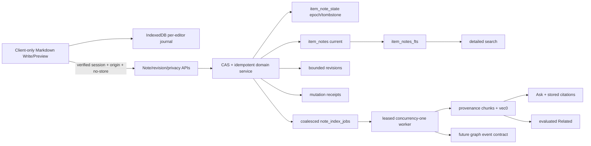

# Technical Implementation Plan v2 — Manual Content Notes

**Date:** 2026-07-10
**Status:** Final implementation contract
**Supersedes:** `TECH_F08_MANUAL_CONTENT_NOTES_v1.md`
**Baseline:** merge attested consolidated production snapshot `8178117c80923e5724e355fb2684cbc836013d39` into the main-derived feature branch before feature code.
**Release posture:** UI, writes, and worker default off; schema preflight and vector repair are independent hard gates.

## 1. Architecture decision



Core invariants:

1. `items.body/title` and AI fields are immutable from manual-note saves.
2. Canonical save/FTS never calls an AI provider.
3. A local editor instance cannot overwrite another instance's dirty recovery data.
4. Every server mutation is causally bound to the current item-scoped note epoch/generation and one payload-specific mutation ID.
5. Delete and AI opt-out take effect synchronously in reads/provider eligibility; async jobs only clean derived artifacts.
6. Semantic sources are honestly labeled; legacy mixed item chunks are never called Original.
7. vec0 rows are explicitly deleted before relational chunks; rowid allocation cannot ignore vec0.
8. Any response that can contain note text/derived snippets/answers is authenticated, dynamic, and private/no-store.

## 2. Production baseline integration

`8178117` is the consolidated content snapshot attested by live distinguishing public-file hashes plus migrations 018/019/020. It was recorded after the live service start, so it is a content baseline rather than a claim about the exact checkout used during the June 26 deploy.

Before code:

1. commit council/v1/v2/review/log artifacts;
2. merge `8178117` without squashing or discarding current `main` history;
3. preserve migration files 018/019/020, Recall service/timer/scripts, transcript-policy/segment features, AI Memory item UI, and main's later capture/security improvements;
4. `npm ci`; typecheck; lint; full tests; audit; production build; Recall/privacy/deploy preflights;
5. capture integrated baseline report and complete live artifact/service/timer/migration-hash inventory.

Any unresolved merge behavior, failed baseline test, or unexplained `rsync --delete` removal blocks feature implementation/release as applicable.

## 3. Migration 021 integration hardening, then Migration 022 canonical notes

The integrated baseline exposed a real sibling-branch ordering defect: `020_recall_sync` rebuilds `items` after `017_transcript_recovery`, dropping its weak-YouTube enqueue trigger. `021_restore_transcript_recovery_trigger.sql` recreates/backfills that trigger and has a regression test. It is deliberately isolated from F08 schema so production/main behavior is repaired before note tables are introduced.

`022_item_notes.sql` then adds the canonical note model below.

Exact SQL follows repository conventions, but the required schema is:

```sql
CREATE TABLE item_note_state (
  item_id           TEXT PRIMARY KEY REFERENCES items(id) ON DELETE CASCADE,
  epoch             INTEGER NOT NULL CHECK (epoch >= 1),
  generation        INTEGER NOT NULL CHECK (generation >= 0),
  is_deleted        INTEGER NOT NULL DEFAULT 0 CHECK (is_deleted IN (0,1)),
  updated_at        INTEGER NOT NULL
);

CREATE TABLE item_notes (
  item_id           TEXT PRIMARY KEY REFERENCES items(id) ON DELETE CASCADE,
  epoch             INTEGER NOT NULL,
  generation        INTEGER NOT NULL,
  content_md        TEXT NOT NULL DEFAULT '',
  content_text      TEXT NOT NULL DEFAULT '',
  content_hash      TEXT NOT NULL,
  include_in_ai     INTEGER NOT NULL DEFAULT 0 CHECK (include_in_ai IN (0,1)),
  indexed_generation INTEGER NOT NULL DEFAULT 0,
  last_saved_kind   TEXT NOT NULL CHECK (last_saved_kind IN ('auto','manual','restore','recreate')),
  created_at        INTEGER NOT NULL,
  updated_at        INTEGER NOT NULL,
  FOREIGN KEY (item_id) REFERENCES item_note_state(item_id) ON DELETE CASCADE,
  UNIQUE (item_id, epoch, generation)
);

CREATE TABLE item_note_revisions (
  id                TEXT PRIMARY KEY,
  item_id           TEXT NOT NULL REFERENCES items(id) ON DELETE CASCADE,
  epoch             INTEGER NOT NULL,
  source_generation INTEGER NOT NULL,
  content_md        TEXT NOT NULL,
  content_text      TEXT NOT NULL,
  content_hash      TEXT NOT NULL,
  save_kind         TEXT NOT NULL CHECK (save_kind IN ('manual','timed','pre_clear','conflict','restore')),
  created_at        INTEGER NOT NULL,
  UNIQUE (item_id, epoch, source_generation, save_kind)
);

CREATE TABLE item_note_mutations (
  mutation_id       TEXT PRIMARY KEY,
  item_id           TEXT NOT NULL REFERENCES items(id) ON DELETE CASCADE,
  editor_instance_id TEXT NOT NULL,
  epoch             INTEGER NOT NULL,
  operation         TEXT NOT NULL CHECK (operation IN ('save','clear','delete','recreate','restore','ai_policy')),
  request_hash      TEXT NOT NULL,
  accepted_generation INTEGER NOT NULL,
  created_at        INTEGER NOT NULL
);

CREATE TABLE note_index_jobs (
  item_id           TEXT PRIMARY KEY REFERENCES items(id) ON DELETE CASCADE,
  target_epoch      INTEGER NOT NULL,
  target_generation INTEGER NOT NULL,
  desired_action    TEXT NOT NULL CHECK (desired_action IN ('index','purge')),
  state             TEXT NOT NULL CHECK (state IN ('pending','running','done','error')),
  attempts          INTEGER NOT NULL DEFAULT 0,
  claimed_by        TEXT,
  lease_expires_at  INTEGER,
  last_error_code   TEXT,
  created_at        INTEGER NOT NULL,
  updated_at        INTEGER NOT NULL,
  completed_at      INTEGER
);

CREATE TABLE note_ai_provider_consents (
  provider_fingerprint TEXT PRIMARY KEY,
  provider_label       TEXT NOT NULL,
  provider_scope       TEXT NOT NULL,
  approved_at          INTEGER,
  revoked_at           INTEGER
);

CREATE VIRTUAL TABLE item_notes_fts USING fts5(
  item_id UNINDEXED,
  body,
  tokenize = 'porter unicode61 remove_diacritics 2'
);
```

Add note FTS insert/update/delete triggers over `content_text`. Byte limit (100 KiB) is enforced in the API/domain layer because SQLite `length()` counts characters, not UTF-8 bytes.

### Epoch/generation semantics

- First explicit/meaningful create makes `state(epoch=1,generation=1,is_deleted=0)` and current note.
- Every accepted content, clear, restore, or AI-policy change increments `generation` even when Markdown hash is unchanged.
- Delete transaction increments generation, sets state deleted, deletes current content/revisions/semantic citations/turns as defined below, and queues/executes derived purge. The content-free state remains until the parent item is deleted—there is no seven-day causal expiry.
- Explicit Recreate requires current tombstone epoch/generation, increments `epoch`, resets generation to 1, and is a deliberate user action. Any pre-delete/null-base draft conflicts and becomes copy-only.
- A normal save never modifies `include_in_ai`; privacy uses a separate versioned API. Resolving a content conflict reloads current policy and cannot re-enable AI.

### Revision truthfulness

- Server revisions contain acknowledged server states only.
- The losing local conflict draft stays in its per-editor journal until Copy/Save/Discard; UI never claims it is in server revision history.
- Before accepting `Use saved version`, retain the local conflict record until the user explicitly discards or its declared 30-day local retention expires; Copy is always available.
- Minimal recent versions exposes manual, timed (≥5 min), pre-clear, conflict-server checkpoint, and restore checkpoints. Keep newest 25 and ≤30 days. Delete purges revisions; backups remain subject to backup retention copy.

## 4. Migration 023 — honest source-aware chunks

Rebuild `chunks` with:

```sql
source_kind TEXT NOT NULL DEFAULT 'legacy_item_context'
  CHECK (source_kind IN ('legacy_item_context','original_content','ai_summary','manual_note')),
source_version INTEGER NOT NULL DEFAULT 0,
UNIQUE (item_id, source_kind, idx)
```

- Copy existing chunks and exact bridge rowids as `legacy_item_context`; their bodies may combine title, summary, and original and must be labeled `Saved item context`.
- New/reindexed original chunks use title+body and `original_content`.
- AI summary is independently chunked as `ai_summary` only when intentionally indexed.
- Manual note uses title+derived note text and `manual_note` at the current epoch/generation encoded in source version or companion fields.
- Do not force a whole-library reindex in the schema migration. Existing legacy chunks stay honest and usable; reindex is a separate queued operation.

### Vec0 audit and safe allocator

Before worker enablement, implement a report-only command on a WAL-safe snapshot:

- sets for `chunks.id`, `chunks_rowid(chunk_id,rowid)`, `chunks_vec.rowid`;
- mapped, bridge-without-chunk, vec-without-bridge, chunk-without-bridge, duplicate/inconsistent classifications;
- rowid-level manifest and retrieval reachability;
- integrity/FK/count/hash report.

After backup and snapshot rehearsal, repair only approved manifest rows. Replace `MAX(bridge)+1` with a durable allocator or `max(MAX(chunks_rowid.rowid), MAX(chunks_vec.rowid))+1` under the single writer transaction. The durable sequence is preferred so deleted high rowids are never reused. First-allocation and dual-claim tests are mandatory.

`deleteChunksAndVectors(itemId, sourceKind?)` reads bridge rowids, deletes vec0 rows, deletes chunks/bridge, and asserts zero remaining. Use for note replacement, opt-out, delete, item delete, and rollback cleanup.

## 5. Canonical Markdown and editor

Use a native controlled `<textarea>` with selection-aware toolbar and Preview rendered by pinned `react-markdown` + `remark-gfm`; use no raw HTML plugin. Apply a strict URL transform (`http`, `https`, optional `mailto`), safe external link attributes, and defensive sanitize schema if any rehype path is introduced.

Supported subset: paragraphs/line breaks, bold, italic, strikethrough, H2–H4, ordered/unordered/task lists, quote, inline/fenced code, links, horizontal rule. Tables/images/math/raw HTML/embeds are excluded, so call this a defined Markdown/GFM subset rather than all GFM.

`normalizeMarkdown()`:

1. CRLF/CR→LF, Unicode NFC;
2. remove NUL/disallowed controls but keep tab/newline;
3. enforce ≤102,400 UTF-8 bytes, URL ≤2,048 bytes, bounded nesting/line length;
4. derive plain text through a Markdown AST without formatting tokens/link destinations/raw HTML;
5. SHA-256 normalized Markdown;
6. meaningful content = non-whitespace derived text; explicit empty Save is allowed but no FTS/chunk.

Toolbar uses textarea selection APIs and golden fixtures. Native IME/composition/undo is not intercepted. Preview does not mutate or save.

## 6. Client local journal and save-generation state machine

IndexedDB `brain-manual-notes-v2`:

```ts
type LocalEditorJournal = {
  key: [itemId: string, editorInstanceId: string];
  localSequence: number;
  epoch: number | null;
  baseGeneration: number | null;
  contentMarkdown: string;
  contentHash: string;
  mutationId: string;
  state: 'dirty' | 'in_flight' | 'conflict' | 'copy_only' | 'acknowledged';
  updatedAt: number;
  acknowledgedHash?: string;
};
```

- `editorInstanceId` is random per opened editor lifetime and persisted with that journal record. Never key only by item.
- Serialize IndexedDB transactions per editor. A write carries increasing `localSequence`; an older completion cannot overwrite newer state.
- Local-ack target p95 ≤50 ms in the test profile; any edit must finish a journal transaction before starting network save. Status warns if not complete within 250 ms.
- Keep every dirty/conflict/copy-only instance until acknowledged or explicitly discarded; opening one does not delete another.
- On logout/session reset, preserve drafts but require unlock before content display. On server tombstone/item deletion, drafts become copy-only; other offline devices are `pending_offline_clients`, not falsely claimed purged.

### Payload-specific mutation envelope

Each queued generation atomically contains `{epoch, baseGeneration, contentMarkdown, contentHash, mutationId, editorInstanceId, localSequence, saveKind}`.

- Exact retry of an unchanged envelope reuses mutation ID.
- Any payload change **after an envelope is created/sent** creates a new next envelope with a new UUID. It never mutates an in-flight envelope.
- Only acknowledgement matching mutation ID/hash/epoch/accepted generation can mark that envelope acknowledged.
- Edit during flight creates/coalesces a next envelope; it does not overlap the request.
- Manual Save cancels debounce and promotes the newest current content into the next envelope. If a request is in flight it queues immediately behind it; no overlap and no mutation-ID reuse.
- Autosave: 750 ms idle, five-second maximum continuous typing. Exponential retry with jitter pauses on 409/401/403/413/422.
- `BroadcastChannel` announces accepted generations, policy/delete tombstones, and dirty-instance presence; it is advisory only.

## 7. APIs and authorization

All routes call production's HMAC session verifier, enforce exact same-origin for cookie mutations, use Zod/prepared SQL/body limits, and return `Cache-Control: private, no-store, max-age=0` plus suitable `Vary`. No programmatic bearer write in v1.

- `GET /api/items/:id/note` → current note/state/provider eligibility; 404 item; note null with tombstone metadata where authorized.
- `PUT /api/items/:id/note` → save envelope; 201 create/recreate only when explicit, 200 update/replay; 409 current state/content; 413 bytes; 422 mutation mismatch.
- `PATCH /api/items/:id/note/ai-policy` → `{baseGeneration, mutationId, includeInAi}`; always increments generation. If enabling remote provider without current fingerprint consent, return `409 NOTE_AI_CONSENT_REQUIRED` with safe provider labels, no text transmission.
- `DELETE /api/items/:id/note` → base epoch/generation + mutation; tombstone persists; 204 replay-safe.
- `GET /api/items/:id/note/revisions` → metadata by default, one body on explicit request.
- `POST .../revisions/:id/restore` → new generation, never rewinds.
- `POST /api/settings/note-ai-consent` → explicit provider fingerprint approval/revocation, no note text.
- `GET /api/items/:id/note/export.md` or existing export option → explicit authenticated note export; default item/library routes use `include_notes=false`.

Unknown/deleted/tombstoned bases return structured conflicts. Conflict bodies are also no-store and never logged.

## 8. Immediate AI opt-out and provider policy

Async vector deletion is not the privacy boundary.

- Every semantic retrieval SQL path that can return `manual_note` joins current `item_note_state` and `item_notes` and requires matching epoch/generation plus `include_in_ai=1`.
- Ask repeats this eligibility before constructing/sending a prompt.
- Related/manual source loading repeats eligibility.
- Worker checks UI/write/worker flags, current provider consent, inclusion, epoch/generation before provider call and again before commit.
- Disabling increments generation transactionally and marks job `purge`; from commit onward old manual chunks are unreadable even before deletion.
- Revoking provider consent globally blocks remote calls synchronously and queues affected note purges/reindex decisions.
- Provider fingerprint includes provider type/model/endpoint class without secret material; configuration change requires new acknowledgement.

If all note-consuming providers are verified local, new notes may default include-on. If any is remote, default off until acknowledgement. Exact FTS is unaffected.

## 9. Search, Ask, stored citations, Related, graph boundary

### Search

`searchUnifiedDetailed()` runs item FTS, note FTS, semantic retrieval, and RRF. It returns parent once with `matchedSources`, deterministic score, and escaped plain-text note snippet bounded by characters/graphemes. Keep current `items` projection for compatibility. Search route is verified session, dynamic, private/no-store.

Accepted FTS writes are deterministically 100% visible within the save transaction. Local dirty text is not searched globally.

### Ask/citations

`RetrievedChunk` and streamed/persisted Citation gain `source_kind`, `source_version`, `item_id`, and chunk ID. Labels:

- `original_content` → Original source;
- `ai_summary` → AI digest;
- `manual_note` → Your note;
- `legacy_item_context` → Saved item context.

Do not store a duplicate note excerpt in the citation record. If a cited chunk/version later disappears, persisted chat shows the answer and a truthful `Your note (version no longer available)` chip; it never falls back to Original. Because generated answers can paraphrase private note text, note Delete must identify and purge/redact the item-scoped chat turns whose retrieval citations included `manual_note`; confirmation copy and cleanup manifest state this. Clear/re-edit retains historical chat but unavailable citation degrades truthfully unless product validation chooses stronger purge.

Ask streaming/response is private/no-store and never logs prompts/note text.

### Related and graph

Compute per-source centroids, normalize each, and combine with configurable capped weights rather than chunk-count averages. Initial candidate original 0.7/manual 0.3 is not accepted until a labeled fixture passes:

- note relevance can improve expected top-k;
- adversarial long/duplicated note cannot erase source baseline beyond threshold;
- opt-out/delete removes influence immediately;
- no duplicate item/node.

Emit idempotent `item_semantics_changed(itemId, sourceKind, generation, action)` after current index/clear/delete. Contract spy/failure tests ship now. It is not a claim that a persisted graph exists.

## 10. Worker lifecycle

- Run through the integrated production background-worker coordinator/instrumentation with a stable process ID and database lease; do not create an unsupervised timer in a route.
- Concurrency one for vector writes. Claim uses atomic pending/error→running with lease expiry. Duplicate claim returns none.
- Lease heartbeat during provider work; stale lease becomes pending after bounded timeout.
- Quiet period ≥5 s since latest note update; one row per item always points to newest target.
- On shutdown/deploy stop claiming, finish/cancel safely, and never commit after flag/version/policy mismatch.
- Retry provider failures with bounded backoff; diagnostics expose pending/error count and oldest age without text.
- `MANUAL_NOTES_WORKER_ENABLED=0` is checked before claim, provider call, and commit.

## 11. Flags, migration, rollout, rollback

Flags:

- `MANUAL_NOTES_UI_ENABLED=0`: no surface/read exposure.
- `MANUAL_NOTES_WRITE_ENABLED=0`: CRUD/revision/policy/export mutations rejected except operator smoke scope.
- `MANUAL_NOTES_WORKER_ENABLED=0`: no semantic claims/calls/commits.

Migrations still auto-apply at app startup. Therefore deploy runs a separate mandatory pre-start gate: backup; snapshot-copy 021/022 rehearsal; vector classification; artifact inventory; integrated tests. Flags are not migration protection.

Rollout:

1. integrated baseline green;
2. migrations 021/022/023, repositories, APIs, editor, and search tests on disposable DB;
3. latest production snapshot copy migration 021/022/023 + audit/repair rehearsal;
4. backup live DB; deploy flags off; startup migrations; integrity/Recall/health;
5. controlled synthetic UI/write + exact search; conflict/recovery/delete/export/cache cleanup;
6. approved live vec repair/reservation if required; enable worker only for synthetic item; Ask/Related/opt-out/cleanup;
7. one backup cycle and no backlog/errors; enable real use.

Rollback: worker off, UI/write off, retain canonical rows; purge only manual-note vectors before prolonged old-app rollback because old retrieval lacks eligibility/provenance; rollback only to integrated pre-feature source; never down-migrate. Restore snapshot only for corruption and disclose post-snapshot write loss.

## 12. Files/modules

Final paths follow the integrated tree. Expected additions/modifications:

- migration 021 trigger restoration plus F08 migrations 022/023 and snapshot/fresh tests;
- `src/db/item-notes.ts`, source-aware `chunks.ts`, explicit vector cleanup, item/chat deletion;
- `src/lib/notes/{markdown,save,local-journal,autosave,note-index,provider-policy}.ts`;
- note worker integrated into queue coordinator;
- item note/revision/privacy/export routes and shared auth/origin/no-store response helpers;
- manual note section, textarea editor, toolbar, Preview, status, conflict/multi-draft/revision/provider/delete dialogs;
- production item detail/mobile tabs/search result/Ask citation/Related components;
- search/retrieve/embed/Ask/chat citation/Related source-kind contracts;
- audit/repair/migration-preflight/synthetic-smoke/cleanup scripts;
- deploy artifact checks, environment docs, settings/diagnostics, wiki/running log.

## 13. Test and executable oracle matrix

All QA tests `MIG-01..PROD-01` are required. Additional fixed oracles:

- Markdown golden file covers every supported construct, multiline selection, nested lists, composition/paste, multibyte 90/100 KiB, dangerous HTML/protocols.
- Two-tab forced crash proves both dirty records remain; IndexedDB delayed transaction cannot regress sequence.
- Mutation envelope tests cover edit/manual Save during flight, retry/reload/late response and exact ID reuse/new ID creation.
- Delete tests cover delayed null-base create/update, tombstone across restart/offline, explicit recreate new epoch, provider/job race.
- Opt-out test keeps old chunks and in-flight job present, commits policy, then proves zero retrieval/Ask/Related/provider calls immediately and eventual purge.
- Citation test persists chat, reloads, edits/clears/deletes note, checks truthful degradation and delete chat cleanup.
- Cache matrix inspects note/revision/conflict/search/Ask/Related/export HTTP and browser Cache Storage after delete/logout.
- Mobile regression inventory: Original, Digest, Ask, Related, Details, Notes, all item actions, bottom nav, 320/390/600 widths, keyboard/safe areas/44 px/status.
- Performance protocol records environment/sample size: local journal p95 ≤50 ms; warning >250 ms; save p95 targets; FTS same-transaction; semantic p95 <30 s healthy; bundle delta budget recorded before release.
- Related labeled fixture publishes expected top-k/no-regression thresholds before enabling influence.

## 14. Owners and gates

| Area | DRI for this autonomous goal | Approval evidence |
|---|---|---|
| Product/privacy defaults | Arun as product owner, executed from explicit objective; Codex coordinator records decisions | PRD v2 + decision log |
| Engineering/data/security | Codex coordinator/integration owner | tests, audit, review evidence |
| UX/accessibility | UX council + Codex implementation owner | implementation design QA |
| QA | independent QA agent + Codex gate runner | QA matrix results |
| Release/operations | Codex release owner | inventory, backup, deploy, smoke, cleanup, rollback |

Gates: v2 spec; integrated baseline; migration/vector; security/privacy; no-loss; editor/mobile/a11y; search/AI/Related; operational; synthetic production. A failed P0/P1 acceptance test blocks real-note enablement.

## 15. Final blockers/no-go

- Do not implement against stale main or `4d97c45`; merge `8178117` first.
- Do not enable worker with any unclassified vector/bridge row.
- Do not ship item-key-only local drafts, ambiguous provenance, asynchronous-only opt-out, expiring delete causality, remote calls before consent, or note text in cached/logged/default-exported output.
- Do not call prototype QA production QA.
- Do not claim graph functionality beyond evaluated Related and the event contract.

With those invariants and tests, the architecture is GO for implementation behind disabled flags and conditionally GO for the staged release sequence.
