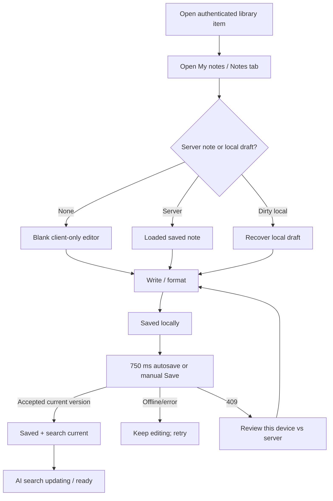

# UX/UI Design Package v1 — Manual Content Notes

**Date:** 2026-07-10
**Status:** v1 for QA and adversarial review
**Visual baseline:** deployed UI source line represented by commit `4d97c45`; supplied Recall editor screenshot as interaction inspiration; AI Memory production tokens, logo, typography, shell, item detail, mobile tabs, and bottom navigation as implementation truth.

## 1. UX direction

The experience is **read beside write**. Original content remains the reading anchor, AI Digest remains visibly generated, and My notes is a private user-authored companion. It behaves like a durable layer on the current item—not a second card, an AI-generated block, or a separate notebook destination.

The visual goal is calm and trustworthy: production dark surfaces and green action/selected tokens, clear source labels, a stable editor canvas, and save state copy that never overclaims durability. The production interface is extended rather than redesigned.

## 2. User flow

Opening or closing a blank editor creates no server note, library card, search hit, revision, embedding, or graph node. A meaningful edit becomes locally durable first. Manual Save and `Cmd/Ctrl+S` flush immediately; autosave is a background convenience layered on the same contract.

## 3. Information architecture and key screens

### Desktop item detail

- Preserve the production authenticated AI Memory shell and two-column item detail.
- Original content remains in the main reading column at the current article measure.
- The right companion surface exposes `AI digest` and `My notes` as peer tabs/sections with explicit authorship.
- My notes header contains `Private manual note`, save state, AI-index state when relevant, manual Save, and an overflow menu for privacy/revisions/export/delete.
- Toolbar remains stable above an independently scrolling editor canvas. The item itself—not the note—owns breadcrumbs/navigation.

### Mobile / Capacitor item detail

- Preserve `Original / Digest / Ask / Related / Details` and add `Notes` as the sixth item tab. The strip scrolls/overflows safely and remembers the selected tab in the existing query model.
- Preserve the production bottom navigation and item context.
- Notes use a single-column editor. Save stays visible above the software keyboard/safe area.
- Primary formatting actions remain one tap away; secondary actions move into an accessible overflow sheet before targets shrink below 44×44 px.

### Conflict review

- Inline alert: another version exists; syncing pauses but the local draft remains safe.
- Dialog on desktop / bottom sheet on mobile compares `This device` and `Saved version` with timestamps and plain-language authorship.
- Actions: `Keep saved version`, `Keep mine` with confirmation against the new base version, and `Copy both` into a merge draft. No automatic last-write-wins.
- Focus enters the heading, is trapped, and returns to Review on close.

### Revision and privacy actions

- Overflow exposes `Include in AI & connections`, revision recovery, export Markdown, clear note, and delete note.
- Turning AI inclusion off explains: exact search still works; AI answers/connections stop using the note after removal completes.
- Default export/share does not include note text. Explicit inclusion shows a preview/privacy warning.

## 4. Editor interaction

### Modes and supported formatting

- `Write` is the default visual editing mode; `Markdown` exposes the canonical source; `Preview` may be combined with Write/read mode if implementation clarity is better. Switching modes preserves all supported syntax.
- P0: paragraphs, H2/H3/H4, bold, italic, strikethrough, ordered/unordered/task lists, blockquote, inline code, fenced code, link, horizontal rule, undo, redo.
- Toolbar affects selection; collapsed-cursor marks apply to subsequent typing; block actions transform the current block.
- Shortcuts: Save, bold, italic, link, ordered/bulleted list, undo/redo. Block-start Markdown shortcuts convert after Space and undo back to literal text.
- Paste becomes supported semantic text/Markdown; executable markup, event handlers, unsupported protocols, and remote embeds never survive.
- Source mode is Markdown, never HTML or opaque editor JSON.

### Save behavior

- Every edit first writes a local draft. Status says `Saved locally`/`Unsaved`, not `Saved`, until the server acknowledges the latest version.
- Autosave begins after 750 ms idle, with a five-second maximum during continuous typing; one request is in flight.
- Manual Save remains enabled when a newer local version exists, cancels the timer, and flushes immediately.
- `Saved just now`/timestamp appears only for the acknowledged current version. Older responses are ignored.
- `Saved` and `AI search ready` are separate concepts. Provider/index failure never makes a persisted note look unsaved.

## 5. State specification

| State | Visual/copy contract | Action |
|---|---|---|
| Loading | Toolbar + three-line skeleton; no editable blank before reconciliation | None |
| Empty | `Write what you want to remember…`; `Markdown shortcuts supported` | Begin writing |
| Not saved yet | Blank/explicit empty shell | Save or type |
| Unsaved / Saved locally | Neutral status with device-local wording | Automatic/manual save |
| Saving | `Saving…`; editor remains enabled | Continue typing |
| Saved | `Saved just now` or time; success icon + text | Continue / close |
| AI updating | Secondary `Updating AI search…` | Continue; no blocking |
| Offline | `You’re offline — changes are stored on this device and will sync when you reconnect.` | Continue / copy |
| Save failed | `Your latest changes aren’t synced. Nothing was lost.` | Retry |
| Conflict | Alert explains another version changed | Review |
| Index failed | Note is saved/searchable; AI connection update unavailable | Retry/diagnostics |
| Session expired | Existing unlock flow with `next` returning to same item/Notes | Unlock |
| Owner item deleted | Preserve draft; `Copy note` and `Return to Library` | Copy / leave |
| Oversize/local quota | Explain which durability path failed and retain/copy text where possible | Reduce/copy/retry |
| Delete confirm | Distinguish note deletion from clearing and item deletion; disclose backups | Confirm/cancel |

All save/error/conflict status is text plus icon/color and is announced through an appropriately polite/assertive live region.

## 6. Accessibility

- Semantic headings; labeled tablist/tabs; `role=toolbar`; named icon buttons; tooltips; `aria-pressed` for active marks.
- Keyboard reaches every action without trapping normal selection/browser shortcuts. Save is not pointer-only.
- Save/index status uses `aria-live=polite`; save error/conflict uses `role=alert` without repeating on each keystroke.
- Focus ring uses production action-focus token. Mobile targets ≥44×44 px; desktop icon controls ≥32×32 px.
- Editor has a persistent accessible name and instructions that do not rely only on placeholder text.
- Dialog/sheet focus is trapped/restored; destructive action is not the default focused control.
- Text reflows at 200% zoom with no page-level horizontal scroll. Support high contrast/reduced motion and visible native caret/selection.
- Formatting semantics are programmatically represented in preview; toolbar state is announced. Do not use sparkle/AI styling for personal notes.

## 7. Responsive rules

- `≥1024px`: production sidebar + reading column + 390–440 px notes companion.
- `768–1023px`: collapse sidebar per production behavior; notes may use a right sheet up to 440 px while preserving a readable source measure.
- `<768px`: six item tabs; single-column Notes view; bottom nav retained; toolbar secondary actions overflow before controls shrink.
- Account for safe-area and visual viewport. The software keyboard must not cover Save, conflict actions, or the current line; canvas scrolls independently.
- Long code/URLs scroll or wrap inside content rather than forcing page overflow. Status and Save remain visible with localized/large text.

## 8. Visual system mapping

| Surface | Production source/contract |
|---|---|
| Authenticated item | `src/app/items/[id]/page.tsx` at `4d97c45`, verified session and `next` behavior |
| Reading typography | Charter article style, existing `--font-article`, `--text-primary`, `--border` |
| Shell/navigation | Production AI Memory logo/sidebar/mobile nav |
| Selected tabs | `--control-selected-bg/fg/border` |
| Notes surface | Existing bordered/raised surfaces, `--surface-raised`, `--radius-lg`, `--shadow-lg` |
| Primary Save | `--action-primary-*` including focus token |
| Status | `--success`, `--warning`, `--danger` plus text/icon |
| Icons | Existing Lucide family; no emoji/custom drawn substitutes |
| Provenance | Existing tags/citation patterns with new `Manual note` label; never AI sparkle |

## 9. Prototype and QA evidence

Interactive prototype: `../prototype/`
Desktop capture: `../prototype/desktop-editor.png` (1440×900)
Mobile capture: `../prototype/mobile-editor.png` (390×844)
Side-by-side evidence: `../prototype/design-qa-comparison.png`
QA report: `../prototype/design-qa.md`

Verified prototype behaviors: production-aligned desktop/mobile shell; six mobile item tabs and bottom navigation; Write→Markdown→Write semantics; manual Save; offline return; conflict Review/Keep mine; 390 px no overflow; zero console warnings/errors; successful production build. The prototype deliberately mocks persistence/auth/search and uses limited conversion logic—production must use the approved editor/parser and real save state machine.

## 10. UX acceptance checklist

- [ ] Original, AI Digest, and My notes are separate in label, layout, behavior, citations, and export.
- [ ] Existing desktop/mobile item capabilities remain present; Notes adds rather than replaces navigation.
- [ ] Blank open/close creates no persistent/search/graph artifact.
- [ ] Formatting and canonical Markdown round-trip across visual/source/read modes.
- [ ] Manual and automatic save expose truthful local/server/current-version states.
- [ ] Offline/failure/conflict/expired/deleted-item/oversize/quota paths protect or allow copying the latest text.
- [ ] Search/Ask citation navigation opens/focuses My notes with provenance.
- [ ] AI inclusion and export/delete implications are explicit before action.
- [ ] Keyboard, screen reader, touch target, zoom/reflow, contrast, reduced motion, focus, IME, paste, and virtual-keyboard tests pass.
- [ ] Browser design QA compares implementation against the source/prototype at matching viewports/states and records iterations.

## 11. v1 questions for review

1. Whether a full contenteditable framework is worth mobile/Markdown risk versus a controlled textarea toolbar and preview.
2. Whether the desktop companion should remain open while navigating AI Digest/My notes or use a single selectable pane to preserve width.
3. Whether revision restore needs a user-facing browser in v1 or a smaller recent-recovery surface.
4. How prominently to surface the AI-provider disclosure without making every save feel like consent churn.
5. Whether “My notes” should be the uniform label everywhere while internal/API provenance remains `manual_note` (recommended).
