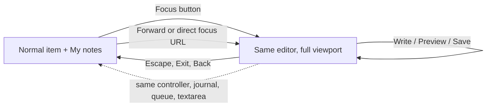
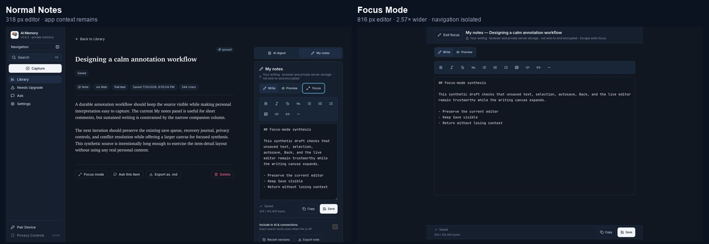
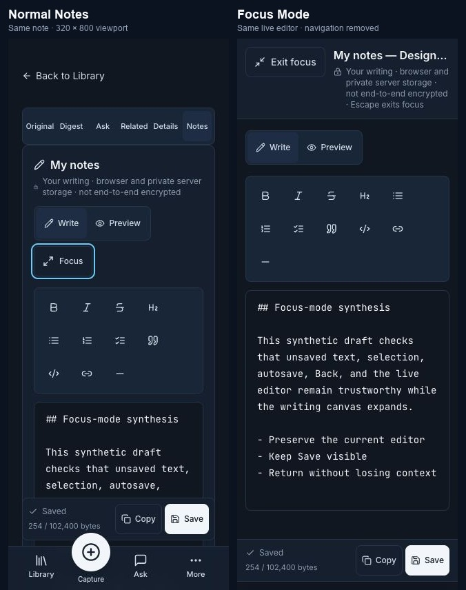

# Note Focus Mode — Detailed Product, Design, Engineering, and Release Report

Date: 2026-07-10
Status: Released to production after guarded flag-off deployment and hotfix
Repository: `arunpr614/ai-brain`
Feature PR: [#15](https://github.com/arunpr614/ai-brain/pull/15)
Release hotfix PR: [#16](https://github.com/arunpr614/ai-brain/pull/16)
Production main: `6858529ef179a51442d319c6c58e5ace79757619`
Production: [AI Memory](https://brain.arunp.in)
Wiki: [Manual Content Notes](https://github.com/arunpr614/ai-brain/wiki/Manual-Content-Notes) · published `3d578c3`

## Executive summary

Note Focus Mode gives the existing **My notes** editor a deliberate, distraction-free canvas without creating a second editor or changing how notes are stored, saved, searched, or used by AI. The current item experience stays the default.

The selected solution promotes the already-mounted editor into an opaque full-viewport surface. Browser history uses a content-free `tab=notes&note_mode=focus` marker, so Back exits, Forward re-enters, and a direct/reloaded focused URL recovers after the ordinary saved-note and browser-journal reconciliation.

The implementation also corrects a prerequisite lifecycle problem: the previous desktop/mobile item layout could mount duplicate note editors, and the desktop Digest tab unmounted Notes. The new shared responsive host keeps one controller and one Write textarea alive.

## What the user gets

- A visible **Focus** control in My notes.
- A substantially wider desktop editor and a clean full-screen mobile canvas.
- Persistent Exit, item identity, privacy copy, Write/Preview, Markdown tools, live save state, byte count, Copy, and Save.
- Escape and browser Back to exit; Forward and direct/reloaded focused URLs work.
- The same content, journal, save queue, conflict/recovery state, and Write textarea during supported same-document transitions.
- Normal Notes as the default, with no global “remember Focus” behavior.

## AI and connections default

The user-requested **Include in AI & connections** default is already implemented as a real global preference under **Settings → My notes**.

- It applies when a note is first saved or deliberately recreated.
- Existing notes keep their per-note choice.
- Exact search continues whether the choice is on or off.
- The effective default cannot bypass active-provider eligibility or required consent.
- Focus Mode hides the per-note management row while writing and restores it unchanged after exit.

This is intentionally separate from Focus Mode: expanding the canvas must not silently change the privacy or retrieval policy of the note.

## Selected design

### Why this design

| Option | Decision | Reason |
|---|---|---|
| In-place app Focus | Selected | Reliable across web/Capacitor; retains the actual editor and trust UI |
| Dedicated route | Rejected | Risks remount, duplicate fetch/journal owners, and state loss |
| Portalled modal/second editor | Rejected | Creates competing content and persistence state |
| Browser Fullscreen API | Rejected for v1 | Permission/gesture/platform variability without added writing value |
| Hybrid app + browser fullscreen | Rejected | More states and failure paths than the value justifies |

## Visual result

### Desktop

At a 1440×900 test viewport, the Write textarea grows from 318px to 816px: **2.57× wider**.

### Mobile

At 320×800, the Focus surface has zero horizontal overflow. Every Markdown target is 44×44px, the textarea is 320px high, and Exit, Copy, and Save remain visible.

## Core implementation

| Area | Implementation |
|---|---|
| Responsive lifecycle | One shared `ManualNoteEditor`; persistently mounted Notes/Digest panels |
| Presentation | Same section gains fixed full-viewport layout; no portal/route/fullscreen |
| URL/history | Content-free helper, native `pushState`/`replaceState`/`popstate` |
| Accessibility | Labelled/described in-place dialog, exact background isolation, focus trap and return |
| Editor state | Current textarea selection/direction/scroll snapshot plus page scroll |
| Exit arbitration | IME/229 → child layer → Focus → page |
| Reliability | Existing journal/save queue unchanged; guard only non-durable navigation |
| Rollout | Default-off flag plus explicit first-enable deploy acknowledgement |
| Structural rollback | Previous known-good artifact; no schema/data rollback |

## Reliability behavior

### Normal transitions

Focus, Exit, Back, and Forward are presentation-only. A production-build request trace recorded **zero note GET/PUT requests** during those transitions. Content and the single textarea remained present.

### Direct load and refresh

A direct focused reload performs the expected one authenticated note GET, reconciles the saved note and local journal, then shows Focus with a Saved state. Exiting an unowned direct entry removes only the note-focus marker with `replaceState`.

### Failure handling

- Loading and session-expired editors remain disabled until recovery is safe.
- Session expiry adds **Unlock to sync** while retaining Copy and Exit.
- Focus Exit never prompts because it does not leave the document.
- Later navigation is guarded only if the device journal failed and the current value is ahead of the acknowledged server value.
- Conflict, recovery, offline, failure, and oversize semantics remain owned by the existing editor.

## Accessibility result

The WCAG review closed three Moderate issues before release:

1. Companion tabs now use roving focus and Arrow/Home/End keyboard navigation.
2. Focus scroll padding keeps keyboard focus clear of sticky top/bottom chrome.
3. The polite notice live region remains mounted before text is announced.

No Critical or High finding is open. The keyboard trap wraps Save → Exit and Shift+Tab Exit → Save. Real VoiceOver/TalkBack speech and physical Android software-keyboard behavior remain explicitly unverified because those environments are unavailable.

## Verification summary

| Gate | Result |
|---|---|
| Repository tests | 814 passing, 92 suites |
| Lint / typecheck / diff | Pass |
| Optimized build | Pass |
| Standalone artifact/env checks | Pass |
| Production dependency audit | 0 vulnerabilities |
| Production Back/Forward trace | Same content/textarea; 0 note GET/PUT |
| Direct reload | 1 expected note GET; Saved state restored |
| Focus flag rollback | Pass |
| Previous artifact rollback | Build/start/normal Notes smoke pass |
| 1440×900 and 320×800 visual checks | Pass |
| GitHub integration | PRs #15 and #16 merged |
| Guarded production rollout | Pass — flag-off smoke, deep-link fix, enablement, authenticated smoke |

See [acceptance traceability](../validation/acceptance-traceability.md), [QA report](../validation/qa-report.md), [accessibility review](../validation/accessibility-review.md), and [release/rollback plan](../validation/release-and-rollback.md).

## Known residuals

- Browser automation could not generate a verifiable native Cmd/Ctrl+Z combination; same-node evidence protects the undo precondition, but exact keyboard undo remains a manual smoke check.
- Android software keyboard, first/second Back behavior, TalkBack, and real assistive-technology speech need device certification.
- Real session-expiry, journal-failure, and every existing save-state visual were not individually forced in the production browser, though their state-machine paths remain regression-tested.

## Production release result

The feature was first deployed with Focus disabled. That exact smoke found a release-critical integration defect outside the item page: the auth proxy copied `tab` and `note_mode` beside `/unlock` while `next` contained only the pathname. Focus stayed off. PR #16 moved the complete pathname and query into `next`, cleared duplicate unlock query parameters, and raised the final suite to 814 tests.

After the corrected flag-off deep link passed, Focus was deliberately enabled through a backed-up restricted environment-file update and service restart. Authenticated read-only smoke passed ordinary Notes, Focus control and route, missing-tab canonicalization, source-reading precedence, and the global AI/connections default. Health, strict Anthropic/Gemini providers, webhook rejection, the application service, and the Recall timer passed. No note content, AI setting, consent, or item row changed during production validation.

## Ideas to tighten the implementation

### P0/P1 hardening

1. Add a browser-level test hook that exposes a content-free editor instance ID only in test builds, allowing exact same-node/controller assertions without mutating production history.
2. Add a deterministic IndexedDB-failure test adapter so the unsafe-navigation guard, Retry, Copy, browser confirm, and cleanup can be exercised end to end.
3. Add a Playwright-equivalent CI job for production history/network tracing once the repository adopts an approved browser runner.
4. Add Android device-farm coverage for visual viewport, software keyboard, orientation, and first/second Back.
5. Add VoiceOver/TalkBack scripted checklists with captured spoken labels and focus order.
6. Split the emergency artifact rollback note into a runbook command that records the candidate SHA and proves the prior duplicate-controller baseline is understood.

### Small polish

- Add a content-free word/character count beside byte count.
- Let the user choose a comfortable focused column width (narrow/medium/wide) without changing the normal layout.
- Add a “return to last cursor” command after Preview without remounting the textarea.
- Add an optional distraction-minimal toolbar collapse that never hides Save/Exit/status.

## More features to consider

| Priority | Feature | User value | Guardrail |
|---|---|---|---|
| P1 | Note outline | Jump among Markdown headings in long synthesis notes | Derived locally; no content telemetry |
| P1 | Find/replace | Faster editing of long notes | Native/local only |
| P1 | Note templates | Repeatable review, meeting, research, and decision formats | User-owned templates; no forced AI |
| P1 | Backlinks panel | Show items whose notes explicitly link to this item | Provenance and opt-out respected |
| P1 | Citation insertion | Insert a source/item citation into My notes | Preserve source identity and export format |
| P2 | Split source + focused note | Read a selected excerpt while keeping a large editor | One note controller; responsive fallback |
| P2 | Local writing history timeline | Easier checkpoint comparison and named milestones | Reuse bounded revisions; no silent retention expansion |
| P2 | Optional AI writing assist | Summarize/refine selected note text | Explicit per-action consent; never auto-send private text |
| P2 | Focus session resume | Return to an unfinished long-form session | Content-free session metadata only |

## Annotation tool updates

1. **Inline comments on selected text:** attach a comment to a stable Markdown range with a clear stale-anchor state after edits.
2. **Highlight-to-note capture:** send a source highlight into My notes with provenance, then place the cursor after it.
3. **Annotation types:** question, disagreement, decision, follow-up, quote, and idea—implemented as lightweight metadata, not separate library items.
4. **Resolved/open annotation state:** let users close follow-ups while keeping an audit trail.
5. **Backlinks and mentions:** type `[[` to link another item and show reciprocal references.
6. **Tag selected passages:** allow local structured tags without changing whole-item tags.
7. **Annotation search filters:** My notes only, annotation type, unresolved, item, collection, and date.
8. **Optional AI connection suggestions:** suggest related items for a selected passage only when **Include in AI & connections** is effective; never auto-accept.
9. **Annotation export:** Markdown with source links, timestamps, and resolved state.
10. **Mobile capture ergonomics:** selection toolbar action, dictation-friendly editing, and larger comment composer.

## Recommended next sequence

1. Observe the guarded web Focus release and review operational/client errors.
2. Complete Android/AT certification and deterministic journal-failure automation.
3. Ship note outline + find as the highest-value low-risk Focus enhancements.
4. Prototype provenance-aware highlight-to-note and backlinks.
5. Evaluate optional AI assistance only after the privacy/consent interaction is separately reviewed.

## Artifact index

- [Discovery](../discovery.md)
- [PRD v2](../prd/prd-v2.md)
- [UX/UI v2](../ux/ux-ui-v2.md)
- [Technical plan v2](../technical/technical-plan-v2.md)
- [Decision log](../DECISION_LOG.md)
- [Implementation summary](../validation/implementation-summary.md)
- [Acceptance traceability](../validation/acceptance-traceability.md)
- [QA report](../validation/qa-report.md)
- [Accessibility review](../validation/accessibility-review.md)
- [Release and rollback](../validation/release-and-rollback.md)
- [Published Manual Content Notes wiki](https://github.com/arunpr614/ai-brain/wiki/Manual-Content-Notes)
