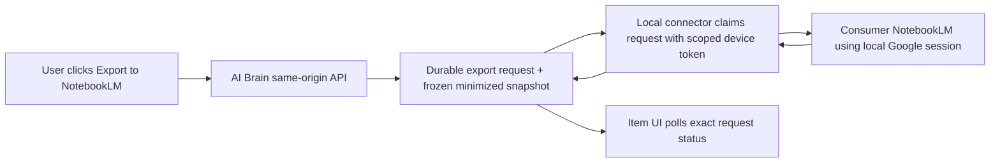

# One-click AI Brain item export to consumer NotebookLM — repository-fit analysis

**Decision date:** 2026-07-21

**Destination:** Consumer NotebookLM at `notebooklm.google` / authenticated app at `notebooklm.google.com`

**Feature:** One deliberate click on one AI Brain item sends a frozen representation of that item to one preconfigured NotebookLM notebook

**Evidence:** AI Brain source audit; static source-level review of pinned third-party repositories; official product/browser documentation; credential-free 13-case contract spike

**Live Google calls, logins, or sources created:** 0
**Decision:** `teng-lin/notebooklm-py` is the strongest repository foundation, but only behind an AI Brain-owned local connector and export ledger

## Direct answer

Choose [`teng-lin/notebooklm-py`](https://github.com/teng-lin/notebooklm-py).

It is the only inspected candidate that combines the complete button contract—list notebooks, add copied text, return a source identity, list/get sources, and wait for processing—with an explicit operation-level rule that **does not blindly retry copied-text creation**. That last property is decisive: consumer NotebookLM supplies no client idempotency key for copied text, and a timed-out request may already have created a source. Generic transport retry can silently create duplicates.

The repository is not an official Google client. It automates undocumented consumer NotebookLM internals. The evidence supports a **technical recommendation for at most one separately authorized, synthetic, local-only feasibility spike**—not a product Go/Limited-go decision, implementation authorization, production approval, or claim of Google support.

### Adoption choice

- If the synthetic feasibility spike is separately authorized, pin the stable library release `notebooklm-py==0.7.3` at tag commit `a6c54417058bd5e43e0162dd93a390308d2f99f6`, verify the package artifact hash, and call it from a small AI Brain-owned desktop worker. The worker polls a durable AI Brain export queue; Google session material remains on that computer.
- Treat main commit [`45fd4258e608fbb9685496f26cfcea48810c44ee`](https://github.com/teng-lin/notebooklm-py/tree/45fd4258e608fbb9685496f26cfcea48810c44ee), version `0.8.0rc1`, as spike/reference material. Its new localhost REST server is a very good contract match but is pre-release and explicitly experimental. Re-evaluate when `0.8` is stable.
- Do **not** embed the library in the hosted Next.js process, place its cookies or headless master token on Hetzner, expose its full CLI/MCP/REST surface to the browser, or shell copied item text through command-line arguments.
- If maximum credential containment is preferred, implement the narrow NotebookLM transport inside AI Brain's existing Chrome extension and use `notebooklm-py` as the protocol/failure-semantics reference rather than as a runtime dependency. That path still needs a live synthetic feasibility spike.

## Why this narrower feature changes the earlier decision

The earlier council evaluated broad automatic/daily synchronization, retention, aggregation, and supported-platform choices and reached **Defer**. That decision still governs broad synchronization.

This request is materially narrower:

1. the user explicitly chooses one item;
2. AI Brain freezes one payload at click time;
3. one server-configured notebook is the only target;
4. no history scan, deletion propagation, or daily schedule is required; and
5. success can be tied to one returned source and its processing state.

Those constraints remove discovery-cursor, scheduler, batch-composition, and aggregate-knowledge requirements from the first test. They reduce but do not eliminate capacity and retention risk: every changed-item export can consume another NotebookLM source, and every unresolved request holds another frozen content copy. The central consumer-platform risk also remains: every automated candidate uses an undocumented interface and a bearer-equivalent Google session.

## Required contract

The repository and surrounding design must support all of the following:

| Requirement | Why it is required |
|---|---|
| Resolve one configured notebook | The button must not accept an arbitrary notebook ID or URL from browser input. |
| Verify target health and sharing posture | Wrong account, changed binding, or unexpected collaborators can turn a correct write into a privacy incident. Unknown sharing state must block real content. |
| Add a copied-text source | The exported object should be the saved AI Brain snapshot, not a fresh refetch of the original URL. |
| Return a source ID | “Request accepted” is not sufficient to identify or observe the exact result. |
| Read source status | `PROCESSING` must not be presented as `Exported`. |
| List source titles | A marker lookup is the only available recovery probe after an ambiguous copied-text write. |
| Surface auth expiry distinctly | Reconnect is a user action, not a retryable provider error. |
| Disable blind retries for text creation | A network/5xx/429 response can be lost after Google committed the mutation. |
| Keep Google session state local | Consumer automation has no narrow OAuth scope; copied cookies grant broad account authority. |
| Enforce payload and source-headroom bounds | One-click still accumulates provider sources and temporary frozen snapshots. |
| Permit a narrow owned adapter | AI Brain—not a general-purpose MCP server—must own payload minimization, target binding, retry rules, and browser-facing states. |

Google's consumer help describes copied text as a supported source type and says imported sources are static copies rather than continuously synchronized originals. That makes copied text the closest match to “send this AI Brain item as it exists now.” See [Google's NotebookLM source documentation](https://support.google.com/notebooklm/answer/16215270?co=GENIE.Platform%3DDesktop&hl=en-GB).

## Weighted repository comparison

Scores are relative engineering fit for this feature, not a measure of Google support. Every candidate below is unofficial. The weights intentionally make ambiguous-write behavior a first-class criterion.

| Criterion | Weight |
|---|---:|
| Exact one-click contract coverage | 25 |
| Ambiguous-write and duplicate safety | 20 |
| Credential isolation and deployability | 15 |
| Maintenance and protocol-drift response | 15 |
| Test depth and observable status behavior | 10 |
| AI Brain integration fit | 10 |
| Least unnecessary capability | 5 |

Each subscore uses the same anchored scale, multiplied by its weight: **0%** absent or incompatible; **25%** present only through unsafe/manual workarounds; **50%** materially partial; **75%** complete with a contained patch or operational caveat; **100%** complete and appropriate in the inspected source. Maintenance additionally considers release recency, explicit architecture/error contracts, and protocol-drift activity; tests consider relevant failure coverage rather than raw file count. Scores are a transparent decision aid, not empirical reliability probabilities.

| Candidate (pinned revision) | Contract /25 | Ambiguity /20 | Credentials /15 | Maintenance /15 | Tests /10 | Integration /10 | Minimal /5 | Total /100 | Outcome |
|---|---:|---:|---:|---:|---:|---:|---:|---:|---|
| [`teng-lin/notebooklm-py`](https://github.com/teng-lin/notebooklm-py) (`v0.7.3`; reviewed main `45fd4258…`) | 24 | 20 | 13 | 15 | 10 | 7 | 4 | **93** | **Winner.** Complete source lifecycle and operation-aware no-retry behavior; mature project; Python/local-worker boundary is acceptable. |
| [`jacob-bd/notebooklm-mcp-cli`](https://github.com/jacob-bd/notebooklm-mcp-cli) (`2f28855b…`, v0.9.0) | 23 | 7 | 12 | 14 | 8 | 6 | 4 | 74 | Strongest fallback for CLI/MCP use, but generic RPC retry behavior is unsafe for an ambiguous text create unless patched; much broader surface than the button needs. |
| [`agmmnn/notebooklm-sdk`](https://github.com/agmmnn/notebooklm-sdk) (`e3be7175…`, v0.3.4) | 24 | 12 | 8 | 6 | 6 | 10 | 2 | 68 | Closest direct TypeScript SDK and complete lifecycle, but lacks operation-aware idempotency, replays once after auth refresh, and does not explicitly protect its default session file/directory. |
| [`vankcdhv/notebook-mcp`](https://github.com/vankcdhv/notebook-mcp) (`ccc68713…`, v0.2.3) | 18 | 5 | 13 | 7 | 6 | 7 | 4 | 60 | Attractive static Go/stdio packaging and private credential files; generic mutation retry and no dedicated readiness tool weaken correctness. |
| [`cola-runner/notebooklm-cli`](https://github.com/cola-runner/notebooklm-cli) (`67adf52b…`, v0.1.2) | 23 | 4 | 8 | 6 | 5 | 9 | 3 | 58 | Clean TypeScript API and easy conceptual Next.js fit; universal POST retry policy, young history, and weaker explicit credential-file permissions make direct adoption unsafe. |
| [`LocalKinAI/notebooklm-go`](https://github.com/LocalKinAI/notebooklm-go) (`2d17dd35…`, v0.2.2) | 13 | 6 | 11 | 4 | 2 | 6 | 2 | 44 | Small Go library, but copied-text add does not provide the source identity/readiness contract and title handling is insufficient. |
| [`MikeChongCan/10x-chat`](https://github.com/MikeChongCan/10x-chat) (`01aafcd7…`, v0.11.6) | 15 | 3 | 6 | 6 | 3 | 2 | 1 | 36 | Generic Playwright multi-provider automation; its NotebookLM client is not a supported package API and its capability surface is far broader than needed. |

The 19-point lead over the next candidate is primarily explained by the ambiguity criterion: no other candidate explicitly classifies copied-text creation as non-idempotent and forcibly prevents every post-send replay path. No sensitivity analysis was used to claim robustness outside the stated weights.

### Browser/DOM projects are references, not dependencies

These projects were also inspected but are not comparable library engines:

| Project | Useful idea | Reason not to adopt wholesale |
|---|---|---|
| [`lowrisk75/notebooklm-companion`](https://github.com/lowrisk75/notebooklm-companion) (`3992c6fb…`) | Reassert the exact target notebook and verify a source-count change. | DOM automation; no returned source ID or true processing readiness; very young; local socket needs hardening. |
| [`mahlernim/chrome-pdf-to-notebooklm`](https://github.com/mahlernim/chrome-pdf-to-notebooklm) (`a9cdd797…`) | Browser-session transport with credentialed requests. | PDF/page-oriented rather than a durable arbitrary-text export contract. |
| [`AndyShaman/add_to_NotebookLM`](https://github.com/AndyShaman/add_to_NotebookLM) (`f2b6422a…`) | Good one-click notebook-selection UX and internal text-source call. | No external AI Brain bridge, durable ledger, ambiguity reconciliation, or sufficiently narrow permission model. |
| [`mtfkarukera/mc4nblm-firefox`](https://github.com/mtfkarukera/mc4nblm-firefox) (`57143a86…`) | Manual selected-text clipping. | Requests `<all_urls>` and copies Google cookies into extension storage; neither is acceptable. |
| [`PleasePrompto/notebooklm-mcp`](https://github.com/PleasePrompto/notebooklm-mcp) (`50b3e7f6…`) | Loopback-default browser automation. | DOM/selectors, persistent profile, and documented breakage; no reason to inherit MCP breadth. |
| [`roomi-fields/notebooklm-mcp`](https://github.com/roomi-fields/notebooklm-mcp) (`1eff9318…`) | Has a REST text endpoint. | DOM automation plus unsafe server defaults (`0.0.0.0`, permissive CORS, no verified built-in API auth) and count-based rather than identity/readiness verification. |
| [`Pantheon-Security/notebooklm-mcp-secure`](https://github.com/Pantheon-Security/notebooklm-mcp-secure) (`778fcc00…`) | Useful hardening checklist. | Still browser automation; large destructive surface; previous security fixes do not make the underlying interface supported or minimal. |

The official-API [`K-dash/nblm-rs`](https://github.com/K-dash/nblm-rs) (`49b13087…`) is excluded because it targets Gemini Notebook Enterprise, not the consumer product the user clarified. NotebookLM-like systems such as Open Notebook, SurfSense, kotaemon, and AnythingLLM are alternative destinations, not exporters into Google NotebookLM.

## Why `notebooklm-py` wins

### 1. It represents the exact source lifecycle

Stable `v0.7.3` supplies:

- `client.notebooks.list()` for setup-time target discovery;
- `client.sources.add_text(notebook_id, title, content)` for the saved item snapshot;
- a returned `Source` identity;
- `client.sources.list()` and source lookup for reconciliation; and
- `client.sources.wait_until_ready()` so AI Brain can distinguish accepted, processing, ready, failed, and timed-out behavior.

Current main adds an experimental localhost REST server with notebook-list, text/URL/file add, individual source status, and aggregate wait routes. That server also refuses an unauthenticated start, defaults to loopback, requires an explicit override for non-loopback, supports a token file, and uses private temporary files. Those are good reference controls, but the server does not solve remote-to-local delivery by itself and is not yet a stable release.

### 2. Its copied-text retry policy matches the real failure mode

In `v0.7.3`, `(ADD_SOURCE, "text")` is classified `NON_IDEMPOTENT_NO_RETRY`. Internal retries for 5xx, 429, and network failures are forcibly disabled. Its documentation explicitly says text has no reliable provider-side dedupe key because titles are non-unique and copied-text bodies are not exposed in the source list.

That is the right primitive for AI Brain's state machine. A library cannot promise exactly once; it can avoid making the uncertainty worse. AI Brain can then reconcile by a unique opaque title marker and stop when absence is inconclusive.

By contrast:

- `jacob-bd/notebooklm-mcp-cli` routes RPC calls through generic server/rate-limit/auth retry paths without an add-text operation classification.
- `agmmnn/notebooklm-sdk` does not blindly retry network/5xx failures, which is better, but its shared RPC path can replay any method once after a 401/403 token refresh and has no operation-level text-create policy.
- `cola-runner/notebooklm-cli` retries `RateLimitError`, `ServerError`, and network errors in the shared POST transport used by add-text.
- `vankcdhv/notebook-mcp` likewise applies generic retry behavior to RPC mutations.

Any of those could become acceptable only after a maintained fork disables every post-send replay for copied-text creation and adds regression tests. That would erase much of their apparent integration advantage.

`agmmnn/notebooklm-sdk` deserves special mention because its native TypeScript API is the easiest direct fit for Next.js and it returns source identity plus readiness. It is a port of `notebooklm-py`, however, and the reviewed v0.3.4 source had only ten test files, a four-month-old head, no explicit `0700`/`0600` modes for the default `~/.notebooklm/session.json` path, documentation that encourages full cookies in an environment variable for server use, and a `whoami` command that prints a CSRF-token prefix. Those are fixable, but adopting a security/idempotency fork of a younger port is less attractive than wrapping the better-specified upstream foundation locally.

### 3. It has the strongest maintenance signal in this candidate set

At the reviewed date, `notebooklm-py` had the broadest test suite, a 90% configured coverage floor, explicit architecture decisions for retry/idempotency/error contracts, active protocol fixes, and by far the largest maintainer/user signal among the inspected projects. Test-file or star counts are not guarantees, but the source-level design work is directly relevant to this failure-prone unofficial protocol.

### 4. It can be reduced to a narrow owned interface

AI Brain needs only four provider operations at runtime:

```text
getTargetHealth(targetBinding) -> {
  exactBinding, expectedSubject, accessible, sharingPosture,
  sourceCount, sourceLimit
}
addCopiedText(targetNotebookId, titleWithMarker, frozenText) -> sourceId
listSourceTitles(targetNotebookId) -> [{ sourceId, title, status }]
getSourceStatus(targetNotebookId, sourceId) -> status
```

`getTargetHealth` is read-only. It must fail closed on a changed account/binding and return `sharingPosture: unknown` when collaborators cannot be reliably inspected; unknown sharing blocks non-synthetic export rather than being treated as private. Everything else—chat, research, audio, sharing mutations, deletion, notebook creation, artifacts, MCP, and generic command execution—must remain unreachable through the connector token. `notebooklm-py` can sit behind this interface without exposing its full library.

## Recommended architecture



The queue is not optional. AI Brain is hosted, while the safe Google session boundary is local. It also lets an Android-originated click truthfully show `Queued — waiting for desktop connector` until the user's signed-in computer is available.

### Component responsibilities

**AI Brain server**

- authenticates the user and authorizes access to the item;
- uses one immutable server-side target-binding ID/version; browser input cannot choose an alias, notebook, or connector;
- freezes the minimized payload at click time;
- computes the canonical content hash and immutable request version;
- enforces transactional uniqueness for concurrent double-clicks and unchanged-content repeats;
- applies payload bounds, cached target-health freshness, plan-aware source headroom, and snapshot-retention rules;
- owns states, history, rate limits, redacted logs, and browser DTOs; and
- never receives Google cookies, CSRF tokens, Playwright storage, or a `notebooklm-py` master token.

**Local connector**

- authenticates to AI Brain with a dedicated device token limited to claim/read/update of NotebookLM export requests;
- runs only while the user elects to enable it;
- stores the Google session locally with owner-only permissions;
- verifies that the configured target still resolves under the expected Google subject;
- verifies exact binding, accessibility, sharing posture, and source headroom immediately before sending;
- performs one non-retried copied-text create;
- returns only normalized source identity/status or normalized errors; and
- cannot delete, share, chat, create notebooks, or retrieve arbitrary AI Brain items.

**Browser UI**

- sends only an idempotency key and optional confirmation for weak captures;
- receives a random AI Brain `requestId`, state, safe summary, and timestamps;
- displays a safe target label plus an explicit disclosure that the item text will be copied to NotebookLM and may be visible to the notebook's collaborators;
- never receives the NotebookLM notebook ID, source ID, marker secret, connector token, Google error body, or Google session data; and
- polls the exact request with `cache: no-store`, abort/visibility handling, and request correlation.

## AI Brain integration surface

The smallest UI change is a shared `NotebookLmExportButton` beside the existing `Export as .md` control in both item-detail footers:

- desktop: `src/app/items/[id]/page.tsx` near the footer around line 434;
- mobile Original tab: the same file near the footer around line 965.

Do not start with a library-card action. Nested card controls and list-level status would increase interaction and state complexity without helping the deliberate one-item workflow.

The current `RecallManualSync` component already demonstrates useful UI mechanics: client idempotency keys, exact accepted-request correlation, abort-safe polling, visibility-aware refresh, offline/unknown states, and session-expiry handling. Reuse those patterns, not its broad-sync product language.

The existing Markdown export endpoint must not be reused as the provider payload. It includes `brain_id` and raw metadata intended for a user download. NotebookLM export needs a separate allowlist mapper.

### Proposed endpoints

```text
POST /api/items/:id/notebooklm-export
  body: { idempotencyKey, confirmLimitedCapture? }
  response: 202 { requestId, state, message, observedAt }

GET /api/items/:id/notebooklm-export/:requestId
  response: { requestId, state, message, observedAt, completedAt? }

GET /api/settings/notebooklm-export
  response: safe target label + private/shared/unknown posture + connector availability + headroom state

POST /api/connectors/notebooklm/claim
POST /api/connectors/notebooklm/requests/:requestId/events
```

All browser endpoints should be same-origin, session-authenticated, bounded JSON, rate-limited, `no-store`, and must reject unexpected fields. Connector endpoints need a separate scoped token and lease/fencing protocol; they must not accept a browser session as connector authority.

### Proposed storage

```text
notebooklm_targets
  id, binding_version, safe_label, encrypted_or_sealed_remote_binding,
  expected_subject_fingerprint, sharing_posture, source_limit,
  reserved_headroom, last_health_checked_at, connector_id, created_at, disabled_at

notebooklm_export_requests
  id, item_id, target_id, mapper_version, content_hash,
  frozen_title, frozen_text, state, source_ref_sealed,
  idempotency_key, lease_owner, lease_until, attempt_count,
  created_at, started_at, completed_at, snapshot_purge_after,
  cancel_requested_at, last_error_code

notebooklm_export_attempts
  id, request_id, attempt_no, phase, outcome_code,
  started_at, finished_at, safe_diagnostic
```

Use unique constraints for `(user, idempotency_key)` and `(item_id, target_id, binding_version, mapper_version, content_hash)`. Enforce them transactionally in durable storage; S11's same-process sequential model is not a substitute for a cross-process race test. The request stores an immutable sanitized snapshot because AI Brain items can be repaired in place and do not provide a trustworthy general content-version timestamp.

Do not put any Google credential in the existing generic SQLite settings table. A remote notebook binding should be sealed if its disclosure is sensitive, while provider source identity should remain server-only.

## Payload decision

Use copied text for every AI Brain item type that has an eligible saved body. This preserves what the user reviewed in AI Brain and avoids a provider refetch that may encounter a paywall, changed page, removed video, private URL, signed query string, or different extraction.

The canonical payload should contain only:

```text
Title

AI Brain saved content body

Optional public provenance:
- Author
- Published date
- Canonical public URL (only after strict allowlisting and query removal)
```

Exclude by default:

- raw AI Brain item/brain/user IDs;
- raw content hashes or database timestamps;
- capture/extraction internals;
- signed, credential-bearing, private-network, localhost, or query-string URLs;
- thumbnails and temporary media locations;
- generated summaries, quotes, chat history, and attached private notes; and
- NotebookLM target/source identifiers.

For `metadata_only`, `paywall_preview`, or `failed` captures, block the export or require a clear confirmation that the limited text—not the presumed full source—is what will be sent.

PDFs should still use their saved extracted text in the first version. AI Brain does not guarantee retention of every original PDF byte, and a text snapshot gives all item types one deterministic privacy and idempotency contract. File/URL export can be considered later as an explicit alternate mode.

## Target consent, capacity, and retention

Target setup must happen through the local connector. It resolves the chosen notebook under the expected Google subject, creates an immutable binding version, records only a safe display label in browser-visible state, and inspects sharing/privacy posture. Before each click, the item page must name that safe target and disclose that a copy of the item text will leave AI Brain and may be readable by notebook collaborators. Immediately before the write, the connector rechecks the exact binding and account. If collaborator state cannot be reliably read, `sharingPosture` is `unknown`; that blocks non-synthetic content rather than silently assuming a private destination.

One-click is not capacity-free. Google publishes plan-dependent per-notebook source limits, so the connector must read current occupancy where possible and AI Brain must keep a policy-defined reserve rather than consume the last available slot. See [Google's current NotebookLM limits](https://support.google.com/notebooklm/answer/16213268?hl=en). The separately authorized feasibility spike may create at most one synthetic source. Any later rollout requires a documented maximum export envelope, plan-aware source limit, reserved headroom, warning threshold, and `target_capacity_blocked` state.

The mapper must reject payloads above an explicit AI Brain byte/word ceiling that is tested and comfortably below Google's current source limits. Do not silently truncate; show the user that the item is too large or require a separately reviewed chunking design.

Frozen text is a second content copy and needs lifecycle rules:

- retain it while `queued`, `running`, `processing`, `authentication_attention`, or `reconciling` needs deterministic replay/recovery;
- purge it after a short disclosed interval following `succeeded`, `cancelled`, or a resolved terminal state, retaining only content hash, mapper version, safe state, and timestamps;
- bound retention for unresolved/error requests and give the user an explicit abandon/purge action; and
- allow immediate cancellation only before the connector begins sending. A later cancel request must reconcile the possible remote source and enter `cleanup_required`; it cannot pretend the provider write was undone.

Provider cleanup must address only a recorded source ID after target/account verification. The first user-facing version should not automatically delete old changed-content versions, but it still needs a manual cleanup state and source-headroom reporting before any rollout.

## Correct state and retry model

```text
queued -> cancelled                         (only before send)
queued -> running -> processing -> succeeded
running -> retryable_error                  (only when confirmed not sent)
running -> terminal_error
running -> reconciling -> processing        (exactly one marker match)
                       -> conflict          (multiple matches)
                       -> reconciling       (zero, but absence inconclusive)

authentication_attention -> queued         (confirmed pre-send)
                         -> reconciling    (write outcome uncertain)
                         -> processing     (status poll interrupted)
```

The title sent to NotebookLM should include a stable, opaque HMAC marker derived from the immutable target-binding ID/version, item ID, canonical payload hash, and mapper version. It must not expose those raw inputs. Example shape: `Human title · [AB-X7K4Q9]`. Rebinding the same friendly label must create a new binding version and therefore a different marker/dedupe namespace.

On an accepted response, store the source reference and poll until ready. On a pre-send/connect failure, a bounded retry is safe. On any post-send timeout, read error, 429, 5xx, or auth-refresh boundary that might have followed delivery:

1. do not issue another create;
2. list sources and find the exact marker;
3. if exactly one match exists, adopt its identity and continue polling;
4. if multiple matches exist, enter `conflict`; and
5. if no match exists but propagation delay is unbounded, remain `reconciling` and require a later observation or manual resolution.

Exactly-once creation cannot be proved on this unofficial surface. The honest goal is “at most one automated create unless non-delivery is conclusive.”

For unchanged content, return `Already exported`. If the item changed, create a new version only after an explicit `Export updated version` action. Do not delete or replace the old source automatically in the first release.

## Credential and deployment decision

### Preferred boundary: existing Brain Chrome extension

The existing MV3 extension already has a service worker, local storage, notifications, and a paired Brain device token. A narrow connector can add only `https://notebooklm.google.com/*` to host permissions and use the signed-in Chrome session for credentialed requests. It should not request `<all_urls>`, `cookies`, `debugger`, broad scripting, or copy Google cookies into extension storage.

Chrome documents that an extension service worker with host permission can make cross-origin requests, and that extension host-permission requests receive the relevant cookie treatment; message boundaries must still validate untrusted content-script/page input. See [Chrome cross-origin network requests](https://developer.chrome.com/docs/extensions/develop/concepts/network-requests), [extension storage and cookies](https://developer.chrome.com/docs/extensions/develop/concepts/storage-and-cookies), and [extension messaging security](https://developer.chrome.com/docs/extensions/develop/concepts/messaging).

This is the best credential boundary because the Google session remains in Chrome's own cookie store. It is not yet the lowest implementation-risk path: the minimal TypeScript protocol calls must be ported and validated against a synthetic notebook.

### Practical feasibility-spike engine: local desktop worker using `notebooklm-py`

For the separately authorized synthetic spike, a small controlled worker can poll AI Brain and invoke stable `v0.7.3`. Keep its storage state in a private local directory/file, never in the repository. Pin the tag commit, package version, and artifact hashes; disable automatic upgrades; expose no listener; redact stdout/stderr; call `add_text(..., wait=False)`, persist the returned source ID, and poll separately. Reconnect must be an explicit local action.

Current `0.8.0rc1` offers an experimental localhost REST server with helpful loopback/token-file controls. It can be used in a throwaway engineering spike, but a remotely hosted AI Brain cannot call that loopback server directly. A worker or extension bridge remains necessary, so stable-library embedding is the cleaner feasibility-spike choice.

### Rejected boundaries

| Boundary | Decision | Reason |
|---|---|---|
| Hosted AI Brain/Hetzner worker with primary-account cookies or headless master token | Reject | Converts a web-server compromise into broad Google-account compromise; no narrow OAuth scope. |
| Direct browser page call from Next.js UI | Reject | CORS/cookie/target-secret exposure and unreliable mobile/WebView behavior. |
| Full MCP server as button backend | Reject | Broad tool/destructive surface and extra protocol layer without product value. |
| Shelling a CLI per click | Reject | Process churn, ambiguity handling split across layers, and content/secret leakage through argv/process/log surfaces. |
| Android native NotebookLM share flow | Manual fallback only | Official app sharing/copied-text is useful, but it cannot provide a deterministic prebound background button with durable status. |

If completely unattended export while every user device is offline becomes mandatory, it conflicts with the preferred credential boundary. The only defensible exception would be an isolated worker using a dedicated, otherwise empty Google account that has only the necessary notebook access, after a separate threat/terms review. It should never use the user's primary Google account.

## Spike result

The credential-free [S11 one-click export contract](../spikes/S11_ONE_CLICK_EXPORT_CONTRACT_2026-07-21.md) passed **13/13** cases without a Google call, credential, real item, or remote source. It models local application semantics for:

- deterministic minimized copied-text mapping;
- private/credential URL filtering;
- weak-capture confirmation;
- immutable server-side target binding and marker-version change on rebinding;
- same-process sequential duplicate-submit and unchanged-content coalescing;
- changed-content versioning;
- truthful processing/ready states;
- accepted-but-response-lost one-match reconciliation and normalized reconciliation-read failure;
- no blind retry on inconclusive zero matches;
- multiple-marker conflict;
- phase-aware auth reconnect/resume before a write, after an uncertain write, and during status polling; and
- browser/log redaction.

The spike does not prove that any unofficial RPC still works against live NotebookLM, that Google permits the intended use, or that source-list propagation has a bounded visibility interval. Its in-memory sequential coalescing is not a durable cross-process race proof. It also does not test source headroom, payload limits, target collaborators, frozen-snapshot retention, cancellation, or provider cleanup; those remain explicit pre-rollout gates.

## Implementation sequence and gates

### Gate A — approved live synthetic feasibility

Use one synthetic item, one private test notebook, one local connector, and no primary-account credential export. Verify:

1. target listing/resolution under the expected account, private/shared posture, and occupancy/headroom;
2. copied-text add returns a source ID;
3. processing reaches ready and the source is visible in the exact notebook;
4. expired auth becomes reconnect, not retry;
5. a controlled client-side lost-response test does not produce a second write; and
6. connector disable/revoke stops claims immediately; and
7. spike-created source cleanup uses only the recorded source identity after exact target revalidation.

Stop on account challenge, unexpected sharing/access, protocol drift, uncertain duplicate, or any need to place Google credentials on the VPS. Delete only spike-created sources by recorded identity after manual verification.

### Gate B — narrow connector implementation, only after a new scoped product decision

Gate A success returns evidence for a new product/council decision. It does not itself authorize Gate B. If that decision is Go or Limited-go for this exact one-click feature:

- add target/queue/attempt migrations and repository functions;
- add pure mapper plus privacy/idempotency tests;
- add connector claim/lease/event endpoints and scoped device-token capability;
- implement the four-operation provider adapter, including target health/sharing/headroom;
- add item-detail button/status component on desktop and mobile;
- add offline-desktop, auth-expiry-by-phase, ambiguity, durable concurrent-click, crash/restart, rate-limit, wrong-target/account, shared/unknown-target, payload-bound, capacity, retention, cancellation, and cleanup tests; and
- retain `Export as .md` and official manual NotebookLM import as the fallback.

### Gate C — future limited rollout, only after Gate B review

Start with copied text only, one configured notebook, explicit clicks, and no automatic update/delete. Set a plan-aware maximum export envelope, reserve source headroom, enforce payload ceilings, publish snapshot-retention/cancellation rules, and require a known target sharing posture plus per-click destination disclosure. Add monitoring for occupancy, success latency, reconnect frequency, unresolved ambiguity, cleanup backlog, duplicates, wrong-target prevention, connector availability, and protocol breakage. A single wrong-target export, credential leak, or automatic duplicate is a release blocker.

## Revalidation checklist

Immediately before implementation or release:

- confirm the consumer NotebookLM product still lacks a supported source-management API;
- compare the current stable `notebooklm-py` release with pinned `v0.7.3` and reviewed main commit;
- rerun source-level retry/idempotency review for add-text;
- confirm repository ownership/license/release integrity;
- verify the minimal notebook/source/status calls against synthetic data;
- review Google's current terms and account-security behavior;
- retest Chrome host-permission and cookie behavior if using the extension path; and
- repeat the mapper/privacy/ambiguity suite against the implementation, not merely the research prototype.

## Final decision

**Repository winner:** `teng-lin/notebooklm-py`.

**Recommended dependency for the separately authorized feasibility spike:** stable `v0.7.3`, pinned and wrapped inside an AI Brain-owned, local, polling desktop connector. Use current `0.8.0rc1` only as an experimental REST/security reference until it becomes stable.

**Recommended credential boundary:** the existing Brain Chrome extension is safest because it can use the local signed-in browser session without exporting cookies; choose it if the team accepts the extra TypeScript protocol-porting/live-validation work. The local `notebooklm-py` worker is the most practical feasibility-spike engine.

**Research disposition:** recommend at most one separately authorized synthetic local feasibility spike. This report makes no product Go/Limited-go decision and authorizes no implementation, unattended cloud connector, or production use. The feature remains inherently breakable until Google publishes a supported consumer source-management API.

## Evidence inventory

- [`teng-lin/notebooklm-py`](https://github.com/teng-lin/notebooklm-py), stable `v0.7.3` commit `a6c54417058bd5e43e0162dd93a390308d2f99f6`; reviewed main `45fd4258e608fbb9685496f26cfcea48810c44ee`
- [`jacob-bd/notebooklm-mcp-cli`](https://github.com/jacob-bd/notebooklm-mcp-cli), `2f28855b1545ea321568be6e39dc8c2efb338dd5`
- [`agmmnn/notebooklm-sdk`](https://github.com/agmmnn/notebooklm-sdk), `e3be7175cdbf6133e488483f5a5eaf190ec2bb11`
- [`cola-runner/notebooklm-cli`](https://github.com/cola-runner/notebooklm-cli), `67adf52b514d4ae1bb7bc59b3c2d0757ce4d87e7`
- [`vankcdhv/notebook-mcp`](https://github.com/vankcdhv/notebook-mcp), `ccc68713e4a75ca90fd92d7a32bbd9909ec3fb7d`
- [`LocalKinAI/notebooklm-go`](https://github.com/LocalKinAI/notebooklm-go), `2d17dd3599543e864ee0347eecf1ba73090ea59e`
- [`MikeChongCan/10x-chat`](https://github.com/MikeChongCan/10x-chat), `01aafcd77caff65d95e7c3197c1b974eece73500`
- Browser/DOM reference revisions: `lowrisk75/notebooklm-companion` `3992c6fbbcc63b59538c8a0b9900c753f2b44744`; `mahlernim/chrome-pdf-to-notebooklm` `a9cdd79761ccf7feb8ccc88b8ed5307f16b2e535`; `AndyShaman/add_to_NotebookLM` `f2b6422a7cd77e1cbbd1a61166152bb69a03671c`; `mtfkarukera/mc4nblm-firefox` `57143a86873fe1ba49a654043192bb4ce3eb9af6`; `PleasePrompto/notebooklm-mcp` `50b3e7f67f8535d9899c5e2b1b68f37d17b72aef`; `roomi-fields/notebooklm-mcp` `1eff93182226aa378605ad44d2cb6f23f97708e9`; and `Pantheon-Security/notebooklm-mcp-secure` `778fcc003c854a7ee37be9f5f4b82152352ccc9a`
- Enterprise-only exclusion: `K-dash/nblm-rs` `49b130870811c7da960035a24cc68504a54edce2`
- [Consumer NotebookLM source documentation](https://support.google.com/notebooklm/answer/16215270?co=GENIE.Platform%3DDesktop&hl=en-GB)
- [Consumer NotebookLM product](https://notebooklm.google/)
- [S11 one-click contract report](../spikes/S11_ONE_CLICK_EXPORT_CONTRACT_2026-07-21.md)
- [S11 prototype](../spikes/prototype/one-click-export-contract.mjs) and [tests](../spikes/prototype/one-click-export-contract.test.mjs)

All third-party repositories were inspected statically at the listed revisions. No third-party package was installed or executed, no Google session was accessed, and no live NotebookLM behavior was inferred from the local prototype.
