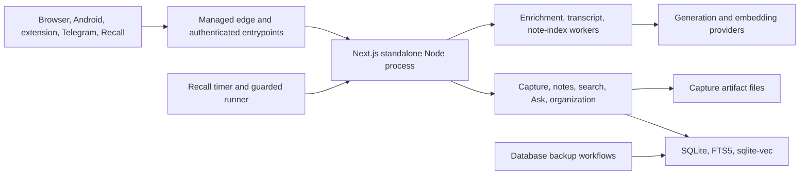

# Architecture Findings

**Current-main baseline:** `23868faf13c8e3d0821715e6f5d0e3d2af1e1a34`
**Latest verified deployed application:** `6858529ef179a51442d319c6c58e5ace79757619`
**Verification date:** 2026-07-11

## System context

AI Brain is a single-owner hosted knowledge system. Browser, Capacitor Android, browser extension, Telegram, and Recall entry paths reach a Next.js standalone Node process through a managed edge/tunnel. Pages, server actions, and API routes call domain modules that persist to one SQLite database with FTS5 and sqlite-vec. In-process workers handle enrichment, transcripts, and note indexing; a guarded external timer handles Recall import. Local/off-site database backups and operator tooling support the hosted service.

The Node process, workers, schedules, and SQLite database are operationally coupled. This simplifies single-owner deployment but means a process/provider/database fault can affect several capabilities at once.

## Major runtime flows

### Capture

Entrypoint authentication and validation → normalization/deduplication → platform-specific extraction → `items` and provenance/artifact writes → enrichment/transcript jobs → generated metadata and taxonomy → chunking/embedding → retrieval availability. Save success does not imply semantic readiness.

### Search, Related, and Ask

FTS queries `items_fts` and eligible `item_notes_fts`; semantic search embeds the query and uses sqlite-vec; hybrid search applies reciprocal-rank fusion. Related uses content/note centroids. Ask validates scope/provider, retrieves eligible chunks, streams a citation-constrained answer, filters orphan citations, and optionally persists thread messages.

### Attached notes

The browser journal is written before server save. Server mutations use editor identity, mutation receipts, hashes, and compare-and-swap generation. SQLite retains current/tombstone/revision/receipt/FTS/semantic-job/consent state. Exact search and AI eligibility are separate; remote AI requires feature flags, per-note opt-in, and provider acknowledgement. Focus changes presentation/history while preserving the mounted editor.

### Transcript recovery

Weak YouTube sources enter durable jobs. The worker applies provider cooldown/retry/manual states. User-provided transcript repair records policy/source/segments and replaces the active content atomically. Official caption OAuth and owned-media STT adapters are not currently wired; the owned-media route returns `503 provider_disabled`.

### Recall import

The scheduled runner locks, overlaps the checkpoint window, enumerates bounded records, maps/fidelity-checks them, enforces caps, dry-runs or applies approved changes, persists run/item outcomes, and advances the checkpoint only after a safe complete apply. It is one-way ingestion, not general synchronization.

## Data model

`items` is the central aggregate. It separates content type from capture channel and stores quality, provenance, generated fields, and processing state.

- Organization: tags, topics, collections and join tables.
- Retrieval: item/note FTS, chunks, row-ID bridge, 768-dimensional vectors, embedding jobs, semantic events.
- AI: enrichment jobs, generated item fields, usage records.
- Chat: threads and messages with citations.
- Capture evidence: artifact metadata/cache and filesystem files.
- Transcript policy/provenance: jobs, attempts, policy decisions, sources, segments.
- Integrations: Telegram updates, pairing codes, Recall state/runs/items.
- Notes: state, current note, revisions, mutation receipts, FTS, index jobs, provider consents.
- `cards` exists as schema substrate; no spaced-repetition product implementation was found.

The migration runner tracks full filenames and applies them lexicographically. Both `017_topics.sql` and `017_transcript_recovery.sql` now coexist. The old unmerged-collision warning is stale; duplicate numeric prefixes remain a human/tooling hazard.

## Authentication and trust boundaries

- Browser: PBKDF2-HMAC-SHA256 PIN hash and signed HttpOnly session cookie.
- API clients: one shared bearer token with in-process rate limiting. Client-version validation runs only when the header is present; `Origin` may be absent, and Chrome-extension origins are accepted broadly.
- Pairing: short-lived one-use code; exchange returns the shared bearer credential.
- Telegram: webhook secret plus owner/private-chat policy.
- Notes: authenticated session and same-origin mutation checks; additional AI consent boundary.
- Recall/providers: separate environment credentials.
- Public TLS terminates at the managed edge; the Node process binds loopback.

Notable risks include a four-character minimum PIN with no discovered unlock attempt limiter, one global bearer token, restart-local rate limits, no CSP, redirect/DNS timing exposure in URL safety, and unencrypted application-level local state.

## Background processing and schedules

- Database migration, bearer bootstrap, local backup, enrichment, transcript, note-index, and batch cron start from instrumentation once per Node process.
- Enrichment polls frequently and also performs chunk/embed work after completion.
- Anthropic batch submit/poll cron competes for the same pending queue; current static flow suggests continuous processing may consume jobs before nightly batching.
- Recall is a separate persistent daily system timer.
- Local database backups run on boot and at a six-hour cadence; encrypted off-site database backup is separately scheduled.

## Deployment and observability

The deploy workflow validates environment and private integration gates, backs up/integrity-checks SQLite, runs code/document checks, builds a standalone artifact against isolated data, synchronizes server/public/static files, rebuilds native SQLite dependencies, restarts an unprivileged system service, then checks authenticated health/providers/webhook boundaries. Observability is operational: journald/console, JSONL error sink, health/provider endpoints, queue tables, Recall reports, quota debug page, and local status scripts.

## Verified limitations and risks

1. Realtime enrichment and nightly batch paths may not behave as the comments/plans imply because they claim the same queue.
2. Realtime enrichment and Ask usage telemetry can record Ollama/provider/model defaults even when another provider serves the request.
3. Ask retains an Ollama-specific model coupling in provider-agnostic flow.
4. Owned-media STT and official caption recovery are inactive/not wired.
5. Bearer identity and revocation are global rather than per device.
6. Several rate limits are in-memory and reset on restart.
7. URL redirect destinations are not obviously revalidated through the entire redirect chain.
8. CSP is absent because of the inline theme bootstrap.
9. SQLite, browser/mobile/extension storage, artifact files, and backups lack application-level encryption.
10. Database backup paths do not include filesystem capture artifacts referenced from SQLite.
11. Private response caching headers are inconsistent across export routes.
12. Error-sink callers can submit unsanitized context.
13. Workers, HTTP, schedules, backups, and one SQLite database share operational fate.
14. GitHub CI runs documentation gates, not the full product type/lint/test suite.

## Change-impact entrypoints

| Change area | Begin with | Also inspect |
|---|---|---|
| Capture | `src/app/api/capture/`, `src/lib/capture/`, `src/db/items.ts` | Android, extension, Telegram, artifacts, queues, review/repair |
| Auth/API exposure | `src/proxy.ts`, `src/lib/auth/`, route-local checks | Pairing, clients, headers, rate limits |
| Schema | new append-only migration and owning DB repository | deployed shape, triggers, workers, backup/restore |
| Search/Ask | chunks/embed/retrieve/search/related/Ask modules | note eligibility, citations, chat persistence, providers |
| Notes | editor, note routes/repository, flags and provider policy | migrations 022/023, journal, search, worker, Focus |
| Recall | client/mapper/fidelity/importer/sync runner | DB state, CLI bundle, system service/timer, reports |
| Deployment | package scripts, deploy script/service files | environment, build artifacts, native dependencies, postchecks |
| Android/extension | request headers, API version, result mapping, storage | pairing/token rotation, capture routes, offline copy |
