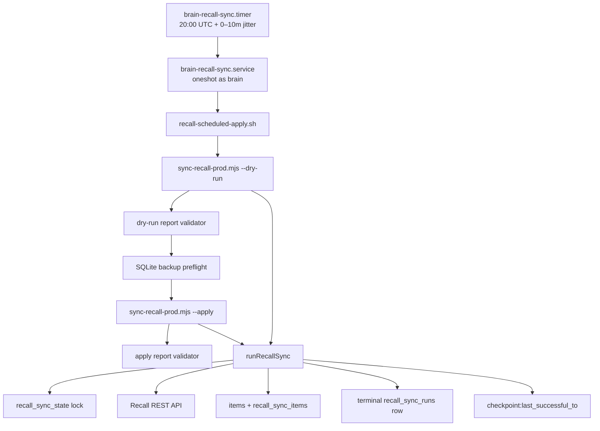
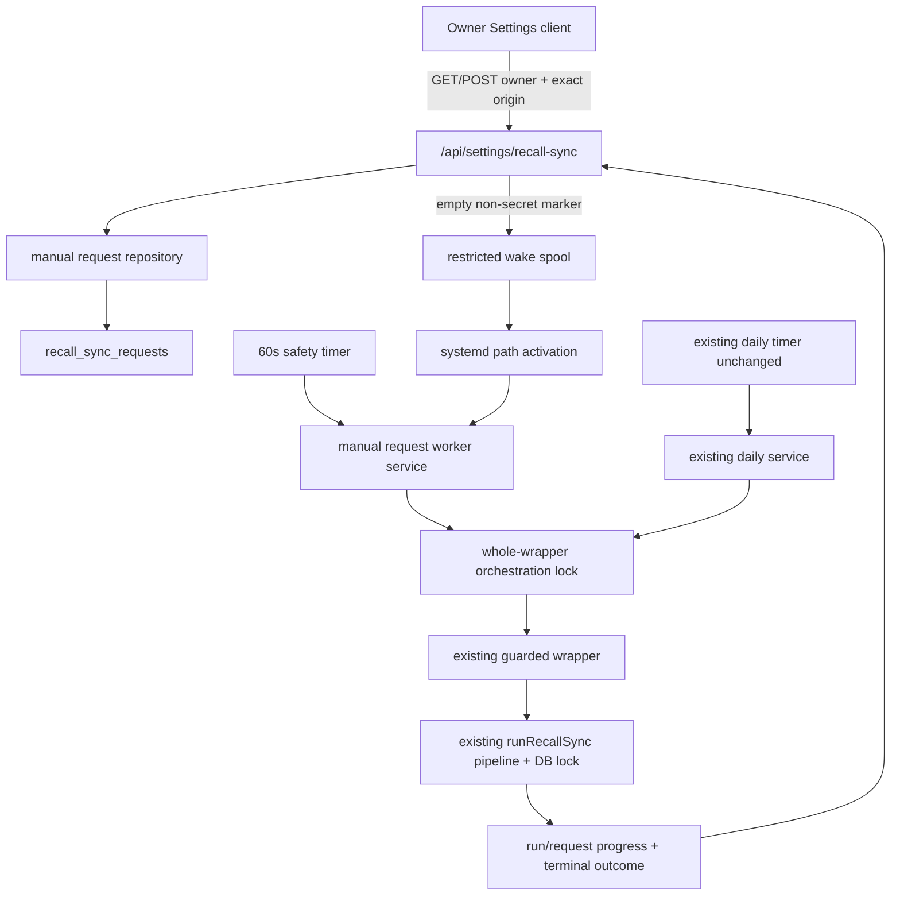

# Recall manual sync: technical discovery working notes

**Role:** Technical architect
**Discovery baseline:** `feat/recall-manual-sync` at `1cb5d36` (same commit as `origin/main` when inspected)
**Authoritative product input:** `RECALL_MANUAL_SYNC_SETTINGS_PRD_2026-07-10.md`
**Scope of this note:** Current code/runtime architecture, persistence, concurrency, security, error behavior, observability, tests, operations, alternatives, and recommended reuse path. This is discovery input, not the approved technical plan.

## Executive findings

1. **The importer must be reused, but the current web app has no manual-sync API, queue, worker, or status UI.** The reusable core is `runRecallSync`, its Recall client/mapper/fidelity/importer modules, the database lock/checkpoint repository, and the guarded `recall-scheduled-apply.sh` sequence.
2. **A last-success signal exists, but not yet in a form that fully satisfies the product contract.** `recall_sync_state['checkpoint:last_successful_to']` advances only after an apply that the core runner considers complete. It is a UTC coverage-window boundary, not explicitly the wall-clock completion time. `recall_sync_runs` has terminal apply rows and `completed_at`, but those rows are written before the outer wrapper's final apply-report validation. Neither source alone proves that the complete guarded wrapper finished successfully.
3. **The schema anticipates run state but not request state.** `recall_sync_runs.state` includes `running`, yet the runner inserts only a terminal row at return. There is no durable queued/claimed request, trigger source, request-to-run link, heartbeat, or per-item progress. Refresh, restart, partial-write truth, and multi-tab behavior therefore need new persistence.
4. **The existing database lock is necessary but does not serialize the whole guarded wrapper.** It is acquired separately by the dry-run and apply invocations, with backup/report checks between them. A new manual service could interleave with the daily wrapper during those gaps. The implementation needs one outer orchestration lock shared by daily and manual entry points, while retaining `tryAcquireRecallSyncLock` as defense in depth.
5. **The current deployment does not demonstrate the PRD's web/credential separation.** Both `brain.service` and `brain-recall-sync.service` use `User=brain`, and both load `/etc/brain/.env`. The wrapper reads `RECALL_API_KEY` from that file. The web process therefore appears to inherit the Recall credential under the checked-in units. Production enablement must split the credential boundary; merely omitting the key from API responses is insufficient.
6. **Partial failure can currently be under-reported.** Apply writes each planned card in its own transaction. If a later import throws, the outer catch builds a fresh zero-count report; if the process dies, there is no in-progress run row. The PRD's “some items were imported” state requires incremental persisted progress or a single atomic all-card transaction. Incremental progress is the better fit for crash recovery and existing item-level idempotency.
7. **SQLite will become a true multi-process queue.** The web server and systemd worker will write the same WAL database. Queue claim/enqueue must use `BEGIN IMMEDIATE` semantics, a uniqueness constraint for one active manual request, and a bounded SQLite busy timeout/retry policy. Current repository transactions are deferred and the connection has no explicit `busy_timeout`.
8. **There is no third-party product analytics framework.** The established observability surfaces are sanitized database reports, systemd journal output, and a rotating `data/errors.jsonl` sink. V1 should use those patterns and keep product analytics derivable from the durable request table, as the PRD recommends.

## Authoritative requirements that constrain architecture

The supplied PRD is unusually specific and should be treated as an architectural contract:

- The browser enqueues; a trusted worker executes the same guarded daily path (PRD lines 12-16, 32-36).
- A successful `202` means the request is durable and continues after navigation or browser disconnect (lines 79-80, 107-115, 183-185).
- Only the owner may read or write; POST is exact-same-origin protected and accepts no operational parameters (lines 171-181).
- One queued/running request, a five-minute terminal cooldown, and the existing Recall lock prevent duplicates (lines 187-198).
- Manual execution must retain dry run, validation, backup, apply, final validation, and existing checkpoint rules (lines 199-217).
- The status source is server persistence, not client memory; active states poll every two seconds and slow/pause in hidden tabs (lines 223-229).
- Failure after any write must be represented as partial failure, while the last successful time remains unchanged (lines 231-237 and 158-166).
- API timestamps are UTC instants; presentation is explicitly `Asia/Kolkata`/`IST`, even when the device is in another timezone (lines 256-258 and 344-368).
- The daily timer configuration and next occurrence must not be changed by a manual run (lines 219-221).
- Rollback disables only new manual requests/UI and preserves history and daily automation (lines 607-615).

### Internal PRD conflicts requiring an explicit decision

- **Unauthorized feature-flag behavior:** FR-1 says unauthorized GET/POST return `401` (lines 171-174), while FR-17 says the endpoint returns `404` to unauthorized users (lines 252-255). Recommendation: authenticate before feature evaluation and return `401` consistently; this reveals no feature state. For an authenticated owner, GET may return `{enabled:false, readiness:'disabled'}` and POST should return a safe unavailable response. Record this choice in the decision log.
- **`run_id` type:** The proposed request table says `INTEGER` (line 328), but `recall_sync_runs.id` is `TEXT PRIMARY KEY` in the current schema. The migration must use `TEXT`.
- **Local-time principle versus PRD:** The top-level goal defaults to local-time display, but the authoritative PRD explicitly requires `Asia/Kolkata` with a visible `IST` suffix. Use IST, not the browser timezone.

## Current synchronization topology

### Runtime flow

1. The daily timer fires at 20:00 UTC with up to ten minutes of randomized delay (`scripts/deploy/brain-recall-sync.timer:4-8`). This is approximately 01:30-01:40 IST the next calendar day.
2. The oneshot systemd service runs as `brain`, loads `/etc/brain/.env`, and invokes the wrapper (`scripts/deploy/brain-recall-sync.service:6-21`).
3. The wrapper validates enablement, scheduler/live-API flags, Recall credential presence, key-rotation evidence, and optional live-spike proof before work (`scripts/recall-scheduled-apply.sh:37-112`).
4. It creates a private dry-run report, validates the dry run and caps, creates a fresh SQLite backup, runs apply with dry-run and backup proofs, then validates the apply report (`scripts/recall-scheduled-apply.sh:114-212`).
5. Both CLI invocations call the same `runRecallSync` function (`scripts/sync-recall.ts:130-175`). The runner computes a checkpoint-overlapped UTC window, acquires the database lock, enumerates and maps Recall cards, enforces fidelity/caps, plans or applies items, persists a run, and releases the lock (`src/lib/recall/sync-runner.ts:99-155`, `157-437`).
6. Successful apply advances `checkpoint:last_successful_to` to the window's `dateTo` before persisting the terminal run (`src/lib/recall/sync-runner.ts:395-422`).

### Current retry and timeout behavior

- Each Recall HTTP request has a 30-second timeout by default (`src/lib/recall/client.ts:35-48`, `84-111`).
- There is no in-client exponential backoff or `Retry-After` handling. A 401/403, 429, cap error, or generic failure becomes a terminal runner result (`src/lib/recall/scheduler.ts:108-123`).
- The timer is `Persistent=true`, so a missed scheduled occurrence may run after the host returns (`scripts/deploy/brain-recall-sync.timer:4-8`), but a failed daily run is not automatically retried by the checked-in service.
- The oneshot unit has no explicit `TimeoutStartSec`. A worst-case bounded run can exceed a typical systemd default because dry-run and apply each fetch up to 100 details at 30 seconds per request. The manual feature needs an explicit, reviewed service timeout and stale/heartbeat policy.

## Concrete entry points and ownership

| Concern | Current entry point | Evidence / implication |
|---|---|---|
| Settings shell | `src/app/settings/page.tsx:44-57`, `92-195` | Server component authenticates, fetches settings/provider state, and renders section cards. Recall belongs after AI services and before Data & Privacy. |
| Responsive shell | `src/app/layout.tsx:77-89` | Main content already reserves mobile bottom-nav/safe-area space. Settings itself uses fixed `px-8` at `src/app/settings/page.tsx:58`; the new panel should use responsive horizontal padding if visual validation confirms narrow-screen pressure. |
| Client settings pattern | `src/components/note-ai-default-setting.tsx:16-59`, `82-157` | Client component owns fetch/mutation status, uses same-origin credentials, 44px controls, and `aria-live`. It is a useful state-management precedent, but its ad hoc inline dialog is not a compliant focus-trapping precedent. |
| Dialog dependency | `package.json:168-170` | Radix Dialog is already installed but no current source usage was found. Use it rather than hand-building focus trap/Escape/focus return. |
| Session verification | `src/lib/auth.ts:86-135` | HMAC-signed 30-day cookie; production cookie is `HttpOnly`, `Secure`, `SameSite=Lax`. |
| Default API gate | `src/proxy.ts:76-157` | A valid owner session admits routes; unknown unauthenticated API routes return `401`. The route must still verify the cookie itself for defense in depth and route-unit-testability. |
| Exact-origin helper | `src/lib/notes/http.ts:21-35` | Correctly accounts for forwarded host/proto and rejects missing/malformed Origin. Generalize or reuse this logic for manual sync POST; do not use the bearer-origin allowlist, which permits missing/extension origins. |
| Private response pattern | `src/lib/notes/http.ts:3-18`; `src/app/api/settings/provider-status/route.ts:5-20` | Status responses use no-store/private cache headers and `Vary: Cookie`. Manual status must do the same. |
| Recall checkpoint/lock | `src/db/recall-sync.ts:188-260` | Generic state KV, checkpoint accessors, and lock. Reuse; strengthen multi-process transaction behavior. |
| Run persistence | `src/db/recall-sync.ts:36-76`, `141-185` | Stores mode, state, timestamps, aggregate counts, sanitized error/report; no trigger/request/progress updates. |
| Sync orchestration | `src/lib/recall/sync-runner.ts:48-91`, `99-437` | Existing source of safety semantics; do not reproduce it in a route or new importer. |
| Report persistence/redaction | `src/lib/recall/sync-runner.ts:439-465`; `src/lib/recall/scheduler.ts:125-130` | Terminal reports are sanitized before SQLite persistence. API projection still needs a stricter allowlist; do not return `report_json`. |
| Item idempotency | `src/lib/recall/sync-runner.ts:498-524`; `src/lib/recall/importer.ts:67-166` | Existing Recall-card ID/content-hash/source-URL checks prevent duplicate item writes and optionally upgrade weak captures. |
| Apply transactions | `src/lib/recall/importer.ts:146-165`, `168-257` | Each card import/repair is transactional, but the complete apply is not one transaction. Partial writes across cards are possible. |
| Recall API | `src/lib/recall/client.ts:35-113` | Server-side bearer auth, date-filtered enumeration, capped detail request, status-aware errors, 30-second per-request timeout. |
| Caps/window/error categories | `src/lib/recall/scheduler.ts:3-14`, `38-105`, `108-130` | Reuse constants and checkpoint rules. Safe product reason mapping needs to be narrower and stage-aware. |
| Guarded wrapper | `scripts/recall-scheduled-apply.sh:55-112`, `114-212` | This complete sequence, not only `runRecallSync`, is the required reuse boundary. |
| Packaged worker build | `scripts/build-recall-cli.mjs:6-47` | Bundles only `scripts/sync-recall.ts` today and copies migrations. A manual request worker needs a second bundle entry/output or a shared multi-command bundle. |
| Daily service/timer | `scripts/deploy/brain-recall-sync.service:6-21`; `scripts/deploy/brain-recall-sync.timer:4-8` | Trusted oneshot and daily cadence. Manual activation must not edit or reschedule the timer. |
| Deploy gates | `scripts/deploy.sh:65-103`, `286-328`, `359-371` | Deploy explicitly preserves/validates active Recall state, runs many Recall static/smoke gates, copies the wrapper/bundle/migrations, and installs service/timer units. New worker/path/timer assets and invariant checks must be added here. |
| Error sink | `src/lib/errors/sink.ts:20-41` | Rotating 5MB JSONL sink, tolerant of write failure. Suitable for source-safe manual request events. |
| DB runtime | `src/db/client.ts:20-73`, `98-150` | Shared SQLite WAL, `synchronous=NORMAL`, auto migrations; no explicit busy timeout. Migrations are filename-sorted and fail startup on error. |
| Feature flags | `src/lib/notes/flags.ts:1-20` | Existing boolean-env parser accepts `1/true/yes/on`. Add a Recall-specific flags module rather than scattering environment reads. |
| Design tokens | `src/styles/tokens.css:31-65`, `84-123`, `129-183`; `src/app/globals.css:51-59` | Existing action, semantic, radius, spacing, focus, dark-theme, and reduced-motion tokens cover the panel. No new design system is needed. |

## Persistence and “last successful sync” truth

### What exists now

- `recall_sync_items` tracks one row per Recall card, item linkage, content hash/fidelity, import/seen/synced times, status, and internal metadata (`src/db/migrations/020_recall_sync.sql:109-140`). `last_synced_at` is card-level processing time, not the global last successful run.
- `recall_sync_runs` stores dry-run/apply rows and aggregate counts (`src/db/migrations/020_recall_sync.sql:142-163`). The schema allows `running`, but `insertRecallSyncRun` is called only at completion (`src/lib/recall/sync-runner.ts:439-463`).
- `recall_sync_state` is a generic durable KV (`src/db/migrations/020_recall_sync.sql:165-169`). It currently stores:
  - `checkpoint:last_successful_to`: the last successful apply window end (`src/db/recall-sync.ts:207-213`);
  - `lock:recall_sync`: JSON owner/acquired-at for concurrency (`src/db/recall-sync.ts:215-260`).
- The checkpoint is advanced only on the core runner's full apply path after no blocking import result (`src/lib/recall/sync-runner.ts:354-422`). The existing test proves a successful apply advances it and a blocked/error path does not (`src/lib/recall/sync-runner.test.ts:410-489`, `589-614`).

### Why current sources are insufficient by themselves

| Candidate | Strength | Gap |
|---|---|---|
| Checkpoint value | Server-authored UTC instant; only moves on core apply success; already drives the next overlap window. | It is the coverage upper bound (`dateTo`), not wall-clock completion. `updated_at` is passed the runner's start/window time, not `Date.now()`. It advances before terminal run insertion and before the outer apply-report validator. |
| Latest `mode='apply' AND state='done'` run | Has `completed_at` and aggregate counts. | The row is inserted inside the CLI before `check-recall-apply-report.mjs` validates the final private report (`scripts/recall-scheduled-apply.sh:190-210`). It also has no trigger/request link. |
| Latest private apply report | Represents the wrapper's apply output and is machine-validated. | File paths/reports are private and deliberately unavailable to the web process/API; files are a poor status database. |

### Recommended definition and migration strategy

- Define **last successful sync** as the server completion instant of the most recent apply whose core report is `done`, checkpoint advanced, and final wrapper validator passed.
- Preserve `checkpoint:last_successful_to` for enumeration coverage only. Do not rename or overload it.
- Persist a separate safe status marker after final apply-report validation, for both daily and manual triggers. Two viable forms:
  1. preferred: a typed `recall_sync_successes`/orchestrator outcome row linked to the apply run; or
  2. minimal: `recall_sync_state['status:last_successful_completed_at']` plus `status:last_successful_run_id` written by the trusted wrapper/worker after validator success.
- The API should use the completion marker for `lastSuccessfulAt`, not a failed/latest attempt. If no marker exists, it may backfill once from the latest validated operational evidence; absent reliable evidence, show “Never synced” rather than guessing from any `done` row.
- Failed, blocked, rate-limited, expired, and partial runs never update the success marker.

## Recommended reuse architecture

### 1. Durable request model

Create the next filename after branch reconciliation (currently migrations exist through `023`; duplicate `017` prefixes are an established hazard documented in `docs/wiki/Data-Model.md:25-27`). Suggested table:

- `id TEXT PRIMARY KEY` (server-generated UUID).
- `trigger TEXT NOT NULL CHECK(trigger='manual_ui')`.
- `requested_by TEXT NOT NULL CHECK(requested_by='owner_session')`.
- `idempotency_key TEXT NOT NULL UNIQUE` with a strict bounded format.
- `state TEXT NOT NULL CHECK(state IN ('queued','claimed','running','done','blocked','error','partial_failure','expired'))`.
- `requested_at`, `claimed_at`, `started_at`, `heartbeat_at`, `completed_at` as epoch milliseconds.
- `run_id TEXT NULL REFERENCES recall_sync_runs(id) ON DELETE SET NULL` (not INTEGER).
- `safe_reason TEXT NULL` constrained to an allowlist.
- Typed aggregate counters (`items_imported`, `items_upgraded`, `items_already_current`) are preferable to querying private `report_json`. If `result_json` is retained, validate it at every write and expose only an allowlisted DTO.
- `expires_at` for the recommended 30-minute unclaimed expiry.
- Partial unique index enforcing a single active row, for example a unique index on `trigger` where state is queued/claimed/running.
- Index `(state, requested_at)` for worker claim and `(completed_at DESC)` for latest/cooldown.

Add a dedicated repository such as `src/db/recall-sync-requests.ts`. Enqueue/dedupe/cooldown and claim operations must use an immediate transaction. Prefer a database uniqueness violation as the final arbiter under simultaneous tabs, then re-read and return the active request. Add a bounded `busy_timeout` to the shared DB connection, and retry only idempotent transaction boundaries after `SQLITE_BUSY`.

### 2. Run lifecycle and correlation

Evolve run persistence so a run row is inserted as `running` before Recall enumeration, then updated to terminal state. Add a stable run ID input/output and trusted trigger metadata (`scheduled` or `manual_ui`) plus optional request linkage. Do not correlate by “latest row after timestamp”; that is race-prone and ambiguous because the wrapper creates both dry-run and apply rows.

During apply, update run/request aggregate counters after each item transaction. This provides truthful partial-write recovery if a later item throws or the process exits. At terminal success, update request linkage/outcome and success marker in one SQLite transaction after the wrapper validator passes. At terminal failure, derive `partial_failure` when persisted imported/upgraded counts are non-zero; never infer “library unchanged” only from an exit code.

### 3. Worker activation and full-path serialization

Use a dedicated manual-request oneshot worker activated by a `.path` unit and a 60-second safety timer. The worker, not the web route, atomically claims the oldest queued request, invokes the existing wrapper, and stores a sanitized result. A marker is only a wake signal; the SQLite request row is authoritative.

The daily and manual systemd services must also share a **whole-wrapper orchestration lock** spanning dry run through final report validation. The existing DB lock spans only each individual CLI invocation, so it cannot prevent dry-run/apply interleaving. A small OS file lock acquired by both systemd `ExecStart` commands is the least invasive option; keep the database lock in `runRecallSync` as the authoritative import-level guard. The manual safety timer should run only the queue worker and exit without calling Recall when there is no request.

Do not make the web process invoke `systemctl`, accept command strings, or spawn the wrapper. Do not repurpose the historical `BRAIN_RECALL_MANUAL_VERIFICATION_MODE` approval path as the product API; it is an operator-only pre-scheduler mechanism with exact approval text (`scripts/recall-scheduled-apply.sh:60-70`).

### 4. Web API and status projection

Add one Node-runtime, force-dynamic route at `src/app/api/settings/recall-sync/route.ts`:

- Authenticate inside GET/POST before evaluating the feature flag.
- GET returns only the PRD allowlist: enabled/readiness, active request, latest sanitized outcome, last-success time, next scheduled time, rounded cooldown. Use private/no-store cache headers.
- POST requires exact same origin, enforces a small body limit, validates an empty strict object or one bounded idempotency key, performs enqueue/dedupe/cooldown in one immediate transaction, attempts the non-secret wake marker, and returns `202` only after persistence.
- If durable insert succeeded but marker creation failed, keep/return queued and log activation failure; the safety timer must recover it.
- Never return `report_json`, `last_error`, lock owner, paths, Recall identifiers/titles/URLs, environment names, commands, or raw stderr.

Put the status mapper in a shared server-only module so the Settings server component and route cannot drift. The mapper should reduce internal states to the PRD's safe product model and derive “already current” from skipped/current counts without exposing cards.

### 5. Settings client state

Add a focused client component (for example `src/components/recall-sync-setting.tsx`) inserted after AI services. Keep transient confirmation/open/network state in React, but always reconstruct queued/running/terminal state from GET.

- Poll at 2 seconds only while queued/running; on `visibilitychange`, pause or back off, and immediately refresh when visible.
- Use `AbortController` for unmount/navigation and stale-response suppression.
- Preserve one idempotency key across uncertain POST retries; generate a new token only after a known terminal outcome/cancelled pre-submit confirmation.
- Multiple tabs may poll independently, but database uniqueness and idempotency are authoritative. No BroadcastChannel is required for correctness; it is optional optimization.
- If `navigator.onLine` is false, show offline status without changing persisted server state. A fetch failure after `202` must say status is temporarily unknown, not that the sync failed.
- Use Radix Dialog for focus trap, Escape, overlay dismissal policy, and focus return. Use one stable `aria-live='polite'` region and announce only meaningful state transitions.
- Centralize IST formatting in a pure tested helper using `Intl.DateTimeFormat(..., {timeZone:'Asia/Kolkata'})`; derive Today/Yesterday with IST calendar parts, not local `Date` boundaries.

### 6. Feature and readiness flags

Add a Recall flags module following `src/lib/notes/flags.ts`. `BRAIN_RECALL_MANUAL_SYNC_UI_ENABLED` gates UI and endpoints, but status readiness should separately reflect whether the queue worker/scheduler/import prerequisites are healthy. Do not treat the UI flag as proof that Recall credentials, timer, path unit, or worker are ready.

### 7. Next scheduled time

The current timer has a static 20:00 UTC calendar plus 0-10 minute random delay. The web process should not call `systemctl`. Recommended v1 choices, in order:

1. Trusted worker/deploy helper snapshots the installed timer's next elapse into safe DB state; GET reads that value and labels it expected.
2. If exact installed state is unavailable, compute the nominal 20:00 UTC occurrence from one server-owned schedule definition and add a static test that the systemd timer matches. The UI must say “around” if randomized delay remains.

Do not independently hard-code “1:30 AM IST” in the client. A stale/missing schedule snapshot should produce a safe unavailable value, not a fabricated next time.

## Security and authorization assessment

### What can be reused

- The HMAC session verifier and cookie options satisfy owner-session authentication semantics (`src/lib/auth.ts:86-135`).
- Exact-origin matching already handles Cloudflare forwarded host/proto correctly (`src/lib/notes/http.ts:21-35`).
- Proxy default-deny and route-level verification provide layered enforcement (`src/proxy.ts:76-157`).
- Existing report redaction and report validators cover many secret/content patterns (`src/lib/recall/scheduler.ts:125-130`; `scripts/check-recall-apply-report.mjs:5-52`, `106-125`).

### Production credential-boundary gap (high severity)

`brain.service` and `brain-recall-sync.service` both run as `brain` and both declare `EnvironmentFile=/etc/brain/.env` (`scripts/deploy/brain.service:6-25`; `scripts/deploy/brain-recall-sync.service:6-21`). The wrapper sources that same file and requires `RECALL_API_KEY` (`scripts/recall-scheduled-apply.sh:37-42`, `72-89`). Thus the checked-in deployment does not establish that the web process cannot read the Recall credential.

Production enablement should be gated on a real split, preferably:

- a distinct `brain-recall` service identity;
- a Recall-only root-owned credential/environment readable by that identity but not the web identity;
- a shared setgid database/data group with verified SQLite/WAL/backup permissions and restrictive umask; and
- hardening/tests proving the web service environment and readable files do not contain the Recall key.

A systemd `LoadCredential` design with private mounts may be a smaller alternative, but it must be proven against same-UID process access. Simply using two environment filenames while both services run as the same Unix user is not a sufficient boundary.

## Concurrency, idempotency, and recovery details

### Existing behavior

- Card identity is idempotent by Recall card ID; repeated same-content cards are skipped and changed content is blocked for review (`src/lib/recall/sync-runner.ts:498-524`).
- Item insert + sync metadata insert is atomic per new card (`src/lib/recall/importer.ts:146-159`). Weak-item repair has its own transaction in the repair service.
- The database lock records owner/acquired time and supports explicit stale recovery (`src/db/recall-sync.ts:215-260`). Lock behavior has unit coverage (`src/lib/recall/scheduler.test.ts:120-152`; `src/lib/recall/sync-runner.test.ts:684-706`).
- Lock acquisition uses a deferred transaction and read-then-upsert; this should not be assumed sufficient across simultaneous processes without an immediate transaction/busy policy.

### Required manual behavior

- Repeated clicks, POST retries, and simultaneous tabs return one active request; they never enqueue a second apply.
- A daily/manual collision waits/coalesces at the outer wrapper lock and never creates interleaved dry-run/backup/apply sequences.
- An unclaimed request expires after the approved interval (recommended 30 minutes); a claimed/running request does not expire merely because the browser closes.
- A stale claimed/running request is reconciled using request heartbeat, run row, core DB lock, and persisted counts. It must not blindly restart.
- If a prior run completed while the worker was interrupted before updating the request, recovery links the known run and finalizes the request idempotently.
- Cooldown is based on server `completed_at`, calculated inside the enqueue transaction, and returned as a rounded/capped `Retry-After`.
- Page refresh/navigation/multi-tab affect only polling, never execution.

## Error normalization and retries

Current internal categories are success, unexpected/config error, partial failure, rate limited, locked, auth failure, cap exceeded, policy blocked, and remote changed (`src/lib/recall/scheduler.ts:3-14`). Product responses should map them to a smaller safe allowlist such as:

| Safe reason | Internal examples | Product handling |
|---|---|---|
| `active` | wrapper/DB lock held | Keep/coalesce queued; no duplicate request. |
| `connection_attention` | Recall timeout, 5xx, DNS/network | Terminal retryable failure; retain last success. |
| `authentication_attention` | Recall 401/403 | Terminal failure; owner-safe copy, operator detail only in private logs. |
| `rate_limited` | Recall 429 or manual cooldown | Upstream failure or API `429` with rounded retry time. |
| `safety_attention` | cap, fidelity, enumeration, changed-remote, proof/backup/report validation | Blocked; state whether zero writes is proven. |
| `worker_unavailable` | activation/worker readiness failure | Keep durable queued request where applicable; daily sync unchanged. |
| `internal` | SQLite/report/process error | Error or partial failure based on persisted counts. |
| `expired` | never-claimed request exceeded expiry | Terminal expired; user may request again. |

Do not automatically retry a terminal apply from the browser. Retry only activation/claim of the same queued request. Upstream GET retry could be added later with bounded jitter and `Retry-After`, but it changes load/runtime and is not required to deliver a truthful v1.

## Analytics and observability inputs

No third-party analytics library or product event pipeline was found. Use the durable request table for product questions and structured source-safe logs for operations.

### Structured events

Use the PRD event names and emit at state-transition boundaries: requested, deduplicated, claimed, started, completed, blocked, failed, partial failure, activation failed. Each entry may include:

- request ID, run ID, trigger (`manual_ui`/`scheduled`), previous/new state;
- server timestamp, request-to-start latency, duration;
- safe reason category and aggregate imported/upgraded/already-current counts;
- deduplicated/rate-limited boolean and queue age.

Never log titles, URLs, Recall IDs, raw report paths, raw errors/stderr, credentials, cookie values, request bodies, or source content. Use `logError` for warnings/failures and journal JSON/one-line structured output for lifecycle events. Logging failure must not alter request correctness.

### Health/readiness signals

- oldest queued request age and queued-over-60s count;
- claimed/running request with stale heartbeat;
- request/run link missing or terminal-state mismatch;
- DB lock owner age (operator-only, never API);
- last successful wrapper completion and time since success;
- activation marker failure/path unit inactive/safety timer inactive;
- daily timer enabled/active and next elapse snapshot;
- terminal outcome counts and p50/p95 request-to-start/run duration;
- manual/daily collision and dedupe count.

## Existing tests and required additions

### Existing protecting coverage

- Recall REST contract/status-aware error tests: `src/lib/recall/client.test.ts:5-98`.
- Fidelity and import behavior: `src/lib/recall/fidelity.test.ts`, `src/lib/recall/importer.test.ts`.
- Window/cap/checkpoint/error/redaction/lock helpers: `src/lib/recall/scheduler.test.ts:20-190`.
- Runner planning, apply, checkpoint, failures, persisted redaction, lock, stale recovery, and enumeration guards: `src/lib/recall/sync-runner.test.ts:216-814`.
- Migration 020 schema/constraints/foreign keys: `src/db/migrations/020_recall_sync.test.ts:130-291`.
- Full wrapper smoke covers disabled/unconfirmed/proof/fidelity/success paths with a fixture database: `scripts/smoke-recall-scheduled-wrapper.mjs:18-340` and later assertions.
- Route test patterns use per-suite temporary SQLite setup files and direct `NextRequest` handler calls, for example `src/app/api/settings/note-ai-default/route.test.setup.ts` and `.test.ts`.
- Repository-wide commands are `npm test`, `npm run typecheck`, `npm run lint`, `npm run build`; Recall packaging adds `build:recall-cli`, wrapper smoke, scheduler artifact checks, and privacy/report validators (`package.json:15-24`, `66-76`, `120-128`).

### Required unit/repository tests

- Migration table/check/index/FK shape; existing-row compatibility; request `run_id` is TEXT.
- Enqueue new, same-key replay, different-key active dedupe, simultaneous-tab race, five-minute cooldown boundary, 30-minute expiry.
- Immediate atomic claim with two independent SQLite connections/processes; `SQLITE_BUSY` bounded behavior.
- Valid state-transition matrix, heartbeat, stale recovery, idempotent terminal updates.
- Progress survives a thrown later import and maps non-zero writes to partial failure; checkpoint/success marker remains unchanged.
- Stable run ID/request correlation across dry-run and apply.
- Last-success marker changes only after core success plus final wrapper validation.
- Safe status projection proves forbidden keys/content/raw errors cannot appear.
- Safe reason classification for every wrapper stage and exit code.
- Nominal/installed next-schedule derivation and timer drift test.

### Required route tests

- Unauthorized GET/POST before flag evaluation; invalid/missing Origin; cookie-only owner path; bearer token not admitted.
- Flag off, worker unavailable, malformed/oversized/extra-field body, invalid idempotency token.
- New `202`, active dedup `202`, cooldown `429` + rounded `Retry-After`, persistence failure `503`.
- Marker failure after durable insert still returns queued `202`; insert failure never claims acceptance.
- GET no-store/private headers and allowlisted response only.
- Active daily collision, stale request, blocked, zero-write failure, partial failure, and last-success retention.

### Required worker/wrapper tests

- Path activation, safety timer fallback, empty queue no-op, oldest queued atomic claim.
- Whole-wrapper lock prevents daily/manual interleaving across dry run, backup, apply, and final validation.
- Worker crash before claim, after claim, during dry run, after backup, during partial apply, after apply before request finalization.
- Dry-run rejection, backup rejection, apply failure, final validator failure, full success, no-new-items success.
- Manual run uses the same caps/policy/proof/checkpoint path and does not mutate daily timer files/state.
- Explicit service timeout/long-running heartbeat and recovery.
- Web process cannot access Recall credential; worker can; both can use SQLite with correct WAL/backup permissions.

### Required UI/pure-function tests

- Ready -> confirm -> queued -> running -> imported/current terminal flows; Cancel/Escape/outside-click policy and focus return.
- Only one live announcement per meaningful state change.
- Hidden-tab poll slowdown/pause, visibility refresh, abort on unmount, out-of-order response suppression.
- Refresh/navigation/new tab reconstructs state; repeated clicks cannot create new request.
- Offline before POST versus connectivity lost after `202`; expired owner session (`401`) behavior.
- IST formatting with runtime/device zones UTC, Los Angeles, and Kolkata; Today/Yesterday around IST midnight; exact suffix and no DST assumptions.
- Reduced motion, 44px touch targets, narrow mobile layout, desktop/dark theme, keyboard-only flow.

### Manual/operational verification inputs

- Compare private proof artifact sequence for one controlled manual fixture run and one scheduled fixture run.
- Capture systemd timer properties before/after manual sync and prove next daily occurrence/configuration is unchanged.
- Run two browser tabs plus a deliberately overlapping worker activation and verify one apply.
- Refresh/close/reopen during a long-running fixture; verify status recovery.
- Force final validator failure after successful core output; verify UI does not show a new successful completion.
- Force a later-card write failure; verify partial counts and unchanged success timestamp/checkpoint.
- Verify feature-flag rollback hides/rejects new requests while an already-running worker completes and daily timer remains active.

## Deployment and rollback findings

Current deployment already treats active Recall automation as a protected invariant: it checks timer enablement/activity and enabled flags, runs Recall packaging/smoke/privacy/scheduler gates, installs the service/timer, restarts only the web service, and rechecks application health (`scripts/deploy.sh:65-103`, `286-328`, `334-383`). Wiki operations guidance explicitly warns that an active timer does not prove later run success (`docs/wiki/Recall-Synchronization.md:10-16`).

Implementation/deploy work will need to:

- build and ship the manual worker bundle and new migration;
- install/verify the manual oneshot, path unit, fallback timer, wake-spool ownership, and whole-wrapper lock;
- migrate the credential/service identity and data-directory permissions safely;
- run daemon-reload but not enable the manual path/timer until controlled rollout approval;
- preserve `brain-recall-sync.timer` schedule and enabled/active state;
- add remote readiness checks without printing secret values or private paths;
- set an explicit worker timeout aligned with caps and stale heartbeat;
- back up SQLite before migration and verify foreign keys/quick check afterward.

Rollback should set `BRAIN_RECALL_MANUAL_SYNC_UI_ENABLED=0`, disable only the new manual path/fallback timer, reject new manual requests, preserve request/run rows and migration, allow a claimed/running worker to finish unless the runbook says otherwise, and leave the daily timer/service untouched. A destructive down migration is neither necessary nor desirable.

## Wiki and history assessment

- A local live-wiki checkout exists at sibling `ai-brain-definitive-project-wiki-20260711-wiki`, clean on `master` at `88a3520` when inspected. Its Recall page matches repository source docs.
- `docs/wiki/Recall-Synchronization.md:10-38` correctly describes a guarded one-way daily import, absence of a general UI, lock/checkpoint/run/item persistence, and existing protecting suites. It will need manual-request/API/worker/status/concurrency/credential-boundary additions after implementation.
- `docs/wiki/APIs-and-Integrations.md:10-35`, `Data-Model.md:12-27`, `Deployment-and-Operations.md:10-24`, `System-Architecture.md`, `Feature-Catalog.md`, `Repository-Map.md`, `Troubleshooting.md`, and the documentation changelog are the likely publication set.
- Relevant history is concentrated in `4d97c45` (“Implement Recall daily sync scheduler”, 2026-06-28) and the consolidation commit `8178117` (2026-07-09). Current main does not show later behavioral evolution of the Recall core; changes should therefore assume the June implementation's safety model rather than an undocumented newer worker architecture.

## Alternatives considered

### A. Run sync inside POST

**Reject.** It ties a long privileged job to HTTP lifetime, makes browser retries unsafe, cannot survive navigation/restart, exposes Recall credentials to the web service, and cannot represent queued/claimed recovery.

### B. Spawn the wrapper from the web process or grant web `systemctl`

**Reject.** This broadens the web privilege boundary and violates the PRD. Same-origin/session checks do not make command execution safe.

### C. Add a second TypeScript importer for manual runs

**Reject.** It will drift from proof, cap, backup, fidelity, checkpoint, and report-validation behavior. The reuse boundary is the guarded wrapper plus core runner.

### D. Reuse only `runRecallSync` in a background web worker

**Reject for v1.** It skips the wrapper's dry-run validator, fresh backup, proof gates, and final apply validator. It also still leaves the web credential boundary unresolved.

### E. Poll the queue only from the trusted worker

**Acceptable fallback.** A 30-60 second trusted timer is simpler and reliable, but does not meet the “within seconds” goal. Path activation plus a low-frequency safety timer provides both fast start and recovery.

### F. Use only the existing DB lock

**Reject as the sole orchestration control.** The lock is released between dry-run and apply. Retain it, but add whole-wrapper serialization shared by both systemd entry points.

### G. Derive last success from latest `done` apply row

**Reject as the long-term contract.** It predates final wrapper validation and can misstate success. It is usable only as a one-time, explicitly qualified backfill when validated operational evidence exists.

### H. Use checkpoint `dateTo` directly as last successful completion

**Reject for label semantics.** It is a useful coverage timestamp, not completion. Keep it for windowing and persist a separate completion marker.

### I. Redis/external job queue

**Reject for v1.** SQLite is already authoritative, durable, local, and sufficient for a single-owner deployment if immediate transactions, indexes, busy handling, and worker recovery are implemented. A new dependency has no demonstrated need.

### J. Single all-card SQLite transaction to eliminate partial failure

**Not recommended as the only fix.** It could reduce partial writes, but a long write transaction increases contention, and the wrapper still needs crash/run truth. Persisted progress with per-card atomicity matches current behavior and makes recovery auditable.

## Gaps and risks to carry into the technical plan

| Severity | Gap/risk | Required disposition before implementation/release |
|---|---|---|
| Critical | Web and Recall service share user/environment; credential boundary unproven. | Choose and test separate credential/service identity design before production flag enablement. |
| Critical | No whole-wrapper serialization; DB lock has dry/apply gap. | Add one shared outer lock and collision tests while retaining core lock. |
| High | No request queue/lifecycle/run link; refresh/restart impossible. | Migration + immediate-transaction repository + trusted worker. |
| High | Last success sources do not prove final wrapper completion. | Add post-validator completion marker linked to run. |
| High | Partial writes can be reported as zero; no in-progress run/progress. | Insert running row, persist progress, reconcile stale workers, test late failure/process death. |
| High | Multi-process SQLite has no explicit busy timeout; deferred claim/lock transactions. | Add bounded busy handling and immediate enqueue/claim/lock operations; test two connections/processes. |
| High | Current service has no explicit long-run timeout/heartbeat. | Define timeout, heartbeat cadence, stale thresholds, and long-running UI state. |
| Medium | No safe source of installed next timer occurrence; randomized delay complicates exact display. | Persist trusted timer snapshot or use one tested nominal schedule with “around” copy. |
| Medium | Current error classifier is coarse/message-regex based. | Stage-aware safe reason mapper; never return raw error. |
| Medium | Feature-flag unauthorized response conflicts inside PRD. | Record explicit `401`-first decision. |
| Medium | No product analytics system. | Use request table + source-safe structured logs; do not add third-party analytics. |
| Medium | Radix Dialog installed but unused; existing inline dialog lacks a full focus-trap precedent. | Implement/test accessible dialog with the existing dependency. |
| Medium | Settings fixed horizontal padding may be tight at 320-390px. | Confirm visual agent findings; use responsive padding without redesigning Settings. |
| Low | Duplicate migration prefix precedent (`017`) makes numeric-only assumptions unsafe. | Reconcile exact filename at implementation time; never rename applied files. |

## Recommended v1 scope boundary

Include: owner-only status/POST API, durable single-active request queue, cooldown/expiry, trusted path-activated worker with safety poll, full wrapper reuse, whole-wrapper + core lock coordination, stable run correlation/progress, truthful last-success marker, IST formatting, active polling/recovery, safe error categories, structured logs, migration/route/worker/UI tests, service/deploy/rollback documentation.

Exclude: custom date ranges/caps/policy, cancellation, history UI, scheduler controls, operator reports/paths, arbitrary jobs, two-way Recall updates/deletes, third-party analytics, push/WebSocket infrastructure, and Redis.

This is the smallest architecture that satisfies the PRD without creating a parallel synchronization implementation.
