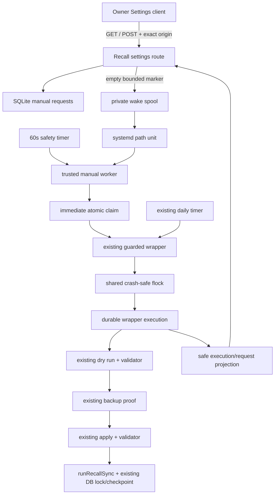

# Technical plan v1: Recall sync status and manual synchronization

Status: v1 for adversarial review
Baseline: `origin/main` at `1cb5d36`
Constraint: implementation and pull request only; feature remains off and production is not changed

## Recommended architecture



The route never calls Recall, spawns the wrapper, executes commands, or controls systemd. The manual worker and daily service both invoke the same wrapper. The wrapper itself obtains a single non-blocking `flock` before any dry-run work and retains it through final validation. Process death releases the OS lock. `tryAcquireRecallSyncLock` remains inside both core invocations as defense in depth.

## Alternatives considered

| Alternative | Decision |
| --- | --- |
| Run inside POST | Reject: HTTP lifetime, retry, crash, privilege, and credential failures. |
| Web process spawns wrapper or invokes systemd | Reject: broad command/service privilege. |
| Separate manual importer | Reject: proof/cap/backup/fidelity/checkpoint drift. |
| Background web worker using only `runRecallSync` | Reject: skips complete guarded wrapper and credential boundary. |
| Only existing core DB lock | Reject as sole control: dry-run/apply interleaving gap. |
| Redis/external queue | Reject: no need in single-owner SQLite deployment. |
| Poll-only trusted worker | Acceptable recovery path, but pair with path activation for start latency. |
| One giant apply transaction | Reject as sole partial-write fix: long contention and poor crash visibility. |
| OS `flock` around wrapper | Preferred v1: small, shared, crash-released, and independent of inner DB lock. |

## Existing pipeline reuse

Manual execution must call `scripts/recall-scheduled-apply.sh` without overriding caps, windows, proofs, fidelity, backup, report validation, checkpoint, or timer settings. The wrapper is extended only to:

1. acquire/release the shared outer `flock`;
2. create and heartbeat a durable wrapper execution;
3. pass validated trigger/request/execution correlation to the existing CLI;
4. persist terminal wrapper validation and safe counts; and
5. persist a trusted timer next-elapse snapshot when invoked by the automatic systemd service.

The importer, mapper, Recall client, fidelity policy, cap evaluation, item dedupe, checkpoint, and inner lock are not duplicated.

## Data model and migration

Create `024_recall_manual_sync.sql` after verifying no newer migration on rebase.

### `recall_sync_requests`

- `id TEXT PRIMARY KEY`
- `trigger TEXT NOT NULL DEFAULT 'manual_ui' CHECK(trigger='manual_ui')`
- `requested_by TEXT NOT NULL CHECK(requested_by='owner_session')`
- `idempotency_key TEXT NOT NULL UNIQUE`
- `state TEXT NOT NULL CHECK(state IN ('queued','claimed','running','done','blocked','error','partial_failure','expired'))`
- `requested_at`, `claimed_at`, `started_at`, `heartbeat_at`, `completed_at`, `expires_at` INTEGER milliseconds
- `execution_id TEXT`, `run_id TEXT` with TEXT linkage
- `safe_reason TEXT` constrained/validated by repository
- typed non-negative `items_imported`, `items_upgraded`, `items_already_current`

Indexes:

- partial unique index on the constant manual trigger while state is queued/claimed/running;
- `(state, requested_at)` claim index;
- `(completed_at DESC)` cooldown/latest index.

### `recall_sync_executions`

Represents the whole guarded wrapper for both triggers:

- `id TEXT PRIMARY KEY`
- `trigger TEXT CHECK(trigger IN ('automatic','manual_ui'))`
- nullable `request_id TEXT`
- `state TEXT CHECK(state IN ('running','done','blocked','error','partial_failure'))`
- `started_at`, `heartbeat_at`, `completed_at`, `wrapper_validated_at`
- nullable `dry_run_id`, `apply_run_id` TEXT
- safe reason and typed aggregate counters

Only `state='done' AND wrapper_validated_at IS NOT NULL` qualifies for last-success. An active automatic execution drives the automatic-running UI.

### Extend `recall_sync_runs`

Add:

- `execution_id TEXT`
- `trigger TEXT NOT NULL DEFAULT 'automatic' CHECK(trigger IN ('automatic','manual_ui'))`
- `request_id TEXT`

The runner receives a stable run ID, inserts `running` before enumeration, persists progress after each applied card transaction, and updates the same row to terminal. Do not correlate by “latest row after timestamp.”

### Existing state

- Keep `checkpoint:last_successful_to` unchanged for coverage.
- Keep `lock:recall_sync` as the inner import guard.
- Store trusted timer `next_elapse` in a constrained safe state row or typed status table; missing/stale is allowed.

## Database concurrency

- Set bounded `busy_timeout` on every application/worker SQLite connection.
- Use `.immediate()` better-sqlite3 transactions for enqueue/dedupe/cooldown, claim, and lock read-modify-write.
- Let the partial unique index arbitrate simultaneous tabs; on constraint conflict, re-read active and return it.
- Retry only idempotent transaction boundaries for bounded `SQLITE_BUSY`; never retry an ambiguous apply automatically.
- Test with two independent database connections/processes.

## Request repository behavior

`enqueueManualRecallSync` in one immediate transaction:

1. expire eligible old queued rows;
2. return matching idempotency row if present;
3. return another active request as deduplicated;
4. calculate cooldown from latest terminal server completion;
5. insert a new queued row with 30-minute expiry.

`claimNextManualRecallSync` atomically updates the oldest queued non-expired row to claimed. Worker moves it to running only after outer wrapper execution starts. Heartbeat updates are monotonic and bounded. Terminal transitions are idempotent and validate counts/reasons.

Stale recovery inspects request heartbeat, matching execution/run, and active locks. If the wrapper already completed, finalize from durable execution. If execution is provably absent and no lock exists, return the same request to queued. Never blindly start a second run.

## Run and partial-write changes

Refactor `runRecallSync` persistence:

- create one run row as `running` before network work;
- update terminal state instead of inserting only at return;
- in apply mode, replace the unguarded `planned.map(importRecallCard)` with an ordered loop;
- after each successful per-card transaction, update aggregate counts on the run/execution/request;
- if a later import throws, persist prior counts, choose internal error classification, and expose product partial only when imported/upgraded > 0;
- never advance checkpoint or wrapper success on partial/error;
- retain current per-card transactions and idempotency.

## Wrapper lifecycle

Add a packaged lifecycle command used only by trusted scripts:

- `start`: after acquiring `flock`, create execution, validate trigger/request, print execution ID.
- `heartbeat`: update execution/request without exposing content.
- `complete`: after final apply validator, link apply run, store counts, set `wrapper_validated_at`, finish request/execution, and make it eligible for last-success.
- `fail`: trap wrapper exit, inspect durable runs/counts, map safe reason, persist blocked/error/partial, and leave last-success/checkpoint unchanged.
- `schedule`: automatic service snapshots the installed timer next-elapse into safe DB status.

The shell traps EXIT/INT/TERM and finalizes lifecycle without printing raw stderr/report content. `flock` contention returns a recognized temporary status: manual work is requeued as the same request; automatic work records a safe blocked execution and does not interleave.

## Worker and systemd behavior

Add:

- bundled `recall-manual-sync-worker-prod.mjs`;
- `brain-recall-manual-sync.service` hardened oneshot;
- `.path` watching a private data spool;
- fallback `.timer` every 60 seconds;
- explicit `TimeoutStartSec` aligned with caps and a heartbeat/stale threshold;
- empty queue no-op.

The route creates a zero-byte marker whose filename is the server request ID. The worker deletes stale markers after consulting SQLite. It claims one request, invokes the existing wrapper with fixed environment correlation, and reconciles terminal state. The timer invokes only this worker and does not call Recall when the queue is empty.

Install units during deploy but do not enable/start the path or fallback timer in this task. Production enablement requires separate authorization.

## Credential boundary

Before production enablement:

- remove the Recall key from the web service’s shared environment;
- deliver it only to the Recall units through systemd `LoadCredential` from a root-owned source or use a distinct Recall service identity/shared data group;
- make the wrapper read the credential file only in trusted service context;
- prove the web unit environment/readable paths do not contain the key while the Recall worker can access it;
- preserve restrictive SQLite/WAL/backup permissions and umask.

V1 implementation may add the unit/config/preflight support with the feature flag off. Host proof is a mandatory enablement gate, not a reason to expose or copy the credential into tests.

## Server status contract

Create shared server-only modules for flags, repository, execution lifecycle, safe reason mapping, timer status, activation, and DTO projection.

`GET /api/settings/recall-sync` returns private/no-store:

```json
{
  "enabled": true,
  "readiness": "ready",
  "activeRequest": null,
  "activeExecution": null,
  "latestOutcome": null,
  "lastSuccessfulAt": "2026-07-10T08:08:00.000Z",
  "nextScheduledAt": "2026-07-10T20:08:00.000Z",
  "retryAfterSeconds": 0
}
```

Allowed readiness values: `ready`, `active`, `connection_attention`, `safety_attention`, `worker_unavailable`, `disabled`.

Allowed safe reasons: `active`, `connection_attention`, `authentication_attention`, `rate_limited`, `safety_attention`, `worker_unavailable`, `internal`, `expired`.

Never return private reports, raw errors/stderr, source IDs/titles/URLs/content, lock owner, host paths, commands, environment names, credentials, or operational parameters.

## POST behavior

- Node runtime and force dynamic.
- Verify session before flag/readiness.
- Require exact same origin.
- Reject body over a small bound before JSON parsing.
- Strict schema `{idempotencyKey: bounded-token}` with no extra fields.
- `202` new durable request; `200` active dedupe; `429` cooldown with rounded `Retry-After`; `400` malformed; `401` unauthenticated; `403` origin; `503` persistence/unavailable.
- If insert succeeds but marker fails, return accepted queued state and log `activation_failed`; fallback timer owns recovery.
- If insert fails, never imply acceptance.

## Client state and polling

Add `src/components/recall-sync-setting.tsx` and pure contract/formatter/reducer helpers.

- Server renders the section only when UI flag is enabled; the route remains independently gated.
- Initial loading GET, two-second visible polling while active, hidden slowdown/pause, immediate visibility/online refresh, stop on terminal/401/disabled.
- Abort on unmount and suppress out-of-order responses.
- Preserve an uncertain POST’s idempotency key until GET resolves acceptance.
- Use Radix Dialog and current tokens/shell.
- Keep all persistent metadata through transient/failure states.
- Detect offline without registering browser Background Sync or automatic replay.

## Authentication and authorization

- Owner session only for GET/POST; bearer/API token is not accepted for this Settings route.
- Exact origin required for POST; missing origin is rejected.
- Cookie stays HttpOnly, Secure in production, SameSite Lax under current auth policy.
- Route verifies auth even though proxy protects it.
- Authentication failure response contains only a safe error code and private headers.

## Rate limiting and expiry

- Five-minute terminal cooldown in enqueue transaction using server time.
- Rounded/capped `retryAfterSeconds` and `Retry-After` header.
- Thirty-minute expiry only for queued/unclaimed work.
- Upstream Recall 429 is a terminal safe `rate_limited` outcome, distinct from manual request cooldown.
- No browser automatic retry of terminal applies.

## Error normalization

Map stage + exit code + persisted counts to a constrained safe reason. Final UI state is partial only when proven writes > 0. Zero-write copy requires proven imported=0 and upgraded=0. Unknown progress uses neutral error copy. Raw error remains private/redacted and is never persisted into public request fields.

## Observability

Emit source-safe structured transition events for viewed, requested, accepted, deduplicated, claimed, started, completed, blocked, failed, partial, rate-limited, and activation-failed where supported by existing logging. Fields are IDs, trigger, previous/new state, timestamps, duration, safe reason, safe aggregates, queue age, dedupe/collision. No third-party analytics.

Operational diagnostics: queue age, stale heartbeat, request/execution/run mismatch, wrapper/inner lock age, last validated success, next-elapse staleness, unit readiness, terminal rates, duration, dedupe/collision.

## Dependencies

No new runtime package is required. Reuse better-sqlite3, zod, Radix Dialog, lucide-react, systemd, shell `flock`, current logger, current tokens, and existing test stack.

## Relevant files

Expected additions/changes include:

- migration `024_recall_manual_sync.sql` and test;
- `src/db/recall-sync.ts`, new request/execution repository and tests;
- `src/lib/recall/sync-runner.ts` and tests;
- new flags/contract/status/activation/formatter modules and tests;
- new API route/setup/tests;
- new Recall Settings client/test and Settings insertion;
- wrapper, lifecycle CLI, manual worker, build/smoke scripts;
- automatic/manual systemd service/path/timer units and deployment checks;
- `.env.example`, docs/wiki, feature artifacts, running log.

## Unit-test plan

- Migration shape/compatibility/FKs/indexes/TEXT linkage.
- Enqueue replay/active dedupe/cooldown/expiry and two-connection race.
- Atomic claim/heartbeat/state matrix/stale reconciliation/SQLITE_BUSY bounds.
- Run stable ID/running progress/late failure/partial counts/checkpoint behavior.
- Outer lock contention and inner lock preservation.
- Wrapper success marker only after final validation.
- Safe reason/DTO privacy and timer snapshot freshness.
- IST formatter/reducer/state copy.

## Integration/route/worker plan

- Auth-first flag behavior, exact origin, body bound/schema, status codes/headers.
- Marker failure after insert and insert failure before acceptance.
- Worker empty queue/path pickup/fallback/competing workers/crash recovery.
- Daily/manual collision across dry-run, backup, apply, final validation.
- Full success/current, safety block, zero-write failure, partial, upstream auth/rate/timeout.
- Web cannot access Recall credential; worker can; both use shared database safely.

## End-to-end and manual verification

- Ready → dialog → queued → running → imported/current.
- Cancel/Escape/focus return and keyboard-only flow.
- Refresh/navigation/reopen/hidden tab/two tabs/offline/session expiry.
- Long-running fixture and lost wake.
- IST rendering under three browser zones and boundary dates.
- Desktop 1440/1024, mobile 390/320, dark, reduced motion, 200% zoom, AA/44px.
- Compare manual fixture proof sequence to automatic wrapper fixture.
- Capture timer properties before/after and prove unchanged.
- Validate production build and full test suite.

## Rollout

1. Land migration/repository/status/worker/routes with UI/units disabled.
2. Land Settings UI behind `BRAIN_RECALL_MANUAL_SYNC_UI_ENABLED=0` by default.
3. Review and merge only through normal PR checks.
4. Separately authorize host credential split, unit install/readiness, timer snapshot, and controlled fixture/manual request.
5. Enable path/fallback/UI only after all gates; observe queue/start/outcomes and next daily completion.

## Rollback

Set the manual UI flag off, disable only the new path/fallback timer, reject new requests, preserve migration/history, allow active trusted work to finish unless the runbook directs otherwise, and leave the daily timer/service/checkpoint untouched. Use forward/revert commits; no destructive down migration or history rewrite.

## Implementation milestones

1. Migration, repositories, busy/immediate transactions, safe contracts.
2. Runner running/progress/partial truth and stable correlation.
3. Outer lock, lifecycle CLI, wrapper integration, trusted worker/units.
4. Route/activation/readiness/timer snapshot/privacy.
5. Settings UI/dialog/polling/formatter/all states.
6. Automated, visual, accessibility, privacy, regression, build evidence.
7. Docs/wiki, adversarial closure, commits/push/PR.

## Risks and blockers

- Same-user/shared-environment credential exposure: implementation support plus host proof required before enablement.
- Long wrapper duration: explicit timeout, heartbeat, and stale threshold must be calibrated above tested worst case.
- OS lock portability/path permissions: systemd host uses Linux `flock`; static and fixture tests required.
- SQLite write contention: busy timeout and immediate transaction tests required.
- Wrapper trap ambiguity after process kill: stale reconciliation must rely on durable execution/run evidence.
- Timer snapshot staleness: expose safe unavailable rather than fabricate.
- Run refactor may regress automatic sync: existing full Recall suites/wrapper smoke and automatic fixture regression are mandatory.

## Open questions for adversarial review

1. Does the proposed execution table create unnecessary duplication with request/run rows, or is it the smallest truthful full-wrapper record?
2. Is non-blocking `flock` plus requeue sufficiently fair, or should the worker use a bounded lock wait?
3. Can `LoadCredential` be proven isolated with the current service identity, or must the PR introduce a distinct Unix identity?
4. Should run progress update after every card or in small batches to balance crash truth and contention?
5. What explicit `TimeoutStartSec`, heartbeat interval, and stale thresholds follow from worst-case caps and 30-second Recall calls?
