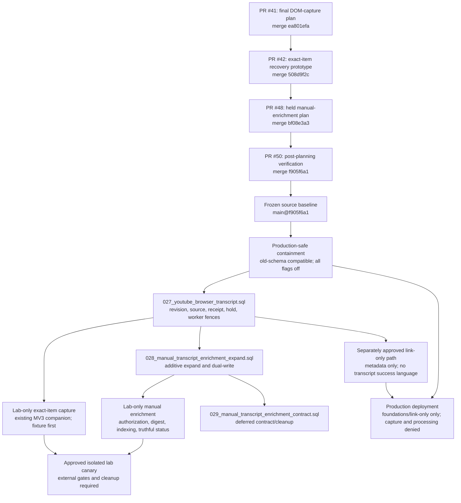

# YouTube Item Recovery Dependency Graph

**Reconciled:** 2026-07-23 (Asia/Kolkata)
**Repository:** `https://github.com/arunpr614/ai-brain.git`
**Protected implementation base:** `origin/main@f905f6a1ef69b5a1b2a986449d61a2e40a7fdee8`
**Status:** planning and verification stack merged; implementation dependencies frozen at the source level

## Outcome

Pull requests #41, #42, #48, and #50 are merged into protected `main`. The two mutable-head events were reconciled before merge:

- PR #42 moved from the verification pin `c22b5aa80bf77f42b6571423299c874c297d0fc5` to merged head `35700f7b469fe9d5c7d02263ab921508949ad201`; the complete `docs/plans/youtube-dom-capture/` tree remained byte-identical.
- PR #48 moved from the verification pin `63effafc2c7601dc5ba52df7f0f96fb5af79ae3f` to merged head `42ad6570854870153ff10a105e380044715ef2fb`; the complete `docs/plans/youtube-item-recovery-enrichment/` tree remained byte-identical.
- PR #50 moved from its local reviewed branch head `b4f2a961160e44103cc8af909be7977d3e1138be` to merged head `9f437f24c2557899117e0b9c1f414a2e5273d24a`; the complete `docs/research/youtube-transcripts/` tree remained byte-identical.

The final merge sequence was #41, #42, #48, then #50. No planning or verification PR introduced or modified a migration relative to its base. Current `main` and the final #42, #48, and #50 heads have identical migration trees.

## Source and implementation graph



The diagram expresses dependencies, not feature-enable authority. A merged schema or code path does not authorize browser capture, held-transcript processing, or a live lab canary.

## Final pull-request topology

| PR | Final state | Base at final update | Final head | Merge commit | Files / diff | Final checks | Reconciled role |
|---|---|---|---|---|---:|---|---|
| [#41](https://github.com/arunpr614/ai-brain/pull/41) | Merged 2026-07-22 08:07:09 UTC | `main@c8c3c215` | `8bfe5274c9c070244d2c5f57898d29fccf012458` | `ea801efa024914d601b495f968153aa5680e2e1e` | 20 / `+6449 -0` | `verify` success; packaging skipped | Final generic DOM-capture PRD and implementation plan |
| [#42](https://github.com/arunpr614/ai-brain/pull/42) | Merged 2026-07-23 02:37:38 UTC | `main@56180c4e` | `35700f7b469fe9d5c7d02263ab921508949ad201` | `508d9f2c1552833d59f3056fa84abd7dadc9ae17` | 13 / `+3164 -2` | Product CI `29974716749`: `verify` success; packaging skipped | Exact-item recovery prototype and Product Council decision |
| [#48](https://github.com/arunpr614/ai-brain/pull/48) | Merged 2026-07-23 02:41:55 UTC | `main@508d9f2c` | `42ad6570854870153ff10a105e380044715ef2fb` | `bf08e3a3500c21e4c860abc85fa273fa936dfd5e` | 51 / `+19358 -0` | Product CI `29974916378`: `verify` success in 3m15s; packaging skipped | Final held-transcript manual-enrichment PRD, UX, plan, and review package |
| [#50](https://github.com/arunpr614/ai-brain/pull/50) | Merged 2026-07-23 02:46:59 UTC | `main@bf08e3a3` | `9f437f24c2557899117e0b9c1f414a2e5273d24a` | `f905f6a1ef69b5a1b2a986449d61a2e40a7fdee8` | 5 / `+709 -1` | Product CI `29975095549`: `verify` success in 2m51s; packaging skipped | Final post-planning GitHub verification and adversarial review |

PR #41's historical head predates `026_notebooklm_export.sql`; that absence is not a pending migration. The current protected base includes #41 and every later migration. PRs #42, #48, and #50 carried the same 28-file migration tree as their then-current bases.

## Head-drift disposition

| Source pin | Final head | Evidence | Disposition |
|---|---|---|---|
| PR #42 `c22b5aa80bf7` | `35700f7b469f` | Tree-object comparison under `docs/plans/youtube-dom-capture/` returned no difference | Merge-only current-main integration; reviewed contract materially unchanged |
| PR #48 `63effafc2c76` | `42ad65708548` | Tree-object comparison under `docs/plans/youtube-item-recovery-enrichment/` returned no difference | Merge-only restack onto merged #42/current main; reviewed contract materially unchanged |
| PR #50 local `b4f2a961160e` | `9f437f24c255` | Tree-object comparison under `docs/research/youtube-transcripts/` returned no difference | Merge-only current-main integration; verification package materially unchanged |

This closes the mutable-head reconciliation requirement. The historical wording in the verification document that #42 and #48 were open remains a dated snapshot, not current status.

## Required implementation order

1. **Freeze `main@f905f6a1`.** Record the repository, worktree, branch, clean tracked state, source hashes, and migration frontier. Do not import whole planning branches; their authoritative content is already on `main`.
2. **Land old-schema-compatible containment.** Production mode denial, worker exclusion, configured-origin helpers, startup compatibility, kill switch, and content-free diagnostics must work on schema 026 before a new migration is allowed to auto-apply.
3. **Implement and independently review migration 027.** It supplies item revision fencing, browser source/policy literals, exact-item intents/grants, one-active-source enforcement, receipts, processing holds, claims, trigger/backfill exclusions, and all-worker hold enforcement while browser capture remains disabled.
4. **Land production-safe link-only separately only after 027 and its gates pass.** It saves metadata only, uses `browser_link_only_v1`, cannot enqueue transcript recovery through SQL/application/standalone paths, and never reports transcript success.
5. **Implement the fixture-only exact-item capture path.** Extend the existing extension; add no persistent YouTube permission or static content script; require explicit Inspect and explicit Add; use synthetic packaged tests before any live activity.
6. **Apply nominal migration 028 only after 027 is frozen and verified.** It is an additive manual-enrichment expand/dual-write migration. Every older supported reader/writer must remain safe or be blocked by startup/release tooling.
7. **Add manual authorization, digest, indexing, status, retry, deletion, and provider-drift behavior.** All provider work remains outside transactions and every apply is fenced by current revision, source, authorization, provider plan, generation, lease, retention, and deletion state.
8. **Defer nominal migration 029.** Contract/cleanup occurs only after transition parity is proven and every incompatible rollback binary is blocked.
9. **Run an approved isolated lab canary only after its external gates pass.** Production browser capture and held-transcript processing remain denied regardless of implementation completeness.

If another migration lands before the new SQL is created, re-inventory `main` and all pending PRs and shift `027`, `028`, and `029` together. A number is not reserved by this document alone.

## Dependency gates

| Dependency | Gate to advance | Current status |
|---|---|---|
| Final planning stack | #41, #42, #48 merged with successful checks | Complete |
| Verification addendum | #50 merged without material tree drift | Complete |
| Source baseline | Worktree at exact protected-main SHA with tracked source clean | Complete at `f905f6a1`; see [implementation baseline](IMPLEMENTATION_BASELINE.md) |
| Migration numbering | Current/pending inventory proves next slot and resolves legacy duplicates | Decision complete; see [migration collision resolution](MIGRATION_COLLISION_RESOLUTION.md) |
| Migration implementation | Exact 027 filename, SHA-256, schema snapshot, preflight, matrix, and adversarial review | Not started; hard gate |
| Link-only implementation | Frozen 027 exclusions plus throwing-fetch/zero-job/trigger/application/standalone-backfill/extension-caller tests | Not started; blocked on 027 |
| Capture implementation | Synthetic/unit/package/security/privacy tests | Not started |
| Manual-enrichment implementation | Frozen 027 plus additive 028, authorization and worker matrices | Not started |
| Live lab | Written target-specific approval, isolated identities/data, cleanup, passing packaged E2E | Blocked pending external gates |
| Production feature enablement | New explicit authority and adversarial release review | Not authorized |

## Reproducible evidence commands

Run from the clean project worktree. These commands are read-only.

```bash
PROJECT='/Users/arun.prakash/Documents/ArunVault2026-2/Initiatives/Arun_AI_Projects/ai-brain/Phase4'

git -C "$PROJECT" remote get-url origin
git -C "$PROJECT" rev-parse HEAD
git -C "$PROJECT" worktree list --porcelain

gh api repos/arunpr614/ai-brain/branches/main \
  --jq '{name,sha:.commit.sha,protected}'

for pr_number in 41 42 48 50; do
  gh pr view "$pr_number" --repo arunpr614/ai-brain \
    --json number,state,baseRefName,baseRefOid,headRefName,headRefOid,mergeCommit,mergedAt,files,statusCheckRollup
done

gh run view 29974716749 --repo arunpr614/ai-brain --json status,conclusion,jobs,url
gh run view 29974916378 --repo arunpr614/ai-brain --json status,conclusion,jobs,url
gh run view 29975095549 --repo arunpr614/ai-brain --json status,conclusion,jobs,url

gh api 'repos/arunpr614/ai-brain/compare/bf08e3a3500c21e4c860abc85fa273fa936dfd5e...9f437f24c2557899117e0b9c1f414a2e5273d24a' \
  --jq '{status,ahead_by,behind_by,total_commits,merge_base:.merge_base_commit.sha,file_count:(.files|length)}'
```

Observed final results:

- protected `main`: `f905f6a1ef69b5a1b2a986449d61a2e40a7fdee8`;
- all four PRs: `MERGED`;
- #42, #48, and #50 `verify`: success;
- packaging jobs: skipped because these were not main-release packaging events;
- #50 before merge: 3 commits ahead, 0 behind, 5 changed files, merge base `bf08e3a3`;
- no migration-tree difference between final main and the updated planning/verification heads.

The CI runs emitted a non-blocking GitHub Actions annotation that Node.js 20 actions are being forced onto Node.js 24. It did not fail any run and is unrelated to the migration-number decision, but it should be tracked as release-tool maintenance.

## Stop conditions

- Do not proceed past migration implementation until 027 has a frozen hash/schema and the binary/schema matrix passes.
- Do not enable capture or processing merely because #41/#42/#48/#50 are merged.
- Do not perform a live YouTube inspection without the separately approved lab authority.
- Do not use a whole planning branch as an implementation base; use current `main` and preserve provenance through these records.
- Stop and re-reconcile if `origin/main`, a pending migration, or any non-negotiable privacy/release decision changes.
