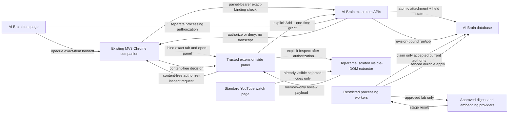
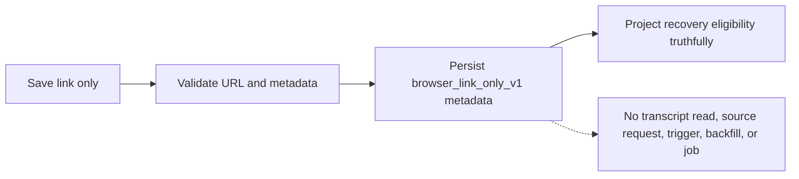

# Architecture and End-to-End Data Flow

## Status notation

- **Current:** exists on the branch or current main.
- **Accepted contract:** specified and reviewed but not necessarily implemented.
- **Planned:** required by the final artifacts and traceability.
- **Denied:** must not execute in the named environment.

## System boundaries

The diagram is the target architecture. At handover, only production-safe containment and Stage 2 prerequisite foundations exist. The Chrome, exact-item, manual-processing, and provider edges are not implemented.

## Existing Chrome companion boundary

The final sources require the existing MV3 companion to be extended. The ordinary popup, pairing, and existing behavior must continue.

### Planned recovery surface

- A per-tab side panel or approved popup lifecycle.
- Exact item-to-tab binding.
- No static content script.
- No persistent YouTube host permission.
- Temporary `activeTab` grant.
- Top-frame isolated `executeScript`.
- A pure extractor module with no network, storage, cookie, player-response, or account access.
- A review screen that owns transient content.
- Service worker holds pairing authority and fixed destinations, but never transcript text.

### Lifecycle invalidation

Invalidate on:

- navigation or canonical video drift;
- tab close or movement that invalidates the binding;
- extension reload;
- panel document close/remount;
- intent or grant expiry;
- extension/version/contract drift;
- track/language change;
- extractor completeness drift;
- cross-tab, cross-window, or cross-video substitution; and
- loss of the temporary grant.

Do not depend on `sidePanel.onClosed`; Chrome 116 is the frozen minimum, while that event is newer.

## Exact-item intent and two-channel transfer

Decision D-008 separates content and authority.

### Channel 1: opaque handoff

Only the exact configured Brain HTTPS page origin may initiate the extension handoff. The handoff contains opaque, non-content intent material and binds:

- user/account;
- exact item and item revision;
- canonical video ID;
- extension version;
- contract version;
- expiry and return path.

The page cannot provide transcript content, a bearer token, or a destination URL.

### Pre-read authorization

The following order is normative:

1. the Brain item sends only the opaque exact-item handoff to the service worker;
2. the panel sends a content-free `authorize inspect` request through the
   service worker;
3. the service worker uses its paired bearer only against the compile-time exact
   lab API;
4. the server validates the current user/item/revision/video/extension/contract,
   expiry, mode, destination, and origin binding;
5. the panel receives only an authorized/denied decision;
6. only after authorization and the user's explicit **Inspect visible
   transcript** action may the isolated extractor read the already visible
   selected YouTube DOM; and
7. authorization failure, expiry, drift, or substitution produces zero DOM
   reads.

### Channel 2: Add-confirmed content upload

1. The service worker uses its paired bearer only against a compile-time exact HTTPS lab destination.
2. It requests a short-lived one-time upload grant for the exact intended body.
3. The server stores only the grant hash.
4. The trusted panel receives the secret grant.
5. Narrow non-credentialed CORS accepts only the approved `chrome-extension://<id>` requester origin.
6. The panel uploads the Add-confirmed content directly.
7. The server recomputes body size, normalization, hashes, classification, user/item/revision/video/extension/expiry policy, and destination authority.
8. Commit consumes intent and grant atomically with the attachment receipt.

Forbidden fallbacks:

- transcript-bearing runtime messages;
- service-worker transcript queues or globals;
- page-selected destinations;
- broad CORS;
- paired bearer exposed to panel/page;
- reusable upload grants;
- content in extension storage;
- worker or page content buffering; and
- URL-dedup destination substitution.

The frozen
[two-channel transfer addendum](../../decisions/TWO_CHANNEL_TRANSFER_ADDENDUM.md)
is authoritative. This summary cannot waive or reorder any endpoint, origin,
bearer, body-read, or response-loss requirement.

The production extension bundle must contain no recovery destination, recovery
panel, transcript extractor, upload-grant, or recovery-handoff code. Runtime
denial alone cannot satisfy that package-absence requirement.

## Visible-DOM extractor contract

### Inputs

- exact bound tab/frame;
- standard watch-page identity;
- exact canonical video ID;
- explicit user inspect action;
- bounded renderer/track context; and
- current contract/extractor version.

### Outputs

- ordered cues;
- selected language/track evidence;
- cue count;
- completeness and traversal evidence;
- bounded size/count facts;
- canonical video identity; and
- no stable account/session facts.

### Required behavior

- Traverse modern, legacy, and virtualized transcript renderers.
- Preserve repeated equal cues.
- Detect missing cues, gaps, DOM recycling, track changes, navigation, and renderer drift.
- Fail closed when completeness cannot be established.
- Generate no external fixture request.
- Treat HTML-like transcript text as text.
- Never read hidden caption APIs, player responses, signed URLs, cookies, storage, or Google identity.

## Planned server attachment transaction

The exact transaction must:

1. classify deployment and capability before reading content;
2. authenticate user and exact origin;
3. validate extension and contract versions;
4. validate and consume unexpired intent/grant authority;
5. load the exact item and expected revision;
6. recompute video identity, normalization, content hash, cue facts, and source classification;
7. reject stale, duplicate-different, conflicting, or ineligible state;
8. preserve or deterministically replace the one active source according to contract;
9. persist source and ordered segments;
10. advance content revision for body change;
11. create an idempotent attachment/reconciliation receipt;
12. establish the processing hold;
13. fence or invalidate stale background work;
14. commit atomically; and
15. return truthful durable status.

Lost response plus retry must return the same accepted receipt without duplicating mutation.

## Planned Stage 2 data model

The frozen addendum specifies, among other structures:

- item instance and content revision;
- rebuilt capture-policy decisions;
- transcript sources and ordered segments;
- processing holds;
- executable request authority;
- item request tombstones;
- recovery apply receipts;
- async job/attempt generation and fencing fields;
- retention/deletion state;
- exact indexes, checks, triggers, and migration-ledger attestation; and
- sealed S28 connection/package authority.

Do not translate this summary into SQL. The exact 16,988-line contract and AC registry govern the migration.

## Held state and manual processing

### Held projection

After attachment:

- the transcript is durably attached;
- no provider dispatch has occurred;
- ordinary generic enrichment/embedding/batch/recovery paths cannot claim it;
- optional recovery notes stay AI-off where specified; and
- UI copy must not imply processing, completion, or provider activity.

### Authorization plan

The user reviews:

- exact current transcript/source/revision fingerprint;
- provider-plan wire version;
- each provider-plan entry fingerprint;
- authorization-input version;
- authorization-context version;
- provider/model disclosure;
- retention and delete-by clocks;
- expected digest/index output; and
- whether the environment is authorized to execute.

Capture approval cannot substitute for this authorization.

### Processing state machine

```mermaid
stateDiagram-v2
  [*] --> Held
  Held --> ReviewPlan: user opens manual plan
  ReviewPlan --> Authorized: exact consent accepted
  ReviewPlan --> Held: cancel or drift
  Authorized --> DigestQueued: idempotent request
  DigestQueued --> DigestRunning: exact claim
  DigestRunning --> DigestReady: durable current digest
  DigestRunning --> DigestRetryableFailed: retryable failure
  DigestRunning --> DigestTerminalFailed: terminal failure
  DigestRunning --> DigestOutcomeUnknown: ambiguous provider acceptance
  DigestOutcomeUnknown --> DigestReady: reconciliation proves accepted current digest
  DigestOutcomeUnknown --> DigestRetryableFailed: reconciliation proves non-acceptance
  DigestOutcomeUnknown --> DigestTerminalFailed: reconciliation proves terminal outcome
  DigestRetryableFailed --> DigestQueued: same authority; new attempt and claim token; max 3
  DigestRetryableFailed --> ReviewPlan: expired or drifted context requires new authorization
  DigestReady --> IndexQueued: current-space index needed
  IndexQueued --> IndexRunning: exact claim
  IndexRunning --> Complete: durable current embedding/index
  IndexRunning --> IndexRetryablePartial: digest remains; retryable index failure
  IndexRunning --> IndexTerminalPartial: digest remains; terminal index failure
  IndexRunning --> IndexOutcomeUnknown: ambiguous index acceptance
  IndexOutcomeUnknown --> Complete: reconciliation proves accepted current index
  IndexOutcomeUnknown --> IndexRetryablePartial: reconciliation proves non-acceptance
  IndexOutcomeUnknown --> IndexTerminalPartial: reconciliation proves terminal outcome
  IndexRetryablePartial --> IndexQueued: new index generation; exact digest reused
  IndexRetryablePartial --> ReviewPlan: expired or drifted context requires new authorization
  Authorized --> Stale: source/revision/policy/provider drift
  DigestQueued --> Deleted: item/source deletion
  DigestRunning --> Deleted: late apply fenced
  IndexRunning --> Deleted: late apply fenced
  Complete --> Stale: later source/revision changes
```

Every transition revalidates source, item instance, content revision,
authorization context, provider plan, generation, token, hold, deletion, mode,
clock, and current policy.

- Automatic digest retry retains the same accepted run and stage generation,
  creates a fresh attempt and claim token, and stops after three attempts.
- An explicit digest retry uses a new mutation identifier and may allocate a new
  digest job generation only while the exact unexpired input and context remain
  current; drift returns to `ReviewPlan`.
- `DigestOutcomeUnknown` and `IndexOutcomeUnknown` are durable quarantine states.
  They permit read-only reconciliation only, never blind redispatch. A
  reconciler may transition to the accepted, retryable, or terminal result only
  from durable provider/index evidence. Expiry or drift fences the old
  authorization and any late apply but does not release the quarantine. Only
  after reconciliation proves non-acceptance may the retryable state return to
  `ReviewPlan` for new authorization.
- Index retry advances only the embedding/index generation, reuses the exact
  current digest, and makes zero digest-provider calls.
- Terminal states have no automatic outgoing transition.
- Any late result from an older attempt or generation fails the apply gate.

## Claim, dispatch, and apply barriers

Each processing stage must separate:

- **claim:** reserve only currently eligible work;
- **dispatch:** revalidate immediately before external contact and record durable dispatch facts;
- **apply:** revalidate again before durable output;
- **finalize:** record exact current durable stage outcome.

Ambiguous provider acceptance must not permit a duplicate submit. Provider facts must remain content-free and privacy-safe.

## Current Stage 1 containment architecture

Current branch code already establishes:

- denial-wins deployment classification;
- private no-store restricted responses;
- configured public-origin parsing/comparison;
- old-schema tri-state capability behavior;
- worker-mode resolution;
- held/incompatible no-claim behavior in existing paths;
- pre-dispatch batch reservation and ambiguous-outcome quarantine;
- mixed-artifact capability checks; and
- privacy-safe status/UI projection.

Future feature code must reuse these boundaries rather than invent parallel classification, origin, worker, or release authority.

## Link-only architecture

The link-only path must be independent:

All existing literal Save-link callers, duplicate paths, triggers, standalone backfills, and recovery workers must be included in the zero-transcript-work proof.

## Production architecture

Production must stop restricted work at multiple layers:

1. code-level capability denial;
2. authoritative deployment classification;
3. worker-mode exclusion;
4. schema/source/package readiness;
5. route denial before body processing;
6. no grant destination;
7. hold-aware claim/dispatch/apply fences;
8. provider dispatch absence;
9. content-free observability; and
10. release activation/rollback provenance.

Flags, approval identifiers, manifests, request fields, extension state, or provider settings may narrow authority only. They cannot override production denial.
