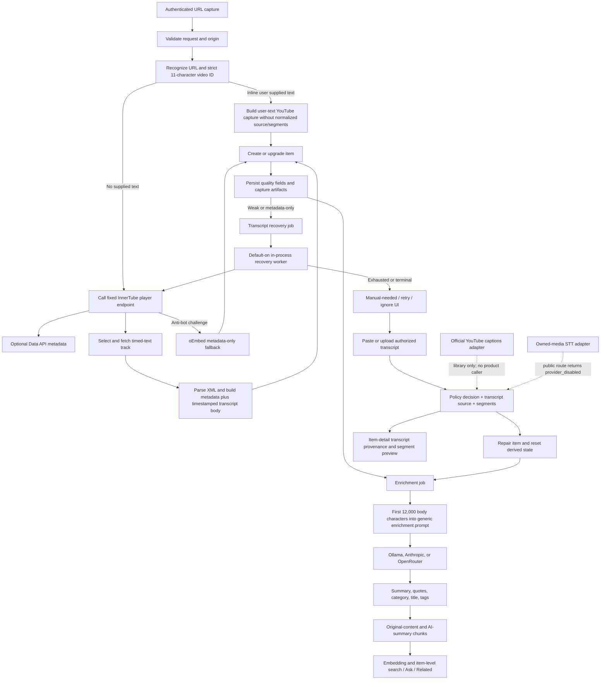

# Current YouTube Processing Flow

**Status:** Verified from code at `ad78d77495dcaa90f62aab038fe63ae95cf36862`; runtime flags and external services were not exercised. 
**Audited:** 2026-07-16

## State boundaries

| Stage | Durable state | Truthful recovery behavior | Gap |
|---|---|---|---|
| Capture | `items`, quality fields, artifacts/cache | Full, limited, metadata-only, duplicate, or failure result | Automatic path does not write the policy/source records used by manual paths |
| Transcript recovery | `transcript_jobs`, `transcript_attempts`, provider-health state | Retryable, manual-needed, ignored, done | Worker retries an unofficial method automatically and can extend throttled attempts |
| Normalized transcript | `capture_policy_decisions`, `transcript_sources`, `transcript_segments` | Active/superseded source tombstone, timestamp mode, hash, declared rights/retention | Dedicated repair plus official/STT libraries use it; automatic and inline-paste capture do not; current rights/retention are labels rather than enforced lifecycle controls |
| Enrichment | `enrichment_jobs`, item generated fields, tags/topics | Pending, running, done, error; three worker attempts | Long input truncation and no evidence/grounding contract |
| Indexing | FTS item row, chunks, vectors, embedding jobs | Independent embedding error state | No segment/timestamp index; results resolve to items/chunks |

## Alternative transcript paths

- **Available:** user paste and VTT/SRT/TXT/Markdown upload for an existing YouTube item.
- **Implemented but inactive:** creator-authorized `captions.list`/`captions.download` adapter.
- **Implemented but disabled:** uploaded owned-media STT route and provider adapter.
- **Active but compliance-unresolved:** public automatic InnerTube/timed-text extraction and recovery.

The current body builder prepends metadata, description, and chapters when available; it is not a pure transcript. This matters because generic FTS/chunking and the first-12,000-character enrichment window consume the composed body.
