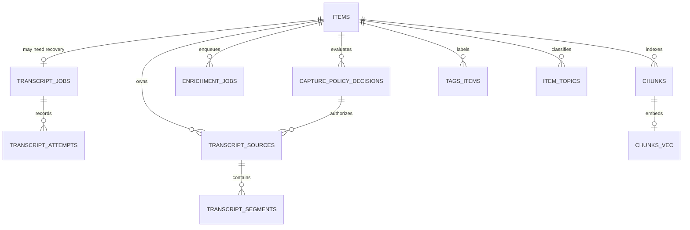

# Existing Data-Model Summary

**Baseline:** `ad78d77495dcaa90f62aab038fe63ae95cf36862` 
**Audited:** 2026-07-16

## Current records

| Record | Purpose | Key fields relevant here | Finding |
|---|---|---|---|
| `items` | Canonical saved item and generated digest | `source_type`, URL, title/body, summary/quotes/category, author/duration, extraction warning, quality/platform/method/version, enrichment state | Automatic transcript text is stored in `body`; source and generated data are coupled at item level |
| `capture_artifacts` / metadata cache | Bounded raw evidence and metadata reuse | Kind, content type, file/path or body metadata, source/version | Automatic timed-text XML can be retained as an artifact without a corresponding transcript-policy decision |
| `transcript_jobs` | Durable recovery queue | State, attempts/max attempts, provider/error, next/claim/complete times | Six user-relevant states and a default five-attempt budget |
| `transcript_attempts` | Per-provider attempt trail | Provider, outcome, retryability, status/error, duration, language/generated/translated, chars/artifacts | Useful operational evidence; does not establish rights or policy posture |
| `capture_policy_decisions` | Machine-readable acquisition decision | Platform/environment, rights basis, method, retention, block reason, production allowed, legal approval ID | Used by manual/official/STT library paths, not automatic InnerTube capture/recovery |
| `transcript_sources` | Source provenance and supersession tombstone | Source kind, language/caption class, timestamp mode, provenance JSON, retention, text hash, segment count, active/superseded status | Not universal; superseded segments are deleted, so this is not full transcript version history |
| `transcript_segments` | Timed normalized text | Index, start/duration/end, text/hash, token count, confidence | Missing speaker, processing version, partial/complete status, and segment-level error/provenance fields |
| `enrichment_jobs` | Async generic generation | State, attempts, claim/complete/error | Separate from transcript state, so partial success is possible |
| `llm_usage` | Generation usage ledger | Provider, model, purpose, tokens, cost, month | Schema/pipeline cannot truthfully represent current OpenRouter usage; external calls can be recorded as Ollama/Qwen/zero cost |
| `items_fts` | Item keyword index | Title and body | Transcript is searchable only as whole-item body text |
| `chunks` / vector bridge | Semantic index units | Item, source kind, epoch/version, index, body/tokens | Source kinds distinguish original, AI summary, note, legacy; no transcript-segment source kind or timestamp metadata |
| Tags/topics | Manual and generated organization | Tag provenance, topic evidence | Generic enrichment can attach AI tags/topics but has no timestamp evidence |

## Normalization gap

The repository has two transcript models in practice:

1. **Legacy item-body model:** automatic captions and inline pasted URL-capture text are formatted into `items.body`; raw/user-text artifacts may be retained; automatic recovery attempts are durable.
2. **Policy-aware normalized model:** a policy decision authorizes a transcript source, which owns hashed segments and can supersede earlier sources.

Until every supported acquisition method writes the second model, provenance, retention, deletion, timestamp evidence, and reprocessing cannot be applied consistently. The split exists even between two user-provided-text surfaces: inline URL capture uses the legacy model, while the dedicated transcript repair API uses the normalized model.

## Minimum future contract implied by the gate

This is an audit conclusion, not an implementation plan. A normalized record evaluated at Gate 3 must additionally express source method, language, caption type, start/end, speaker when available, confidence, provenance, a first-class/queryable processing version, partial/complete state, and error information. Current adapters place some version strings inconsistently in provenance JSON and paste can omit them. Search/index records need a stable link back to the transcript source and timestamp range rather than only to the item.
