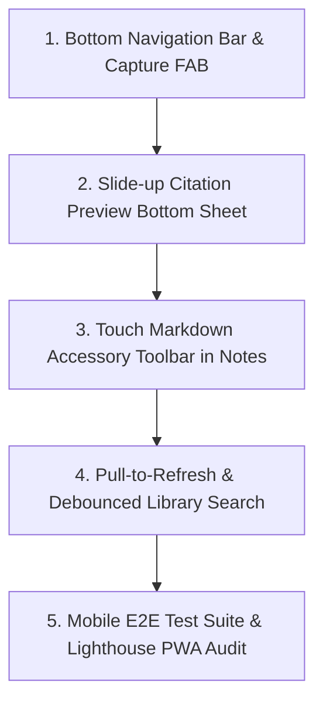

# AI Brain — Phase 14 Agent Handover Document

> **Target Project**: AI Brain / AI Memory  
> **Phase**: Phase 14 — Mobile PWA & Android Companion (Pixel 7 Pro Reader, Capture & AI)  
> **Milestone**: Milestone 20 (`v0.18.x - Phase 14: Mobile PWA & Android Companion (Pixel 7 Pro Reader, Capture & AI)`)  
> **GitHub Project**: Project #3 (`AI Brain / AI Memory` — `PVT_kwHOD9kkX84BghB8`)  
> **Phase Option ID**: `Phase 14 - Mobile PWA & Android Companion` (`2386c9fa`)  
> **Date**: August 2026  

---

## 1. Environment, Worktree & Project Directories

Incoming agents **must** operate inside the dedicated Phase 14 git worktree and branch:

| Resource | Path / Identifier | Notes |
|---|---|---|
| **Git Repository** | `https://github.com/arunpr614/ai-brain` | Primary GitHub remote |
| **Dedicated Worktree Directory** | `/Users/arun.prakash/Documents/ArunVault2026-2/Initiatives/Arun_AI_Projects/ai-brain/AGY_Phase14_Aug2026` | **Active working directory for all commands & edits** |
| **Parent Repository Directory** | `/Users/arun.prakash/Documents/ArunVault2026-2/Initiatives/Arun_AI_Projects/ai-brain` | Main repository root |
| **Active Git Branch** | `feat/phase14-mobile-pwa` | Pushed & tracked with `origin/feat/phase14-mobile-pwa` |
| **Latest Commit** | `120423f` (or newer) | `fix(prototype): resolve OLED Black button overflow...` |

---

## 2. Hardware & Device Context (Google Pixel 7 Pro)

The mobile experience is specifically designed and calibrated for **Google Pixel 7 Pro**:

- **Display**: 6.7" OLED, $1440 \times 3120$ physical resolution, 19.5:9 aspect ratio, 120Hz LTPO variable refresh rate.
- **CSS Viewport**: $412\text{px} \times 890\text{px}$ (device pixel ratio $\approx 3.5$).
- **Posture**: **Editorial Reader & Agile Capture Companion**.
  - Not replicating dense desktop multi-select, bulk admin, or complex settings matrices.
  - Focused on: (1) Fast mobile library browsing with swipeable chips, (2) Distraction-free Reading Studio with synchronized YouTube transcripts, (3) Touch markdown note editing with 1-tap AI synthesis append, (4) Grounded conversational Ask AI with touch citations, (5) Android native system share target ingestion, and (6) Offline cache & memory hygiene.
- **Ergonomics**: Primary action zones in bottom 60% of screen (thumb reach), minimum touch targets $\ge 48 \times 48\text{px}$, and safe-area inset preservation for gesture pill and punch-hole camera.

---

## 3. Finalized Interactive Prototype Suite

The interactive prototype has been fully implemented, validated, and styled. Use it as the gold-standard reference for UI behavior:

- **Local File**: [`PHASE14_PIXEL7_PRO_PWA_PROTOTYPE.html`](file:///Users/arun.prakash/Documents/ArunVault2026-2/Initiatives/Arun_AI_Projects/ai-brain/AGY_Phase14_Aug2026/PHASE14_PIXEL7_PRO_PWA_PROTOTYPE.html)
- **Public Route**: [`public/prototype/phase14-pwa.html`](file:///Users/arun.prakash/Documents/ArunVault2026-2/Initiatives/Arun_AI_Projects/ai-brain/AGY_Phase14_Aug2026/public/prototype/phase14-pwa.html)
- **Architecture Evaluation**: [`docs/plans/v0.18.0-phase14-arch-evaluation.md`](file:///Users/arun.prakash/Documents/ArunVault2026-2/Initiatives/Arun_AI_Projects/ai-brain/AGY_Phase14_Aug2026/docs/plans/v0.18.0-phase14-arch-evaluation.md)
- **UX & Design Specification**: [`docs/plans/v0.18.0-phase14-mobile-ux-spec.md`](file:///Users/arun.prakash/Documents/ArunVault2026-2/Initiatives/Arun_AI_Projects/ai-brain/AGY_Phase14_Aug2026/docs/plans/v0.18.0-phase14-mobile-ux-spec.md)

---

## 4. GitHub Milestone 20 Issues Breakdown

All 11 issues belong to **Milestone 20** and are linked to **GitHub Project 3** with field `Phase = Phase 14 - Mobile PWA & Android Companion`:

| Issue # | Type | Title | Status | Primary File / Responsibility |
|---|---|---|---|---|
| [**#167**](https://github.com/arunpr614/ai-brain/issues/167) | `SPIKE` | Comprehensive Architecture Evaluation: Native Android vs PWA | `Done` | `docs/plans/v0.18.0-phase14-arch-evaluation.md` |
| [**#168**](https://github.com/arunpr614/ai-brain/issues/168) | `DESIGN` | Pixel 7 Pro Mobile-First Design System & UX Spec | `Done` | `docs/plans/v0.18.0-phase14-mobile-ux-spec.md` |
| [**#169**](https://github.com/arunpr614/ai-brain/issues/169) | `FEAT` | Mobile Library View with Fast Touch Filtering & Search | `In Progress` | `src/components/mobile-library-filters.tsx`, `library-list.tsx` |
| [**#170**](https://github.com/arunpr614/ai-brain/issues/170) | `FEAT` | Mobile Reading Studio & YouTube Synchronized Scrubber | `In Progress` | `src/components/reading-studio/reading-studio-app.tsx` |
| [**#171**](https://github.com/arunpr614/ai-brain/issues/171) | `FEAT` | Touch-Optimized Mobile Note Editor with AI Synthesis | `In Progress` | `src/components/reading-studio/multi-layer-companion-tabs.tsx` |
| [**#172**](https://github.com/arunpr614/ai-brain/issues/172) | `FEAT` | Mobile Conversational AI Companion & Touch Citations | `In Progress` | `src/app/ask/page.tsx`, citation drawer component |
| [**#173**](https://github.com/arunpr614/ai-brain/issues/173) | `FEAT` | 1-Tap Quick Capture Modal & Web Share Target API | `In Progress` | `src/app/capture/page.tsx`, `src/app/capture/tabs.tsx` |
| [**#174**](https://github.com/arunpr614/ai-brain/issues/174) | `FEAT` | Service Worker Offline Cache & PWA App Shell | `In Progress` | `public/manifest.webmanifest`, `public/sw.js` (v6) |
| [**#175**](https://github.com/arunpr614/ai-brain/issues/175) | `TEST` | Mobile E2E Test Suite & Pixel 7 Pro Certification | `Todo` | `src/lib/pwa-mobile.test.ts`, ergonomics audit |
| [**#176**](https://github.com/arunpr614/ai-brain/issues/176) | `FEAT` | Explicit Per-Item Offline Caching & Storage Free-Up | `In Progress` | `src/lib/offline/offline-storage-manager.ts`, `item-offline-toggle.tsx` |
| [**#177**](https://github.com/arunpr614/ai-brain/issues/177) | `FEAT` | Mobile More & Settings Hub (Memory & Diagnostics) | `In Progress` | `src/app/more/page.tsx`, `offline-storage-card.tsx` |

---

## 5. What Has Been Completed & Committed

1. **PWA Engine & Web Share Target Integration** (Issues #173, #174):
   - `public/manifest.webmanifest`: Configured `display: "standalone"`, `orientation: "portrait-primary"`, `theme_color`, `share_target` (`/capture`), and app shortcuts.
   - `public/sw.js`: Bumped cache namespace to `v6` (`ai-memory-shell-v6`, `ai-memory-static-v6`, `ai-memory-pages-v6`). Enabled dynamic Stale-While-Revalidate caching for `/library`, `/ask`, `/more`, `/items/:id`, and `/library/:id/read`.
   - `src/app/capture/page.tsx` & `tabs.tsx`: Added URL extraction regex and auto-routing for text shared from the Android OS share sheet.
   - `src/app/layout.tsx`: Configured Next.js `Viewport` export (`viewportFit: "cover"`, adaptive `themeColor`).
2. **Per-Item Offline Storage & Memory Free-Up Engine** (Issue #176):
   - `src/lib/offline/offline-storage-manager.ts`: Implemented `isItemAvailableOffline`, `cacheItemForOffline`, `removeItemFromOffline`, `getOfflineStorageStats` (using `navigator.storage.estimate()`), and `freeUpAllOfflineStorage`.
   - `src/components/item-offline-toggle.tsx`: Client toggle and badges (`✓ Offline Ready (size MB)` / `☁️ Stream Only` / `Make Offline`).
   - Integrated into `src/components/library-list.tsx` (card metadata) and `src/components/reading-studio/reading-studio-app.tsx` (header bar).
3. **More & Settings Hub** (Issue #177):
   - `src/components/offline-storage-card.tsx`: Real-time storage consumption meter, PWA standalone status badge, Share Target diagnostic indicator, and 1-tap "Free Up Memory" button.
   - `src/app/more/page.tsx`: Embedded "Offline Memory & Storage" section.
4. **Library & Reading Studio Touch Controls** (Issues #169, #170, #171):
   - `src/components/mobile-library-filters.tsx`: Horizontal scrollable filter chips.
   - `src/components/reading-studio/multi-layer-companion-tabs.tsx`: 1-tap "Add to Notes" on AI summaries and quotes.
   - `src/components/reading-studio/reading-studio-app.tsx`: Tokenized theme styles for mobile segmented switcher.
5. **Interactive Prototype Suite & Fixes**:
   - Fixed 3-column responsive grid for Theme Switcher (`Calm Light`, `Slate Dark`, `OLED Black` with 0% battery draw).
   - Fully synchronized YouTube timeline scrubber, citation bottom sheet, and quick capture sheet.

---

## 6. Implementation Roadmap for Next Agent

When the user asks to start implementation, proceed in this exact sequence:



### Step-by-Step Task Breakdown:

1. **Step 1: Global Mobile Navigation Bar & Central Capture FAB (Issue #173)**
   - Create `src/components/mobile-bottom-nav.tsx` with 4 items: `Library` (`/library`), `Ask AI` (`/ask`), `More` (`/more`), and central elevated `+` FAB opening the Quick Capture sheet.
   - Render in mobile layouts (`hidden md:flex`).
2. **Step 2: Citation Preview Bottom Sheet Drawer (Issue #172)**
   - Build `src/components/reading-studio/citation-preview-drawer.tsx`.
   - When citation chips (`[08:30]` / `[1]`) are tapped in `/ask` or in-item reader, open slide-up drawer showing excerpt and a "Jump to Passage in Reader" action.
3. **Step 3: Touch Markdown Accessory Toolbar (Issue #171)**
   - In `src/components/reading-studio/multi-layer-companion-tabs.tsx`, add the virtual touch accessory bar (`H2`, `B`, `I`, `•`, `☑`, `“`, `+ AI Brief`) above the software keyboard.
4. **Step 4: Pull-to-Refresh & Instant Debounced Search (Issue #169)**
   - Add touch-based pull-to-refresh on `/library` and debounce search queries at 150ms.
5. **Step 5: Automated Mobile E2E Tests & Audit (Issue #175)**
   - Expand `src/lib/pwa-mobile.test.ts` to test all mobile routes, offline fallbacks, and 48px touch target ergonomics.
   - Run Lighthouse PWA audit to certify 100% installability.

---

## 7. Verification Commands & Health Checks

Run these commands inside `/Users/arun.prakash/Documents/ArunVault2026-2/Initiatives/Arun_AI_Projects/ai-brain/AGY_Phase14_Aug2026`:

```bash
# 1. Run full test suite (must pass 1,116+ tests)
npm test

# 2. Run offline storage unit test
node --import tsx --test "src/lib/offline/offline-storage-manager.test.ts"

# 3. TypeScript typecheck (0 errors)
npm run typecheck

# 4. ESLint check
npm run lint

# 5. Production Next.js build
npm run build
```

---

## 8. Summary of File Locations

```
AGY_Phase14_Aug2026/
├── PHASE14_PIXEL7_PRO_PWA_PROTOTYPE.html            <-- Finalized prototype
├── public/
│   ├── manifest.webmanifest                         <-- PWA manifest & share_target
│   ├── sw.js                                        <-- Service worker v6
│   └── prototype/phase14-pwa.html                   <-- Public prototype route
├── src/
│   ├── app/
│   │   ├── layout.tsx                               <-- ViewportFit & themeColor
│   │   ├── capture/                                 <-- Share target parser
│   │   └── more/page.tsx                            <-- More & Settings hub
│   ├── components/
│   │   ├── item-offline-toggle.tsx                  <-- Per-item offline badge/button
│   │   ├── offline-storage-card.tsx                 <-- Storage meter & cleaner
│   │   ├── mobile-library-filters.tsx               <-- Swipeable chip carousel
│   │   └── reading-studio/                          <-- Reading Studio mobile components
│   └── lib/
│       ├── offline/offline-storage-manager.ts       <-- CacheStorage & quota controller
│       └── offline/offline-storage-manager.test.ts  <-- Storage unit tests
└── docs/
    ├── plans/v0.18.0-phase14-arch-evaluation.md     <-- Architecture spike (Issue #167)
    ├── plans/v0.18.0-phase14-mobile-ux-spec.md      <-- UX design spec (Issue #168)
    └── handover/phase14-agent-handover.md           <-- This handover document
```
