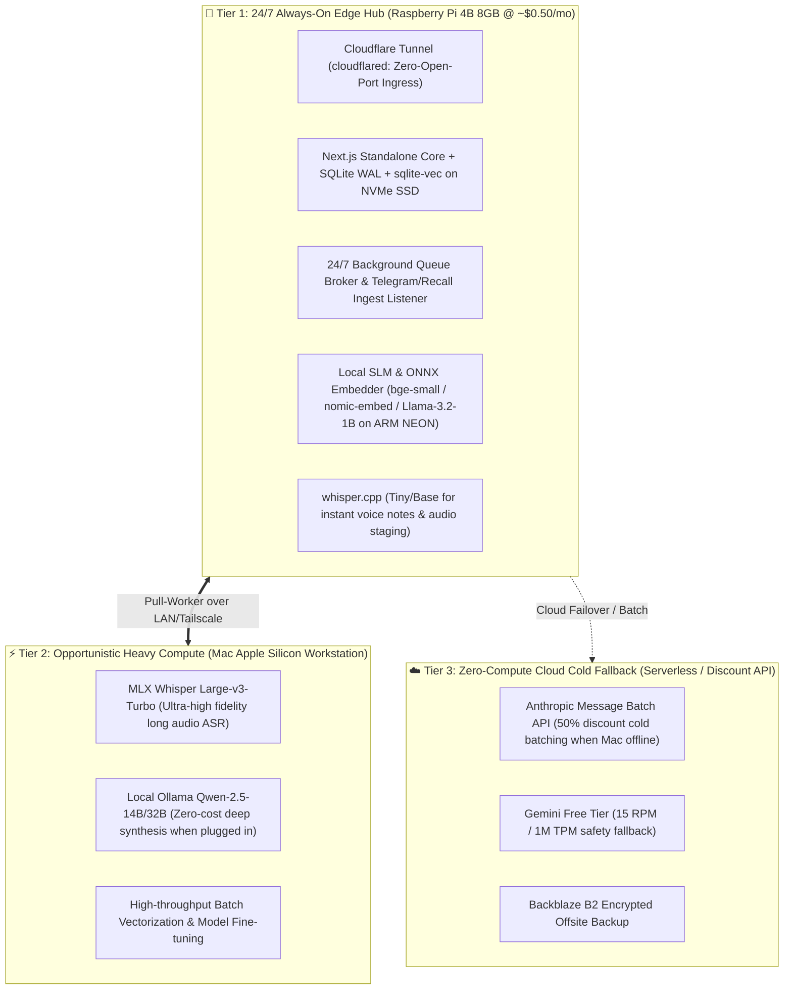

# 🏛️ Phase 8 Architectural Research Blueprint: Edge Efficiency, Cost Minimization & Raspberry Pi 4B Integration

**Document Version:** `1.0.0`  
**Author:** Antigravity AI  
**Project:** AI Brain (`arunpr614/ai-brain`)  
**Milestone:** [`v0.13.x - Phase 8: Architecture Efficiency, Cost Reduction & Raspberry Pi 4 Edge Research`](https://github.com/arunpr614/ai-brain/milestone/15)  
**Board:** [GitHub Project #3 — AI Brain Roadmap](https://github.com/users/arunpr614/projects/3)  
**Date:** August 19, 2026  

---

## 📌 Executive Summary

This architecture blueprint details the research strategy for optimizing the **AI Brain** knowledge management platform in terms of performance, resilience, and operational cost. By integrating an on-premise **Raspberry Pi 4 Model B (8 GB RAM)** as a 24/7 always-on Edge Hub alongside the existing **Apple Silicon Mac Workstation** and **Serverless Cloud APIs**, we establish a hybrid 3-tier computing topology that enables near $0.00 recurring monthly operational costs, zero-open-port secure public ingress via Cloudflare Tunnels, and sub-100ms on-device semantic search.

---

## 🗺️ As-Is vs Target State Architecture

### As-Is Cloud-Centric Architecture
- **Web & DB Host:** Hetzner Cloud Linux VM (`brain.arunp.in`, €5–€10/month recurring).
- **Embeddings:** Google Gemini API (`text-embedding-004`, 200–500ms network roundtrip).
- **ASR:** Dual daily sweeps requiring local Mac workstation to be online at 03:00 AM & 12:00 PM IST.
- **Enrichment:** Anthropic Claude Haiku daily message batch ($0.50–$3.00/month).

### Target Hybrid 3-Tier Edge Architecture

---

## 🔍 Hardware Capability Profile: Raspberry Pi 4 Model B (8 GB RAM)

| Subsystem | Specification | Architectural Role in AI Brain |
| :--- | :--- | :--- |
| **SoC** | Broadcom BCM2711, Quad-core Cortex-A72 (ARMv8 64-bit) @ 1.5GHz (overclockable to 2.0GHz) | Runs Node.js 22 runtime, SQLite queries, ONNX/NEON embeddings, and whisper.cpp. |
| **RAM** | 8 GB LPDDR4-3200 SDRAM | Ample memory capacity for Next.js standalone (300MB), SQLite page cache (2GB), and quantized 1B-3B SLM (1.5GB). |
| **Storage / IO** | 2x USB 3.0 ports (enabling USB 3.0 UASP NVMe SSD ~350–400 MB/s) | Delivers high-IOPS SQLite WAL commits and prevents SD-card write fatigue. |
| **Networking** | Gigabit Ethernet (full non-blocking throughput) | High-speed LAN transfer of raw audio chunks to Mac workstation. |
| **Power** | 5W–7W under load (~$0.50/month electricity) | Enables 24/7 continuous operation with zero fan noise (passive aluminum case). |

---

## 📋 Research Spikes & Backlog Ledger

All exploration spikes are formally logged in GitHub Project #3 under Milestone [`v0.13.x`](https://github.com/arunpr614/ai-brain/milestone/15):

1. **[#139](https://github.com/arunpr614/ai-brain/issues/139): `SPIKE(phase8-edge)`** — 24/7 Raspberry Pi 4B Edge Node Architecture, Cloudflare Zero Trust Ingress & Hetzner Hosting Cost Reduction (5 SP)
2. **[#140](https://github.com/arunpr614/ai-brain/issues/140): `SPIKE(phase8-slm)`** — Ultra-Low-Latency Local Embedding & Small Language Model (SLM) Inference on Raspberry Pi 4B (5 SP)
3. **[#141](https://github.com/arunpr614/ai-brain/issues/141): `SPIKE(phase8-hybrid)`** — Hybrid 3-Tier Compute Orchestration & Opportunistic Workstation Offload Architecture (5 SP)
4. **[#142](https://github.com/arunpr614/ai-brain/issues/142): `SPIKE(phase8-asr)`** — Edge Audio Staging, Chunking & Lightweight Whisper.cpp Inference on Raspberry Pi 4B (3 SP)
5. **[#143](https://github.com/arunpr614/ai-brain/issues/143): `SPIKE(phase8-db)`** — SQLite WAL Tuning, In-Memory Caching & sqlite-vec Vector Retrieval Optimization on RPi 4B (5 SP)
6. **[#144](https://github.com/arunpr614/ai-brain/issues/144): `SPIKE(phase8-cost)`** — Comprehensive AI Cost Minimization, Prompt Caching & Multi-Provider Quota Governance (3 SP)

---

## 🎯 Next Steps & Execution Guidelines for Incoming Agents

1. **Prerequisite Check:** Each spike is strictly investigatory. Do NOT alter production application code until the spike deliverable (report and benchmark data) is peer-reviewed.
2. **Benchmarking Protocol:** When testing on RPi 4B, run benchmarks on Raspberry Pi OS 64-bit (Debian Bookworm) with `uname -m` reporting `aarch64`.
3. **Evidence Recording:** Commit benchmark markdown reports, timing logs, and memory profiling snapshots to `docs/spikes/phase8/`.
