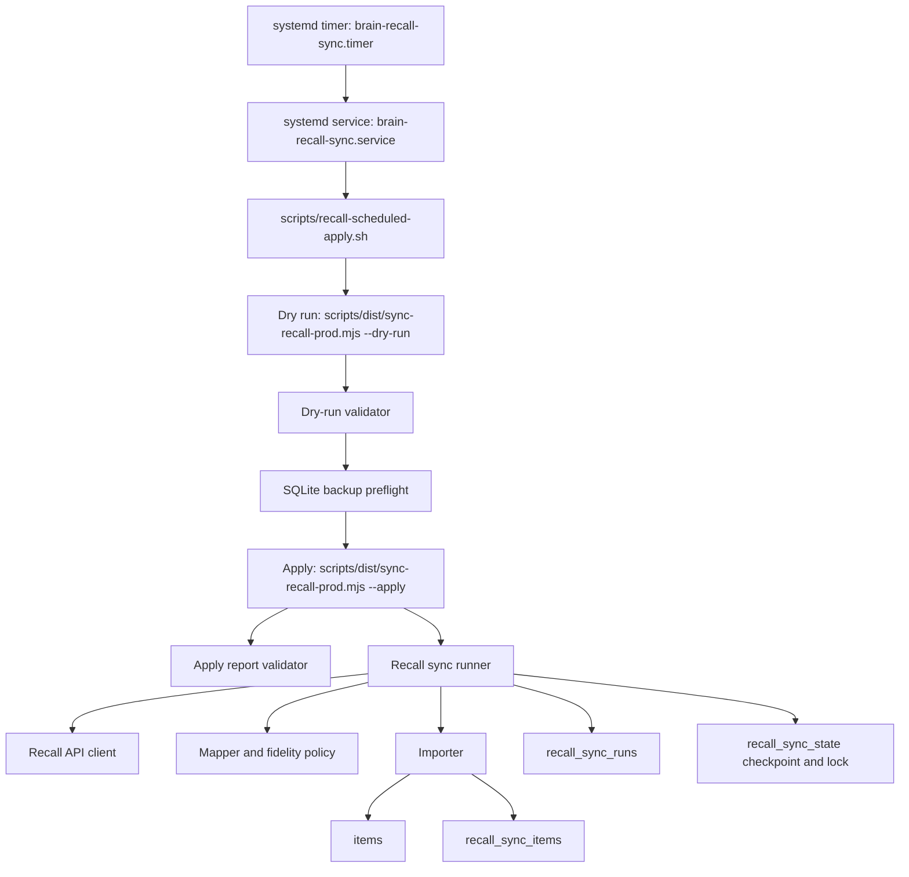

# Recall Daily Sync Implementation and Architecture Overview

Date: 2026-06-28 09:00:59 IST
Owner: Codex
Status: Production implementation overview for AI-agent review
Branch: codex/recall-daily-sync-architecture-20260628

## Purpose

This document gives a future AI agent enough context to understand, review, maintain, and safely extend the Recall -> AI Brain daily sync implementation without needing private evidence files or raw Recall content.

The implemented lane imports new Recall cards into AI Brain through a guarded dry-run/apply workflow, stores durable Recall sync provenance, supports production systemd scheduling, and protects live API usage with explicit approvals, proof gates, key-rotation evidence, private evidence paths, and public privacy scans.

This document is intentionally implementation-centered. It is not a product brief. It explains how the shipped system is wired, what invariants must hold, how the safety gates work, what was deployed, and what a reviewer should inspect first.

## Final State

The Recall daily sync goal is complete as of 2026-06-28 IST.

Production state recorded by the final completion audit:

- `brain-recall-sync.timer` is enabled and active in production.
- The first real timer-triggered service run completed successfully.
- The first scheduled apply report passed the post-apply review gate.
- At least two clean manual production verification runs were required before scheduler enablement; six were recorded before enablement, and seven clean runs were visible in final completion status.
- Private scheduler enablement evidence passed `PASS_RECALL_SCHEDULER_ENABLEMENT_VERIFICATION`.
- No API key, raw Recall content, source URLs, titles, chunks, or private payloads are included in public docs.

Primary final audit:

- `docs/plans/recall-sync/RECALL_DAILY_SYNC_FINAL_COMPLETION_AUDIT_2026-06-28_01-40-12_IST.md`

## Scope In This Branch

This branch contains the implementation, runbooks, reports, and evidence validators required to understand and reproduce the Recall daily sync work.

Included:

- Recall API client, card mapper, fidelity policy, importer, sync runner, and scheduler utilities.
- SQLite migration and DB access layer for Recall sync provenance.
- CLI entry point for dry-run/apply.
- Production wrapper used by systemd.
- systemd service and timer artifacts.
- Deployment-script Recall safety gates and artifact copy steps.
- Public research, PRD, implementation, execution, runbook, gate, and audit documents.
- Public smoke tests and validators for gates, reports, privacy, scheduler artifacts, and command generation.
- The project running log update.

Excluded by design:

- `data/private/**`
- Recall API keys.
- Private Recall card payloads.
- Production DB files and backups.
- Private live spike reports, post-apply reports, and scheduler evidence JSON.
- Unrelated Android/web UX changes from the dirty source workspace.

## Architectural Shape

The implementation uses a conservative pull model.

AI Brain does not receive webhooks from Recall. A scheduled one-shot job calls Recall, lists cards in a bounded time window, fetches card details, maps those details into AI Brain captured-item rows, records Recall-specific provenance, and advances a checkpoint only after an apply run finishes cleanly.



Important design choice: the production wrapper always performs a dry run and validates it before applying. The apply path requires proof of the reviewed dry-run report, a fresh backup, explicit live API confirmation, and key-rotation evidence.

## Core File Inventory

Primary runtime code:

- `src/lib/recall/client.ts`
  - Minimal Recall REST client.
  - Uses bearer auth.
  - Lists cards with `date_from` and `date_to`.
  - Fetches card detail with `max_chunks`.
  - Normalizes `id` or `card_id`.
  - Classifies HTTP failures through `RecallApiError`.

- `src/lib/recall/types.ts`
  - Shared Recall card and fidelity types.

- `src/lib/recall/mapper.ts`
  - Converts a Recall card detail into `InsertCapturedInput` plus Recall sync metadata.
  - Builds AI Brain item body with provenance header and chunk content.
  - Computes deterministic content hash from card id, title, created timestamp, source URL, and chunks.
  - Infers source type/platform from source URL.
  - Assigns `capture_source: "recall"`.
  - Assigns fidelity-derived capture quality and extraction warning.

- `src/lib/recall/fidelity.ts`
  - Encodes import policy for Recall content fidelity.
  - Blocks unverified, possibly truncated, metadata-only, or unknown content unless explicit flags allow a class.
  - Separates "can import" from "can index for retrieval".

- `src/lib/recall/importer.ts`
  - Imports one mapped card into AI Brain.
  - Dedupes by Recall card id through `recall_sync_items`.
  - Detects remote changes through content hash mismatch and blocks checkpoint advancement for review.
  - Optionally upgrades weak existing AI Brain items by source URL.
  - Records skipped, blocked, imported, changed, and upgraded outcomes with Recall sync metadata.

- `src/lib/recall/scheduler.ts`
  - Computes sync windows.
  - Enforces caps.
  - Defines exit codes.
  - Classifies errors.
  - Sanitizes public reports through security redaction.

- `src/lib/recall/sync-runner.ts`
  - Orchestrates the full dry-run/apply lifecycle.
  - Acquires a DB lock.
  - Lists Recall cards.
  - Verifies enumeration completeness when Recall returns a total count.
  - Fetches details.
  - Plans action counts before apply.
  - Enforces card/import/char/chunk caps.
  - Blocks apply on fidelity policy failures or remote content changes.
  - Imports only in apply mode.
  - Advances checkpoint only after successful apply.
  - Persists sanitized run reports in `recall_sync_runs`.

Database and migrations:

- `src/db/migrations/020_recall_sync.sql`
  - Rebuilds `items` to allow `capture_source = 'recall'`.
  - Adds `recall_sync_items`.
  - Adds `recall_sync_runs`.
  - Adds `recall_sync_state`.
  - Recreates existing triggers and indexes after the `items` rebuild.

- `src/db/recall-sync.ts`
  - DB helper layer for sync items, runs, checkpoint state, and lock state.

- `src/db/client.ts`
  - Adds `capture_source: "recall"` to the typed item row.
  - Adds migration directory resolution for packaged CLI execution through `BRAIN_MIGRATIONS_DIR`.

CLI and production operation:

- `scripts/sync-recall.ts`
  - Source CLI for dry-run/apply.
  - Supports live Recall API mode and fixture mode.
  - Loads `.env`, `.env.local`, and explicit env files.
  - Accepts DB path and migration directory overrides.
  - Requires explicit live API confirmation for live mode.
  - Requires apply confirmation and proof gates for apply mode.
  - Writes sanitized JSON reports.

- `scripts/build-recall-cli.mjs`
  - Bundles `scripts/sync-recall.ts` into `scripts/dist/sync-recall-prod.mjs` using esbuild.
  - Copies SQL migrations into `scripts/dist/db/migrations`.
  - The bundled production CLI is generated during deploy gates and is not hand-edited.

- `scripts/recall-scheduled-apply.sh`
  - Production one-shot wrapper called by systemd.
  - Sources `/etc/brain/.env`.
  - Exits successfully without work if sync or scheduler flags are disabled.
  - Supports special manual verification mode before scheduler enablement.
  - Requires the exact manual approval text in manual verification mode.
  - Requires `RECALL_API_KEY` unless fixture mode is active.
  - Requires `BRAIN_RECALL_CONFIRM_LIVE_API=1` for live mode.
  - Requires key-rotation evidence before live apply.
  - Performs dry run, dry-run validation, backup preflight, guarded apply, and apply validation.
  - Writes reports only under `data/private/recall-live-spikes`.

- `scripts/deploy/brain-recall-sync.service`
  - systemd one-shot service.
  - Runs `/opt/brain/scripts/recall-scheduled-apply.sh`.
  - Uses `/etc/brain/.env`.
  - Runs as `brain`.
  - Hardens filesystem access while allowing `/opt/brain/data`.

- `scripts/deploy/brain-recall-sync.timer`
  - Daily production timer.
  - Uses `Persistent=true`.
  - Adds randomized delay to avoid an exact fixed second.

- `scripts/deploy.sh`
  - Adds Recall deploy preflights.
  - Blocks deployment if existing Recall timer is enabled/active unless explicitly overridden after scheduler approval.
  - Blocks deployment if production env flags are already enabled unless explicitly overridden.
  - Requires key-rotation evidence when deploying with Recall overrides.
  - Runs Recall smoke checks, privacy checks, CLI bundle build, scheduler artifact check, and completion status checks.
  - Copies Recall scripts, bundle, helper library, public spike docs, and systemd artifacts to the production host.

Safety and validation scripts:

- `scripts/check-recall-*.mjs`
  - Gate validators for dry-run reports, apply reports, live spike reports, approval packets, key rotation evidence, scheduler artifacts, completion evidence, privacy, and current gate state.

- `scripts/smoke-recall-*.mjs`
  - Focused smoke tests for CLI behavior, wrapper behavior, public privacy scans, evidence recorders, scheduler command generation, and manual verification flows.

- `scripts/record-recall-key-rotation-evidence.mjs`
  - Writes private evidence that the exposed Recall key was rotated.

- `scripts/write-recall-rotated-env.mjs`
  - Writes the rotated Recall API key into the ignored private Recall env file without printing the key.

- `scripts/record-recall-scheduler-enable-evidence.mjs`
  - Records private scheduler enablement evidence after production timer enablement and first scheduled run verification.

## Data Model

The migration adds three Recall-specific tables and extends the existing `items` table.

### items

The existing captured-item table is rebuilt so `capture_source` accepts `recall`.

Recall imports write normal AI Brain items, so existing search, enrichment, chunking, and retrieval paths can continue to operate through existing item infrastructure.

Recall-imported item fields:

- `source_type`: inferred from Recall source URL, defaulting to `note` if no URL exists.
- `source_url`: Recall source URL when available.
- `title`: Recall title, or `Untitled Recall card`.
- `body`: provenance header plus Recall chunks, or metadata-only fallback text.
- `capture_source`: `recall`.
- `source_platform`: inferred platform.
- `capture_quality`: `full_text` for chunk-backed content, `metadata_only` for metadata-only/unknown.
- `extraction_method`: `recall_api_card_chunks`.
- `extraction_version`: `recall-sync-v0.1`.
- `thumbnail_url`: Recall image when available.
- `description`: Recall snapshot and content fidelity label.
- `extraction_warning`: fidelity-specific warning when content is unverified, possibly truncated, metadata-only, or unknown.

### recall_sync_items

One row per Recall card id.

Purpose:

- Durable dedupe.
- Link Recall cards to AI Brain items.
- Capture content hash.
- Track content fidelity.
- Track sync status.
- Record blocked/skipped/changed/upgraded metadata.

Important columns:

- `recall_card_id`: primary key from Recall.
- `item_id`: linked AI Brain item, nullable for blocked rows.
- `content_hash`: deterministic hash of relevant Recall card content.
- `content_fidelity`: one of:
  - `complete_enough_for_daily_import`
  - `api_chunks_unverified`
  - `possibly_truncated`
  - `metadata_only`
  - `blocked_unknown`
- `sync_status`: one of:
  - `seen`
  - `imported`
  - `skipped`
  - `blocked`
  - `changed_remote`
  - `error`
- `metadata_json`: sanitized operational metadata and event context.

### recall_sync_runs

One row per dry-run or apply invocation.

Purpose:

- Durable operational history.
- Store sanitized run report for local inspection.
- Support completion-status and audit helpers.

Important columns:

- `mode`: `dry_run` or `apply`.
- `state`: `running`, `done`, `error`, or `blocked`.
- `date_from`, `date_to`: sync window.
- count columns for cards seen/imported/upgraded/skipped/changed/blocked.
- `total_chars_planned`.
- `total_chunks_fetched`.
- `last_error`.
- `report_json`.

### recall_sync_state

Small key/value table for checkpoint and lock state.

Current keys:

- `checkpoint:last_successful_to`
  - Advanced only after clean apply.
- `lock:recall_sync`
  - Prevents concurrent sync runs.

## Sync Lifecycle

### Window selection

The runner computes a `[date_from, date_to]` window:

- If a checkpoint exists, the next window starts from the checkpoint minus overlap.
- If no checkpoint exists, the first run uses a bounded lookback.
- `date_to` is the run's `now` timestamp.
- Window override arguments can be supplied for controlled apply windows.

Default safety posture:

- first-run lookback: bounded.
- overlap: nonzero to avoid missing late-arriving records.
- checkpoint advancement: only clean apply.

### Lock acquisition

The runner attempts to acquire `lock:recall_sync`.

If the lock exists and is not recoverably stale:

- run returns `state: blocked`.
- exit code is `locked`.
- checkpoint is not advanced.

If stale recovery is explicitly allowed and the lock is stale:

- runner records `staleLockRecovered: true`.
- run continues.

### Enumeration

The client lists Recall cards for the computed window.

If Recall returns `total_count`, the runner checks that returned card count equals `total_count`.

If the list appears incomplete:

- run returns `state: blocked`.
- exit code is `cap_exceeded`.
- checkpoint is not advanced.

Reason: advancing a checkpoint after a capped or partial page could permanently skip cards.

### Detail fetch and planning

For each listed card:

- fetch details with a bounded `max_chunks`.
- map the card to AI Brain item input and Recall sync metadata.
- infer content fidelity.
- compute planned action:
  - `imported`
  - `upgraded_existing_weak`
  - `skipped_existing`
  - `skipped_existing_source_url`
  - `blocked_weak_existing`
  - `blocked_by_fidelity_policy`
  - `changed_remote`
- accumulate planned char and chunk counts.
- enforce caps.

Dry runs stop after planning and report planned actions.

### Apply

Apply mode requires proof gates before the runner is called.

The runner also blocks internally if:

- fidelity policy blocks any planned card.
- any previously synced card changed content hash.
- import-time repair of a weak existing item fails.
- caps are exceeded.
- enumeration is incomplete.

If apply succeeds:

- imports new cards into `items`.
- records rows in `recall_sync_items`.
- persists a sanitized run report in `recall_sync_runs`.
- advances `checkpoint:last_successful_to` to `date_to`.

If apply blocks or errors:

- checkpoint is not advanced.
- a run report is still persisted.

## Fidelity Policy

Recall API content fidelity is treated as explicit risk, not as a background detail.

Policy states:

- `complete_enough_for_daily_import`
  - import allowed.
  - retrieval indexing allowed.

- `api_chunks_unverified`
  - blocked by default.
  - import can be allowed with `--allow-unverified-import`.
  - retrieval indexing requires both allow flag and warning UI availability.

- `possibly_truncated`
  - blocked by default.
  - import can be allowed with explicit flag.
  - retrieval indexing remains blocked.

- `metadata_only`
  - blocked by default.
  - import can be allowed with explicit flag.
  - retrieval indexing remains blocked.

- `blocked_unknown`
  - always blocked.

Operational flags are intentionally noisy. Production imports of unverified or metadata-only content require explicit approval and report validation flags so a future operator cannot accidentally loosen policy by routine scheduler enablement.

## Caps and Failure Modes

Caps protect the local DB and prevent surprising bulk imports.

Cap dimensions:

- `maxCards`
- `maxImports`
- `maxTotalChars`
- `maxTotalChunks`
- `maxChunksPerCard`

Production wrapper defaults are set through `BRAIN_RECALL_MAX_*` env variables with conservative fallbacks.

Important exit codes:

- `0`: success.
- `2`: configuration error.
- `10`: partial failure.
- `69`: rate limited.
- `75`: lock held.
- `77`: auth failure.
- `78`: cap exceeded.
- `79`: policy blocked.
- `80`: remote changed.

Reviewer invariant: no blocked, cap-exceeded, partial, auth-failed, or remote-changed apply may advance checkpoint.

## Secret and Privacy Architecture

The implementation deliberately separates public code/docs from private evidence and secrets.

Public branch contains:

- source code.
- public docs.
- public reports with private values redacted.
- validators and smoke tests.

Private production/local paths contain:

- `data/private/recall-live-spikes/recall.env`
- private live spike reports.
- private dry-run/apply reports.
- key-rotation evidence.
- scheduler-enable evidence.
- production deploy evidence.

Public docs must never include:

- Recall API keys.
- raw card chunks.
- private source URLs.
- private Recall titles.
- unsanitized report JSON.

Redaction flow:

- runtime reports are sanitized with `sanitizeRecallSyncReport`.
- report sanitizer delegates to `redactReportValue`.
- public privacy scanners validate docs and manifests.
- private evidence path checks prevent public path leakage.

Key rotation guard:

- live apply requires key-rotation evidence after the chat exposure timestamp.
- env writer writes only to ignored private env file.
- key is not printed.
- production wrapper validates key-rotation evidence before live apply.

## Approval and Proof Gate Model

The live path was intentionally split into escalating gates:

1. Offline fixtures and controlled sample gates.
2. Public research and spike reports.
3. Live Recall API approval.
4. Live spike proof.
5. Public privacy scan.
6. Rotated key evidence.
7. First capped dry run.
8. Backup proof.
9. First capped apply.
10. Production deploy.
11. Additional manual production verification run.
12. At least two clean manual runs before scheduler.
13. Scheduler enablement approval.
14. Scheduler enablement evidence recording.
15. First real timer-triggered run verification.
16. Final completion audit.

The production scheduler was not enabled until manual clean-run evidence satisfied the scheduler enablement guard.

## Production Deployment Architecture

Deployment is managed through `scripts/deploy.sh`.

Recall additions to deploy:

- remote timer preflight.
- remote env preflight.
- remote key-rotation evidence preflight.
- Recall smoke/gate checks.
- production CLI bundle build.
- systemd artifact validation.
- copy scripts and bundled CLI to production host.
- install service/timer into `/etc/systemd/system`.

Key production files:

- `/opt/brain/scripts/recall-scheduled-apply.sh`
- `/opt/brain/scripts/dist/sync-recall-prod.mjs`
- `/opt/brain/scripts/lib/recall-controlled-samples.mjs`
- `/etc/systemd/system/brain-recall-sync.service`
- `/etc/systemd/system/brain-recall-sync.timer`
- `/etc/brain/.env`
- `/opt/brain/data/private/recall-live-spikes`
- `/opt/brain/data/backups`

The deploy script refuses risky states by default:

- existing enabled/active Recall timer blocks deploy unless explicitly overridden.
- enabled production Recall env flags block deploy unless explicitly overridden.
- key-rotation evidence is required when overrides are used.

## systemd Scheduler Behavior

Service:

- unit: `brain-recall-sync.service`
- type: one-shot.
- user/group: `brain`.
- working directory: `/opt/brain`.
- env file: `/etc/brain/.env`.
- command: `/usr/bin/bash /opt/brain/scripts/recall-scheduled-apply.sh`.
- hardened with `NoNewPrivileges`, `PrivateTmp`, `ProtectSystem=strict`, `ProtectHome=true`.
- writable path limited to `/opt/brain/data`.

Timer:

- unit: `brain-recall-sync.timer`.
- daily schedule.
- `Persistent=true`.
- randomized delay enabled.

Runtime behavior:

- if `BRAIN_RECALL_SYNC_ENABLED` is not `1`, wrapper exits 0 without work.
- if scheduler is not enabled and manual mode is not active, wrapper exits 0 without work.
- if live API confirmation is absent, wrapper exits with config error.
- if key rotation proof is absent/invalid, wrapper exits with config error.
- successful run writes dry-run, preflight, backup, and apply artifacts in private paths.

## Operator Commands

Use package scripts instead of calling internals when possible.

Build production CLI:

```bash
npm run build:recall-cli
```

Validate scheduler artifacts:

```bash
npm run check:recall-scheduler
```

Run public docs privacy scan:

```bash
npm run check:recall-public-docs-privacy
```

Check current gate state:

```bash
npm run recall:current-gate
```

Check completion status:

```bash
npm run recall:daily-sync:completion-status
```

Require completed status:

```bash
npm run recall:daily-sync:completion-status -- --require-complete
```

Record scheduler enablement evidence after production timer verification:

```bash
npm run recall:scheduler-enable-evidence:record -- --help
```

Generate scheduler enablement command:

```bash
npm run recall:scheduler-enable:command
```

## Validation Matrix

The following checks are most relevant for a future reviewer.

Code-level tests:

- `src/lib/recall/client.test.ts`
- `src/lib/recall/fidelity.test.ts`
- `src/lib/recall/importer.test.ts`
- `src/lib/recall/scheduler.test.ts`
- `src/lib/recall/sync-runner.test.ts`
- `src/db/migrations/020_recall_sync.test.ts`
- `src/lib/security/redaction.test.ts`
- `src/lib/capture/quality.test.ts`

CLI/package checks:

- `npm run build:recall-cli`
- `npm run smoke:recall-cli:bundle`
- `npm run check:recall-scheduler`
- `npm run smoke:recall-scheduler-wrapper`
- `npm run smoke:recall-current-gate`
- `npm run smoke:recall-daily-sync-completion-status`
- `npm run smoke:recall-goal-completion-audit`
- `npm run smoke:recall-completion-evidence`
- `npm run smoke:recall-key-rotation-evidence`
- `npm run smoke:recall-public-docs-privacy`
- `npm run check:recall-public-docs-privacy`

Production evidence checks:

- `npm run check:recall-scheduler-enable-evidence -- --evidence data/private/recall-live-spikes/scheduler-enable-evidence.json`
- `npm run recall:daily-sync:completion-status -- --require-complete`

Privacy checks:

- `npm run check:recall-public-privacy`
- `npm run check:recall-public-manifest-privacy`
- `npm run check:recall-public-docs-privacy`

## Review Checklist For Future AI Agent

When reviewing or extending this implementation, inspect these invariants first:

- No code path prints `RECALL_API_KEY`.
- No public doc contains raw Recall card payloads, titles, URLs, or chunks.
- Apply mode requires `--confirm-apply`.
- Live mode requires explicit live API confirmation.
- Apply mode with live API requires key-rotation evidence.
- Apply mode requires dry-run proof and backup proof in production wrapper.
- Dry-run reports are validated before apply.
- Backup proof is produced before apply.
- `recall_sync_state.checkpoint:last_successful_to` advances only after clean apply.
- Any cap exceeded state blocks checkpoint advancement.
- Any fidelity policy block blocks checkpoint advancement unless explicitly allowed.
- Any content hash mismatch for a previously synced Recall card blocks checkpoint advancement.
- `lock:recall_sync` prevents concurrent syncs.
- systemd timer remains separate from service so manual verification can run without enabling scheduler.
- deployment does not silently overwrite an enabled production scheduler state.
- generated production CLI is rebuilt before deploy.
- migrations are included with the packaged CLI.
- public privacy scans run before committing or publishing reports.

## Known Edge Cases

Zero-card scheduled run:

- The first real timer-triggered scheduled run saw zero Recall cards and imported zero items.
- This is valid scheduler proof because the timer/service path ran, the apply report was structurally valid, and the post-apply review gate passed.
- It does not prove new content import during that specific window; prior manual runs had already proven guarded apply behavior.

Recall pagination or partial enumeration:

- If Recall reports `total_count` greater than returned cards, the runner blocks instead of advancing checkpoint.
- If Recall omits `total_count`, the runner cannot prove full enumeration from API metadata and relies on caps plus observed response shape.

Unverified chunk fidelity:

- Most live Recall card content is treated as unverified unless a stronger API completeness signal exists.
- Importing such content is an explicit risk acceptance, not the default.

Metadata-only cards:

- Metadata-only content can be recorded only with explicit allowance.
- Retrieval indexing remains blocked.

Changed remote content:

- A changed hash for an already synced Recall card is not silently overwritten.
- It records `changed_remote` and blocks apply for review.

Weak existing items:

- Optional source-URL upgrade is intended to repair weak AI Brain items with better Recall content.
- If existing content is not weak, the Recall card is skipped and linked as source-url existing rather than overwriting.

## Public Documentation Map

Research:

- `docs/research/recall-sync/00_SOURCE_INVENTORY_2026-06-24_08-58-33_IST.md`
- `docs/research/recall-sync/01_RECALL_DAILY_SYNC_RESEARCH_REPORT_V1_2026-06-24_08-58-33_IST.md`
- `docs/research/recall-sync/RECALL_DAILY_SYNC_RESEARCH_REPORT_V1_ADVERSARIAL_REVIEW_2026-06-24_09-05-08_IST.md`
- `docs/research/recall-sync/02_RECALL_DAILY_SYNC_RESEARCH_REPORT_V2_2026-06-24_09-07-04_IST.md`

PRD and implementation plan:

- `docs/plans/recall-sync/RECALL_DAILY_SNAPSHOT_IMPORT_PRD_V1_2026-06-24_10-13-04_IST.md`
- `docs/plans/recall-sync/RECALL_DAILY_SNAPSHOT_IMPORT_PRD_V1_ADVERSARIAL_REVIEW_2026-06-24_10-14-55_IST.md`
- `docs/plans/recall-sync/RECALL_DAILY_SNAPSHOT_IMPORT_PRD_V2_2026-06-24_10-16-19_IST.md`
- `docs/plans/recall-sync/RECALL_DAILY_SNAPSHOT_IMPORT_IMPLEMENTATION_PLAN_V1_2026-06-24_10-18-50_IST.md`
- `docs/plans/recall-sync/RECALL_DAILY_SNAPSHOT_IMPORT_IMPLEMENTATION_PLAN_V1_ADVERSARIAL_REVIEW_2026-06-24_10-20-22_IST.md`
- `docs/plans/recall-sync/RECALL_DAILY_SNAPSHOT_IMPORT_IMPLEMENTATION_PLAN_V2_2026-06-24_10-21-46_IST.md`

Project tracking:

- `docs/plans/recall-sync/RECALL_DAILY_SYNC_PROJECT_TRACKER_2026-06-24_09-16-07_IST.md`

Runbook and completion:

- `docs/plans/recall-sync/RECALL_DAILY_SNAPSHOT_IMPORT_PRODUCTION_RUNBOOK_2026-06-24_10-47-45_IST.md`
- `docs/plans/recall-sync/RECALL_DAILY_SYNC_FINAL_COMPLETION_AUDIT_2026-06-28_01-40-12_IST.md`

Live approval and production enablement:

- `docs/plans/recall-sync/RECALL_LIVE_API_APPROVAL_CHECKLIST_2026-06-24_14-00-43_IST.md`
- `docs/plans/recall-sync/RECALL_LIVE_API_APPROVAL_HANDOFF_2026-06-24_18-21-35_IST.md`
- `docs/plans/recall-sync/RECALL_FIRST_CAPPED_APPLY_APPROVAL_PACKET_2026-06-24_19-28-07_IST.md`
- `docs/plans/recall-sync/RECALL_SECOND_MANUAL_VERIFICATION_APPLY_APPROVAL_PACKET_2026-06-27_00-14-29_IST.md`
- `docs/plans/recall-sync/RECALL_SCHEDULER_ENABLEMENT_APPROVAL_PACKET_2026-06-26_23-50-00_IST.md`

## Maintainer Notes

The implementation is intentionally gate-heavy because the project involved a live third-party API key, exposed-key rotation, private content, and production scheduler enablement. Future simplification should be done only after replacing the proof chain with an equally strong automated control.

The safest next improvements are:

- Add a richer admin UI for Recall sync run history from `recall_sync_runs`.
- Add a first-class review queue for `changed_remote` rows.
- Add a first-class review queue for fidelity-blocked rows.
- Add explicit retrieval-index gating so warning-gated Recall content cannot be indexed accidentally.
- Add production alerting for nonzero scheduler exit code, blocked applies, and stale locks.
- Add a dedicated dashboard for timer state, checkpoint, last success, last blocked run, and clean-run count.

Do not remove private/public path separation, key-rotation gates, or checkpoint advancement rules unless a replacement design is reviewed and proven.
