# AI Brain Explicit-Click YouTube Transcript Capture - Implementation Plan V1

**Created:** 2026-07-22 13:32 IST<br>
**Author:** Codex<br>
**Status:** Draft V1 for specialist and adversarial review<br>
**Source PRD:** `2026-07-22_ai_brain_youtube_dom_capture_prd_v1.md`<br>
**Decision state:** Fixture/local implementation go; approved lab conditional go; production no-go<br>
**Branch:** `codex/youtube-dom-capture-prd-v2`<br>

## Executive Summary

Implement the concept as two new explicit capabilities around the existing Brain extension:

1. a true metadata-only `Save link only` path that never invokes YouTube extraction or transcript recovery; and
2. a dedicated, explicit-click browser-visible transcript path with local inspection, evidence preview, explicit confirmation, fixed-origin upload, durable idempotency, distinct provenance, and fail-closed validation.

The default acquisition method is the transcript panel already rendered and selected by the user. The extension injects only after a user gesture using `activeTab` plus `scripting` in the default isolated world. The YouTube page never receives the Brain token. The server never receives browser cookies, storage, profiles, account identifiers, player responses, signed caption URLs, or media URLs.

The implementation is staged so synthetic fixtures and the disabled lab route can be completed independently of any production decision. `browser_visible_transcript` is blocked unconditionally whenever the server environment is production. Moving beyond an approved lab requires a separate code review and decision artifact; no environment value or approval ID can promote it alone.

## Starting Point

### Extension

- `extension/manifest.json` is Manifest V3 and already grants `activeTab`, `tabs`, context menus, storage, and notifications.
- `extension/src/popup.ts` directly calls `captureUrl()` after a single Save action.
- `extension/src/capture.ts` posts title/URL/note/selected text to fixed origin `https://brain.arunp.in/api/capture/url` and returns typed auth/rate/network/server results.
- `extension/src/background.ts` handles link/page/selection context menus and notifications.
- The extension package has build/dev commands but no tests.

### Server And Data

- `/api/capture/url` canonicalizes and extracts YouTube content and may enqueue transcript recovery.
- `/api/capture/transcript` accepts paste/file input and records it as `user_paste` or `uploaded_file`; it must not be reused for browser-visible captions.
- `src/lib/capture/policy.ts` records acquisition decisions but currently has no browser-visible method and can production-allow `lab_public_caption` with an approval ID.
- `capture_policy_decisions`, `transcript_sources`, and `transcript_segments` already support policy, hashes, caption source class, timestamp mode, provenance, and cues.
- `repairItemWithText()` resets stale enrichment/chunks/vectors/jobs for transcript upgrades.
- Item notes have a separate idempotent mutation model and should remain separate from transcript text.
- Default SQLite backups run every six hours and retain 28 snapshots, approximately one week. Deletion copy must disclose backup expiry.

## Non-Negotiable Architecture Decisions

| ID | Decision |
|---|---|
| ADR-YTC-01 | Extend the existing Brain extension; do not fork or publish a second extension. |
| ADR-YTC-02 | Add only `scripting`; retain temporary `activeTab`; add no persistent YouTube host permission for V0.1. |
| ADR-YTC-03 | Inject after `Inspect visible transcript`; use the default isolated world and return plain structured data. |
| ADR-YTC-04 | Require the transcript panel to be visible and language selected by the user. No automatic panel opening in V0.1. |
| ADR-YTC-05 | Require a second action before upload; unconfirmed content stays in extension memory only. |
| ADR-YTC-06 | Use a dedicated `/api/capture/youtube-browser-transcript` endpoint and distinct `browser_visible_transcript` provenance. |
| ADR-YTC-07 | Add a distinct `/api/capture/link` endpoint for the popup's `Save link only`; it performs no remote extraction or recovery scheduling. |
| ADR-YTC-08 | Keep `caption_source_class=unknown` for DOM-only acquisition. Visible labels are not manual/ASR proof. |
| ADR-YTC-09 | Same request ID/hash replays the original result; same video/text hash is duplicate; different active transcript is a typed conflict with no overwrite. |
| ADR-YTC-10 | Persist item, optional note, policy, source, segments, request receipt, and derived-work reset atomically. |
| ADR-YTC-11 | Package selectors and extractor logic with the extension. Remote controls may disable versions but cannot deliver code or selectors. |
| ADR-YTC-12 | Production blocks browser-visible acquisition in code. Production enablement requires a later reviewed code change. |

## Target Architecture

```mermaid
flowchart LR
  U["User opens YouTube transcript"] --> P["Brain popup"]
  P -->|"Inspect explicit click"| X["Isolated DOM extractor"]
  X -->|"Structured cues and evidence"| R["Popup review"]
  R -->|"Save explicit click"| W["Extension service worker"]
  W -->|"Fixed HTTPS bearer request"| A["Browser transcript endpoint"]
  A --> G["Feature, policy, manifest gate"]
  G --> V["Identity, size, cue, hash validation"]
  V --> T["Atomic item, note, source, segments, receipt"]
  T --> E["Pending enrichment and search processing"]
```



### Trust Boundaries

1. **YouTube page:** untrusted DOM; supplies only plain text and page-visible metadata through bounded selectors.
2. **Isolated extractor:** has temporary active-tab DOM visibility, no Brain token, no arbitrary fetch authority, and no extension storage access.
3. **Popup:** holds unconfirmed structured transcript in memory, renders summary evidence, and discards it on close.
4. **Service worker:** receives only the confirmed payload, reads the Brain token, and calls fixed helper functions.
5. **Brain endpoint:** authenticates, validates the exact schema, applies policy/manifest gates, recomputes identity/text/hash, and commits transactionally.
6. **SQLite/derived pipeline:** stores approved content/provenance and resets stale derived data.

## Proposed File Map

### Extension

```text
extension/manifest.json
extension/package.json
extension/vite.config.ts
extension/src/background.ts
extension/src/capture.ts
extension/src/popup.html
extension/src/popup.ts
extension/src/popup-state.ts
extension/src/popup-state.test.ts
extension/src/youtube/url.ts
extension/src/youtube/url.test.ts
extension/src/youtube/types.ts
extension/src/youtube/extractor-core.ts
extension/src/youtube/extractor-core.test.ts
extension/src/youtube/injected-entry.ts
extension/src/youtube/limits.ts
extension/src/youtube/fixtures/*.html
extension/tests/mv3-youtube-capture.e2e.ts
```

### Server

```text
src/app/api/capture/link/route.ts
src/app/api/capture/link/route.test.ts
src/app/api/capture/youtube-browser-transcript/route.ts
src/app/api/capture/youtube-browser-transcript/route.test.ts
src/lib/capture/youtube-browser/schema.ts
src/lib/capture/youtube-browser/service.ts
src/lib/capture/youtube-browser/service.test.ts
src/lib/capture/youtube-browser/manifest.ts
src/lib/capture/youtube-browser/manifest.test.ts
src/lib/capture/youtube-browser/diagnostics.ts
src/lib/capture/youtube-browser/diagnostics.test.ts
src/lib/capture/policy.ts
src/lib/capture/policy.test.ts
src/lib/auth/bearer.ts
src/db/transcripts.ts
src/db/migrations/026_youtube_browser_transcript.sql
src/db/migrations/026_youtube_browser_transcript.test.ts
src/db/migrations/026_youtube_browser_transcript.test.setup.ts
```

### QA/Operations

```text
scripts/check-youtube-browser-transcript-manifest.mjs
scripts/smoke-youtube-browser-transcript-fixtures.mjs
docs/runbooks/youtube-browser-transcript-lab.md
data/private/youtube-browser-transcript/approval-manifest.json  # ignored, never committed
```

## Extension Design

### Manifest

Add:

```json
{
  "permissions": ["scripting"]
}
```

Do not add:

- `cookies`;
- `webRequest` or `webRequestBlocking`;
- `tabCapture`;
- `offscreen`;
- `<all_urls>`;
- persistent `https://www.youtube.com/*` host access;
- a static YouTube content script.

Add manifest tests that assert the exact permission/host set and reject future broadening without test changes.

### Popup State Machine

Use a pure reducer in `popup-state.ts` rather than ad hoc DOM mutations.

```ts
type YoutubeCaptureState =
  | { name: "setup_required" }
  | { name: "unsupported_tab" }
  | { name: "ready"; tab: EligibleTab }
  | { name: "panel_not_open"; tab: EligibleTab }
  | { name: "transcript_unavailable"; tab: EligibleTab }
  | { name: "inspecting"; tab: EligibleTab; requestId: string }
  | { name: "review_ready"; tab: EligibleTab; requestId: string; result: ExtractedTranscript }
  | { name: "inspect_error"; tab: EligibleTab; code: InspectErrorCode }
  | { name: "saving"; requestId: string }
  | { name: "saved"; outcome: "created" | "upgraded" | "duplicate"; itemId: string }
  | { name: "save_error"; requestId: string; code: SaveErrorCode };
```

Rules:

1. Preserve final title/note values across `ready -> inspecting -> review_ready`.
2. Generate `request_id` when inspection starts; reuse it for retry while that review remains open.
3. Requery active tab before injection and immediately before dispatching confirmed payload.
4. If tab ID, canonical URL, or video ID changes, invalidate the review and return `navigation_changed`/`stale_review`.
5. Closing the popup discards transcript content and request state. Do not write transcript content to extension storage.
6. `Save link only` calls `captureLinkOnly()`, not `captureUrl()`.
7. Context-menu actions do not inspect transcript DOM. Existing non-companion capture behavior is unchanged unless separately revised.

### Injection Strategy

Build `injected-entry.ts` as a packaged extension entry and invoke it with `chrome.scripting.executeScript()` in the default isolated world. The injected code must receive only scalar limits/video identity and return a structured result. It must not receive the Brain token or destination URL.

Keep parsing/normalization/completeness logic in pure `extractor-core.ts` so HTML fixtures can exercise it without Chrome.

### Bounded Extraction Algorithm

1. Validate hostname/route and derive start video ID.
2. Locate one visible transcript panel, selected visible track label, segment renderer family, and scroll container.
3. Reject no panel, hidden panel, ambiguous multiple visible panels, and unsupported renderer.
4. Read cue text through `textContent`; normalize Unicode/whitespace without executing or preserving HTML.
5. Parse timestamps defensively; support repeated start times but require finite nonnegative monotonic ordering after stable deduplication.
6. Key cues by normalized start time plus normalized text; never by DOM node identity.
7. Scroll only the transcript container. After each render cycle, collect new cues and record scroll height, scroll top, last key, and unique-cue count.
8. Success requires bottom reached plus unchanged last key, scroll height, and unique-cue count for three consecutive checks.
9. Fail `virtualization_incomplete` at any limit without returning an uploadable partial result.
10. Re-read canonical video ID and return `navigation_changed` if it differs.
11. Sort and validate segments, compute local normalized text/hash, and return structured result.

Initial limits from research:

| Limit | Value |
|---|---:|
| Extraction wall clock | 12 seconds |
| Scroll iterations | 240 |
| Segments | 7,200 |
| Normalized text | 500,000 characters |
| Serialized request | 2 MiB |
| Stable-bottom checks | 3 |
| Per-cue normalized text | 2,000 characters |
| Maximum timing value | 86,400,000 ms |

The V1 review must reconcile time/scroll values with the research report before V2.

### Confirmed Upload

On confirmation, popup sends the structured payload to the extension service worker using `chrome.runtime.sendMessage`. The service worker owns the fixed Brain request and notification behavior. It must:

- validate the message discriminator and maximum serialized size before processing;
- read the Brain token only in extension context;
- call only the fixed Brain endpoint;
- avoid logging the payload;
- use current API-version headers;
- emit a completion notification when the popup closes after dispatch;
- preserve the request ID for network retry;
- never persist transcript text in `chrome.storage`.

## Link-Only Contract

Create `POST /api/capture/link` for the explicit fallback.

Request:

```json
{
  "schema_version": 1,
  "request_id": "uuid",
  "url": "https://www.youtube.com/watch?v=aircAruvnKk",
  "title": "Visible page title",
  "note": "optional"
}
```

Behavior:

1. Authenticate bearer and validate extension origin/API version.
2. Canonicalize supported URLs with pure URL helpers.
3. Create or return a metadata-only item using supplied title and canonical URL.
4. Store optional note through the item-note model.
5. Never call `extractUrlCapture`, `extractYoutubeVideo`, `fetch`, timedtext, InnerTube, or transcript recovery enqueue helpers.
6. Return `created` or `duplicate`; no transcript-success language.
7. Same request ID/hash is idempotent; mismatched reuse returns 409.

Do not change the existing general `/api/capture/url` behavior for APK or other clients in this slice. Only the explicit companion `Save link only` command uses the new endpoint.

## Browser Transcript API Contract

### Route

```text
POST /api/capture/youtube-browser-transcript
```

Add both new routes to the bearer allowlist. Require bearer authentication, rate limit, API version, extension-origin validation, and `x-brain-capture-source: extension`. The capture-source header is classification, not authentication.

### Request V1

```json
{
  "schema_version": 1,
  "request_id": "0b8a7abf-7fb6-4fa0-980f-9b3a7fe0bca3",
  "captured_at_ms": 1784700000000,
  "page": {
    "url": "https://www.youtube.com/watch?v=aircAruvnKk",
    "video_id": "aircAruvnKk",
    "title": "But what is a neural network?",
    "duration_seconds": 1122
  },
  "note": "optional Markdown/plain text accepted by the item-note normalizer",
  "transcript": {
    "track_label": "English",
    "language_code": "en",
    "caption_source_class": "unknown",
    "timestamp_mode": "timestamped",
    "normalized_char_count": 32840,
    "text_sha256": "64 lowercase hex characters",
    "segments": [
      {
        "idx": 0,
        "start_ms": 0,
        "duration_ms": 3120,
        "end_ms": 3120,
        "text": "Synthetic cue text"
      }
    ]
  },
  "extraction": {
    "extractor_version": "brain-youtube-dom/1",
    "renderer": "modern",
    "elapsed_ms": 1420,
    "scroll_iterations": 18,
    "stable_bottom_checks": 3,
    "bottom_reached": true
  },
  "consent": {
    "copy_version": "youtube-browser-transcript-v1",
    "confirmed_at_ms": 1784700001000
  }
}
```

Reject unknown top-level and nested keys with strict Zod schemas. Do not accept client-supplied policy outcome, rights basis, retention class, source kind, endpoint URL, HTML, raw player response, caption/media URL, cookies, headers, account identity, or arbitrary provenance.

### Response V1

```json
{
  "schema_version": 1,
  "request_id": "0b8a7abf-7fb6-4fa0-980f-9b3a7fe0bca3",
  "action": "created",
  "item_id": "item-id",
  "transcript_source_id": "source-id",
  "review_path": "/review?focus=item-id"
}
```

`action` is one of:

- `created`;
- `upgraded`;
- `duplicate_same_transcript`;
- `existing_transcript_conflict`.

### Validation Order

1. Proxy bearer/rate gate.
2. Route origin, API version, feature mode, content type, and declared body length.
3. Read at most 2 MiB and parse strict JSON.
4. Validate UUID, timestamps, bounded strings/arrays/numbers, and allowed literals.
5. Canonicalize URL and prove URL/video ID agreement.
6. Load private lab manifest and match approval, expiry, video ID, rights basis, and retention.
7. Require `caption_source_class=unknown` for schema V1.
8. Normalize cue text server-side, validate contiguous indices/timing consistency/order/limits, and recompute normalized text.
9. Recompute text SHA-256 and compare to client hash.
10. Derive request hash from normalized server contract.
11. Resolve idempotency receipt and existing item/source behavior.
12. Apply policy and commit atomically.

### Error Mapping

| HTTP | Code |
|---:|---|
| 400 | `invalid_json`, `validation_failed`, `video_identity_mismatch`, `invalid_segments`, `hash_mismatch` |
| 401 | `unauthenticated` |
| 403 | `origin_not_allowed`, `feature_disabled`, `policy_blocked`, `manifest_target_blocked` |
| 409 | `request_id_mismatch`, `existing_transcript_conflict` |
| 413 | `payload_too_large`, `too_many_segments`, `text_too_large` |
| 415 | `unsupported_content_type` |
| 422 | `text_too_short`, `completeness_unproven` |
| 429 | `rate_limited` |
| 500 | `capture_failed` with no partial commit |

Every error response uses `cache-control: no-store`, includes a stable code and request ID when safe, and never echoes transcript text or identifying page data.

## Policy And Private Manifest

### Policy Types

Add `browser_visible_transcript` to:

- `TranscriptAcquisitionMethod`;
- `TranscriptSourceKind`;
- corresponding SQLite checks.

Reuse only manifest-approved rights basis:

- `owned_youtube_channel`;
- `authorized_youtube_video`.

Do not use `public_lab_only` or client-provided rights for the browser route.

### Production Block

`blockedReasonFor()` must return `browser_visible_transcript_production_blocked` whenever:

```ts
environment === "production" && method === "browser_visible_transcript"
```

This block applies even when a legal approval ID or runtime feature value exists. Add a negative test that fails if any production input returns allowed.

Also revise `lab_public_caption` so a legal approval ID alone cannot production-enable it. Preserve existing behavior only if a separately documented compatibility reason exists and tests prove no new production path.

### Private Manifest Schema

Example structure, stored outside Git with mode `0600`:

```json
{
  "schema_version": 1,
  "approval_id": "internal reference",
  "reviewer": "approved reviewer",
  "issued_at_ms": 1784600000000,
  "expires_at_ms": 1785200000000,
  "account_alias": "non-identifying alias",
  "targets": [
    {
      "video_id": "aircAruvnKk",
      "rights_basis": "authorized_youtube_video",
      "retention_class": "full_text_allowed",
      "delete_by_ms": 1785300000000
    }
  ]
}
```

The committed validator may inspect schema and fake fixtures. Actual approval IDs, account identity, video IDs not already public fixtures, and private targets stay outside Git and public reports.

## Migration 026

SQLite CHECK constraints require a forward table rebuild to add the new acquisition/source literal.

### Changes

1. Rebuild `capture_policy_decisions` with existing values plus `browser_visible_transcript`.
2. Rebuild `transcript_sources` with existing values plus `browser_visible_transcript`.
3. Preserve all columns, rows, IDs, foreign keys, indexes, statuses, and timestamps.
4. Create durable request receipts:

```sql
CREATE TABLE youtube_browser_capture_requests (
  request_id TEXT PRIMARY KEY,
  request_hash TEXT NOT NULL,
  item_id TEXT REFERENCES items(id) ON DELETE CASCADE,
  transcript_source_id TEXT REFERENCES transcript_sources(id) ON DELETE SET NULL,
  outcome TEXT NOT NULL CHECK (outcome IN (
    'created',
    'upgraded',
    'duplicate_same_transcript',
    'existing_transcript_conflict'
  )),
  created_at INTEGER NOT NULL
);
```

5. Add indexes for item/time and source receipt lookup.

### Migration Test

Create a pre-026 database containing at least one row for every existing method/source/status plus segments and policy FKs. Run the real migration runner and assert:

- `PRAGMA foreign_key_check` is empty;
- row counts and hashes match;
- old methods remain accepted;
- new method is accepted;
- unknown methods remain rejected;
- all indexes exist;
- request receipt cascade/set-null behavior works;
- migration is recorded with hash and cannot be silently edited later.

Before production deploy of any schema change, make a fresh backup and run migration/restore smoke on a production-shaped snapshot. This does not enable the feature.

## Persistence Service

Create `captureBrowserVisibleYoutubeTranscript()` in `service.ts`.

Transaction algorithm:

1. Look up request receipt by ID.
2. Same request hash returns recorded response without mutation.
3. Different hash for same request ID throws `request_id_mismatch`.
4. Find item by canonical URL.
5. If no item, insert metadata-only YouTube item from validated page fields without a YouTube fetch.
6. Inspect active transcript source:
   - same server-computed text hash: record/return duplicate;
   - different active transcript: record/return conflict without mutation;
   - no active transcript/weak item: continue.
7. Record allowed policy decision from server-side manifest.
8. Repair item with transcript body and explicit quality/method/version; reset stale chunks/vectors/tags/topics/jobs.
9. Supersede prior weak/placeholder sources only under explicit upgrade classification.
10. Insert browser-visible transcript source and segments.
11. Save optional note with mutation ID derived from capture request, retaining note as a separate item-note source.
12. Insert request receipt.
13. Commit and return.

If any step fails, all changes roll back. Refactor transaction-aware internal helpers if nested transactions obscure rollback behavior; do not assume nested wrappers provide sufficient proof without tests.

The service and route must not import server YouTube extraction providers or make network calls. A test installs a throwing `fetch` and proves successful persistence performs zero fetches.

## Feature Modes And Kill Switches

### Extension

Package-time flag:

```text
YOUTUBE_DOM_CAPTURE_ENABLED=false
```

Default false in ordinary builds until the approved lab package is produced. Disabled mode preserves current generic URL capture and hides/removes the transcript inspect command.

### Server

```text
BRAIN_YOUTUBE_BROWSER_TRANSCRIPT_MODE=disabled|lab
BRAIN_YOUTUBE_BROWSER_TRANSCRIPT_MANIFEST_PATH=/approved/private/path.json
```

- Missing/invalid mode means disabled.
- `lab` requires `BRAIN_TRANSCRIPT_ENV=lab`, non-production runtime, valid unexpired manifest, and exact target match.
- Any production runtime rejects before JSON content persistence.
- No `production` value is accepted in V0.1.

The server may block a packaged extractor version through a static denylist/config value and typed `extractor_version_disabled` response. It may not return executable code or selectors.

## Diagnostics And Privacy

### Server Event Allowlist

Allowed fields:

- event type/outcome code;
- request ID or one-way short fingerprint;
- extractor version;
- renderer class;
- segment/character/elapsed buckets;
- policy outcome;
- HTTP status;
- timestamp.

Forbidden fields:

- transcript/cue/note text;
- title, URL, video ID, track label, language label if it can identify content;
- account/profile identity;
- cookies, tokens, authorization headers;
- signed resources or request payload fragments;
- stack data containing request bodies.

Local extension diagnostics keep only aggregate counts by error/version/renderer and expire after 30 days. `Copy diagnostics` is explicit and contains no content identifiers.

Add tests that seed canary strings in every forbidden field and prove they do not appear in logs, response bodies, diagnostics, snapshots, test screenshots, or committed artifacts.

## Implementation Phases

### Phase 0 - Governance And Baseline

| ID | Task | Exit |
|---|---|---|
| YTC-001 | Finalize PRD/plan V2 and finding resolution | Final docs approved |
| YTC-002 | Attach private approval artifact and target manifest | Validator passes; no private data in Git |
| YTC-003 | Capture baseline tests, extension build, manifest, route behavior, policy behavior | Baseline report saved |
| YTC-004 | Write threat model/data-flow/deletion/backup disclosure | Security/privacy review complete |

No live YouTube page or retained transcript before Phase 0 exits.

### Phase 1 - True Link-Only Path

| ID | Task | Files | Exit |
|---|---|---|---|
| YTC-101 | Add strict metadata-only request schema/service/route | `src/app/api/capture/link/*`, capture service | No remote fetch/recovery in tests |
| YTC-102 | Add idempotent item/note behavior | DB/service tests | Same ID/hash replay; mismatch 409 |
| YTC-103 | Add `captureLinkOnly()` and wire YouTube fallback | extension capture/popup | Popup fallback uses only new route |
| YTC-104 | Add honest result copy | popup tests | Metadata-only never says transcript saved |

### Phase 2 - Extractor Core And Fixtures

| ID | Task | Exit |
|---|---|---|
| YTC-201 | Add typed extraction contract and limits | Type/limit tests pass |
| YTC-202 | Implement modern/legacy cue parsing and normalization | Parser fixtures pass |
| YTC-203 | Implement bounded virtualization/stability proof | Long/unstable fixtures pass/fail correctly |
| YTC-204 | Implement route/video identity checks | URL and SPA-race fixtures pass |
| YTC-205 | Add page-safe script-like cue fixture | Output remains plain text; no execution |

Required synthetic fixtures:

- modern complete;
- legacy complete;
- mixed/unsupported renderer;
- transcript panel closed/hidden;
- no transcript;
- visible language labels including non-English text;
- repeated timestamp/dialogue turns;
- chapter rows/non-cue elements;
- virtualized 7,200-boundary complete;
- unstable/incomplete virtualized;
- malformed/negative/non-finite/non-monotonic timing;
- text/segment/request over limits;
- SPA navigation change;
- script-like cue text;
- zero useful text.

### Phase 3 - Popup And Service Worker UX

| ID | Task | Exit |
|---|---|---|
| YTC-301 | Add reducer and all typed states | Reducer transition tests pass |
| YTC-302 | Add inspect/review/confirm flow | No read before inspect; no send before confirm |
| YTC-303 | Preserve title/note across review | DOM tests pass |
| YTC-304 | Dispatch confirmed upload via service worker | Restart/retry/notification tests pass |
| YTC-305 | Add accessibility and overflow tests | Keyboard, live region, focus, 200% zoom pass |

### Phase 4 - Policy, Migration, Endpoint

| ID | Task | Exit |
|---|---|---|
| YTC-401 | Add policy/source literal and unconditional production block | Policy matrix passes |
| YTC-402 | Add migration 026 and request receipts | Migration parity/FK tests pass |
| YTC-403 | Add manifest loader/validator | Expiry/target/rights/permission tests pass |
| YTC-404 | Add strict schema and validation | Boundary/unknown-field tests pass |
| YTC-405 | Add atomic persistence/idempotency/conflict service | Transaction matrix passes |
| YTC-406 | Add dedicated route and bearer allowlist | Auth/origin/API/rate/no-store tests pass |
| YTC-407 | Add deletion integration test | Active and derived data deletion verified |

### Phase 5 - MV3 Local E2E

Load the built extension against local YouTube-shaped pages and fake Brain endpoints.

Mandatory assertions:

1. Extension registers expected service worker and exact permissions.
2. No injection occurs before explicit inspect.
3. No network request containing transcript occurs before confirmation.
4. Page cannot observe Brain token or extension payload authority.
5. Modern and legacy fixtures reach review and save.
6. Panel-closed/no-caption/incomplete/unsupported/SPA-change states are exact.
7. Different transcript conflict does not overwrite.
8. Same request retries create one receipt/source.
9. Popup close discards unconfirmed content.
10. Confirmed request can complete in service worker and notify after popup close.
11. Extension/service-worker restart followed by retry remains idempotent.
12. No sensitive strings appear in console/network/screenshot/diagnostics.
13. Desktop popup widths and 200% zoom have no clipped actions or incoherent overlap.

No live YouTube network request is part of CI.

### Phase 6 - Approved Live Canary

Preconditions:

- private approval/manifest validator green;
- lab server and lab extension package only;
- disposable/controlled account approved;
- exact owned/authorized target IDs;
- retention/deletion deadline;
- cleanup command rehearsed;
- incident stop conditions acknowledged.

Canary sequence:

1. One short owned/authorized standard watch video.
2. Inspect only; verify no server request.
3. Confirm and verify created item/source/segments/hash/provenance.
4. Retry same request and verify duplicate.
5. Recapture with new request/same hash and verify content duplicate.
6. Exercise one expected failure without storage.
7. Delete item and verify active DB/derived cleanup.
8. Record backup-expiry caveat and delete by deadline.
9. Expand to at least 20 approved attempts only after zero P0/P1 incident review.

Stop immediately on privacy leak, token exposure, wrong-video association, incomplete-success receipt, unexpected target acceptance, data deletion failure, or platform complaint.

### Phase 7 - Production Decision

No implementation task in V0.1 enables production. Produce a separate decision packet containing:

- canary metrics/evidence;
- legal/platform/privacy decision;
- Chrome distribution/disclosure decision;
- content eligibility/rights policy;
- retention/support/incident policy;
- security review;
- proposed code diff removing or changing production block;
- rollback/kill-switch proof.

## Test Matrix

| Layer | Positive | Negative | Privacy/security |
|---|---|---|---|
| URL | watch route, approved variants | channel, playlist-only, malformed ID, non-YouTube | no arbitrary host |
| Extractor | modern, legacy, long virtualized, languages | hidden/none, unsupported, incomplete, race, malformed/over-limit | textContent, script-like cue, no token |
| Popup reducer | ready to inspect/review/save/success | stale review, close, retry, setup/auth/errors | no transcript storage |
| Service worker | fixed endpoint success/retry | invalid message, oversize, network/rate/auth | no destination override or payload log |
| Link route | create/duplicate/note | malformed/mismatch/oversize | zero fetch/recovery |
| Transcript route | create/upgrade/duplicate | auth/origin/flags/manifest/schema/hash/limits/conflict | strict unknown keys, no content echo |
| Persistence | atomic create/upgrade/note/source/segments/receipt | injected failures at each step | rollback leaves no partial rows |
| Migration | pre-026 historical rows | invalid method, FK violation | snapshot parity |
| Deletion | active item cascade and derived reset | partial delete injection | backup disclosure |
| E2E | two clicks and receipt | every typed state | network/token/console/screenshot scan |

## Validation Commands

Exact commands may change with test tooling, but the implementation must provide stable scripts equivalent to:

```bash
npm run typecheck
npm run lint
npm test
npm run check:env
npm run smoke:agent-docs
npm run check:agent-docs

npm --prefix extension ci
npm --prefix extension test
npm --prefix extension run build
npm run test:youtube-browser-extension-e2e
npm run check:youtube-browser-transcript-manifest -- --fixture
npm run check:youtube-browser-transcript-privacy
```

The E2E command must run against local fixtures. A separate explicit canary command is required for live approved targets and must refuse production or unlisted IDs.

## Deployment And Rollback

### Deployment Order

1. Merge policy/migration/route with server feature disabled.
2. Deploy server and run schema/disabled-route smoke.
3. Build lab extension package with packaged feature enabled.
4. Run local fixture E2E against deployed disabled and lab endpoints.
5. Install only in approved lab browser/account.
6. Run controlled canary.

### Server Rollback

- Set server mode disabled and restart; endpoint fails before parsing/persistence.
- Keep migration forward-applied unless migration itself is defective; schema supports dormant rows.
- Roll back application release through the immutable release process.
- Do not delete captured data as part of code rollback. Use explicit audited item deletion.

### Extension Rollback

- Disable package feature or reinstall previous known-good extension.
- Remove `Capture transcript` while preserving existing Brain capture.
- Block affected extractor version server-side.
- Never deliver patched selectors or code remotely.

### Data Rollback

- Same-hash duplicate requires no rollback.
- Defective canary capture: delete item/source through supported deletion path and verify derived cascade.
- Database corruption: restore only from verified backup after explicit operator decision, because full DB restore can discard unrelated newer data.
- Document that deleted content may remain in retained encrypted/local backups for approximately one week under default settings.

## Pull Request Sequence

| PR | Scope | Merge gate |
|---|---|---|
| PR-A | Policy hardening, flags, manifest validator, planning references | Production negative tests and privacy scan |
| PR-B | True metadata-only link endpoint/helper | No-fetch/no-recovery/idempotency tests |
| PR-C | Extractor core, fixtures, extension unit tests, manifest permission | Fixture matrix and build |
| PR-D | Popup reducer, review/confirm UX, service-worker dispatch | State/accessibility/network tests |
| PR-E | Migration, persistence service, dedicated endpoint | Migration/transaction/idempotency/deletion tests |
| PR-F | MV3 local E2E, diagnostics, lab runbook | Full local gate; server disabled by default |
| PR-G | Approved canary evidence only | Human review; no production enablement |

Each PR is independently rollbackable and must not combine production enablement with functional implementation.

## Ownership, Dependencies, And Effort

| Workstream | Driver | Reviewers | Estimate after approval |
|---|---|---|---:|
| Governance/manifest/privacy | Product owner | Legal/platform/privacy/security | 2-4 days plus review latency |
| Link-only path | Backend + extension engineer | Product/QA | 2-3 days |
| Extractor/fixtures | Extension engineer | Architect/QA/security | 5-8 days |
| Popup/service worker | Extension engineer | Product/design/accessibility | 4-6 days |
| Migration/endpoint/service | Backend engineer | Architect/security/data | 6-9 days |
| MV3 E2E/diagnostics | QA + extension engineer | Security/product | 4-6 days |
| Canary/cleanup/report | Operator | Product/privacy/security | 2-4 days |

Total engineering effort is approximately 4-6 focused weeks for one engineer plus reviewer latency. This is a planning estimate, not a delivery commitment.

## No-Go Gates

Block fixture-to-live progression if any are false:

1. Approval artifact and exact target manifest are valid and private.
2. Extension has only reviewed permissions and packaged code.
3. No DOM read before inspect and no transcript network before confirm.
4. Page cannot access Brain token or request authority.
5. Every incomplete/identity/limit case fails without storage.
6. Dedicated route makes no YouTube/network call.
7. Migration parity/FK checks pass.
8. Atomic failure injection leaves no partial item/source/segment/note/receipt state.
9. Production-mode tests always block browser-visible acquisition.
10. Privacy scans find no content, URL, video ID, title, token, signed URL, or account identity in diagnostics/logs/reports.
11. Deletion and backup disclosure are verified.
12. A stop/rollback operator is named and available.

## Definition Of Done

### Planning V1

- PRD V1 and plan V1 are complete enough for specialist and adversarial review.
- Every proposed behavior maps to a file, test, or explicit future decision.

### Implementation V0.1 Fixture/Lab

- Phases 0-5 pass all automated gates.
- Phase 6 is attempted only after approval and produces redacted evidence.
- Feature remains disabled in production and ordinary extension builds.

### Production

- Explicitly not complete or approved under this plan.

## V1 Open Questions

1. Should the link-only endpoint cover all sites or only the YouTube companion fallback initially?
2. Should the optional note inherit the user's existing AI-inclusion default or be forced off for browser captures?
3. Should Shorts be excluded until a standard-watch live canary passes?
4. Does the current immutable deployment package include everything needed for the private manifest loader without exposing the manifest path/content?
5. Should request receipts retain conflict outcomes after item deletion, or cascade fully for privacy?
6. Is a local-only aggregate diagnostics exporter sufficient for production support, or is separate opt-in remote telemetry required?
7. What exact process version-controls the future production decision while keeping private approval details out of Git?
