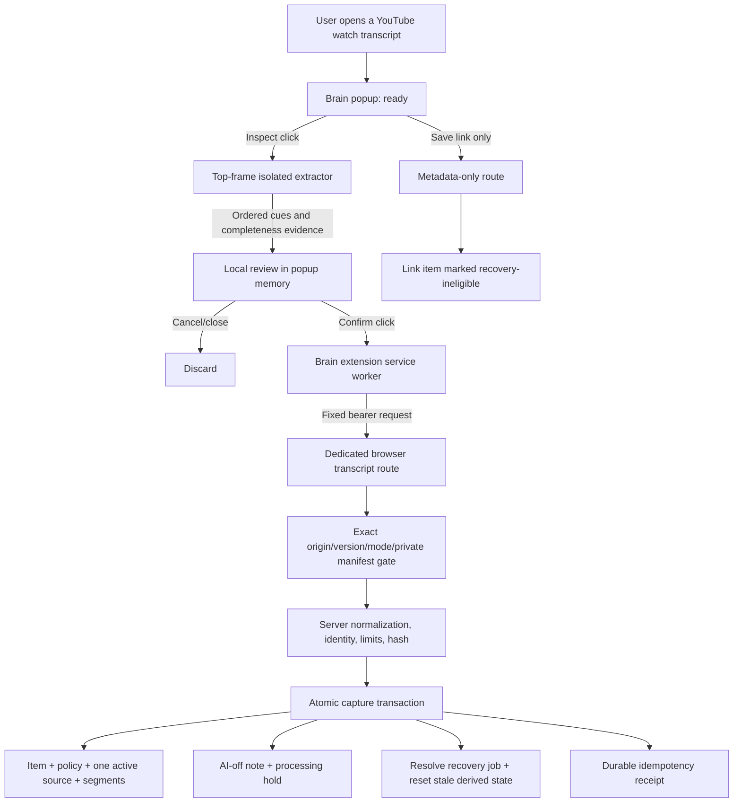

# AI Brain Explicit-Click YouTube Transcript Capture - Implementation Plan V2 Final

**Created:** 2026-07-22<br>
**Author:** Codex<br>
**Status:** Final implementation-ready planning artifact<br>
**Source PRD:** `2026-07-22_ai_brain_youtube_dom_capture_prd_v2_final.md`<br>
**Supersedes:** `2026-07-22_ai_brain_youtube_dom_capture_implementation_plan_v1.md`<br>
**Branch:** `codex/youtube-dom-capture-prd-v2`<br>
**Release decision:** Link-only may ship independently after its gates; browser-visible transcript is fixture/local go, approved lab conditional go, production no-go<br>

## Executive Summary

Implement two deliberately separate extension commands:

1. **Save link only:** a strict metadata-only endpoint that never fetches YouTube and leaves a durable marker that excludes the item from automatic and manual transcript-recovery backfills.
2. **Inspect and save visible transcript:** a two-action browser path that extracts one already-visible transcript panel in an isolated execution, proves continuous ordered traversal, previews bounded evidence, and sends a strict payload to a dedicated bearer-only endpoint.

The browser route accepts only a manifest-authorized extension ID/version, mandatory client API version, and required route contract version. The server owns policy, caption class, normalization, hashes, idempotency, and processing permission. One SQLite transaction commits the item/source/segments/note/processing hold/recovery resolution/receipt. A database-backed item `content_revision` fences every asynchronous writer: recovery, URL upgrade, enrichment, and embedding results computed from an older body are discarded.

V0.1 stores cue start times only. It preserves order and legitimate repeated cues; it never globally deduplicates or sorts. It stores `duration_ms=null`, `end_ms=null`, and server-owned `caption_source_class='unknown'`.

A live canary uses a separately deployed lab service and separate disposable data root/DB. V0.1 places captured text under an active downstream-processing hold. Production browser capture is rejected before the request body is read, regardless of approval IDs or lab feature values.

## Planning Inputs

- Final PRD: `2026-07-22_ai_brain_youtube_dom_capture_prd_v2_final.md`
- Product-manager discovery and V1 review artifacts in this folder.
- Technical-architect discovery and V1 review artifacts in this folder.
- Both timestamped adversarial-review reports in this folder.
- `2026-07-22_youtube_dom_capture_review_resolution_matrix.md`
- Existing implementation in `extension/`, `src/app/api/capture/`, `src/lib/capture/`, `src/db/`, and `src/lib/queue/`.
- UX reference: `prototype/2026-07-22_ai_brain_youtube_dom_capture_ux_prototype.html`.

## Non-Negotiable Decisions

| ID | Decision |
|---|---|
| ADR-YTC2-01 | Extend the existing Brain extension; do not create a second companion extension. |
| ADR-YTC2-02 | Add only `scripting`; use temporary `activeTab`, top frame, and default isolated world. |
| ADR-YTC2-03 | Do not inspect before explicit inspect and do not transfer before explicit confirm. |
| ADR-YTC2-04 | Require an already-visible panel and user-selected track. Do not click YouTube controls in V0.1. |
| ADR-YTC2-05 | Use ordered viewport overlap; preserve repetition; reject gaps; never sort the final cue sequence. |
| ADR-YTC2-06 | Support standard watch pages for live V0.1. Keep Shorts synthetic-only. |
| ADR-YTC2-07 | Use dedicated transcript and link-only routes. Neither route imports YouTube extraction providers. |
| ADR-YTC2-08 | Bind the transcript route to bearer auth, exact extension origin, mandatory contract version, feature mode, and private manifest. |
| ADR-YTC2-09 | Use distinct `browser_visible_transcript` method/source and `caption_source_class='unknown'`. |
| ADR-YTC2-10 | Server computes normalized text, text/request hashes, timing mode, policy, and source class. |
| ADR-YTC2-11 | Enforce one active transcript source per item in SQLite. No V0.1 replacement. |
| ADR-YTC2-12 | Persist all browser-capture side effects and recovery resolution in one transaction. |
| ADR-YTC2-13 | Require recovery workers to compare-and-apply their current claim and weak-item eligibility transactionally. |
| ADR-YTC2-13A | Add monotonic `items.content_revision`; every body update advances it and every async claim/apply path proves its expected revision. |
| ADR-YTC2-14 | Force optional notes AI-off and conflict on a different existing note. |
| ADR-YTC2-15 | Insert an active downstream-processing hold for every V0.1 browser transcript. |
| ADR-YTC2-16 | Mark link-only items `browser_link_only_v1` and exclude them from trigger and every backfill path. |
| ADR-YTC2-16A | Route every extension action literally named `Save link` through link-only; rename richer page/selection actions instead of misrepresenting them. |
| ADR-YTC2-17 | Use a separate lab deployment/data root/DB for live validation. |
| ADR-YTC2-17A | Run V0.1 live lab with all enrichment, embedding, note-index, transcript-recovery, and batch workers disabled; database holds remain defense in depth. |
| ADR-YTC2-18 | Production browser capture is blocked in code; configuration cannot promote it. |
| ADR-YTC2-19 | Immediate server disable on the forward-compatible release is the normal rollback. |

## Target Architecture



## Trust Boundaries And Threat Controls

| Boundary | Authority | Explicitly denied |
|---|---|---|
| YouTube page DOM | Plain visible text and page-visible metadata only | Brain token, destination, cookies, network replay, policy fields |
| Injected isolated function | Temporary active-tab DOM read and transcript-panel scroll | Extension storage, arbitrary fetch, persistent execution, page-world bridge |
| Popup | Review state and unconfirmed payload in memory | Durable transcript storage, implicit retry after close |
| Service worker | Reads Brain bearer and calls compile-time endpoint | Arbitrary destination, payload logging, page-originated command authority |
| Browser transcript route | Auth, exact caller/version, server validation | Session-cookie-only auth, missing/foreign origin, client policy/hash trust |
| Policy/manifest | Exact lab run/target/extension/retention decision | Production promotion, wildcard targets, expired run, external processing |
| SQLite transaction | Serialized durable mutation and CAS checks | Partial commit, different-content overwrite, two active sources |
| Background workers | Claim only unheld/current eligible items | Held item processing, stale recovery apply |

### Threats That Must Have Tests

1. YouTube page tries to observe the Brain token or choose an upload destination.
2. Another extension or origin possesses the shared bearer.
3. Missing `Origin`, `X-Brain-Client-Api`, or route-contract header is accepted through shared compatibility helpers.
4. Page navigates, replaces document/panel, or switches track during inspection/review.
5. Virtualized scrolling skips cues or recycles equal DOM nodes.
6. A transcript contains HTML/script-like text.
7. Popup or MV3 worker closes during confirm and retries.
8. Two different request IDs race to create active sources.
9. Recovery worker returns after browser capture commits.
10. Enrichment or embedding worker claims newly retained text without permission.
11. Link-only trigger or later backfill schedules recovery.
12. Logs/errors/screenshots expose content or identifiers.

## Proposed File Map

### Extension

```text
extension/manifest.json
extension/package.json
extension/vite.config.ts
extension/src/background.ts
extension/src/capture.ts
extension/src/popup.html
extension/src/popup.ts
extension/src/popup-state.ts
extension/src/popup-state.test.ts
extension/src/youtube/url.ts
extension/src/youtube/url.test.ts
extension/src/youtube/types.ts
extension/src/youtube/limits.ts
extension/src/youtube/normalize.ts
extension/src/youtube/overlap.ts
extension/src/youtube/overlap.test.ts
extension/src/youtube/extractor-core.ts
extension/src/youtube/extractor-core.test.ts
extension/src/youtube/injected-entry.ts
extension/src/youtube/fixtures/*.html
extension/tests/mv3-youtube-capture.e2e.ts
extension/tests/mv3-youtube-capture.privacy.e2e.ts
```

### Server And Database

```text
src/app/api/capture/link/route.ts
src/app/api/capture/link/route.test.ts
src/app/api/capture/youtube-browser-transcript/route.ts
src/app/api/capture/youtube-browser-transcript/route.test.ts
src/lib/capture/youtube-browser/constants.ts
src/lib/capture/youtube-browser/schema.ts
src/lib/capture/youtube-browser/auth.ts
src/lib/capture/youtube-browser/manifest.ts
src/lib/capture/youtube-browser/manifest.test.ts
src/lib/capture/youtube-browser/normalize.ts
src/lib/capture/youtube-browser/service.ts
src/lib/capture/youtube-browser/service.test.ts
src/lib/capture/youtube-browser/diagnostics.ts
src/lib/capture/youtube-browser/diagnostics.test.ts
src/lib/capture/policy.ts
src/lib/capture/policy.test.ts
src/lib/auth/bearer.ts
src/lib/auth/api-version.ts
src/proxy.ts
src/db/transcripts.ts
src/db/transcript-jobs.ts
src/db/transcript-jobs.test.ts
src/db/item-upgrades.ts
src/db/item-upgrades.test.ts
src/db/item-notes.ts
src/db/migrations/026_youtube_browser_transcript.sql
src/db/migrations/026_youtube_browser_transcript.test.ts
src/db/migrations/026_youtube_browser_transcript.test.setup.ts
src/lib/queue/transcript-worker.ts
src/lib/queue/transcript-worker.test.ts
src/lib/queue/enrichment-worker.ts
src/lib/queue/enrichment-worker.test.ts
src/lib/queue/embedding-worker.ts (or the actual central embedding claim module)
src/lib/enrich/pipeline.ts
src/lib/enrich/pipeline.test.ts
src/lib/embed/pipeline.ts
src/lib/embed/pipeline.test.ts
src/app/api/capture/url/route.ts
src/app/api/capture/url/route.test.ts
src/instrumentation.ts
src/lib/capture/youtube-transcript/backfill.ts
src/lib/capture/youtube-transcript/backfill.test.ts
scripts/activate-release.sh
```

### Operations And Documentation

```text
scripts/check-youtube-browser-transcript-manifest.mjs
scripts/check-youtube-browser-transcript-privacy.mjs
scripts/smoke-youtube-browser-transcript-fixtures.mjs
scripts/canary-youtube-browser-transcript.mjs
scripts/cleanup-youtube-browser-transcript-canary.mjs
docs/runbooks/youtube-browser-transcript-lab.md
data/private/youtube-browser-transcript/manifest.json  # ignored; example only is committed
```

Use actual existing worker/module names discovered during implementation. Do not create a duplicate embedding path merely to match this map.

## Shared Contract Constants

Define values once in extension and server modules, with a contract snapshot test that fails on drift:

```ts
export const YOUTUBE_BROWSER_CONTRACT = 1;
export const EXTRACTOR_ALGORITHM = "ordered-overlap-v1";
export const MAX_WALL_CLOCK_MS = 15_000;
export const MAX_SCROLL_ITERATIONS = 150;
export const MAX_SEGMENTS = 7_200;
export const MAX_NORMALIZED_CHARS = 500_000;
export const MAX_CUE_CHARS = 2_000;
export const MAX_REQUEST_BYTES = 2 * 1024 * 1024;
export const REQUIRED_STABLE_BOTTOM_CHECKS = 3;
export const SCROLL_STEP_RATIO = 0.75;
```

Additional bounded fields:

- title: 500 normalized characters;
- visible track label: 200 characters;
- language code: 32 ASCII characters from a strict pattern or null;
- extractor/renderer/algorithm literals: allowlisted, not arbitrary strings;
- cue start: safe integer, `0 <= start_ms <= 86_400_000`;
- note: existing item-note limit, with an additional request-body cap;
- request ID: canonical UUID;
- server receive time is authoritative; client timestamps are not required.

### Benchmark Protocol

Ratify the constants on a recorded reference matrix before lab packaging:

- exact current and previous stable Chrome versions;
- one recorded arm64 laptop/CI runner with CPU/RAM/OS details;
- one recorded lab server shape with CPU/RAM/storage details;
- dynamic virtualized fixtures at 30 minutes and 3 hours/7,200 cues, including repeated equal cues and mixed cue lengths;
- five warm-up runs followed by at least 100 measured runs per fixture/browser combination;
- p50/p95/max wall time, snapshots, scrolls, memory, and exact-sequence result;
- exact 15-second/150-scroll boundary and one-over failures.

If this benchmark cannot meet the shared limits without a false reject, change the contract through a reviewed version bump; do not silently tune client and server independently.

## Extension Implementation

### Manifest And Build

Add `scripting` to permissions. Keep existing `activeTab`, `tabs`, `storage`, context menus, and notifications. Do not add:

- `cookies`;
- `webRequest` or `webRequestBlocking`;
- `tabCapture`;
- `offscreen`;
- persistent YouTube host permission;
- `<all_urls>`;
- a static YouTube content script.

Add package scripts for unit tests and local MV3 E2E. Add tests that snapshot the exact permission and host sets. The lab build has compile-time values for Brain lab origin, feature enablement, route contract, and extractor version. Ordinary/production builds default the transcript feature off.

The private server manifest records the actual installed extension ID and version. The extension ID is not treated as secret. A changed ID/version requires manifest review; wildcard IDs are invalid.

### URL Eligibility

`youtube/url.ts` is pure and shared by popup fixture tests. It returns:

```ts
type YoutubeRoute =
  | { kind: "watch"; videoId: string; canonicalUrl: string }
  | { kind: "shorts_fixture_only"; videoId: string; canonicalUrl: string }
  | { kind: "unsupported"; reason: string };
```

For live V0.1, only `https://www.youtube.com/watch?v=<11-char-id>` is eligible after canonicalization. Reject channel, search, playlist-only, embed, mobile/alternate host unless explicitly normalized and tested, malformed IDs, and mixed host tricks. A watch URL may contain unrelated query fields, but the canonical identity retains only the video ID.

### Popup Reducer

Use a pure reducer with no transcript-bearing browser storage:

```ts
type YoutubeCaptureState =
  | { name: "setup_required" }
  | { name: "unsupported_tab" }
  | { name: "ready"; tab: EligibleTab; draft: DraftFields }
  | { name: "panel_not_open"; tab: EligibleTab; draft: DraftFields }
  | { name: "inspecting"; identity: InspectionIdentity; draft: DraftFields }
  | { name: "review_ready"; identity: InspectionIdentity; draft: DraftFields; result: ExtractedTranscript }
  | { name: "inspect_error"; code: InspectErrorCode; draft: DraftFields }
  | { name: "saving"; requestId: string; review: ReviewSummary }
  | { name: "saved"; receipt: CaptureReceipt }
  | { name: "save_error"; requestId: string; code: SaveErrorCode; review?: ReviewSummary };
```

Rules:

1. Opening popup reads only tab URL/title to establish a watch-page `ready` state. It performs no injection, DOM message, panel-presence query, cue read, or transcript telemetry. Only inspect may determine `panel_not_open` or `transcript_unavailable`.
2. `Inspect visible transcript` starts one injected execution and creates an in-memory request ID.
3. Preserve title and note through inspect/review.
4. `review_ready` contains the payload in popup memory only.
5. Before confirm, query active tab and run a lightweight injected identity check against the inspection token.
6. Any tab/URL/video/document/panel/renderer/track mismatch becomes `stale_review` and discards cues.
7. `Save link only` calls only `captureLinkOnly()`.
8. The hyperlink context-menu action `Save link to Brain` also calls `captureLinkOnly()`. Page and selection actions may retain richer behavior only under labels that do not claim link-only semantics, such as `Save and enrich this page` and `Save selected text`.
9. Closing before dispatch discards all transcript/request state. Closing after service-worker dispatch does not cancel the server request; notification reports the committed outcome.
10. A network retry while the same review remains open reuses request ID and byte-identical logical payload.

Version-related server failures map to `update_required` with copy: `This transcript reader needs an approved update. Link-only saving is still available.` The server may disable immediately; the operator owns lab package replacement within one working day during an active canary. There is no remote code or selector update.

### Injection Identity

At inspection start, pin:

- Chrome tab ID from extension context;
- top frame only (`frameId=0`);
- canonical start URL, watch route, and video ID;
- an execution-local document identity token;
- the visible panel and scroll-container object references;
- renderer family;
- selected-track evidence: stable visible label/code when available and the selected control/container reference.

During every render wait/scroll and immediately before returning, verify URL/video/document references, `isConnected`, visibility, renderer family, and selected-track evidence. Immediately before confirm, verify again in a fresh top-frame execution. Do not send the document token to the server; it protects the local review.

### Ordered Virtualization Algorithm

The injected entry performs one bounded asynchronous operation:

1. Validate top-level watch identity and locate exactly one visible supported transcript panel.
2. Save `originalScrollTop` and register a scoped `MutationObserver` used only for quiet-state timing.
3. In `try`, set panel scroll top to logical top and wait for two animation frames plus a bounded mutation-quiet interval.
4. Parse one renderer family. Each viewport snapshot is an ordered array of normalized `{start_ms,text}` cue identities plus raw cue data. Reject mixed renderer families, non-cue ambiguity, missing time, malformed text, or cap breach.
5. Require the first snapshot to represent logical top (`scrollTop <= 1`).
6. Maintain an ordered assembled sequence. For each next viewport, compute the longest `k > 0` where the last `k` identities of assembled equal the first `k` identities of the new snapshot.
7. Append the new snapshot suffix after `k`. Do not remove duplicate occurrences already in sequence. Do not use DOM node identity. Do not globally deduplicate.
8. Advance by `max(1, floor(clientHeight * 0.75))`, capped at physical bottom. Wait for bounded mutation quiet before the next snapshot.
9. Before bottom, fail if overlap is zero, no new cue appears across the allowed stuck threshold, scrollTop does not advance, scroll metrics regress impossibly, the container is replaced, or any identity check changes.
10. At physical bottom, require the ordered terminal snapshot, final cue identity, scrollTop/clientHeight/scrollHeight, and mutation-quiet state to be identical for three checks. Bottom snapshots may add no cue.
11. Require contiguous output indices and nondecreasing safe-integer starts. Preserve equal start times and repeated text in observed order.
12. Return success only with `reached_top=true`, `reached_bottom=true`, `stable_bottom_checks=3`, and `overlap_failures=0` under all limits.
13. In `finally`, disconnect observer and restore `originalScrollTop`, even after timeout, cancellation, navigation, or error.

Pseudocode for overlap merge:

```ts
function mergeOrdered(previous: Cue[], viewport: Cue[]): Cue[] {
  const max = Math.min(previous.length, viewport.length);
  for (let k = max; k > 0; k -= 1) {
    if (sameSequence(previous.slice(-k), viewport.slice(0, k))) {
      return previous.concat(viewport.slice(k));
    }
  }
  throw new InspectError("virtualization_incomplete");
}
```

The initial snapshot is accepted without overlap. An empty cue list is never success. If adjacent repeated cues produce no observable progress, fail rather than guess.

### Normalization Contract

Client normalization exists for review and local limits, but is not authoritative:

- read `textContent`, never `innerHTML`;
- normalize CRLF to LF;
- replace non-breaking space with ordinary space;
- collapse horizontal whitespace within lines;
- trim each cue and reject empty normalized text;
- preserve meaningful line breaks within the 2,000-character cue cap;
- do not interpret Markdown, HTML, URLs, or script-like text;
- parse displayed cue starts through renderer-specific tested logic;
- emit no duration/end time.

The server runs the same versioned normalization again and computes the stored text and hashes.

### Inspection Result

```ts
interface ExtractedTranscript {
  routeKind: "watch";
  videoId: string;
  visibleTrackLabel: string | null;
  languageCode: string | null;
  rendererFamily: "modern" | "legacy";
  extractorVersion: string;
  algorithmVersion: "ordered-overlap-v1";
  segments: Array<{ idx: number; startMs: number; text: string }>;
  completeness: {
    reachedTop: true;
    reachedBottom: true;
    snapshots: number;
    scrollIterations: number;
    stableBottomChecks: 3;
    overlapFailures: 0;
    elapsedMs: number;
  };
}
```

No client hash, caption class, policy, rights, retention, destination, HTML, player data, signed URL, account identifier, or browser state is in this result.

### Service Worker Dispatch

The popup sends a discriminated confirmed message to the service worker. The worker:

1. validates discriminator, scalar fields, array bounds, and serialized size;
2. rechecks feature packaging and fixed endpoint;
3. reads the Brain bearer only in extension context;
4. sends required bearer, `X-Brain-Client-Api`, origin supplied by Chrome, content type, route-contract header, and extension version;
5. never logs payload, URL, title, IDs, labels, note, or transcript;
6. returns/announces typed receipt;
7. retries only through explicit user action or a known in-flight retry path with the same request ID;
8. never writes transcript text to extension storage.

## True Link-Only Path

### Route

```text
POST /api/capture/link
```

Scope V0.1 to the extension's explicit YouTube fallback. Do not change generic APK or current `/api/capture/url` behavior in this PR.

The hyperlink context-menu command currently named `Save link to Brain` is also in scope and must use this route. Existing page/selection commands can retain `/api/capture/url` only with distinct non-link-only labels and tests. Feature-disabled YouTube companion mode must still route a literal `Save link only` choice here.

Request:

```json
{
  "contract_version": 1,
  "request_id": "uuid",
  "url": "https://www.youtube.com/watch?v=aircAruvnKk",
  "title": "Visible page title",
  "note": "optional"
}
```

Behavior:

1. Require bearer, exact configured extension origin, mandatory `X-Brain-Client-Api: 1`, required link contract/body version, strict JSON, and byte cap. A valid session cookie without bearer fails.
2. Canonicalize the watch URL with the shared pure server helper.
3. Insert/return a metadata-only item with `capture_source='extension'`, `capture_quality='metadata_only'`, and `extraction_method='browser_link_only_v1'`.
4. Save an optional note separately with `include_in_ai=0`; different existing note conflicts.
5. Modify the recovery trigger and all backfill/repair eligibility queries to exclude `browser_link_only_v1`.
6. Make no network call and import no YouTube extractor/recovery enqueue helper.
7. Assert no `transcript_jobs` row exists after commit and cannot be created by the standard backfill for this item.
8. Same request/hash replays; mismatched request reuse conflicts; same canonical item returns duplicate under note rules.
9. Return only `created|duplicate`, item ID, request ID, and note action. Never claim transcript success.

A throwing global `fetch`, trigger inspection, direct queue query, and backfill execution are all required tests. Excluding only the route-level enqueue is insufficient because migration 021 has an insert trigger.

## Browser Transcript Endpoint

### Route And Required Headers

```text
POST /api/capture/youtube-browser-transcript
Authorization: Bearer <paired token>
Content-Type: application/json
X-Brain-Client-Api: 1
X-Brain-Youtube-Capture-Contract: 1
X-Brain-Extension-Version: <packaged version>
```

Route-local rules override shared backward compatibility:

- `Authorization` must be present and valid; session cookie alone is rejected.
- `Origin` must be present and exactly `chrome-extension://<manifest-approved-id>`.
- `X-Brain-Client-Api: 1` is mandatory even though the shared legacy helper accepts omission.
- contract header is mandatory and exact.
- extension version and JSON extractor version must be manifest-approved.
- no arbitrary capture-source header is trusted as authentication.
- response uses `Cache-Control: no-store` and exact-origin CORS when applicable.
- transcript route limit starts at five confirmed requests/minute per bearer for lab; manifest may lower, not raise, the hard cap.

### Request V1

```json
{
  "contract_version": 1,
  "request_id": "0b8a7abf-7fb6-4fa0-980f-9b3a7fe0bca3",
  "page": {
    "url": "https://www.youtube.com/watch?v=aircAruvnKk",
    "video_id": "aircAruvnKk",
    "title": "Visible page title"
  },
  "note": "optional",
  "transcript": {
    "visible_track_label": "English",
    "language_code": "en",
    "segments": [
      { "idx": 0, "start_ms": 0, "text": "Synthetic cue text" }
    ]
  },
  "extraction": {
    "extractor_version": "brain-youtube-dom/1",
    "algorithm_version": "ordered-overlap-v1",
    "renderer_family": "modern",
    "route_kind": "watch",
    "snapshots": 18,
    "scroll_iterations": 17,
    "stable_bottom_checks": 3,
    "reached_top": true,
    "reached_bottom": true,
    "overlap_failures": 0,
    "elapsed_ms": 1420
  },
  "consent_copy_version": "youtube-browser-transcript-v2"
}
```

Strict schema rejects every unknown field, including client caption class, hashes, counts, duration/end, policy, rights, retention, processing mode, approval ID, provenance kind, destination URL, HTML, player response, cookies, headers, account identity, signed URLs, or raw browser data.

### Validation Order

1. Detect authoritative deployment environment and feature mode before reading the body. Production returns `feature_disabled`.
2. Verify bearer header and route rate limit.
3. Require present exact origin, mandatory client API header, route contract header, extension version, and JSON content type.
4. Stream body with a hard 2 MiB limit even when `Content-Length` is absent, false, duplicated, or smaller than actual bytes.
5. Parse strict JSON and validate every scalar/array bound.
6. Canonicalize watch URL and prove host/route/video-ID agreement.
7. Load and validate private manifest file security, hash, expiry, lab data root, extension/version/extractor, exact video target, rights, retention, processing hold, and cleanup deadline.
8. Validate extraction evidence literals and required successful completeness shape. Treat it as client evidence, not independent DOM proof.
9. Require contiguous indices, nondecreasing safe-integer starts, nonempty bounded cue text, and no over-limit normalized result.
10. Normalize cue text server-side, assemble deterministic body, and compute text SHA-256.
11. Normalize optional note and compute server request hash over the canonical logical request.
12. Enter one immediate SQLite transaction for receipt, conflicts, mutation, recovery resolution, processing hold, and receipt.
13. Return a no-store typed response with no content echo.

### Server Text Assembly

Store ordered cues without sorting. The deterministic item body is the normalized cue texts joined by `\n`. The source has `timestamp_mode='timestamped'`; each segment stores its observed `start_ms`, `duration_ms=NULL`, and `end_ms=NULL`. Compute per-segment hashes and the whole-text hash on the server.

The source provenance JSON includes only versioned allowed fields: browser-visible observation label, extractor/algorithm/renderer versions, visible track/language when stable, completeness counters, server normalization version, and server receive time. It never claims official/manual/ASR status.

### Response

```json
{
  "contract_version": 1,
  "request_id": "0b8a7abf-7fb6-4fa0-980f-9b3a7fe0bca3",
  "action": "created",
  "note_action": "none",
  "item_id": "item-id",
  "transcript_source_id": "source-id",
  "text_sha256": "server-computed-hex",
  "review_path": "/review?focus=item-id"
}
```

`action` is `created`, `upgraded`, or `duplicate_same_transcript`. Different content returns a 409 error, not a success action. `note_action` is `none`, `created`, or `duplicate`.

### Error Contract

| HTTP | Stable code |
|---:|---|
| 400 | `invalid_json`, `validation_failed`, `video_identity_mismatch`, `invalid_segments`, `completeness_unproven` |
| 401 | `unauthenticated` |
| 403 | `origin_not_allowed`, `feature_disabled`, `policy_blocked`, `manifest_target_blocked`, `processing_not_allowed` |
| 409 | `request_id_mismatch`, `existing_transcript_conflict`, `existing_note_conflict`, `legacy_provenance_conflict` with replayable conflict receipt and existing item ID when authorized |
| 413 | `payload_too_large`, `too_many_segments`, `text_too_large`, `cue_too_large` |
| 415 | `unsupported_content_type` |
| 422 | `client_api_version_mismatch`, `contract_version_mismatch`, `extension_version_disabled`, `extractor_version_disabled`, `text_too_short`; client maps version failures to `update_required` |
| 429 | `rate_limited` with bounded `Retry-After` |
| 503 | `lab_manifest_unavailable`, `lab_environment_invalid`, `capture_temporarily_disabled` |
| 500 | `capture_failed` only after no partial commit is verified |

Error responses include a stable code and request ID only when it came from a structurally valid bounded request. They never echo title, URL, video ID, label, note, cue, hash inputs, or stack/request fragments.

## Deployment Environment And Policy

### Environment Precedence

Replace `BRAIN_TRANSCRIPT_ENV` promotion behavior with an authoritative deployment classification:

```text
BRAIN_DEPLOYMENT_ENV=production|lab|development|test
BRAIN_PRODUCTION_RUNTIME=0|1
```

Decision order:

1. `BRAIN_PRODUCTION_RUNTIME=1` or `BRAIN_DEPLOYMENT_ENV=production` means production.
2. Conflicting production/lab markers mean production and startup/route failure.
3. Explicit lab is accepted only with a non-production data root whose identity matches the private manifest.
4. An optimized `NODE_ENV=production` build may run in lab only when the authoritative deployment marker is `lab`, production marker is false, and data-root checks pass.
5. Missing/unknown deployment marker defaults to production-blocked for this route.
6. `BRAIN_TRANSCRIPT_ENV`, approval ID, feature mode, or manifest cannot override an authoritative production marker.

Refactor `currentTranscriptEnvironment()` so production classification is evaluated before legacy transcript overrides. The route cannot pass an environment override. Both `browser_visible_transcript` and `lab_public_caption` are blocked when the authoritative runtime is production, and this V0.1 method always persists `production_allowed=0`. Add exhaustive matrix tests, including `NODE_ENV=production` plus legacy `BRAIN_TRANSCRIPT_ENV=lab`, conflicting authoritative markers, and approval IDs.

### Method Policy

Add `browser_visible_transcript` to acquisition/source types and SQLite checks. For V0.1 it is allowed only when all are true:

- environment is lab/test/development, never production;
- server mode is `lab` or fixture test;
- manifest is valid and exact target matches;
- rights basis is `owned_youtube_channel` or `authorized_youtube_video`;
- retention is `full_text_allowed` with delete-by within seven days;
- processing mode is `hold`;
- source class is server-owned `unknown`.

Also remove the ability for a legal approval ID alone to production-enable `lab_public_caption`. Preserve any unrelated compatibility behavior only through a separately reviewed method-specific test; default is block.

### Independent Kill Switches

```text
# Extension package
YOUTUBE_DOM_CAPTURE_ENABLED=false
YOUTUBE_DOM_CAPTURE_ENDPOINT=<compile-time-fixed-lab-origin>

# Server
BRAIN_YOUTUBE_BROWSER_TRANSCRIPT_MODE=disabled|lab
BRAIN_YOUTUBE_BROWSER_TRANSCRIPT_MANIFEST_PATH=<private-absolute-path>
BRAIN_YOUTUBE_BROWSER_DISABLED_EXTRACTORS=<static-list>
BRAIN_BACKGROUND_WORKERS_MODE=enabled|disabled
```

Missing/invalid values disable. V0.1 accepts no `production` server mode. Live lab requires `BRAIN_BACKGROUND_WORKERS_MODE=disabled`; `src/instrumentation.ts` must prove that enrichment, embedding, note-index, transcript-recovery, and batch workers do not start. The server may disable a packaged extractor/version but may not send code or selector changes.

## Private Manifest

Committed code includes a strict schema and synthetic example only. The real file stays outside Git, is regular (not symlink), owned by the configured operator/root identity, and mode `0600`.

```json
{
  "schema_version": 1,
  "run_id": "private-run-reference",
  "approval_id": "private-approval-reference",
  "platform_terms_decision_id": "private-platform-decision-reference",
  "platform_terms_decision_owner": "approved-decision-owner",
  "platform_terms_decision_expires_at_ms": 1785200000000,
  "reviewer": "approved-reviewer",
  "operator": "approved-operator",
  "cleanup_owner": "approved-cleanup-owner",
  "issued_at_ms": 1784600000000,
  "expires_at_ms": 1785200000000,
  "deployment_environment": "lab",
  "lab_data_root_id": "expected-nonproduction-data-root-fingerprint",
  "extension": {
    "ids": ["exact-chrome-extension-id"],
    "versions": ["0.7.0-lab.1"],
    "route_contract_versions": [1],
    "extractor_versions": ["brain-youtube-dom/1"]
  },
  "processing": {
    "downstream_processing": "none",
    "mode": "hold",
    "approved_providers": []
  },
  "diagnostics": {
    "server_retention_days": 14,
    "local_retention_days": 30
  },
  "cleanup": {
    "command_id": "youtube-browser-canary-cleanup-v1",
    "verification_query_id": "youtube-browser-canary-verify-v1",
    "backup_expiry_acknowledged": true
  },
  "targets": [
    {
      "video_id": "approved-watch-id",
      "rights_basis": "authorized_youtube_video",
      "retention_class": "full_text_allowed",
      "delete_by_ms": 1785200000000
    }
  ]
}
```

The platform decision must explicitly address automated DOM inspection for the exact live research scope before the first live inspect, not merely before storage or production. The loader validates file metadata on every cold start and caches only the parsed value plus content hash until the earlier of file change or expiry. Route processing rechecks current time/target. Invalid reload disables; it does not keep a stale authorized manifest.

## Migration 026

### Preflight

Before applying migration 026 on any nonempty database:

1. enumerate every current method/source/status/retention value;
2. fail if more than one `status='active'` source exists for any item;
3. fail if a transcript-bearing item has no source provenance and would be eligible for implicit upgrade;
4. capture row counts, stable hashes, indexes, triggers, and foreign-key manifest;
5. make and verify a fresh backup;
6. run the migration on a production-shaped disposable snapshot.

Do not auto-supersede historical duplicates. Produce an explicit cleanup decision first.

### Schema Changes

1. Rebuild `capture_policy_decisions` preserving all rows/fields and adding:
   - method `browser_visible_transcript`;
   - `processing_mode` constrained to `not_applicable|hold`, defaulting existing rows to `not_applicable`.
2. Rebuild `transcript_sources` preserving all rows/fields and adding source kind `browser_visible_transcript`.
3. Add `items.content_revision INTEGER NOT NULL DEFAULT 1` and a database trigger that increments it whenever `items.body` changes. Add `expected_content_revision` and claim-token fields needed by transcript, enrichment, and embedding jobs. Existing rows/jobs are initialized from the current item revision.
4. Add:

```sql
CREATE UNIQUE INDEX transcript_sources_one_active_per_item
  ON transcript_sources(item_id)
  WHERE status = 'active';
```

5. Add a nullable `claim_token TEXT` to `transcript_jobs`; claims set a fresh unguessable token and terminal/resolved states clear it.
6. Create immutable route receipts before either new endpoint ships:

```sql
CREATE TABLE extension_capture_requests (
  request_id TEXT PRIMARY KEY,
  route_kind TEXT NOT NULL CHECK (route_kind IN ('link_only','youtube_browser_transcript')),
  request_hash TEXT NOT NULL,
  item_id TEXT NOT NULL REFERENCES items(id) ON DELETE CASCADE,
  transcript_source_id TEXT REFERENCES transcript_sources(id) ON DELETE CASCADE,
  outcome TEXT NOT NULL CHECK (outcome IN ('created','upgraded','duplicate','conflict')),
  http_status INTEGER NOT NULL,
  error_code TEXT,
  note_action TEXT NOT NULL CHECK (note_action IN ('none','created','duplicate')),
  text_sha256 TEXT,
  created_at INTEGER NOT NULL
);
```

7. Create processing holds:

```sql
CREATE TABLE content_processing_holds (
  item_id TEXT PRIMARY KEY REFERENCES items(id) ON DELETE CASCADE,
  transcript_source_id TEXT NOT NULL REFERENCES transcript_sources(id) ON DELETE CASCADE,
  policy_decision_id TEXT NOT NULL REFERENCES capture_policy_decisions(id) ON DELETE CASCADE,
  state TEXT NOT NULL CHECK (state IN ('held','released')),
  reason TEXT NOT NULL CHECK (reason = 'youtube_browser_v0_1'),
  created_at INTEGER NOT NULL,
  released_at INTEGER
);
```

V0.1 creates only `held`. No UI/API releases a hold.

8. Drop and recreate `items_enqueue_youtube_transcript_recovery` so its predicate excludes `extraction_method='browser_link_only_v1'`.
9. Update the migration/backfill eligibility contract so all application backfills also exclude link-only and items with an active transcript source.
10. Add receipt, hold, claim, revision, item/time, and cleanup indexes.
11. Add immutable receipt triggers if consistent with existing receipt conventions.

### Migration Verification

On pre-026 fixtures containing every historical literal and related FK:

- migration applies exactly once and hash is recorded;
- `PRAGMA foreign_key_check` matches the preflight manifest;
- row counts and stable hashes are preserved;
- old literals still work; new literal works; unknown literal fails;
- duplicate active sources make preflight/migration fail clearly;
- partial unique index blocks concurrent/serial second active source;
- recovery trigger enqueues eligible weak legacy item and skips link-only item;
- receipts/holds cascade on item deletion;
- request/source FK behavior is deterministic;
- claim token lifecycle works;
- body changes monotonically advance `content_revision`, and every async job records/compares its expected revision;
- prior application binary boots and reads a disabled-feature 026 database in rehearsal before binary rollback is claimed.

## Atomic Browser-Capture Service

Create `captureBrowserVisibleYoutubeTranscript()` with transaction-aware internal helpers. Do not call wrappers that open unrelated nested transactions without proof.

### Pre-Transaction Work

- Route guard, body streaming/parsing, pure schema validation.
- Canonical URL/video validation.
- Private manifest/policy decision construction.
- Server normalization, body construction, text hash, segment hashes, note normalization, request hash.
- No YouTube or arbitrary network call.

### Transaction Order

Use one SQLite immediate transaction:

1. Look up `extension_capture_requests` by request ID.
2. Same request hash returns its recorded response. Different hash throws `request_id_mismatch` with no mutation.
3. Resolve canonical item under the database's serialized writer lock.
4. If an item has a different active source, write only an immutable replayable 409 conflict receipt linked to that item, then return `existing_transcript_conflict`; mutate no item/source/note/derived content.
5. If a transcript-bearing legacy item lacks source provenance, write only a replayable conflict receipt and return `legacy_provenance_conflict`.
6. Compute active-source behavior:
   - same server text hash: duplicate path;
   - no active source and eligible metadata-only/weak item: upgrade path;
   - no item: create path.
7. Resolve optional note before mutation decision:
   - empty: none;
   - no note: create with `include_in_ai=0`;
   - same normalized hash: duplicate;
   - different note: write only a replayable conflict receipt and return `existing_note_conflict` before any content mutation.
8. For create/upgrade, insert the allowed policy decision with `processing_mode='hold'`.
9. Create/repair item body and metadata with explicit `browser_visible_transcript` extraction method/version. The database advances `content_revision`; read the committed new revision. Clear stale summary/chunks/vectors/auto tags/topics/embedding jobs as required and stamp any reset job with that expected revision.
10. Insert active source and ordered segments with server hashes and null duration/end.
11. Insert active processing hold before commit.
12. Resolve any transcript recovery job for the item: set done, clear claim token/claim time, record browser-resolution provider, and invalidate an in-flight worker claim.
13. Create/retain note under the rules above.
14. Insert immutable terminal request receipt.
15. Commit; then return response from committed rows.

For duplicate source hash, do not create another source/policy/hold. A missing note may be created AI-off in the same transaction; a same note is duplicate. A different note conflicts before mutation. The receipt records the existing source and note action.

Every injected failure between steps must roll back item, body/revision, source, segments, note, hold, job resolution, derived reset, and receipt.

## Shared Content-Revision Fence

Recovery is not the only stale writer. `items.content_revision` is the common invariant for every body-derived asynchronous operation.

1. New items start at revision 1. A database trigger advances the revision exactly once whenever body text changes.
2. Transcript recovery, existing-item URL extraction/upgrade, enrichment, and embedding capture the current revision before any provider/network `await`.
3. Their job/claim records store `expected_content_revision` and a claim token where the queue supports claims.
4. Immediately before applying results, one transaction rechecks item revision, current claim, processing hold, and expected source eligibility.
5. A mismatch produces `stale_result_discarded`; it does not write body, summary, tags, topics, chunks, vectors, job success, or usage tied to a successful apply.
6. Browser capture advances revision, clears stale derived outputs, resolves recovery, and resets jobs to the new revision in the same transaction.
7. `src/app/api/capture/url/route.ts`, `src/db/item-upgrades.ts`, transcript worker, enrichment pipeline, and embedding pipeline all use this fence. An audit searches every item-body update and provider-await/apply pair before merge.
8. Enrichment stores/applies summary only when its expected revision still matches. Embedding writes chunks with `source_version=content_revision` and rechecks before the first insert.

Deterministic barrier tests pause each writer after it reads/calls its provider, commit a browser body change, then release it and prove zero stale apply. A control test proves the same writer succeeds when revision is unchanged.

## Recovery Worker Compare-And-Apply

Refactor claim/apply as a single claim generation:

1. Claim sets `state='running'`, increments attempts, sets `claimed_at`, and writes fresh `claim_token`; worker retains token.
2. Network recovery occurs outside the DB transaction.
3. On success, call `applyRecoveredTranscriptIfCurrent(jobId, itemId, claimToken, result)`.
4. Inside one immediate transaction, require:
   - job ID/item ID match;
   - job state is `running`;
   - claim token matches;
   - `expected_content_revision` equals current `items.content_revision`;
   - item still has weak eligible quality/method;
   - no active transcript source or browser processing hold exists;
   - item body/content revision still matches the claim's eligibility snapshot if a revision field is available.
5. If any check fails, record a content-free `stale_result_discarded` attempt outcome and perform no item/content mutation.
6. If checks pass, perform provider upgrade, source/provenance mutation, derived reset, attempt, and job done in the same transaction.

Browser capture resolves/invalidates the job before commit. SQLite writer serialization means either worker applies first and browser sees a source conflict, or browser commits first and the worker's claim/revision check fails. There is no overwrite ordering.

Required deterministic tests pause the worker after fetch and before apply, commit browser capture, then release worker; and reverse the order.

## Downstream Processing Hold

V0.1 retention does not authorize model processing.

1. Add a central `isContentProcessingHeld(itemId)` query and require lab boot with `BRAIN_BACKGROUND_WORKERS_MODE=disabled`.
2. Enrichment and embedding claim queries must exclude active holds at claim time.
3. Immediately before applying any already-running result, recheck the hold and expected content revision; stale result is discarded.
4. Note is `include_in_ai=0`, so note indexing queues purge/no-op.
5. `src/instrumentation.ts` skips enrichment, embedding, note indexing, transcript recovery, and batch worker startup in disabled mode. Lab omits provider credentials as defense in depth, but database hold/revision checks remain authoritative.
6. Local exact-text/FTS visibility in the isolated lab may be allowed because it does not send content externally; document this in the run manifest.
7. V0.1 exposes no release-hold endpoint. A future processing proposal needs a migration/API/consent/provider-scope review.

## Diagnostics And Privacy

Create a dedicated diagnostic type. No route/body object or arbitrary error metadata is accepted.

Allowed server fields:

- event name and stable outcome/error code;
- extractor, algorithm, renderer family, and contract version;
- elapsed/segment/character/request-size buckets;
- policy allow/block category;
- HTTP status;
- timestamp bucket.

Forbidden fields:

- request, item, source, video, tab, run, approval, or account identifiers;
- fingerprints that allow per-capture correlation;
- URL, title, channel, track/language label;
- transcript, cue, note, hash, payload, or response path;
- cookies, tokens, authorization, origin value, signed resources;
- IP/user-agent or stack/body fragments.

`src/proxy.ts` must not route these endpoints through existing URL/item/IP-bearing capture logs. Expected success/failure events use only the typed aggregate DTO; authentication rejection records a code/timestamp without client IP. If a future security log needs IPs, it requires a separate disclosed purpose, access rule, and fixed retention decision. Server aggregates expire after 14 days in lab. Extension aggregates error/version/renderer counts locally for 30 days, contain no page identity, and are copied only by explicit operator action. Pre-confirm outcomes are not remotely emitted.

Privacy tests place unique canary strings in every forbidden input/error field and scan console, server logs, response bodies, diagnostic export, screenshots, test artifacts, and committed files.

## Test Strategy

### Pure URL And Extractor Tests

- canonical watch and query variants;
- fixture-only Shorts;
- wrong hosts, deceptive subdomains, malformed/encoded IDs, channel/playlist/embed routes;
- modern and legacy renderer fixtures;
- multilingual visible labels and cue text;
- adjacent/nonadjacent repeated equal cue text;
- equal timestamps with different and same text;
- longest overlap at 1, full viewport, and repeated subsequences;
- zero overlap, skipped viewport, stuck scroll, changing height, recycled nodes;
- mixed/unknown renderer, chapter/non-cue rows, hidden/ambiguous/no panel;
- document/panel/renderer/track replacement;
- script-like text remains inert plain text;
- malformed/negative/non-finite/unsafe/nonmonotonic timing;
- scroll restoration on success, every error, timeout, and cancellation;
- exact limit boundaries and one over each boundary.

Use property tests to construct an ordered source sequence, generate overlapping virtualized viewports with repeated cues, and assert exact sequence equality after merge. Randomly delete overlap or reorder a viewport and assert failure.

### Popup/Service Worker Tests

- reducer transitions for every PRD state;
- no injection before inspect;
- ready copy is based only on URL/title and says `YouTube video ready... Nothing has been read`;
- no transcript network before confirm;
- copy version and exact inspect/confirm/link-only/conflict/backup copy;
- title/note preservation;
- stale review invalidation before confirm;
- fixed endpoint and message discriminator;
- hyperlink `Save link to Brain` and disabled companion link fallback use metadata-only route; page/selection labels remain distinct;
- page cannot observe token;
- popup-close discard before dispatch;
- close/restart after dispatch and idempotent retry;
- network/auth/rate/version/feature/policy/conflict responses;
- keyboard/focus/live-region/reduced-motion/200% zoom/long-label behavior.

### Route/Auth Tests

- valid exact extension origin and bearer;
- missing origin, foreign extension, normal web origin, `null` origin;
- cookie only, missing/invalid bearer;
- missing/wrong client API, route contract, extension, and extractor versions, mapped to `update_required` where applicable;
- disabled mode, production marker, conflicting env markers, wrong lab data root;
- strict unknown keys at every nesting level;
- body exactly 2 MiB and one byte over, with absent/lying `Content-Length` and chunked stream;
- all scalar/array/string/timing limits;
- server recomputation ignores no client hash because none is accepted;
- response/error no-store and no content echo;
- rate limit and bounded retry-after.

### Manifest Tests

- regular root/operator-owned `0600` file;
- symlink, wrong owner/mode, malformed JSON, unknown fields/version;
- expired/not-yet-valid run, wildcard/missing target;
- extension/version/extractor/contract mismatch;
- production/data-root mismatch;
- rights/retention/delete-by over seven days;
- processing mode other than hold or nonempty providers;
- invalid cleanup/backup acknowledgement;
- file replacement invalidates cache and fail-closes.

### Persistence And Concurrency Tests

- new item, weak item upgrade, same-source duplicate;
- different active source, legacy source-less transcript, different note conflicts;
- note absent/same/different and forced AI-off;
- same request/hash replay, same request/mutation mismatch, same text/new request duplicate;
- concurrent different request IDs create one active source;
- unique-index violation maps to typed conflict;
- injected failure after every transaction step leaves no partial rows or derived reset;
- processing hold blocks worker claim and stale running result apply;
- content-revision barriers for URL upgrade, recovery, enrichment, and embedding in both stale and unchanged controls;
- recovery/browser race in both orders;
- source/segment ordered hashes and null durations/ends;
- deletion cascades source, segments, note, hold, receipts, chunks/vectors/summaries/jobs.

### Link-Only Tests

- throwing `fetch` still succeeds;
- no YouTube extractor/recovery imports in route dependency graph;
- no transcript job after trigger/commit;
- standard backfill and explicit backfill skip marked item;
- existing generic URL/APK capture remains unchanged;
- optional note AI-off and conflict;
- metadata-only copy/outcome only.
- popup, hyperlink context menu, and disabled companion literal link actions all use the same link-only helper.

### Migration/Release Tests

- pre-026 historical literal/FK/hash parity;
- duplicate-active preflight failure;
- partial unique index behavior;
- trigger old eligible/new excluded behavior;
- receipt/hold/claim constraints and cascades;
- migration hash immutability;
- backup/migrate/restore smoke;
- current release boots 026 disabled;
- previous release activation and boot against 026 succeeds only after explicit release-tool compatibility test;
- otherwise binary rollback command is rejected in docs and server-disable is used.

### MV3 Local E2E

Use built extension, local YouTube-shaped pages, and fake Brain endpoint. Assert:

1. exact manifest permission/host set;
2. zero script before inspect;
3. ordered complete modern/legacy review;
4. every typed local failure;
5. no content send before confirm;
6. exact caller headers/fixed destination;
7. exact ready copy with no pre-inspect panel detection;
8. page cannot access bearer/request authority;
9. stale page invalidates review;
10. confirmed retry creates one receipt/source;
11. different source/note never overwrites;
12. service-worker/popup interruption remains idempotent;
13. all literal link-only actions use metadata-only route;
14. no sensitive strings in console/network/screenshots/diagnostics;
15. no clipped/overlapping controls at desktop popup sizes and 200% zoom.

CI makes no live YouTube request.

## Implementation Phases

### Phase 0 - Governance And Baseline

| ID | Task | Exit evidence |
|---|---|---|
| YTC2-001 | Approve V2 docs and resolution matrix | Review package complete |
| YTC2-002 | Capture baseline app/extension builds and tests | Redacted baseline report |
| YTC2-003 | Write threat model/data-flow/deletion/backup disclosure | Security/privacy review |
| YTC2-004 | Implement synthetic manifest schema/example and ignore rule | Validator tests; no private values in Git |
| YTC2-005 | Provision separate lab origin/data root/DB with external workers disabled | Startup attestation |
| YTC2-006 | Attach written target-specific YouTube/platform terms determination | Valid decision reference before any live inspect |
| YTC2-007 | Run moderated consent checks | 5/5 explain inspect, transfer, retention, and processing hold |

No retained live transcript before Phase 0 is complete.

### Phase 1 - True Link-Only

| ID | Task | Exit evidence |
|---|---|---|
| YTC2-101 | Land migration-026 receipt/recovery-exclusion foundation | Migration/preflight/rollback tests |
| YTC2-102 | Strict link schema/route/service | Auth/schema/idempotency tests |
| YTC2-103 | Add durable `browser_link_only_v1` recovery exclusion | Trigger/backfill tests |
| YTC2-104 | Add AI-off note rules | Note conflict tests |
| YTC2-105 | Wire popup and hyperlink-menu fallback with exact copy | Popup/context-menu/network E2E |

This phase can be released independently after normal production review because it retains no transcript and makes no YouTube request.

### Phase 2 - Pure Extractor And Fixtures

| ID | Task | Exit evidence |
|---|---|---|
| YTC2-201 | URL/types/constants/normalization | Contract snapshot tests |
| YTC2-202 | Renderer parsers | Modern/legacy fixture matrix |
| YTC2-203 | Ordered overlap module and property tests | Exact sequence proof |
| YTC2-204 | Bounded traversal/identity/scroll restore | Virtualization/race matrix |
| YTC2-205 | Exact boundaries and privacy fixtures | Limit and inert-text tests |

### Phase 3 - Popup And Service Worker

| ID | Task | Exit evidence |
|---|---|---|
| YTC2-301 | Pure reducer/all states | Transition coverage |
| YTC2-302 | Inspect/review/confirm UI and exact copy | DOM/accessibility tests |
| YTC2-303 | Fresh identity check before confirm | SPA/document tests |
| YTC2-304 | Fixed worker dispatch/receipt/retry | Restart/idempotency tests |
| YTC2-305 | Local content-free diagnostics | Privacy/expiry tests |

### Phase 4 - Policy, Auth, Migration, Atomic Service

| ID | Task | Exit evidence |
|---|---|---|
| YTC2-401 | Authoritative environment and production block | Exhaustive policy matrix |
| YTC2-402 | Exact route auth/version guards and streamed cap | Security matrix |
| YTC2-403 | Private manifest loader | File/target/expiry/data-root matrix |
| YTC2-404 | Complete migration 026 revision/unique-index/hold/claim schema | Migration parity tests |
| YTC2-405 | Atomic browser service/receipts/notes/holds | Failure injection/idempotency tests |
| YTC2-406 | Recovery claim-token compare-and-apply | Deterministic race tests |
| YTC2-407 | Shared content-revision CAS for URL/recovery/enrichment/embedding | Deterministic barrier matrix |
| YTC2-408 | Downstream hold gates and disabled-worker lab boot | Claim/apply/no-start/no-provider tests |
| YTC2-409 | Deletion and backup disclosure | Cascade/restore audit |
| YTC2-410 | Release-tool 026 compatibility | Forward-disable and prior-binary rehearsal |

### Phase 5 - Local MV3 E2E And Privacy

Run the complete local E2E, privacy canary-string scan, migration/restore, race, and accessibility matrix. Produce a redacted evidence report. No live YouTube access.

### Phase 6 - Approved Live Canary

Preconditions:

- exact private manifest valid;
- separate lab deployment/data root/DB confirmed;
- standard watch route target owned/authorized;
- exact lab extension ID/version/extractor;
- external workers disabled and active DB processing hold verified;
- written platform-terms determination and 5/5 consent-comprehension evidence;
- deletion command/query rehearsed;
- stop operator present;
- no open P0/P1 issue.

Sequence:

1. Open one approved short standard watch video and its transcript panel.
2. Inspect; verify no Brain transcript request occurred.
3. Confirm; verify item, policy, source, ordered segments, note policy, hold, receipt, and recovery resolution.
4. Retry same request; verify receipt replay.
5. Reinspect/new request same text; verify duplicate source.
6. Exercise one expected local failure with no server storage.
7. Exercise paused stale recovery result and verify discard.
8. Verify held item cannot be claimed by downstream workers.
9. Delete item and verify active/derived/receipt cleanup; record backup-expiry boundary.
10. Stop and review. Expand one target at a time until there are at least 20 unique capture intents across at least five approved watch videos; idempotent retries do not count.
11. Cleanup every retained item by manifest deadline and verify DB/data-root report.

No Shorts target, production origin, production DB, or external provider processing is part of V0.1 canary. Stop after three consecutive known-layout failures or if `unsupported_dom / eligible_inspections > 5%` once `n >= 20`.

### Phase 7 - Separate Production Decision

Produce, but do not implement, a decision packet containing:

- fixture and canary evidence;
- fresh YouTube/platform/legal decision;
- privacy/security/threat-model review;
- Chrome distribution and disclosure decision;
- scoped, rotatable extension credential design;
- content eligibility and access-limited-content rules;
- retention/deletion/support/incident policy;
- downstream provider consent/scope;
- DOM maintenance/support budget;
- production monitoring without sensitive telemetry;
- rollback proof and proposed code diff removing the production block.

## Validation Commands

Implementation must provide stable scripts equivalent to:

```bash
npm ci
npm run typecheck
npm run lint
npm test
npm run check:env
npm run smoke:agent-docs
npm run check:agent-docs

npm --prefix extension ci
npm --prefix extension test
npm --prefix extension run build
npm run test:youtube-browser-extension-e2e
npm run test:youtube-browser-races
npm run check:youtube-browser-transcript-manifest -- --fixture
npm run check:youtube-browser-transcript-privacy
npm run smoke:migration-026-rollback-compatibility
```

Live canary uses a separate explicit command that requires a private manifest, refuses production and unlisted IDs, defaults to inspect-only, and requires a second operator flag for retention.

## Pull Request Sequence

| PR | Scope | Merge gate |
|---|---|---|
| PR-A | Environment/policy hardening and manifest schema | Production-negative matrix; no feature behavior |
| PR-B | True link-only route, recovery exclusion, popup fallback | Zero fetch/job/backfill and note/idempotency tests |
| PR-C | Extractor core, fixtures, extension test harness, permission | Ordered/property/limit/build matrix |
| PR-D | Popup reducer, consent/review UX, worker dispatch | State/accessibility/pre-confirm network tests |
| PR-E | Migration, exact route guards, atomic service, uniqueness | Migration/auth/transaction/concurrency tests |
| PR-F | Recovery CAS and downstream hold gates | Deterministic stale-worker/processor tests |
| PR-G | MV3 E2E, privacy scan, lab runbook, release compatibility | Full local gate; feature disabled by default |
| PR-H | Approved canary evidence only | Human review and cleanup; no production enablement |

Keep PRs independently reviewable. Do not combine production enablement with functional implementation.

## Deployment And Rollback

### Deployment Order

1. Merge policy/auth compatibility and migration with transcript feature disabled.
2. Back up and run preflight/migration/restore on a disposable production-shaped snapshot.
3. Prove current disabled release and previous release behavior against schema 026.
4. Deploy disabled server; run production-negative route smoke.
5. Deploy a separate lab instance with separate data root/DB and private manifest.
6. Build/install only the exact approved lab extension package.
7. Run local fixture E2E against lab endpoint, then controlled canary.

### Immediate Rollback

1. Set server mode disabled and restart/reload; route rejects before body read.
2. Block affected extractor version if narrower containment is needed.
3. Disable/reinstall extension package while preserving link-only/current generic capture.
4. Keep forward-compatible migration applied. Do not restore DB for an application defect.
5. Use audited item deletion for defective canary data; verify held/derived/receipt cascade.

### Binary Rollback

Do not advertise binary rollback until the prior release is proven against migration 026 and release tooling explicitly permits it. `activate-release.sh` currently special-cases only migration 025. Add a narrow 026 compatibility rule only after tests prove old code can boot with feature disabled and no unsupported live rows. Otherwise continue on the forward-compatible release with the feature disabled.

### Database Restore

Restore only for migration corruption after explicit operator decision. A full restore can discard unrelated newer data. Record backup identity and post-restore foreign-key/hash checks. Deleting a canary item does not immediately erase retained backups; current default expiry is approximately one week.

## Observability And Operational Report

The canary report contains only:

- run reference stored outside public report or a non-identifying alias;
- extension/extractor/contract versions;
- attempt counts by local outcome code;
- confirmed outcomes by aggregate action/error;
- elapsed/size buckets;
- zero/nonzero guardrail counts;
- deletion/hold/recovery-CAS verification booleans;
- manifest/cleanup/backup validation booleans;
- stop/go decision.

It contains no target IDs, URLs, titles, track labels, transcript/note text, request/item/source IDs, account identity, tokens, IPs, or screenshots of real content.

## Ownership, Dependencies, And Estimate

| Workstream | Driver | Reviewers | Estimate after approvals |
|---|---|---|---:|
| Governance/manifest/lab isolation | Product owner/operator | Legal/platform/privacy/security | 3-5 days plus review latency |
| Link-only path/recovery exclusion | Backend + extension engineer | Architect/QA | 3-4 days |
| Extractor/fixtures/property tests | Extension engineer | Architect/QA/security | 7-10 days |
| Popup/service worker/accessibility | Extension engineer | Product/design/QA | 5-7 days |
| Auth/policy/migration/atomic service | Backend engineer | Architect/security/data | 8-12 days |
| Recovery CAS/processing holds | Backend engineer | Architect/data/AI owner | 5-8 days |
| MV3 E2E/privacy/release compatibility | QA + engineers | Security/operator | 5-8 days |
| Canary/cleanup/evidence | Operator | Product/privacy/security | 2-4 days |

Expected engineering effort is approximately 6-9 focused weeks for one senior engineer plus review/provisioning latency. This is a planning estimate, not a delivery commitment.

## No-Go Gates

Block the next stage if any are false:

1. Ordered overlap preserves exact repeated-cue sequence and rejects every gap/cap/identity change.
2. Original panel scroll position is restored on every exit.
3. No DOM read before inspect and no transcript send before confirm.
4. Page cannot access bearer/destination/request authority.
5. Route rejects missing/foreign origin, cookie-only auth, missing/wrong contract, production, and invalid manifest.
6. Server computes hashes/class/policy and accepts no client authority fields.
7. Link-only performs zero fetch and remains excluded from trigger and all backfills.
8. Atomic failure injection leaves no partial row or derived mutation.
9. SQLite enforces one active source and concurrent requests cannot bypass it.
10. Stale recovery result can never overwrite browser capture.
11. Held content can never be claimed/applied by downstream workers.
12. Optional note is AI-off and different notes never overwrite.
13. Separate lab data root/DB is verified; production runtime/data root is impossible.
14. Diagnostics/privacy scan has zero forbidden string or identifier.
15. Deletion/cleanup/backup disclosure and deadline pass.
16. Immediate server-disable rollback and migration compatibility are rehearsed.
17. Named operator is present and no P0/P1 finding remains.

## Definition Of Done

### Link-Only Implementation

- Phase 1 tests pass and the route can ship independently after standard review.

### Browser V0.1 Fixture/Local

- Phases 0-5 pass every automated gate.
- Feature is disabled in ordinary and production extension/server builds.

### Approved Lab

- Phase 6 preconditions, one-target sequence, expansion metrics, cleanup, and redacted report pass in a separate lab environment.

### Production

- Explicitly not complete or approved by this plan.

## Residual Risks

YouTube's DOM is unversioned and can drift suddenly. Ordered overlap proves internal traversal continuity under the supported renderer, not that YouTube exposed every underlying caption. Extension origin is defense in depth while a shared bearer remains in lab. Visible text still requires content rights. A future production proposal must fund selector maintenance, scoped credentials, downstream processing consent, and incident support rather than treating the canary as permanent approval.
