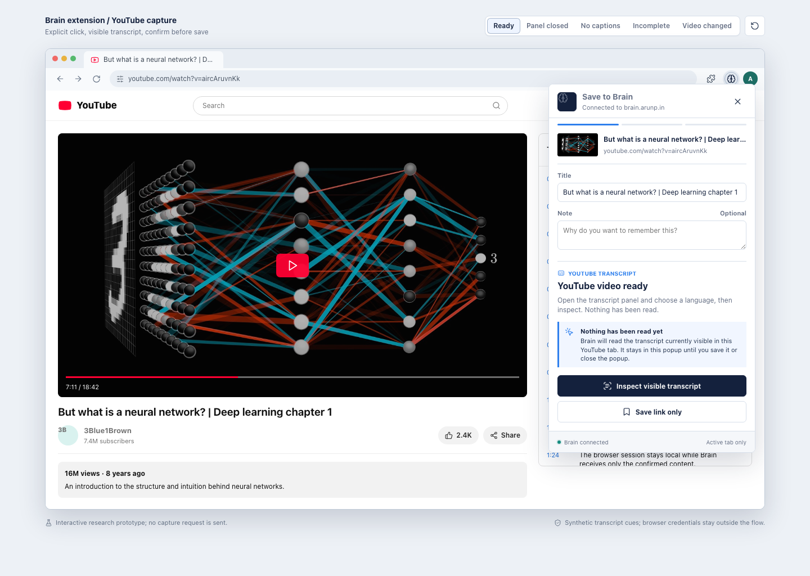
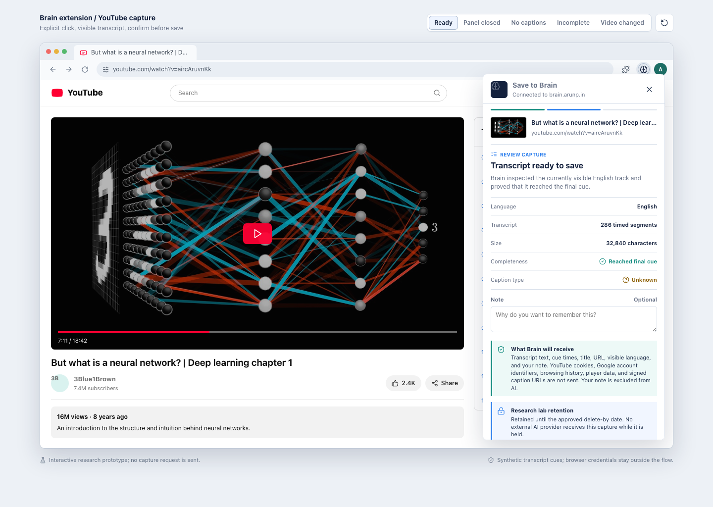
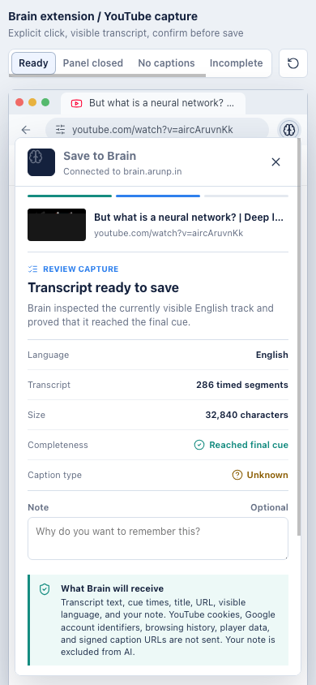

# YouTube DOM Capture UX Prototype

This is a throwaway, click-through HTML prototype for understanding the extension experience. It does not read YouTube, contact Brain, or persist data.

## Open The Prototype

Open [the HTML prototype](2026-07-22_ai_brain_youtube_dom_capture_ux_prototype.html) in a browser. The first screen is the actual extension workflow, not a marketing page.

See the [prototype QA record](2026-07-22_ai_brain_youtube_dom_capture_prototype_qa.md) for the exercised states, viewport checks, and evidence hashes.

## Try The Flow

1. Start on `Ready` and note that the popup says nothing has been read.
2. Click `Inspect visible transcript` to see local progress.
3. Review language, cue count, size, completeness, unknown caption type, retention, and processing hold.
4. Click `Save transcript to Brain` to see the committed receipt.
5. Reset and use the scenario tabs for panel closed, no captions, incomplete traversal, and video-changed failures.
6. Use `Save link only` to see the metadata-only outcome.

Panel and transcript availability are discovered only after the inspect click. Every failure says that nothing was sent.

## Reference Screens

### Ready

### Review

### Mobile

The HTML uses a public demo thumbnail and the Lucide icon CDN. The screenshots remain useful when offline.
