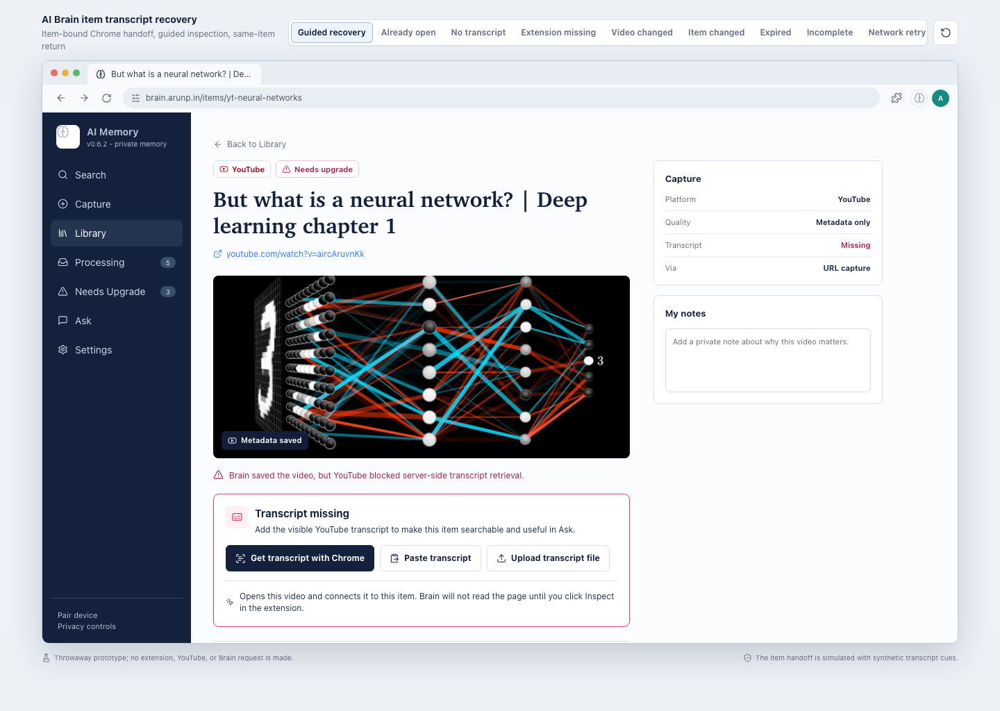
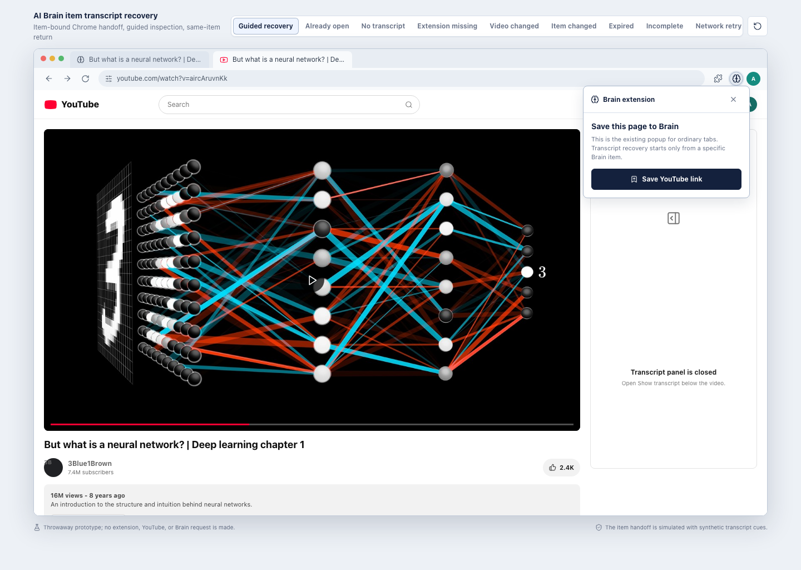
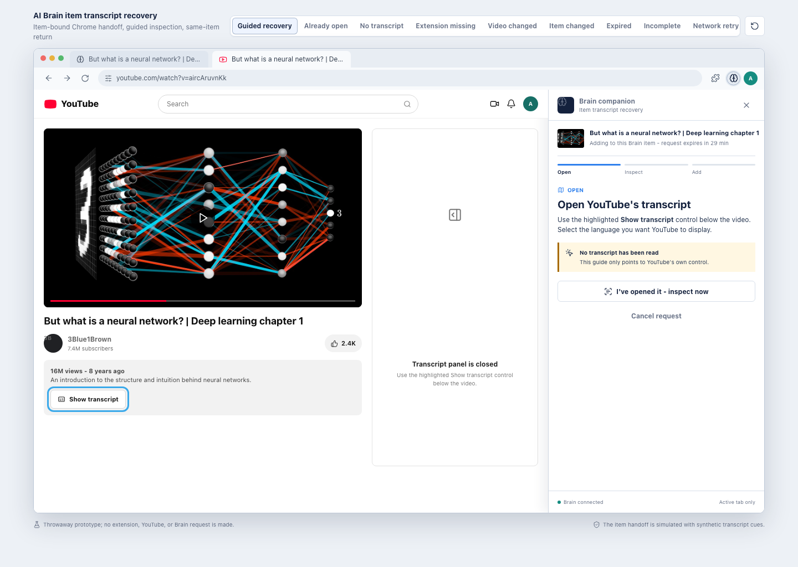
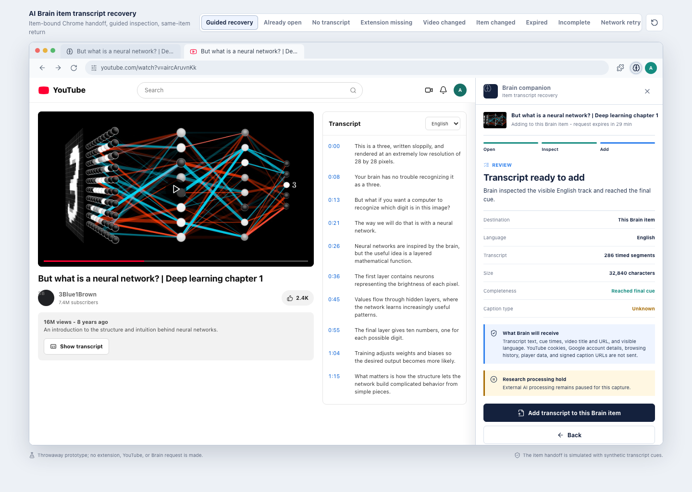
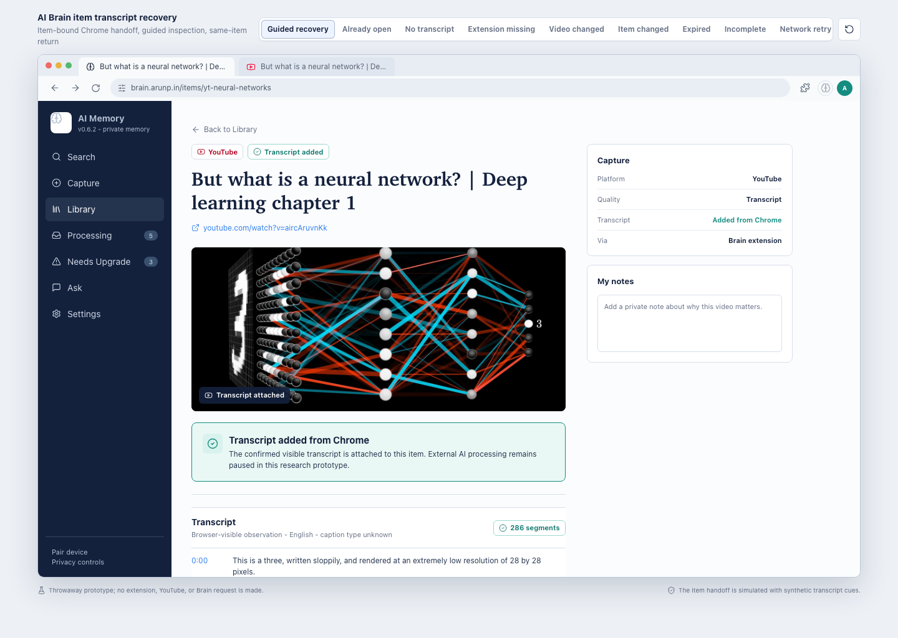
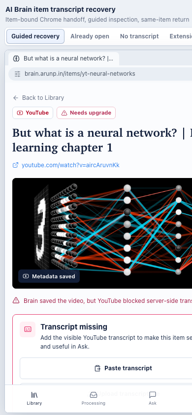

# AI Brain Item Transcript Recovery Prototype

This throwaway prototype shows how a transcript-missing YouTube item in AI Brain can hand off to the existing Chrome extension and receive a confirmed transcript back on the same item.

It is inert: no extension, YouTube DOM, Brain API, account session, or production data is accessed.

## Open It

[Open the interactive prototype](2026-07-22_ai_brain_item_transcript_recovery_ux_prototype.html).

The scenario bar at the top switches among the happy path and important recovery states. Reset returns the selected scenario to its first screen.

## Guided Tour

1. Start on the Brain item and click **Get transcript with Chrome**.
2. In the new YouTube tab, click the highlighted Brain toolbar icon. Nothing has been read yet.
3. In the persistent side panel, choose **Show me where**.
4. Open YouTube's highlighted **Show transcript** control.
5. Click **Inspect visible transcript** to review local evidence.
6. Click **Add transcript to this Brain item**.
7. After success, choose **Open item in Brain** to see the same item with its transcript attached.

Closing the side panel before save deliberately discards unconfirmed transcript data. Reopening it requires inspection again.

## Important Distinction

Open the blue YouTube source link directly, then click the Brain toolbar icon. That ordinary tab shows the extension's existing **Save this page to Brain** popup.

Only **Get transcript with Chrome** creates the exact-item request and changes that one YouTube tab to the guided side-panel experience.

## Scenarios

- **Guided recovery:** complete item-to-YouTube-to-item journey.
- **Already open:** transcript panel is already visible before the side panel opens.
- **No transcript:** YouTube exposes no visible transcript; nothing is added.
- **Extension missing:** setup for missing, hidden, unpaired, or outdated extension state.
- **Video changed:** the tab no longer matches the item; inspection stops.
- **Item changed:** the Brain item revision changed; save conflicts and replaces nothing.
- **Expired:** the 30-minute request expired and grants nothing.
- **Incomplete:** inspection cannot prove the final cue; partial text is blocked.
- **Network retry:** commit fails without false success, then succeeds on retry.
- **Production:** Chrome recovery is hidden and manual paste/upload remain.

On a mobile-width browser, the Chrome action is hidden and the item offers paste/upload guidance instead.

## Direct Views

- [Eligible Brain item](2026-07-22_ai_brain_item_transcript_recovery_ux_prototype.html?scenario=guided&view=brain)
- [Ordinary extension popup](2026-07-22_ai_brain_item_transcript_recovery_ux_prototype.html?scenario=guided&view=ordinary)
- [Guided transcript opening](2026-07-22_ai_brain_item_transcript_recovery_ux_prototype.html?scenario=guided&view=guide)
- [Review before add](2026-07-22_ai_brain_item_transcript_recovery_ux_prototype.html?scenario=guided&view=review)
- [Completed Brain item](2026-07-22_ai_brain_item_transcript_recovery_ux_prototype.html?scenario=guided&view=complete)
- [Extension setup](2026-07-22_ai_brain_item_transcript_recovery_ux_prototype.html?scenario=extension-missing&view=missing)
- [Expired request](2026-07-22_ai_brain_item_transcript_recovery_ux_prototype.html?scenario=expired&view=side-panel)
- [Production manual fallback](2026-07-22_ai_brain_item_transcript_recovery_ux_prototype.html?scenario=production&view=brain)

## Reference Screens

### Eligible Brain Item

### Ordinary Popup

### Guided Side Panel

### Review And Confirmation

### Completed Item

### Mobile Fallback

## Council And QA

- [Product Council decision](2026-07-22_ai_brain_item_transcript_recovery_product_council.md)
- [Browser QA record](2026-07-22_ai_brain_item_transcript_recovery_prototype_qa.md)

The Product Council gives a GO for this interaction model as a prototype and fixture/local implementation input. It remains a NO-GO for production browser capture, and a packaged extension E2E is required before any approved live lab.
