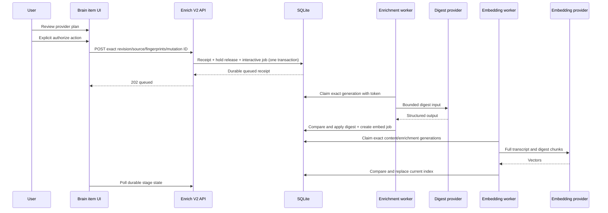

# AI Brain Item Recovery Manual Enrichment Implementation Plan V1

**Date:** 2026-07-22
**Status:** V1 for Technical Architecture, Product Council, and adversarial review
**Scope:** Plan only; no production enablement
**Dependency:** Final YouTube DOM capture V2 foundation and migration 026 must be implemented and verified first
**Nominal new migration:** `027_manual_transcript_enrichment.sql`

## 1. Executive Architecture

Implement manual transcript enrichment as a durable authorization boundary between a held transcript and an interactive background job.

The HTTP action does no provider work. It validates the exact item/source/revision/provider plan, records an immutable idempotency receipt, releases the exact processing hold, and transitions the exact held enrichment generation into an interactive pending lane in one SQLite transaction.

Enrichment and embedding then run as separately claimed stages. Each provider call occurs outside a database transaction and can apply only through a compare-and-apply transaction that rechecks:

- write/execution feature flag;
- item existence;
- sole active transcript source;
- content revision;
- canonical current input fingerprint;
- released hold and authorization receipt;
- accepted provider fingerprint;
- job generation;
- claim-token hash and lease;
- current stage state.

Successful enrichment advances `items.enrichment_generation` and creates the exact embedding job atomically. Embedding binds to both `content_revision` and `enrichment_generation`. Late or stale results write no derived output.

## 2. Delivery Constraints

1. Browser transcript capture remains production-disabled.
2. Migration 026 is a hard merge dependency, not work hidden inside 027.
3. All current workers must honor holds before any browser commit or release path can be enabled.
4. UI, write, and execution enablement use separate default-off flags.
5. The normal rollback is forward code with flags off. Old-binary rollback is blocked until compatibility is proven.
6. Implementation is split into reviewable PRs; no migration-to-UI omnibus change.

## 3. Architecture Decisions

| ID | Decision |
| --- | --- |
| ME-ADR-01 | Attachment and processing authorization are separate transactions and user actions. |
| ME-ADR-02 | Evolve `POST /api/items/:id/enrich` to the strict `manual-enrichment-v2` command. |
| ME-ADR-03 | Reject bodyless and `force=realtime` legacy behavior without provider or queue work. |
| ME-ADR-04 | Evolve `GET /api/items/:id/enrichment-status` into the complete private read model. |
| ME-ADR-05 | Only a valid session plus exact same-origin web request can authorize processing. |
| ME-ADR-06 | Persist immutable mutation receipts with canonical request fingerprints. |
| ME-ADR-07 | Release one exact hold and queue one exact job generation atomically. |
| ME-ADR-08 | Interactive manual work is immediate background work and is never a nightly batch candidate. |
| ME-ADR-09 | Provider plans bind both enrichment and semantic-index stages. |
| ME-ADR-10 | Claim tokens and monotonic job generations fence every asynchronous attempt. |
| ME-ADR-11 | Canonical input hashes cover all prompt/index inputs not fully captured by content revision. |
| ME-ADR-12 | Manual enrichment preserves item title even if the shared model schema returns a title. |
| ME-ADR-13 | Successful digest and semantic index are separate durable stages. |
| ME-ADR-14 | External provider aliases are random and generation-bound; no Brain identifier is sent. |
| ME-ADR-15 | Per-item operational rows cascade on deletion; aggregate logs contain no stable item identity or content. |

## 4. Required Upstream Foundation: Migration 026

Do not begin enablement until the upstream implementation provides and tests:

- `items.content_revision` monotonic on every body/transcript replacement;
- `browser_visible_transcript` source kind;
- a partial unique index enforcing one active transcript source per item;
- browser capture receipts and policy decision binding;
- `content_processing_holds` created atomically with transcript commit;
- held-item exclusion in realtime enrichment, batch selection/result apply, and embedding;
- expected revision and claim identity on all asynchronous writers;
- worker containment mode for fixture/local/lab;
- production browser-capture denial;
- migration rehearsal, verification, and forward rollback procedure.

Migration 027 preflight verifies 026's migration hash and schema shape. It refuses to run on a merely similar or partially implemented database.

## 5. Target Runtime Flow



## 6. Migration 027

### 6.1 Migration preflight

Run with capture, enrichment, batch, embedding, and transcript-recovery writes disabled. Abort when:

- migration 026 hash/schema is absent or unexpected;
- more than one active transcript source exists for an item;
- any enrichment job is `running`, `batch_submitting`, or `batched`;
- any embedding job is `running`;
- a held item cannot join to one active source and current revision;
- orphan or duplicate current jobs exist;
- provider usage schema cannot represent current configured providers;
- foreign-key baseline is nonzero or changes during rehearsal.

Capture row counts, schema objects, stable non-content hashes, and `PRAGMA foreign_key_check` before applying.

### 6.2 `items.enrichment_generation`

Add a nonnegative monotonic generation:

```sql
ALTER TABLE items
  ADD COLUMN enrichment_generation INTEGER NOT NULL DEFAULT 0
  CHECK (enrichment_generation >= 0);
```

Rules:

- body replacement clears derived output and resets generation to `0`;
- successful manual enrichment sets generation to the exact enrichment job generation;
- failed or stale attempts do not advance it;
- embedding requires a positive exact enrichment generation.

### 6.3 Strengthen processing holds

The current gate must include:

- `item_id` primary key and item cascade;
- active transcript source foreign key;
- policy decision foreign key;
- expected content revision;
- `held|released` state;
- versioned hold reason;
- accepted release mutation ID;
- created/released timestamps;
- shape constraint that released rows carry a release receipt and held rows do not.

A guarded trigger requires the accepted release receipt to match item, source, and revision. Historical authorization is preserved in immutable receipts and attempt rows. A new transcript revision may replace/reset the current hold to held; the same exact binding cannot be re-held silently.

### 6.4 `manual_enrichment_receipts`

Create a domain-specific receipt table. Do not overload workflow mutation receipts.

Minimum columns:

```text
mutation_id                       UUID primary key
request_fingerprint               64-hex canonical request hash
item_id                           item FK, cascade delete
operation                         release_transcript_and_enrich | retry_current_stage
outcome_class                     accepted_effective | accepted_noop | rejected
result_code                       allowlisted enum
accepted_transcript_source_id     nullable validated source FK
accepted_content_revision         nullable positive integer
provider_plan_version             nullable fixed contract value
enrich_provider_fingerprint       nullable 64-hex
embed_provider_fingerprint        nullable 64-hex
job_id                            nullable
job_generation                    nullable positive integer
http_status                       200-599
created_at                        epoch milliseconds
```

For rejected wrong-source requests, retain only item ID, mutation ID, canonical request hash, and result code. Do not persist arbitrary client-supplied source identifiers or labels as authority.

Add:

- item/created index;
- immutable-update trigger;
- item delete cascade;
- no transcript, title, URL, prompt, output, endpoint, token, raw error, or policy document fields.

### 6.5 Rebuild `enrichment_jobs`

Required fields:

```text
id, item_id UNIQUE
generation > 0
state: held | pending | running | batch_submitting | batched | done | error | blocked
execution_lane: NULL | interactive | scheduled
expected_content_revision > 0
transcript_source_id nullable
authorization_mutation_id nullable
enrich_provider_fingerprint nullable 64-hex
embed_provider_fingerprint nullable 64-hex
input_fingerprint nullable 64-hex
prompt_contract_version nullable
claim_token_hash nullable 64-hex
claimed_at, lease_expires_at
batch_id nullable
batch_result_key_hash nullable UNIQUE
attempts, last_error_code
created_at, updated_at, completed_at
```

Constraints:

- held rows have no execution lane or authorization;
- interactive rows require an accepted authorization receipt;
- running/submitting/batched rows require claim token hash;
- batched rows require batch ID and opaque result-key hash;
- active hold plus pending/running state is invalid for an interactive row;
- one current row per item; retries advance generation rather than adding competing current rows.

Compatibility `items.enrichment_state` remains the existing enum projection. UI and authorization never infer held/queued from it.

### 6.6 Enrichment attempts

Create content-free `enrichment_job_attempts` rows keyed to job, item, generation, revision, source, execution path, provider fingerprint, input fingerprint, attempt number, allowlisted outcome/error code, token counts, coarse wall-time bucket, and timestamps.

Do not store body/prompt/output/raw error/title/URL/claim token/provider request payload.

### 6.7 Rebuild `embedding_jobs`

Required fields:

```text
id, item_id UNIQUE
generation > 0
state: pending | running | done | error | blocked
expected_content_revision > 0
expected_enrichment_generation > 0
transcript_source_id
provider_fingerprint
input_fingerprint
index_contract_version
authorization_mutation_id
claim_token_hash
attempts, last_error_code
created_at, updated_at, claimed_at, lease_expires_at, completed_at
```

Create sibling content-free attempt rows. Drop the simple `items_enqueue_embedding` trigger; successful enrichment apply explicitly creates the exact embedding job inside its transaction.

### 6.8 Chunks and vectors

Use existing source-aware chunks with these version rules:

- `original_content.source_version = expected_content_revision`;
- `ai_summary.source_version = expected_enrichment_generation`;
- every current generation has integrity-checked rowid/vector counts;
- any stale generation is not accepted as current based on row existence alone.

### 6.9 Provider usage

The existing `llm_usage.provider` constraint supports only `ollama|anthropic|openai` while configured enrichment can use OpenRouter and embedding can use Gemini. Migration 027 must either:

1. rebuild a generalized `provider_usage` table with purpose and stage, or
2. safely expand `llm_usage` and add embedding usage support.

Preferred: introduce `provider_usage` with allowlisted `stage`, actual provider/model, input/output unit counts when available, cost, outcome class (`applied|stale|failed`), and billing month. Do not include item or request identity. Preserve old `llm_usage` rows through a verified migration/view compatibility plan.

### 6.10 Legacy row mapping

- `expected_content_revision = items.content_revision`.
- `generation = 1` unless 026 already introduced a generation.
- Current jobs under active holds become `held`, lane null, no provider authority.
- Unheld jobs retain state and become `scheduled`.
- Never migrate an in-flight item-ID-keyed remote batch; preflight requires it drained.
- Existing embedding jobs bind only when current chunk/version/provider integrity can be proven; otherwise become blocked for rebuild.

### 6.11 Migration verification

Verify:

- row counts by state and stable hashes;
- item/source/job/receipt/attempt FK cascades;
- unique active source and unique current jobs;
- all CHECK literals and indexes;
- trigger definitions and absence of old embedding trigger;
- held rows are unclaimable;
- provider usage preservation;
- `PRAGMA integrity_check` and `foreign_key_check`;
- single application and recorded migration hash;
- production-shaped disposable rehearsal and restore.

## 7. Provider Plan Service

Create `src/lib/processing/content-provider-plan.ts`.

It resolves configuration without a network call and returns one entry per stage:

```ts
interface ContentProviderPlanEntry {
  purpose: "enrichment" | "semantic_index";
  fingerprint: string;
  provider: string;
  model: string;
  label: string;
  remote: boolean;
  downstreamLabel: string | null;
  fallbackEnabled: boolean | null;
  receives: readonly ContentDataCategory[];
}
```

Canonical fingerprint tuple:

```text
content-processing-provider-plan-v1
purpose
provider
model
local-or-remote
normalized-endpoint-identity
downstream-provider-identity
fallback-policy
prompt-or-index-contract-version
```

Hash endpoint identity but never return it. Invalid/opaque/non-loopback Ollama endpoints fail closed as remote. OpenRouter without a known downstream identity/fallback policy is ineligible.

Expose display-safe copy only. Provider health is not probed by the status route or authorization transaction.

## 8. HTTP Contracts

### 8.1 Shared HTTP helper

Create a small private-response helper for enrichment routes or generalize the existing note helper:

- `Cache-Control: private, no-store, max-age=0`;
- `Vary: Cookie`;
- `X-Content-Type-Options: nosniff`;
- exact-same-origin validation for cookie writes;
- bounded JSON read;
- stable typed error mapping.

### 8.2 Status GET

Evolve `GET /api/items/:id/enrichment-status`.

Required public states:

```text
awaiting_permission
reviewing_plan (client-only overlay; server remains awaiting_permission)
queued
enriching
indexing
ready
retryable_error
terminal_error
provider_review_required
content_changed
blocked
not_applicable
```

Response contains:

- `contractVersion`;
- display-safe item/transcript current-version metadata;
- effective hold and job projection;
- enrichment and embedding stage state/attempts/retry eligibility;
- both provider display plans and fingerprints;
- allowed action and typed disabled reason;
- safe timing class, not a hard-coded clock.

It omits claim tokens, batch keys, internal IDs not needed by the command, provider endpoints, raw policy documents, legal IDs, credentials, and raw errors.

### 8.3 Strict POST

Evolve `POST /api/items/:id/enrich`.

Gate order:

1. valid session cookie;
2. exact same-origin with missing origin rejected;
3. write flag and environment policy;
4. JSON content type;
5. declared and streamed body maximum 8 KiB;
6. strict schema/contract version;
7. low per-session mutation rate limit;
8. domain transaction.

Initial request:

```json
{
  "contractVersion": "manual-enrichment-v2",
  "mutationId": "b1868e88-2550-4b1e-9de7-f7af6e04aa2d",
  "operation": "release_transcript_and_enrich",
  "expectedContentRevision": 7,
  "transcriptSourceId": "4a91...",
  "providerPlanVersion": "content-processing-provider-plan-v1",
  "enrichmentProviderFingerprint": "<64 lowercase hex>",
  "embeddingProviderFingerprint": "<64 lowercase hex>"
}
```

The client cannot supply item body/title, provider/model, execution lane, hold reason, manifest, retry budget, or item state.

Response classes:

| HTTP | Code | Durable effect |
| ---: | --- | --- |
| 202 | `interactive_enrichment_queued` | Receipt, hold release, exact job pending |
| 202 | `current_stage_retried` | New exact generation/stage queued |
| 200 | `idempotent_replay` | Original outcome returned |
| 200 | `already_queued` | Accepted no-op receipt |
| 200 | `already_ready` | Accepted no-op receipt |
| 409 | `hold_not_current` | Rejected receipt, no release/job change |
| 409 | `active_source_changed` | Rejected receipt |
| 409 | `content_revision_changed` | Rejected receipt |
| 409 | `provider_plan_changed` | Rejected receipt |
| 409 | `job_conflict` | Rejected receipt |
| 422 | `mutation_fingerprint_mismatch` | Existing receipt retained |
| 503 | `manual_enrichment_disabled` | No domain receipt/work |

Bodyless and query-string `force` requests return `410 legacy_contract_removed` or version-policy equivalent and execute nothing.

## 9. Atomic Authorization Service

Create `src/lib/enrich/manual-authorization.ts`.

### 9.1 Canonical request fingerprint

Hash canonical JSON containing contract version, operation, route item ID, expected revision, source ID, provider-plan version, and both provider fingerprints. Exclude labels and timestamps.

### 9.2 Transaction algorithm

1. Load receipt by mutation ID.
2. Same fingerprint: return original outcome with `replayed=true`.
3. Different fingerprint: return mismatch; mutate nothing.
4. Load item, sole active source, current hold, job, current chunks, and current generations under one immediate writer transaction.
5. Recompute provider plan and server policy.
6. Validate source kind/integrity, item/source hash agreement, content revision, hold reason/source/revision, provider fingerprints, environment, manifest, expiry, retention, purpose, and feature gates.
7. Return accepted no-op if exact work is already queued/current or exact result is ready.
8. Insert a rejected receipt for a domain conflict without changing hold/item/job.
9. Ensure the exact held job exists; repair missing drift only after every eligibility gate passes.
10. Insert accepted-effective receipt.
11. Guarded update releases exactly one hold row.
12. Guarded update transitions exactly one held job generation to interactive pending with accepted provider fingerprints and cleared lease/batch/error fields.
13. Set compatibility item projection to pending and clear stale batch ID.
14. Commit and construct response from committed rows.

Failure at steps 10-13 rolls back every effect. Inject failures after each write to prove this.

### 9.3 Competing requests

SQLite serialization yields:

- first exact valid mutation: accepted effective;
- second exact valid mutation with different ID: accepted no-op already queued;
- mismatched source/revision/provider: rejected;
- same ID changed payload: mutation fingerprint mismatch;
- no attempt resets or steals another generation's live claim.

## 10. Transcript Commit And Repair Changes

Refactor `src/lib/repair/item-repair.ts` into transaction-owned primitives:

- replace source/body and increment revision;
- invalidate derived outputs;
- clear auto tags/topics while preserving manual metadata;
- clear exact chunks/vectors safely;
- reset or create scheduling state according to an explicit policy.

Scheduling policy must be explicit:

```ts
type RepairSchedulingPolicy =
  | { kind: "legacy_scheduled" }
  | {
      kind: "held_transcript";
      transcriptSourceId: string;
      holdReason: "youtube_browser_v0_1";
    };
```

The browser capture transaction must atomically commit source, segments, body, content revision, processing hold, held job generation, derived reset, and capture receipt. It cannot call a helper that commits independently.

Existing paste/upload call sites retain their current behavior in P0 but migrate to the explicit legacy policy so future audits can see the choice.

Update the repair success UI to derive held versus queued copy from the read model.

## 11. Enrichment Worker Refactor

### 11.1 Split responsibilities

Refactor current `enrichItem()` into:

```ts
claimNextInteractiveEnrichment(): EnrichmentClaim | null
claimNextScheduledRealtimeEnrichment(): EnrichmentClaim | null
buildEnrichmentInput(claim): EnrichmentInput
computeEnrichment(input, provider): Promise<ComputedEnrichment>
applyEnrichmentIfCurrent(claim, computed): ApplyOutcome
failEnrichmentIfCurrent(claim, safeCode): FailureOutcome
sweepExpiredEnrichmentLeases(): void
```

### 11.2 Claim transaction

Interactive claim:

- selects pending interactive jobs only;
- requires accepted authorization and released exact hold;
- joins current item and sole active transcript source;
- compares expected/current revision and provider plan;
- generates 256-bit raw token and stores only SHA-256;
- assigns finite lease and increments attempts;
- computes/persists canonical input fingerprint over source type, title, author, duration, body, source text hash, revision, source ID, generation, and prompt contract;
- returns immutable in-memory snapshot and raw token.

Do not globally probe provider health before selecting work.

### 11.3 Compute

- Provider call outside transaction.
- Use the accepted exact provider/model; do not silently resolve a changed plan.
- Maintain structured validation and bounded input behavior.
- Short-body fast path still observes authorization/claim/apply gates.
- For the manual transcript mode, validate but ignore model-generated title.

### 11.4 Apply transaction

Require all gates listed in Section 1 and recompute current input fingerprint. If current:

1. write summary, quotes, category, and enrichment time;
2. preserve item title;
3. replace only auto tags and AI topics;
4. set `enrichment_generation = job.generation`;
5. mark exact enrichment job done and clear lease;
6. record actual provider/model usage and content-free successful attempt;
7. clear stale source/summary chunks and vectors;
8. create/rearm exact embedding job with revision, enrichment generation, source, authorization, and embedding provider fingerprint.

If stale, write at most a content-free stale attempt tied to the old surviving job. Do not mutate current derived data, item state, newer job, or newer retry budget.

### 11.5 Retry

- Three transient attempts with fresh claim tokens.
- Provider identity/config change becomes blocked, not blind retry.
- Safe typed errors only.
- Manual retry advances generation and gets a new mutation ID.
- Material binding change returns to provider review.

## 12. Batch Hardening

Manual interactive jobs never batch, but shared batch code writes the same fields and must be generation-safe before release.

Refactor `src/lib/queue/enrichment-batch.ts`:

1. Select scheduled lane only; exclude active holds.
2. Transactionally mark candidates `batch_submitting` with claim token and random result alias hash before network.
3. Build provider request from immutable claims.
4. Send the random alias as `custom_id`, never item ID.
5. On accepted submit, CAS each current claim to batched with returned batch ID.
6. On submit failure, CAS only matching claims back to pending/error.
7. Hash returned aliases and resolve exact batch/generation.
8. Apply under the same source/revision/provider/input/token/generation gates.
9. Record orphaned accepted remote work without attaching it to a newer generation.

No shared code path may use `items.enrichment_state='batched'` as sufficient result authority.

## 13. Embedding Stage

### 13.1 Dedicated restart-safe worker

Add `src/lib/queue/embedding-worker.ts`. Correctness cannot depend on the enrichment process surviving the inline call.

Claim exact pending embedding jobs, assign a new token/lease, and snapshot title/body/summary under:

- released exact hold;
- accepted authorization;
- active source;
- content revision;
- enrichment generation;
- embedding provider fingerprint;
- input/index contract fingerprint.

### 13.2 Compute and apply

- Compute chunks and call provider outside transaction.
- On apply, recheck every gate/token/generation and recompute input fingerprint.
- Delete vec0 rows before chunk bridge deletion within the transaction.
- Insert all current original and summary chunks/vectors or none.
- Mark exact job done and record content-free attempt.

### 13.3 Existing chunk rule

Remove the current shortcut that any original-content chunks mean success. Reuse only if:

- expected source kinds exist;
- source versions equal current content/enrichment generations;
- provider fingerprint and index contract match;
- job is done for those exact values;
- chunk/rowid/vector counts pass integrity.

### 13.4 Partial success and retry

If embedding fails after digest apply:

- preserve digest, tags, topics, and enrichment generation;
- show partial success;
- retry embedding only with a new claim token;
- require new review if provider identity or accepted data scope changed.

## 14. Status Projection

Create one repository/service that derives effective state from item, source, hold, receipts, enrichment job, embedding job, and exact chunk integrity.

Projection precedence:

1. missing/ineligible item/source;
2. production/policy/feature blocked;
3. active current hold with no authorization -> `awaiting_permission`;
4. provider plan differs -> `provider_review_required`;
5. source/revision/input differs -> `content_changed`;
6. enrichment pending/running -> queued/enriching;
7. enrichment error -> retryable/terminal error;
8. enrichment current + embedding pending/running -> indexing;
9. embedding error -> partial success/error;
10. exact digest and index current -> ready.

`items.enrichment_state` and chunk count alone are never authoritative.

## 15. UI Implementation

### Components

- New `src/components/manual-transcript-enrichment.tsx`.
- Update `src/app/items/[id]/page.tsx` placement and server snapshot.
- Update `ItemEnrichmentWatch` to poll all durable processing stages.
- Update `EnrichingPill` to consume effective state rather than raw item enum.
- Update `src/lib/items/status.ts` to require exact-version digest/index readiness.

### Placement

- Desktop: AI Digest right rail, one persistent command.
- Tablet: full-width section after Transcript.
- Mobile: Digest tab; complete disclosure and 44 px full-width actions.
- Extension: only revised success copy and Open item navigation.

### Interaction

- Local-only: inline provider disclosure and one explicit authorization button.
- Any remote stage: review dialog/sheet, then final confirmation.
- Client generates mutation ID once and reuses it for network retry.
- Disable duplicate activation while request is pending.
- `202` durable receipt changes UI to queued.
- `409` refreshes read model and focuses conflict heading, not action.
- Poll every three seconds only while durable state is nonterminal; announce state changes once.
- Completion refreshes server content without focus theft.

### Prototype parity scenarios

- full Inspect -> Add -> return -> review -> queue -> digest -> index -> done;
- local one-click;
- leave held without processing;
- provider plan changed;
- transcript changed in flight;
- digest success/index failure and index-only retry;
- feature disabled/provider unavailable;
- production manual-only;
- desktop/mobile/320 px/200% zoom/reduced motion.

## 16. Security And Privacy

- Session cookie required.
- `isExactSameOrigin(req)` required; missing Origin rejected.
- Bearer/extension/CLI authorization rejected.
- Strict Zod `.strict()` request and 8 KiB stream limit.
- UUID mutation ID, safe positive revision, valid source ID, fixed contract values, lowercase 64-hex fingerprints.
- Low per-session rate limit as defense in depth.
- Private no-store response headers.
- No transcript/title/URL/provider endpoint/credentials/policy document in receipts or attempts.
- Existing item-ID/arbitrary-error worker logs must be replaced before live browser transcript processing.
- Provider error mapping uses stable enums; raw response remains ephemeral and secret-redacted for local debugging only when separately approved.
- External result aliases are random 256-bit values; only hash stored.

## 17. Deletion

Use `deleteItem()` as the authoritative transaction:

1. delete vec0 rows while rowid bridge exists;
2. delete item;
3. FKs cascade source/segments/hold/receipts/jobs/attempts/chunks;
4. in-flight worker fails item/job/source/token checks;
5. worker cannot recreate an item or job from snapshot.

Add deletion barriers before provider call, after provider response, and before/inside apply for both stages and batch. Verify all bulk-delete paths use equivalent vec0 cleanup.

Operational copy must not promise immediate deletion from existing backups; preserve current backup-retention truth.

## 18. Feature Flags

| Flag | Default | Function |
| --- | --- | --- |
| `BRAIN_MANUAL_TRANSCRIPT_ENRICHMENT_UI_ENABLED` | false | Show eligible read/action UI |
| `BRAIN_MANUAL_TRANSCRIPT_ENRICHMENT_WRITE_ENABLED` | false | Allow authorization transaction |
| `BRAIN_MANUAL_TRANSCRIPT_ENRICHMENT_EXECUTION_ENABLED` | false | Allow interactive claim and apply |
| `BRAIN_BACKGROUND_WORKERS_MODE` | disabled/lab-specific | Contain all workers per upstream plan |

Hold and revision enforcement are unconditional after migration 026 and never feature-flagged away.

## 19. Deterministic Failure Injection

### Authorization

Inject after receipt insert, hold release, job transition, item projection, and before return. Each must roll back fully. Same mutation ID then succeeds once.

### Enrichment

Pause after claim, before provider, after response, after validation, and at every apply write. Race with source/body replacement, hold reinstatement on new revision, provider config change, retry generation, lease reclaim, kill switch, and deletion.

Expected: wholly current apply or zero derived mutation.

### Batch

Pause after batch claim, after remote submit before batch ID, and after poll before apply. Race with replacement, interactive job, retry, and deletion.

### Embedding

Pause after snapshot, between provider batches, and before/inside apply. Change content/enrichment generations, source, provider, hold, claim, and item existence. Inject chunk/vector write failures and prove transaction rollback.

## 20. Test Matrix

### Migration

- 026 dependency/hash/schema;
- in-flight refusal;
- legacy row mapping;
- held/source/job integrity;
- provider usage migration;
- FKs, indexes, triggers, literals, row counts/hashes;
- one-time apply and disposable restore rehearsal.

### HTTP/auth

- no/invalid session;
- missing/foreign/extension Origin;
- bearer-only;
- wrong content type, malformed/unknown/oversized body;
- invalid mutation/source/revision/fingerprint/contract;
- rate limit and private headers;
- disabled flags before work;
- bodyless/force legacy no-op refusal.

### Idempotency/concurrency

- first exact mutation queues once;
- same mutation byte-equivalent replay;
- same ID changed fingerprint mismatch;
- two IDs same binding -> one effective, one no-op;
- source/revision/provider races;
- transaction failure then same-ID retry.

### Eligibility/hold

- no item/non-YouTube/no source/multiple source/wrong source;
- stale revision/body-source hash mismatch;
- missing/released/wrong hold;
- policy/manifest/retention/expiry/production denial;
- exact valid held source;
- paste/upload does not accidentally enter P0.

### Enrichment

- held jobs excluded;
- interactive prioritized and never batched;
- token/lease/generation behavior;
- all stale-gate permutations;
- short-body gate path;
- title unchanged;
- manual metadata unchanged;
- actual provider usage/outcome;
- typed safe error and retry budget.

### Batch

- pre-submit claim;
- concurrent claimant exclusion;
- opaque alias;
- stale submit/poll behavior;
- no cross-generation retry budget mutation.

### Embedding

- exact content/enrichment versions in chunks;
- stale existing chunks do not short-circuit;
- exact current integrity can return idempotently;
- old summary generation cannot apply;
- provider change blocks;
- vector/chunk atomicity;
- process restart resumes work;
- index-only retry avoids LLM call.

### UI/accessibility

- held is not queued;
- two providers and accurate data coverage;
- local/remote confirmation behavior;
- focus and dialog/sheet return;
- duplicate click and network retry;
- durable refresh;
- stage/error/conflict/partial success;
- desktop/tablet/mobile/320 px/200% zoom;
- keyboard/screen reader/reduced motion/high contrast.

### Privacy/deletion

- canary transcript/title/URL/prompt/output/raw error/token absent from forbidden surfaces;
- aggregate schemas reject extra dimensions;
- provider alias contains no stable ID;
- item deletion cascades all new rows/vectors;
- deletion at every barrier prevents recreation.

## 21. Pull Request Sequence

| PR | Scope | Merge gate | Estimate |
| --- | --- | --- | ---: |
| PR-0 | Upstream migration 026, hold/revision/active-source foundation, all-worker hold checks | Upstream V2 gates | Dependency |
| PR-1 | Migration 027, provider usage, receipts, jobs/attempts, flags off | Rehearsed migration and cascade/integrity tests | 4-6 days |
| PR-2 | Provider-plan/read-model service and strict V2 HTTP contract | Auth, schema, idempotency, atomic failure tests | 4-6 days |
| PR-3 | Repair/commit scheduling policy and held-job integration | Attachment atomicity and legacy call-site audit | 3-5 days |
| PR-4 | Interactive enrichment lease/compute/apply split | Deterministic stale/deletion/provider barriers | 6-9 days |
| PR-5 | Scheduled batch pre-claim and opaque result mapping | Submit/poll race matrix | 4-6 days |
| PR-6 | Enrichment generation, embedding job rebuild, dedicated worker | Exact-version vectors, restart, partial-success tests | 6-9 days |
| PR-7 | Status API, item UI, dialog/sheet, extension copy | Product/design/accessibility/mobile tests | 4-6 days |
| PR-8 | Privacy scanner, runbooks, rollout evidence, compatibility guard | All no-go gates and cleanup rehearsal | 4-6 days plus review |

Expected post-dependency engineering effort: **5-7 focused senior-engineer weeks**, plus product/design/privacy/security review and lab scheduling.

## 22. Deployment

1. Land and verify 026 with browser capture and new processing disabled.
2. Drain all enrichment/batch/embedding work.
3. Rehearse 027 against a production-shaped disposable snapshot.
4. Deploy 027-capable code with all new flags false.
5. Run production-negative and hold-exclusion tests.
6. Enable UI read in fixture/local; write and execution remain off.
7. Enable write with execution off; prove atomic queue receipts and no claims.
8. Enable execution with fake then local providers.
9. Run one-item isolated approved lab canary with exact manifest.
10. Expand only after evidence review.
11. Production stays denied pending a separate decision and code change.

## 23. Rollback

### Immediate containment

1. Disable write.
2. Disable execution; in-flight apply checks fail closed.
3. Hide action while keeping truthful held/status UI.
4. Leave 027 applied and repair forward.

### Binary rollback

Blocked while any held/released browser transcript or new job state exists unless the previous build is patched and rehearsed to:

- understand or safely ignore new states/columns;
- exclude active holds;
- refuse provider-authorized interactive jobs;
- avoid stale apply;
- preserve schema and receipts.

Release tooling must enforce this block.

## 24. Operational Runbook Requirements

- flag enable/disable order;
- migration preflight/rehearsal/verification commands;
- hold, job, and provider-plan status queries using content-free output;
- stale claim and blocked plan diagnosis;
- safe retry versus renewed review rules;
- provider quota/outage handling;
- privacy incident stop procedure;
- item deletion and cleanup verification;
- canary manifest expiry/delete-by process;
- forward rollback and old-binary compatibility check.

## 25. Implementation No-Go Gates

Do not enable if any is false:

1. 026 is real, verified, and enforced by every shared worker.
2. One active transcript source is database-enforced.
3. Attachment produces source, revision, hold, held job, and receipt atomically.
4. Legacy endpoint modes cannot bypass holds.
5. Session plus exact origin gates the V2 command.
6. Receipt/release/job transaction is idempotent and failure-atomic.
7. Interactive lane is excluded from nightly batch.
8. Both processor plans and data categories are disclosed and pinned.
9. Enrichment claim/apply checks source, revision, provider, input, generation, token, hold, flag, and item.
10. Batch uses opaque generation-bound aliases and equivalent apply gates.
11. Embedding binds content plus enrichment generations and never trusts mere chunk existence.
12. Manual path preserves title and manual metadata.
13. Partial success and index-only retry are proven.
14. Provider responses/errors and stable IDs cannot leak through logs, HTTP, analytics, aliases, screenshots, or reports.
15. Deletion at every barrier prevents recreation.
16. Kill switches work at write, claim, and apply.
17. Release tooling blocks unsafe old-binary rollback.
18. Production denial remains authoritative.

## 26. V1 Definition Of Done

- Product Council, PRD, implementation plan, UX spec, and HTML prototype are mutually consistent.
- V1 artifacts receive agent reviews and formal adversarial reports.
- Every P0/P1 finding maps to a V2 change or explicit no-go/deferred decision.
- Prototype exercises all required states and passes desktop/mobile visual and interaction checks.
- Documentation, privacy, link, formatting, and repository validation pass.
- V2 final artifacts and report are committed and pushed through a dedicated PR.
