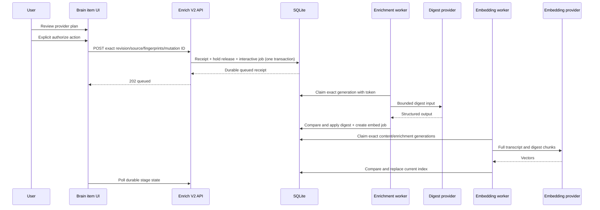

# AI Brain Held Browser Transcript Manual Enrichment Implementation Plan V2 Final

**Date:** 2026-07-22
**Status:** Final after Technical Architecture, Product Council, and adversarial review
**Scope:** Plan only; no production enablement
**Dependency:** The final YouTube DOM capture V2 foundation migration must be rebased, renumbered, implemented, and verified first
**Nominal sequence on baseline `c22b5aa`:** `027_youtube_browser_transcript.sql` upstream, `028_manual_transcript_enrichment_expand.sql`, then later `029_manual_transcript_enrichment_contract.sql`; renumber the sequence together if another migration lands first

## 1. Executive Architecture

Implement manual transcript enrichment as a durable authorization boundary between a held transcript and an interactive background job.

The HTTP action does no provider work. It validates the exact item/source/revision and complete, expiring authorization scope, records an immutable idempotency receipt, releases the exact processing hold, and transitions one unique held enrichment generation into an interactive pending lane in one SQLite transaction.

Enrichment and embedding then run as separately claimed stages. Each provider call occurs outside a database transaction and can apply only through a compare-and-apply transaction that rechecks:

- write/execution feature flag;
- item existence;
- sole active transcript source;
- content revision;
- canonical current input fingerprint;
- released hold and authorization receipt;
- accepted provider fingerprint;
- accepted authorization-context fingerprint and expiry;
- job generation;
- claim-token hash and lease;
- current stage state and dispatch barrier;
- retention/delete-by, deletion, and kill-switch gates.

Generation identity never resets: `items.next_enrichment_generation` allocates unique values and `items.current_applied_enrichment_generation` identifies the current digest or remains null. Successful enrichment sets the current applied value and creates the exact embedding job atomically. Embedding binds to both `content_revision` and that unique generation. Late, expired, deleted, or stale results write no derived output.

## 2. Delivery Constraints

1. Browser transcript capture remains production-disabled.
2. The named YouTube browser-transcript foundation migration is a hard merge dependency, not work hidden inside the manual-enrichment expand migration. Its upstream plan's proposed `026` slot conflicts with committed `026_notebooklm_export.sql` and must be rebased before implementation.
3. All current workers must honor holds before any browser commit or release path can be enabled.
4. UI, write, and execution enablement use separate default-off flags.
5. The normal rollback is forward code with flags off. Old-binary rollback is blocked until compatibility is proven.
6. Implementation is split into reviewable PRs only where every merged binary/schema combination remains bootable. Incompatible schema and all affected consumers land atomically behind startup compatibility checks.

## 3. Architecture Decisions

| ID | Decision |
| --- | --- |
| ME-ADR-01 | Attachment and processing authorization are separate transactions and user actions. |
| ME-ADR-02 | Add `POST /api/items/:id/enrichment-runs` as the strict `manual-enrichment-v2` command. |
| ME-ADR-03 | Contain legacy `/enrich`: it cannot release or process an active browser-transcript hold, including through bodyless or `force=realtime` calls. |
| ME-ADR-04 | Evolve `GET /api/items/:id/enrichment-status` into the complete private read model. |
| ME-ADR-05 | Only a valid session plus exact same-origin web request can authorize processing. |
| ME-ADR-06 | Persist immutable mutation receipts with canonical request fingerprints. |
| ME-ADR-07 | Release one exact hold and queue one exact job generation atomically. |
| ME-ADR-08 | Interactive manual work is immediate background work and is never a nightly batch candidate. |
| ME-ADR-09 | Provider plans bind both enrichment and semantic-index stages. |
| ME-ADR-10 | Claim tokens and monotonic job generations fence every asynchronous attempt. |
| ME-ADR-11 | Canonical input hashes cover all prompt/index inputs not fully captured by content revision. |
| ME-ADR-12 | Manual enrichment preserves item title even if the shared model schema returns a title. |
| ME-ADR-13 | Successful digest and semantic index are separate durable stages. |
| ME-ADR-14 | External provider aliases are random and generation-bound; no Brain identifier is sent. |
| ME-ADR-15 | Per-item operational rows cascade on deletion; aggregate logs contain no stable item identity or content. |
| ME-ADR-16 | One canonical, expiring authorization-context fingerprint binds every user-visible material term through receipt, jobs, attempts, dispatch, retry, and apply. |
| ME-ADR-17 | Transport ambiguity reconciles the original mutation; the UI never infers no work from a lost response. |
| ME-ADR-18 | Brain retention, provider handling terms, and authorization expiry are separate gates checked at every dispatch and apply. |
| ME-ADR-19 | Generation allocation is strictly increasing and current-applied identity is separate and nullable. |
| ME-ADR-20 | Use one generalized `provider_usage` schema; no implementation-time schema fork remains. |
| ME-ADR-21 | Capture approval stays hold-only; a separate exact processing manifest/decision authorizes downstream work. |
| ME-ADR-22 | Accept provider-ready input and disclosure-context fingerprints before hold release; claims only compare them. |
| ME-ADR-23 | Manual lab worker mode starts only authorization-scoped interactive digest/index claimants. |
| ME-ADR-24 | P0 pins one semantic space and gates every semantic reader through current-version eligibility. |
| ME-ADR-25 | Schema delivery uses expand/dual-write/cutover/contract compatibility phases. |
| ME-ADR-26 | Provider execution is at-least-once attempt and at-most-once current apply under explicit deadline/lease rules. |

## 4. Required Upstream Foundation: YouTube Browser Transcript Migration

The integrated baseline already contains `026_notebooklm_export.sql`. The upstream capture plan still names `026_youtube_browser_transcript.sql`, so that filename is not implementable as written. On baseline `c22b5aa`, rebase it to nominal `027_youtube_browser_transcript.sql`; if another migration lands first, allocate the next free number and shift the downstream nominal numbers together. Freeze the final source SHA, filename, file hash, and schema snapshot rather than treating a number alone as authority.

Do not begin enablement until the upstream implementation provides and tests:

- `items.content_revision` monotonic on every body/transcript replacement;
- `browser_visible_transcript` source kind;
- a partial unique index enforcing one active transcript source per item;
- browser capture receipts and policy decision binding;
- `content_processing_holds` created atomically with transcript commit;
- held-item exclusion in realtime enrichment, batch selection/result apply, and embedding;
- expected revision and claim identity on all asynchronous writers;
- worker containment mode for fixture/local/lab;
- production browser-capture denial;
- migration rehearsal, verification, and forward rollback procedure.

The manual-enrichment expand preflight verifies the frozen upstream migration filename, hash, and schema shape. It refuses to run on a merely similar, colliding, or partially implemented database.

## 5. Target Runtime Flow



## 6. Schema Evolution: Expand, Migrate, Cut Over, Contract

Migration auto-apply means feature flags cannot protect an old binary from incompatible SQL. Use this sequence:

1. **Containment:** the rebased upstream browser-transcript migration and old-schema-compatible hold/revision gates land first.
2. **028 expand (nominal):** add new nullable/defaulted columns, policy/authorization/run/attempt/usage tables, indexes, and compatibility views while retaining old columns, state literals, and embedding trigger behavior.
3. **Transition binary:** dual-read/dual-write every route, worker, batch, embed, status, repair/capture, retrieval, and deletion path. Backfill only after workers are drained; prove old/new projections agree.
4. **Cutover:** switch authoritative readers/writers after a production-shaped restore rehearsal and release-tool compatibility check.
5. **029 contract (nominal):** rebuild strict target tables, remove old columns/states/trigger, and retire compatibility views only after unsupported rollback binaries are blocked.

If an additive shape cannot express the invariant safely, the migration and every affected consumer must land as one non-partially-deployable change with a startup schema hash gate.

### 6.1 Expand/cutover preflight

Run with capture, enrichment, batch, embedding, and transcript-recovery writes disabled. Abort when:

- the frozen upstream browser-transcript migration filename/hash/schema is absent, colliding, or unexpected;
- more than one active transcript source exists for an item;
- any enrichment job is `running`, `batch_submitting`, or `batched`;
- any embedding job is `running`;
- a held item cannot join to one active source and current revision;
- orphan or duplicate current jobs exist;
- provider usage schema cannot represent current configured providers;
- foreign-key baseline is nonzero or changes during rehearsal.

Capture row counts, schema objects, stable non-content hashes, and `PRAGMA foreign_key_check` before applying.

### 6.2 Unique enrichment generation allocation

Add a strictly increasing allocator and a nullable current-applied identity:

```sql
ALTER TABLE items
  ADD COLUMN next_enrichment_generation INTEGER NOT NULL DEFAULT 1
  CHECK (next_enrichment_generation > 0);

ALTER TABLE items
  ADD COLUMN current_applied_enrichment_generation INTEGER
  CHECK (current_applied_enrichment_generation IS NULL OR current_applied_enrichment_generation > 0);
```

Rules:

- allocating a job takes the current `next_enrichment_generation` and increments it in the same writer transaction;
- body replacement clears derived output and sets `current_applied_enrichment_generation = NULL`; it never decrements the allocator;
- successful current enrichment sets the applied value to the exact unique job generation;
- failed or stale attempts do not change the applied value or reuse a generation;
- embedding requires the positive exact applied generation.

Migration maps legacy positive `enrichment_generation` values to `current_applied_enrichment_generation`, and seeds `next_enrichment_generation` above every existing item/job/attempt generation. An ABA test must prove an old revision/generation cannot apply after replacement and a newer success.

### 6.3 Strengthen processing holds

The current gate must include:

- `item_id` primary key and item cascade;
- active transcript source foreign key;
- policy decision foreign key;
- expected content revision;
- `held|released` state;
- versioned hold reason;
- accepted release mutation ID;
- created/released timestamps;
- shape constraint that released rows carry a release receipt and held rows do not.

A guarded trigger requires the accepted release receipt to match item, source, and revision. Historical authorization is preserved in immutable receipts and attempt rows. A new transcript revision may replace/reset the current hold to held; the same exact binding cannot be re-held silently.

### 6.4 `manual_enrichment_receipts`

Create a domain-specific receipt table. Do not overload workflow mutation receipts.

Minimum columns:

```text
mutation_id                       UUID primary key
request_fingerprint               64-hex canonical request hash
item_id                           item FK, cascade delete
operation                         release_transcript_and_enrich | reauthorize_and_queue | retry_enrichment | retry_indexing
outcome_class                     accepted_effective | accepted_noop | rejected
result_code                       allowlisted enum
accepted_transcript_source_id     nullable validated source FK
accepted_content_revision         nullable positive integer
provider_plan_version             nullable fixed contract value
enrich_provider_fingerprint       nullable 64-hex
embed_provider_fingerprint        nullable 64-hex
authorization_input_fingerprint   nullable 64-hex
authorization_context_version     nullable fixed contract value
authorization_context_fingerprint   nullable 64-hex
authorization_expires_at          nullable epoch milliseconds
consent_copy_version              nullable fixed contract value
policy_manifest_hash              nullable 64-hex
policy_decision_hash              nullable 64-hex
processing_policy_decision_id     nullable decision FK
policy_expires_at                 nullable epoch milliseconds
brain_source_delete_by            nullable epoch milliseconds
enrich_handling_terms_version     nullable fixed contract value
embed_handling_terms_version      nullable fixed contract value
job_id                            nullable
job_generation                    nullable positive integer
run_id                            nullable UUID
http_status                       200-599
created_at                        epoch milliseconds
```

For rejected wrong-source requests, retain only item ID, mutation ID, canonical request hash, and result code. Do not persist arbitrary client-supplied source identifiers or labels as authority.

Add:

- item/created index;
- immutable-update trigger;
- item delete cascade;
- no transcript, title, URL, prompt, output, endpoint, token, raw error, or policy document fields.

### 6.4a Accepted authorization snapshots and runs

Receipts prove idempotent command outcomes; they do not substitute for the normalized accepted plan. Create immutable accepted-only tables:

```text
manual_enrichment_authorizations
  mutation_id PK/FK -> accepted receipt
  item_id, transcript_source_id, expected_content_revision
  expected_held_generation
  authorization_input_fingerprint
  authorization_context_fingerprint + version
  processing_policy_decision_id + manifest hash
  consent_copy_version
  prompt_contract_version + index_contract_version
  authorized_at + not_after_ms + delete_by_ms

manual_enrichment_authorization_stages
  mutation_id FK cascade
  stage: digest | semantic_index
  canonical purpose ID
  provider + model + local/remote boundary
  downstream provider + fallback policy
  received-data category bitset/JSON enum array
  coverage contract + provider handling-terms version
  provider-plan fingerprint
  embedding-space fingerprint nullable
  PRIMARY KEY (mutation_id, stage)

manual_enrichment_runs
  run_id UUID PK
  item_id + never-reused run_generation UNIQUE per item
  authorization_mutation_id FK
  supersedes_run_id / superseded_by_run_id nullable
  digest_output_generation nullable
  current_embedding_index_generation nullable
  server_state + stage states + safe code
  created_at + superseded_at + completed_at
```

All values are server-generated. Store no endpoint, credential, transcript, title, body, prompt, output, raw policy document, or raw error. Reauthorization creates a new authorization and run generation, then atomically supersedes/fences the prior run after its live claim is resolved according to the dispatch state. Storage-hold history remains separate and is never recreated merely to reauthorize processing.

### 6.5 Target `enrichment_jobs` shape after contract

Required fields:

```text
id, item_id UNIQUE
generation > 0
state: held | pending | running | batch_submitting | batched | done | error | blocked
execution_lane: NULL | interactive | scheduled
expected_content_revision > 0
transcript_source_id nullable
authorization_mutation_id nullable
run_id nullable
enrich_provider_fingerprint nullable 64-hex
embed_provider_fingerprint nullable 64-hex
authorization_input_fingerprint nullable 64-hex
authorization_context_fingerprint nullable 64-hex
authorization_expires_at nullable epoch milliseconds
input_fingerprint nullable 64-hex
prompt_contract_version nullable
claim_token_hash nullable 64-hex
claimed_at, lease_expires_at
batch_id nullable
batch_result_key_hash nullable UNIQUE
attempts, last_error_code
created_at, updated_at, completed_at
```

Constraints:

- held rows have no execution lane or authorization;
- interactive rows require an accepted authorization receipt;
- running/submitting/batched rows require claim token hash;
- batched rows require batch ID and opaque result-key hash;
- active hold plus pending/running state is invalid for an interactive row;
- one current row per item; retries advance generation rather than adding competing current rows.

Compatibility `items.enrichment_state` remains the existing enum projection. UI and authorization never infer held/queued from it.

### 6.6 Enrichment attempts

Create content-free `enrichment_job_attempts` rows keyed to job, run, item, unique generation, revision, source, immutable `authorization_mutation_id`, accepted input/context fingerprints/expiry, execution path, provider fingerprint, claim-token hash, attempt number, dispatch-started/accepted/result-received/applied timestamps, allowlisted outcome/error code, token counts, coarse wall-time bucket, and timestamps.

Do not store body/prompt/output/raw error/title/URL/claim token/provider request payload.

### 6.7 Target `embedding_jobs` shape after contract

Required fields:

```text
id, item_id UNIQUE
generation > 0
state: pending | running | done | error | blocked
execution_lane: interactive | scheduled
expected_content_revision > 0
expected_enrichment_generation > 0
transcript_source_id
provider_fingerprint
authorization_input_fingerprint
embedding_input_fingerprint
embedding_space_fingerprint
index_contract_version
authorization_mutation_id
run_id
authorization_context_fingerprint
authorization_expires_at
claim_token_hash
attempts, last_error_code
created_at, updated_at, claimed_at, lease_expires_at, completed_at
```

Interactive embedding rows require an accepted authorization/run and cannot be selected by a generic scheduled claimant. Create fully specified sibling content-free attempt rows with the same receipt/context/provider/input/space/token lineage and stage dispatch timestamps. Drop the simple `items_enqueue_embedding` trigger only during the compatibility cutover; successful enrichment apply explicitly creates the exact embedding job inside its transaction.

### 6.8 Chunks and vectors

Use existing source-aware chunks with these version rules:

- `original_content.source_version = expected_content_revision`;
- `ai_summary.source_version = expected_enrichment_generation`;
- every current generation has integrity-checked rowid/vector counts;
- any stale generation is not accepted as current based on row existence alone.

### 6.9 Provider usage

The existing `llm_usage.provider` constraint supports only `ollama|anthropic|openai` while configured enrichment can use OpenRouter and embedding can use Gemini. The manual-enrichment expand migration **must introduce one generalized `provider_usage` table** with:

- allowlisted `stage` and `purpose`;
- actual provider/model identifiers;
- input/output unit counts when available, cost, billing month, and outcome class (`applied|stale|failed`);
- no item, source, mutation, job, request, URL, text hash, endpoint, or content identity.

During the nominal 028 expand, keep the physical `llm_usage` table intact, backfill `provider_usage`, and make the transition binary dual-write both shapes while validating row counts and aggregate totals. During the nominal 029 contract, after every old reader is blocked, archive/remove the old physical table and expose a compatibility view named `llm_usage` only if a remaining read-only consumer requires it. Final cleanup occurs in a later migration after the inventory is clean. Forward rollback keeps `provider_usage`; it never restores a constraint that cannot represent active providers.

### 6.10 Legacy row mapping

- `expected_content_revision = items.content_revision`.
- Seed every item's generation allocator strictly above the maximum historical item/job/attempt generation; never default all rows to the same reusable identity.
- Current jobs under active holds become `held`, lane null, no provider authority.
- Unheld pending/error jobs retain scheduled policy and bind current content revision only where provenance is provable.
- Running, batch-submitting, batched, or provider-outcome-unknown work must be drained/reconciled before backfill; preflight refuses item-ID-keyed in-flight remote batches.
- Existing done summaries remain historical display output only when their content provenance is known; they do not become manual-transcript authorized.
- Existing chunks with provider/space/version identity that cannot be proven become `blocked_rebuild` or `purged_legacy`, never current semantic evidence.
- Missing jobs are reconstructed only under an explicit current scheduling/hold policy; no row is inferred from missing summary/body length alone.
- Never infer provider, manifest, authorization, or embedding-space identity from current configuration.

Publish counts for every state/chunk disposition: `held_current`, `scheduled_current`, `historical_output_only`, `proven_current_index`, `blocked_rebuild`, `purged_legacy`, and `refused_in_flight`.

### 6.11 Migration verification

Verify:

- row counts by state and stable hashes;
- item/source/job/receipt/attempt FK cascades;
- unique active source and unique current jobs;
- all CHECK literals and indexes;
- trigger definitions: old trigger present during expand/transition, absent only after cutover/nominal 029 contract;
- held rows are unclaimable;
- provider usage preservation;
- `PRAGMA integrity_check` and `foreign_key_check`;
- single application and recorded migration hash;
- production-shaped disposable rehearsal and restore.
- binary/schema matrix: old binary + old DB, transition binary + expanded DB, new binary + expanded DB, and new binary + contracted DB; release tooling refuses every unsupported pair before startup.

## 7. Provider Plan Service

Create `src/lib/processing/content-provider-plan.ts`.

It resolves configuration without a network call and returns one entry per stage:

```ts
interface ContentProviderPlanEntry {
  stage: "digest" | "semantic_index";
  purpose: "youtube_transcript_digest" | "youtube_transcript_semantic_index";
  fingerprint: string;
  provider: string;
  model: string;
  label: string;
  remote: boolean;
  downstreamLabel: string | null;
  fallbackEnabled: boolean | null;
  receives: readonly ContentDataCategory[];
  coverageContract: string;
  outputs: readonly ContentOutputCategory[];
  providerHandlingTermsVersion: string;
  embeddingSpaceFingerprint: string | null;
}
```

Canonical fingerprint tuple:

```text
content-processing-provider-plan-v1
purpose
provider
model
local-or-remote
normalized-endpoint-identity
downstream-provider-identity
fallback-policy
prompt-or-index-contract-version
```

Hash endpoint identity but never return it. Invalid/opaque/non-loopback Ollama endpoints fail closed as remote. Local providers reject content-bearing redirects unless the resolved destination remains the exact approved local origin; redirect and DNS/loopback-alias tests must prove **On this Brain server** cannot become an external transfer. OpenRouter without a known downstream identity/fallback policy is ineligible.

For semantic indexing, `semantic-index-contract-v1` includes provider/model, output dimension, task type, normalization, chunker/version, title-prefix behavior, and vector metric. An incompatible model is rejected before authorization, not after transcript transfer.

Expose display-safe copy only. Provider health is not probed by the status route or authorization transaction.

### 7.1 Provider-ready input identity

Create `src/lib/processing/content-authorization-input.ts`. Before rendering review, canonicalize and hash:

```text
manual-content-authorization-input-v1
item ID
source type
exact composed provider title
item title
author/channel including explicit null
duration seconds including explicit null
body hash
active source ID + source text/integrity hash
content revision + unique held job generation
prompt contract + digest coverage rule
```

Use versioned canonical JSON or length-prefix encoding with explicit nulls and Unicode normalization. Status returns only `authorizationInputFingerprint`, never source/title/body hashes. POST echoes it; the writer transaction recomputes it before hold release. Jobs and claims compare the accepted value and cannot replace it with a new claim-time identity.

### 7.2 Complete authorization context

Create `src/lib/processing/content-authorization-context.ts`. It builds one canonical JSON object from the same server snapshot used to render disclosure:

```text
manual-content-authorization-context-v1
contract/provider-plan/policy/consent-copy versions
environment class
item ID + active source ID/type/text hash + content revision + input fingerprint
authorization expiry + manifest identity/hash/expiry + policy decision hash/expiry
Brain source delete-by
ordered stages[]:
  purpose + provider/model + local/external + normalized routing hash
  downstream identity + fallback policy
  exact received-data categories + prefix/full coverage
  outputs + prompt/index contract
  provider handling-terms version
future revision excluded = true
future Ask excluded = true
```

Canonicalize with fixed key order, Unicode normalization, integer timestamps, explicit nulls, sorted enum arrays, and lowercase 64-hex hashes. Hash the canonical bytes with SHA-256. Never send item/source identity, endpoint identity, manifest content, or policy content to an external provider; their presence in this internal authorization hash is not a provider alias.

`authorization_expires_at` is the earliest applicable manifest/policy/source deadline. Recompute the entire scope at status, POST, every claim/dispatch, retry, and apply. A stage projection may optimize provider execution but cannot authorize work if the complete scope differs or has expired.

### 7.3 Separate processing manifest and policy decision

Create `src/lib/processing/manual-transcript-enrichment-manifest.ts` and a private JSON Schema for `manual_transcript_enrichment_manifest_v1`. Do not reinterpret or mutate the capture manifest, whose `downstream_processing = none` remains authoritative for capture alone.

Required fields include schema/run/approval IDs, exact non-production deployment and data-root identity, capture-manifest hash and capture-policy-decision ID, exact item/source/text hash, rights basis, purpose IDs, both stage/provider/contract fingerprints, data categories/coverage, downstream/fallback behavior, provider handling-terms versions, consent-copy version, issued/not-before/expires/delete-by timestamps, cleanup owner, cleanup command ID, and verification ID.

The loader must enforce root-owned or configured-owner permissions, regular-file/no-symlink resolution, expected data root/deployment, strict schema with no unknown fields, exact target/source/integrity match, monotonic clock validity, and production denial. Persist a content-free `content_processing_policy_decisions` row linked to the capture decision and manifest hash. Missing/invalid processing manifest returns `processing_not_authorized`; a capture manifest by itself never enables an action.

Create one configured deployment-class resolver and one parsed `BRAIN_PUBLIC_ORIGIN`. Missing/ambiguous deployment class fails closed. Precedence is: code-level production denial, deployment/worker mode, processing decision/expiry/delete-by, execution flags, then current provider/input/context eligibility.

## 8. HTTP Contracts

### 8.1 Shared HTTP helper

Create a small private-response helper for enrichment routes or generalize the existing note helper:

- `Cache-Control: private, no-store, max-age=0`;
- `Vary: Cookie`;
- `X-Content-Type-Options: nosniff`;
- exact Origin comparison against one configured, startup-validated `BRAIN_PUBLIC_ORIGIN`; never derive authority from Host or `X-Forwarded-*` headers;
- bounded JSON read;
- stable typed error mapping.

### 8.2 Status GET

Evolve `GET /api/items/:id/enrichment-status`.

Required public states:

```text
awaiting_permission
reviewing_plan (client-only overlay; server remains awaiting_permission)
authorizing (client-only while POST is unresolved)
authorization_outcome_unknown (client-only while durable mutation truth is reconciled)
queued
enriching
indexing
ready
retryable_error
terminal_error
provider_review_required_before_dispatch
provider_review_required_after_digest
provider_review_required_after_index_dispatch
content_changed_before_dispatch
content_changed_in_flight
authorization_expired
provider_unavailable
session_expired
deleting
blocked
not_applicable
```

Response contains:

- `contractVersion`;
- display-safe item/transcript current-version metadata;
- effective hold and job projection;
- enrichment and embedding stage state/attempts/dispatch facts/retry eligibility;
- one atomic `authorizationContext` containing `authorizationInputFingerprint`, both display plans, stage fingerprints, full authorization-context fingerprint/version/expiry, exact source/revision/held-generation binding, retention display facts, embedding-space/retrieval compatibility, and consent copy generated from the same snapshot;
- optional mutation reconciliation result for a syntactically valid client-held mutation ID;
- allowed action and typed disabled reason;
- safe timing class, not a hard-coded clock.

It omits claim tokens, batch keys, internal IDs not needed by the command, provider endpoints, raw policy documents, legal IDs, credentials, and raw errors.

### 8.3 Strict run-creation POST

Add `POST /api/items/:id/enrichment-runs`.

Gate order:

1. valid session cookie;
2. exact configured-public-origin comparison with missing/multiple Origin rejected;
3. JSON content type;
4. declared and streamed body maximum 8 KiB;
5. strict schema/contract version and canonical request fingerprint;
6. existing exact mutation receipt replay, which returns original semantics even if write flag later changed or novel-mutation rate limit is exhausted;
7. write flag, deployment/worker mode, separate processing decision, and environment policy for novel work;
8. low per-session novel-mutation rate limit;
9. domain transaction.

Initial request:

```json
{
  "contractVersion": "manual-enrichment-v2",
  "mutationId": "b1868e88-2550-4b1e-9de7-f7af6e04aa2d",
  "operation": "release_transcript_and_enrich",
  "expectedContentRevision": 7,
  "transcriptSourceId": "4a91...",
  "expectedStageGeneration": 12,
  "authorizationInputFingerprint": "<64 lowercase hex>",
  "providerPlanVersion": "content-processing-provider-plan-v2",
  "enrichmentProviderFingerprint": "<64 lowercase hex>",
  "embeddingProviderFingerprint": "<64 lowercase hex>",
  "authorizationContextFingerprint": "<64 lowercase hex>",
  "consentCopyVersion": "manual-transcript-enrichment-copy-v2"
}
```

The client cannot supply item body/title, provider/model, execution lane, hold reason, manifest, retry budget, or item state.

Response classes:

| HTTP | Code | Durable effect |
| ---: | --- | --- |
| 202 | `interactive_enrichment_queued` | Receipt, hold release, exact job pending |
| 202 | `interactive_enrichment_reauthorized` | New immutable run queued; prior run safely superseded |
| 202 | `enrichment_retry_queued` | Digest generation/attempt queued only |
| 202 | `indexing_retry_queued` | Embedding generation/attempt queued only; digest untouched |
| Original | original code with `replayed=true` | Same mutation/fingerprint returns original committed receipt semantics |
| 200 | `already_queued` | Accepted no-op receipt |
| 200 | `already_ready` | Accepted no-op receipt |
| 409 | `hold_not_current` | Rejected receipt, no release/job change |
| 409 | `active_source_changed` | Rejected receipt |
| 409 | `content_revision_changed` | Rejected receipt |
| 409 | `provider_plan_changed` | Rejected receipt |
| 409 | `authorization_input_changed` | Rejected receipt; provider-ready input drifted |
| 409 | `authorization_context_changed` | Rejected receipt; disclosure or policy terms drifted |
| 409 | `authorization_expired` | Rejected receipt; no dispatch |
| 409 | `job_conflict` | Rejected receipt |
| 422 | `mutation_fingerprint_mismatch` | Existing receipt retained |
| 503 | `manual_enrichment_disabled` | No domain receipt/work |

The new run resource rejects bodyless requests and query-string execution modifiers through its content-type and strict-schema gates. The existing `/enrich` route remains separate: when an active browser-transcript hold exists, bodyless, queue-reset, and `force=realtime` variants return typed `processing_hold_active` semantics and perform no queue release or provider work. Caller inventory and a separate compatibility review govern any later retirement.

The client stores the mutation ID before POST. On timeout, disconnect, reload, or lost response, it does not create another ID or display a failed/no-transfer state. It replays the exact request or asks status to reconcile that mutation until it obtains the accepted/rejected durable result. The worker may claim immediately after commit, so only durable dispatch facts can support **No provider request was started**.

## 9. Atomic Authorization Service

Create `src/lib/enrich/manual-authorization.ts`.

### 9.1 Canonical request fingerprint

Hash canonical JSON containing contract version, operation, route item ID, expected revision, source ID, expected stage/run generation, `authorizationInputFingerprint`, provider-plan/consent-copy versions, both provider fingerprints, and `authorizationContextFingerprint`. Exclude display labels and client timestamps; the context itself carries server-authoritative expiry.

### 9.2 Transaction algorithm

1. Load receipt by mutation ID.
2. Same fingerprint: return original outcome with `replayed=true`.
3. Different fingerprint: return mismatch; mutate nothing.
4. Load item, sole active source and ordered transcript integrity, storage hold/history, processing decision, authorizations/runs, exact jobs/generations, current result/index integrity, and deletion state under one immediate writer transaction.
5. Recompute provider plan, provider-ready input fingerprint, complete authorization context, embedding-space eligibility, and policy cutoffs from one current snapshot.
6. Compare every submitted binding plus the operation-specific expected generation. A mismatch inserts one allowlisted rejected receipt and mutates no authority/work.
7. If exact work is already queued/current/ready, insert a distinct accepted-noop receipt referencing the reused authorization/run.
8. For `release_transcript_and_enrich`, require the exact held generation, insert accepted receipt + immutable authorization/stages + run, release exactly one hold, and transition that generation to interactive pending.
9. For `reauthorize_and_queue`, require no current storage hold release, insert a new authorization/run generation, and fence, wait out, or mark outcome-unknown for the old claim before atomically superseding it. Never overwrite dispatch history.
10. For `retry_enrichment`, require exact digest error/run/generation and unchanged current input/context; advance only the digest job generation/attempt as defined.
11. For `retry_indexing`, require the exact current applied digest plus index error/generation and unchanged embedding authorization; advance only embedding work and make the LLM path unreachable.
12. Set compatibility projections only after authoritative rows are valid; commit and construct the response from committed rows.

Failure after any domain write rolls back every effect. Invalid auth/origin/schema/not-found requests create no domain receipt. Each accepted-effective, accepted-noop, rejected, and replay branch has executable SQL/result pseudocode and a commit-point test.

### 9.3 Competing requests

SQLite serialization yields:

- first exact valid mutation: accepted effective;
- second exact valid mutation with different ID: accepted no-op already queued;
- mismatched source/revision/provider: rejected;
- same ID changed payload: mutation fingerprint mismatch;
- no attempt resets or steals another generation's live claim.

## 10. Transcript Commit And Repair Changes

Refactor `src/lib/repair/item-repair.ts` into transaction-owned primitives:

- replace source/body and increment revision;
- invalidate derived outputs;
- clear auto tags/topics while preserving manual metadata;
- clear exact chunks/vectors safely;
- reset or create scheduling state according to an explicit policy.

Scheduling policy must be explicit:

```ts
type RepairSchedulingPolicy =
  | { kind: "legacy_scheduled" }
  | {
      kind: "held_transcript";
      transcriptSourceId: string;
      holdReason: "youtube_browser_v0_1";
    };
```

The browser capture transaction must atomically commit source, segments, body, content revision, processing hold, a held job generation allocated from and advancing `next_enrichment_generation`, derived reset, and capture receipt. It clears `current_applied_enrichment_generation` without resetting the allocator. It cannot call a helper that commits independently.

Existing paste/upload call sites retain their current behavior in P0 but migrate to the explicit legacy policy so future audits can see the choice.

Define `transcript-integrity-v1` over ordered, length-prefixed normalized segment tuples `(ordinal,start_ms,end_ms|null,text)` plus the exact canonical provider body derived from those segments. Persist the aggregate hash and body hash. Source content and segments are immutable after insertion except lifecycle status/cascade. GET, POST, claim, dispatch, and apply recompute/compare the integrity relation. Any mismatch returns `source_integrity_changed`, invalidates authority, and never repairs content in place under an accepted authorization.

Audit every writer of body, title, author/channel, duration, source, or segments. Such a change advances its real revision or changes the accepted provider-input fingerprint, invalidates old authorization, clears current-output pointers, removes current semantic eligibility, and fences old claims. Paste/upload/official-caption/browser replacement tests cover held, queued, running, partial, and ready states; a restricted browser source cannot become automatically processable through helper reclassification.

Update the repair success UI to derive held versus queued copy from the read model.

## 11. Enrichment Worker Refactor

### 11.1 Split responsibilities

Refactor current `enrichItem()` into:

```ts
claimNextInteractiveEnrichment(): EnrichmentClaim | null
claimNextScheduledRealtimeEnrichment(): EnrichmentClaim | null
buildEnrichmentInput(claim): EnrichmentInput
beginEnrichmentDispatchIfCurrent(claim): DispatchPermit | Blocked
computeEnrichment(input, provider): Promise<ComputedEnrichment>
recordEnrichmentDispatchAccepted(claim): void
applyEnrichmentIfCurrent(claim, computed): ApplyOutcome
failEnrichmentIfCurrent(claim, safeCode): FailureOutcome
sweepExpiredEnrichmentLeases(): void
```

### 11.2 Claim transaction

Interactive claim:

- selects pending interactive jobs only;
- requires accepted authorization and released exact hold;
- joins current item and sole active transcript source;
- compares expected/current revision and provider plan;
- recomputes and compares the complete authorization scope and expiry;
- requires source delete-by, policy expiry, deletion, and execution flag to permit dispatch;
- generates 256-bit raw token and stores only SHA-256;
- assigns finite lease and increments attempts;
- recomputes the canonical provider-ready input and compares it to the immutable accepted `authorizationInputFingerprint`; claim never establishes or replaces authorization identity;
- records stage dispatch started/accepted timestamps around the external call with claim-token CAS updates;
- returns immutable in-memory snapshot and raw token.

Do not globally probe provider health before selecting work.

### 11.3 Compute

- Immediately before the provider call, `beginEnrichmentDispatchIfCurrent` rechecks token/lease, current input and complete scope, expiry, source delete-by, policy, deletion, and kill switch, then records `dispatch_started_at` under CAS.
- Provider call outside transaction.
- Use the accepted exact provider/model; do not silently resolve a changed plan.
- Record provider acceptance/result receipt as content-free stage facts under the same claim token. These facts drive truthful conflict copy even if apply is later blocked.
- Maintain structured validation and bounded input behavior.
- Replace the generic validator for this path with `youtube-transcript-digest-output-v1`: exactly three non-empty paragraphs; one to five excerpts of at most 200 characters verified against the bounded transcript excerpt after versioned normalization; one allowlisted category; and three to eight normalized topics. Prompt, parser, provider fixtures, persistence, PRD, and prototype share this schema. Rename prompt input from **Article body** to **Transcript excerpt**.
- Short-body fast path still observes authorization/claim/apply gates.
- For the manual transcript mode, validate but ignore model-generated title.

### 11.4 Apply transaction

Require all gates listed in Section 1 and recompute current input fingerprint. If current:

1. write summary, quotes, category, and enrichment time;
2. preserve item title;
3. replace only auto tags and AI topics;
4. set `current_applied_enrichment_generation = job.generation` without changing the allocator;
5. mark exact enrichment job done and clear lease;
6. record actual provider/model usage and content-free successful attempt;
7. clear stale source/summary chunks and vectors;
8. derive `embedding_input_fingerprint` from exact title, body, newly applied digest, source identity, content/enrichment generations, chunker/index contract, accepted embedding plan, and embedding-space fingerprint; create/rearm the exact embedding job with that accepted identity, authorization receipt/context/expiry, and interactive lane.

If stale, write at most a content-free stale attempt tied to the old surviving job. Do not mutate current derived data, item state, newer job, or newer retry budget.

### 11.5 Retry

- Three transient attempts with fresh claim tokens.
- Provider identity, scope, retention, policy, or configuration change becomes blocked/review-required, not blind retry.
- Safe typed errors only.
- Manual retry advances generation and gets a new mutation ID.
- Material binding change or expiry returns to provider review when still eligible.

### 11.6 Lease, timeout, and delivery guarantee

Guarantee **at-least-once provider attempt and at-most-once current-generation apply**, not exactly-once external execution. For each stage, configure an enforced provider deadline shorter than the lease by a documented safety margin. Abort propagation cancels local work on deadline/kill/deletion where the provider client supports it. Long multi-batch embedding renews its lease by token CAS between batches and rechecks context/expiry/delete-by before each batch.

Lease reclaim rotates the claim token and starts another attempt only after the previous deadline plus safety margin, or after a provider-supported idempotency/reconciliation result proves safe retry. If outcome cannot be known, mark the attempt `provider_outcome_unknown`, block blind redispatch, and require the documented recovery path. Record duplicate provider attempts separately from duplicate applies in content-free usage evidence.

## 12. Batch Hardening

Manual interactive jobs never batch, but shared batch code writes the same fields and must be generation-safe before release.

Scheduled batch submission remains disabled in manual-transcript-lab mode. More broadly, batch re-enable is blocked until accepted-submit-before-batch-ID process death has a durable outbox/provider-reconciliation design; an in-memory orphan marker is not sufficient to recover the remote batch identity.

Refactor `src/lib/queue/enrichment-batch.ts`:

1. Select scheduled lane only; exclude active holds.
2. Transactionally mark candidates `batch_submitting` with claim token and random result alias hash before network.
3. Build provider request from immutable claims.
4. Send the random alias as `custom_id`, never item ID.
5. On accepted submit, CAS each current claim to batched with returned batch ID.
6. On submit failure, CAS only matching claims back to pending/error.
7. Hash returned aliases and resolve exact batch/generation.
8. Before submit and apply, enforce the same source/revision/provider/input/complete-scope/expiry/retention/deletion/token/generation gates.
9. Record orphaned accepted remote work without attaching it to a newer generation.

No shared code path may use `items.enrichment_state='batched'` as sufficient result authority.

## 13. Embedding Stage

### 13.1 Dedicated restart-safe worker

Add `src/lib/queue/embedding-worker.ts`. Correctness cannot depend on the enrichment process surviving the inline call.

Claim exact pending embedding jobs, assign a new token/lease, and snapshot title/body/summary under:

- released exact hold;
- accepted authorization;
- complete current authorization-context fingerprint and expiry;
- active source;
- content revision;
- enrichment generation;
- embedding provider fingerprint;
- input/index contract fingerprint.

### 13.2 Compute and apply

- Run a compare-and-set dispatch barrier immediately before the provider call and record stage dispatch facts.
- Compute chunks and call provider outside transaction.
- On apply, recheck every gate/token/generation, complete scope/expiry/retention/deletion, and recompute input fingerprint.
- Delete vec0 rows before chunk bridge deletion within the transaction.
- Insert all current original and summary chunks/vectors or none.
- Mark exact job done and record content-free attempt.

### 13.3 Existing chunk rule

Remove the current shortcut that any original-content chunks mean success. Reuse only if:

- expected source kinds exist;
- source versions equal current content/enrichment generations;
- provider fingerprint and index contract match;
- job is done for those exact values;
- chunk/rowid/vector counts pass integrity.

### 13.4 Partial success and retry

If embedding fails after digest apply:

- preserve digest, tags, topics, and enrichment generation;
- show partial success;
- retry embedding only with a new claim token;
- require new review if provider identity, complete accepted scope, retention, policy, or expiry changed.

### 13.5 Pinned embedding space and exact semantic reads

P0 uses one globally pinned permitted semantic space. Persist `embedding_space_fingerprint` and index-contract fingerprint on every original/summary chunk bridge row created by this path. The fingerprint covers provider/model, dimension, task type, normalization, chunker, title-prefix behavior, and metric; equal dimension alone is not compatibility.

Create one reusable `current_semantic_sources` query/view used by:

- `src/lib/retrieve/index.ts` and every search endpoint/citation hydrator;
- `src/lib/related/index.ts`;
- `src/app/api/ask/route.ts` and `src/lib/ask/generator.ts`;
- `src/lib/items/status.ts` and the manual-enrichment status projection.

For browser transcript content, eligibility requires current item/source/integrity, exact original content revision, exact applied digest generation, done embedding job for both versions/source/provider/index/space, chunk-bridge-vector integrity, compatible query embedding space, and current retention/delete-by permission. Recheck immediately before building an Ask prompt and before persisting/returning the final answer. Purge stale vectors transactionally on invalidation and still filter every reader as defense in depth.

Quarantine `legacy_item_context` and rows with unknown provider/space identity from this exact-index contract. Report migration dispositions `proven_current | blocked_rebuild | purged_legacy`; never infer missing provider provenance from current configuration. Provider-space drift keeps the historical digest visible but marks semantic retrieval incompatible until a separately reviewed reindex.

## 14. Status Projection

Create one repository/service that derives effective state from item, source, hold, receipts, enrichment job, embedding job, and exact chunk integrity.

Projection precedence:

1. missing/ineligible item/source;
2. production/policy/feature blocked;
3. active current hold with no authorization -> `awaiting_permission`;
4. complete scope/provider differs -> stage-aware `provider_review_required_*` selected from durable dispatch facts;
5. source/revision/input differs -> pre-dispatch or in-flight `content_changed_*`;
6. scope/manifest/policy/retention expired -> `authorization_expired` or `blocked`;
7. enrichment pending/running -> queued/enriching;
8. enrichment error -> retryable/terminal error;
9. enrichment current + embedding pending/running -> indexing;
10. embedding error -> partial success/error;
11. exact digest and index current -> ready.

`items.enrichment_state` and chunk count alone are never authoritative.

Return structured `authorization`, `digestStage`, `indexStage`, `currentScopeRelation`, `acceptedScope`, `lastDurableTransitionAt`, `deletionState`, and `allowedActions`. Include content-free dispatch started/accepted/result/applied truth so UI copy never guesses. Client-only `authorizing` and `authorization_outcome_unknown` reconcile through the mutation projection.

## 15. UI Implementation

### Components

- New shared `src/components/manual-transcript-enrichment.tsx`, mounted exactly once for the active layout.
- Update `src/app/items/[id]/page.tsx` placement and server snapshot.
- Update `ItemEnrichmentWatch` to poll all durable processing stages.
- Update `EnrichingPill` to consume effective state rather than raw item enum.
- Update `src/lib/items/status.ts` to require exact-version digest/index readiness.

### Placement

- Desktop: AI Digest right rail, one persistent command.
- Tablet: restructure DOM/layout so the shared Digest section follows Transcript without duplicating it.
- Mobile: preserve current query-driven Original, Digest, Ask, Related, Details, and optional Notes tabs; select Digest on the one-time Chrome return while preserving allowed query state.
- Extension: only revised success copy and Open item navigation.

### Interaction

- Local-only: inline provider disclosure and one explicit authorization button.
- Any remote stage: one accessible component rendered as desktop dialog/mobile sheet, then final confirmation; background inert, focus trapped, Escape/cancel returns to invoker, long disclosure scrolls inside a bounded surface, and actions remain reachable.
- Client generates mutation ID once and reuses it for network retry.
- Disable duplicate activation while request is pending or outcome is unknown.
- On transport ambiguity, preserve the mutation ID across reload/offline recovery, display **Checking whether AI processing started**, and reconcile before enabling another approval.
- `202` durable receipt changes UI to queued.
- `409` refreshes read model and focuses conflict heading, not action.
- Poll every three seconds only while durable state is nonterminal; announce state changes once.
- Completion refreshes server content without focus theft.

### Prototype parity scenarios

- full Inspect -> Add -> return -> review -> queue -> digest -> index -> done;
- local one-click;
- leave held without processing;
- provider plan changed;
- transcript changed in flight;
- digest success/index failure and index-only retry;
- feature disabled/provider unavailable;
- production manual-only;
- provider missing, session expired, pre-commit denial, lost response after commit/offline recovery, duplicate click/two-tab race;
- automatic and terminal digest retry, stage-aware provider drift, expiry while held/queued/between stages, deletion in queue/in-flight, stale digest;
- full current mobile tab set, desktop/mobile/320 px/200% zoom/high contrast/reduced motion/keyboard.

## 16. Security And Privacy

- Session cookie required.
- `isExactSameOrigin(req)` required; missing Origin rejected.
- Bearer/extension/CLI authorization rejected.
- Strict Zod `.strict()` request and 8 KiB stream limit.
- UUID mutation ID, safe positive revision, valid source ID, fixed contract values, lowercase 64-hex fingerprints.
- Low per-session rate limit as defense in depth.
- Private no-store response headers.
- No transcript/title/URL/provider endpoint/credentials/policy document in receipts or attempts.
- Existing item-ID/arbitrary-error worker logs must be replaced before live browser transcript processing.
- Provider error mapping uses stable enums; raw response remains ephemeral and secret-redacted for local debugging only when separately approved.
- External result aliases are random 256-bit values; only hash stored.

## 17. Deletion

Use `deleteItem()` as the authoritative transaction:

1. delete vec0 rows while rowid bridge exists;
2. delete item;
3. FKs cascade source/segments/hold/receipts/jobs/attempts/chunks;
4. in-flight worker fails item/job/source/token checks;
5. worker cannot recreate an item or job from snapshot.

Add deletion barriers before provider call, after provider response, and before/inside apply for both stages and batch. Verify all bulk-delete paths use equivalent vec0 cleanup.

Operational copy must not promise immediate deletion from existing backups; preserve current backup-retention truth.

Enforce three independent clocks:

1. `brain_source_delete_by`: local source lifecycle and deletion scheduling;
2. provider handling-terms version/expiry for each remote stage, used for disclosure and eligibility without claiming provider deletion beyond evidence;
3. `authorization_expires_at`, always the earliest applicable source/manifest/policy deadline.

Check all three at authorization, claim, immediately before each provider dispatch, and apply. If expiry occurs before an unstarted stage, block that stage and require renewed review only if the source may still lawfully exist. If a provider already received data, preserve the dispatch fact and apply only when the accepted policy explicitly permits late-response handling. Deletion always wins.

## 18. Feature Flags

| Flag | Default | Function |
| --- | --- | --- |
| `BRAIN_MANUAL_TRANSCRIPT_ENRICHMENT_UI_ENABLED` | false | Show eligible read/action UI |
| `BRAIN_MANUAL_TRANSCRIPT_ENRICHMENT_WRITE_ENABLED` | false | Allow authorization transaction |
| `BRAIN_MANUAL_TRANSCRIPT_ENRICHMENT_EXECUTION_ENABLED` | false | Allow interactive claim and apply |
| `BRAIN_BACKGROUND_WORKERS_MODE` | disabled/lab-specific | Contain all workers per upstream plan |

Hold and revision enforcement are unconditional after the frozen upstream browser-transcript migration and never feature-flagged away.

### 18.1 Worker-mode state machine

Replace the placeholder with exactly three startup-validated values:

| Mode | Started claimants |
| --- | --- |
| `disabled` | None of enrichment, embedding, note-index, transcript-recovery, or batch |
| `standard` | Existing reviewed production/non-lab set; browser-held work remains excluded unconditionally |
| `manual-transcript-lab` | Interactive enrichment and interactive embedding only, each constrained to a current accepted manual-transcript authorization/run |

`manual-transcript-lab` never starts scheduled enrichment, batch submit/poll, generic embedding, note indexing, transcript recovery, or unrelated work. `src/instrumentation.ts` fails closed for unknown/conflicting mode, missing processing decision, production deployment, or a runner incapable of honoring lane/scope gates. A seeded startup matrix proves only the exact authorized digest/index pair is claimed from a database containing every pending queue class. Receipt-only fixture mode is separate and visibly reports that jobs will not run.

Kill-switch/provider/policy drift transitions are phase-aware. Before dispatch, token-CAS clears the lease and moves the exact stage to paused/blocked with `*_before_dispatch`. After dispatch, it records `*_after_dispatch`, preserves the dispatch fact, clears its own lease by token CAS, and prevents stale apply unless the accepted policy explicitly permits late response handling. Re-enable may requeue only when the same input/context, policy window, source, and retry budget remain current. Already-complete current results retain accepted-provider provenance and remain visible; present configuration governs future actions, not historical truth.

## 19. Deterministic Failure Injection

### Authorization

Inject after receipt insert, hold release, job transition, item projection, commit-before-response, and response serialization. Pre-commit faults roll back fully; post-commit response loss reconciles the same mutation and never creates a second job or false no-transfer copy.

### Enrichment

Pause after claim, before dispatch permit, after dispatch recording, after provider response, after validation, and at every apply write. Race with source/body replacement, scope field drift, hold reinstatement on new revision, provider config change, each retention/expiry boundary, retry generation, lease reclaim, kill switch, and deletion.

Expected: wholly current apply or zero derived mutation.

### Batch

Pause after batch claim, after remote submit before batch ID, and after poll before apply. Race with replacement, interactive job, retry, and deletion.

### Embedding

Pause after snapshot, between provider batches, and before/inside apply. Change content/enrichment generations, source, provider, hold, claim, and item existence. Inject chunk/vector write failures and prove transaction rollback.

## 20. Test Matrix

### Migration

- upstream browser-transcript migration source/filename/hash/schema and migration-number collision check;
- in-flight refusal;
- legacy row mapping;
- held/source/job integrity;
- provider usage migration;
- strictly increasing allocator seeded above every historical generation and never reset;
- FKs, indexes, triggers, literals, row counts/hashes;
- one-time apply and disposable restore rehearsal.
- old/transition/new binary versus old/expanded/contracted schema compatibility matrix;
- legacy disposition counts without inferred provider/space provenance.

### HTTP/auth

- no/invalid session;
- missing/foreign/extension Origin;
- hostile Host and single/multiple forwarded headers, scheme/port/case normalization, and configured-public-origin parsing;
- bearer-only;
- wrong content type, malformed/unknown/oversized body;
- invalid mutation/source/revision/stage fingerprint/authorization-context fingerprint/contract;
- rate limit and private headers;
- disabled flags before work;
- bodyless/force legacy no-op refusal.
- separate processing-manifest schema/ownership/symlink/data-root/exact-target/expiry checks; capture manifest alone denied.

### Idempotency/concurrency

- first exact mutation queues once;
- same mutation byte-equivalent replay;
- same ID changed fingerprint mismatch;
- two IDs same binding -> one effective, one no-op;
- source/revision/provider races;
- transaction failure then same-ID retry;
- response loss before commit, after commit, after serialization, after worker claim, across reload, and while offline;
- all ambiguous outcomes converge on one receipt/job and truthful UI.
- exact replay returns original semantics before novel-write/rate gates after authenticated strict parsing.

### Eligibility/hold

- no item/non-YouTube/no source/multiple source/wrong source;
- stale revision/body-source hash mismatch;
- missing/released/wrong hold;
- policy/manifest/retention/expiry/production denial;
- exact valid held source;
- paste/upload does not accidentally enter P0.
- table-driven one-field-at-a-time drift for every canonical authorization-context field;
- clock-controlled expiry one millisecond before/after authorization, claim, both dispatches, response, and apply.
- manual-transcript-lab startup with every pending queue class claims only the exact accepted interactive pair.

### Enrichment

- held jobs excluded;
- interactive prioritized and never batched;
- token/lease/generation behavior;
- all stale-gate permutations;
- short-body gate path;
- title unchanged;
- manual metadata unchanged;
- actual provider usage/outcome;
- typed safe error and retry budget.
- pre/post-dispatch provider drift and stage-aware dispatch facts;
- ABA regression: old revision/generation returns after replacement and newer success, with zero current mutation or flash.
- transcript-specific parser enforces paragraphs/excerpts/category/topics and verifies excerpts against bounded source.
- provider deadline/lease/heartbeat/reclaim/outcome-unknown matrix proves at-most-once current apply and measured duplicate attempts.

### Batch

- pre-submit claim;
- concurrent claimant exclusion;
- opaque alias;
- stale submit/poll behavior;
- no cross-generation retry budget mutation.

### Embedding

- exact content/enrichment versions in chunks;
- stale existing chunks do not short-circuit;
- exact current integrity can return idempotently;
- old summary generation cannot apply;
- provider change blocks;
- vector/chunk atomicity;
- process restart resumes work;
- index-only retry avoids LLM call.
- embedding-space change and mixed current/stale rows across Search, scoped/library Ask, Related, citations, and mid-stream revision change.
- provider request fixture matches every disclosed digest/index data category and local redirect cannot leave approved origin.

### UI/accessibility

- held is not queued;
- two providers and accurate data coverage;
- local/remote confirmation behavior;
- focus and dialog/sheet return;
- duplicate click and network retry;
- authorizing, unknown-outcome reconciliation, and queued remain distinct;
- provider/session missing, expiry, deletion, stale digest, and stage-aware drift scenarios;
- durable refresh;
- stage/error/conflict/partial success;
- desktop/tablet/mobile/320 px/200% zoom;
- keyboard/screen reader/reduced motion/high contrast.

### Privacy/deletion

- canary transcript/title/URL/prompt/output/raw error/token absent from forbidden surfaces;
- aggregate schemas reject extra dimensions;
- provider alias contains no stable ID;
- item deletion cascades all new rows/vectors;
- deletion at every barrier prevents recreation.
- every provider attempt joins to one immutable accepted authorization receipt and complete scope;
- no **nothing sent** copy unless durable stage facts prove no dispatch.

### Requirement traceability

Maintain `2026-07-22_manual_enrichment_v2_requirement_traceability.md` beside this plan. Every PRD `ME-F` row maps to an implementation section, test layer, evidence artifact, owner, and no-go gate. CI must reject missing P0 mappings before implementation enablement.

### Authoritative affected-file inventory

Implementation planning and review must include, at minimum:

- migrations, `src/db/client.ts`, schema-compatibility/release tooling, provider-usage migration, and deletion helpers;
- `src/instrumentation.ts` plus startup/worker-mode tests;
- enrichment-status and new enrichment-runs routes, contained legacy enrich route, configured-origin HTTP helper, processing manifest/decision, provider/input/context/read-model services;
- repair/capture writers, transcript source/segment repositories, and every body/title/author/duration writer;
- realtime enrichment, batch submit/poll, embedding worker/pipeline, provider factories/config, OpenRouter/Gemini/Ollama contract tests, leases, and usage evidence;
- `src/lib/enrich/prompts.ts`, transcript output parser/validator, and provider fixtures;
- `src/lib/retrieve/index.ts`, `src/lib/related/index.ts`, `src/app/api/ask/route.ts`, `src/lib/ask/generator.ts`, search endpoints, citation hydration, and item readiness;
- item page, status pill/watch, shared Digest component, current tabs/query behavior, extension success copy, and browser E2E/accessibility tests;
- all item/bulk deletion paths, exact processing cleanup command, `.env.example`, runbooks, and existing enrichment-flow documentation.

## 21. Pull Request Sequence

| PR | Scope | Merge gate | Estimate |
| --- | --- | --- | ---: |
| PR-0 | Rebased upstream browser-transcript migration, hold/revision/active-source foundation, all-worker hold checks | No collision with committed migrations; recorded source SHA, migration filename/hash, schema snapshot, and passing upstream adversarial gate report | Dependency |
| PR-1 | Old-schema-compatible containment, configured-origin helper, worker-mode skeleton, caller inventory | Existing binary behavior plus unconditional hold/production negative matrix | 4-6 days |
| PR-2 | Nominal 028 additive expand: policy/authorization/run/attempt/usage tables and nullable compatibility fields | Old binary + expanded DB and transition binary + expanded DB both boot/test | 5-8 days |
| PR-3 | Processing-manifest loader/decision, provider-input/context/status services, strict command with flags off | Manifest, scope drift, auth, replay, response-loss, and atomic branch tests | 6-9 days |
| PR-4 | Transcript integrity, repair/capture dual-write, held-job allocator, source replacement transitions | Attachment/source matrix and old/new projection parity | 5-8 days |
| PR-5 | Interactive digest claim/dispatch/compute/apply, output schema, leases, reauthorization/retry | Deterministic stale/expiry/deletion/duplicate-attempt barriers | 7-10 days |
| PR-6 | Interactive embedding lane/worker, embedding space, current-semantic-source gate across all readers | Exact vectors, mixed-space retrieval, Ask/Related races, restart, partial success | 8-12 days |
| PR-7 | Standard scheduled/batch hardening and durable remote reconciliation | Submit/poll/outbox race matrix; remains off until gate passes | 5-8 days |
| PR-8 | Status UI, shared item Digest, actual dialog/sheet, current tabs, extension copy | Product/design/accessibility/geometry/no-network tests | 6-9 days |
| PR-9 | Backfill, dual-write parity, cutover tooling, privacy scanner, runbooks, cleanup rehearsal | Production-shaped restore and binary/schema compatibility matrix | 5-8 days plus review |
| PR-10 | Later nominal 029 contract/cleanup after rollback-binary block | New binary + contracted DB, forward rollback, no old consumer | 3-5 days |

Expected post-dependency engineering effort: **9-13 focused senior-engineer weeks**, plus product/design/privacy/security review and lab scheduling. Parallel elapsed-time savings require named independent owners; summed engineer-days are not presented as elapsed weeks.

## 22. Deployment

1. Rebase the upstream migration after `026_notebooklm_export.sql`; record and verify its exact source SHA, final filename, hash/schema snapshot, and upstream gate report with browser capture and new processing disabled.
2. Rehearse the nominal 028 additive expand and the full binary/schema matrix against a production-shaped disposable snapshot.
3. Deploy transition code plus expanded schema with all new flags false; old columns/triggers remain compatible.
4. Drain all enrichment/batch/embedding work before backfill/cutover and prove old/new projection parity.
5. Run production-negative, hold-exclusion, current-semantic-source, and worker-mode startup matrices.
6. Enable UI read in fixture/local; write and execution remain off.
7. Enable write in receipt-only fixture mode; prove atomic receipts, response-loss reconciliation, and no claims.
8. Enable `manual-transcript-lab` with fake then local providers; prove only exact interactive jobs run.
9. Run one-item isolated canary with separate exact processing manifest/decision and cleanup rehearsal.
10. Expand only after evidence review. The nominal 029 contract migration remains deferred until every old consumer/rollback binary is blocked.
11. Production stays denied pending a separate decision and code change.

## 23. Rollback

### Immediate containment

1. Disable write.
2. Disable execution; in-flight apply checks fail closed.
3. Hide action while keeping truthful held/status UI.
4. Leave the expand migration applied and repair forward.

### Binary rollback

Blocked while any held/released browser transcript or new job state exists unless the previous build is patched and rehearsed to:

- understand or safely ignore new states/columns;
- exclude active holds;
- refuse provider-authorized interactive jobs;
- avoid stale apply;
- preserve schema and receipts.

Release tooling must enforce this block.

## 24. Operational Runbook Requirements

- flag enable/disable order;
- migration preflight/rehearsal/verification commands;
- hold, job, authorization-context, dispatch-fact, and provider-plan status queries using content-free output;
- stale claim and blocked plan diagnosis;
- safe retry versus renewed review rules;
- provider quota/outage handling;
- privacy incident stop procedure;
- item deletion and cleanup verification;
- canary manifest expiry/delete-by process;
- forward rollback and old-binary compatibility check.

## 25. Implementation No-Go Gates

Do not enable if any is false:

1. The rebased upstream browser-transcript migration has a unique filename, is frozen and verified, and is enforced by every shared worker.
2. One active transcript source is database-enforced.
3. Attachment produces source, revision, hold, held job, and receipt atomically.
4. Legacy endpoint modes cannot bypass holds.
5. Session plus exact origin gates the V2 command.
6. Receipt/release/job transaction is idempotent and failure-atomic.
7. Interactive lane is excluded from nightly batch.
8. Both processor plans and data categories are disclosed from and pinned by the complete canonical authorization scope.
9. Enrichment claim/dispatch/apply checks source, revision, complete scope/expiry, retention, provider, input, generation, token, hold, deletion, flag, and item.
10. Batch uses opaque generation-bound aliases and equivalent apply gates.
11. Embedding binds content plus enrichment generations and never trusts mere chunk existence.
12. Manual path preserves title and manual metadata.
13. Partial success and index-only retry are proven.
14. Provider responses/errors and stable IDs cannot leak through logs, HTTP, analytics, aliases, screenshots, or reports.
15. Deletion at every barrier prevents recreation.
16. Kill switches work at write, claim, every dispatch, and apply.
17. Release tooling blocks unsafe old-binary rollback.
18. Production denial remains authoritative.
19. Lost-response reconciliation proves one mutation/job and never emits false no-transfer copy.
20. Stage dispatch facts drive provider/content drift copy.
21. Generation allocation is strictly increasing and passes the ABA regression.
22. Every attempt joins to one immutable accepted scope/receipt.
23. Provider usage migration is the locked generalized schema and preserves legacy totals.
24. Exactly one command is mounted and real item tabs/query behavior remain intact at 320 px through desktop.
25. A separate current processing manifest/decision exists; capture approval alone is proven insufficient.
26. Manual-transcript-lab mode starts/claims only exact accepted interactive digest/index work.
27. Provider-ready input fingerprint is accepted before hold release; claims never establish it.
28. Pinned embedding-space/current-semantic-source gates cover Search, Ask, Related, citations, and status.
29. Expand/dual-write/cutover/contract phases pass the binary/schema compatibility matrix.
30. Configured public origin, not Host/forwarded headers, is the only request-origin authority.
31. Lease/deadline/reclaim rules state at-least-once attempt/at-most-once apply and block blind outcome-unknown redispatch.
32. Transcript output schema is identical across prompt, validator, fixtures, persistence, PRD, and UI.
33. Reauthorization/digest/index retry operations are stage- and generation-safe; index retry has zero LLM calls.

## 26. V2 Definition Of Done

- Product Council, PRD, implementation plan, UX spec, and HTML prototype are mutually consistent.
- V1 artifacts receive agent reviews and formal adversarial reports; V2 resolves all findings through the resolution matrix.
- Every P0/P1 finding maps to a V2 change or explicit no-go/deferred decision.
- Prototype exercises all required states and passes desktop/mobile visual and interaction checks.
- Documentation, privacy, link, formatting, and repository validation pass.
- V2 final artifacts and report are committed and pushed through a dedicated PR.
