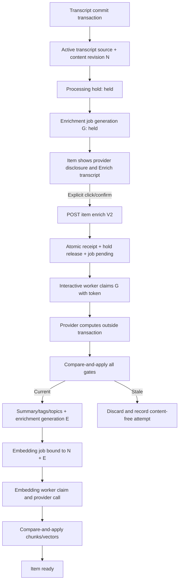

# AI Brain Item Transcript Manual Enrichment - Technical Architecture V1 Input

**Date:** 2026-07-22<br>
**Role:** Technical Architect, Product Council<br>
**Status:** V1 architecture input for Product Council and adversarial review<br>
**Decision scope:** Manual enrichment after an item-bound YouTube transcript has been durably attached<br>
**Required dependencies:** The final YouTube DOM capture processing hold and shared content-revision architecture must land first

## 1. Executive Decision

Add an **Enrich transcript** action to an AI Brain item only when the item has:

1. a current active transcript source;
2. a processing hold bound to that exact transcript source and item content revision; and
3. no accepted enrichment authorization for that exact source, revision, and provider plan.

The click must not call an AI provider from the HTTP request. It must atomically:

1. validate the current item, active transcript source, content revision, hold, and disclosed provider fingerprints;
2. write an immutable, idempotent manual-enrichment receipt;
3. release the exact processing hold; and
4. transition the exact enrichment job generation from `held` to the interactive queue.

The background worker then computes and applies enrichment using compare-and-apply gates. Embedding is a separately claimed second stage with its own revision and enrichment-generation gates. A changed item body, transcript source, hold, provider plan, job generation, or claim token discards the result without mutating summary, tags, topics, chunks, vectors, or successful usage state.

### Endpoint decision

**Evolve `POST /api/items/:id/enrich`; do not add a competing manual-enrichment endpoint.** The route already names the intended command and there are no current in-repository UI callers. Replace its implementation contract with a strict JSON, receipt-based V2 command. Remove the query-string `?force=realtime` execution path from the user flow and never run `enrichItem()` inline in the route.

This is an in-place contract evolution, not preservation of the current internals. A short compatibility window may return an explicit `legacy_contract_removed` response for bodyless or `force` requests, but it must not retain the unsafe behavior.

### Scope decision

P0 applies to transcript sources that carry an active processing hold, initially `browser_visible_transcript` from the approved fixture/local or lab flow. Existing unheld paste, file, official-caption, owned-media, and ordinary item enrichment behavior is not silently converted to held behavior in this feature. General-purpose re-enrichment of already processed items is a separate product decision.

Production browser transcript capture remains a no-go under the final YouTube DOM capture plan. This feature does not promote that capture path. It only defines how explicitly retained, held content can receive a separate user authorization for downstream processing in an approved environment.

## 2. Evidence Reviewed

### Prior decisions

- `docs/plans/youtube-dom-capture/prototype/item-initiated-recovery/README.md`
- `docs/plans/youtube-dom-capture/prototype/item-initiated-recovery/2026-07-22_ai_brain_item_transcript_recovery_product_council.md`
- `docs/plans/youtube-dom-capture/2026-07-22_ai_brain_youtube_dom_capture_implementation_plan_v2_final.md`

The final plan establishes the required foundation:

- `items.content_revision` is a monotonic body-version fence.
- Every asynchronous body-derived writer must capture and compare that revision.
- browser-visible transcript capture creates an active `content_processing_holds` row.
- enrichment and embedding claim queries must exclude active holds.
- enrichment and embedding apply paths must recheck both the hold and revision.
- the original V0.1 browser capture proposal intentionally exposes no hold-release API.

This proposal is the separately reviewed follow-up that adds that release command.

### Current implementation findings

| Area | Current evidence | Architectural consequence |
| --- | --- | --- |
| Manual endpoint | `src/app/api/items/[id]/enrich/route.ts` authenticates only by session cookie, accepts a query-string mode, resets jobs broadly, and may await `enrichItem()` inline. | Keep the URL, replace the contract and internals. Require exact origin, bounded JSON, a mutation ID, source/revision/provider binding, and queue-only execution. |
| Endpoint tests | `src/app/api/items/[id]/enrich/route.test.ts` covers authentication, not-found, broad queue reset, and one `running` conflict. Realtime provider behavior is explicitly not covered there. | The current tests are insufficient for authorization, idempotency, source binding, revision fencing, provider change, or failure atomicity. |
| Status endpoint | `src/app/api/items/[id]/enrichment-status/route.ts` returns only item state, batch ID, latest job error, and attempts. | Evolve it into the read model for `awaiting_permission`, source/revision binding, provider disclosure, job stage, embedding stage, and retry eligibility. |
| Repair transaction | `src/lib/repair/item-repair.ts` clears derived data, writes the body, marks enrichment pending, rearms a job, and deletes embedding jobs. It has no content revision, hold, source, or job-generation fields today. | Transcript attachment must create or reset an exact held job after the body revision and active source are known. It must not advertise work as queued while a hold blocks it. |
| Transcript attachment | `src/lib/capture/transcripts/user-provided.ts` wraps repair, source replacement, and segment insertion in a transaction. Active source identity exists in `transcript_sources`. | Exact-source binding is feasible. Browser commit and any future held attachment must set the hold and job only after the final active source and revision are known. |
| Active source | `src/db/transcripts.ts` resolves the active source by status, but the current schema does not enforce one active source per item. | The final capture dependency's partial unique active-source index is mandatory before this feature. |
| Enrichment worker | `src/lib/queue/enrichment-worker.ts` claims by `state='pending'`, has no hold/source/revision filter, no claim token, and marks jobs done after `enrichItem()` returns. | Replace claim and apply with one generation-bound lease and compare-and-apply service. |
| Enrichment pipeline | `src/lib/enrich/pipeline.ts` loads the item once, awaits a provider, then unconditionally updates summary/title/tags/topics. Its usage helper is typed and recorded as Ollama even though the provider factory supports other providers. | Split pure input/compute from transactional apply, and record actual provider/model only against the attempt outcome. |
| Batch submit | `src/lib/queue/enrichment-batch.ts` selects candidates, sends item IDs as provider `custom_id`, awaits submission, and only then marks rows batched. | Claim before network, use an opaque generation-bound result key, exclude interactive work, and compare all gates on result apply. |
| Batch apply | Batch results are guarded primarily by `items.enrichment_state='batched'`. | Item state alone cannot distinguish a new body/source/job generation. Require batch ID, result key, generation, source, revision, hold, and provider fingerprint. |
| Embedding | `src/lib/embed/pipeline.ts` returns success whenever any original-content chunks already exist, computes without a hold/revision check, and inserts after provider calls without a claim token. | Existing chunks are not proof of current indexing. Add an embedding job generation and bind it to both content revision and the successfully applied enrichment generation. |
| Item UI | `src/app/items/[id]/page.tsx` already loads the active transcript source and renders the transcript panel. `ItemEnrichmentWatch` and `EnrichingPill` know only pending/running/batched/done/error. | Place the action next to the attached transcript/processing state and extend the read model instead of inferring permission from `items.enrichment_state`. |
| Provider configuration | `src/lib/llm/factory.ts` selects Ollama, Anthropic, or OpenRouter; `src/lib/embed/factory.ts` selects Ollama or Gemini. | The click must disclose and pin both the enrichment and embedding provider plans. |
| Same-origin precedent | `src/lib/notes/http.ts` rejects missing or foreign origins for cookie-authenticated writes. | Reuse `isExactSameOrigin(req)` for this web-only mutation. Do not allow bearer or extension credentials to authorize AI processing. |
| Mutation precedent | migration 025 and the processing domain use client mutation IDs, canonical request fingerprints, terminal receipts, exact-version checks, and replay responses. | Use the same receipt discipline in a domain-specific table rather than overloading workflow receipt enums. |
| Deletion | `src/db/items.ts` explicitly removes vec0 rows, then deletes the item so foreign-key children cascade. | New holds, receipts, jobs, and attempts must be item children; an in-flight worker must fail closed after deletion. |

## 3. Problem Statement

Attaching a transcript and authorizing AI processing are separate user decisions. The browser-capture design correctly retains transcript content under a processing hold. The product now needs an explicit action that lets the user authorize enrichment and semantic indexing after reviewing the attached transcript.

A button that only changes `items.enrichment_state` is insufficient. It could release the wrong transcript, race a source replacement, revive an obsolete Anthropic batch, apply a provider result generated from an older body, or send content to a provider that was not disclosed when the user clicked.

The architecture therefore needs a durable authorization boundary, not merely a UI trigger.

## 4. Goals And Non-Goals

### Goals

1. Show an honest **Enrich transcript** action after an eligible held transcript is attached.
2. Name the configured enrichment and embedding processors before authorization, including whether each is local or remote and what data it receives.
3. Bind authorization to one item, active transcript source, content revision, and provider-plan pair.
4. Release the exact hold and create/rearm the exact job atomically.
5. Make clicks, retries, page refreshes, route retries, worker crashes, batch races, source replacement, and deletion deterministic.
6. Ensure stale enrichment and embedding results can never apply.
7. Preserve manual tags, collections, notes, workflow status, and item identity.
8. Provide a status model that distinguishes held, queued, running, embedding, complete, blocked, stale, and retryable error states.
9. Keep production browser capture disabled unless a separate approval changes that decision.

### Non-goals

- Automatically enrich as part of transcript attachment.
- Let the Chrome extension authorize or trigger model processing.
- Add a provider picker to the item screen.
- Add arbitrary replacement of an active transcript source.
- Preserve the current synchronous `force=realtime` HTTP behavior.
- Promise cancellation after a remote batch or provider request has already been accepted. Late results are discarded instead.
- Generalize the button to every item type in P0.
- Make old binaries safe against the new schema without an explicit compatibility patch and rehearsal.

## 5. Architecture Decisions

| ID | Decision |
| --- | --- |
| ADR-ME-01 | Transcript attachment and AI authorization remain separate durable actions. |
| ADR-ME-02 | Evolve `POST /api/items/:id/enrich` to a strict V2 command and remove inline provider execution. |
| ADR-ME-03 | Only the authenticated Brain web origin may authorize enrichment. The extension bearer is not accepted. |
| ADR-ME-04 | The client supplies a UUID mutation ID, expected content revision, active transcript source ID, and the provider-plan fingerprints it reviewed. |
| ADR-ME-05 | One immediate SQLite transaction writes the receipt, releases the matching hold, and transitions the matching job generation to `pending`. |
| ADR-ME-06 | A browser transcript commit creates or resets an enrichment job in `held`, not claimable `pending`. |
| ADR-ME-07 | Manual authorization always enters the `interactive` lane. It is processed by the realtime worker, never the nightly batch path. |
| ADR-ME-08 | Provider calls occur only after a lease claim with a random claim token and exact source/revision/provider binding. |
| ADR-ME-09 | Enrichment apply checks the current job generation and claim token, item revision, active source, released hold, and provider fingerprint in one transaction. |
| ADR-ME-10 | Successful enrichment advances a monotonic `items.enrichment_generation`; embedding binds to both content revision and enrichment generation. |
| ADR-ME-11 | Embedding is a separately claimed stage. Existing chunks count only when their source versions match the expected current generations. |
| ADR-ME-12 | Batch candidates are claimed before submission and use an opaque result key. Item ID alone is never a batch result authority. |
| ADR-ME-13 | Domain receipts are immutable under update, but cascade on item deletion to honor item deletion. |
| ADR-ME-14 | Detailed per-item operational history lives in cascading database attempt rows. Aggregate logs contain no transcript, URL, title, source ID, item ID, or provider raw response. |
| ADR-ME-15 | Feature disable is checked at request, claim, and apply. It is the normal rollback and containment mechanism. |

## 6. Required Invariants

These are merge-blocking invariants, not implementation guidance.

### Authorization invariants

1. A transcript commit never releases a processing hold.
2. A web click cannot release a hold unless session authentication and exact same-origin validation pass.
3. A valid extension bearer cannot release a hold or create an enrichment authorization.
4. One mutation ID maps to one canonical request fingerprint and one terminal response.
5. Reusing a mutation ID with a different fingerprint returns `mutation_fingerprint_mismatch` and mutates nothing.
6. The provider fingerprints accepted by the server equal those disclosed by the UI for the same status snapshot.

### Content invariants

7. An authorization is valid for exactly one `item_id`, `transcript_source_id`, and `expected_content_revision`.
8. The source is still the sole active transcript source at release, claim, and apply.
9. The item content revision is unchanged at release, claim, and apply.
10. A hold may be released only when its source and expected revision equal the request binding.
11. Replacing the transcript or body creates a new revision, invalidates prior claims, and establishes a new held generation before commit.
12. Enrichment and embedding also compare a canonical fingerprint of every prompt/index input not versioned by `content_revision`, including title and current AI summary.

### Queue invariants

13. At most one current enrichment job row exists per item, with a monotonically increasing job generation.
14. A worker applies only with the current generation and claim-token hash.
15. An interactive job is never submitted to the batch provider.
16. A batch result applies only to the stored batch ID and opaque result-key hash for its exact generation.
17. A stale attempt never changes `items.enrichment_state`, summary, title, tags, topics, chunks, vectors, the current job, or a newer attempt's retry budget.

### Derived-data invariants

18. Enrichment output is applied atomically with auto-tag/topic replacement, actual usage accounting, enrichment-generation advancement, and exact embedding-job creation.
19. Manual tags, collections, notes, workflow fields, transcript source rows, and transcript segments are not replaced by enrichment.
20. Embedding applies only for the current content revision and current successful enrichment generation.
21. All chunks and vectors for an embedding generation are replaced in one transaction or none are.
22. `original_content` chunk `source_version` equals `content_revision`; `ai_summary` chunk `source_version` equals `enrichment_generation`.

### Deletion and privacy invariants

23. Item deletion removes current holds, receipts, jobs, attempts, transcript children, chunks, and vectors without allowing an in-flight worker to recreate them.
24. No receipt, status payload, attempt row, log, or error stores transcript text, prompt text, provider raw output, cookies, credentials, or signed resources.

## 7. Target Flow



The user-visible action occurs only between `held` and `pending`. Workers cannot infer consent from transcript existence, capture quality, or item state.

## 8. HTTP Contracts

### 8.1 Evolve `GET /api/items/:id/enrichment-status`

The GET remains session-authenticated, side-effect free, and `Cache-Control: private, no-store`. It returns the server-owned action/read model. It must not probe providers over the network.

Example held response:

```json
{
  "contractVersion": "manual-enrichment-v2",
  "state": "awaiting_permission",
  "item": {
    "id": "8f0b...",
    "contentRevision": 7,
    "enrichmentGeneration": 0
  },
  "transcript": {
    "sourceId": "4a91...",
    "sourceKind": "browser_visible_transcript",
    "languageCode": "en",
    "segmentCount": 286
  },
  "hold": {
    "state": "held",
    "reason": "youtube_browser_v0_1"
  },
  "job": {
    "state": "held",
    "generation": 3,
    "lane": null,
    "attempts": 0,
    "maxAttempts": 3,
    "retryable": false
  },
  "providerPlan": {
    "version": "content-processing-provider-plan-v1",
    "enrichment": {
      "fingerprint": "<64 lowercase hex>",
      "label": "Anthropic Claude",
      "model": "claude-haiku-4-5-20251001",
      "remote": true,
      "receives": ["item title", "transcript body"]
    },
    "embedding": {
      "fingerprint": "<64 lowercase hex>",
      "label": "Google Gemini",
      "model": "gemini-embedding-001",
      "remote": true,
      "receives": ["item title", "transcript chunks", "AI summary chunks"]
    }
  },
  "action": {
    "kind": "release_transcript_and_enrich",
    "enabled": true,
    "disabledReason": null
  }
}
```

Public status states:

| State | Meaning |
| --- | --- |
| `awaiting_permission` | Exact held transcript is ready; no AI work is claimable. |
| `queued` | Authorization receipt exists and interactive job is pending. |
| `enriching` | Exact enrichment generation is leased/running. |
| `queued_batch` | Existing non-interactive work only; not used by this manual flow. |
| `embedding` | Enrichment applied; exact embedding generation is pending/running. |
| `ready` | Summary and exact-version semantic index are complete. |
| `retryable_error` | Current exact generation failed below or at retry policy and user retry is allowed. |
| `provider_review_required` | Configured provider fingerprint no longer matches the accepted plan. |
| `content_changed` | Item revision or active source changed; refresh before another action. |
| `blocked` | Feature/policy/retention gate denies processing. |
| `not_applicable` | No eligible held active transcript exists. |

The response should not expose claim tokens, batch result keys, raw errors, provider endpoints, legal approval identifiers, or policy provenance JSON.

### 8.2 Replace `POST /api/items/:id/enrich` contract

Required request headers:

```http
Content-Type: application/json
Origin: <exact Brain origin>
Cookie: brain-session=<valid session>
```

Strict request body, maximum 8 KiB:

```json
{
  "contractVersion": "manual-enrichment-v2",
  "mutationId": "b1868e88-2550-4b1e-9de7-f7af6e04aa2d",
  "operation": "release_transcript_and_enrich",
  "expectedContentRevision": 7,
  "transcriptSourceId": "4a91...",
  "providerPlanVersion": "content-processing-provider-plan-v1",
  "enrichmentProviderFingerprint": "<64 lowercase hex>",
  "embeddingProviderFingerprint": "<64 lowercase hex>"
}
```

`operation` is strictly one of `release_transcript_and_enrich` for the initial held state or `retry_current_enrichment` for an exact released-hold terminal error/provider-review state. The client cannot choose queue lane, provider name, model, hold reason, retry budget, item state, or destination. Those are server-owned.

Accepted response:

```json
{
  "contractVersion": "manual-enrichment-v2",
  "replayed": false,
  "receipt": {
    "mutationId": "b1868e88-2550-4b1e-9de7-f7af6e04aa2d",
    "outcome": "accepted_effective",
    "resultCode": "interactive_enrichment_queued",
    "itemId": "8f0b...",
    "transcriptSourceId": "4a91...",
    "contentRevision": 7,
    "jobGeneration": 3,
    "createdAt": 1784710000000
  },
  "status": {
    "state": "queued"
  }
}
```

### 8.3 Gate order

Apply gates in this order to reduce ambiguity and avoid work before authority:

1. valid session cookie, otherwise `401 unauthenticated`;
2. exact same-origin header, with missing origin rejected, otherwise `403 cross_origin_forbidden`;
3. write feature flag and environment policy, otherwise `503 manual_enrichment_disabled`;
4. `Content-Type: application/json`, otherwise `415 unsupported_media_type`;
5. declared and streamed body size, otherwise `413 request_too_large`;
6. strict schema and contract version, otherwise `400 invalid_request` or `426 contract_upgrade_required`;
7. per-session mutation rate limit, otherwise `429 rate_limited`;
8. transaction and domain gates.

Do not accept bearer authentication on this route. Do not use the broad bearer `validateOrigin()` helper because it permits missing origins and arbitrary Chrome extension origins by design.

### 8.4 Domain outcomes

| HTTP | Code | Durable receipt | Behavior |
| ---: | --- | --- | --- |
| 202 | `interactive_enrichment_queued` | Yes | Hold released and exact job queued. |
| 202 | `interactive_enrichment_retried` | Yes | Exact released binding was reauthorized and a new job generation queued. |
| 200 | `idempotent_replay` | Existing | Same mutation/fingerprint returns the original response. |
| 200 | `already_queued` | Yes, accepted no-op | Another accepted mutation already queued the same source/revision/provider plan. |
| 200 | `already_ready` | Yes, accepted no-op | Exact revision/source and derived generations are already current. Button should normally be absent. |
| 404 | `item_not_found` | No | No mutation and no orphan receipt. |
| 409 | `hold_not_current` | Yes, rejected | Hold is missing, released for another request, or bound differently. |
| 409 | `active_source_changed` | Yes, rejected | Requested source is not the sole active source. |
| 409 | `content_revision_changed` | Yes, rejected | Item body changed. Return current safe status, not body text. |
| 409 | `provider_plan_changed` | Yes, rejected | Server fingerprints differ from those reviewed by the user. |
| 409 | `job_conflict` | Yes, rejected | A different current generation cannot be safely coalesced. |
| 422 | `mutation_fingerprint_mismatch` | Existing receipt remains | Mutation ID was reused with different canonical content. |
| 503 | `manual_enrichment_disabled` | No | Kill switch or policy disabled before durable work. |
| 503 | `temporarily_unavailable` | No | SQLite busy/operational error before commit; client may retry the same mutation ID. |

Authentication, origin, malformed-body, and rate-limit failures should not create domain receipts.

## 9. Provider Disclosure And Binding

Create a content-processing provider plan separate from note AI policy because the content categories and purposes differ.

Proposed module:

`src/lib/processing/content-provider-plan.ts`

It resolves configuration without a network call and returns two entries:

```ts
interface ContentProviderPlanEntry {
  purpose: "enrichment" | "semantic_index";
  fingerprint: string;
  provider: string;
  model: string;
  label: string;
  remote: boolean;
  receives: Array<
    | "item title"
    | "transcript body"
    | "transcript chunks"
    | "AI summary chunks"
  >;
}
```

Fingerprint input is a NUL-separated canonical tuple:

```text
provider-plan-v1
purpose
provider
model
local-or-remote
normalized-provider-endpoint-identity
```

The endpoint identity is hashed into the fingerprint but never returned. Invalid or non-loopback Ollama endpoints fail closed as remote, matching the existing note provider-policy posture.

### UX disclosure rules

- Always show both stages before the button.
- For local-only plans, adjacent copy plus the explicit button is sufficient authorization.
- If either stage is remote, the first button click opens a compact confirmation dialog. The confirm action creates the POST request.
- Copy must name what leaves Brain, not merely the provider brand.
- Do not say "transcript only": enrichment sends title and body; semantic indexing sends source and generated-summary chunks.
- If fingerprints change between GET and POST, return `provider_plan_changed`; the UI refreshes and asks again.
- A worker also compares the accepted fingerprint at claim and apply. A process restart with changed configuration cannot silently continue an old authorization.

Provider health is not checked inside the authorization transaction. Health changes are operational and retryable; identity changes require renewed review.

## 10. Schema And Migration Strategy

### 10.1 Dependency ordering

The final YouTube capture plan reserves migration 026 for content revision, active-source uniqueness, claim foundations, and processing holds. This proposal uses the next migration, nominally:

`027_manual_transcript_enrichment.sql`

If migration numbering changes before implementation, use the next free number but preserve this dependency order. Do not combine 026 and 027 into an unreviewable migration.

### 10.2 Item derived generation

Add:

```sql
ALTER TABLE items ADD COLUMN enrichment_generation INTEGER NOT NULL DEFAULT 0
  CHECK (enrichment_generation >= 0);
```

`content_revision` versions the body. `enrichment_generation` versions the successful summary/title/auto-tag/topic output for that body. Both are necessary because two enrichment attempts against the same body revision can produce different summaries, and an old embedding result must not index a replaced summary.

Rules:

- body replacement clears derived output and resets `enrichment_generation=0`;
- successful enrichment sets it to the current enrichment job generation;
- an enrichment retry that has not applied does not advance it;
- embedding binds to both values.

### 10.3 Manual enrichment receipts

Create a domain-specific table. Do not extend `processing_mutation_receipts`; its enums and undo semantics belong to workflow mutations.

```sql
CREATE TABLE manual_enrichment_receipts (
  mutation_id TEXT PRIMARY KEY,
  request_fingerprint TEXT NOT NULL CHECK(length(request_fingerprint) = 64),
  item_id TEXT NOT NULL REFERENCES items(id) ON DELETE CASCADE,
  transcript_source_id TEXT NOT NULL,
  expected_content_revision INTEGER NOT NULL CHECK(expected_content_revision > 0),
  provider_plan_version TEXT NOT NULL
    CHECK(provider_plan_version = 'content-processing-provider-plan-v1'),
  enrich_provider_fingerprint TEXT NOT NULL CHECK(length(enrich_provider_fingerprint) = 64),
  embed_provider_fingerprint TEXT NOT NULL CHECK(length(embed_provider_fingerprint) = 64),
  outcome_class TEXT NOT NULL
    CHECK(outcome_class IN ('accepted_effective','accepted_noop','rejected')),
  result_code TEXT NOT NULL CHECK(result_code IN (
    'interactive_enrichment_queued',
    'interactive_enrichment_retried',
    'already_queued',
    'already_ready',
    'hold_not_current',
    'active_source_changed',
    'content_revision_changed',
    'provider_plan_changed',
    'job_conflict'
  )),
  job_id INTEGER,
  job_generation INTEGER CHECK(job_generation IS NULL OR job_generation > 0),
  http_status INTEGER NOT NULL CHECK(http_status BETWEEN 200 AND 599),
  created_at INTEGER NOT NULL CHECK(created_at >= 0)
);

CREATE INDEX manual_enrichment_receipts_item_created
  ON manual_enrichment_receipts(item_id, created_at DESC);

CREATE TRIGGER manual_enrichment_receipts_immutable
BEFORE UPDATE ON manual_enrichment_receipts
BEGIN
  SELECT RAISE(ABORT, 'manual_enrichment_receipt_immutable');
END;
```

`transcript_source_id` is the requested/bound identifier snapshot rather than a foreign key so a rejected wrong-source request can still receive a deterministic receipt. `item_id` is a foreign key and all receipts require an existing item, so item deletion still cascades every receipt. Missing-item requests receive no receipt. There is intentionally no delete-blocking trigger. A replay after item deletion returns not found rather than resurrecting authority.

### 10.4 Strengthen `content_processing_holds`

Migration 026's planned table is keyed by item. Rebuild or extend it to make the revision and release receipt explicit:

```sql
CREATE TABLE content_processing_holds_new (
  item_id TEXT PRIMARY KEY REFERENCES items(id) ON DELETE CASCADE,
  transcript_source_id TEXT NOT NULL REFERENCES transcript_sources(id) ON DELETE CASCADE,
  policy_decision_id TEXT NOT NULL REFERENCES capture_policy_decisions(id) ON DELETE CASCADE,
  expected_content_revision INTEGER NOT NULL CHECK(expected_content_revision > 0),
  state TEXT NOT NULL CHECK(state IN ('held','released')),
  reason TEXT NOT NULL CHECK(reason = 'youtube_browser_v0_1'),
  release_mutation_id TEXT,
  created_at INTEGER NOT NULL,
  released_at INTEGER,
  CHECK (
    (state = 'held' AND release_mutation_id IS NULL AND released_at IS NULL)
    OR
    (state = 'released' AND release_mutation_id IS NOT NULL AND released_at IS NOT NULL)
  )
);
```

Add a release-shape trigger that requires an accepted receipt for the same item, source, and revision before `held -> released`. The service inserts the receipt first in the same transaction, then performs the guarded update. A new transcript/body commit may reset a released row to `held` only when source ID or content revision changes; a trigger rejects same-binding re-holds.

This row is the current processing gate. Historical authorization evidence remains in receipts and attempts.

### 10.5 Rebuild `enrichment_jobs`

The current table check constraint cannot express held, submit, or blocked states, so use a preserving rebuild after draining in-flight work.

```sql
CREATE TABLE enrichment_jobs_new (
  id INTEGER PRIMARY KEY AUTOINCREMENT,
  item_id TEXT NOT NULL UNIQUE REFERENCES items(id) ON DELETE CASCADE,
  generation INTEGER NOT NULL DEFAULT 1 CHECK(generation > 0),
  state TEXT NOT NULL CHECK(state IN (
    'held','pending','running','batch_submitting','batched','done','error','blocked'
  )),
  execution_lane TEXT CHECK(execution_lane IN ('scheduled','interactive')),
  expected_content_revision INTEGER NOT NULL CHECK(expected_content_revision > 0),
  transcript_source_id TEXT REFERENCES transcript_sources(id) ON DELETE CASCADE,
  authorization_mutation_id TEXT REFERENCES manual_enrichment_receipts(mutation_id),
  enrich_provider_fingerprint TEXT CHECK(
    enrich_provider_fingerprint IS NULL OR length(enrich_provider_fingerprint) = 64
  ),
  embed_provider_fingerprint TEXT CHECK(
    embed_provider_fingerprint IS NULL OR length(embed_provider_fingerprint) = 64
  ),
  input_fingerprint TEXT CHECK(input_fingerprint IS NULL OR length(input_fingerprint) = 64),
  claim_token_hash TEXT CHECK(claim_token_hash IS NULL OR length(claim_token_hash) = 64),
  claimed_at INTEGER,
  lease_expires_at INTEGER,
  batch_id TEXT,
  batch_result_key_hash TEXT UNIQUE,
  attempts INTEGER NOT NULL DEFAULT 0 CHECK(attempts >= 0),
  last_error_code TEXT,
  created_at INTEGER NOT NULL DEFAULT (unixepoch() * 1000),
  updated_at INTEGER NOT NULL DEFAULT (unixepoch() * 1000),
  completed_at INTEGER,
  CHECK(state != 'held' OR execution_lane IS NULL),
  CHECK(execution_lane != 'interactive' OR authorization_mutation_id IS NOT NULL),
  CHECK(state NOT IN ('running','batch_submitting','batched') OR claim_token_hash IS NOT NULL),
  CHECK(state IN ('running','batch_submitting','batched') OR
    (claim_token_hash IS NULL AND claimed_at IS NULL AND lease_expires_at IS NULL)),
  CHECK(
    (state = 'batch_submitting' AND batch_id IS NULL AND batch_result_key_hash IS NOT NULL)
    OR
    (state = 'batched' AND batch_id IS NOT NULL AND batch_result_key_hash IS NOT NULL)
    OR
    (state NOT IN ('batch_submitting','batched') AND
      batch_id IS NULL AND batch_result_key_hash IS NULL)
  )
);

CREATE INDEX enrichment_jobs_claim
  ON enrichment_jobs(state, execution_lane, created_at);
CREATE INDEX enrichment_jobs_expected_revision
  ON enrichment_jobs(item_id, expected_content_revision, generation);
CREATE INDEX enrichment_jobs_batch
  ON enrichment_jobs(batch_id) WHERE batch_id IS NOT NULL;
```

`claim_token_hash` stores SHA-256 of a random 256-bit token. The raw token exists only in worker memory. Stale-claim recovery creates a new token, so a resumed old process cannot apply.

The item-level `enrichment_state` remains a compatibility projection:

| Job state | Item projection |
| --- | --- |
| `held` | `pending` |
| `pending` | `pending` |
| `running`, `batch_submitting` | `running` |
| `batched` | `batched` |
| `done` | `done` |
| `error`, `blocked` | `error` |

UI authorization must never be inferred from this projection.

### 10.6 Enrichment attempts

```sql
CREATE TABLE enrichment_job_attempts (
  id TEXT PRIMARY KEY,
  job_id INTEGER NOT NULL REFERENCES enrichment_jobs(id) ON DELETE CASCADE,
  item_id TEXT NOT NULL REFERENCES items(id) ON DELETE CASCADE,
  job_generation INTEGER NOT NULL CHECK(job_generation > 0),
  expected_content_revision INTEGER NOT NULL CHECK(expected_content_revision > 0),
  transcript_source_id TEXT REFERENCES transcript_sources(id) ON DELETE CASCADE,
  execution_path TEXT NOT NULL CHECK(execution_path IN ('interactive','scheduled','batch')),
  provider_fingerprint TEXT CHECK(
    provider_fingerprint IS NULL OR length(provider_fingerprint) = 64
  ),
  input_fingerprint TEXT CHECK(input_fingerprint IS NULL OR length(input_fingerprint) = 64),
  outcome_code TEXT NOT NULL CHECK(outcome_code IN (
    'succeeded','provider_failed','validation_failed','stale_result_discarded',
    'hold_reinstated','source_changed','revision_changed','claim_lost',
    'provider_changed','feature_disabled','deleted','batch_submit_orphaned'
  )),
  attempt_number INTEGER NOT NULL CHECK(attempt_number > 0),
  input_tokens INTEGER,
  output_tokens INTEGER,
  wall_ms_bucket TEXT,
  error_code TEXT,
  started_at INTEGER NOT NULL,
  completed_at INTEGER NOT NULL
);

CREATE INDEX enrichment_attempts_item_created
  ON enrichment_job_attempts(item_id, completed_at DESC);
```

Do not store prompt, body, transcript, generated raw JSON, stack traces, URLs, titles, or claim tokens.

### 10.7 Rebuild `embedding_jobs`

```sql
CREATE TABLE embedding_jobs_new (
  id INTEGER PRIMARY KEY AUTOINCREMENT,
  item_id TEXT NOT NULL UNIQUE REFERENCES items(id) ON DELETE CASCADE,
  generation INTEGER NOT NULL DEFAULT 1 CHECK(generation > 0),
  state TEXT NOT NULL CHECK(state IN ('pending','running','done','error','blocked')),
  expected_content_revision INTEGER NOT NULL CHECK(expected_content_revision > 0),
  expected_enrichment_generation INTEGER NOT NULL CHECK(expected_enrichment_generation > 0),
  transcript_source_id TEXT REFERENCES transcript_sources(id) ON DELETE CASCADE,
  provider_fingerprint TEXT CHECK(
    provider_fingerprint IS NULL OR length(provider_fingerprint) = 64
  ),
  input_fingerprint TEXT CHECK(input_fingerprint IS NULL OR length(input_fingerprint) = 64),
  authorization_mutation_id TEXT REFERENCES manual_enrichment_receipts(mutation_id),
  claim_token_hash TEXT CHECK(claim_token_hash IS NULL OR length(claim_token_hash) = 64),
  attempts INTEGER NOT NULL DEFAULT 0 CHECK(attempts >= 0),
  last_error_code TEXT,
  created_at INTEGER NOT NULL DEFAULT (unixepoch() * 1000),
  updated_at INTEGER NOT NULL DEFAULT (unixepoch() * 1000),
  claimed_at INTEGER,
  lease_expires_at INTEGER,
  completed_at INTEGER,
  CHECK(state != 'running' OR claim_token_hash IS NOT NULL),
  CHECK(state = 'running' OR
    (claim_token_hash IS NULL AND claimed_at IS NULL AND lease_expires_at IS NULL)),
  CHECK(state = 'blocked' OR provider_fingerprint IS NOT NULL)
);

CREATE INDEX embedding_jobs_claim
  ON embedding_jobs(state, updated_at);
CREATE INDEX embedding_jobs_expected_versions
  ON embedding_jobs(item_id, expected_content_revision, expected_enrichment_generation);
```

Create a sibling `embedding_job_attempts` table with the same content-free lifecycle fields and embedding-specific outcomes.

Drop the current simple `items_enqueue_embedding` trigger. Successful enrichment apply must upsert the exact embedding job in the same transaction because a trigger cannot safely snapshot provider authorization, transcript source, content revision, and enrichment generation.

### 10.8 Trigger updates

Recreate `items_enqueue_enrichment` so new ordinary items receive a scheduled job with `expected_content_revision=new.content_revision`. It must not create an interactive authorization.

Held browser transcript commit does not depend on this insert trigger. Its atomic capture service explicitly increments the job generation and sets:

```text
state=held
execution_lane=NULL
expected_content_revision=<new committed revision>
transcript_source_id=<new active source>
authorization_mutation_id=NULL
provider fingerprints=NULL
claim/batch fields=NULL
attempts=0
```

### 10.9 Migration preflight and row mapping

Run with enrichment, batch, embedding, transcript recovery, and capture writes disabled.

Preflight must fail if:

- migration 026 is absent or its hash is unexpected;
- any item has multiple active transcript sources;
- any enrichment job is `running` or `batched`;
- any embedding job is `running`;
- any held item cannot be joined to its exact active source and current revision;
- duplicate current job rows exist despite expected uniqueness;
- foreign-key check differs from the captured baseline.

Map legacy rows as follows:

- `expected_content_revision = items.content_revision`;
- `generation = 1` unless a dependency migration already introduced it;
- current jobs under an active hold become `held` with no execution lane;
- unheld legacy jobs retain their state and become `scheduled`;
- provider fingerprints for unclaimed scheduled jobs may be filled at claim;
- do not migrate an in-flight remote batch because its item-ID-only result key cannot prove a new generation;
- embedding jobs for current derived data bind to current content revision and `enrichment_generation`; rows with generation zero or no safely derived provider fingerprint become `blocked` with a null fingerprint and require a rebuild decision.

Verification must compare row counts, stable hashes, indexes, triggers, schema literals, and `PRAGMA foreign_key_check` before and after. Rehearse on a production-shaped disposable snapshot and restore it before touching the live database.

## 11. Atomic Authorization Service

Create a domain service, for example:

`src/lib/enrich/manual-authorization.ts`

Route code performs only HTTP gates, parsing, and response mapping. The service owns canonical fingerprinting and one immediate transaction.

### 11.1 Canonical request fingerprint

Hash canonical JSON containing:

```text
contract version
operation
route item ID
expected content revision
transcript source ID
provider-plan version
enrichment provider fingerprint
embedding provider fingerprint
```

Do not include timestamps or presentation labels.

### 11.2 Transaction order

1. Look up `manual_enrichment_receipts` by mutation ID.
2. If found with the same fingerprint, return its recorded response with `replayed=true` and no mutation.
3. If found with a different fingerprint, throw `mutation_fingerprint_mismatch` and mutate nothing.
4. Load the item, current active transcript source, current hold, current enrichment job, and current exact-version chunks in the same writer transaction. A missing item returns `item_not_found` without a receipt.
5. Recompute the server provider plan from process configuration and compare both fingerprints.
6. Validate positive revision, active source equality, full-text retention eligibility, hold reason, hold source, hold revision, and current item revision. For an initial operation the hold must be held; for retry it must be released for the same binding.
7. If the exact source/revision/provider job is already pending/running, insert an `accepted_noop/already_queued` receipt and return it before requiring another hold transition.
8. If exact enrichment and embedding generations are already complete, insert `accepted_noop/already_ready` and return it.
9. For a rejected domain outcome, insert only the terminal rejected receipt, then return without changing hold, item, or job.
10. Ensure the current enrichment job row exists. Missing-row drift is repaired only after all eligibility gates pass.
11. Determine the next/current job generation. A newly attached held row keeps its generation. `retry_current_enrichment` requires an exact released hold plus a terminal `error` or `blocked` current job, then increments the generation.
12. Insert the accepted-effective receipt with the chosen job ID/generation.
13. For `release_transcript_and_enrich`, release the hold with a guarded update:

```sql
UPDATE content_processing_holds
SET state='released', release_mutation_id=?, released_at=?
WHERE item_id=?
  AND transcript_source_id=?
  AND expected_content_revision=?
  AND state='held';
```

Require exactly one changed row.

For `retry_current_enrichment`, require the same hold already be released for the exact source/revision and do not mutate its release receipt.

14. Transition the job to `pending`, `execution_lane='interactive'`, exact source/revision, accepted provider fingerprints, accepted mutation ID, zero attempts, and cleared claim/batch/error/completion fields. Guard the update by job ID, generation, source, revision, and `state='held'` or a permitted terminal retry state.
15. Set the compatibility item projection to `pending` and clear `items.batch_id`. Do not clear the body, transcript, receipt, manual metadata, or currently absent derived data.
16. Commit and build the response from committed rows.

Any injected failure between steps 12 and 15 rolls back the receipt, hold release, job transition, and item projection together.

### 11.3 Competing mutation IDs

SQLite serialization decides the winner:

- Request A releases the hold and queues the exact job.
- Request B then observes the exact already-queued job and creates an accepted no-op receipt.
- If B asks for a different source, revision, or provider plan, it receives a rejected receipt.
- Neither request resets attempts or steals a live claim from an unrelated generation.

## 12. Transcript Attachment Dependency Changes

The browser transcript commit service from migration/implementation 026 must be amended before this button ships:

1. update item body and obtain the incremented content revision;
2. commit policy/source/segments and one active hold for that source/revision;
3. clear stale summary, category, quotes, auto tags, topics, chunks, vectors, and old embedding job;
4. increment/reset the enrichment job generation to `held` with exact source/revision and no provider authority;
5. invalidate any old enrichment/batch/embedding claim tokens;
6. resolve transcript recovery as specified by the final capture plan;
7. commit all of the above with the capture receipt.

For `repairItemWithText`, separate reusable transaction-aware primitives from the public transaction wrapper. The browser commit service must not call a helper that can commit independently. Better-sqlite3 nested transactions may use savepoints, but the architecture should make transaction ownership explicit.

The post-attachment banner must change from "AI enrichment and semantic indexing are queued" to a held state for held sources. That current copy would be false.

## 13. Enrichment Worker Semantics

### 13.1 Claim

Refactor into exported/testable repository operations:

- `claimNextInteractiveEnrichment()`
- `claimNextScheduledRealtimeEnrichment()`
- `applyEnrichmentIfCurrent()`
- `failEnrichmentAttemptIfCurrent()`
- `sweepExpiredEnrichmentLeases()`

An interactive claim transaction:

1. selects `state='pending' AND execution_lane='interactive'`;
2. joins the item and active transcript source;
3. requires no `state='held'` processing hold for the item;
4. requires exact content revision and transcript source;
5. requires an accepted receipt matching `authorization_mutation_id` and provider fingerprints;
6. requires the current server provider fingerprints to match;
7. generates a 256-bit raw token, stores its SHA-256, and sets a finite lease;
8. increments attempts and sets job/item projection to running;
9. computes and persists a canonical input fingerprint over source type, title, author, duration, body, content revision, and transcript source text hash;
10. returns an immutable in-memory claim snapshot including title/body, source/revision, generation, provider fingerprints, input fingerprint, and raw token.

Do not call `provider.isAlive()` before selecting work globally. Provider health checks should not starve unrelated eligible states or leak a held candidate. After claim, a health/provider failure follows normal retry semantics.

Set the lease longer than the enforced provider timeout and renew it while a bounded request is making progress. Expiry recovery always rotates the token. This may duplicate provider cost after a process pause, but it cannot duplicate apply. `batched` jobs are reconciled by batch polling/expiry policy and are never resurrected by the realtime lease sweep.

### 13.2 Compute

Refactor `enrichItem()` into:

```ts
buildEnrichmentPromptInput(claim): EnrichmentPromptInput
computeEnrichment(input, provider): Promise<ComputedEnrichment>
applyEnrichmentIfCurrent(claim, computed): ApplyOutcome
```

The provider call is outside the database transaction. Validation and title post-processing remain pure. The short-body path also goes through compare-and-apply; it is not allowed to bypass authorization or stale checks just because no provider is called.

### 13.3 Apply

One immediate transaction requires:

- feature execution flag still enabled;
- job ID, generation, state `running`, and claim-token hash match;
- item exists and `content_revision` equals the claim;
- active transcript source equals the claim;
- current hold row is the same source/revision and is `released` by the accepted mutation;
- accepted and current enrichment provider fingerprints match;
- canonical current enrichment input fingerprint still matches the claim;
- item is not deleted and no newer job generation exists.

If current, atomically:

1. write summary, quotes, category, cleaned title, and `enriched_at`;
2. replace only auto tags and AI topics;
3. set `items.enrichment_generation=job.generation` and item state done;
4. set enrichment job done and clear its lease;
5. insert the successful content-free attempt and actual provider/model usage;
6. clear old original-content and AI-summary chunks/vectors;
7. create/rearm an embedding job with exact content revision, enrichment generation, source, authorization mutation, and accepted embedding fingerprint.

If any gate fails, write a stale attempt only when that can be done without mutating a newer job generation. Never mark a newer row done/error and never write derived content. If the item was deleted, there may be no surviving per-item attempt row; emit only an aggregate `deleted_before_apply` counter.

### 13.4 Failure and retry

- Transient provider/network errors retry the same generation up to three claims with a fresh token each time.
- Validation failures are retryable once only if the provider implementation already performs its structured-output retry; otherwise count against the normal cap.
- Authentication/configuration/provider-fingerprint changes are `blocked`, not blind retries.
- Terminal error retains the released hold and exact job binding. The UI offers **Retry enrichment** with a new mutation ID and freshly disclosed provider plan.
- A retry transaction increments job generation and creates a new authorization receipt. Old results fail generation/token checks.
- Error fields store stable codes, not raw provider response or transcript-adjacent messages.

## 14. Batch Semantics And Races

Manual transcript enrichment is interactive and must never be delayed into or discounted through the nightly batch. Nonetheless, the shared batch implementation must be fixed because it writes the same derived fields.

### 14.1 Candidate separation

- Interactive worker claims only `execution_lane='interactive'`.
- Batch submitter claims only `execution_lane='scheduled'` when the configured provider supports batch.
- Scheduled realtime worker may claim scheduled rows only when the provider does not support batch or an explicit server-owned fallback policy allows it.
- Every claim query excludes active holds and proves expected revision/source eligibility.

### 14.2 Claim before submit

The current read, await, then mark pattern permits duplicate/costly races. Replace it with:

1. transactionally claim candidates as `batch_submitting` with claim tokens and opaque random result keys;
2. build requests from the claim snapshots;
3. use the opaque result key as provider `custom_id`, never raw item ID;
4. submit outside the transaction;
5. CAS each still-current claim to `batched` with returned batch ID;
6. if submission fails, CAS current claims back to pending or terminal error under retry policy;
7. if a claim became stale after remote acceptance, record `batch_submit_orphaned`; do not reconnect it to a new item generation.

### 14.3 Batch apply

Hash the returned `custom_id` and locate the exact stored result-key hash. Apply only if all are true in one transaction:

- job state is batched;
- batch ID, result key, generation, provider fingerprint, revision, source, and authorization rules match;
- no hold was reinstated;
- item projection is still compatible.

A browser transcript replacement, manual repair, deletion, or newer retry invalidates the old result even if `items.enrichment_state` happens to be `batched` again.

## 15. Embedding Architecture

### 15.1 Why content revision alone is insufficient

Embeddings include both source content and the generated AI summary. The body can remain at revision 7 while a new enrichment generation replaces the summary. Therefore embedding must bind to:

- `expected_content_revision` for source content;
- `expected_enrichment_generation` for summary content;
- `transcript_source_id` for provenance;
- accepted embedding provider fingerprint;
- embedding job generation and claim token.

### 15.2 Worker

Add `src/lib/queue/embedding-worker.ts` or an equivalent shared lease runner. The current inline `embedItemWithRetry()` call may trigger an immediate best-effort drain, but correctness must not depend on the enrichment process staying alive. Instrumentation starts the dedicated worker only when background processing is enabled.

Claim and apply mirror enrichment:

1. claim pending exact-version job with a fresh token;
2. recheck released hold, active source, content revision, enrichment generation, authorization receipt, and provider fingerprint;
3. snapshot title/body/summary, persist a canonical embedding input fingerprint, and compute chunks;
4. call embedding provider outside transaction;
5. apply only if every gate, token, and recomputed input fingerprint is still current;
6. delete old vector rows before chunk cascades remove the rowid bridge;
7. insert source and summary chunks plus vectors in one transaction;
8. mark exact job done and write a content-free attempt.

### 15.3 Existing-chunk behavior

Remove the current rule that any existing `original_content` chunks mean success. Existing data is reusable only when:

- all expected source kinds exist;
- every original-content chunk has `source_version=expected_content_revision`;
- every AI-summary chunk has `source_version=expected_enrichment_generation`;
- the embedding job is already done for the same versions/provider fingerprint; and
- vector bridge/count integrity passes.

Otherwise the exact current job rebuilds the index transactionally.

### 15.4 Provider changes

If the embedding provider fingerprint changes after enrichment succeeds but before embedding is claimed/applied, mark the job blocked and show `provider_review_required`. Do not silently use the new provider. A renewed user action creates a new authorization/job generation. P0 may rerun both stages for simplicity; a later design can authorize embedding-only continuation.

## 16. UI Integration

### Placement

Use the existing item detail context. For an active held transcript, render a compact full-width processing section directly after the transcript header/panel and before digest status. Do not place the action in the weak-source repair panel after a transcript exists.

### Required states and copy intent

| State | Primary UI behavior |
| --- | --- |
| Held | "Transcript added. AI processing is paused." Show both provider disclosures and **Enrich transcript**. |
| Remote confirmation | Name remote providers and data categories; confirm with **Start enrichment**. |
| Queued | Disable duplicate action; show "Queued for enrichment". |
| Running | Show "Creating summary and topics" with polling. |
| Embedding | Show "Building semantic index". |
| Ready | Remove action; show summary/index ready state. |
| Retryable error | Stable friendly error plus **Retry enrichment**. Do not expose raw provider output. |
| Provider changed | Show refreshed disclosure and **Review provider change**. |
| Content/source changed | Refresh item and suppress stale action. |
| Feature disabled | Keep transcript visible; show local/manual availability without a dead button. |

`ItemEnrichmentWatch` should consume the expanded status response. `EnrichingPill` should no longer infer that every item-level `pending` row is actually queued; held is a first-class derived status.

### Accessibility and interaction

- Button has a stable 44 px mobile target and visible focus state.
- Confirmation is a labelled dialog with focus return.
- Status transitions use a polite live region, not repeated toast spam.
- The button disables immediately after request dispatch but recovers on network failure.
- Retrying the same network request uses the same mutation ID.
- A page refresh obtains the durable state from GET; client memory is not authoritative.

## 17. Authentication, CSRF, Origin, And Abuse Controls

1. Require a valid `brain-session` cookie.
2. Require `isExactSameOrigin(req)`; missing `Origin` is forbidden for this cookie-authenticated mutation.
3. Reject bearer-only, extension-origin, CLI, and cross-origin requests.
4. Use strict Zod parsing with `.strict()` and an 8 KiB streamed limit.
5. Accept only UUID mutation IDs, positive safe-integer revisions, valid internal source ID shape, known contract constants, and lowercase 64-hex fingerprints.
6. Add private no-store, `Vary: Cookie`, and `X-Content-Type-Options: nosniff` response headers.
7. Rate limit accepted mutation attempts per hashed session, with a low personal-tool ceiling such as 10/minute. Rate limiting is defense in depth; transaction idempotency remains authoritative.
8. Do not trust `Sec-Fetch-Site` instead of exact origin. It may be an additional signal only.
9. Do not put item, source, revision, mutation, or provider authority in a GET link.
10. Preserve the loopback-only server binding and trusted proxy boundary assumed by `isExactSameOrigin()`. Test `Host`, `X-Forwarded-Host`, and `X-Forwarded-Proto` combinations so an untrusted direct client cannot spoof the expected origin.

## 18. Observability And Privacy

### Durable per-item evidence

Receipts and attempt rows support:

- who/what was authorized at the session-authenticated product boundary, without account PII;
- source/revision/provider binding;
- job generation and execution path;
- stable outcome/error code;
- token counts and coarse wall-time bucket where the provider supplies them;
- retry and stale-discard evidence.

They must not contain transcript/prompt/output text.

### Aggregate events

Emit typed aggregate counters for:

- authorization accepted/no-op/rejected by stable code;
- hold released;
- interactive claim;
- provider failure class;
- stale discard reason;
- batch orphan;
- embedding success/failure;
- deletion-before-apply;
- kill-switch rejection at request/claim/apply.

Do not include raw item IDs, source IDs, URLs, titles, video IDs, mutation IDs, claim tokens, fingerprints, language labels, transcript sizes precise enough to identify one item, raw errors, or provider responses in append-only logs.

The existing enrichment worker logs and `errors.jsonl` include item IDs and arbitrary error text. Before processing held browser transcripts, refactor this path to stable error codes and aggregate logs. Detailed item-linked failures belong in cascading database rows surfaced to the authenticated UI.

### Usage accounting

Refactor the hard-coded Ollama usage writer. Record the actual provider and model returned by the accepted provider plan. A provider call that incurred usage but became stale should be counted as attempted/stale usage without claiming successful apply. No content or request identifiers are needed in `llm_usage`.

## 19. Deletion Semantics

`deleteItem()` remains the authoritative deletion transaction:

1. delete vec0 rows while the chunk-rowid bridge still exists;
2. delete the item;
3. foreign-key cascades remove transcript sources/segments, hold, receipts, enrichment/embedding jobs, and attempt rows;
4. an in-flight worker later fails item/job/source/token checks and writes no content;
5. the worker must not recreate an item or job from its memory snapshot.

Add deletion race tests at each provider barrier. Also verify item deletion from bulk actions follows the same repository path or gains equivalent vec0 cleanup.

Backups remain governed by the existing backup-retention policy. UI deletion cannot claim immediate erasure from previously created backups; operational documentation must remain honest.

## 20. Feature Flags, Deployment, And Rollback

### Flags

Use independently testable server-owned flags:

| Flag | Default | Purpose |
| --- | --- | --- |
| `BRAIN_MANUAL_TRANSCRIPT_ENRICHMENT_UI_ENABLED` | false | Renders disclosure/action only when read model is eligible. |
| `BRAIN_MANUAL_TRANSCRIPT_ENRICHMENT_WRITE_ENABLED` | false | Allows POST to create receipts/release holds. |
| `BRAIN_MANUAL_TRANSCRIPT_ENRICHMENT_EXECUTION_ENABLED` | false | Allows interactive worker claim and apply. |
| `BRAIN_BACKGROUND_WORKERS_MODE` | existing/required | Prior plan's all-worker containment gate. |

Hold enforcement and content-revision checks are not feature flags. Once schema 026 exists, all shared workers must always honor them.

### Deployment order

1. Land and verify migration 026 plus hold/revision enforcement with browser capture still disabled.
2. Drain running/batched enrichment and embedding work.
3. Back up and rehearse migration 027 on a production-shaped disposable snapshot.
4. Deploy 027-capable code with UI/write/execution flags false and workers honoring holds.
5. Run production-negative tests proving no held content can be claimed.
6. Enable read/UI in fixture/local mode; POST remains disabled.
7. Enable write in fixture/local with execution disabled; prove atomic receipts and queue state.
8. Enable execution against synthetic content and local providers.
9. Run approved isolated-lab provider canary only after provider disclosure/privacy review.
10. Production remains disabled until the capture plan's production no-go is separately superseded.

### Immediate rollback

1. Disable write to stop new releases.
2. Disable execution so pending work cannot claim and in-flight apply fails its kill-switch gate.
3. Hide UI while retaining transcript and status truthfully.
4. Keep migration 027 applied; repair forward under flags.
5. Do not revert to a binary that lacks hold/revision gates while any held or released browser transcript exists.

### Binary rollback warning

The current binary would claim `pending` enrichment jobs without checking holds and would apply provider results without content revision checks. Therefore binary rollback is a **no-go** until a previous-version compatibility build has been patched and tested to:

- understand or ignore new job states safely;
- exclude active holds from claims;
- reject new provider-authorized jobs; and
- avoid applying stale results.

Forward code plus disabled flags is the normal rollback.

## 21. Failure Injection Plan

Use explicit test dependencies/barriers, not environment-only production hooks.

### Authorization transaction

Inject failure:

1. after accepted receipt insert;
2. after hold release;
3. after job transition;
4. after item projection update;
5. immediately before transaction return.

For every point prove zero partial receipt, release, job, or projection change. Retry with the same mutation ID must then succeed exactly once.

### Enrichment worker

Pause:

- after claim and before provider call;
- after provider response and before validation;
- after validation and before apply;
- inside apply after item update, after tag/topic replacement, after attempt/usage insert, and after embedding-job upsert.

While paused independently:

- replace body/source;
- reinstate a hold with a new revision;
- increment job generation via retry;
- change provider fingerprint via controlled restart/config fixture;
- disable execution;
- delete the item;
- expire and reclaim the lease.

Expected result is either a wholly successful current apply or a content-free stale outcome with zero derived mutation.

### Batch

Pause:

- after batch claim but before submit;
- after remote submit but before storing batch ID;
- after poll response but before apply.

Race each pause with transcript replacement, manual authorization, job retry, and deletion. Prove late results cannot route by item ID or overwrite the interactive generation.

### Embedding

Pause after snapshot, after each provider batch, and before apply. Change content revision, enrichment generation, source, provider fingerprint, hold, claim, and item existence. Inject failure after chunk deletion and during vector insertion; transaction rollback must preserve the prior complete index or leave the intentionally cleared pre-job state, never a mixed index.

## 22. Test Matrix

### Route and HTTP

- unauthenticated, invalid session, missing origin, foreign origin, extension origin, and bearer-only all reject;
- wrong content type, malformed JSON, unknown key, oversized body, unsafe integer, invalid UUID/source/fingerprint reject;
- feature disabled rejects before durable work;
- private no-store headers exist on all responses;
- exact valid origin succeeds behind enabled flags;
- bodyless and `?force=realtime` requests do not execute legacy behavior.

### Receipt/idempotency

- first valid mutation queues once;
- same mutation and fingerprint replays byte-equivalent domain outcome;
- same mutation with changed source/revision/provider fingerprint returns 422;
- two mutation IDs racing the same binding produce one effective and one no-op receipt;
- transaction failure leaves no receipt and same-ID retry succeeds;
- receipts reject UPDATE and cascade on item deletion.

### Eligibility and binding

- no item, non-YouTube item, no active source, multiple active-source preflight, wrong source, stale revision, missing hold, released hold, wrong hold reason, wrong hold source/revision, retention not full-text, and provider-plan change all fail closed;
- exact held source/revision succeeds;
- production browser-capture-disabled environment cannot manufacture eligibility;
- an unheld pasted transcript does not accidentally show this P0 action.

### Hold/job atomicity

- hold release and job pending appear together;
- each injected failure rolls both back;
- capture/repair creates held, not pending/claimable, job;
- same-binding hold cannot be reinstated without a new source/revision;
- source replacement increments/invalidate generation and clears authority.

### Worker claim/apply

- claim excludes held jobs;
- interactive lane is prioritized and never batched;
- claim token changes on retry and stale sweep;
- wrong token/generation/revision/source/hold/provider/flag/deleted item produces no apply;
- unchanged control case applies all output once;
- manual tags/collections/notes/workflow remain unchanged;
- actual provider/model usage is truthful;
- short-body path observes the same gates.

### Batch races

- candidate is marked submitting before provider call;
- concurrent worker cannot claim it;
- provider `custom_id` is opaque and generation-bound;
- stale submit completion cannot mark a new generation batched;
- stale poll result cannot apply after interactive success or source replacement;
- retries do not consume another generation's budget.

### Embedding

- exact content/enrichment versions produce matching chunk source versions;
- preexisting stale chunks do not short-circuit;
- exact current complete chunks can return idempotently;
- old summary generation cannot apply vectors;
- provider change blocks before send/apply;
- vector/chunk transaction rolls back at every injected point;
- dedicated worker resumes pending work after process restart.

### Status and UI

- held item says processing is paused, not queued;
- provider labels, local/remote status, and received data classes match server plan;
- remote confirmation required and focus-managed;
- duplicate click uses one mutation ID/request while pending;
- refresh reconstructs state from server;
- ready refreshes digest and semantic-index state;
- retry/error/provider-change/content-change states are truthful on desktop and mobile;
- action is absent when flags or eligibility say no.

### Privacy and deletion

- canary strings in transcript, title, URL, provider raw error, token, and prompt do not appear in logs, responses outside content views, receipts, attempts, screenshots, or test artifacts;
- item deletion cascades new rows and removes vectors;
- deletion at every async barrier prevents recreation;
- aggregate logs contain only allowlisted codes/buckets.

### Migration and rollback

- migration refuses in-flight jobs and invalid hold/source states;
- row counts, hashes, FKs, indexes, triggers, and literals verify;
- migration applies once and hash is recorded;
- disabled new binary works with migrated DB;
- old binary rollback is refused by release tooling until compatibility evidence exists;
- forward disable stops request, claim, and apply.

## 23. Affected File Map

### Database and repositories

- `src/db/migrations/027_manual_transcript_enrichment.sql` - nominal migration described above.
- `src/db/client.ts` - add content/enrichment generation and expanded row types.
- `src/db/transcripts.ts` - transaction-aware active-source helpers and exact binding queries.
- `src/db/items.ts` - deletion verification and derived generation types.
- New `src/db/content-processing.ts` - holds, receipts, exact status read model, and claim/apply repositories.
- `src/db/chunks.ts` - exact-version integrity and transactional replace helpers.

### API and HTTP

- `src/app/api/items/[id]/enrich/route.ts` - replace with V2 web-only command.
- `src/app/api/items/[id]/enrich/route.test.ts` and setup - full route/receipt/race matrix.
- `src/app/api/items/[id]/enrichment-status/route.ts` - expanded read model.
- `src/app/api/items/[id]/enrichment-status/route.test.ts` and setup - status/provider/action matrix.
- New `src/lib/enrich/http.ts` or shared private-response helper - bounded JSON, private headers, exact origin, rate limit.

### Authorization and provider plan

- New `src/lib/enrich/manual-authorization.ts` - atomic command service.
- New `src/lib/processing/content-provider-plan.ts` - disclosure and fingerprints.
- New tests for fingerprint stability, endpoint identity, local/remote classification, and config changes.

### Transcript commit and repair

- Browser transcript atomic capture service from the final DOM capture plan - create exact hold and held job generation.
- `src/lib/repair/item-repair.ts` - revision-aware, transaction-owned derived reset primitives.
- `src/lib/capture/transcripts/user-provided.ts` - no behavioral hold change in P0, but use safe transaction primitives and exact source uniqueness.

### Enrichment and queues

- `src/lib/enrich/pipeline.ts` - split snapshot/compute/apply and truthful usage.
- `src/lib/queue/enrichment-worker.ts` - lease claims, lane rules, hold/revision/source/provider gates.
- `src/lib/queue/enrichment-batch.ts` - pre-submit claim, opaque keys, compare-and-apply.
- `src/lib/queue/enrichment-batch-cron.ts` - lane-aware scheduling and disabled-mode behavior.

### Embedding

- `src/lib/embed/pipeline.ts` - exact-version snapshot/compute/apply; remove any-chunk short circuit.
- New `src/lib/queue/embedding-worker.ts` - lease/retry/restart behavior.
- `src/instrumentation.ts` - start only permitted workers under mode/flags.

### UI

- `src/app/items/[id]/page.tsx` - load the processing read model and place the held action.
- New `src/components/manual-transcript-enrichment.tsx` - disclosure, confirm, mutation ID, polling, retry.
- `src/components/item-enrichment-watch.tsx` - refresh on enrichment and embedding completion.
- `src/components/enriching-pill.tsx` - held/provider-review/embedding states.
- `src/lib/items/status.ts` - derive exact-version processing readiness rather than chunk count alone.

### Operations and tests

- migration preflight/verification script;
- deterministic race harnesses for enrichment, batch, embedding, replacement, and deletion;
- privacy canary scanner;
- release compatibility check that blocks unsafe old-binary rollback;
- operational runbook and canary report template.

## 24. Pull Request Sequence

| PR | Scope | Merge gate | Estimate |
| --- | --- | --- | ---: |
| PR-0 | Required migration 026 revision/hold/active-source foundation and all-worker hold checks | Prior plan's race, hold, migration, and production-negative gates | Dependency |
| PR-1 | Migration 027, receipts, strengthened holds/jobs, status repository, flags all off | Snapshot migration, FK/hash, row mapping, deletion cascade tests | 4-6 days |
| PR-2 | Provider disclosure plan and atomic authorization service | Auth/origin/schema/idempotency/failure-injection/concurrency tests | 4-6 days |
| PR-3 | Enrichment lease worker and compute/apply split | Deterministic revision/source/hold/token/provider/deletion barriers | 6-9 days |
| PR-4 | Batch pre-claim and generation-bound result application | Submit/poll race matrix and opaque result-key tests | 4-6 days |
| PR-5 | Enrichment-generation fence, embedding job rebuild, dedicated worker | Exact-version chunks/vectors, restart, rollback, provider-change tests | 6-9 days |
| PR-6 | Status API and item UI/confirmation/polling | Product/design/accessibility/mobile and duplicate-click tests | 4-6 days |
| PR-7 | Privacy scan, operational runbook, staged fixture/local/lab evidence | All no-go gates, deletion, kill switch, release compatibility | 4-6 days plus review latency |

Expected work after PR-0 is roughly **5-7 focused engineering weeks** for one senior engineer, plus product/design/privacy/security review and lab scheduling. The batch and embedding correctness work is shared-platform hardening, not only button UI work.

Do not merge one large PR that combines migration, endpoint, worker, UI, and enablement.

## 25. No-Go Gates

Block implementation enablement if any statement is false:

1. Migration 026 with monotonic content revision and processing holds is merged and verified first.
2. SQLite enforces one active transcript source per item.
3. Transcript attachment commits source, revision, hold, held job, derived reset, and receipt atomically.
4. The item cannot truthfully appear queued while its hold is active.
5. POST requires valid session plus exact Brain origin; extension bearer and missing origin fail.
6. The route does no provider/network work and does not accept `force=realtime` behavior.
7. Mutation ID replay and mismatch semantics are proven under concurrency.
8. Hold release and job transition roll back together at every failure point.
9. Authorization binds exact item, active source, revision, and both disclosed provider fingerprints.
10. Interactive work is excluded from nightly batch submission.
11. Every enrichment apply checks generation, token, source, revision, released hold, provider plan, flag, and item existence.
12. Every batch result uses an opaque exact-generation key and passes the same apply gates.
13. Embedding binds content revision plus successful enrichment generation and cannot reuse stale chunks.
14. Every embedding apply checks generation, token, source, both versions, hold, provider plan, flag, and deletion.
15. Old or late results mutate none of summary, title, tags, topics, chunks, vectors, job success, or newer retry state.
16. Provider disclosure names remote/local processors and the actual data categories each receives.
17. Logs and errors contain no content or per-item identifiers; privacy canaries pass.
18. Item deletion at every async barrier prevents content or derived-state recreation.
19. Feature disable is enforced at request, claim, and apply.
20. Release tooling blocks rollback to a binary that does not understand holds/revisions/new states.
21. Production browser capture remains rejected unless a separately reviewed decision explicitly changes it.

## 26. Product Council Questions

These questions affect copy or rollout, not the core safety architecture:

1. Should local-only provider plans run on the first **Enrich transcript** click, while remote plans require a confirmation dialog? Technical recommendation: yes.
2. After a terminal provider error, should the label be **Retry enrichment** or **Review and retry**? Technical recommendation: use the latter when fingerprints changed, the former otherwise.
3. Should an embedding-only provider change permit a smaller authorization that preserves an already-current summary? Technical recommendation: defer; P0 reauthorizes the whole pipeline.
4. Should future pasted/uploaded transcripts use the same hold-first pattern? Technical recommendation: evaluate separately after the browser-held path proves usable.

## 27. Recommended Council Position

**Conditional GO for V1 planning and an inert/synthetic prototype.**

**No-go for implementation enablement until the prior content-revision and processing-hold dependency is real, not merely documented.** The current enrichment endpoint, worker, batch path, and embedding pipeline do not provide the required exact-source/revision safety. Building only the button would create a misleading consent surface over race-prone processing.

Once the dependency and PR sequence above are complete, the design gives the user a simple experience while preserving a rigorous boundary: the transcript is retained first, AI processing begins only after a separate explicit action, and every asynchronous stage remains bound to the exact content the user reviewed.
