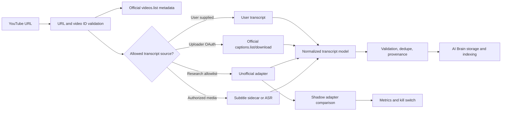

# GitHub YouTube Transcript Repository Landscape for AI Brain

**Version:** 1.0
**Research snapshot:** 2026-07-22
**Target:** AI Brain `phase2` (Node.js 22, Next.js 16)
**Scope:** Open-source GitHub projects that can retrieve, normalize, serve, or generate transcript data for public YouTube videos, plus representative authorized-media ASR fallbacks.

## Executive verdict

There is no open-source repository that creates an officially supported, production-safe API for arbitrary public YouTube captions. Every library that succeeds without the uploader's OAuth authorization ultimately depends on undocumented YouTube web or InnerTube behavior. That remains true whether the implementation is a Node package, Python package, MCP server, `yt-dlp` wrapper, or browser automation.

For a **controlled research spike**, the best AI Brain stack is:

1. **Primary Node adapter:** [`ericmmartin/youtube-transcript-plus`](https://github.com/ericmmartin/youtube-transcript-plus)
2. **Independent Node shadow adapter:** [`devhims/youtube-caption-extractor`](https://github.com/devhims/youtube-caption-extractor)
3. **Cross-language oracle:** [`jdepoix/youtube-transcript-api`](https://github.com/jdepoix/youtube-transcript-api), isolated as a Python test or sidecar dependency
4. **Discovery and authorized subtitle/media sidecar:** [`yt-dlp/yt-dlp`](https://github.com/yt-dlp/yt-dlp)

`youtube-transcript-plus` is the strongest in-process fit because it exposes track inventory and provenance, typed failures, retries, cancellation, caching hooks, custom transports, and transcript formatting while supporting AI Brain's Node 22 runtime. It passed both captioned live fixtures. Its normalized text hash differed from the mature Python implementation despite matching segment counts, so a golden-corpus normalization gate is mandatory before integration.

For **production**, the recommended source hierarchy is narrower:

1. YouTube Data API `videos.list` for public metadata.
2. Transcript text supplied directly by the user.
3. YouTube Data API caption download using uploader-authorized OAuth and the required edit permission.
4. Speech-to-text only for media the user owns or is authorized to process.

An always-logged-in headless browser on Hetzner is **not recommended**. It creates a high-value credential store, fragile session lifecycle, account-challenge and CAPTCHA operations, and an unclear separation between a user's interactive authorization and unattended server extraction. If browser-assisted capture is researched, use a local, visible, user-directed browser extension or userscript, with explicit capture per video and no credential export to AI Brain.

## Direct-library ranking

Scores are directional, not scientific. They combine live correctness, provenance, failure controls, maintenance, Node 22 integration, language/timestamp support, cloud operability, licensing, and adoption. Production permission is assessed separately because a technically excellent undocumented adapter does not gain an official production contract from its score.

| Rank | Repository | Score | Best use | Live result | Main reservation |
|---:|---|---:|---|---|---|
| 1 | [`ericmmartin/youtube-transcript-plus`](https://github.com/ericmmartin/youtube-transcript-plus) | 85 | AI Brain research primary | Passed ASR and manual fixtures | Text normalization differed from the oracle; unofficial API dependency |
| 2 | [`devhims/youtube-caption-extractor`](https://github.com/devhims/youtube-caption-extractor) | 80 | Lightweight Node shadow adapter | Passed; text hash matched Python oracle | Requested language can silently fall back to the first track; weaker errors/provenance |
| 3 | [`jdepoix/youtube-transcript-api`](https://github.com/jdepoix/youtube-transcript-api) | 82 overall / 70 in-process | Mature oracle or Python service | Passed; exposed manual/ASR provenance | Python boundary; cloud IP blocking and unofficial API dependency |
| 4 | [`Kakulukian/youtube-transcript`](https://github.com/Kakulukian/youtube-transcript) | 65 | Popular minimal Node fallback | Passed; text hash matched oracle | No repository tests/CI found; issue history shows recurring renderer and production failures |
| 5 | [`trldvix/youtube-transcript-api`](https://github.com/trldvix/youtube-transcript-api) | 72 for Java | Java service | Not in Node bakeoff | Cross-runtime integration cost |
| 6 | [`horiagug/youtube-transcript-api-go`](https://github.com/horiagug/youtube-transcript-api-go) | 61 for Go | Small Go service | Not in Node bakeoff | Smaller ecosystem and evidence base |
| 7 | [`algolia/youtube-captions-scraper`](https://github.com/algolia/youtube-captions-scraper) | 30 | Historical reference only | Returned zero segments on both captioned fixtures | Stale and currently ineffective |

**Do not use [`LuanRT/YouTube.js`](https://github.com/LuanRT/YouTube.js) as the transcript engine.** It is valuable for broad YouTube metadata experiments, but its transcript call returned HTTP 400 on both captioned fixtures, consistent with an open upstream issue.

## Winners by role

| Role | Best candidate | Why it leads | Integration posture |
|---|---|---|---|
| In-process Node research adapter | [`youtube-transcript-plus`](https://github.com/ericmmartin/youtube-transcript-plus) | Best controls and track provenance in the Node shortlist | Feature-flagged lab use only |
| Lightweight Node shadow | [`youtube-caption-extractor`](https://github.com/devhims/youtube-caption-extractor) | Small API, active maintenance, oracle-matching live output | Compare results; never silently choose a fallback language |
| Mature reference implementation | [`youtube-transcript-api`](https://github.com/jdepoix/youtube-transcript-api) | Largest focused community, broad language/track API, tests | Oracle or isolated Python sidecar |
| Subtitle/media discovery | [`yt-dlp`](https://github.com/yt-dlp/yt-dlp) | Broad extractor maintenance and subtitle sidecar support | Authorized-content fallback, not normalized transcript primary |
| Ready MCP wrapper | [`jkawamoto/mcp-youtube-transcript`](https://github.com/jkawamoto/mcp-youtube-transcript) | Mature focused MCP, pagination, track/language tools, Docker and proxy hooks | Useful interface reference; inherits Python library ceiling |
| Docker MCP/REST research service | [`samson-art/transcriptor-mcp`](https://github.com/samson-art/transcriptor-mcp) | MCP, REST, Redis, metrics, multiple subtitle formats and ASR fallback | Promising spike service; low adoption and authorization controls required |
| Bulk ingestion | [`kaya70875/ytfetcher`](https://github.com/kaya70875/ytfetcher) | Playlists/channels/search, concurrency, caching, retries and transcript support | Dataset/research jobs, not request-path dependency |
| Architecture reference | [`steipete/summarize`](https://github.com/steipete/summarize) | Layered caption, subtitle, local ASR, cloud ASR, cache and formatting design | Study patterns; Node 24 and much broader than AI Brain needs |
| Full product reference | [`lifesized/youtube-transcriber`](https://github.com/lifesized/youtube-transcriber) | Queue, dedupe, extension, MCP, exports and local/cloud model paths | AGPL and early-stage; reference rather than embedded code |
| Authorized local ASR | [`ggml-org/whisper.cpp`](https://github.com/ggml-org/whisper.cpp) | Portable local runtime with a broad deployment ecosystem | Only for owned/authorized media |

## What "all repositories" means

A literal GitHub name/description search produces thousands of results, mostly thin transcript summarizers, tutorials, copied snippets, forks without meaningful divergence, and generic RAG frontends. Treating every hit as a distinct extraction option would inflate the list while reducing decision quality.

The discovery universe at the snapshot was:

| GitHub search | Result count |
|---|---:|
| `topic:youtube-transcript` | 171 |
| `youtube-transcript in:name` | 3,917 |
| `"youtube transcript" in:description` | 1,834 |
| `topic:youtube-captions` | 30 |
| `topic:youtube-subtitles` | 33 |

This review includes materially distinct reusable libraries, services, CLIs, MCP servers, browser products, bulk pipelines, and representative ASR fallbacks. It excludes thin tutorial/summarizer clones, undiverged forks, generic chat frontends, and most generic ASR repositories. The normalized companion inventory contains the reviewed projects and the reason each matters:

- [`2026-07-22_10-32-45_IST_github_youtube_transcript_repository_inventory.csv`](./2026-07-22_10-32-45_IST_github_youtube_transcript_repository_inventory.csv)

Repository stars, package downloads, issue state, and activity are mutable snapshot signals, not quality guarantees.

## Evaluation rubric

| Dimension | Weight | What was evaluated |
|---|---:|---|
| Live correctness and provenance | 25 | Captioned fixture success, segment count, track inventory, manual versus ASR identity |
| Failure controls | 15 | Typed errors, timeout/cancellation, retries, bounded response handling, custom transport |
| Maintenance and tests | 15 | Recent pushes/releases, tests, CI, issue responsiveness |
| AI Brain Node 22 fit | 15 | In-process TypeScript/JavaScript support and dependency footprint |
| Language, timestamps, metadata | 10 | Explicit language selection, generated/manual identity, timing and metadata surface |
| Cloud operability | 10 | Deterministic failures, observability hooks, cache/proxy/cookie implications |
| License clarity | 5 | Recognized permissive license versus reciprocal, noncommercial, or absent license |
| Adoption | 5 | Stars and package downloads as weak supporting signals |

Two modifiers are intentionally outside the score:

- **Platform-policy posture:** documented API, undocumented API, browser page extraction, or authorized media processing.
- **Role:** a great bulk tool or architecture reference is not automatically a good request-path library.

## Live adapter bakeoff

The adapters were rerun from a clean temporary Node/Python workspace on 2026-07-22. No transcript text was retained; only outcome, segment count, duration, provenance, and a truncated normalized-text hash were recorded.

**Environment:** Node 22.22.3, npm 10.9.8, Python 3.9.6
**Packages:** `youtube-caption-extractor@1.10.2`, `youtube-transcript@1.3.1`, `youtube-transcript-plus@2.0.0`, `youtube-captions-scraper@2.0.3`, `youtubei.js@17.2.0`, `youtube-transcript-api==1.2.4`

| Adapter | ASR-only fixture | Manual-caption fixture | No-caption fixture | Malformed ID |
|---|---|---|---|---|
| `youtube-transcript-plus` | 1,704 segments; success; `en:asr` | 286; success; `en:manual` plus 31-track inventory | Typed disabled error | Typed invalid-ID error |
| `youtube-caption-extractor` | 1,704; success; oracle hash | 286; success; oracle hash | Empty result after 5.3 s | Generic error |
| `youtube-transcript-api` | 1,704; success; `en:asr`; oracle hash | 286; success; `en:manual`; 31-track inventory | `TranscriptsDisabled` | `VideoUnavailable` |
| `youtube-transcript` | 1,704; success; oracle hash | 286; success; oracle hash | Typed disabled error | Package error |
| `youtube-captions-scraper` | Zero segments | Zero segments | Generic error | Generic error |
| `youtubei.js` | HTTP 400 | HTTP 400 | Transcript panel not found | `InnertubeError` |

Detailed machine-readable observations are in:

- [`2026-07-22_10-32-45_IST_youtube_transcript_live_adapter_bakeoff.csv`](./2026-07-22_10-32-45_IST_youtube_transcript_live_adapter_bakeoff.csv)

### Important interpretation limits

- This is a smoke test, not a reliability benchmark. It contains two captioned videos, one no-caption video, and one malformed ID.
- Equal segment counts do not imply equal text. `youtube-transcript-plus` produced a different normalized hash from the other successful adapters on both captioned fixtures. That may reflect entity decoding, whitespace, or text normalization, but it must be understood before production data migration.
- A live pass from one residential network does not predict Hetzner data-center behavior. Cloud IP reputation and YouTube changes can dominate library behavior.
- No cookie, proxy, login, CAPTCHA bypass, or anti-bot workaround was used.

## Direct library details

### 1. youtube-transcript-plus

**Why it fits:** focused TypeScript implementation; Node 20+; track inventory; generated/manual identity; typed error classes; retry controls; `AbortController`; caching and custom transport hooks; text/JSON/SRT/VTT formatting. At the snapshot it had about 150 stars, 25 forks, no open issues, package version 2.0.0, and recent 2026 activity.

**Risks:** it still relies on undocumented YouTube behavior. Its normalized text differed from the Python oracle in the live run. GitHub did not detect a license even though the package declares MIT, so retain the package/repository license evidence during dependency approval.

**Verdict:** primary lab adapter, gated by normalization tests and a kill switch.

### 2. youtube-caption-extractor

**Why it fits:** small TypeScript API, Node 18+, active releases, test/CI evidence, and successful live output matching the Python oracle. At the snapshot it had about 156 stars and package version 1.10.2.

**Risks:** its language-selection behavior may return the first available track when the requested language is unavailable. That is unacceptable unless AI Brain validates the returned track identity. Error taxonomy and operational controls are weaker than `youtube-transcript-plus`. An open issue records a nightly production-canary failure.

**Verdict:** independent shadow adapter, not an unchecked language fallback.

### 3. youtube-transcript-api

**Why it fits:** the most mature focused implementation, with about 7,948 stars, extensive language/translation/track controls, tests, typed failures, and a large user base. It correctly exposed manual versus ASR identity in the live run.

**Risks:** Python introduces a deployment boundary in AI Brain. Its documentation and issue tracker acknowledge cloud blocking, cookies/proxies, PoToken requirements, and rate limits. Open issues include ineffective retry behavior after HTTP 429 and empty-body PoToken failures.

**Verdict:** strongest behavior oracle and Python-side option; not automatically more operable from Hetzner.

### 4. youtube-transcript

**Why it fits:** very high npm adoption (about 608,811 downloads in the measured month) and a simple Node interface. It passed both captioned fixtures with text matching the oracle.

**Risks:** no repository tests or CI were found. Open issues cover Shorts, missing renderers, empty results, server/VPN failures, and language handling. Popularity is not a substitute for production controls.

**Verdict:** useful comparison implementation, behind the top two Node choices.

### 5. youtube-captions-scraper

The Algolia package remains widely downloaded but was stale at the snapshot and returned zero segments for both captioned fixtures. Its open issue tracker includes an "always empty" report. It should be rejected for new integration.

### 6. YouTube.js

YouTube.js is a substantial general InnerTube client with broad metadata capabilities, but transcript retrieval failed with HTTP 400 in this run and has a matching open issue. Do not pull a large general client into AI Brain solely for captions.

### Upstream failure evidence

Open issues are not proof that every user will fail, but they expose the same failure classes AI Brain must be designed to detect:

| Repository | Evidence observed at snapshot | Design implication |
|---|---|---|
| `youtube-transcript-api` | [#612](https://github.com/jdepoix/youtube-transcript-api/issues/612) reports retrying HTTP 429 without an effective IP change; [#592](https://github.com/jdepoix/youtube-transcript-api/issues/592) reports an empty PoToken-required response | Classify blocks separately from transient retries; do not create retry storms or add bypass machinery |
| `youtube-caption-extractor` | [#19](https://github.com/devhims/youtube-caption-extractor/issues/19) records a nightly production API canary failure | Operate a canary and kill switch; a healthy package release does not imply a healthy upstream path |
| `youtube-captions-scraper` | [#32](https://github.com/algolia/youtube-captions-scraper/issues/32) reports consistently empty results | Treat an empty result on a known-captioned fixture as failure, not success |
| `YouTube.js` | [#1102](https://github.com/LuanRT/YouTube.js/issues/1102) reports `get_transcript` HTTP 400 | Broad library health does not establish health of its transcript endpoint |
| `youtube-transcript` | [#53](https://github.com/Kakulukian/youtube-transcript/issues/53), [#49](https://github.com/Kakulukian/youtube-transcript/issues/49), [#45](https://github.com/Kakulukian/youtube-transcript/issues/45), [#43](https://github.com/Kakulukian/youtube-transcript/issues/43), [#42](https://github.com/Kakulukian/youtube-transcript/issues/42), and [#38](https://github.com/Kakulukian/youtube-transcript/issues/38) cover Shorts, missing renderers, empty results, and server/VPN failures | Include video-form and deployment-network cases in the golden corpus |

## Service, MCP, and pipeline landscape

### Focused MCP servers

- [`jkawamoto/mcp-youtube-transcript`](https://github.com/jkawamoto/mcp-youtube-transcript): best mature focused MCP; Python, Docker, transcript/timed transcript/video/language tools, pagination, and proxy support.
- [`sinco-lab/mcp-youtube-transcript`](https://github.com/sinco-lab/mcp-youtube-transcript): focused TypeScript MCP with timestamps, metadata, language selection, and diagnostics; still a custom undocumented caption path.
- [`samson-art/transcriptor-mcp`](https://github.com/samson-art/transcriptor-mcp): broader service with stdio MCP, optional REST, `yt-dlp`, Redis, Prometheus, cookies, subtitle files, multiple platforms, and Whisper fallback.
- [`kimtaeyoon83/mcp-server-youtube-transcript`](https://github.com/kimtaeyoon83/mcp-server-youtube-transcript): popular TypeScript MCP, but its source explicitly describes a hard-coded client and hand-encoded protobuf as a way to bypass PoToken enforcement. That is a high maintenance and policy signal; use only as a protocol research reference.
- [`mybuddymichael/youtube-transcript-mcp`](https://github.com/mybuddymichael/youtube-transcript-mcp), [`ergut/youtube-transcript-mcp`](https://github.com/ergut/youtube-transcript-mcp), [`cottongeeks/ytt-mcp`](https://github.com/cottongeeks/ytt-mcp), and [`adhikasp/mcp-youtube`](https://github.com/adhikasp/mcp-youtube): viable smaller wrappers, but no evidence justifies preferring them over the leaders.
- [`pauling-ai/youtube-mcp-server`](https://github.com/pauling-ai/youtube-mcp-server): useful when official Data/Analytics/Reporting OAuth operations are also needed; broader than transcript capture.

MCP changes the interface, not the underlying extraction contract. A wrapper around an unofficial library inherits the same breakage, cloud-blocking, and policy ceiling.

### Bulk and product pipelines

- [`kaya70875/ytfetcher`](https://github.com/kaya70875/ytfetcher): strongest focused bulk option for channels, playlists, search, transcripts, comments, concurrency and caching.
- [`steipete/summarize`](https://github.com/steipete/summarize): strongest architecture reference, with layered web captions, `yt-dlp`, direct media, local and cloud ASR, caching, timestamps, diarization and slide extraction. Its Node 24 runtime and broad product scope make it a reference rather than a dependency.
- [`lifesized/youtube-transcriber`](https://github.com/lifesized/youtube-transcriber): strongest full product reference, including queues, dedupe, browser extension, MCP, SQLite and exports. AGPL obligations matter.
- [`zlxlabs/VideoTranscriptAPI`](https://github.com/zlxlabs/VideoTranscriptAPI): unusually extensive tests and a broad FastAPI fallback pipeline, but its PolyForm Noncommercial license is unsuitable for normal commercial integration.
- [`0xchamin/mcptube`](https://github.com/0xchamin/mcptube): ambitious knowledge and vision MCP built around `yt-dlp` and LLMs; alpha status and breadth make it a reference.
- [`youtube-transcripts-machine`](https://github.com/zaidmukaddam/youtube-transcripts-machine): browser-agent extraction using Stagehand/BrowserBase and paid model keys. It adds cost, nondeterminism, page-layout fragility, and policy risk without improving the source contract.

### General YouTube extractors

- [`yt-dlp`](https://github.com/yt-dlp/yt-dlp): the clear operational leader for broad extraction and subtitle sidecars; use only where media/subtitle retrieval is authorized.
- [`YoutubeExplode`](https://github.com/Tyrrrz/YoutubeExplode): best-established .NET alternative with caption manifest and output support.
- [`NewPipeExtractor`](https://github.com/TeamNewPipe/NewPipeExtractor), [`Invidious`](https://github.com/iv-org/invidious), and [`Piped-Backend`](https://github.com/TeamPiped/Piped-Backend): substantial extraction/server projects, but their GPL/AGPL licenses, scope, and operational footprint make them poor embedded transcript libraries.
- [`pytube`](https://github.com/pytube/pytube), [`youtube-dl`](https://github.com/ytdl-org/youtube-dl), [`kkdai/youtube`](https://github.com/kkdai/youtube), and the `ytdl-core` family: useful historical or ecosystem alternatives, but not better normalized-caption choices for AI Brain.

## AI Brain fit

AI Brain currently reads YouTube's undocumented player response directly, chooses `tracks[0]`, fetches timed-text XML, and stores up to 2 MB of raw XML. That has four important weaknesses:

1. The chosen language and manual/ASR identity are not explicit.
2. The transcript payload remains source-specific XML rather than a normalized internal model.
3. Failure causes are not sufficiently typed for retries, user messaging, or observability.
4. Duplicate saves only upgrade `metadata_only` to `user_provided_full_text`; they do not express source/provenance or a refreshed transcript version.

Relevant implementation surfaces:

- [`src/lib/capture/youtube.ts`](../../../src/lib/capture/youtube.ts)
- [`src/app/api/capture/url/route.ts`](../../../src/app/api/capture/url/route.ts)
- [`src/lib/telegram/dispatch.ts`](../../../src/lib/telegram/dispatch.ts)

The repository choice should be hidden behind an internal adapter so source changes do not alter AI Brain's stored contract.

### Recommended normalized contract

At minimum, store:

- `video_id`, canonical URL, title/channel metadata, and metadata retrieval source.
- Transcript `segments[]` with normalized text, start time, duration, and stable ordering.
- Requested language and actual returned language.
- Track kind: `manual`, `asr`, `translated`, `user_provided`, or `generated_from_authorized_media`.
- Adapter name/version and retrieval timestamp.
- Content hash after a documented normalization algorithm.
- Source-policy class and evidence of user authorization where required.
- Failure class without storing credentials, cookies, or raw challenge responses.

## Hetzner and browser-session analysis

### Why a persistent logged-in browser is the wrong default

- A Google/YouTube session cookie is effectively a credential and expands the impact of a server compromise.
- Session refresh, MFA, suspicious-login challenges, consent pages, regional variants, and CAPTCHA produce an ongoing manual operations burden.
- A browser page can change independently of a transcript library or API contract.
- A login does not itself establish permission to download or retain every public video's transcript.
- Centralizing a personal account on a data-center IP can affect account safety and makes rate behavior hard to distinguish from extraction failure.
- YouTube's API Services policies prohibit collecting/storing user login credentials and prohibit undocumented API use without permission; production counsel/platform review is still required for the exact design.

### Safer browser-assisted research posture

If browser-assisted capture remains useful for research, keep it local and user-directed:

1. Run a visible extension/userscript in the user's existing browser profile.
2. Require an explicit action on each video or transcript panel.
3. Extract only transcript text already visible to that authenticated user.
4. Send a normalized transcript to AI Brain over a short-lived authenticated request.
5. Never export Google credentials, cookies, local storage, or the browser profile.
6. Show the source language and whether the track is manual or generated before upload.
7. Apply the same authorization, retention, copyright, and deletion rules as every other source.

Representative local-browser references are listed in the companion inventory. They are user-assistance patterns, not backend extraction engines.

## Platform, legal, and license posture

The user has approval to run a research spike. That permits the research activity described by the approval; it does not by itself establish YouTube production permission, rights to every video's content, or permission to persist a personal login on Hetzner.

Primary platform references:

- [YouTube API Services Developer Policies](https://developers.google.com/youtube/terms/developer-policies): documented API clients may not use undocumented APIs without express permission, reverse engineer services, collect/store user login credentials, or download/cache/store audiovisual content without the required approval.
- [`captions.list`](https://developers.google.com/youtube/v3/docs/captions/list): requires authorization and returns caption-track metadata, not caption text.
- [`captions.download`](https://developers.google.com/youtube/v3/docs/captions/download): requires authorization and permission to edit the video.
- [`videos.list`](https://developers.google.com/youtube/v3/docs/videos/list): the supported path for public video metadata.

These findings are a technical and policy-screening assessment, not legal advice. Before production, obtain a written decision covering the intended source, copyright/retention, user authorization, geographic processing, and whether the exact extraction method has platform permission.

License cautions:

- AGPL projects such as Invidious, Piped, `pullmd`, and `lifesized/youtube-transcriber` may impose source-sharing obligations when modified and offered over a network.
- GPL projects such as NewPipeExtractor and `langchain_yt_tools` require compatibility review before embedding or distribution.
- PolyForm Noncommercial projects such as `VideoTranscriptAPI` are not normal commercial dependencies.
- Repositories with no detected license grant no default right to copy, modify, or redistribute code.
- Package metadata and repository license detection sometimes disagree; dependency approval should retain the actual license file/package evidence.

## Controlled spike plan

### Phase 1: contract and corpus

1. Define the normalized transcript and typed-failure contracts before replacing the current extractor.
2. Build an allowlisted golden corpus covering manual captions, ASR-only, multiple English tracks, translated tracks, disabled captions, unavailable/private/age-restricted videos, Shorts, live/premiere videos, entities, multiline text, music markers, long videos, and malformed IDs.
3. Store only fixture identifiers and expected metrics/hashes where transcript retention is not authorized.

### Phase 2: adapters

1. Implement `youtube-transcript-plus` behind a disabled-by-default feature flag.
2. Implement `youtube-caption-extractor` as a shadow adapter; never use its implicit first-track fallback without validating actual language.
3. Run `youtube-transcript-api` in CI or a disposable sidecar as the independent oracle.
4. Keep `yt-dlp` outside the normal request path and enable it only for an explicitly authorized subtitle/media workflow.

### Phase 3: operations

1. Enforce per-request timeout, maximum transcript bytes/segments, concurrency limits, and retry budgets.
2. Add circuit breaking and a global kill switch.
3. Record success/failure class, latency, selected track identity, adapter version, normalization hash, and source-policy class.
4. Do not log transcript text, signed caption URLs, cookies, tokens, page HTML, or challenge bodies.
5. Do not add proxy rotation, cookie pools, CAPTCHA solving, PoToken bypasses, or hidden browser profiles.

### Acceptance gates

- The requested language and returned track identity must be explicit and testable.
- No manual-caption fixture may be used as evidence for an ASR-only requirement; fixture identity must be inventoried immediately before the run.
- Primary and oracle normalized text must match, or every difference must be understood and accepted in a versioned normalization specification.
- Typed failures must distinguish invalid URL, unavailable video, captions disabled, requested track absent, timeout, rate limit/block, parse drift, and oversized response.
- A 24-72 hour allowlisted canary must remain within defined success, latency, mismatch, and block-rate thresholds from the intended deployment network.
- No Google login credential or browser session may be present on Hetzner.
- Production remains blocked until the platform/legal source decision is recorded.

## Prior AI Brain spike evidence

This landscape extends, rather than replaces, the existing AI Brain spike work:

- `S04_report_v2_2026-06-17_10-32-24_IST.md` - library capability benchmark from the local spike workspace
- `S05_report_v2_2026-06-17_10-32-24_IST.md` - robustness and failure taxonomy from the local spike workspace
- `S06_report_v2_2026-06-17_10-32-24_IST.md` - cross-idea adapter bakeoff from the local spike workspace

## Final decision

Proceed with a **feature-flagged research adapter using `youtube-transcript-plus`, shadowed by `youtube-caption-extractor`, and checked against `youtube-transcript-api`**. Preserve `yt-dlp` as a separate authorized-content sidecar. Do not deploy a persistent logged-in browser or personal YouTube session to Hetzner.

Treat this stack as a controlled experiment, not a production source contract. The durable production feature should prioritize user-provided text, uploader-authorized official captions, and authorized-media ASR, with the normalized internal model allowing AI Brain to change providers without changing stored data.

## Snapshot limitations

- GitHub and npm metrics were observed on 2026-07-22 and will change.
- Search results are not a stable registry; repository discovery cannot mathematically prove completeness.
- Only materially distinct projects were retained; omitted clones and generic summarizers do not represent independent extraction mechanisms.
- Live results came from one network and four fixtures. They do not establish global reliability or Hetzner operability.
- No authenticated, proxy, cookie, CAPTCHA, or bypass flow was tested.
- Repository behavior and YouTube internals may change without notice.
