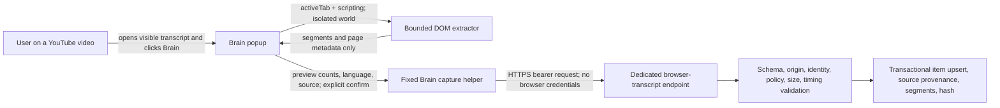

# AI Brain Chrome Companion for YouTube Transcripts - GitHub Landscape and Architecture Recommendation

**Version:** 1.0
**Created:** 2026-07-22 11:05:48 IST
**Research snapshot:** 2026-07-22
**Target:** Existing AI Brain Manifest V3 extension under `phase2/extension/`
**Decision scope:** Reusable GitHub repositories, controlled technical feasibility, least-privilege extension design, AI Brain handoff, licensing, security, privacy, platform-policy posture, and implementation gates
**Production status:** No-go pending a new platform/legal/security review and a revised product plan

## Executive Verdict

Do **not** fork a transcript extension and do **not** build a second AI Brain extension. Extend the existing Brain extension with a small, explicit-click, DOM-first YouTube capture path.

The recommended implementation is a selective synthesis:

1. Reimplement the action-injected, visible-transcript DOM approach demonstrated by [`searchpcc/tube2md`](https://github.com/searchpcc/tube2md).
2. Add current dual-renderer and virtualized-panel ideas from [`yniijia/subtidex`](https://github.com/yniijia/subtidex).
3. Borrow typed transcript and provenance concepts, but not session-bound timedtext/PoToken retrieval, from [`BitYoungjae/just-copy-subtitles-for-youtube`](https://github.com/BitYoungjae/just-copy-subtitles-for-youtube).
4. Borrow local MV3 fixture testing from [`ANcpLua/yt-transcript`](https://github.com/ANcpLua/yt-transcript) and error/health modeling from [`labib2002/Briefly`](https://github.com/labib2002/Briefly).
5. Use the existing Brain bearer-token and fixed HTTPS service boundary. The YouTube page must never receive the Brain token, and the Brain service must never receive browser cookies, a Chrome profile, signed caption URLs, local storage, or session state.

This design is technically feasible. The controlled repositories passed meaningful parser, build, and local browser-fixture checks. It is also materially safer than a persistent logged-in browser on Hetzner because the user's Chrome session remains local and the extension only sees the active tab after an explicit gesture.

However, this is **not a production approval**. YouTube's current Terms prohibit automated access such as scraping without prior written permission, while Chrome treats scraped page content as user data even when processed locally. The repository's current product plan also expressly blocks browser-mediated public transcript extraction in production. The user's stated research approval authorizes this research task, but a stored approval note/ID and reviewed target manifest are still required by AI Brain's own controls before a live retained-content spike. [YouTube Terms](https://www.youtube.com/static?template=terms), [Chrome user-data policy](https://developer.chrome.com/docs/webstore/program-policies/user-data-faq)

### Decision in one screen

| Question | Decision |
|---|---|
| Create a new extension? | No. Extend `phase2/extension/`. |
| Fork one repository wholesale? | No. Reimplement a narrow MIT-compatible DOM core and preserve notices for copied code. |
| Default extraction source? | The transcript currently rendered in YouTube's visible transcript panel. |
| Use the user's Chrome session? | Only implicitly, through the page already rendered to that user. Never read or export credentials. |
| New permission? | Add `scripting`; keep `activeTab`. No YouTube host permission is needed for an action-only first version. |
| Persistent YouTube content script? | No. Inject only after the user invokes Brain. |
| Read player response or timedtext? | Not in the default path. Lab-only fallback after separate review. |
| Auto-open or navigate hidden tabs? | No in v0.1. Require an already-visible transcript panel; consider same-tab auto-open only after fixture coverage and review. |
| Upload route? | A dedicated, fixed-origin, idempotent browser-transcript endpoint with strict schema and policy enforcement. |
| Production public-video use? | No-go under the current plan and policy record. |
| Controlled research use? | Conditional go after target manifest, approval artifact, owned/authorized fixture, retention setting, and cleanup plan. |

## Important Staleness Correction

The file originally cited in the conversation, `2026-06-23_23-01-30_IST_ai_brain_youtube_transcript_final_implementation_plan_v2.md`, begins with a **superseded / do not execute** banner. It must not be used as the current product plan.

The current recommendation was reconciled against these local planning sources at the research snapshot:

- `2026-06-23_23-08-51_IST_ai_brain_youtube_transcript_final_implementation_plan_v3_no_openai_v2.md`
- `AI_BRAIN_YOUTUBE_TRANSCRIPT_CAPABILITY_PROJECT_TRACKER.md`

Those artifacts make browser/headless extraction research-only, prohibit production browser-session extraction, prohibit exporting browser state, and require a new review cycle before productization. This report preserves those gates.

For videos the user owns or is authorized to edit, the documented YouTube captions API remains the preferable production source. `captions.list` requires OAuth authorization, and `captions.download` requires permission to edit the video. A browser companion does not replace that route. [YouTube `captions.list`](https://developers.google.com/youtube/v3/docs/captions/list), [YouTube `captions.download`](https://developers.google.com/youtube/v3/docs/captions/download)

## What Was Researched

### Discovery universe

GitHub searches were rerun on 2026-07-22:

| Search | Results |
|---|---:|
| `"youtube transcript" "chrome extension" in:name,description,readme` | 1,875 |
| `"youtube captions" "chrome extension" in:name,description,readme` | 347 |
| `"youtube transcript" userscript in:name,description,readme` | 47 |
| `topic:youtube-transcript topic:chrome-extension` | 9 |
| `youtube-transcript in:name topic:chrome-extension` | 11 |
| `youtube transcript in:description topic:chrome-extension` | 52 |
| `youtube transcript in:description topic:browser-extension` | 13 |

A literal list of every hit would mostly contain tutorial clones, summarizer frontends, abandoned Manifest V2 snippets, undiverged forks, and repositories whose only transcript feature is an upstream package call. Here, **all** means the materially distinct and reusable approaches relevant to an AI Brain companion: focused extensions, userscripts, side-panel products, local-service companions, external-service clippers, subtitle tools, and representative historical implementations.

The normalized inventory contains 50 projects:

- [`2026-07-22_11-05-48_IST_github_youtube_transcript_chrome_companion_inventory.csv`](./2026-07-22_11-05-48_IST_github_youtube_transcript_chrome_companion_inventory.csv)

Eighteen leading repositories were cloned and source-inspected. Eight representative snapshots were exercised with install, test, build, lint/typecheck, local MV3 fixture, or dependency-audit checks where their toolchains allowed it.

### Deliberate validation boundary

No personal Chrome profile, Google login, YouTube cookies, authentication headers, signed caption URLs, CAPTCHA flow, proxy, or bypass method was used. No automated live YouTube page test was run in this phase because the current repository plan requires a reviewed live-run manifest and YouTube's Terms separately constrain automated access. Validation used repository fixtures, synthetic DOM, and local extension pages.

## Existing AI Brain Fit

AI Brain already has the companion shell. The current extension is Manifest V3 and already provides:

- a toolbar popup and options page;
- an MV3 service worker;
- `activeTab`, `tabs`, `contextMenus`, `storage`, and `notifications` permissions;
- a single remote host permission for `https://brain.arunp.in/*`;
- a bearer token stored in `chrome.storage.local`;
- a typed HTTPS capture helper fixed to the Brain origin;
- a short session-scoped duplicate-submit lock.

Relevant files:

- [`extension/manifest.json`](../../../extension/manifest.json)
- [`extension/src/capture.ts`](../../../extension/src/capture.ts)
- [`extension/src/popup.ts`](../../../extension/src/popup.ts)

The smallest permission delta is therefore:

```json
{
  "permissions": [
    "activeTab",
    "scripting"
  ]
}
```

The current permissions remain for existing Brain features; only `scripting` is new. Chrome documents that `activeTab` grants temporary access after an explicit user gesture and can authorize `chrome.scripting.executeScript()` without persistent all-site access. [Chrome activeTab](https://developer.chrome.com/docs/extensions/develop/concepts/activeTab), [Chrome scripting API](https://developer.chrome.com/docs/extensions/reference/api/scripting)

### Existing server foundations

AI Brain already stores transcript policy decisions, source provenance, caption class, timestamp mode, text hash, and timestamped segments. Existing limits provide sensible defaults for browser capture:

- maximum normalized text: 500,000 characters;
- maximum payload/file equivalent: 2 MiB;
- maximum segments: 7,200.

The existing `/api/capture/transcript` route is not a correct endpoint for the companion as-is. Its JSON path labels text as `user_paste`, and its file path labels content as `uploaded_file`. Browser-extracted YouTube captions are neither. Mislabeling them would erase acquisition provenance and bypass the intended policy distinction.

Relevant files:

- [`src/app/api/capture/transcript/route.ts`](../../../src/app/api/capture/transcript/route.ts)
- [`src/lib/capture/transcripts/user-provided.ts`](../../../src/lib/capture/transcripts/user-provided.ts)
- [`src/lib/capture/policy.ts`](../../../src/lib/capture/policy.ts)
- [`src/db/transcripts.ts`](../../../src/db/transcripts.ts)

## Extraction Approaches Compared

| Approach | Session benefit | Robustness | Permission/privacy surface | Platform posture | Decision |
|---|---|---:|---:|---:|---|
| Visible transcript-panel DOM | Uses exactly what the signed-in user can already see; no credential access | Medium; selectors and virtualization need care | Lowest | Still automated page extraction | Default research path |
| Player response plus caption URL | Exposes track language and ASR/manual hints | High until YouTube internals change | Medium; MAIN world and signed/session URLs | Undocumented and policy-sensitive | Lab reference only |
| Fetch/XHR interception | Observes YouTube's own transcript responses | High when installed before requests | High; always-on page/network observation | Undocumented and sensitive | Reject as default |
| Background InnerTube client | Can work without visible panel | Medium; client changes and token enforcement | High; more hosts and request logic | Explicitly undocumented | Reject |
| Hidden tab or batch navigation | Can process queues | Medium | High; invisible browsing and activity collection | Poor fit with explicit user action | Reject |
| Browser audio capture plus ASR | Independent of captions | Low-to-medium; expensive and slow | Very high; tabCapture/offscreen/audio retention | Separate owned-media authorization | Reject for this feature |
| Persistent logged-in browser on Hetzner | Central automation | Fragile | Extreme credential concentration | Existing plan says research-only | Reject |

### Why DOM-first wins

DOM-first is not magically official, but it keeps the technical boundary narrow:

- It reads only the transcript panel the user has chosen to display.
- It needs no cookie API, browser profile, credential export, or caption URL replay.
- It can run in Chrome's default isolated world; it does not need access to page JavaScript variables. Chrome documents that isolated content-script worlds share the DOM but not page JavaScript state. [Chrome content scripts](https://developer.chrome.com/docs/extensions/develop/concepts/content-scripts)
- It can return a structured result directly from `executeScript()` to the extension popup. No page-accessible message bus is needed.
- `activeTab` naturally expires when the tab navigates away or closes.

The cost is that YouTube's transcript panel is a changing, localized, sometimes virtualized UI. The extractor must fail closed when it cannot prove completeness.

## Ranked Repository Findings

Scores are directional and specific to **building into the current Brain extension**. The rubric is: least privilege and explicit-user-action fit (20), current extraction robustness (20), tests and reproducibility (20), fit with the existing Brain extension/service boundary (15), maintenance (10), license clarity (10), and dependency/scope footprint (5). They do not imply production permission.

| Rank | Repository | Fit score | Best contribution | Main reason not to fork wholesale |
|---:|---|---:|---|---|
| 1 | [`searchpcc/tube2md`](https://github.com/searchpcc/tube2md) | 84 | Minimal action-injected DOM extractor, modern and legacy selectors, multilingual panel logic, parser fixtures | Needs long virtualized-panel and MV3 browser fixtures; some extraction output is product-specific Markdown |
| 2 | [`BitYoungjae/just-copy-subtitles-for-youtube`](https://github.com/BitYoungjae/just-copy-subtitles-for-youtube) | 80 | Small typed core, track identity concepts, 15 passing tests, Chrome/Firefox WXT build | Default retrieval uses undocumented session-bound timedtext and PoToken-aware behavior |
| 3 | [`yniijia/subtidex`](https://github.com/yniijia/subtidex) | 76 | Current dual-renderer scrape, virtualized scrolling, useful failure diagnostics | Source is large and also includes page-context/player/caption fetch fallbacks with no behavioral suite |
| 4 | [`ANcpLua/yt-transcript`](https://github.com/ANcpLua/yt-transcript) | 70 | Strongest MV3 local browser fixture and page/extension bridge testing | Broad permissions, always-on interception, undocumented clients, optional audio/AI scope |
| 5 | [`labib2002/Briefly`](https://github.com/labib2002/Briefly) | 64 | Typed fallback ladder, cache, health events, kill switch, selector diagnostics | No automated tests, 19 dependency findings including 4 critical, hidden queue navigation, broad permissions |
| 6 | [`ryanbiddy/uoink`](https://github.com/ryanbiddy/uoink) | 63 | Closest MIT local companion/service handoff pattern | Multi-site PKM product with a much larger surface than the Brain transcript feature |
| 7 | [`dpolivaev/video-chapters-extension`](https://github.com/dpolivaev/video-chapters-extension) | 61 | Best test architecture: 593 passing tests | GPL-3.0, older selectors, AI-provider scope, 31 dependency findings |
| 8 | [`lifesized/youtube-transcriber`](https://github.com/lifesized/youtube-transcriber) | 58 | Full extension-to-local/self-hosted transcript system | AGPL-3.0, native messaging and cloud/ASR scope, broad permissions |
| 9 | [`krishnakanthb13/yt-transcript-studio`](https://github.com/krishnakanthb13/yt-transcript-studio) | 56 | Current side-panel UX and 21 parser/format tests | GPL-3.0 and a small evidence base |
| 10 | [`jingsu96/linear-web-clipper`](https://github.com/jingsu96/linear-web-clipper) | 53 | Explicit handoff from extension to an external service | `<all_urls>`-style clipping is much broader than Brain needs |

### 1. Tube2MD: preferred code seed

Why it leads:

- MV3 with a small manifest: `scripting`, `activeTab`, and YouTube host access.
- Explicit action rather than always-on observation.
- Supports both `transcript-segment-view-model` and `ytd-transcript-segment-renderer`.
- Tries multiple localized visible-panel opening paths.
- Has focused fixtures for modern/legacy segments, dialogue turns, chapters, and no-cue behavior.
- Passed all six tests and ESLint under Node 22.

What to use:

- the self-contained injected-function shape;
- the dual-renderer selector strategy;
- DOM text normalization and fixture patterns;
- explicit error return when no cues exist.

What to change:

- initially require the panel to be open instead of auto-clicking localized YouTube controls;
- output source-neutral segments, not Markdown;
- add bounded virtual scrolling and completeness proof;
- run in the isolated world unless a demonstrated DOM operation requires otherwise;
- remove downloads/clipboard concerns from the Brain path;
- validate YouTube video identity before and after extraction.

### 2. Just Copy Subtitles: best typed session-aware reference

Why it matters:

- Small WXT monorepo with Chrome and Firefox builds.
- Only 15 focused core tests were needed to cover meaningful parsing and selection logic, and all passed.
- Distinguishes active track, language, caption provenance, and session-bound resources.
- Explicit-click design and compact permission surface.

Why it is not the default:

- Reads `movie_player.getPlayerResponse()` in the MAIN world.
- Fetches `/api/timedtext` with page credentials.
- Handles PoToken-bound resources and primes caption state.

Those techniques are useful to understand why ordinary server fetches fail, but they move the design from visible-page capture into undocumented session request handling. Keep the types and tests; do not make those requests part of v0.1.

### 3. SubtideX: best current DOM-resilience reference

Why it matters:

- Handles modern and legacy segment renderers.
- Contains virtualized transcript-panel scrolling logic.
- Detects token-gated caption URLs and refuses some unsafe/ineffective fallbacks.
- Provides useful extraction diagnostics.

Why it is not the seed:

- The core source is much larger and combines DOM scraping with player response, caption URL, page-context bridge, and background fetch strategies.
- No behavioral test suite was found.

Take the virtual-scroll and completeness ideas, then rebuild them behind focused fixtures.

### 4. ANcpLua and Briefly: architecture laboratories

Both repositories prove that sophisticated session-aware transcript extensions are possible.

ANcpLua's local Playwright fixture is especially valuable: after the pinned Chromium runtime was installed, all four MV3 tests passed, including service-worker registration, popup loading, content-script scope, and transcript population through a local YouTube-shaped fixture.

Briefly has the clearest resilience model: passive interception, active-tab caption fetch, DOM panel, background fallback, queue fallback, typed failures, health events, selector overrides, and a kill switch.

Their feature breadth is also the warning. AI Brain does not need continuous request interception, alternate InnerTube clients, hidden queue tabs, remote selector controls, tab audio capture, or AI-provider host access to support one explicit transcript capture.

## Empirical Validation

**Environment:** Node 22.22.3, npm 10.9.8, Bun 1.3.14, macOS arm64
**Validation type:** Clean temporary clones, repository fixtures, local extension pages, local network fixture, package audit
**Transcript retention:** No live transcript text was collected or retained

| Repository | Commit | Result | Important caveat |
|---|---|---|---|
| `ANcpLua/yt-transcript` | `06dd00df2954` | Lint, build, 3 manifest tests, and 4/4 Playwright MV3/local-fixture tests passed | 4 high dependency findings; broad undocumented flow |
| `BitYoungjae/just-copy-subtitles-for-youtube` | `98adb0046c87` | 15 tests and Chrome MV3 build passed | Session-bound timedtext/PoToken default is out of scope |
| `labib2002/Briefly` | `2ddf8eeb57d0` | TypeScript and WXT build passed | No automated tests; 19 dependency findings, 4 critical |
| `searchpcc/tube2md` | `716654f362ed` | 6 tests and ESLint passed | 3 high dependency findings; no long virtualized fixture |
| `dpolivaev/video-chapters-extension` | `73e6d010ff82` | 34 suites / 593 tests and Chrome build passed | GPL-3.0; 31 dependency findings, 3 critical |
| `yniijia/subtidex` | `8738fa47fdc7` | Package check and ZIP build passed | No behavioral suite found |
| `krishnakanthb13/yt-transcript-studio` | `0ccbfa4112aa` | 21 parser/formatter tests passed | GPL-3.0 |
| `Savecoders/YTranscripts` | `5c17a6e0e3e5` | Not reproducible under current install policy | No npm lock, npm peer conflict, pnpm blocked an ignored dependency build script |

Full observations:

- [`2026-07-22_11-05-48_IST_github_youtube_transcript_chrome_companion_validation_matrix.csv`](./2026-07-22_11-05-48_IST_github_youtube_transcript_chrome_companion_validation_matrix.csv)

Passing builds do not establish permission, long-run YouTube compatibility, or production safety. Audit counts are snapshot signals and may include development-only transitive dependencies, but they still matter when choosing a foundation.

## Recommended Architecture



### Trust boundaries

1. The YouTube page is untrusted input.
2. The injected function may read DOM text, timestamps, accessibility labels, title, channel, and the current canonical video ID.
3. It may not read cookies, local storage, session storage, authentication headers, service-worker caches, signed URLs, or unrelated page history.
4. The extractor returns structured data through `executeScript()`; it does not receive the Brain token.
5. The extension constructs the fixed Brain endpoint. The page may never supply an arbitrary destination URL.
6. The server recomputes hashes, validates every field, and treats all extension metadata as untrusted.

Chrome's extension security guidance specifically warns against allowing a content script or page to choose arbitrary cross-origin URLs for a privileged extension fetch. [Chrome cross-origin requests](https://developer.chrome.com/docs/extensions/develop/concepts/network-requests)

### Proposed v0.1 extension flow

1. User navigates normally to a YouTube watch or Shorts page.
2. User opens YouTube's visible transcript panel and selects the desired language in YouTube.
3. User opens the Brain popup.
4. Brain recognizes a canonical `youtube.com/watch`, `youtube.com/shorts`, or approved mobile form.
5. User chooses `Capture transcript`.
6. The popup injects a bundled extractor with `chrome.scripting.executeScript()` using the temporary `activeTab` grant.
7. The extractor records the video ID, walks the visible transcript panel, scrolls any virtualized container under strict limits, and records cues.
8. The extractor rechecks the video ID. If YouTube SPA navigation changed it, the result is rejected.
9. The popup shows language/track label when available, segment count, character count, timing mode, and whether completeness was proven. It does not render the full transcript by default.
10. A second explicit user action sends the normalized capture to Brain.
11. The server validates policy and stores or idempotently upgrades the item.

Requiring the transcript panel to be visible is intentional in v0.1. It makes the user's choice legible, avoids brittle localized control-click automation, and reduces the chance of capturing a track the user did not intend. Automatic same-tab panel opening can be evaluated later with fixtures; hidden-tab navigation is out of scope.

### Bounded DOM extraction algorithm

1. Accept only an allowlisted YouTube hostname and recognized video route.
2. Capture canonical video ID at start.
3. Find the transcript panel, language/track label, scroll container, and either modern or legacy segment nodes.
4. Normalize each cue with `textContent`; never preserve or execute HTML.
5. Key cues by stable timestamp plus normalized text, not DOM object identity.
6. Scroll only the transcript container, collecting new cues after each render cycle.
7. Stop successfully only after the bottom is reached and the last cue plus scroll height remain stable for multiple checks.
8. Fail with `virtualization_incomplete` after a time, iteration, or segment cap. Do not silently upload a partial transcript.
9. Sort cues by start time and validate nonnegative, monotonic timing. Infer duration from the next cue only when unambiguous; otherwise store `null` and mark timing as `inferred` or `timestamped` accurately.
10. Recheck video ID and return `navigation_changed` if it differs.
11. Return plain structured data to the extension context.

Suggested client limits:

| Limit | Initial value |
|---|---:|
| Total extraction time | 15 seconds |
| Scroll iterations | 150 |
| Segments | 7,200 |
| Normalized characters | 500,000 |
| Serialized request | 2 MiB |
| Consecutive stable-bottom checks | 3 |

### Track identity and the S02 implication

The safe DOM-first path can reliably capture the **currently visible language label and transcript text**, but it may not reliably prove whether a track is manual or ASR. Visible labels are localized and YouTube's stable DOM does not guarantee a structured `kind=asr` field.

Therefore:

- Record `caption_source_class = unknown` unless the extractor has explicit, tested evidence.
- Never infer ASR from transcript style, punctuation, segment density, or lack of uploader attribution.
- Do not silently switch languages; capture the track the user selected.
- A successful DOM transcript capture does **not by itself unblock S02's required `en:asr` identity**.

For S02, the safe choices remain:

1. Use an owned/authorized fixture whose ASR-only state is independently documented and whose visible track is selected during the controlled run.
2. Add a separately reviewed lab-only player-response identity probe that reads track metadata but does not fetch or replay signed caption URLs.
3. Relax the S02 acceptance criterion only through an explicit tracker/plan revision, never by relabeling `unknown` as `asr`.

This is the largest functional tradeoff in choosing the safer DOM-first design.

## Server Contract

Create a dedicated endpoint such as:

```text
POST /api/capture/youtube-browser-transcript
```

Do not overload `/api/capture/transcript` and do not call the legacy server-side YouTube transcript extractor.

Suggested request shape:

```json
{
  "schema_version": 1,
  "request_id": "client-generated idempotency key",
  "extractor_version": "brain-youtube-dom/0.1.0",
  "page_url": "canonical YouTube URL",
  "video_id": "validated video id",
  "title": "visible title",
  "channel": "visible channel when available",
  "language_code": "en",
  "track_label": "visible label when available",
  "caption_source_class": "unknown",
  "timestamp_mode": "timestamped",
  "segments": [
    {
      "idx": 0,
      "start_ms": 0,
      "duration_ms": null,
      "text": "normalized cue text"
    }
  ],
  "captured_at": "ISO-8601 timestamp"
}
```

The request must not contain:

- cookies or cookie-derived values;
- browser profile identifiers;
- local/session storage;
- authorization headers from YouTube;
- signed caption or media URLs;
- raw player responses;
- arbitrary destination URLs;
- HTML;
- a client-selected legal approval ID.

The server should derive policy configuration from trusted server state or a reviewed run manifest, not from the untrusted extension payload.

### Server validation and persistence

1. Reuse bearer authentication, origin checks, API-version checks, rate limits, and fixed HTTPS transport.
2. Canonicalize the URL and verify that URL, route, and `video_id` agree.
3. Enforce 2 MiB, 500,000 characters, 7,200 segments, per-cue text limits, and finite nonnegative timings.
4. Reject duplicate indices, invalid ordering, empty useful text, and video-ID races. Treat cue text only as plain text and escape it on every later HTML-rendering boundary; do not reject legitimate transcript text merely because it contains angle brackets or code.
5. Recompute normalized transcript text and SHA-256 server-side.
6. Use `request_id` plus canonical video ID and content hash for idempotency.
7. Upsert the metadata-only item and transcript source without calling YouTube from the server.
8. Store explicit provenance: `browser_visible_transcript`, extractor version, track label, language, completeness evidence, capture time, normalized hash, and policy decision.
9. Store `caption_source_class = unknown` unless the evidence contract supports manual/ASR.
10. Never log transcript text, individual cues, signed resources, bearer tokens, or private/unlisted video URLs.

The endpoint should return `created`, `upgraded`, `duplicate`, or a typed failure. A network retry with the same `request_id` must not create duplicate sources or requeue duplicate enrichment.

### Policy-model correction required before implementation

The existing policy function can set `production_allowed = true` for `lab_public_caption` when a legal approval ID exists. That conflicts with the current tracker, which says browser-mediated public extraction remains research-only and needs a new review before production.

Before wiring the companion, revise the policy contract so that:

- `lab_public_caption` is always non-production regardless of a lab approval ID;
- the approval ID authorizes the named lab run, fixture, retention class, and expiry only;
- any future production browser method requires a new acquisition enum, migration, plan, legal/platform decision, and adversarial review;
- browser-visible capture is never mislabeled as `user_paste`.

This is a plan input, not an authorization to edit production code in this research task.

## Error Taxonomy

| Code | Retry? | User meaning | Storage behavior |
|---|---|---|---|
| `not_youtube_video` | No | Current tab is not a supported YouTube video page | Nothing stored |
| `panel_not_open` | Yes | No visible transcript panel is available | Nothing stored |
| `transcript_unavailable` | No | YouTube exposes no transcript for the selected video/session | Metadata-only may remain |
| `unsupported_dom` | Yes after extension update | YouTube layout is not recognized | Nothing stored; health counter only |
| `virtualization_incomplete` | Yes | Full transcript could not be proven | No partial transcript stored |
| `navigation_changed` | Yes | Video changed during capture | Nothing stored |
| `track_identity_unknown` | No for text; yes for S02 identity | Text exists but manual/ASR cannot be proven | Store `unknown` only if policy permits |
| `payload_too_large` | No | Transcript exceeds bounded capture limits | Nothing stored |
| `invalid_segments` | No | Cue timing or text failed server validation | Nothing stored |
| `policy_blocked` | No | Run/fixture/retention is not authorized | Blocked decision only |
| `unauthorized` | Yes after re-pairing | Brain token is invalid | Nothing stored |
| `rate_limited` | Yes later | Too many captures | Nothing stored |
| `network` | Yes | Brain could not be reached | Local result discarded unless an explicit encrypted queue is later designed |
| `server_error` | Yes | Brain rejected or failed the capture | No success state shown |

No empty or partial transcript should be presented as success.

### Observability and rollback

Record aggregate counters only:

- attempts and outcomes by extractor version and error code;
- modern versus legacy renderer use;
- bounded segment/character buckets;
- extraction duration buckets;
- completeness failures and navigation races;
- endpoint create, upgrade, duplicate, policy-blocked, and validation outcomes.

Do not attach transcript text, cue samples, titles, channels, URLs, video IDs, track URLs, account identity, or bearer-token material to logs or metrics.

Rollback must be independent at both boundaries:

1. A packaged extension feature flag removes or disables `Capture transcript` while preserving ordinary Brain URL capture.
2. A server-side boolean kill switch makes the dedicated endpoint fail closed before parsing or persistence.
3. The server must reject the route unless the lab flag, trusted approval manifest, and non-production policy state all agree. A single environment variable must not be enough to promote the source.
4. Disabling the feature does not delete existing approved transcript sources automatically. Deletion is a separate, auditable operation.
5. A remote kill switch may disable a packaged extractor version, but it may not deliver executable code or selectors.

## Security, Privacy, and Platform Findings

### P0 - No blocker for fixture-only local research

No P0 finding blocks synthetic DOM development or local MV3 fixture testing. The P1 findings below block live retained-content execution or production release until their conditions are met.

### P1 - Current production plan blocks this source

The current no-OpenAI plan and tracker prohibit production browser-session/public transcript extraction. The linked V2 plan is superseded. A code change that adds this feature directly to production would violate the project's own source of truth.

**Required action:** create a new controlled-spike plan and approval record. Keep the endpoint disabled outside `lab` until a later production review explicitly changes the current decision.

### P1 - Research approval is not yet an attached platform permission artifact

The user has asserted full legal approval for research. The repository tracker nevertheless records that no approval artifact/ID is attached. YouTube's current Terms separately state that automated access such as scraping requires prior written permission, except for the public-search-engine exception. An internal research approval and YouTube's prior written permission are not necessarily the same document. [YouTube Terms](https://www.youtube.com/static?template=terms)

**Required action:** attach the approval note/ID to the live-run manifest and have the reviewer state exactly which fixtures, account, extraction method, retention, and environment it covers.

### P1 - Pure DOM cannot prove `en:asr`

The recommended extractor can prove visible text, timing labels, and usually language. It cannot safely promise manual-versus-ASR identity across layouts and locales. Using it to mark S02 complete without independent track identity would create false evidence.

**Required action:** keep source class `unknown` or add a reviewed lab-only identity probe; do not weaken provenance silently.

### P1 - The page must never control privileged Brain requests

YouTube page content is untrusted and can contain adversarial text or scripts. A page-accessible bridge that chooses a URL or receives a bearer token would create an extension privilege-escalation path.

**Required action:** use isolated `executeScript()` return values, fixed Brain URLs, strict message schemas, `textContent`, server normalization, and sender/tab identity checks.

### P2 - Transcript capture is user-data handling

Chrome explicitly treats clipping or scraping content from a visited website as handling user data and requires disclosure even for local-only processing. Sending the result to Brain is central to the feature, so the Store listing, privacy policy, in-product disclosure, retention/deletion behavior, and secure transmission must match. Chrome also requires the narrowest permissions and a narrow, understandable single purpose. [Chrome user-data FAQ](https://developer.chrome.com/docs/webstore/program-policies/user-data-faq), [Chrome Web Store policies](https://developer.chrome.com/docs/webstore/program-policies/policies), [quality guidelines](https://developer.chrome.com/docs/webstore/program-policies/quality-guidelines)

**Required action:** update disclosures before publishing; do not rely on "processed locally" as an exemption.

### P2 - Private and unlisted content raises the impact

A signed-in session may expose private, members-only, age-gated, or unlisted transcripts. The extension must not assume that visible means safe to retain indefinitely or safe for human support access.

**Required action:** explicit per-video confirmation, trusted policy decision, deletion support, no transcript logs, and a narrow retention class.

### P2 - Manifest V3 prohibits remotely hosted executable code

Selector updates delivered as executable remote code, remote eval, or remotely loaded libraries are incompatible with Manifest V3. [Manifest V3](https://developer.chrome.com/docs/extensions/develop/migrate/what-is-mv3)

**Required action:** ship extractor and selectors in the reviewed extension package. A server kill switch may disable a version, but it should not remotely inject replacement code.

## Licensing Decision

| License posture | Reuse decision |
|---|---|
| MIT / Apache-2.0 | Code may be adapted if the license and attribution notices are retained and provenance is recorded. |
| GPL-2.0 / GPL-3.0 / AGPL-3.0 | Study behavior and tests; do not copy code into AI Brain without a compatibility and distribution review. |
| No detected license | Read for factual comparison only; do not copy code without author permission. |

Recommended direct-code candidates are therefore limited to MIT projects such as Tube2MD, SubtideX, Just Copy Subtitles, ANcpLua, Briefly, uoink, and Linear Web Clipper. Even then, copying should be small, attributable, and justified. Reimplementing the narrow behavior in AI Brain's established style is preferable to importing entire extension architectures.

## Controlled Implementation Path

### Stage 0 - Approval and plan reset

- Create a new companion spike plan against the current no-OpenAI V3 plan, not the superseded V2 file.
- Record the approval artifact/ID, reviewer, expiry, exact owned/authorized fixtures, allowed account, retention, and cleanup.
- Decide whether the lab may retain full transcript text or only hashes/counts and marker windows.
- Correct `lab_public_caption` so it cannot become production-allowed through a legal ID alone.

### Stage 1 - Fixture-only extractor

- Add `scripting` to the existing extension.
- Build a pure, deterministic DOM-to-segments module.
- Add modern, legacy, multilingual, Shorts, no-panel, no-caption, malformed timestamp, duplicate cue, long virtualized, and SPA navigation fixtures.
- No Brain network request and no live YouTube page in this stage.

### Stage 2 - Disabled lab endpoint

- Add the dedicated typed endpoint behind `BRAIN_TRANSCRIPT_ENV=lab` and a disabled-by-default feature flag.
- Validate fixed origin, bearer, API version, request id, canonical video identity, segment/timing limits, transcript hash, policy decision, and transactionality.
- Prove that the route never calls `youtubei`, timedtext, media download, or any user-supplied URL.

### Stage 3 - Extension-to-local-fixture E2E

- Load the built Brain extension in Playwright.
- Serve local pages shaped like modern and legacy YouTube transcript panels.
- Verify temporary action invocation, extraction, preview, confirm, fixed endpoint, duplicate retry, error states, service-worker restart, and no token/page leakage.
- Add a canvas/DOM screenshot only for compact popup layout and overflow checks; transcript text should be synthetic.

### Stage 4 - Controlled owned/authorized live canary

- Use a controlled/disposable research account, never the user's primary Google account.
- Use only reviewed owned/authorized fixtures in the manifest.
- Keep the browser local and visible; do not use Hetzner or a headless background queue.
- Capture one video at a time after explicit user action.
- Retain only the evidence class allowed by the manifest.
- Produce cleanup proof and an adversarial outcome review.

### Stage 5 - Decision, not automatic rollout

- Compare completeness, language identity, S02 provenance, layout stability, and failure rates.
- Decide whether the feature remains lab-only, is abandoned, or deserves a new production platform/legal/security plan.
- A passing canary does not promote the route automatically.

## Acceptance Gates

### Extension gates

- Only `scripting` is added for this feature; no `cookies`, `webNavigation`, `declarativeNetRequest`, `debugger`, `tabCapture`, `offscreen`, `nativeMessaging`, `<all_urls>`, or persistent YouTube content script.
- Extraction occurs only after a Brain action/user gesture.
- The default execution world is isolated.
- The YouTube page never receives the Brain token or endpoint authority.
- No remote hosted code or runtime selector code.
- SPA navigation race and tab identity are tested.
- Partial virtualized transcripts fail closed.

### Data and API gates

- Fixed HTTPS Brain endpoint; page cannot choose the URL.
- 2 MiB, 500,000-character, and 7,200-segment limits enforced client- and server-side.
- Server recomputes normalized text and hash.
- Idempotent retry produces one active source.
- Browser captions are not labeled `user_paste` or `uploaded_file`.
- Manual/ASR remains `unknown` without proven evidence.
- No transcript text, page cookies, signed URLs, profile IDs, tokens, or private URLs in logs.
- Deletion removes source, segments, chunks, vectors, summaries, and derived jobs consistently.

### Research and policy gates

- Approval artifact/ID and reviewed target manifest exist.
- Fixture is owned/authorized and account is controlled/disposable.
- Retention class and cleanup are explicit.
- Current tracker is updated only after reviewed evidence.
- S02 is not closed unless `en:asr` identity is independently proven.
- Production remains disabled until a new plan and platform/legal/security review explicitly authorize it.

## No-Go List

Do not:

- install or export a personal Chrome profile on Hetzner;
- request Chrome cookie permission;
- copy cookies, local storage, session storage, authentication headers, or signed caption URLs;
- replay undocumented YouTube requests from the Brain server;
- use alternate InnerTube clients, PoToken workarounds, proxy rotation, CAPTCHA solving, or hidden queue tabs;
- monitor all YouTube tabs continuously;
- auto-capture in the background;
- upload partial transcripts as success;
- infer ASR from text style;
- copy GPL/AGPL or unlicensed code into AI Brain without review;
- classify browser extraction as a user paste;
- treat the user's research approval statement as automatic production approval;
- treat a fixture or local E2E pass as evidence of long-run YouTube compatibility.

## Final Recommendation

Proceed with a **fixture-only, disabled-by-default research implementation plan** based on the existing Brain extension. Use Tube2MD as the primary MIT code/reference seed, SubtideX for virtualized current DOM behavior, BitYoungjae for types/provenance only, ANcpLua for MV3 local browser fixtures, Briefly for typed failure/health concepts, and uoink for companion-to-service handoff ideas.

Do not fork any candidate wholesale. Do not add a persistent content script. Do not access browser credentials. Do not make player-response/timedtext interception the default. Do not ship browser-mediated public caption extraction into production under the current plan.

The controlled technical spike is a conditional go after Stage 0. Production is a no-go until a new explicit decision record supersedes the current tracker.

## Residual Risks

- YouTube can change DOM renderers, localization, accessibility labels, and virtualization without notice.
- Visible transcript text may differ from downloadable caption formats or omit non-text cue information.
- Pure DOM capture cannot always prove manual/ASR identity.
- Signed-in visibility can include sensitive private or unlisted content.
- Extension compromise still has temporary active-tab access when invoked.
- A platform permission decision can remain negative even when engineering works.
- Repository activity, stars, dependency audits, and licenses are snapshot data and will age.
- Chrome Web Store review may interpret the combined general Brain clipper and transcript feature differently; single-purpose and disclosure review remains necessary.

## Sources

### Official sources

- [Chrome `activeTab`](https://developer.chrome.com/docs/extensions/develop/concepts/activeTab)
- [Chrome scripting API](https://developer.chrome.com/docs/extensions/reference/api/scripting)
- [Chrome content scripts and isolated worlds](https://developer.chrome.com/docs/extensions/develop/concepts/content-scripts)
- [Chrome cross-origin request security](https://developer.chrome.com/docs/extensions/develop/concepts/network-requests)
- [Manifest V3 and remotely hosted code](https://developer.chrome.com/docs/extensions/develop/migrate/what-is-mv3)
- [Chrome Web Store user-data FAQ](https://developer.chrome.com/docs/webstore/program-policies/user-data-faq)
- [Chrome Web Store program policies](https://developer.chrome.com/docs/webstore/program-policies/policies)
- [Chrome extension quality guidelines](https://developer.chrome.com/docs/webstore/program-policies/quality-guidelines)
- [YouTube Terms of Service](https://www.youtube.com/static?template=terms)
- [YouTube API Services Developer Policies](https://developers.google.com/youtube/terms/developer-policies)
- [YouTube Data API captions.list](https://developers.google.com/youtube/v3/docs/captions/list)
- [YouTube Data API captions.download](https://developers.google.com/youtube/v3/docs/captions/download)

### Leading repositories

- [`searchpcc/tube2md`](https://github.com/searchpcc/tube2md)
- [`yniijia/subtidex`](https://github.com/yniijia/subtidex)
- [`BitYoungjae/just-copy-subtitles-for-youtube`](https://github.com/BitYoungjae/just-copy-subtitles-for-youtube)
- [`ANcpLua/yt-transcript`](https://github.com/ANcpLua/yt-transcript)
- [`labib2002/Briefly`](https://github.com/labib2002/Briefly)
- [`ryanbiddy/uoink`](https://github.com/ryanbiddy/uoink)
- [`lifesized/youtube-transcriber`](https://github.com/lifesized/youtube-transcriber)
- [`dpolivaev/video-chapters-extension`](https://github.com/dpolivaev/video-chapters-extension)
- [`krishnakanthb13/yt-transcript-studio`](https://github.com/krishnakanthb13/yt-transcript-studio)
- [`jingsu96/linear-web-clipper`](https://github.com/jingsu96/linear-web-clipper)
