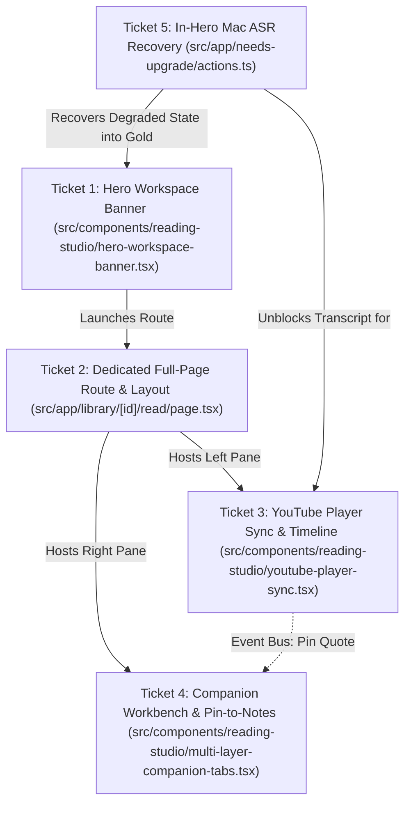

# 🏛️ AI Brain — Jira & GitHub Execution Backlog: Reading Studio & Hero Workspace

**Phase:** Phase 3 (Reading Studio & Triage) / Phase 3.5 Finalization  
**Milestone:** Milestone 3 (`v0.9.x - Kanban Card Processing & Reading Studio`)  
**Epic Key:** `EPIC-STUDIO-01`  
**Epic Title:** `Option 2 Hero Workspace Banner & Dedicated Full-Page Reading Studio Architecture`  
**Author:** Lead Technical Project Manager & Scrum Master (Product Council)  
**Date:** August 18, 2026  
**Status:** Approved & Execution-Ready for Autonomous AI Coding Agents  
**Target Branch:** `feature/reading-studio-hero-option2` → `main`  
**Prototype Reference:** `src/app/prototype/reading-studio-hero/page.tsx` & `src/app/prototype/reading-studio-hero/studio/page.tsx`

---

## 📋 Executive Summary & Epic Architecture

This backlog translates the finalized **Option 2: Integrated Hero Workspace Banner & Dedicated Full-Page Reading Studio** design into 5 atomic, execution-ready engineering tickets.

```
┌──────────────────────────────────────────────────────────────────────────────────────────────────┐
│                                       AI BRAIN READING STUDIO                                    │
├──────────────────────────────────────────────────────────────────────────────────────────────────┤
│                                                                                                  │
│   [ Ticket 1: Hero Workspace Banner ]                                                           │
│   ┌──────────────────────────────────────────────────────────────────────────────────────────┐   │
│   │ 🎬 Media Poster • Duration • Quality Badge • Segments • [ Launch Dedicated Studio → ]    │   │
│   └──────────────────────────────────────────────────────────────────────────────────────────┘   │
│                                              │                                                   │
│                                              ▼ (Navigates to /library/[id]/read)                 │
│   [ Ticket 2: Dedicated Full-Page Studio Route & Dual-Pane Layout Engine ]                       │
│   ┌──────────────────────────────────────────────────┬───────────────────────────────────────┐   │
│   │ [ Ticket 3: Media Player & Sync Timeline ]       │ [ Ticket 4: Companion Workbench ]     │   │
│   │ • YouTube IFrame / Native Player (00:00)         │ • Tab 1: AI Summary & Key Quotes      │   │
│   │ • Speed (1x, 1.25x, 1.5x, 2x) & Scrubbing        │ • Tab 2: ✍️ Smart Notes (Auto-save)   │   │
│   │ • Auto-Scrolling Transcript Stream               │ • Tab 3: 🤖 Ask AI Companion          │   │
│   │ • "Pin to Notes" Quick Action (+)                │ • Tab 4: 🗄️ SQLite Provenance         │   │
│   └──────────────────────────────────────────────────┴───────────────────────────────────────┘   │
│                                              ▲                                                   │
│   [ Ticket 5: In-Hero Mac ASR One-Click Queueing & Recovery Action ]                             │
│   ┌──────────────────────────────────────────────────────────────────────────────────────────┐   │
│   │ ⚡ Missing Transcript? [ Queue Mac ASR ] → M5 Pro Metal/ANE → 100% Timed Segments         │   │
│   └──────────────────────────────────────────────────────────────────────────────────────────┘   │
└──────────────────────────────────────────────────────────────────────────────────────────────────┘
```

### Epic Execution Matrix

| Ticket # | Key / Label | Title | Type | Points | Priority | Primary Files |
|---|---|---|---|---|---|---|
| **1** | `TICKET-STUDIO-01` | `FEAT(studio): Integrated Hero Workspace Banner Component for Item Detail Page` | Epic Core | 5 SP | P1 (Blocker) | `src/components/reading-studio/hero-workspace-banner.tsx`, `src/app/items/[id]/page.tsx` |
| **2** | `TICKET-STUDIO-02` | `FEAT(studio): Dedicated Full-Page Reading Studio Route & Layout Engine` | Core Route | 5 SP | P1 (Blocker) | `src/app/library/[id]/read/page.tsx`, `src/app/items/[id]/read/page.tsx`, `src/components/reading-studio/split-pane-container.tsx` |
| **3** | `TICKET-STUDIO-03` | `FEAT(studio): Dual-Pane YouTube Player Sync & Interactive Transcript Timeline` | Feature | 8 SP | P1 | `src/components/reading-studio/youtube-player-sync.tsx`, `src/components/reading-studio/transcript-timeline.tsx` |
| **4** | `TICKET-STUDIO-04` | `FEAT(studio): Multi-Layer Companion Workbench & Live Pin-to-Notes Event Bus` | Feature | 8 SP | P2 | `src/components/reading-studio/multi-layer-companion-tabs.tsx`, `src/components/manual-note-editor.tsx`, `src/lib/reading-studio/note-event-bus.ts` |
| **5** | `TICKET-STUDIO-05` | `FEAT(repair): In-Hero Mac ASR One-Click Queueing & Degraded State Recovery Action` | Recovery | 5 SP | P1 | `src/app/needs-upgrade/actions.ts`, `src/components/reading-studio/hero-workspace-banner.tsx`, `src/components/reading-studio/asr-recovery-callout.tsx` |

**Total Estimated Effort:** 31 Story Points (~1 Sprint).

---

## 🎟️ Ticket 1: Integrated Hero Workspace Banner Component for Item Detail Page

### 1. Issue Title & Summary
- **Issue Title:** `FEAT(studio): Integrated Hero Workspace Banner Component for Item Detail Page`
- **Summary:** Implement the high-impact Option 2 Hero Workspace Banner on the item detail view (`src/app/items/[id]/page.tsx`), featuring media preview poster (16:9 thumbnail, duration badge), dynamic quality fidelity chips (`Gold`, `Degraded`, `Article`), timed segment counter, prominent "Launch Reading Studio" primary CTA button, and secondary quick actions (Inspect Segments drawer trigger, Copy Link with toast, and External Source launch).

### 2. Jira / GitHub Metadata
- **Issue Type:** Feature / Core Component
- **Epic Link:** `EPIC-STUDIO-01: Option 2 Reading Studio Architecture`
- **Milestone:** `v0.9.x - Kanban Card Processing & Reading Studio`
- **Component:** `UI / Item Detail / Reading Studio`
- **Priority:** `P1 - High`
- **Story Points:** 5
- **Labels:** `area/reading-studio`, `layer/ui`, `phase/3`, `milestone/0.9.x`, `design/option-2`

### 3. User Story
```markdown
As an AI Brain user reading saved YouTube videos or long-form articles on the Item Detail page,
I want an elevated Hero Workspace Banner at the top of the item view,
So that I can immediately understand the media duration, extraction quality, and launch into the dedicated full-page Reading Studio with zero friction.
```

### 4. Acceptance Criteria (Gherkin)

```gherkin
Feature: Integrated Hero Workspace Banner

  Background:
    Given the user is authenticated and navigating to "/items/[id]"

  Scenario: Displaying a YouTube video with high-fidelity transcript (Gold Quality)
    Given an item exists with source_type "youtube" and duration_seconds 1122
    And the item has 184 transcript segments in SQLite
    When the user views the item detail page
    Then the Hero Workspace Banner is rendered at the top of the content area
    And the banner displays a 16:9 thumbnail preview with duration badge "18:42"
    And a quality chip displays "Full Transcript • High Fidelity" with teal theme tokens
    And a segment chip displays "184 timed segments"
    And a primary button "Launch Reading Studio" is visible with a play icon
    When the user clicks "Launch Reading Studio"
    Then the browser navigates to "/library/[id]/read"

  Scenario: Displaying a degraded YouTube video missing transcript
    Given an item exists with source_type "youtube" and 0 transcript segments
    And extraction status is marked as degraded
    When the user views the item detail page
    Then the Hero Workspace Banner displays a warning border with ruby/coral tokens
    And a quality chip displays "Metadata Only • Missing Transcript" with an alert icon
    And an inline recovery callout provides a "Queue Mac ASR" action button

  Scenario: Displaying a web article or markdown document
    Given an item exists with source_type "article" and word_count 2840
    When the user views the item detail page
    Then the Hero Workspace Banner displays a document icon with cyan theme tokens
    And the metadata displays reading time "6 min read • 2,840 words"
    And the primary button text displays "Launch Reading Studio" with a book icon

  Scenario: Secondary action triggers
    Given the Hero Workspace Banner is rendered
    When the user clicks the "Inspect Segments" button
    Then a slide-over drawer opens displaying all transcript segments with confidence scores
    When the user clicks the "Copy Link" button
    Then the item URL is copied to the system clipboard and a toast notification confirms "Link copied to clipboard"
```

### 5. Technical Implementation Details

#### File Paths & Responsibilities
- `src/components/reading-studio/hero-workspace-banner.tsx`: Pure client/server-compatible React component rendering the hero banner.
- `src/components/reading-studio/segment-inspector-drawer.tsx`: Slide-over drawer for inspecting raw transcript segments and confidence metrics.
- `src/app/items/[id]/page.tsx`: Server component passing hydrated `ItemRow` and `segmentCount` to `HeroWorkspaceBanner`.

#### Component Contract & Props
```typescript
import type { ItemRow } from "@/db/client";

export interface HeroWorkspaceBannerProps {
  item: ItemRow;
  segmentCount?: number;
  qualityLevel?: "gold" | "degraded" | "article";
  qualityLabel?: string;
  diagnosticWarning?: string;
  onInspectSegments?: () => void;
  className?: string;
}
```

#### Design System & CSS Tokens
- Surface: `var(--surface)`, `var(--surface-raised)`
- Borders: `border-[var(--border)]`, `hover:border-[var(--border-strong)]`
- Primary CTA: `bg-[var(--action-primary-bg)]`, `text-[var(--action-primary-fg)]`, `hover:bg-[var(--action-primary-bg-hover)]`
- Quality Accents:
  - Gold (Teal): `var(--teal)` (`#18A999` light / `#4DD7C8` dark)
  - Degraded (Ruby): `var(--ruby)` (`#E63B6F` light / `#FF6D98` dark)
  - Article (Cyan): `var(--cyan)` (`#0891B2` light / `#67E8F9` dark)

### 6. Asset & Screen References
- Prototype Screen: [Reading Studio Hero Prototype](file:///Users/arun.prakash/Documents/ArunVault2026-2/Initiatives/Arun_AI_Projects/ai-brain/src/app/prototype/reading-studio-hero/page.tsx)
- Visual Implementation: [Hero Workspace Banner Prototype Code](file:///Users/arun.prakash/Documents/ArunVault2026-2/Initiatives/Arun_AI_Projects/ai-brain/src/components/prototype/reading-studio-hero-prototype.tsx#L691-L899)
- Reference Screenshots: `SCREENSHOT_ASSET_REGISTER_v1.md` (IMG-007, IMG-009, IMG-015)

### 7. Test & Verification Plan
- **Unit Tests (`src/components/reading-studio/__tests__/hero-workspace-banner.test.tsx`):**
  - Renders Gold, Degraded, and Article variants with exact badge labels.
  - Formats duration correctly (`00:00`, `mm:ss`, `hh:mm:ss`).
  - Verifies "Launch Reading Studio" link destination equals `/library/${item.id}/read`.
  - Dispatches `onInspectSegments` callback upon clicking "Inspect Segments".
- **Lint & Typecheck:**
  ```bash
  npm run typecheck
  npm run lint
  npm test src/components/reading-studio
  ```

### 8. GitHub CLI Command
```bash
gh issue create \
  --title "FEAT(studio): Integrated Hero Workspace Banner Component for Item Detail Page" \
  --milestone "v0.9.x - Kanban Card Processing & Reading Studio" \
  --label "area/reading-studio,layer/ui,phase/3,priority/p1" \
  --body "$(cat <<'EOF'
## User Story
As an AI Brain user reading saved YouTube videos or long-form articles on the Item Detail page,
I want an elevated Hero Workspace Banner at the top of the item view,
So that I can immediately understand the media duration, extraction quality, and launch into the dedicated full-page Reading Studio with zero friction.

## Acceptance Criteria
- [ ] Render 16:9 media poster with formatted duration badge and channel/author details.
- [ ] Display dynamic fidelity chips: Gold (Teal), Degraded (Ruby), Article (Cyan).
- [ ] Display segment count badge when transcript segments > 0.
- [ ] Primary action "Launch Reading Studio" links to `/library/[id]/read`.
- [ ] Secondary actions: "Inspect Segments" drawer trigger, "Copy Link" with toast, and external source link.
- [ ] WCAG AA/AAA contrast compliant across light and dark themes.

## Technical Architecture
- Files: `src/components/reading-studio/hero-workspace-banner.tsx`, `src/app/items/[id]/page.tsx`
- Props: `item: ItemRow`, `segmentCount?: number`, `qualityLevel?: "gold" | "degraded" | "article"`
- Reference: `src/components/prototype/reading-studio-hero-prototype.tsx:691-899`

## Verification
`npm run typecheck && npm run lint && npm test`
EOF
)"
```

---

## 🎟️ Ticket 2: Dedicated Full-Page Reading Studio Route & Layout Engine

### 1. Issue Title & Summary
- **Issue Title:** `FEAT(studio): Dedicated Full-Page Reading Studio Route & Layout Engine`
- **Summary:** Implement the dedicated, immersive full-page Reading Studio routes (`/library/[id]/read` and `/items/[id]/read` backward-compatible alias) featuring a dual-pane responsive layout engine, adjustable split ratio controls (`50:50`, `60:40`, `40:60`), sticky studio breadcrumb header with back navigation, URL state synchronization (`?t=180&tab=notes`), and keyboard-first Focus Mode (`⌥F`, `⌘↵`, `Esc`).

### 2. Jira / GitHub Metadata
- **Issue Type:** Core Architecture / Route
- **Epic Link:** `EPIC-STUDIO-01: Option 2 Reading Studio Architecture`
- **Milestone:** `v0.9.x - Kanban Card Processing & Reading Studio`
- **Component:** `App Routing / Layout / Reading Studio`
- **Priority:** `P1 - Blocker`
- **Story Points:** 5
- **Labels:** `area/reading-studio`, `layer/routing`, `layer/ui`, `phase/3`, `milestone/0.9.x`

### 3. User Story
```markdown
As a knowledge worker studying technical material,
I want a dedicated full-page workspace route (/library/[id]/read) instead of a transient popup modal,
So that I have a persistent, deep-linkable, side-by-side study environment where I can adjust pane split ratios, scrub video timestamps, and synthesize notes without modal dismissal risk.
```

### 4. Acceptance Criteria (Gherkin)

```gherkin
Feature: Dedicated Full-Page Reading Studio Route

  Background:
    Given an item with ID "item_karpathy_llm" exists in SQLite

  Scenario: Navigating to the dedicated studio route
    When the user navigates directly to "/library/item_karpathy_llm/read"
    Then the server renders the full-page Reading Studio layout
    And the browser document title reflects "[Item Title] · Reading Studio · AI Brain"
    And the studio header displays a "Back to Item" button, title breadcrumb, and split ratio controls

  Scenario: Backward compatible alias routing
    When the user navigates to "/items/item_karpathy_llm/read"
    Then the request is handled cleanly without redirection loops, rendering the identical Reading Studio page

  Scenario: Switching dual-pane split ratios
    Given the Reading Studio is loaded on desktop (viewport >= 1024px)
    When the user clicks the "60:40" ratio button in the header
    Then the left media/transcript pane expands to 60% width and the right companion pane shrinks to 40% width
    When the user clicks the "40:60" ratio button
    Then the left pane shrinks to 40% width and the right pane expands to 60% width

  Scenario: Responsive layout adaptation
    Given the Reading Studio is loaded on a mobile viewport (width <= 640px)
    Then the dual-pane layout collapses into a vertically stacked single-column view
    And split ratio controls are hidden in favor of mobile view tabs

  Scenario: Focus Mode and keyboard shortcuts
    Given the user is on the Reading Studio page
    When the user presses "⌥F" (Alt + F)
    Then the header and extraneous chrome collapse into distraction-free Focus Mode
    When the user presses "⌘↵" (Cmd + Enter)
    Then the page toggles between the Item Detail view and Dedicated Studio view
```

### 5. Technical Implementation Details

#### File Paths & Responsibilities
- `src/app/library/[id]/read/page.tsx`: Primary Next.js Server Component page fetching item data, chunks, and segments.
- `src/app/items/[id]/read/page.tsx`: Re-export / alias route rendering the identical studio component.
- `src/components/reading-studio/reading-studio-layout.tsx`: Client-side layout engine managing split ratio state, focus mode, and breadcrumb bar.
- `src/components/reading-studio/split-pane-container.tsx`: Responsive CSS grid / flex container handling 50:50, 60:40, and 40:60 ratios.

#### Page Data Contract & Loading
```typescript
interface StudioPageProps {
  params: Promise<{ id: string }>;
  searchParams: Promise<{ t?: string; tab?: string; split?: string }>;
}

export async function generateMetadata({ params }: StudioPageProps): Promise<Metadata> {
  const { id } = await params;
  const item = await getItemById(id);
  return {
    title: `${item ? item.title : "Item"} · Reading Studio · AI Brain`,
    description: `Dedicated learning workspace and synchronized transcript studio for ${item?.title}`,
  };
}
```

#### Split Ratio CSS Classes
```typescript
export type SplitRatio = "50-50" | "60-40" | "40-60";

const LEFT_PANE_CLASSES: Record<SplitRatio, string> = {
  "50-50": "lg:w-1/2",
  "60-40": "lg:w-3/5",
  "40-60": "lg:w-2/5",
};

const RIGHT_PANE_CLASSES: Record<SplitRatio, string> = {
  "50-50": "lg:w-1/2",
  "60-40": "lg:w-2/5",
  "40-60": "lg:w-3/5",
};
```

### 6. Asset & Screen References
- Prototype Screen: [Dedicated Full-Page Studio Prototype](file:///Users/arun.prakash/Documents/ArunVault2026-2/Initiatives/Arun_AI_Projects/ai-brain/src/app/prototype/reading-studio-hero/studio/page.tsx)
- Studio Layout Implementation: [Prototype Studio Layout Code](file:///Users/arun.prakash/Documents/ArunVault2026-2/Initiatives/Arun_AI_Projects/ai-brain/src/components/prototype/reading-studio-hero-prototype.tsx#L1007-L1403)

### 7. Test & Verification Plan
- **Unit & Integration Tests:**
  - Route loads and hydrates server data for valid item ID; renders 404 for invalid item ID.
  - Split ratio toggles apply correct width classes and persist to `localStorage`.
  - Keyboard listener handles `⌥F` (Focus mode) and `Escape` correctly.
- **Commands:**
  ```bash
  npm run typecheck
  npm run lint
  npm test src/app/library
  ```

### 8. GitHub CLI Command
```bash
gh issue create \
  --title "FEAT(studio): Dedicated Full-Page Reading Studio Route & Layout Engine" \
  --milestone "v0.9.x - Kanban Card Processing & Reading Studio" \
  --label "area/reading-studio,layer/routing,layer/ui,phase/3,priority/p1" \
  --body "$(cat <<'EOF'
## User Story
As a knowledge worker studying technical material,
I want a dedicated full-page workspace route (/library/[id]/read) instead of a transient popup modal,
So that I have a persistent, deep-linkable, side-by-side study environment where I can adjust pane split ratios, scrub video timestamps, and synthesize notes without modal dismissal risk.

## Acceptance Criteria
- [ ] Implement primary route `/library/[id]/read/page.tsx` and alias `/items/[id]/read/page.tsx`.
- [ ] Provide dual-pane split ratio selector: 50:50, 60:40, 40:60.
- [ ] Responsive design: dual-pane on desktop, vertical stack on tablet/mobile.
- [ ] Sticky breadcrumb bar with "Back to Item", title, duration badge, and split controls.
- [ ] Keyboard shortcuts: `⌥F` for Focus Mode, `Esc` to exit drawers, `⌘↵` to toggle studio.
- [ ] SSR metadata generation with dynamic item title.

## Technical Architecture
- Files: `src/app/library/[id]/read/page.tsx`, `src/app/items/[id]/read/page.tsx`, `src/components/reading-studio/split-pane-container.tsx`
- Reference: `src/components/prototype/reading-studio-hero-prototype.tsx:1007-1403`

## Verification
`npm run typecheck && npm run lint && npm test`
EOF
)"
```

---

## 🎟️ Ticket 3: Dual-Pane YouTube Player Sync & Interactive Transcript Timeline

### 1. Issue Title & Summary
- **Issue Title:** `FEAT(studio): Dual-Pane YouTube Player Sync & Interactive Transcript Timeline`
- **Summary:** Build the synchronized YouTube player iframe controller and interactive transcript timeline for the left pane of the Reading Studio. Features bidirectional sync: clicking any transcript segment seeks the video player to that exact timestamp; video playback automatically highlights the active spoken segment and auto-scrolls it into view; includes playback speed controls (`1x`, `1.25x`, `1.5x`, `2x`), scrubbing timeline slider, and `-10s` / `+10s` seek buttons.

### 2. Jira / GitHub Metadata
- **Issue Type:** Feature Component
- **Epic Link:** `EPIC-STUDIO-01: Option 2 Reading Studio Architecture`
- **Milestone:** `v0.9.x - Kanban Card Processing & Reading Studio`
- **Component:** `Video Player / Transcript Engine`
- **Priority:** `P1 - High`
- **Story Points:** 8
- **Labels:** `area/reading-studio`, `layer/player`, `layer/ui`, `phase/3`, `milestone/0.9.x`

### 3. User Story
```markdown
As a researcher watching educational YouTube lectures,
I want the video player and transcript timeline to be bidirectionally synchronized in the Reading Studio,
So that when I click any transcript line the video immediately jumps to that exact second, and as the video plays, the corresponding transcript text is highlighted and kept in view.
```

### 4. Acceptance Criteria (Gherkin)

```gherkin
Feature: YouTube Player Sync & Interactive Transcript Timeline

  Background:
    Given the user is on "/library/[id]/read" for a YouTube item with 184 timed segments

  Scenario: Seeking video via transcript segment click
    Given the video is currently paused at 00:00
    When the user clicks on segment #3 ("03:00 Tokenization Quirks")
    Then the YouTube video player immediately seeks to 180 seconds (03:00)
    And segment #3 receives active highlight styling (border-indigo-500/60 bg-indigo-500/10)
    And the URL query string updates to "?t=180" without full page reload

  Scenario: Auto-scrolling transcript during playback
    Given the video is playing continuously
    When the playback timestamp reaches 465 seconds (07:45)
    Then segment #5 is marked active
    And the transcript container smoothly scrolls segment #5 into the vertical center of the viewport

  Scenario: Adjusting playback speed and relative seeking
    When the user clicks the "1.5x" speed button
    Then the video playback rate changes to 1.5x speed
    When the user clicks the "+10s" button
    Then the video skips forward by 10 seconds

  Scenario: Interactive scrub bar dragging
    When the user drags the timeline range slider to 600 seconds
    Then the displayed timestamp shows "10:00"
    And the video player synchronizes to 10:00 upon slider release

  Scenario: Handling Web Articles and documents (non-video sources)
    Given the user opens an article item in the Reading Studio
    Then the left pane renders formatted article typography with word count and readability score
    And the media player is replaced with an article reading header
```

### 5. Technical Implementation Details

#### File Paths & Responsibilities
- `src/components/reading-studio/youtube-player-sync.tsx`: YouTube IFrame API wrapper with player state machine (play, pause, seekTo, setPlaybackRate, getCurrentTime).
- `src/components/reading-studio/transcript-timeline.tsx`: Virtualized/optimized scrollable list of timed transcript segments with IntersectionObserver and scrollIntoView.
- `src/lib/reading-studio/player-sync-context.tsx`: React context sharing playback time (`currentPlaySec`), play state (`isPlaying`), and seek handlers across panes.

#### Data Models & Interfaces
```typescript
export interface TranscriptSegment {
  id: number;
  startSec: number;
  endSec: number;
  timestamp: string; // e.g. "03:00"
  speaker?: string;
  text: string;
  confidence?: number;
}

export interface PlayerSyncContextType {
  currentPlaySec: number;
  isPlaying: boolean;
  playbackRate: number;
  seekTo: (seconds: number) => void;
  togglePlay: () => void;
  setPlaybackRate: (rate: number) => void;
}
```

#### Auto-Scroll Algorithm
```typescript
useEffect(() => {
  if (!autoScrollEnabled || isUserScrolling) return;
  const activeElement = segmentRefs.current[activeSegmentId];
  if (activeElement) {
    activeElement.scrollIntoView({
      behavior: "smooth",
      block: "nearest",
    });
  }
}, [activeSegmentId, autoScrollEnabled, isUserScrolling]);
```

### 6. Asset & Screen References
- Sync Player & Timeline Implementation: [Prototype Player Sync](file:///Users/arun.prakash/Documents/ArunVault2026-2/Initiatives/Arun_AI_Projects/ai-brain/src/components/prototype/reading-studio-hero-prototype.tsx#L1092-L1224)
- YouTube Spike References: `Youtube_spike_16_aug_2026/PRODUCT_COUNCIL_SPIKE_DESIGNS_AND_REPORT.md`

### 7. Test & Verification Plan
- **Unit Tests (`src/components/reading-studio/__tests__/player-sync.test.tsx`):**
  - Timestamp formatting helper parses `0`, `75`, `3600`, `3665` into `00:00`, `01:15`, `1:00:00`, `1:01:05`.
  - Active segment calculation returns correct segment given `currentPlaySec`.
  - Seeking dispatches correct IFrame API command and updates context state.
- **Commands:**
  ```bash
  npm run typecheck
  npm run lint
  npm test src/components/reading-studio
  ```

### 8. GitHub CLI Command
```bash
gh issue create \
  --title "FEAT(studio): Dual-Pane YouTube Player Sync & Interactive Transcript Timeline" \
  --milestone "v0.9.x - Kanban Card Processing & Reading Studio" \
  --label "area/reading-studio,layer/player,layer/ui,phase/3,priority/p1" \
  --body "$(cat <<'EOF'
## User Story
As a researcher watching educational YouTube lectures,
I want the video player and transcript timeline to be bidirectionally synchronized in the Reading Studio,
So that when I click any transcript line the video immediately jumps to that exact second, and as the video plays, the corresponding transcript text is highlighted and kept in view.

## Acceptance Criteria
- [ ] YouTube iframe integration with playback sync (play, pause, seekTo, playbackRate).
- [ ] Transcript timeline with live segment highlighting based on `currentPlaySec`.
- [ ] Clicking any transcript timestamp seeks the video to that exact second.
- [ ] Smooth auto-scrolling to keep active segment centered during playback.
- [ ] Playback speed controls: 1x, 1.25x, 1.5x, 2x with ±10s seek buttons.
- [ ] Drag-to-scrub range slider with real-time mm:ss preview.
- [ ] Fallback support for Web Articles rendering clean typography.

## Technical Architecture
- Files: `src/components/reading-studio/youtube-player-sync.tsx`, `src/components/reading-studio/transcript-timeline.tsx`, `src/lib/reading-studio/player-sync-context.tsx`
- Reference: `src/components/prototype/reading-studio-hero-prototype.tsx:1092-1224`

## Verification
`npm run typecheck && npm run lint && npm test`
EOF
)"
```

---

## 🎟️ Ticket 4: Multi-Layer Companion Workbench & Live Pin-to-Notes Event Bus

### 1. Issue Title & Summary
- **Issue Title:** `FEAT(studio): Multi-Layer Companion Workbench & Live Pin-to-Notes Event Bus`
- **Summary:** Implement the 4-layer Companion Workbench in the right pane of the Reading Studio (`Overview & Summary`, `✍️ Smart Notes`, `🤖 Ask AI Companion`, `🗄️ SQLite Provenance`) and a live "Pin to Notes" event bus enabling 1-click capture of timestamped transcript quotes directly into the user's persistent markdown notes.

### 2. Jira / GitHub Metadata
- **Issue Type:** Feature Component
- **Epic Link:** `EPIC-STUDIO-01: Option 2 Reading Studio Architecture`
- **Milestone:** `v0.9.x - Kanban Card Processing & Reading Studio`
- **Component:** `Workbench / Notes / RAG Assistant`
- **Priority:** `P2 - Medium-High`
- **Story Points:** 8
- **Labels:** `area/reading-studio`, `layer/notes`, `layer/ai`, `phase/3`, `milestone/0.9.x`

### 3. User Story
```markdown
As a learner synthesizing knowledge from videos or articles,
I want a multi-layer companion workbench beside my media player,
So that I can read AI summaries, ask grounded questions with timestamp citations, and pin quotes directly into my auto-saved markdown notes with one click.
```

### 4. Acceptance Criteria (Gherkin)

```gherkin
Feature: Multi-Layer Companion Workbench & Pin-to-Notes

  Background:
    Given the user is on the Reading Studio page for "item_karpathy_llm"

  Scenario: Pinning a transcript quote to Smart Notes
    Given the user is viewing the transcript timeline in the left pane
    When the user hovers over segment #2 ("01:15") and clicks "+ Add to Notes"
    Then the quote text and timestamp link are appended to the markdown notes editor
    And the right pane automatically switches to the "✍️ Smart Notes" tab
    And a toast notification confirms "Pinned quote [01:15] to Smart Notes"

  Scenario: Autosaving markdown notes
    Given the user is in the "✍️ Smart Notes" tab
    When the user edits the notes content
    Then changes are saved locally to IndexedDB immediately
    And a debounced server action persists the notes to SQLite within 1500ms
    And the autosave indicator shows "Autosaved to IndexedDB & SQLite"

  Scenario: Asking questions to the AI Memory Companion
    Given the user switches to the "🤖 Ask AI Companion" tab
    When the user submits "Why does tokenization cause arithmetic failure?"
    Then the AI streams a grounded response citing "03:00 Tokenization Quirks"
    When the user clicks the "📍 03:00 Tokenization Quirks" citation chip
    Then the left YouTube player seeks to 180 seconds

  Scenario: Inspecting SQLite Provenance metadata
    When the user switches to the "🗄️ SQLite Provenance" tab
    Then the raw database record attributes (`id`, `source_type`, `quality`, `duration_seconds`, `created_at`) are rendered in a clean monospace panel
```

### 5. Technical Implementation Details

#### File Paths & Responsibilities
- `src/components/reading-studio/multi-layer-companion-tabs.tsx`: Tab container managing the 4 workbench views.
- `src/components/reading-studio/smart-notes-editor.tsx` / `src/components/manual-note-editor.tsx`: Markdown note editor with local + SQLite sync.
- `src/components/reading-studio/ask-ai-companion.tsx`: Scoped per-item RAG chat interface with interactive timestamp citation chips.
- `src/components/reading-studio/provenance-inspector.tsx`: Monospace raw metadata and vector chunk inspector.
- `src/lib/reading-studio/note-event-bus.ts`: Lightweight event emitter for broadcasting `PIN_QUOTE` events from transcript to notes.

#### Pin-to-Notes Event Contract
```typescript
export interface PinQuotePayload {
  itemId: string;
  quoteText: string;
  timestamp: string; // e.g. "03:00"
  seconds: number;
  sourceUrl: string;
}

export const NoteEventBus = {
  listeners: new Set<(payload: PinQuotePayload) => void>(),
  emit(payload: PinQuotePayload) {
    this.listeners.forEach((cb) => cb(payload));
  },
  subscribe(cb: (payload: PinQuotePayload) => void) {
    this.listeners.add(cb);
    return () => this.listeners.delete(cb);
  },
};
```

#### Markdown Citation Formatting
```markdown
> "Tokenization is at the root of many mysterious LLM behaviors." — [03:00](https://youtube.com/watch?v=zjkBMFhNj_g&t=180s)
```

### 6. Asset & Screen References
- Workbench Implementation: [Prototype Companion Tabs](file:///Users/arun.prakash/Documents/ArunVault2026-2/Initiatives/Arun_AI_Projects/ai-brain/src/components/prototype/reading-studio-hero-prototype.tsx#L1226-L1401)
- Design Architecture: `Handover_docs/Handover_docs_14_05_2026_LANE/01_Architecture.md`

### 7. Test & Verification Plan
- **Unit Tests (`src/components/reading-studio/__tests__/companion-workbench.test.tsx`):**
  - NoteEventBus emits and receives quote payloads.
  - Smart Notes editor formats appended quote with markdown blockquote and link.
  - Ask AI citation chip click triggers `seekTo(seconds)` on `PlayerSyncContext`.
  - Tab state switching preserves uncommitted note editor text.
- **Commands:**
  ```bash
  npm run typecheck
  npm run lint
  npm test src/components/reading-studio
  ```

### 8. GitHub CLI Command
```bash
gh issue create \
  --title "FEAT(studio): Multi-Layer Companion Workbench & Live Pin-to-Notes Event Bus" \
  --milestone "v0.9.x - Kanban Card Processing & Reading Studio" \
  --label "area/reading-studio,layer/notes,layer/ai,phase/3,priority/p2" \
  --body "$(cat <<'EOF'
## User Story
As a learner synthesizing knowledge from videos or articles,
I want a multi-layer companion workbench beside my media player,
So that I can read AI summaries, ask grounded questions with timestamp citations, and pin quotes directly into my auto-saved markdown notes with one click.

## Acceptance Criteria
- [ ] 4-tab workbench: Overview & Summary, ✍️ Smart Notes, 🤖 Ask AI Companion, 🗄️ SQLite Provenance.
- [ ] Live Pin-to-Notes event bus: clicking `+ Add to Notes` appends markdown citation and switches to Notes tab.
- [ ] Smart Notes editor with local IndexedDB autosave and debounced SQLite sync.
- [ ] Ask AI tab with per-item streaming RAG and clickable timestamp citation chips.
- [ ] SQLite Provenance inspector showing table metadata and chunk details.
- [ ] Responsive tabs with state persistence across split ratio changes.

## Technical Architecture
- Files: `src/components/reading-studio/multi-layer-companion-tabs.tsx`, `src/lib/reading-studio/note-event-bus.ts`, `src/components/reading-studio/ask-ai-companion.tsx`
- Reference: `src/components/prototype/reading-studio-hero-prototype.tsx:1226-1401`

## Verification
`npm run typecheck && npm run lint && npm test`
EOF
)"
```

---

## 🎟️ Ticket 5: In-Hero Mac ASR One-Click Queueing & Degraded State Recovery Action

### 1. Issue Title & Summary
- **Issue Title:** `FEAT(repair): In-Hero Mac ASR One-Click Queueing & Degraded State Recovery Action`
- **Summary:** Implement the degraded state detection and 1-click local Mac ASR recovery action inside `HeroWorkspaceBanner` and the Reading Studio. When cloud caption fetching fails (HTTP 429 / Anti-bot), the banner displays diagnostic warnings and a "Queue Mac ASR" button. Triggering the button enqueues a `transcript_jobs` row in SQLite via Server Action, renders real-time progress (`Queuing` → `Transcribing` → `Aligning` → `Completed`), and automatically upgrades the item quality state from Degraded (Ruby) to Gold (Teal).

### 2. Jira / GitHub Metadata
- **Issue Type:** Feature / Repair & Recovery
- **Epic Link:** `EPIC-STUDIO-01: Option 2 Reading Studio Architecture`
- **Milestone:** `v0.9.x - Kanban Card Processing & Reading Studio`
- **Component:** `ASR Subsystem / Recovery Workflow`
- **Priority:** `P1 - High`
- **Story Points:** 5
- **Labels:** `area/repair`, `area/asr`, `layer/server-action`, `phase/3`, `milestone/0.9.x`

### 3. User Story
```markdown
As an AI Brain user reading a saved YouTube video where automated caption extraction was blocked,
I want an immediate 1-click "Queue Mac ASR" action inside the Hero Banner,
So that my local MacBook Pro M5 Pro transcribes the audio via Whisper Large-v3 and attaches 100% accurate timed segments without manual terminal commands.
```

### 4. Acceptance Criteria (Gherkin)

```gherkin
Feature: In-Hero Mac ASR One-Click Recovery

  Background:
    Given a YouTube item exists with 0 transcript segments and extraction status "degraded"

  Scenario: Rendering degraded state in Hero Workspace Banner
    When the user views the item detail page
    Then the Hero Banner displays a warning banner with ruby/rose tokens
    And the diagnostic warning displays "YouTube anti-bot challenge blocked automated caption scraping"
    And a prominent button "Queue Mac ASR" is displayed with a zap icon

  Scenario: Enqueuing Mac ASR job via Server Action
    When the user clicks "Queue Mac ASR"
    Then the client calls the server action `queueMacAsrJob(itemId)`
    And a job record is inserted into SQLite table `transcript_jobs` with status "pending"
    And the button state transitions to "Queuing..."
    And a toast notification confirms "⚡ Queued Mac Local Whisper ASR (Apple Neural Engine)"

  Scenario: Tracking live transcription progress
    Given the Mac ASR worker begins processing the job
    Then the banner renders an active progress bar indicating current phase:
      | Stage        | Progress % | Display Text               |
      | queuing      | 5%         | Queuing...                 |
      | transcribing | 35% - 70%  | Transcribing (M5 Pro)...   |
      | aligning     | 92%        | Aligning Timestamps...     |
      | completed    | 100%       | ASR Completed ✨           |

  Scenario: Upgrading item quality upon completion
    When the Mac ASR job completes and posts segments back to Hetzner
    Then the item record quality upgrades from "degraded" to "gold"
    And the segment count reflects the newly inserted segments (e.g. 318 segments)
    And the warning callout vanishes in favor of the normal Gold Studio launcher
```

### 5. Technical Implementation Details

#### File Paths & Responsibilities
- `src/app/needs-upgrade/actions.ts`: Server actions for enqueuing transcript jobs (`queueMacAsrJob`) and polling status (`getJobStatus`).
- `src/components/reading-studio/hero-workspace-banner.tsx`: Callout container rendering degraded state UI and triggering recovery.
- `src/components/reading-studio/asr-recovery-callout.tsx`: Dedicated recovery component with state machine and progress bar.
- `src/lib/queue/transcript-job-client.ts`: Client hook / SSE subscriber for real-time progress updates.

#### Server Action Contract
```typescript
"use server";

import { db } from "@/db/client";
import { revalidatePath } from "next/cache";

export interface QueueJobResult {
  success: boolean;
  jobId?: string;
  error?: string;
}

export async function queueMacAsrJobAction(itemId: string): Promise<QueueJobResult> {
  try {
    const item = db.prepare("SELECT * FROM items WHERE id = ?").get(itemId);
    if (!item) return { success: false, error: "Item not found" };

    const jobId = `job_${Date.now()}_${Math.random().toString(36).slice(2, 7)}`;
    db.prepare(`
      INSERT INTO transcript_jobs (id, item_id, status, created_at, updated_at)
      VALUES (?, ?, 'pending', datetime('now'), datetime('now'))
    `).run(jobId, itemId);

    revalidatePath(`/items/${itemId}`);
    revalidatePath(`/library/${itemId}/read`);
    return { success: true, jobId };
  } catch (err: any) {
    return { success: false, error: err.message };
  }
}
```

#### Progress Bar CSS Tokens
```html
<div className="h-1.5 w-full overflow-hidden rounded-full bg-rose-950/30">
  <div
    className="h-full bg-gradient-to-r from-amber-400 to-emerald-400 transition-all duration-300"
    style={{ width: `${asrProgress}%` }}
  />
</div>
```

### 6. Asset & Screen References
- In-Hero ASR Action Implementation: [Prototype In-Hero ASR Code](file:///Users/arun.prakash/Documents/ArunVault2026-2/Initiatives/Arun_AI_Projects/ai-brain/src/components/prototype/reading-studio-hero-prototype.tsx#L844-L898)
- Mac ASR Subsystem Spec: `Youtube_spike_16_aug_2026/PRODUCT_COUNCIL_SPIKE_DESIGNS_AND_REPORT.md`

### 7. Test & Verification Plan
- **Unit & Action Tests (`src/app/needs-upgrade/__tests__/actions.test.ts`):**
  - `queueMacAsrJobAction` creates valid pending row in `transcript_jobs`.
  - Rejects duplicate job queueing for items already in progress.
  - UI state machine correctly steps through `idle` → `queuing` → `transcribing` → `aligning` → `completed`.
- **Commands:**
  ```bash
  npm run typecheck
  npm run lint
  npm test src/app/needs-upgrade
  ```

### 8. GitHub CLI Command
```bash
gh issue create \
  --title "FEAT(repair): In-Hero Mac ASR One-Click Queueing & Degraded State Recovery Action" \
  --milestone "v0.9.x - Kanban Card Processing & Reading Studio" \
  --label "area/repair,area/asr,layer/server-action,phase/3,priority/p1" \
  --body "$(cat <<'EOF'
## User Story
As an AI Brain user reading a saved YouTube video where automated caption extraction was blocked,
I want an immediate 1-click "Queue Mac ASR" action inside the Hero Banner,
So that my local MacBook Pro M5 Pro transcribes the audio via Whisper Large-v3 and attaches 100% accurate timed segments without manual terminal commands.

## Acceptance Criteria
- [ ] Display degraded banner when YouTube item has 0 segments or caption error.
- [ ] 1-click "Queue Mac ASR" triggers `queueMacAsrJobAction(itemId)`.
- [ ] Real-time progress indicators: Queuing (5%) → Transcribing (35-70%) → Aligning (92%) → Completed (100%).
- [ ] Upgrades item state from Degraded (Ruby) to Gold (Teal) upon job completion.
- [ ] Auto-revalidates item detail page and Reading Studio routes upon completion.

## Technical Architecture
- Files: `src/app/needs-upgrade/actions.ts`, `src/components/reading-studio/hero-workspace-banner.tsx`, `src/components/reading-studio/asr-recovery-callout.tsx`
- Reference: `src/components/prototype/reading-studio-hero-prototype.tsx:844-898`

## Verification
`npm run typecheck && npm run lint && npm test`
EOF
)"
```

---

## 🏗️ Appendix: Dependency Graph & Execution Sequence



### Sprint Rollout Strategy
1. **Wave 1 (Day 1-2):** Implement `Ticket 1` (Hero Banner) + `Ticket 2` (Full-Page Route Scaffold).
2. **Wave 2 (Day 3-4):** Implement `Ticket 3` (YouTube Player Sync & Timeline) + `Ticket 5` (Mac ASR Recovery Action).
3. **Wave 3 (Day 5-6):** Implement `Ticket 4` (Companion Workbench, Note Event Bus, RAG Ask Companion).
4. **Wave 4 (Day 7):** End-to-end integration smoke testing, WCAG 2.1 AAA audit, and release tagging under `v0.9.0`.

### Definition of Done (DoD)
- [ ] 100% clean `npm run typecheck` and `npm run lint`.
- [ ] All unit and integration test suites passing.
- [ ] Light & Dark theme visual verification passing WCAG AA/AAA contrast tests (≥ 4.5:1 for interactive elements, ≥ 7:1 for text).
- [ ] Keyboard shortcuts verified (`⌥F`, `⌘↵`, `Esc`).
- [ ] Verified live in browser against Gold, Degraded, and Article real-world test cases.
