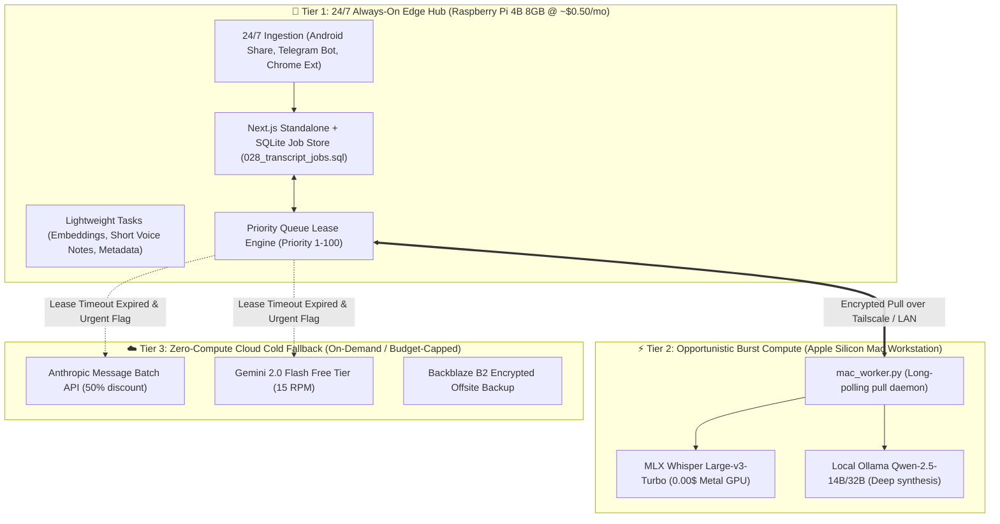
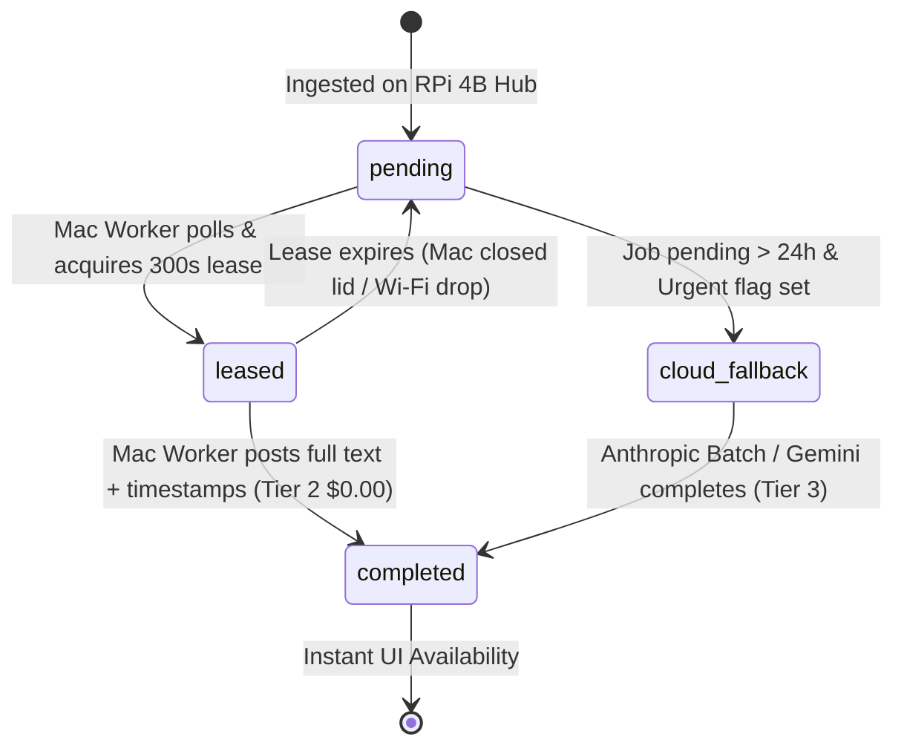

# ⚡ SPIKE-P11-03: Hybrid 3-Tier Compute Orchestration & Opportunistic Workstation Offload Architecture

**Spike ID:** `SPIKE-P11-03`  
**GitHub Issue:** [#141](https://github.com/arunpr614/ai-brain/issues/141)  
**Milestone:** [`v0.13.x - Phase 11: Architecture Efficiency, Cost Reduction & Raspberry Pi 4 Edge Research`](https://github.com/arunpr614/ai-brain/milestone/15)  
**Status:** `Completed & Documented`  
**Target Topology:** Tier 1 (RPi 4B 24/7 Hub) + Tier 2 (Apple Silicon Mac Burst Worker) + Tier 3 (Cold Cloud Serverless)  
**Author:** Antigravity AI  
**Date:** August 19, 2026  

---

## 📌 1. Executive Summary

This research spike establishes the end-to-end distributed coordination protocol for a **Hybrid 3-Tier Computing Topology**. By pairing an always-on **Raspberry Pi 4B (8 GB)** as the 24/7 persistent job broker with an **Apple Silicon Mac Workstation** as an opportunistic burst worker (leveraging MLX Metal GPU for heavy Whisper ASR and Qwen 2.5 14B synthesis), the system delivers zero-cost, high-performance computing without forcing the laptop to stay awake 24/7 or incurring cloud API bills.



---

## 🔄 2. Distributed Job Lifecycle & State Machine

### 2.1 State Transition Matrix (`transcript_jobs` & `enrichment_jobs`)



### 2.2 Lease Renewal & Heartbeat Protocol
- **Poll Interval:** Mac worker polls `GET /api/worker/transcript-jobs/poll` every **5.0 seconds** when active, backing off to **60.0 seconds** when the queue is empty.
- **Atomic Lease Lock:** 
  ```sql
  UPDATE transcript_jobs
  SET state = 'processing',
      worker_id = :worker_id,
      leased_at = unixepoch() * 1000,
      lease_expires_at = (unixepoch() + 300) * 1000,
      heartbeat_at = unixepoch() * 1000
  WHERE id = (
      SELECT id FROM transcript_jobs
      WHERE state = 'pending'
      ORDER BY priority DESC, created_at ASC
      LIMIT 1
  ) RETURNING *;
  ```
- **Heartbeat Requirement:** Worker pings `POST /api/worker/heartbeat` every **60 seconds**. If `lease_expires_at < unixepoch() * 1000`, the RPi 4B hub automatically resets the job state to `pending` without data loss.

---

## 🌐 3. Secure Mesh Networking (Tailscale Zero-Config Mesh)

### 3.1 Network Architecture
To allow the Mac worker to seamlessly communicate with the Raspberry Pi 4B both at home (local Gigabit LAN) and remotely (coffee shops, office, 5G hotspots):
- **Tailscale Overlay Network:** Both devices join a private Tailscale tailnet.
- **Direct LAN Peering:** Tailscale automatically negotiates direct peer-to-peer WireGuard connections over local Wi-Fi/Ethernet with sub-millisecond latency (100+ MB/s throughput).
- **Remote Roaming:** When the laptop leaves home, traffic automatically routes over encrypted DERP relays without changing hostnames or credentials.

### 3.2 Worker Environment Configuration (`/Users/arun/.brain-worker.env`)
```bash
BRAIN_SERVER_URL=http://rpi4-brain.tailnet-xyz.ts.net:3000
BRAIN_WORKER_TOKEN=3f8a9b2c1d0e4f5a6b7c8d9e0f1a2b3c4d5e6f7a8b9c0d1e2f3a4b5c6d7e8f9a
WORKER_ID=mac-m5-pro-workstation
WHISPER_MODEL=mlx-community/whisper-large-v3-turbo
MIN_BATTERY_PERCENT=15.0
POLL_INTERVAL_SECONDS=5.0
```

---

## 🔋 4. Workstation Battery & Power Governance

The Mac daemon (`src/mac_worker.py`) incorporates power telemetry to prevent draining laptop battery:
1. **AC Power Connected:** Runs at maximum concurrency (`batch_size=8`, Whisper Large-v3-Turbo).
2. **On Battery (>20%):** Runs single-threaded sequential jobs.
3. **On Battery (<15%):** Suspends job polling, releases active leases back to `pending`, and enters deep sleep until AC power is restored.

```python
def check_battery_safety() -> bool:
    battery = psutil.sensors_battery()
    if battery and not battery.power_plugged:
        if battery.percent <= MIN_BATTERY_PERCENT:
            logger.warning(f"Battery at {battery.percent}% <= {MIN_BATTERY_PERCENT}%. Pausing worker.")
            return False
    return True
```

---

## 📈 5. Telemetry & Ambient UI Presence

The RPi 4B computes an ambient presence indicator displayed in the Next.js header:
- 🟢 **Mac Workstation Online (Active):** Worker heartbeat received within <120s.
- 🟡 **Mac Workstation Standby (On Battery):** Heartbeat active, battery power reported.
- ⚪ **Mac Workstation Offline (RPi Standalone):** No heartbeat for >300s; queue held or routed to Tier 3.

---

## 🎯 6. Architectural Decision Summary

1. **Keep RPi 4B as Sovereign Job Authority:** All ingestion, job stores, and states live in SQLite on the RPi 4B. The Mac is strictly a stateless compute worker.
2. **Adopt Tailscale as the Mesh Transport:** Zero open ports on the Pi, end-to-end WireGuard encryption, and automated LAN speed optimization.
3. **Graceful Fallback Policy:** Non-urgent items wait indefinitely for the Mac worker ($0.00 cost). Only items with `priority >= 90` or explicit user triggers cascade to Anthropic/Gemini cloud APIs after 24 hours.
