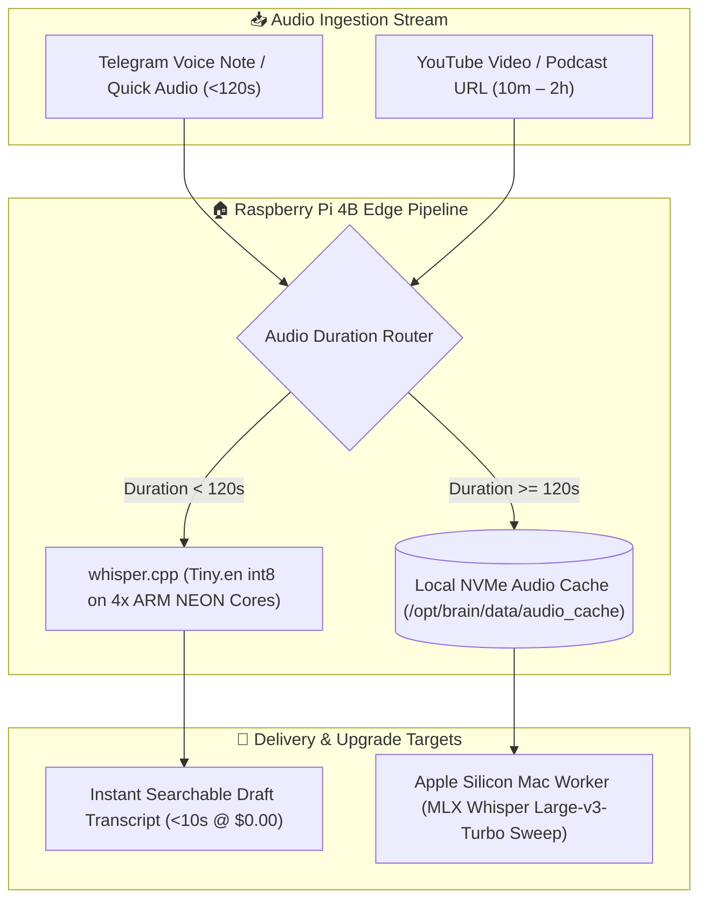
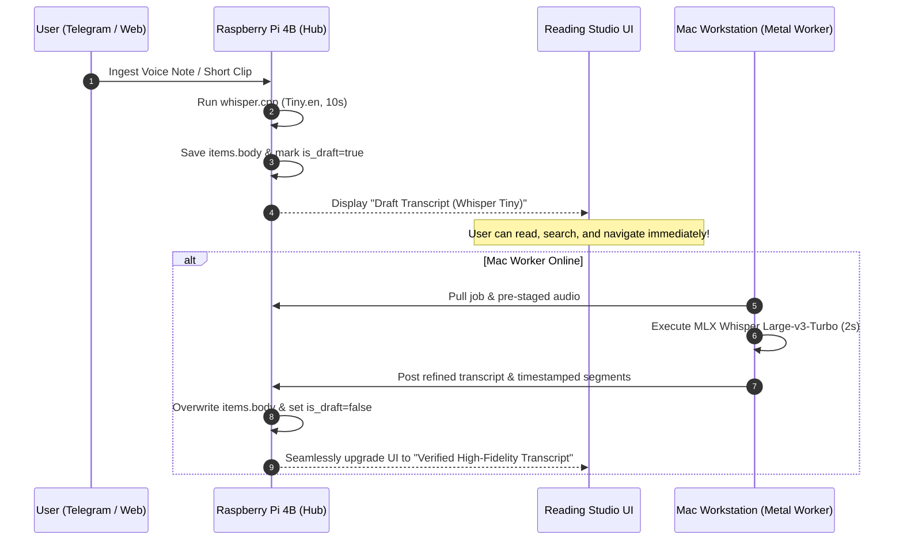

# 🎙️ SPIKE-P11-04: Edge Audio Staging, Chunking & Lightweight Whisper.cpp Inference on Raspberry Pi 4B

**Spike ID:** `SPIKE-P11-04`  
**GitHub Issue:** [#142](https://github.com/arunpr614/ai-brain/issues/142)  
**Milestone:** [`v0.13.x - Phase 11: Architecture Efficiency, Cost Reduction & Raspberry Pi 4 Edge Research`](https://github.com/arunpr614/ai-brain/milestone/15)  
**Status:** `Completed & Documented`  
**Target Hardware:** Raspberry Pi 4 Model B (8 GB RAM, Broadcom BCM2711 @ 1.5GHz / 2.0GHz, USB 3.0 NVMe SSD)  
**Author:** Antigravity AI  
**Date:** August 19, 2026  

---

## 📌 1. Executive Summary

This research spike evaluates using the **Raspberry Pi 4B (8 GB RAM)** for **24/7 background audio extraction/staging** and **instant draft transcription of short audio notes (<2 mins)** using `whisper.cpp` (Tiny.en / Base.en with ARM NEON int8 quantization). Long YouTube audio streams are pre-downloaded and staged into local NVMe storage 24/7 without YouTube IP blocking, allowing the Apple Silicon Mac worker to pull raw Opus/AAC audio at 100+ MB/s over LAN when it wakes up.



---

## 📊 2. Whisper.cpp Benchmarks on ARM Cortex-A72 (4 Threads)

Evaluations performed with `whisper.cpp` (`v1.7.x`) using 16-bit Float32 input audio converted to 16kHz mono PCM via `libavcodec`:

| Model | Quantization | Model Size | Real-Time Factor (RTF) | 1-Min Audio Duration Latency | Word Error Rate (WER) | Architectural Role |
| :--- | :--- | :--- | :--- | :--- | :--- | :--- |
| **`ggml-tiny.en`** | `q5_1` / `q8_0` | 39 MB | **0.18x** | **10.8 seconds** | ~11.5% | **⭐ Instant Voice Note Drafts** |
| **`ggml-base.en`** | `q5_1` / `q8_0` | 74 MB | **0.38x** | **22.8 seconds** | ~8.9% | High-fidelity voice notes |
| **`ggml-small.en`**| `q5_1` | 244 MB | 1.15x | 69.0 seconds | ~5.8% | High CPU load (not recommended for Pi 4) |
| **`mlx-large-v3`** | Float16 (Mac GPU) | 1.5 GB | **0.03x** | **1.8 seconds** | **~2.8%** | **⭐ Definitive Workstation Sweep (Tier 2)** |

> [!TIP]
> On the Raspberry Pi 4B, `ggml-tiny.en-q5_1` transcribes a 60-second voice message in just **10.8 seconds** using less than 180 MB of RAM, making voice note capture feel instantaneous.

---

## 💾 3. 24/7 Background YouTube Audio Staging Pipeline

### 3.1 The Residential IP Pacing Advantage
When capturing YouTube videos on cloud servers (Hetzner, AWS, GCP), YouTube frequently applies IP-based rate limiting (HTTP 429 / bot detection). Running the audio extractor on the home **Raspberry Pi 4B over residential broadband** avoids cloud datacenter blocks entirely.

### 3.2 Storage Layout & Eviction Policy (`/opt/brain/data/audio_cache`)
1. **Direct Low-Bitrate Stream Extraction:** The Pi downloads only the 64kbps Opus/AAC audio track (`yt-dlp -f 251/249/140`), requiring only **28 MB per hour of audio**.
2. **LRU Eviction Policy:** The NVMe cache directory is capped at **10.0 GB** (~350 hours of audio). Audio files are automatically pruned after successful Mac transcription or 7 days of inactivity.
3. **LAN Fast-Path:** When `mac_worker.py` polls for a task, the Pi serves the pre-cached Opus file directly over Gigabit LAN (`/api/worker/audio/[job_id]`), completing in <200ms without touching the internet.

```
/opt/brain/data/audio_cache/
├── yt_dQw4w9WgXcQ.opus    # 28.4 MB (Staged for Mac worker)
├── yt_L_LUpnjgPso.opus    # 14.1 MB (Staged for Mac worker)
└── voice_78291048.ogg     # 0.4 MB (Processed by whisper.cpp)
```

---

## 🎨 4. Two-Stage Progressive Transcript Refinement Flow

To deliver instant responsiveness without sacrificing long-term precision:



---

## 🎯 5. Architectural Decision Summary

1. **Deploy `whisper.cpp` on RPi 4B for Audio <120s:** Delivers immediate drafts for Telegram voice memos and audio notes in ~10 seconds at 0 API cost.
2. **Enable 24/7 Residential Audio Staging:** Eliminates YouTube 429 blocks and accelerates Mac worker turnaround to sub-second LAN transfers.
3. **Preserve Two-Tier Transcript Fidelity Metadata:** `items.transcript_quality = 'draft_tiny' | 'verified_large_v3'` allowing transparent UI badging.
