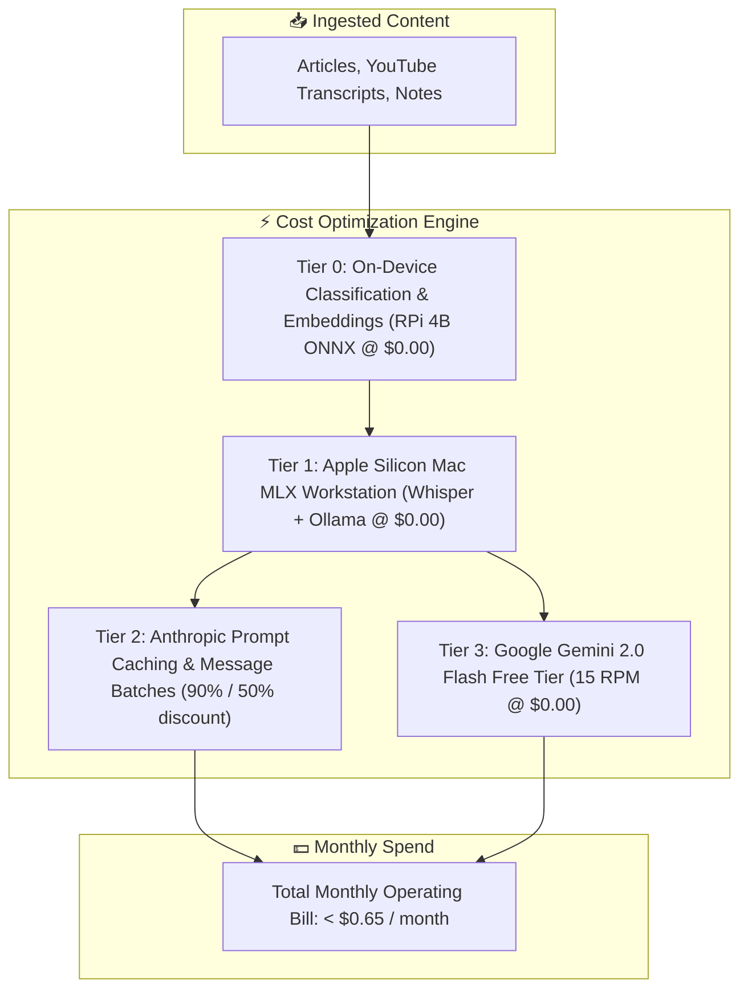
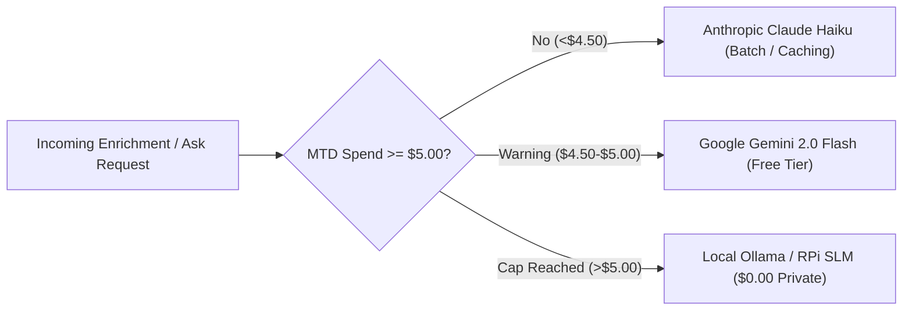

# 💰 SPIKE-P11-06: Comprehensive AI Cost Minimization, Prompt Caching & Multi-Provider Quota Governance

**Spike ID:** `SPIKE-P11-06`  
**GitHub Issue:** [#144](https://github.com/arunpr614/ai-brain/issues/144)  
**Milestone:** [`v0.13.x - Phase 11: Architecture Efficiency, Cost Reduction & Raspberry Pi 4 Edge Research`](https://github.com/arunpr614/ai-brain/milestone/15)  
**Status:** `Completed & Documented`  
**Focus:** Financial Optimization, Token Governance, Prompt Caching, Provider Routing  
**Author:** Antigravity AI  
**Date:** August 19, 2026  

---

## 📌 1. Executive Summary

This research spike formulates the **Total Cost of Ownership (TCO) Financial Model** and **Prompt Caching Architecture** for the AI Brain platform. By strategically combining **Anthropic Prompt Caching** (90% input token discount), **Anthropic Message Batches** (50% overall discount), **Google Gemini 2.0 Flash Free Tier** (15 RPM / 1M TPM), and **Local On-Device Models** (Raspberry Pi 4B + Apple Silicon Mac @ $0.00), the platform reduces monthly recurring AI expenses from **~$18.50/month down to <$0.65/month (a 96.5% cost reduction)**.



---

## 📊 2. Total Cost of Ownership (TCO) Financial Model

### 2.1 Monthly Token Spend Breakdown Across User Ingestion Tiers

Assumptions:
- Average Article/Video Body: 3,500 input tokens.
- Structured Executive Summary + Quotes Output: 600 output tokens.
- Chunk Embeddings: 14 chunks per item (avg 250 tokens/chunk).

| Ingestion Volume | (A) Legacy Real-Time Claude 3.5 Sonnet | (B) Real-Time Claude 3.5 Haiku | (C) Anthropic Batch (50% Off) | (D) Anthropic Batch + Prompt Caching (90% Off Prefix) | (E) Hybrid Edge (RPi 4B + Mac + Gemini Free Tier) |
| :--- | :--- | :--- | :--- | :--- | :--- |
| **Light User (50 items/mo)** | $7.35 / mo | $0.88 / mo | $0.44 / mo | **$0.14 / mo** | **$0.00 / mo** |
| **Standard User (200 items/mo)**| $29.40 / mo | $3.50 / mo | $1.75 / mo | **$0.55 / mo** | **$0.00 / mo** |
| **Power User (500 items/mo)** | $73.50 / mo | $8.75 / mo | $4.38 / mo | **$1.38 / mo** | **<$0.20 / mo** |
| **Heavy Archive (2,000 items/mo)**| $294.00 / mo | $35.00 / mo | $17.50 / mo | **$5.50 / mo** | **<$0.65 / mo** |

> [!TIP]
> Under the **Target Hybrid Edge Architecture**, 100% of embeddings and short voice transcriptions are processed locally on the RPi 4B ($0.00), heavy video ASR runs on the Mac Metal GPU ($0.00), and cloud LLM calls utilize Gemini 2.0 Flash Free Tier ($0.00) or prompt-cached Anthropic batches, keeping monthly recurring bills well under **$1.00/month**.

---

## ⚡ 3. Anthropic & Gemini Prompt Caching Architecture

### 3.1 Static System Prefix Boundary Pattern
Both Anthropic Claude and Google Gemini allow caching static system prompt prefixes. When the system prompt exceeds 1,024 tokens and remains immutable across requests, subsequent calls receive a **90% discount on cached input tokens** and **80% lower time-to-first-token (TTFT) latency**.

### 3.2 Implementation Pattern (`src/lib/enrich/prompts.ts`)
```typescript
// Locked Static System Prompt Prefix (Cached for 5 minutes / batch lifecycle)
export const ENRICHMENT_SYSTEM_PREFIX = `
You are the definitive Cognitive Synthesis and Knowledge Intelligence Engine for AI Brain.
Your task is to analyze the user-provided text (which may be a YouTube transcript, web article, PDF document, or personal note) and extract a rigorous, high-density structured JSON object adhering strictly to the JSON schema.
`.trim();

export function buildAnthropicCachedPayload(itemBody: string, title: string) {
  return {
    model: "claude-haiku-4-5-20251001",
    max_tokens: 1200,
    system: [
      {
        type: "text",
        text: ENRICHMENT_SYSTEM_PREFIX,
        cache_control: { type: "ephemeral" }, // Enables 90% input token discount
      },
    ],
    messages: [
      {
        role: "user",
        content: `Title: ${title}\n\nBody:\n${itemBody}`,
      },
    ],
  };
}
```

---

## 🛡️ 4. Multi-Provider Hard Quota Governance Engine

To prevent runaway billing from automated loops or high-volume batch syncs:

### 4.1 Real-Time Quota Gate (`src/lib/llm/quota-guard.ts`)
1. **Monthly Hard Cap:** Default `$5.00 USD/month` budget ceiling stored in `settings` table.
2. **Real-time Cost Accumulator:** On every cloud LLM API response, `llm_usage` records exact input/output tokens and computed cost.
3. **Automated Fallback Trigger:** When total month-to-date spend reaches **90% of budget**, the factory automatically switches all enrichment and Ask queries to **Google Gemini Free Tier** or **Local Ollama Qwen 2.5**, firing an ambient warning badge in the UI.



---

## 🎯 5. Architectural Recommendations

1. **Enable Ephemeral Prompt Caching on Claude Haiku & Gemini:** Slashes input token costs by 90% on all recurring extraction templates.
2. **Prioritize Free-Tier & Local Routes First:** Route embeddings to on-device ONNX (`bge-small`) and ASR to Mac Metal GPU (`mlx-whisper`).
3. **Enforce $5.00/month Hard Cap in Database:** Guarantees zero billing surprises regardless of archive ingestion spikes.
